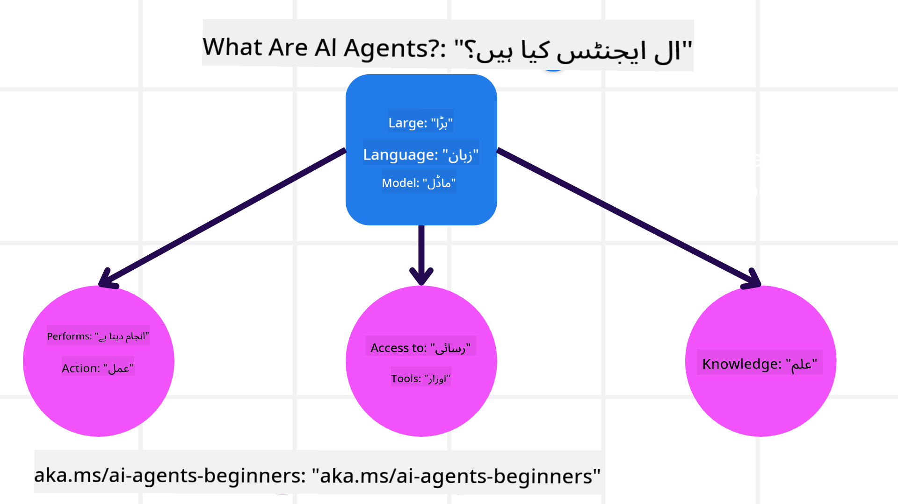
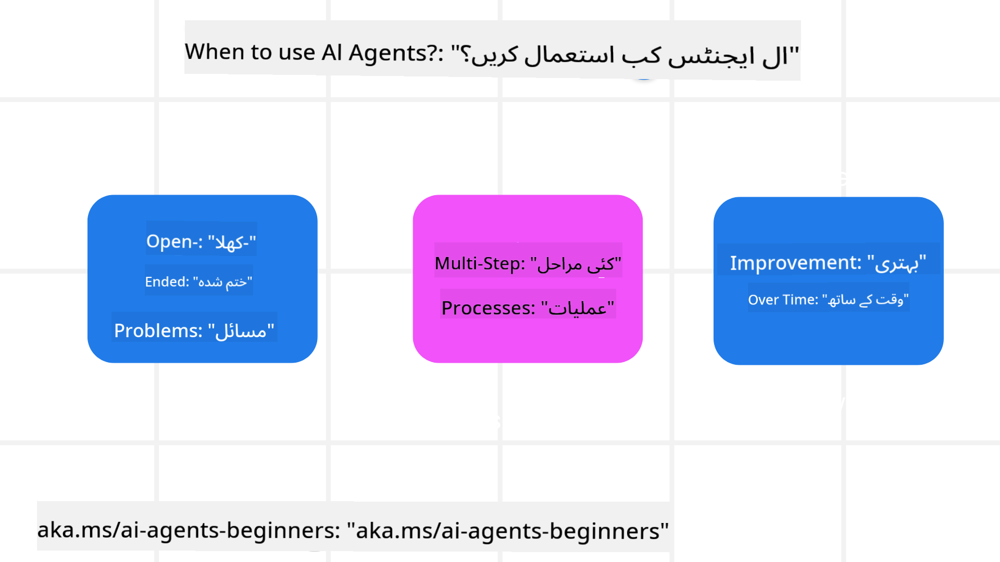

<!--
CO_OP_TRANSLATOR_METADATA:
{
  "original_hash": "d84943abc8f001ad4670418d32c2d899",
  "translation_date": "2025-07-12T08:01:51+00:00",
  "source_file": "01-intro-to-ai-agents/README.md",
  "language_code": "ur"
}
-->
دوسرے سیکھنے والوں اور AI ایجنٹ بنانے والوں سے ملنے کے لیے شامل ہوں اور اس کورس کے بارے میں جو بھی سوالات ہوں پوچھیں۔

اس کورس کا آغاز کرنے کے لیے، ہم پہلے یہ بہتر سمجھیں گے کہ AI ایجنٹس کیا ہیں اور ہم انہیں اپنے بنائے گئے ایپلیکیشنز اور ورک فلو میں کیسے استعمال کر سکتے ہیں۔

## تعارف

یہ سبق درج ذیل موضوعات پر مشتمل ہے:

- AI ایجنٹس کیا ہیں اور ایجنٹس کی مختلف اقسام کون سی ہیں؟
- AI ایجنٹس کے لیے بہترین استعمال کے کیسز کون سے ہیں اور یہ ہماری کس طرح مدد کر سکتے ہیں؟
- ایجنٹک حل ڈیزائن کرتے وقت کچھ بنیادی اجزاء کیا ہوتے ہیں؟

## سیکھنے کے مقاصد
اس سبق کو مکمل کرنے کے بعد، آپ کو یہ قابل ہونا چاہیے کہ:

- AI ایجنٹ کے تصورات کو سمجھیں اور یہ دیگر AI حل سے کیسے مختلف ہیں۔
- AI ایجنٹس کو مؤثر طریقے سے استعمال کریں۔
- صارفین اور گاہکوں دونوں کے لیے ایجنٹک حل مؤثر طریقے سے ڈیزائن کریں۔

## AI ایجنٹس کی تعریف اور AI ایجنٹس کی اقسام

### AI ایجنٹس کیا ہیں؟

AI ایجنٹس وہ **سسٹمز** ہیں جو **بڑے زبان کے ماڈلز (LLMs)** کو **عمل انجام دینے** کے قابل بناتے ہیں، ان کی صلاحیتوں کو بڑھاتے ہوئے LLMs کو **ٹولز** اور **علم** تک رسائی دیتے ہیں۔

آئیے اس تعریف کو چھوٹے حصوں میں تقسیم کرتے ہیں:

- **سسٹم** - ایجنٹس کو صرف ایک جزو کے طور پر نہیں بلکہ کئی اجزاء کے نظام کے طور پر سوچنا ضروری ہے۔ بنیادی سطح پر، AI ایجنٹ کے اجزاء یہ ہیں:
  - **ماحول** - وہ مخصوص جگہ جہاں AI ایجنٹ کام کر رہا ہوتا ہے۔ مثال کے طور پر، اگر ہمارے پاس ایک سفر بکنگ AI ایجنٹ ہے، تو ماحول وہ سفر بکنگ سسٹم ہو سکتا ہے جسے AI ایجنٹ کام مکمل کرنے کے لیے استعمال کرتا ہے۔
  - **سینسرز** - ماحول میں معلومات ہوتی ہیں اور یہ فیڈبیک فراہم کرتا ہے۔ AI ایجنٹس سینسرز کا استعمال کر کے ماحول کی موجودہ حالت کے بارے میں معلومات جمع اور تشریح کرتے ہیں۔ سفر بکنگ ایجنٹ کی مثال میں، سفر بکنگ سسٹم ہوٹل کی دستیابی یا پروازوں کی قیمتوں جیسی معلومات فراہم کر سکتا ہے۔
  - **ایکچیویٹرز** - جب AI ایجنٹ ماحول کی موجودہ حالت حاصل کر لیتا ہے، تو وہ موجودہ کام کے لیے فیصلہ کرتا ہے کہ ماحول کو تبدیل کرنے کے لیے کون سا عمل انجام دینا ہے۔ سفر بکنگ ایجنٹ کے لیے، یہ صارف کے لیے دستیاب کمرہ بک کرنا ہو سکتا ہے۔

**بڑے زبان کے ماڈلز** - ایجنٹس کا تصور LLMs کے بننے سے پہلے بھی موجود تھا۔ LLMs کے ساتھ AI ایجنٹس بنانے کا فائدہ یہ ہے کہ یہ انسانی زبان اور ڈیٹا کی تشریح کر سکتے ہیں۔ یہ صلاحیت LLMs کو ماحول کی معلومات کو سمجھنے اور ماحول کو تبدیل کرنے کے لیے منصوبہ بنانے کے قابل بناتی ہے۔

**عمل انجام دینا** - AI ایجنٹ سسٹمز کے باہر، LLMs صرف اس حد تک محدود ہوتے ہیں کہ وہ صارف کے پرامپٹ کی بنیاد پر مواد یا معلومات تیار کریں۔ AI ایجنٹ سسٹمز کے اندر، LLMs صارف کی درخواست کی تشریح کر کے اور اپنے ماحول میں دستیاب ٹولز کا استعمال کر کے کام انجام دے سکتے ہیں۔

**ٹولز تک رسائی** - LLM کو کون سے ٹولز تک رسائی حاصل ہے، یہ 1) اس ماحول سے طے ہوتا ہے جس میں وہ کام کر رہا ہے اور 2) AI ایجنٹ کے ڈویلپر سے۔ ہمارے سفر ایجنٹ کی مثال میں، ایجنٹ کے ٹولز بکنگ سسٹم میں دستیاب آپریشنز تک محدود ہیں، اور/یا ڈویلپر ایجنٹ کی فلائٹس تک رسائی محدود کر سکتا ہے۔

**میموری + علم** - میموری مختصر مدت کی ہو سکتی ہے، جیسا کہ صارف اور ایجنٹ کے درمیان گفتگو کے سیاق و سباق میں۔ طویل مدت میں، ماحول کی فراہم کردہ معلومات کے علاوہ، AI ایجنٹس دیگر سسٹمز، سروسز، ٹولز، اور حتیٰ کہ دیگر ایجنٹس سے بھی علم حاصل کر سکتے ہیں۔ سفر ایجنٹ کی مثال میں، یہ علم صارف کی سفر کی ترجیحات کی معلومات ہو سکتی ہے جو کسٹمر ڈیٹا بیس میں موجود ہو۔

### ایجنٹس کی مختلف اقسام

اب جب کہ ہمارے پاس AI ایجنٹس کی عمومی تعریف ہے، آئیے کچھ مخصوص ایجنٹ اقسام دیکھتے ہیں اور یہ سفر بکنگ AI ایجنٹ میں کیسے لاگو ہوں گے۔

| **ایجنٹ کی قسم**               | **تفصیل**                                                                                                                        | **مثال**                                                                                                                                                                                                                   |
| ----------------------------- | -------------------------------------------------------------------------------------------------------------------------------- | --------------------------------------------------------------------------------------------------------------------------------------------------------------------------------------------------------------------------- |
| **سادہ ریفلیکس ایجنٹس**       | پہلے سے طے شدہ قواعد کی بنیاد پر فوری عمل انجام دیتے ہیں۔                                                                         | سفر ایجنٹ ای میل کے سیاق و سباق کی تشریح کرتا ہے اور سفر کی شکایات کو کسٹمر سروس کو بھیج دیتا ہے۔                                                                                                                          |
| **ماڈل پر مبنی ریفلیکس ایجنٹس** | دنیا کے ماڈل اور اس ماڈل میں تبدیلیوں کی بنیاد پر عمل انجام دیتے ہیں۔                                                             | سفر ایجنٹ تاریخی قیمتوں کے ڈیٹا تک رسائی کی بنیاد پر قیمت میں نمایاں تبدیلیوں والے راستوں کو ترجیح دیتا ہے۔                                                                                                             |
| **مقصد پر مبنی ایجنٹس**        | مخصوص مقاصد حاصل کرنے کے لیے منصوبے بناتے ہیں، مقصد کی تشریح کر کے اور اسے حاصل کرنے کے لیے عمل کا تعین کرتے ہیں۔                  | سفر ایجنٹ موجودہ مقام سے منزل تک سفر کے لیے ضروری انتظامات (کار، پبلک ٹرانزٹ، پروازیں) کا تعین کر کے سفر بک کرتا ہے۔                                                                                                         |
| **یوٹیلیٹی پر مبنی ایجنٹس**    | ترجیحات کو مدنظر رکھتے ہوئے عددی طور پر سودے بازی کرتے ہیں تاکہ مقاصد حاصل کیے جا سکیں۔                                           | سفر ایجنٹ سفر بک کرتے وقت سہولت اور قیمت کے درمیان توازن قائم کر کے زیادہ سے زیادہ فائدہ حاصل کرتا ہے۔                                                                                                                     |
| **سیکھنے والے ایجنٹس**         | وقت کے ساتھ بہتر ہوتے ہیں، فیڈبیک کا جواب دے کر اور عمل کو ایڈجسٹ کر کے۔                                                           | سفر ایجنٹ بعد از سفر سروے سے صارف کی رائے استعمال کر کے مستقبل کی بکنگز میں بہتری لاتا ہے۔                                                                                                                                  |
| **مرتب شدہ ایجنٹس**            | کئی ایجنٹس پر مشتمل ایک درجہ بندی شدہ نظام، جہاں اعلیٰ سطح کے ایجنٹس کاموں کو ذیلی کاموں میں تقسیم کرتے ہیں تاکہ نچلے سطح کے ایجنٹس مکمل کریں۔ | سفر ایجنٹ ایک سفر منسوخ کرتا ہے، کام کو ذیلی کاموں (مثلاً مخصوص بکنگز منسوخ کرنا) میں تقسیم کر کے نچلے سطح کے ایجنٹس کو مکمل کرواتا ہے، اور پھر اعلیٰ سطح کے ایجنٹ کو رپورٹ کرتا ہے۔                                         |
| **کثیر ایجنٹ سسٹمز (MAS)**     | ایجنٹس خود مختار طور پر کام مکمل کرتے ہیں، چاہے تعاون سے ہوں یا مقابلے میں۔                                                        | تعاون: متعدد ایجنٹس مخصوص سفر کی خدمات جیسے ہوٹل، پروازیں، اور تفریح بک کرتے ہیں۔ مقابلہ: متعدد ایجنٹس مشترکہ ہوٹل بکنگ کیلنڈر پر قابو پانے اور گاہکوں کو ہوٹل میں بک کرنے کے لیے مقابلہ کرتے ہیں۔                        |

## AI ایجنٹس کب استعمال کریں

پچھلے حصے میں، ہم نے سفر ایجنٹ کے استعمال کے کیس کی مثال دی تاکہ دکھایا جا سکے کہ مختلف قسم کے ایجنٹس سفر بکنگ کے مختلف منظرناموں میں کیسے استعمال ہو سکتے ہیں۔ ہم اس ایپلیکیشن کو پورے کورس میں استعمال کرتے رہیں گے۔

آئیے دیکھتے ہیں کہ AI ایجنٹس کے لیے کون سے استعمال کے کیسز سب سے زیادہ مناسب ہیں:

- **کھلے مسائل** - LLM کو یہ فیصلہ کرنے دینا کہ کام مکمل کرنے کے لیے کون سے اقدامات درکار ہیں کیونکہ اسے ہمیشہ ورک فلو میں ہارڈ کوڈ نہیں کیا جا سکتا۔
- **کئی مراحل کے عمل** - ایسے کام جن میں پیچیدگی کی سطح ہوتی ہے جہاں AI ایجنٹ کو ایک سے زیادہ بار ٹولز یا معلومات استعمال کرنی پڑتی ہے، نہ کہ صرف ایک بار معلومات حاصل کرنا۔
- **وقت کے ساتھ بہتری** - ایسے کام جہاں ایجنٹ وقت کے ساتھ بہتر ہو سکتا ہے، چاہے وہ اپنے ماحول سے فیڈبیک لے کر ہو یا صارفین سے، تاکہ بہتر فائدہ فراہم کر سکے۔

ہم AI ایجنٹس کے استعمال کے مزید پہلوؤں کو "Building Trustworthy AI Agents" سبق میں کور کریں گے۔

## ایجنٹک حل کی بنیادی باتیں

### ایجنٹ کی ترقی

AI ایجنٹ سسٹم ڈیزائن کرنے کا پہلا قدم ٹولز، عمل، اور رویوں کی تعریف کرنا ہے۔ اس کورس میں، ہم **Azure AI Agent Service** کا استعمال کرتے ہوئے اپنے ایجنٹس کی تعریف پر توجہ دیتے ہیں۔ یہ خصوصیات پیش کرتا ہے جیسے:

- OpenAI، Mistral، اور Llama جیسے اوپن ماڈلز کا انتخاب
- Tripadvisor جیسے فراہم کنندگان کے ذریعے لائسنس یافتہ ڈیٹا کا استعمال
- معیاری OpenAPI 3.0 ٹولز کا استعمال

### ایجنٹک پیٹرنز

LLMs کے ساتھ بات چیت پرامپٹس کے ذریعے ہوتی ہے۔ AI ایجنٹس کی نیم خود مختار نوعیت کی وجہ سے، ماحول میں تبدیلی کے بعد ہمیشہ دستی طور پر LLM کو دوبارہ پرامپٹ کرنا ممکن یا ضروری نہیں ہوتا۔ ہم **ایجنٹک پیٹرنز** استعمال کرتے ہیں جو ہمیں LLM کو کئی مراحل میں زیادہ اسکیل ایبل طریقے سے پرامپٹ کرنے کی اجازت دیتے ہیں۔

یہ کورس موجودہ مقبول ایجنٹک پیٹرنز میں تقسیم کیا گیا ہے۔

### ایجنٹک فریم ورکس

ایجنٹک فریم ورکس ڈویلپرز کو کوڈ کے ذریعے ایجنٹک پیٹرنز نافذ کرنے کی اجازت دیتے ہیں۔ یہ فریم ورکس ٹیمپلیٹس، پلگ انز، اور ٹولز فراہم کرتے ہیں تاکہ AI ایجنٹس کے درمیان بہتر تعاون ممکن ہو۔ یہ فوائد AI ایجنٹ سسٹمز کی بہتر نگرانی اور مسئلہ حل کرنے کی صلاحیت فراہم کرتے ہیں۔

اس کورس میں، ہم تحقیقی بنیاد پر مبنی AutoGen فریم ورک اور Semantic Kernel کے تیار شدہ Agent فریم ورک کو دریافت کریں گے۔

## پچھلا سبق

[Course Setup](../00-course-setup/README.md)

## اگلا سبق

[Exploring Agentic Frameworks](../02-explore-agentic-frameworks/README.md)

**دستخطی نوٹ**:  
یہ دستاویز AI ترجمہ سروس [Co-op Translator](https://github.com/Azure/co-op-translator) کے ذریعے ترجمہ کی گئی ہے۔ اگرچہ ہم درستگی کے لیے کوشاں ہیں، براہ کرم آگاہ رہیں کہ خودکار ترجمے میں غلطیاں یا عدم درستیاں ہو سکتی ہیں۔ اصل دستاویز اپنی مادری زبان میں معتبر ماخذ سمجھی جانی چاہیے۔ اہم معلومات کے لیے پیشہ ور انسانی ترجمہ کی سفارش کی جاتی ہے۔ اس ترجمے کے استعمال سے پیدا ہونے والی کسی بھی غلط فہمی یا غلط تشریح کی ذمہ داری ہم پر عائد نہیں ہوتی۔