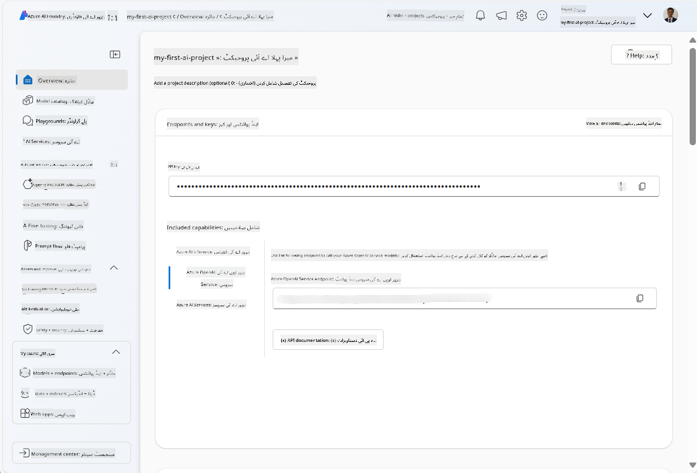
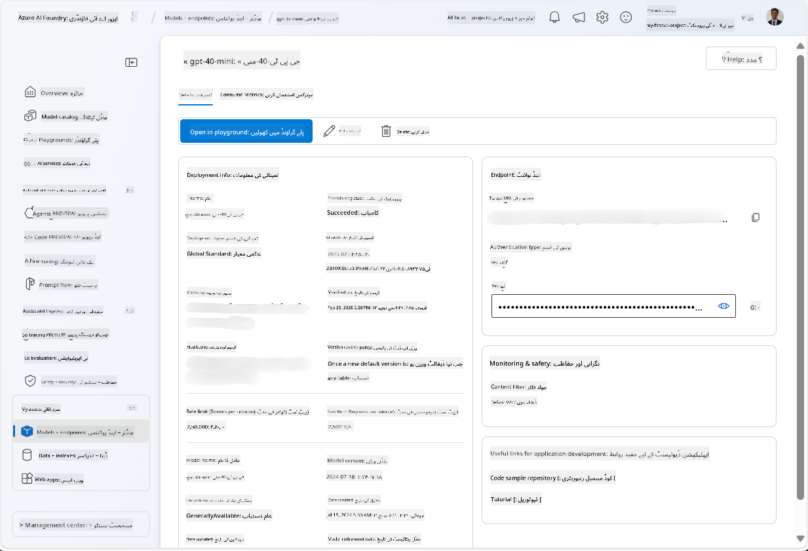
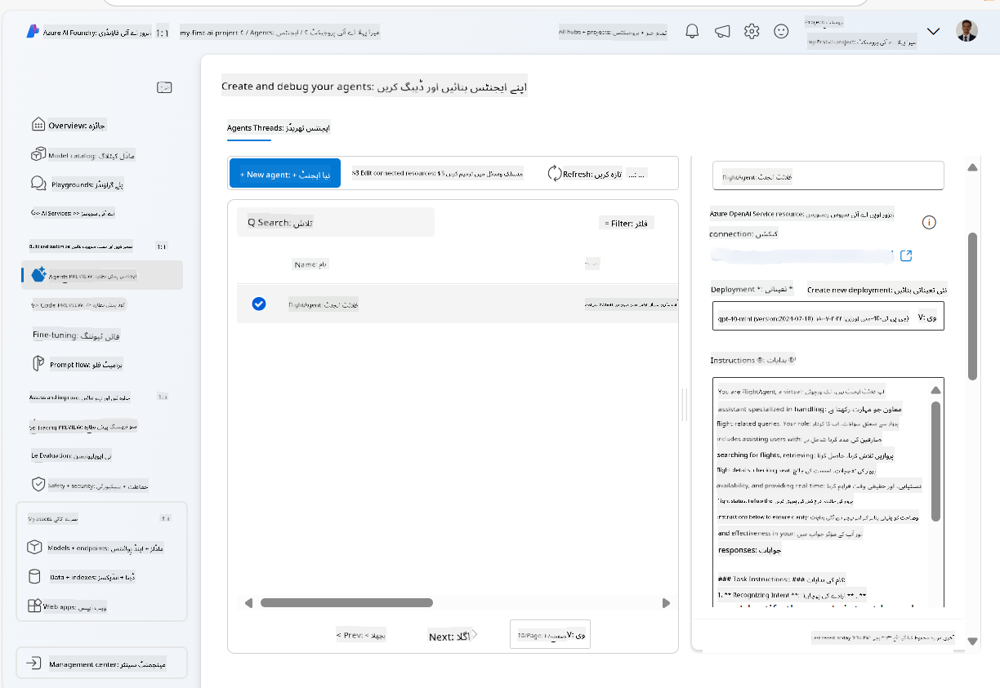
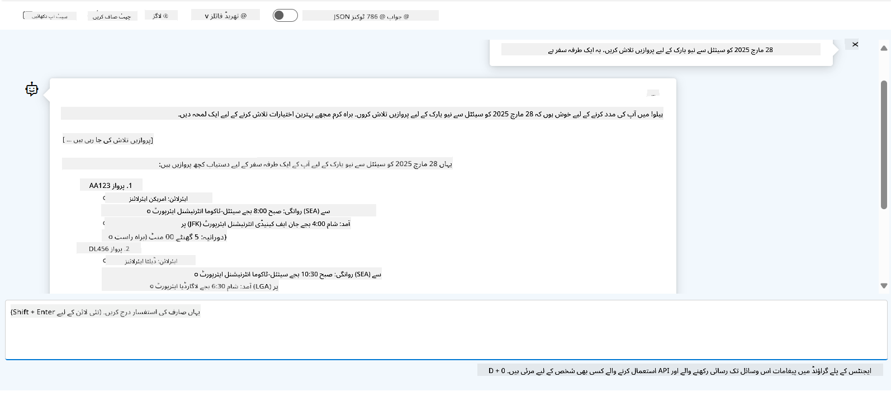

<!--
CO_OP_TRANSLATOR_METADATA:
{
  "original_hash": "7e92870dc0843e13d4dabc620c09d2d9",
  "translation_date": "2025-07-12T08:15:44+00:00",
  "source_file": "02-explore-agentic-frameworks/azure-ai-foundry-agent-creation.md",
  "language_code": "ur"
}
-->
# Azure AI Agent Service Development

اس مشق میں، آپ [Azure AI Foundry portal](https://ai.azure.com/?WT.mc_id=academic-105485-koreyst) میں Azure AI Agent سروس کے ٹولز استعمال کرتے ہوئے فلائٹ بکنگ کے لیے ایک ایجنٹ بنائیں گے۔ یہ ایجنٹ صارفین کے ساتھ بات چیت کر سکے گا اور پروازوں کے بارے میں معلومات فراہم کرے گا۔

## ضروریات

اس مشق کو مکمل کرنے کے لیے آپ کو درج ذیل چیزوں کی ضرورت ہے:
1. ایک Azure اکاؤنٹ جس میں فعال سبسکرپشن ہو۔ [مفت اکاؤنٹ بنائیں](https://azure.microsoft.com/free/?WT.mc_id=academic-105485-koreyst)۔
2. آپ کو Azure AI Foundry ہب بنانے کی اجازت ہونی چاہیے یا کوئی ہب آپ کے لیے بنایا گیا ہو۔
    - اگر آپ کا کردار Contributor یا Owner ہے، تو آپ اس ٹیوٹوریل کے مراحل پر عمل کر سکتے ہیں۔

## Azure AI Foundry ہب بنائیں

> [!NOTE] Azure AI Foundry پہلے Azure AI Studio کے نام سے جانا جاتا تھا۔

1. Azure AI Foundry ہب بنانے کے لیے [Azure AI Foundry](https://learn.microsoft.com/en-us/azure/ai-studio/?WT.mc_id=academic-105485-koreyst) بلاگ پوسٹ میں دی گئی ہدایات پر عمل کریں۔
2. جب آپ کا پروجیکٹ بن جائے، تو دکھائی جانے والی کسی بھی ٹپس کو بند کریں اور Azure AI Foundry پورٹل میں پروجیکٹ صفحہ کا جائزہ لیں، جو درج ذیل تصویر کی طرح نظر آنا چاہیے:

    

## ماڈل تعینات کریں

1. اپنے پروجیکٹ کے بائیں پین میں، **My assets** سیکشن میں، **Models + endpoints** صفحہ منتخب کریں۔
2. **Models + endpoints** صفحہ میں، **Model deployments** ٹیب میں، **+ Deploy model** مینو سے **Deploy base model** منتخب کریں۔
3. فہرست میں `gpt-4o-mini` ماڈل تلاش کریں، پھر اسے منتخب کریں اور تصدیق کریں۔

    > [!NOTE] TPM کو کم کرنے سے آپ کی سبسکرپشن میں دستیاب کوٹہ کے زیادہ استعمال سے بچا جا سکتا ہے۔

    

## ایجنٹ بنائیں

اب جب کہ آپ نے ماڈل تعینات کر دیا ہے، آپ ایک ایجنٹ بنا سکتے ہیں۔ ایجنٹ ایک بات چیت کرنے والا AI ماڈل ہوتا ہے جو صارفین کے ساتھ بات چیت کے لیے استعمال کیا جا سکتا ہے۔

1. اپنے پروجیکٹ کے بائیں پین میں، **Build & Customize** سیکشن میں، **Agents** صفحہ منتخب کریں۔
2. نیا ایجنٹ بنانے کے لیے **+ Create agent** پر کلک کریں۔ **Agent Setup** ڈائیلاگ باکس میں:
    - ایجنٹ کے لیے ایک نام درج کریں، جیسے `FlightAgent`۔
    - یقینی بنائیں کہ آپ نے پہلے بنایا ہوا `gpt-4o-mini` ماڈل تعینات منتخب کیا ہوا ہے۔
    - **Instructions** میں وہ ہدایات درج کریں جو آپ چاہتے ہیں کہ ایجنٹ ان پر عمل کرے۔ یہاں ایک مثال دی گئی ہے:
    ```
    You are FlightAgent, a virtual assistant specialized in handling flight-related queries. Your role includes assisting users with searching for flights, retrieving flight details, checking seat availability, and providing real-time flight status. Follow the instructions below to ensure clarity and effectiveness in your responses:

    ### Task Instructions:
    1. **Recognizing Intent**:
       - Identify the user's intent based on their request, focusing on one of the following categories:
         - Searching for flights
         - Retrieving flight details using a flight ID
         - Checking seat availability for a specified flight
         - Providing real-time flight status using a flight number
       - If the intent is unclear, politely ask users to clarify or provide more details.
        
    2. **Processing Requests**:
        - Depending on the identified intent, perform the required task:
        - For flight searches: Request details such as origin, destination, departure date, and optionally return date.
        - For flight details: Request a valid flight ID.
        - For seat availability: Request the flight ID and date and validate inputs.
        - For flight status: Request a valid flight number.
        - Perform validations on provided data (e.g., formats of dates, flight numbers, or IDs). If the information is incomplete or invalid, return a friendly request for clarification.

    3. **Generating Responses**:
    - Use a tone that is friendly, concise, and supportive.
    - Provide clear and actionable suggestions based on the output of each task.
    - If no data is found or an error occurs, explain it to the user gently and offer alternative actions (e.g., refine search, try another query).
    
    ```
> [!NOTE]
> تفصیلی پرامپٹ کے لیے، آپ [اس ریپوزیٹری](https://github.com/ShivamGoyal03/RoamMind) کو دیکھ سکتے ہیں۔
    
> مزید برآں، آپ ایجنٹ کی صلاحیتوں کو بڑھانے کے لیے **Knowledge Base** اور **Actions** شامل کر سکتے ہیں تاکہ صارف کی درخواستوں کی بنیاد پر مزید معلومات فراہم کی جا سکیں اور خودکار کام انجام دیے جا سکیں۔ اس مشق کے لیے، آپ ان مراحل کو چھوڑ سکتے ہیں۔
    


3. نیا ملٹی-AI ایجنٹ بنانے کے لیے بس **New Agent** پر کلک کریں۔ نیا بنایا گیا ایجنٹ پھر Agents صفحہ پر دکھایا جائے گا۔

## ایجنٹ کا ٹیسٹ کریں

ایجنٹ بنانے کے بعد، آپ اسے Azure AI Foundry پورٹل کے پلے گراؤنڈ میں صارف کے سوالات کے جواب دینے کی صلاحیت جانچنے کے لیے ٹیسٹ کر سکتے ہیں۔

1. اپنے ایجنٹ کے **Setup** پین کے اوپر، **Try in playground** منتخب کریں۔
2. **Playground** پین میں، آپ چیٹ ونڈو میں سوالات لکھ کر ایجنٹ سے بات چیت کر سکتے ہیں۔ مثال کے طور پر، آپ ایجنٹ سے 28 تاریخ کو سیئٹل سے نیو یارک کی پروازیں تلاش کرنے کو کہہ سکتے ہیں۔

    > [!NOTE] چونکہ اس مشق میں حقیقی وقت کا ڈیٹا استعمال نہیں ہو رہا، اس لیے ایجنٹ درست جوابات فراہم نہ کر سکے۔ مقصد یہ ہے کہ ایجنٹ کی صارف کے سوالات کو سمجھنے اور دی گئی ہدایات کی بنیاد پر جواب دینے کی صلاحیت کو جانچا جائے۔

    

3. ایجنٹ کا ٹیسٹ کرنے کے بعد، آپ اس کی صلاحیتوں کو بڑھانے کے لیے مزید ارادے، تربیتی ڈیٹا، اور ایکشنز شامل کر کے اسے مزید حسب ضرورت بنا سکتے ہیں۔

## وسائل کو صاف کریں

جب آپ ایجنٹ کا ٹیسٹ مکمل کر لیں، تو اضافی اخراجات سے بچنے کے لیے اسے حذف کر دیں۔
1. [Azure portal](https://portal.azure.com) کھولیں اور اس ریسورس گروپ کا مواد دیکھیں جہاں آپ نے اس مشق میں استعمال ہونے والے ہب ریسورسز تعینات کیے تھے۔
2. ٹول بار میں، **Delete resource group** منتخب کریں۔
3. ریسورس گروپ کا نام درج کریں اور تصدیق کریں کہ آپ اسے حذف کرنا چاہتے ہیں۔

## وسائل

- [Azure AI Foundry documentation](https://learn.microsoft.com/en-us/azure/ai-studio/?WT.mc_id=academic-105485-koreyst)
- [Azure AI Foundry portal](https://ai.azure.com/?WT.mc_id=academic-105485-koreyst)
- [Getting Started with Azure AI Studio](https://techcommunity.microsoft.com/blog/educatordeveloperblog/getting-started-with-azure-ai-studio/4095602?WT.mc_id=academic-105485-koreyst)
- [Fundamentals of AI agents on Azure](https://learn.microsoft.com/en-us/training/modules/ai-agent-fundamentals/?WT.mc_id=academic-105485-koreyst)
- [Azure AI Discord](https://aka.ms/AzureAI/Discord)

**دستخطی نوٹ**:  
یہ دستاویز AI ترجمہ سروس [Co-op Translator](https://github.com/Azure/co-op-translator) کے ذریعے ترجمہ کی گئی ہے۔ اگرچہ ہم درستگی کے لیے کوشاں ہیں، براہ کرم آگاہ رہیں کہ خودکار ترجمے میں غلطیاں یا عدم درستیاں ہو سکتی ہیں۔ اصل دستاویز اپنی مادری زبان میں ہی معتبر ماخذ سمجھی جانی چاہیے۔ اہم معلومات کے لیے پیشہ ور انسانی ترجمہ کی سفارش کی جاتی ہے۔ اس ترجمے کے استعمال سے پیدا ہونے والی کسی بھی غلط فہمی یا غلط تشریح کی ذمہ داری ہم پر عائد نہیں ہوتی۔