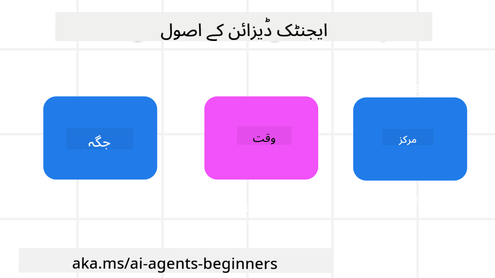

<!--
CO_OP_TRANSLATOR_METADATA:
{
  "original_hash": "4c46e4ff9e349c521e2b0b17f51afa64",
  "translation_date": "2025-08-29T09:37:24+00:00",
  "source_file": "03-agentic-design-patterns/README.md",
  "language_code": "ur"
}
-->

> _(اوپر دی گئی تصویر پر کلک کریں تاکہ اس سبق کی ویڈیو دیکھ سکیں)_
# AI ایجنٹک ڈیزائن اصول

## تعارف

AI ایجنٹک سسٹمز بنانے کے بارے میں سوچنے کے کئی طریقے ہیں۔ چونکہ جنریٹو AI ڈیزائن میں ابہام ایک خصوصیت ہے، نقص نہیں، انجینئرز کے لیے یہ فیصلہ کرنا کبھی کبھار مشکل ہو جاتا ہے کہ کہاں سے شروع کریں۔ ہم نے انسانی مرکزیت والے UX ڈیزائن اصولوں کا ایک مجموعہ تیار کیا ہے تاکہ ڈویلپرز کو صارف مرکزیت والے ایجنٹک سسٹمز بنانے میں مدد دی جا سکے جو ان کے کاروباری ضروریات کو پورا کریں۔ یہ ڈیزائن اصول ایک تجویز کردہ آرکیٹیکچر نہیں ہیں بلکہ ان ٹیموں کے لیے ایک نقطہ آغاز ہیں جو ایجنٹ کے تجربات کی تعریف اور تعمیر کر رہی ہیں۔

عام طور پر، ایجنٹس کو چاہیے کہ:

- انسانی صلاحیتوں کو وسیع اور بڑھائیں (آئیڈیاز دینا، مسائل حل کرنا، خودکار عمل وغیرہ)
- علم کے خلا کو پُر کریں (مجھے علم کے شعبوں پر تیزی سے آگاہ کریں، ترجمہ وغیرہ)
- تعاون کو آسان بنائیں اور ان طریقوں میں مدد کریں جن میں ہم بطور افراد دوسروں کے ساتھ کام کرنا پسند کرتے ہیں
- ہمیں اپنی بہتر شکل میں تبدیل کریں (جیسے، زندگی کے کوچ/کام کے منتظم، ہمیں جذباتی نظم و ضبط اور ذہنی سکون کی مہارتیں سکھانے میں مدد دینا، لچک پیدا کرنا وغیرہ)

## اس سبق میں شامل ہوگا

- ایجنٹک ڈیزائن اصول کیا ہیں
- ان ڈیزائن اصولوں کو نافذ کرتے وقت کون سی رہنما خطوط پر عمل کرنا چاہیے
- ڈیزائن اصولوں کے استعمال کی کچھ مثالیں

## سیکھنے کے اہداف

اس سبق کو مکمل کرنے کے بعد، آپ قابل ہوں گے:

1. ایجنٹک ڈیزائن اصولوں کی وضاحت کریں
2. ایجنٹک ڈیزائن اصولوں کے استعمال کے رہنما خطوط کی وضاحت کریں
3. ایجنٹک ڈیزائن اصولوں کا استعمال کرتے ہوئے ایجنٹ بنانے کا طریقہ سمجھیں

## ایجنٹک ڈیزائن اصول

### ایجنٹ (جگہ)

یہ وہ ماحول ہے جس میں ایجنٹ کام کرتا ہے۔ یہ اصول ہمیں جسمانی اور ڈیجیٹل دنیا میں ایجنٹس کو ڈیزائن کرنے کے بارے میں رہنمائی فراہم کرتے ہیں۔

- **جڑنا، ختم نہ کرنا** – لوگوں کو دوسرے لوگوں، واقعات، اور قابل عمل علم سے جوڑنے میں مدد کریں تاکہ تعاون اور تعلق کو ممکن بنایا جا سکے۔
- ایجنٹس واقعات، علم، اور لوگوں کو جوڑنے میں مدد کرتے ہیں۔
- ایجنٹس لوگوں کو قریب لاتے ہیں۔ انہیں لوگوں کی جگہ لینے یا ان کی اہمیت کو کم کرنے کے لیے ڈیزائن نہیں کیا گیا۔
- **آسانی سے قابل رسائی لیکن کبھی کبھار غیر مرئی** – ایجنٹ زیادہ تر پس منظر میں کام کرتا ہے اور صرف اس وقت ہمیں اشارہ دیتا ہے جب یہ متعلقہ اور مناسب ہو۔
  - ایجنٹ کسی بھی ڈیوائس یا پلیٹ فارم پر مجاز صارفین کے لیے آسانی سے دریافت اور قابل رسائی ہے۔
  - ایجنٹ ملٹی موڈل ان پٹ اور آؤٹ پٹ (آواز، متن، وغیرہ) کی حمایت کرتا ہے۔
  - ایجنٹ صارف کی ضروریات کو محسوس کرتے ہوئے پیش منظر اور پس منظر کے درمیان، فعال اور غیر فعال کے درمیان بغیر کسی رکاوٹ کے منتقل ہو سکتا ہے۔
  - ایجنٹ غیر مرئی شکل میں کام کر سکتا ہے، لیکن اس کا پس منظر عمل کا راستہ اور دوسرے ایجنٹس کے ساتھ تعاون صارف کے لیے شفاف اور قابل کنٹرول ہے۔

### ایجنٹ (وقت)

یہ وہ طریقہ ہے جس میں ایجنٹ وقت کے ساتھ کام کرتا ہے۔ یہ اصول ہمیں ماضی، حال، اور مستقبل میں ایجنٹس کے تعامل کو ڈیزائن کرنے کے بارے میں رہنمائی فراہم کرتے ہیں۔

- **ماضی**: تاریخ پر غور کرنا جو حالت اور سیاق و سباق دونوں کو شامل کرتی ہے۔
  - ایجنٹ زیادہ متعلقہ نتائج فراہم کرتا ہے جو صرف واقعات، لوگوں، یا حالتوں کے بجائے بھرپور تاریخی ڈیٹا کے تجزیے پر مبنی ہوتے ہیں۔
  - ایجنٹ ماضی کے واقعات سے تعلقات پیدا کرتا ہے اور موجودہ حالات میں مشغول ہونے کے لیے یادداشت پر فعال طور پر غور کرتا ہے۔
- **اب**: اطلاع دینے سے زیادہ اشارہ دینا۔
  - ایجنٹ لوگوں کے ساتھ تعامل کرنے کے لیے ایک جامع طریقہ اختیار کرتا ہے۔ جب کوئی واقعہ ہوتا ہے، ایجنٹ جامد اطلاع یا دیگر رسمی جامد شکل سے آگے بڑھتا ہے۔ ایجنٹ صارف کی توجہ کو صحیح وقت پر مرکوز کرنے کے لیے فلو کو آسان بنا سکتا ہے یا متحرک طور پر اشارے پیدا کر سکتا ہے۔
  - ایجنٹ معلومات کو سیاق و سباق کے ماحول، سماجی اور ثقافتی تبدیلیوں کے مطابق اور صارف کے ارادے کے مطابق فراہم کرتا ہے۔
  - ایجنٹ کا تعامل بتدریج ہو سکتا ہے، طویل مدتی میں صارفین کو بااختیار بنانے کے لیے پیچیدگی میں ترقی پذیر/بڑھتا ہوا۔
- **مستقبل**: ڈھلنا اور ترقی کرنا۔
  - ایجنٹ مختلف ڈیوائسز، پلیٹ فارمز، اور طریقوں کے مطابق ڈھلتا ہے۔
  - ایجنٹ صارف کے رویے، رسائی کی ضروریات کے مطابق ڈھلتا ہے اور آزادانہ طور پر حسب ضرورت ہے۔
  - ایجنٹ مسلسل صارف کے تعامل کے ذریعے تشکیل پاتا ہے اور ترقی کرتا ہے۔

### ایجنٹ (مرکز)

یہ ایجنٹ کے ڈیزائن کے مرکز میں کلیدی عناصر ہیں۔

- **غیر یقینی کو قبول کریں لیکن اعتماد قائم کریں**۔
  - ایجنٹ کی غیر یقینی کی ایک خاص سطح متوقع ہے۔ غیر یقینی ایجنٹ ڈیزائن کا ایک کلیدی عنصر ہے۔
  - اعتماد اور شفافیت ایجنٹ ڈیزائن کی بنیادی پرتیں ہیں۔
  - انسان اس بات پر قابو رکھتے ہیں کہ ایجنٹ کب آن/آف ہے اور ایجنٹ کی حیثیت ہر وقت واضح طور پر نظر آتی ہے۔

## ان اصولوں کو نافذ کرنے کے رہنما خطوط

جب آپ پچھلے ڈیزائن اصولوں کا استعمال کر رہے ہوں، تو درج ذیل رہنما خطوط استعمال کریں:

1. **شفافیت**: صارف کو مطلع کریں کہ AI شامل ہے، یہ کیسے کام کرتا ہے (بشمول ماضی کے اعمال)، اور سسٹم کو تبدیل کرنے اور اس پر رائے دینے کا طریقہ۔
2. **کنٹرول**: صارف کو سسٹم اور اس کی خصوصیات کو حسب ضرورت بنانے، ترجیحات کی وضاحت کرنے اور ذاتی نوعیت دینے کی اجازت دیں (بشمول بھولنے کی صلاحیت)۔
3. **مطابقت**: ڈیوائسز اور اینڈ پوائنٹس پر مستقل، ملٹی موڈل تجربات کا مقصد رکھیں۔ جہاں ممکن ہو، مانوس UI/UX عناصر استعمال کریں (جیسے، آواز کے تعامل کے لیے مائیکروفون آئیکن) اور صارف کے ذہنی دباؤ کو کم سے کم کریں (جیسے، مختصر جوابات، بصری امداد، اور 'مزید جانیں' مواد کا مقصد رکھیں)۔

## ان اصولوں اور رہنما خطوط کا استعمال کرتے ہوئے ٹریول ایجنٹ ڈیزائن کرنے کا طریقہ

فرض کریں کہ آپ ایک ٹریول ایجنٹ ڈیزائن کر رہے ہیں، یہاں یہ ہے کہ آپ ڈیزائن اصولوں اور رہنما خطوط کے استعمال کے بارے میں کیسے سوچ سکتے ہیں:

1. **شفافیت** – صارف کو بتائیں کہ ٹریول ایجنٹ ایک AI سے چلنے والا ایجنٹ ہے۔ شروع کرنے کے لیے کچھ بنیادی ہدایات فراہم کریں (جیسے، ایک "ہیلو" پیغام، نمونہ پرامپٹس)۔ اسے پروڈکٹ صفحہ پر واضح طور پر دستاویز کریں۔ وہ پرامپٹس دکھائیں جو صارف نے ماضی میں پوچھے ہیں۔ واضح کریں کہ رائے دینے کا طریقہ کیا ہے (تھمبز اپ اور ڈاؤن، فیڈبیک بھیجنے کا بٹن، وغیرہ)۔ واضح طور پر بیان کریں کہ آیا ایجنٹ کے استعمال یا موضوع کی پابندیاں ہیں۔
2. **کنٹرول** – یہ واضح کریں کہ صارف ایجنٹ کو کیسے تبدیل کر سکتا ہے جب یہ سسٹم پرامپٹ جیسی چیزوں کے ساتھ تخلیق ہو چکا ہو۔ صارف کو یہ منتخب کرنے کی اجازت دیں کہ ایجنٹ کتنا تفصیلی ہو، اس کا لکھنے کا انداز، اور وہ کسی بھی موضوع پر بات نہ کرنے کی شرائط۔ صارف کو کسی بھی متعلقہ فائلوں یا ڈیٹا، پرامپٹس، اور ماضی کی گفتگو کو دیکھنے اور حذف کرنے کی اجازت دیں۔
3. **مطابقت** – یقینی بنائیں کہ شیئر پرامپٹ، فائل یا تصویر شامل کریں، اور کسی کو یا کسی چیز کو ٹیگ کرنے کے آئیکنز معیاری اور قابل شناخت ہیں۔ ایجنٹ کے ساتھ فائل اپلوڈ/شیئر کرنے کے لیے پیپر کلپ آئیکن استعمال کریں، اور گرافکس اپلوڈ کرنے کے لیے امیج آئیکن استعمال کریں۔

### AI ایجنٹک ڈیزائن پیٹرنز کے بارے میں مزید سوالات ہیں؟

[Azure AI Foundry Discord](https://aka.ms/ai-agents/discord) میں شامل ہوں تاکہ دوسرے سیکھنے والوں سے ملاقات کریں، آفس آورز میں شرکت کریں اور اپنے AI ایجنٹس کے سوالات کے جوابات حاصل کریں۔

## اضافی وسائل

## پچھلا سبق

[ایجنٹک فریم ورک کا جائزہ](../02-explore-agentic-frameworks/README.md)

## اگلا سبق

[ٹول استعمال ڈیزائن پیٹرن](../04-tool-use/README.md)

---

**ڈسکلیمر**:  
یہ دستاویز AI ترجمہ سروس [Co-op Translator](https://github.com/Azure/co-op-translator) کا استعمال کرتے ہوئے ترجمہ کی گئی ہے۔ ہم درستگی کے لیے پوری کوشش کرتے ہیں، لیکن براہ کرم آگاہ رہیں کہ خودکار ترجمے میں غلطیاں یا خامیاں ہو سکتی ہیں۔ اصل دستاویز کو اس کی اصل زبان میں مستند ذریعہ سمجھا جانا چاہیے۔ اہم معلومات کے لیے، پیشہ ور انسانی ترجمہ کی سفارش کی جاتی ہے۔ اس ترجمے کے استعمال سے پیدا ہونے والی کسی بھی غلط فہمی یا غلط تشریح کے لیے ہم ذمہ دار نہیں ہیں۔