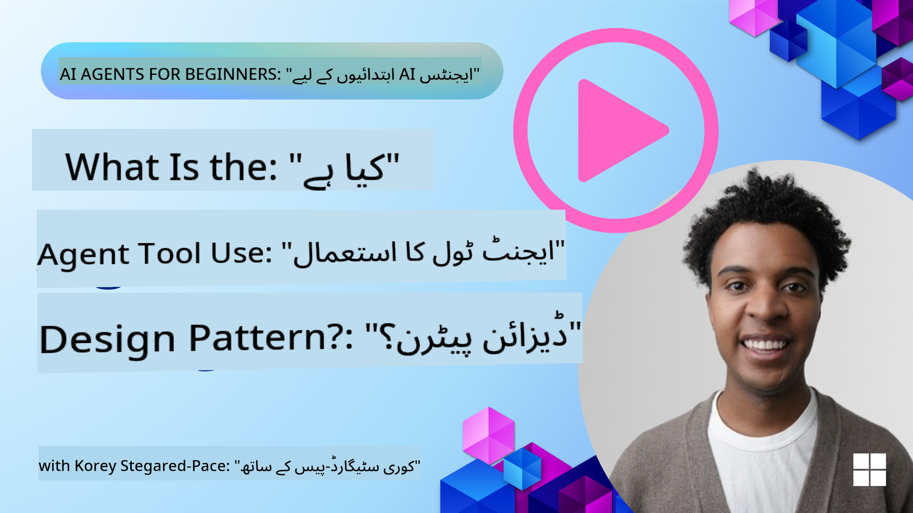
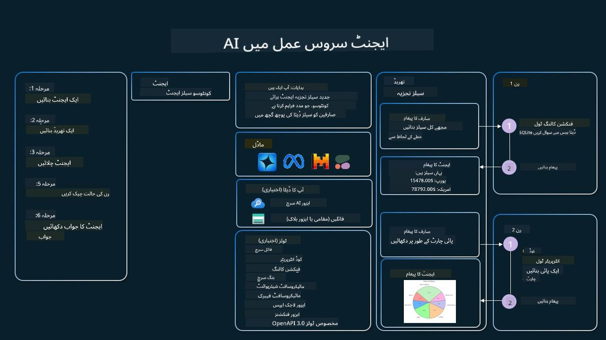

<!--
CO_OP_TRANSLATOR_METADATA:
{
  "original_hash": "88258b03f2893aa2e69eb8fb24baabbc",
  "translation_date": "2025-07-12T09:24:57+00:00",
  "source_file": "04-tool-use/README.md",
  "language_code": "ur"
}
-->
[](https://youtu.be/vieRiPRx-gI?si=cEZ8ApnT6Sus9rhn)

> _(اس سبق کی ویڈیو دیکھنے کے لیے اوپر تصویر پر کلک کریں)_

# ٹول یوز ڈیزائن پیٹرن

ٹولز دلچسپ ہوتے ہیں کیونکہ یہ AI ایجنٹس کو وسیع تر صلاحیتیں فراہم کرتے ہیں۔ ایجنٹ کے پاس محدود ایکشنز کی بجائے، ٹول شامل کرنے سے ایجنٹ اب مختلف قسم کے کام انجام دے سکتا ہے۔ اس باب میں، ہم ٹول یوز ڈیزائن پیٹرن کا جائزہ لیں گے، جو بتاتا ہے کہ AI ایجنٹس مخصوص ٹولز کو اپنے مقاصد کے حصول کے لیے کیسے استعمال کر سکتے ہیں۔

## تعارف

اس سبق میں، ہم درج ذیل سوالات کے جواب تلاش کریں گے:

- ٹول یوز ڈیزائن پیٹرن کیا ہے؟
- کن استعمال کے کیسز میں اسے لاگو کیا جا سکتا ہے؟
- اس ڈیزائن پیٹرن کو نافذ کرنے کے لیے کون سے عناصر/بلڈنگ بلاکس درکار ہیں؟
- قابل اعتماد AI ایجنٹس بنانے کے لیے ٹول یوز ڈیزائن پیٹرن کے استعمال میں کون سی خاص باتیں مدنظر رکھنی چاہئیں؟

## سیکھنے کے مقاصد

اس سبق کو مکمل کرنے کے بعد، آپ قابل ہوں گے کہ:

- ٹول یوز ڈیزائن پیٹرن اور اس کے مقصد کی وضاحت کریں۔
- ایسے استعمال کے کیسز کی نشاندہی کریں جہاں ٹول یوز ڈیزائن پیٹرن قابل اطلاق ہو۔
- ڈیزائن پیٹرن کو نافذ کرنے کے لیے ضروری کلیدی عناصر کو سمجھیں۔
- اس ڈیزائن پیٹرن کے ذریعے AI ایجنٹس کی قابل اعتمادیت کو یقینی بنانے کے لیے غور و فکر کو پہچانیں۔

## ٹول یوز ڈیزائن پیٹرن کیا ہے؟

**ٹول یوز ڈیزائن پیٹرن** LLMs کو یہ صلاحیت دیتا ہے کہ وہ مخصوص مقاصد کے حصول کے لیے بیرونی ٹولز کے ساتھ تعامل کر سکیں۔ ٹولز وہ کوڈ ہوتے ہیں جو ایجنٹ کے ذریعے چلائے جا سکتے ہیں تاکہ ایکشنز انجام دیے جا سکیں۔ ایک ٹول ایک سادہ فنکشن ہو سکتا ہے جیسے کیلکولیٹر، یا تیسری پارٹی کی سروس کے لیے API کال جیسے اسٹاک پرائس دیکھنا یا موسم کی پیش گوئی۔ AI ایجنٹس کے سیاق و سباق میں، ٹولز کو ماڈل کی جانب سے جنریٹ کیے گئے فنکشن کالز کے جواب میں ایجنٹس کے ذریعے چلانے کے لیے ڈیزائن کیا جاتا ہے۔

## کن استعمال کے کیسز میں اسے لاگو کیا جا سکتا ہے؟

AI ایجنٹس ٹولز کا استعمال کر کے پیچیدہ کام مکمل کر سکتے ہیں، معلومات حاصل کر سکتے ہیں، یا فیصلے کر سکتے ہیں۔ ٹول یوز ڈیزائن پیٹرن اکثر ایسے حالات میں استعمال ہوتا ہے جہاں بیرونی سسٹمز جیسے ڈیٹا بیس، ویب سروسز، یا کوڈ انٹرپریٹرز کے ساتھ متحرک تعامل کی ضرورت ہو۔ یہ صلاحیت مختلف استعمال کے کیسز کے لیے مفید ہے، جن میں شامل ہیں:

- **متحرک معلومات کی بازیابی:** ایجنٹس بیرونی APIs یا ڈیٹا بیس سے تازہ ترین ڈیٹا حاصل کر سکتے ہیں (مثلاً، SQLite ڈیٹا بیس سے ڈیٹا اینالیسس، اسٹاک پرائس یا موسم کی معلومات حاصل کرنا)۔
- **کوڈ کا نفاذ اور تشریح:** ایجنٹس کوڈ یا اسکرپٹس چلا کر ریاضی کے مسائل حل کر سکتے ہیں، رپورٹس بنا سکتے ہیں، یا سیمولیشنز کر سکتے ہیں۔
- **ورک فلو آٹومیشن:** ٹاسک شیڈولرز، ای میل سروسز، یا ڈیٹا پائپ لائنز جیسے ٹولز کو مربوط کر کے بار بار یا کثیر مرحلہ ورک فلو کو خودکار بنانا۔
- **کسٹمر سپورٹ:** ایجنٹس CRM سسٹمز، ٹکٹنگ پلیٹ فارمز، یا نالج بیسز کے ساتھ تعامل کر کے صارف کے سوالات حل کر سکتے ہیں۔
- **مواد کی تخلیق اور ترمیم:** ایجنٹس گرامر چیکرز، ٹیکسٹ سمریز، یا مواد کی حفاظت کے ٹولز کا استعمال کر کے مواد کی تخلیق میں مدد دے سکتے ہیں۔

## ٹول یوز ڈیزائن پیٹرن کو نافذ کرنے کے لیے کون سے عناصر/بلڈنگ بلاکس درکار ہیں؟

یہ بلڈنگ بلاکس AI ایجنٹ کو مختلف قسم کے کام انجام دینے کے قابل بناتے ہیں۔ آئیے ٹول یوز ڈیزائن پیٹرن کو نافذ کرنے کے لیے ضروری کلیدی عناصر پر نظر ڈالیں:

- **فنکشن/ٹول اسکیماز:** دستیاب ٹولز کی تفصیلی تعریفیں، جن میں فنکشن کا نام، مقصد، مطلوبہ پیرامیٹرز، اور متوقع آؤٹ پٹ شامل ہیں۔ یہ اسکیماز LLM کو یہ سمجھنے میں مدد دیتے ہیں کہ کون سے ٹولز دستیاب ہیں اور درست درخواست کیسے بنائی جائے۔

- **فنکشن ایکزیکیوشن لاجک:** یہ طے کرتا ہے کہ ٹولز کب اور کیسے کال کیے جائیں، صارف کی نیت اور گفتگو کے سیاق و سباق کی بنیاد پر۔ اس میں پلانر ماڈیولز، روٹنگ میکانزم، یا کنڈیشنل فلو شامل ہو سکتے ہیں جو ٹول کے استعمال کا فیصلہ متحرک طور پر کرتے ہیں۔

- **میسج ہینڈلنگ سسٹم:** وہ اجزاء جو صارف کی ان پٹ، LLM کے جوابات، ٹول کالز، اور ٹول آؤٹ پٹ کے درمیان بات چیت کے بہاؤ کو منظم کرتے ہیں۔

- **ٹول انٹیگریشن فریم ورک:** وہ انفراسٹرکچر جو ایجنٹ کو مختلف ٹولز سے جوڑتا ہے، چاہے وہ سادہ فنکشنز ہوں یا پیچیدہ بیرونی سروسز۔

- **ایرر ہینڈلنگ اور ویلیڈیشن:** ایسے میکانزم جو ٹول کے نفاذ میں ناکامیوں کو سنبھالتے ہیں، پیرامیٹرز کی تصدیق کرتے ہیں، اور غیر متوقع جوابات کو منظم کرتے ہیں۔

- **اسٹیٹ مینجمنٹ:** گفتگو کے سیاق و سباق، پچھلے ٹول تعاملات، اور مستقل ڈیٹا کو ٹریک کرتا ہے تاکہ کثیر مرحلہ بات چیت میں تسلسل برقرار رہے۔

اب، آئیے فنکشن/ٹول کالنگ کو تفصیل سے دیکھتے ہیں۔

### فنکشن/ٹول کالنگ

فنکشن کالنگ وہ بنیادی طریقہ ہے جس سے ہم LLMs کو ٹولز کے ساتھ تعامل کرنے کے قابل بناتے ہیں۔ آپ اکثر 'فنکشن' اور 'ٹول' کو ایک دوسرے کے متبادل استعمال کرتے دیکھیں گے کیونکہ 'فنکشنز' (دوبارہ استعمال ہونے والے کوڈ کے بلاکس) وہ 'ٹولز' ہیں جنہیں ایجنٹس کام انجام دینے کے لیے استعمال کرتے ہیں۔ کسی فنکشن کے کوڈ کو چلانے کے لیے، LLM کو صارف کی درخواست کو فنکشن کی وضاحت سے موازنہ کرنا ہوتا ہے۔ اس کے لیے تمام دستیاب فنکشنز کی وضاحت پر مشتمل ایک اسکیمہ LLM کو بھیجا جاتا ہے۔ پھر LLM سب سے مناسب فنکشن منتخب کرتا ہے اور اس کا نام اور دلائل واپس کرتا ہے۔ منتخب شدہ فنکشن کو چلایا جاتا ہے، اس کا جواب LLM کو بھیجا جاتا ہے، جو صارف کی درخواست کا جواب دینے کے لیے اس معلومات کا استعمال کرتا ہے۔

ڈیولپرز کے لیے فنکشن کالنگ نافذ کرنے کے لیے آپ کو چاہیے:

1. ایک LLM ماڈل جو فنکشن کالنگ کو سپورٹ کرتا ہو
2. فنکشن کی وضاحت پر مشتمل اسکیمہ
3. ہر فنکشن کے لیے کوڈ جو وضاحت میں شامل ہو

آئیے ایک مثال کے طور پر کسی شہر میں موجودہ وقت معلوم کرنے کا طریقہ دیکھتے ہیں:

1. **فنکشن کالنگ سپورٹ کرنے والا LLM انیشیئلائز کریں:**

    ہر ماڈل فنکشن کالنگ سپورٹ نہیں کرتا، اس لیے یہ چیک کرنا ضروری ہے کہ آپ کا LLM ایسا کرتا ہے یا نہیں۔ <a href="https://learn.microsoft.com/azure/ai-services/openai/how-to/function-calling" target="_blank">Azure OpenAI</a> فنکشن کالنگ کو سپورٹ کرتا ہے۔ ہم Azure OpenAI کلائنٹ کو انیشیئلائز کر کے شروع کر سکتے ہیں۔

    ```python
    # Initialize the Azure OpenAI client
    client = AzureOpenAI(
        azure_endpoint = os.getenv("AZURE_OPENAI_ENDPOINT"), 
        api_key=os.getenv("AZURE_OPENAI_API_KEY"),  
        api_version="2024-05-01-preview"
    )
    ```

1. **فنکشن اسکیمہ بنائیں:**

    اگلا قدم JSON اسکیمہ کی تعریف کرنا ہے جس میں فنکشن کا نام، اس کے کام کی وضاحت، اور فنکشن پیرامیٹرز کے نام اور وضاحتیں شامل ہوں۔ پھر ہم اس اسکیمہ کو پہلے بنائے گئے کلائنٹ کو بھیجیں گے، ساتھ ہی صارف کی درخواست جو سان فرانسسکو میں وقت معلوم کرنے کے لیے ہے۔ اہم بات یہ ہے کہ **ٹول کال** واپس آتا ہے، سوال کا حتمی جواب نہیں۔ جیسا کہ پہلے بتایا گیا، LLM اس فنکشن کا نام واپس کرتا ہے جو اس نے کام کے لیے منتخب کیا ہے، اور دلائل جو اسے دیے جائیں گے۔

    ```python
    # Function description for the model to read
    tools = [
        {
            "type": "function",
            "function": {
                "name": "get_current_time",
                "description": "Get the current time in a given location",
                "parameters": {
                    "type": "object",
                    "properties": {
                        "location": {
                            "type": "string",
                            "description": "The city name, e.g. San Francisco",
                        },
                    },
                    "required": ["location"],
                },
            }
        }
    ]
    ```
   
    ```python
  
    # Initial user message
    messages = [{"role": "user", "content": "What's the current time in San Francisco"}] 
  
    # First API call: Ask the model to use the function
      response = client.chat.completions.create(
          model=deployment_name,
          messages=messages,
          tools=tools,
          tool_choice="auto",
      )
  
      # Process the model's response
      response_message = response.choices[0].message
      messages.append(response_message)
  
      print("Model's response:")  

      print(response_message)
  
    ```

    ```bash
    Model's response:
    ChatCompletionMessage(content=None, role='assistant', function_call=None, tool_calls=[ChatCompletionMessageToolCall(id='call_pOsKdUlqvdyttYB67MOj434b', function=Function(arguments='{"location":"San Francisco"}', name='get_current_time'), type='function')])
    ```
  
1. **کام انجام دینے کے لیے فنکشن کوڈ:**

    اب جب LLM نے منتخب کر لیا کہ کون سا فنکشن چلانا ہے، تو اس کام کو انجام دینے والا کوڈ لکھنا اور چلانا ہوگا۔ ہم Python میں موجودہ وقت حاصل کرنے کا کوڈ لکھ سکتے ہیں۔ ہمیں جواب سے فنکشن کا نام اور دلائل نکالنے کے لیے بھی کوڈ لکھنا ہوگا تاکہ حتمی نتیجہ حاصل ہو۔

    ```python
      def get_current_time(location):
        """Get the current time for a given location"""
        print(f"get_current_time called with location: {location}")  
        location_lower = location.lower()
        
        for key, timezone in TIMEZONE_DATA.items():
            if key in location_lower:
                print(f"Timezone found for {key}")  
                current_time = datetime.now(ZoneInfo(timezone)).strftime("%I:%M %p")
                return json.dumps({
                    "location": location,
                    "current_time": current_time
                })
      
        print(f"No timezone data found for {location_lower}")  
        return json.dumps({"location": location, "current_time": "unknown"})
    ```

    ```python
     # Handle function calls
      if response_message.tool_calls:
          for tool_call in response_message.tool_calls:
              if tool_call.function.name == "get_current_time":
     
                  function_args = json.loads(tool_call.function.arguments)
     
                  time_response = get_current_time(
                      location=function_args.get("location")
                  )
     
                  messages.append({
                      "tool_call_id": tool_call.id,
                      "role": "tool",
                      "name": "get_current_time",
                      "content": time_response,
                  })
      else:
          print("No tool calls were made by the model.")  
  
      # Second API call: Get the final response from the model
      final_response = client.chat.completions.create(
          model=deployment_name,
          messages=messages,
      )
  
      return final_response.choices[0].message.content
     ```

    ```bash
      get_current_time called with location: San Francisco
      Timezone found for san francisco
      The current time in San Francisco is 09:24 AM.
     ```

فنکشن کالنگ زیادہ تر، اگر تمام نہیں، ایجنٹ ٹول یوز ڈیزائن کا مرکز ہے، لیکن اسے شروع سے نافذ کرنا کبھی کبھار چیلنجنگ ہو سکتا ہے۔ جیسا کہ ہم نے [سبق 2](../../../02-explore-agentic-frameworks) میں سیکھا، ایجنٹک فریم ورکس ہمیں پہلے سے تیار شدہ بلڈنگ بلاکس فراہم کرتے ہیں تاکہ ٹول یوز کو آسانی سے نافذ کیا جا سکے۔

## ایجنٹک فریم ورکس کے ساتھ ٹول یوز کی مثالیں

یہاں کچھ مثالیں ہیں کہ آپ مختلف ایجنٹک فریم ورکس کا استعمال کرتے ہوئے ٹول یوز ڈیزائن پیٹرن کو کیسے نافذ کر سکتے ہیں:

### Semantic Kernel

<a href="https://learn.microsoft.com/azure/ai-services/agents/overview" target="_blank">Semantic Kernel</a> ایک اوپن سورس AI فریم ورک ہے جو .NET، Python، اور Java ڈیولپرز کے لیے بنایا گیا ہے جو LLMs کے ساتھ کام کرتے ہیں۔ یہ فنکشن کالنگ کے عمل کو آسان بناتا ہے، خود بخود آپ کے فنکشنز اور ان کے پیرامیٹرز کی وضاحت ماڈل کو فراہم کرتا ہے، جسے <a href="https://learn.microsoft.com/semantic-kernel/concepts/ai-services/chat-completion/function-calling/?pivots=programming-language-python#1-serializing-the-functions" target="_blank">سیریلائزنگ</a> کہا جاتا ہے۔ یہ ماڈل اور آپ کے کوڈ کے درمیان دو طرفہ رابطے کو بھی سنبھالتا ہے۔ Semantic Kernel جیسے ایجنٹک فریم ورک کا ایک اور فائدہ یہ ہے کہ یہ پہلے سے تیار شدہ ٹولز جیسے <a href="https://github.com/microsoft/semantic-kernel/blob/main/python/samples/getting_started_with_agents/openai_assistant/step4_assistant_tool_file_search.py" target="_blank">فائل سرچ</a> اور <a href="https://github.com/microsoft/semantic-kernel/blob/main/python/samples/getting_started_with_agents/openai_assistant/step3_assistant_tool_code_interpreter.py" target="_blank">کوڈ انٹرپریٹر</a> تک رسائی فراہم کرتا ہے۔

ذیل میں Semantic Kernel کے ساتھ فنکشن کالنگ کے عمل کی وضاحت کی گئی ہے:


Semantic Kernel میں فنکشنز/ٹولز کو <a href="https://learn.microsoft.com/semantic-kernel/concepts/plugins/?pivots=programming-language-python" target="_blank">پلگ انز</a> کہا جاتا ہے۔ ہم پہلے دیکھے گئے `get_current_time` فنکشن کو ایک کلاس میں تبدیل کر کے پلگ ان بنا سکتے ہیں جس میں یہ فنکشن شامل ہو۔ ہم `kernel_function` ڈیکوریٹر بھی امپورٹ کر سکتے ہیں، جو فنکشن کی وضاحت لیتا ہے۔ جب آپ GetCurrentTimePlugin کے ساتھ کرنل بنائیں گے، تو کرنل خود بخود فنکشن اور اس کے پیرامیٹرز کو سیریلائز کرے گا، اور اسکیمہ بنا کر LLM کو بھیجے گا۔

```python
from semantic_kernel.functions import kernel_function

class GetCurrentTimePlugin:
    async def __init__(self, location):
        self.location = location

    @kernel_function(
        description="Get the current time for a given location"
    )
    def get_current_time(location: str = ""):
        ...

```

```python 
from semantic_kernel import Kernel

# Create the kernel
kernel = Kernel()

# Create the plugin
get_current_time_plugin = GetCurrentTimePlugin(location)

# Add the plugin to the kernel
kernel.add_plugin(get_current_time_plugin)
```
  
### Azure AI Agent Service

<a href="https://learn.microsoft.com/azure/ai-services/agents/overview" target="_blank">Azure AI Agent Service</a> ایک جدید ایجنٹک فریم ورک ہے جو ڈیولپرز کو محفوظ طریقے سے اعلیٰ معیار کے، توسیع پذیر AI ایجنٹس بنانے، تعینات کرنے، اور اسکیل کرنے کی سہولت دیتا ہے بغیر بنیادی کمپیوٹ اور اسٹوریج وسائل کا انتظام کیے۔ یہ خاص طور پر انٹرپرائز ایپلیکیشنز کے لیے مفید ہے کیونکہ یہ ایک مکمل منظم سروس ہے جس میں انٹرپرائز گریڈ سیکیورٹی شامل ہے۔

براہ راست LLM API کے مقابلے میں Azure AI Agent Service درج ذیل فوائد فراہم کرتا ہے:

- خودکار ٹول کالنگ – ٹول کال کو پارس کرنے، ٹول کو چلانے، اور جواب سنبھالنے کی ضرورت نہیں؛ یہ سب سرور سائیڈ پر ہوتا ہے
- محفوظ طریقے سے منظم ڈیٹا – اپنی گفتگو کی حالت کو خود منظم کرنے کی بجائے، آپ تھریڈز پر انحصار کر سکتے ہیں جو تمام معلومات کو محفوظ رکھتے ہیں
- تیار شدہ ٹولز – ایسے ٹولز جو آپ کو آپ کے ڈیٹا ذرائع کے ساتھ تعامل کرنے دیتے ہیں، جیسے Bing، Azure AI Search، اور Azure Functions۔

Azure AI Agent Service میں دستیاب ٹولز کو دو زمروں میں تقسیم کیا جا سکتا ہے:

1. نالج ٹولز:
    - <a href="https://learn.microsoft.com/azure/ai-services/agents/how-to/tools/bing-grounding?tabs=python&pivots=overview" target="_blank">Bing سرچ کے ساتھ گراؤنڈنگ</a>
    - <a href="https://learn.microsoft.com/azure/ai-services/agents/how-to/tools/file-search?tabs=python&pivots=overview" target="_blank">فائل سرچ</a>
    - <a href="https://learn.microsoft.com/azure/ai-services/agents/how-to/tools/azure-ai-search?tabs=azurecli%2Cpython&pivots=overview-azure-ai-search" target="_blank">Azure AI سرچ</a>

2. ایکشن ٹولز:
    - <a href="https://learn.microsoft.com/azure/ai-services/agents/how-to/tools/function-calling?tabs=python&pivots=overview" target="_blank">فنکشن کالنگ</a>
    - <a href="https://learn.microsoft.com/azure/ai-services/agents/how-to/tools/code-interpreter?tabs=python&pivots=overview" target="_blank">کوڈ انٹرپریٹر</a>
    - <a href="https://learn.microsoft.com/azure/ai-services/agents/how-to/tools/openapi-spec?tabs=python&pivots=overview" target="_blank">OpenAI کی تعریف کردہ ٹولز</a>
    - <a href="https://learn.microsoft.com/azure/ai-services/agents/how-to/tools/azure-functions?pivots=overview" target="_blank">Azure Functions</a>

ایجنٹ سروس ہمیں ان ٹولز کو ایک `toolset` کے طور پر استعمال کرنے کی اجازت دیتا ہے۔ یہ `threads` کا بھی استعمال کرتا ہے جو کسی خاص گفتگو کے پیغامات کی تاریخ کو ٹریک کرتے ہیں۔

فرض کریں آپ Contoso نامی کمپنی میں سیلز ایجنٹ ہیں۔ آپ ایک بات چیت کرنے والا ایجنٹ بنانا چاہتے ہیں جو آپ کے سیلز ڈیٹا کے بارے میں سوالات کے جواب دے سکے۔

ذیل کی تصویر دکھاتی ہے کہ آپ Azure AI Agent Service کو اپنے سیلز ڈیٹا کا تجزیہ کرنے کے لیے کیسے استعمال کر سکتے ہیں:



سروس کے ساتھ ان میں سے کسی بھی ٹول کو استعمال کرنے کے لیے ہم کلائنٹ بنا کر ٹول یا ٹول سیٹ کی تعریف کر سکتے ہیں۔ عملی طور پر اسے نافذ کرنے کے لیے ہم درج ذیل Python کوڈ استعمال کر سکتے ہیں۔ LLM ٹول سیٹ کو دیکھ کر فیصلہ کرے گا کہ صارف کی درخواست کے مطابق صارف کے بنائے ہوئے فنکشن `fetch_sales_data_using_sqlite_query` کو استعمال کرنا ہے یا پہلے سے تیار شدہ کوڈ انٹرپریٹر کو۔

```python 
import os
from azure.ai.projects import AIProjectClient
from azure.identity import DefaultAzureCredential
from fecth_sales_data_functions import fetch_sales_data_using_sqlite_query # fetch_sales_data_using_sqlite_query function which can be found in a fetch_sales_data_functions.py file.
from azure.ai.projects.models import ToolSet, FunctionTool, CodeInterpreterTool

project_client = AIProjectClient.from_connection_string(
    credential=DefaultAzureCredential(),
    conn_str=os.environ["PROJECT_CONNECTION_STRING"],
)

# Initialize function calling agent with the fetch_sales_data_using_sqlite_query function and adding it to the toolset
fetch_data_function = FunctionTool(fetch_sales_data_using_sqlite_query)
toolset = ToolSet()
toolset.add(fetch_data_function)

# Initialize Code Interpreter tool and adding it to the toolset. 
code_interpreter = code_interpreter = CodeInterpreterTool()
toolset = ToolSet()
toolset.add(code_interpreter)

agent = project_client.agents.create_agent(
    model="gpt-4o-mini", name="my-agent", instructions="You are helpful agent", 
    toolset=toolset
)
```

## قابل اعتماد AI ایجنٹس بنانے کے لیے ٹول یوز ڈیزائن پیٹرن کے استعمال میں خاص باتیں کیا ہیں؟

LLMs کی جانب سے متحرک طور پر تیار کردہ SQL کے حوالے سے ایک عام تشویش سیکیورٹی ہے، خاص طور پر SQL انجیکشن یا نقصان دہ کارروائیوں کا خطرہ، جیسے ڈیٹا بیس کو ڈراپ کرنا یا اس میں چھیڑ چھاڑ کرنا۔ اگرچہ یہ خدشات جائز ہیں، لیکن انہیں ڈیٹا بیس کی رسائی کی اجازتوں کو صحیح طریقے سے ترتیب دے کر مؤثر طریقے سے کم کیا جا سکتا ہے۔ زیادہ تر ڈیٹا بیسز کے لیے یہ ترتیب ڈیٹا بیس کو صرف پڑھنے کے قابل (read-only) بنانا شامل ہے۔ PostgreSQL یا Azure SQL جیسی ڈیٹا بیس سروسز کے لیے، ایپ کو read-only (SELECT) رول تفویض کیا جانا چاہیے۔

ایپ کو محفوظ ماحول میں چلانا مزید تحفظ فراہم کرتا ہے۔ انٹرپرائز حالات میں، ڈیٹا عام طور پر آپریشنل سسٹمز سے نکال کر ایک read-only ڈیٹا بیس یا ڈیٹا ویئرہاؤ
<a href="https://microsoft.github.io/build-your-first-agent-with-azure-ai-agent-service-workshop/" target="_blank">
Azure AI Agents Service ورکشاپ</a>
- <a href="https://github.com/Azure-Samples/contoso-creative-writer/tree/main/docs/workshop" target="_blank">Contoso Creative Writer ملٹی ایجنٹ ورکشاپ</a>
- <a href="https://learn.microsoft.com/semantic-kernel/concepts/ai-services/chat-completion/function-calling/?pivots=programming-language-python#1-serializing-the-functions" target="_blank">Semantic Kernel فنکشن کالنگ ٹیوٹوریل</a>
- <a href="https://github.com/microsoft/semantic-kernel/blob/main/python/samples/getting_started_with_agents/openai_assistant/step3_assistant_tool_code_interpreter.py" target="_blank">Semantic Kernel کوڈ انٹرپریٹر</a>
- <a href="https://microsoft.github.io/autogen/dev/user-guide/core-user-guide/components/tools.html" target="_blank">Autogen ٹولز</a>

## پچھلا سبق

[Agentic Design Patterns کو سمجھنا](../03-agentic-design-patterns/README.md)

## اگلا سبق

[Agentic RAG](../05-agentic-rag/README.md)

**دستخطی نوٹ**:  
یہ دستاویز AI ترجمہ سروس [Co-op Translator](https://github.com/Azure/co-op-translator) کے ذریعے ترجمہ کی گئی ہے۔ اگرچہ ہم درستگی کے لیے کوشاں ہیں، براہ کرم آگاہ رہیں کہ خودکار ترجمے میں غلطیاں یا عدم درستیاں ہو سکتی ہیں۔ اصل دستاویز اپنی مادری زبان میں معتبر ماخذ سمجھی جانی چاہیے۔ اہم معلومات کے لیے پیشہ ور انسانی ترجمہ کی سفارش کی جاتی ہے۔ اس ترجمے کے استعمال سے پیدا ہونے والی کسی بھی غلط فہمی یا غلط تشریح کی ذمہ داری ہم پر عائد نہیں ہوتی۔