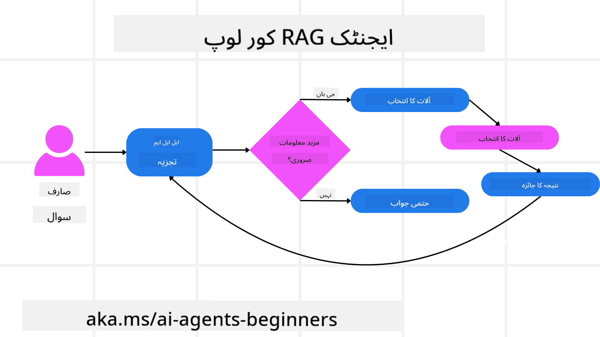
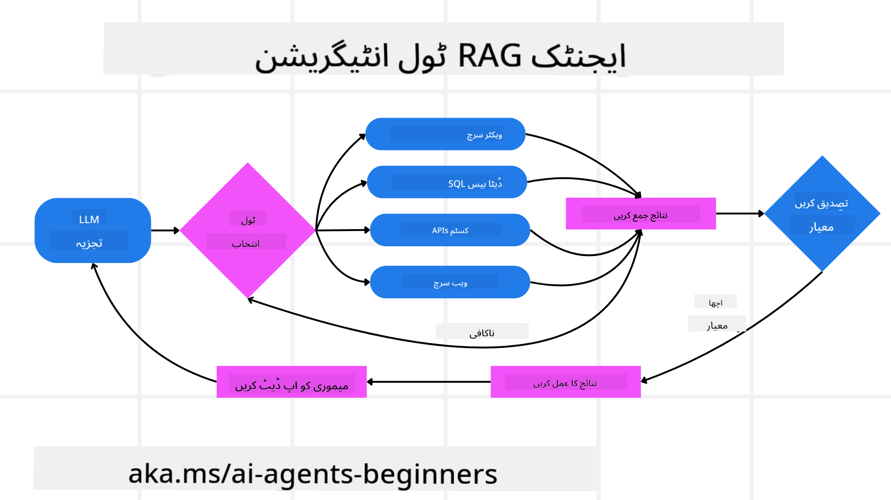
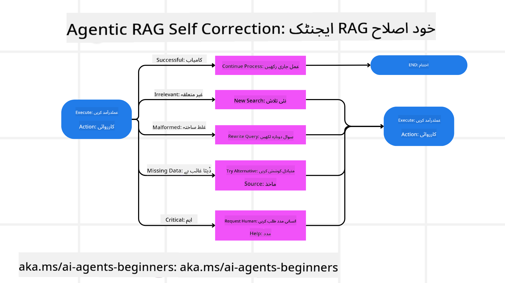
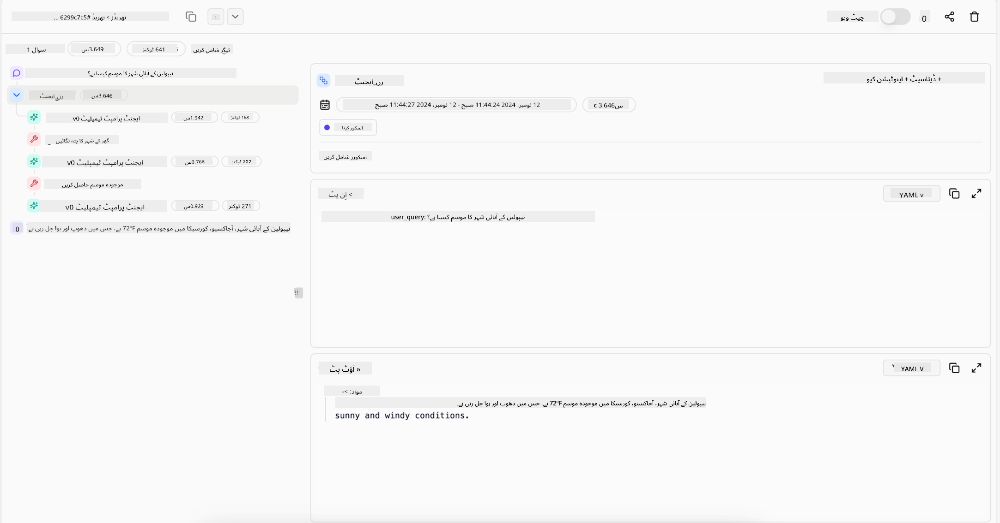
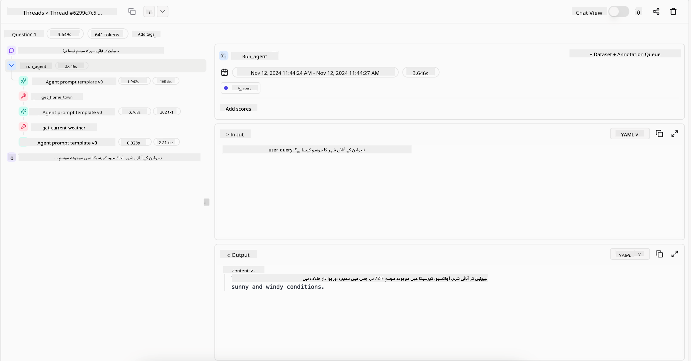

<!--
CO_OP_TRANSLATOR_METADATA:
{
  "original_hash": "7622aa72f9e676e593339f5f694ecd7d",
  "translation_date": "2025-07-12T09:52:16+00:00",
  "source_file": "05-agentic-rag/README.md",
  "language_code": "ur"
}
-->

> _(اس سبق کی ویڈیو دیکھنے کے لیے اوپر تصویر پر کلک کریں)_

# Agentic RAG

یہ سبق Agentic Retrieval-Augmented Generation (Agentic RAG) کا جامع تعارف فراہم کرتا ہے، جو ایک ابھرتا ہوا AI ماڈل ہے جہاں بڑے زبان کے ماڈلز (LLMs) خود مختار طریقے سے اپنے اگلے اقدامات کی منصوبہ بندی کرتے ہیں اور بیرونی ذرائع سے معلومات حاصل کرتے ہیں۔ روایتی retrieval-then-read طریقوں کے برعکس، Agentic RAG میں LLM کو بار بار کالز کی جاتی ہیں، جن کے درمیان ٹولز یا فنکشن کالز اور منظم آؤٹ پٹس شامل ہوتے ہیں۔ یہ نظام نتائج کا جائزہ لیتا ہے، سوالات کو بہتر بناتا ہے، ضرورت پڑنے پر اضافی ٹولز استعمال کرتا ہے، اور اس عمل کو تب تک جاری رکھتا ہے جب تک کہ ایک تسلی بخش حل حاصل نہ ہو جائے۔

## تعارف

اس سبق میں آپ سیکھیں گے:

- **Agentic RAG کو سمجھنا:** AI میں ایک ابھرتے ہوئے ماڈل کے بارے میں جانیں جہاں بڑے زبان کے ماڈلز (LLMs) خود مختار طریقے سے اپنے اگلے اقدامات کی منصوبہ بندی کرتے ہیں اور بیرونی ڈیٹا ذرائع سے معلومات حاصل کرتے ہیں۔
- **تکراری Maker-Checker انداز کو سمجھنا:** LLM کو بار بار کالز کرنے کے عمل کو سمجھیں، جس میں ٹولز یا فنکشن کالز اور منظم آؤٹ پٹس شامل ہوتے ہیں، تاکہ درستگی بہتر ہو اور خراب سوالات کو سنبھالا جا سکے۔
- **عملی استعمالات کی تلاش:** ایسے حالات کی نشاندہی کریں جہاں Agentic RAG بہترین کارکردگی دکھاتا ہے، جیسے کہ درستگی کو اولین ترجیح دینے والے ماحول، پیچیدہ ڈیٹا بیس تعاملات، اور طویل ورک فلو۔

## سیکھنے کے مقاصد

اس سبق کے مکمل ہونے کے بعد آپ جانیں گے کہ کیسے/سمجھیں گے:

- **Agentic RAG کو سمجھنا:** AI میں ایک ابھرتے ہوئے ماڈل کے بارے میں جانیں جہاں بڑے زبان کے ماڈلز (LLMs) خود مختار طریقے سے اپنے اگلے اقدامات کی منصوبہ بندی کرتے ہیں اور بیرونی ڈیٹا ذرائع سے معلومات حاصل کرتے ہیں۔
- **تکراری Maker-Checker انداز:** LLM کو بار بار کالز کرنے کے عمل کو سمجھیں، جس میں ٹولز یا فنکشن کالز اور منظم آؤٹ پٹس شامل ہوتے ہیں، تاکہ درستگی بہتر ہو اور خراب سوالات کو سنبھالا جا سکے۔
- **منطق کے عمل پر قابو پانا:** نظام کی صلاحیت کو سمجھیں کہ وہ اپنی منطق کا مالک ہوتا ہے، مسائل کے حل کے لیے خود فیصلہ کرتا ہے بغیر پہلے سے طے شدہ راستوں پر انحصار کیے۔
- **ورک فلو:** سمجھیں کہ ایک agentic ماڈل خود مختار طریقے سے مارکیٹ ٹرینڈ رپورٹس حاصل کرنے، مقابلہ کرنے والے ڈیٹا کی شناخت کرنے، اندرونی سیلز میٹرکس کو مربوط کرنے، نتائج کو یکجا کرنے، اور حکمت عملی کا جائزہ لینے کا فیصلہ کرتا ہے۔
- **تکراری لوپس، ٹول انٹیگریشن، اور میموری:** نظام کے لوپڈ انٹریکشن پیٹرن پر انحصار کو جانیں، جو ہر قدم پر حالت اور یادداشت کو برقرار رکھتا ہے تاکہ بار بار دہرائے جانے والے لوپس سے بچا جا سکے اور بہتر فیصلے کیے جا سکیں۔
- **ناکامی کے طریقوں کو سنبھالنا اور خود اصلاح:** نظام کے مضبوط خود اصلاحی میکانزم کو دریافت کریں، جس میں تکرار اور دوبارہ سوال کرنا، تشخیصی ٹولز کا استعمال، اور انسانی نگرانی پر انحصار شامل ہے۔
- **ایجنسی کی حدود:** Agentic RAG کی حدود کو سمجھیں، خاص طور پر ڈومین مخصوص خود مختاری، انفراسٹرکچر پر انحصار، اور حفاظتی حدود کا احترام۔
- **عملی استعمال کے کیسز اور قدر:** ایسے حالات کی نشاندہی کریں جہاں Agentic RAG بہترین کارکردگی دکھاتا ہے، جیسے کہ درستگی کو اولین ترجیح دینے والے ماحول، پیچیدہ ڈیٹا بیس تعاملات، اور طویل ورک فلو۔
- **گورننس، شفافیت، اور اعتماد:** گورننس اور شفافیت کی اہمیت کو سمجھیں، جس میں وضاحتی منطق، تعصب پر قابو، اور انسانی نگرانی شامل ہے۔

## Agentic RAG کیا ہے؟

Agentic Retrieval-Augmented Generation (Agentic RAG) ایک ابھرتا ہوا AI ماڈل ہے جہاں بڑے زبان کے ماڈلز (LLMs) خود مختار طریقے سے اپنے اگلے اقدامات کی منصوبہ بندی کرتے ہیں اور بیرونی ذرائع سے معلومات حاصل کرتے ہیں۔ روایتی retrieval-then-read طریقوں کے برعکس، Agentic RAG میں LLM کو بار بار کالز کی جاتی ہیں، جن کے درمیان ٹولز یا فنکشن کالز اور منظم آؤٹ پٹس شامل ہوتے ہیں۔ نظام نتائج کا جائزہ لیتا ہے، سوالات کو بہتر بناتا ہے، ضرورت پڑنے پر اضافی ٹولز استعمال کرتا ہے، اور اس عمل کو تب تک جاری رکھتا ہے جب تک کہ ایک تسلی بخش حل حاصل نہ ہو جائے۔ یہ تکراری “maker-checker” انداز درستگی کو بہتر بناتا ہے، خراب سوالات کو سنبھالتا ہے، اور اعلیٰ معیار کے نتائج کو یقینی بناتا ہے۔

نظام اپنی منطق کے عمل کا فعال مالک ہوتا ہے، ناکام سوالات کو دوبارہ لکھتا ہے، مختلف بازیافت کے طریقے منتخب کرتا ہے، اور متعدد ٹولز کو مربوط کرتا ہے—جیسے Azure AI Search میں ویکٹر سرچ، SQL ڈیٹا بیسز، یا کسٹم APIs—اپنے جواب کو حتمی شکل دینے سے پہلے۔ ایک agentic نظام کی نمایاں خصوصیت یہ ہے کہ وہ اپنی منطق کے عمل کا مالک ہوتا ہے۔ روایتی RAG نفاذ پہلے سے طے شدہ راستوں پر انحصار کرتے ہیں، لیکن ایک agentic نظام خود مختار طریقے سے معلومات کی معیار کی بنیاد پر اقدامات کا تسلسل طے کرتا ہے۔

## Agentic Retrieval-Augmented Generation (Agentic RAG) کی تعریف

Agentic Retrieval-Augmented Generation (Agentic RAG) AI کی ترقی میں ایک ابھرتا ہوا ماڈل ہے جہاں LLMs نہ صرف بیرونی ڈیٹا ذرائع سے معلومات حاصل کرتے ہیں بلکہ خود مختار طریقے سے اپنے اگلے اقدامات کی منصوبہ بندی بھی کرتے ہیں۔ روایتی retrieval-then-read طریقوں یا محتاط طور پر ترتیب دی گئی پرامپٹ سیکوینسز کے برعکس، Agentic RAG میں LLM کو بار بار کالز کی جاتی ہیں، جن کے درمیان ٹولز یا فنکشن کالز اور منظم آؤٹ پٹس شامل ہوتے ہیں۔ ہر مرحلے پر، نظام حاصل کردہ نتائج کا جائزہ لیتا ہے، فیصلہ کرتا ہے کہ آیا سوالات کو بہتر بنانا ہے، ضرورت پڑنے پر اضافی ٹولز استعمال کرتا ہے، اور اس عمل کو تب تک جاری رکھتا ہے جب تک کہ ایک تسلی بخش حل حاصل نہ ہو جائے۔

یہ تکراری “maker-checker” انداز آپریشن درستگی کو بہتر بنانے، خراب سوالات کو منظم ڈیٹا بیسز (مثلاً NL2SQL) کے لیے سنبھالنے، اور متوازن، اعلیٰ معیار کے نتائج کو یقینی بنانے کے لیے ڈیزائن کیا گیا ہے۔ صرف محتاط طور پر تیار کردہ پرامپٹ چینز پر انحصار کرنے کے بجائے، نظام اپنی منطق کے عمل کا فعال مالک ہوتا ہے۔ یہ ناکام سوالات کو دوبارہ لکھ سکتا ہے، مختلف بازیافت کے طریقے منتخب کر سکتا ہے، اور متعدد ٹولز کو مربوط کر سکتا ہے—جیسے Azure AI Search میں ویکٹر سرچ، SQL ڈیٹا بیسز، یا کسٹم APIs—اپنے جواب کو حتمی شکل دینے سے پہلے۔ اس سے پیچیدہ آرکیسٹریشن فریم ورکس کی ضرورت ختم ہو جاتی ہے۔ اس کے بجائے، ایک نسبتاً سادہ لوپ “LLM کال → ٹول کا استعمال → LLM کال → …” پیچیدہ اور مضبوط آؤٹ پٹس پیدا کر سکتا ہے۔

## منطق کے عمل کا مالک ہونا

وہ خصوصیت جو کسی نظام کو “agentic” بناتی ہے وہ اس کی اپنی منطق کے عمل کا مالک ہونے کی صلاحیت ہے۔ روایتی RAG نفاذ اکثر انسانوں پر انحصار کرتے ہیں جو ماڈل کے لیے ایک راستہ پہلے سے طے کرتے ہیں: ایک سوچ کا سلسلہ جو بتاتا ہے کہ کیا حاصل کرنا ہے اور کب۔
لیکن جب کوئی نظام واقعی agentic ہوتا ہے، تو وہ اندرونی طور پر فیصلہ کرتا ہے کہ مسئلے کو کیسے حل کیا جائے۔ یہ صرف ایک اسکرپٹ پر عمل نہیں کر رہا ہوتا؛ بلکہ خود مختار طریقے سے معلومات کی معیار کی بنیاد پر اقدامات کا تسلسل طے کر رہا ہوتا ہے۔
مثال کے طور پر، اگر اسے کسی پروڈکٹ لانچ حکمت عملی بنانے کو کہا جائے، تو یہ صرف ایک پرامپٹ پر انحصار نہیں کرتا جو پورے تحقیق اور فیصلہ سازی کے ورک فلو کو بیان کرتا ہو۔ اس کے بجائے، agentic ماڈل خود مختار طریقے سے فیصلہ کرتا ہے کہ:

1. Bing Web Grounding کے ذریعے موجودہ مارکیٹ ٹرینڈ رپورٹس حاصل کرے
2. Azure AI Search کے ذریعے متعلقہ مقابلہ کرنے والے ڈیٹا کی شناخت کرے
3. Azure SQL Database کے ذریعے تاریخی اندرونی سیلز میٹرکس کو مربوط کرے
4. Azure OpenAI Service کے ذریعے نتائج کو یکجا کر کے ایک مربوط حکمت عملی تیار کرے
5. حکمت عملی کا جائزہ لے کہ کہیں کوئی خلا یا تضاد تو نہیں، اور اگر ضرورت ہو تو دوبارہ معلومات حاصل کرنے کا عمل شروع کرے
یہ تمام اقدامات—سوالات کو بہتر بنانا، ذرائع کا انتخاب، جواب سے “خوش” ہونے تک تکرار—ماڈل خود کرتا ہے، نہ کہ انسان کی طرف سے پہلے سے طے شدہ۔

## تکراری لوپس، ٹول انٹیگریشن، اور میموری

ایک agentic نظام لوپڈ انٹریکشن پیٹرن پر انحصار کرتا ہے:

- **ابتدائی کال:** صارف کا مقصد (یعنی صارف کا پرامپٹ) LLM کو پیش کیا جاتا ہے۔
- **ٹول کال:** اگر ماڈل کو معلومات کی کمی یا مبہم ہدایات کا پتہ چلتا ہے، تو یہ ایک ٹول یا بازیافت کا طریقہ منتخب کرتا ہے—جیسے ویکٹر ڈیٹا بیس کی تلاش (مثلاً Azure AI Search Hybrid search پر نجی ڈیٹا) یا منظم SQL کال—مزید سیاق و سباق حاصل کرنے کے لیے۔
- **جائزہ اور بہتری:** واپس ملنے والے ڈیٹا کا جائزہ لینے کے بعد، ماڈل فیصلہ کرتا ہے کہ آیا معلومات کافی ہے۔ اگر نہیں، تو یہ سوال کو بہتر بناتا ہے، مختلف ٹول آزما تا ہے، یا اپنی حکمت عملی کو ایڈجسٹ کرتا ہے۔
- **تسلی تک دہرائیں:** یہ عمل جاری رہتا ہے جب تک ماڈل یہ نہ سمجھ لے کہ اسے حتمی، اچھی طرح سوچا سمجھا جواب دینے کے لیے کافی وضاحت اور ثبوت مل چکے ہیں۔
- **میموری اور حالت:** چونکہ نظام ہر قدم پر حالت اور یادداشت کو برقرار رکھتا ہے، اس لیے یہ پچھلے کوششوں اور ان کے نتائج کو یاد رکھ سکتا ہے، بار بار دہرائے جانے والے لوپس سے بچتا ہے اور آگے بڑھتے ہوئے بہتر فیصلے کرتا ہے۔

وقت کے ساتھ، یہ ایک ارتقائی فہم کا احساس پیدا کرتا ہے، جو ماڈل کو پیچیدہ، کثیر مرحلہ کاموں کو بغیر انسانی مداخلت یا پرامپٹ کو بار بار تبدیل کیے انجام دینے کے قابل بناتا ہے۔

## ناکامی کے طریقوں کو سنبھالنا اور خود اصلاح

Agentic RAG کی خود مختاری میں مضبوط خود اصلاحی میکانزم بھی شامل ہیں۔ جب نظام کو رکاوٹوں کا سامنا ہوتا ہے—جیسے غیر متعلقہ دستاویزات حاصل کرنا یا خراب سوالات کا سامنا—تو یہ کر سکتا ہے:

- **تکرار اور دوبارہ سوال کرنا:** کم قدر والے جوابات دینے کے بجائے، ماڈل نئی تلاش کی حکمت عملی آزما تا ہے، ڈیٹا بیس کے سوالات کو دوبارہ لکھتا ہے، یا متبادل ڈیٹا سیٹس دیکھتا ہے۔
- **تشخیصی ٹولز کا استعمال:** نظام اضافی فنکشنز کو کال کر سکتا ہے جو اس کی منطق کے مراحل کو ڈیبگ کرنے یا حاصل کردہ ڈیٹا کی درستگی کی تصدیق میں مدد دیتے ہیں۔ Azure AI Tracing جیسے ٹولز مضبوط نگرانی اور مشاہدے کو ممکن بنائیں گے۔
- **انسانی نگرانی پر انحصار:** حساس یا بار بار ناکام ہونے والے حالات میں، ماڈل غیر یقینی صورتحال کو نشان زد کر کے انسانی رہنمائی طلب کر سکتا ہے۔ جب انسان اصلاحی فیڈ بیک دیتا ہے، تو ماڈل اسے آگے کے لیے شامل کر سکتا ہے۔

یہ تکراری اور متحرک طریقہ کار ماڈل کو مسلسل بہتر بنانے کی اجازت دیتا ہے، اس بات کو یقینی بناتے ہوئے کہ یہ صرف ایک بار چلنے والا نظام نہیں بلکہ ایک ایسا نظام ہے جو سیشن کے دوران اپنی غلطیوں سے سیکھتا ہے۔

## ایجنسی کی حدود

اگرچہ یہ نظام ایک کام کے اندر خود مختار ہے، Agentic RAG مصنوعی عمومی ذہانت (AGI) کے مترادف نہیں ہے۔ اس کی “agentic” صلاحیتیں صرف وہ ٹولز، ڈیٹا ذرائع، اور پالیسیاں ہیں جو انسانی ڈویلپرز نے فراہم کی ہیں۔ یہ اپنے ٹولز ایجاد نہیں کر سکتا یا مقررہ دائرہ کار سے باہر نہیں جا سکتا۔ بلکہ، یہ دستیاب وسائل کو متحرک طریقے سے منظم کرنے میں مہارت رکھتا ہے۔
زیادہ ترقی یافتہ AI شکلوں سے اہم فرق یہ ہیں:

1. **ڈومین مخصوص خود مختاری:** Agentic RAG سسٹمز صارف کے متعین کردہ اہداف کو معلوم دائرہ کار میں حاصل کرنے پر مرکوز ہوتے ہیں، سوالات کو دوبارہ لکھنے یا ٹول منتخب کرنے جیسی حکمت عملیوں کا استعمال کرتے ہیں تاکہ نتائج بہتر ہوں۔
2. **انفراسٹرکچر پر انحصار:** نظام کی صلاحیتیں ان ٹولز اور ڈیٹا پر منحصر ہیں جو ڈویلپرز نے مربوط کیے ہیں۔ یہ انسانی مداخلت کے بغیر ان حدود سے باہر نہیں جا سکتا۔
3. **حفاظتی حدود کا احترام:** اخلاقی رہنما اصول، تعمیل کے قواعد، اور کاروباری پالیسیاں بہت اہم ہیں۔ ایجنٹ کی آزادی ہمیشہ حفاظتی اقدامات اور نگرانی کے میکانزم سے محدود ہوتی ہے (امید ہے کہ)۔

## عملی استعمال کے کیسز اور قدر

Agentic RAG ایسے حالات میں بہترین کارکردگی دکھاتا ہے جہاں تکراری بہتری اور درستگی کی ضرورت ہو:

1. **درستگی کو اولین ترجیح دینے والے ماحول:** تعمیل کی جانچ، ضابطہ کار کے تجزیے، یا قانونی تحقیق میں، agentic ماڈل بار بار حقائق کی تصدیق کر سکتا ہے، متعدد ذرائع سے مشورہ کر سکتا ہے، اور سوالات کو دوبارہ لکھ سکتا ہے جب تک کہ مکمل طور پر جانچ پڑتال شدہ جواب نہ مل جائے۔
2. **پیچیدہ ڈیٹا بیس تعاملات:** جب منظم ڈیٹا کے ساتھ کام کرنا ہو جہاں سوالات اکثر ناکام ہو سکتے ہیں یا ایڈجسٹمنٹ کی ضرورت ہو، نظام خود مختار طریقے سے Azure SQL یا Microsoft Fabric OneLake کا استعمال کرتے ہوئے سوالات کو بہتر بنا سکتا ہے، اس بات کو یقینی بناتے ہوئے کہ حتمی بازیافت صارف کی نیت کے مطابق ہو۔
3. **طویل ورک فلو:** طویل سیشنز نئے معلومات کے سامنے آنے کے ساتھ ارتقا پذیر ہو سکتے ہیں۔ Agentic RAG مسلسل نئے ڈیٹا کو شامل کر سکتا ہے، اور جیسے جیسے مسئلے کی سمجھ بڑھتی ہے حکمت عملیوں کو تبدیل کر سکتا ہے۔

## گورننس، شفافیت، اور اعتماد

جیسے جیسے یہ نظام اپنی منطق میں زیادہ خود مختار ہوتے جا رہے ہیں، گورننس اور شفافیت بہت اہم ہو جاتی ہیں:

- **وضاحتی منطق:** ماڈل سوالات کا آڈٹ ٹریل فراہم کر سکتا ہے جو اس نے کیے، ذرائع جن سے مشورہ لیا، اور منطق کے مراحل جو اس نے اپنی نتیجہ گیری تک پہنچنے کے لیے اختیار کیے۔ Azure AI Content Safety اور Azure AI Tracing / GenAIOps جیسے ٹولز شفافیت کو برقرار رکھنے اور خطرات کو کم کرنے میں مدد دیتے ہیں۔
- **تعصب پر قابو اور متوازن بازیافت:** ڈویلپرز بازیافت کی حکمت عملیوں کو اس طرح ترتیب دے سکتے ہیں کہ متوازن، نمائندہ ڈیٹا ذرائع کو شامل کیا جائے، اور باقاعدگی سے آؤٹ پٹس کا آڈٹ کر کے تعصب یا مائل رجحانات کا پتہ لگا سکتے ہیں، خاص طور پر Azure Machine Learning استعمال کرنے والی جدید ڈیٹا سائنس تنظیموں کے لیے کسٹم ماڈلز کے ذریعے۔
- **انسانی نگرانی اور تعمیل:** حساس کاموں کے لیے، انسانی جائزہ لازمی ہے۔ Agentic RAG انسانی فیصلے کی جگہ نہیں لیتا بلکہ اسے بہتر اور زیادہ مکمل آپشنز فراہم کر کے مدد دیتا ہے۔

ایسے ٹولز کا ہونا جو کارروائیوں کا واضح ریکارڈ فراہم کریں ضروری ہے۔ ان کے بغیر، کثیر مرحلہ عمل کی ڈیبگنگ بہت مشکل ہو سکتی ہے۔ Literal AI (جو Chainlit کے پیچھے کمپنی ہے) کی طرف سے ایک Agent رن کی مثال دیکھیں:

## نتیجہ

Agentic RAG AI سسٹمز کے پیچیدہ، ڈیٹا سے بھرپور کاموں کو سنبھالنے میں ایک قدرتی ارتقاء کی نمائندگی کرتا ہے۔ لوپڈ انٹریکشن پیٹرن اپنانے، خود مختار طریقے سے ٹولز منتخب کرنے، اور سوالات کو بہتر بنانے کے ذریعے جب تک کہ اعلیٰ معیار کا نتیجہ حاصل نہ ہو، یہ نظام جامد پرامپٹ فالو کرنے سے آگے بڑھ کر ایک زیادہ موافق، سیاق
</a>
- <a href="https://learn.microsoft.com/azure/ai-studio/concepts/evaluation-approach-gen-ai" target="_blank">Azure AI Foundry کے ساتھ جنریٹو AI ایپلیکیشنز کا جائزہ: یہ مضمون عوامی دستیاب ڈیٹا سیٹس پر ماڈلز کے جائزے اور موازنہ کا احاطہ کرتا ہے، جس میں Agentic AI ایپلیکیشنز اور RAG آرکیٹیکچرز شامل ہیں</a>
- <a href="https://weaviate.io/blog/what-is-agentic-rag" target="_blank">Agentic RAG کیا ہے | Weaviate</a>
- <a href="https://ragaboutit.com/agentic-rag-a-complete-guide-to-agent-based-retrieval-augmented-generation/" target="_blank">Agentic RAG: ایجنٹ پر مبنی Retrieval Augmented Generation کے لیے مکمل رہنما – Generation RAG کی خبریں</a>
- <a href="https://huggingface.co/learn/cookbook/agent_rag" target="_blank">Agentic RAG: اپنی RAG کو query reformulation اور self-query کے ساتھ تیز کریں! Hugging Face Open-Source AI Cookbook</a>
- <a href="https://youtu.be/aQ4yQXeB1Ss?si=2HUqBzHoeB5tR04U" target="_blank">RAG میں Agentic Layers کا اضافہ</a>
- <a href="https://www.youtube.com/watch?v=zeAyuLc_f3Q&t=244s" target="_blank">Knowledge Assistants کا مستقبل: Jerry Liu</a>
- <a href="https://www.youtube.com/watch?v=AOSjiXP1jmQ" target="_blank">Agentic RAG سسٹمز کیسے بنائیں</a>
- <a href="https://ignite.microsoft.com/sessions/BRK102?source=sessions" target="_blank">اپنے AI ایجنٹس کو scale کرنے کے لیے Azure AI Foundry Agent Service کا استعمال</a>

### علمی مقالے

- <a href="https://arxiv.org/abs/2303.17651" target="_blank">2303.17651 Self-Refine: خود کی رائے کے ساتھ تکراری بہتری</a>
- <a href="https://arxiv.org/abs/2303.11366" target="_blank">2303.11366 Reflexion: زبان کے ایجنٹس کے لیے زبانی reinforcement learning</a>
- <a href="https://arxiv.org/abs/2305.11738" target="_blank">2305.11738 CRITIC: بڑے زبان کے ماڈلز خود کو ٹول-انٹریکٹو تنقید کے ذریعے درست کر سکتے ہیں</a>
- <a href="https://arxiv.org/abs/2501.09136" target="_blank">2501.09136 Agentic Retrieval-Augmented Generation: Agentic RAG پر ایک جائزہ</a>

## پچھلا سبق

[Tool Use Design Pattern](../04-tool-use/README.md)

## اگلا سبق

[Building Trustworthy AI Agents](../06-building-trustworthy-agents/README.md)

**دستخطی دستبرداری**:  
یہ دستاویز AI ترجمہ سروس [Co-op Translator](https://github.com/Azure/co-op-translator) کے ذریعے ترجمہ کی گئی ہے۔ اگرچہ ہم درستگی کے لیے کوشاں ہیں، براہ کرم آگاہ رہیں کہ خودکار ترجمے میں غلطیاں یا عدم درستیاں ہو سکتی ہیں۔ اصل دستاویز اپنی مادری زبان میں ہی معتبر ماخذ سمجھی جانی چاہیے۔ اہم معلومات کے لیے پیشہ ور انسانی ترجمہ کی سفارش کی جاتی ہے۔ اس ترجمے کے استعمال سے پیدا ہونے والی کسی بھی غلط فہمی یا غلط تشریح کی ذمہ داری ہم پر عائد نہیں ہوتی۔