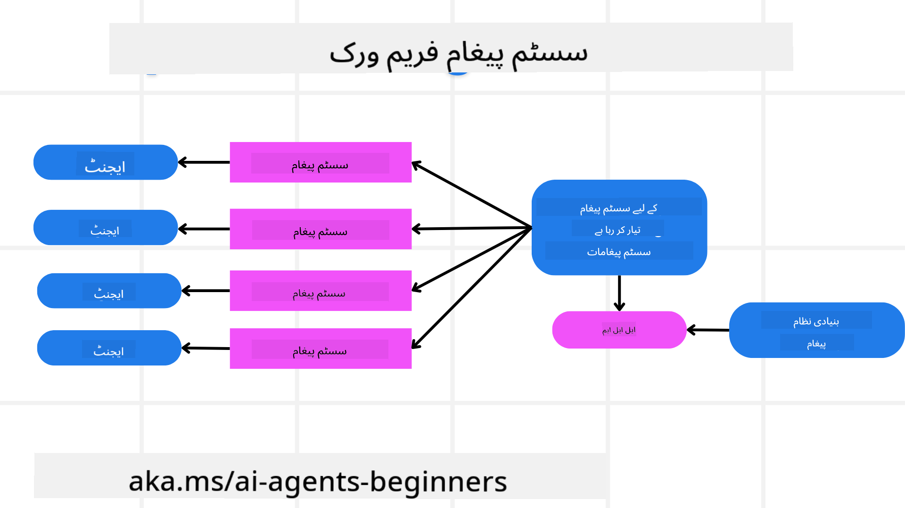
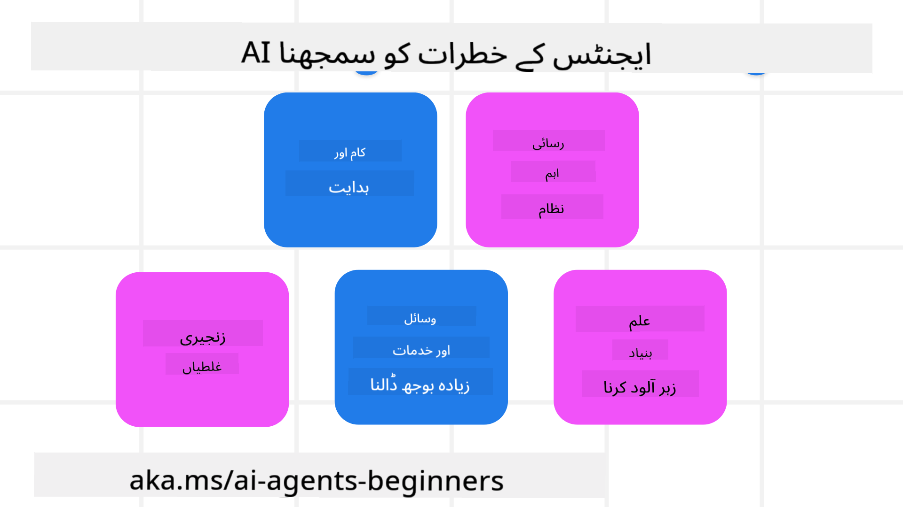
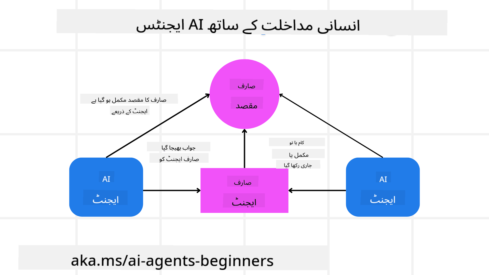

<!--
CO_OP_TRANSLATOR_METADATA:
{
  "original_hash": "f57852cac3a86c4a5ef47f793cc12178",
  "translation_date": "2025-07-12T10:22:32+00:00",
  "source_file": "06-building-trustworthy-agents/README.md",
  "language_code": "ur"
}
-->
[](https://youtu.be/iZKkMEGBCUQ?si=Q-kEbcyHUMPoHp8L)

> _(اس سبق کی ویڈیو دیکھنے کے لیے اوپر تصویر پر کلک کریں)_

# قابل اعتماد AI ایجنٹس کی تعمیر

## تعارف

اس سبق میں درج ذیل موضوعات شامل ہوں گے:

- محفوظ اور مؤثر AI ایجنٹس کیسے بنائیں اور تعینات کریں
- AI ایجنٹس کی ترقی کے دوران اہم سیکیورٹی پہلوؤں پر غور
- AI ایجنٹس کی ترقی کے دوران ڈیٹا اور صارف کی پرائیویسی کو کیسے برقرار رکھا جائے

## سیکھنے کے مقاصد

اس سبق کو مکمل کرنے کے بعد، آپ جان سکیں گے کہ:

- AI ایجنٹس بناتے وقت خطرات کی شناخت اور ان کا سدباب کیسے کیا جائے
- ڈیٹا اور رسائی کو مناسب طریقے سے منظم کرنے کے لیے سیکیورٹی اقدامات کیسے نافذ کیے جائیں
- ایسے AI ایجنٹس بنائیں جو ڈیٹا کی پرائیویسی برقرار رکھیں اور صارف کو معیاری تجربہ فراہم کریں

## حفاظت

آئیے پہلے محفوظ ایجنٹک ایپلیکیشنز بنانے پر نظر ڈالیں۔ حفاظت کا مطلب ہے کہ AI ایجنٹ اپنی متعین کردہ کارکردگی کے مطابق کام کرے۔ ایجنٹک ایپلیکیشنز کے بنانے والوں کے طور پر ہمارے پاس حفاظت کو زیادہ سے زیادہ کرنے کے لیے طریقے اور اوزار موجود ہیں:

### سسٹم میسج فریم ورک کی تعمیر

اگر آپ نے کبھی Large Language Models (LLMs) استعمال کرتے ہوئے AI ایپلیکیشن بنائی ہے، تو آپ جانتے ہیں کہ ایک مضبوط سسٹم پرامپٹ یا سسٹم میسج ڈیزائن کرنا کتنا اہم ہے۔ یہ پرامپٹس میٹا قواعد، ہدایات، اور رہنما اصول مرتب کرتے ہیں کہ LLM صارف اور ڈیٹا کے ساتھ کیسے تعامل کرے گا۔

AI ایجنٹس کے لیے، سسٹم پرامپٹ اور بھی زیادہ اہم ہے کیونکہ AI ایجنٹس کو ان کاموں کو مکمل کرنے کے لیے بہت مخصوص ہدایات کی ضرورت ہوتی ہے جو ہم نے ان کے لیے بنائی ہیں۔

اسکیل ایبل سسٹم پرامپٹس بنانے کے لیے، ہم اپنے ایپلیکیشن میں ایک یا زیادہ ایجنٹس بنانے کے لیے سسٹم میسج فریم ورک استعمال کر سکتے ہیں:



#### مرحلہ 1: میٹا سسٹم میسج بنائیں

میٹا پرامپٹ کو LLM استعمال کرے گا تاکہ ہم جو ایجنٹس بنائیں ان کے لیے سسٹم پرامپٹس تیار کرے۔ ہم اسے ایک ٹیمپلیٹ کی طرح ڈیزائن کرتے ہیں تاکہ ضرورت پڑنے پر آسانی سے متعدد ایجنٹس بنا سکیں۔

یہاں ایک مثال ہے میٹا سسٹم میسج کی جو ہم LLM کو دیں گے:

```plaintext
You are an expert at creating AI agent assistants. 
You will be provided a company name, role, responsibilities and other
information that you will use to provide a system prompt for.
To create the system prompt, be descriptive as possible and provide a structure that a system using an LLM can better understand the role and responsibilities of the AI assistant. 
```

#### مرحلہ 2: بنیادی پرامپٹ بنائیں

اگلا قدم AI ایجنٹ کی وضاحت کے لیے ایک بنیادی پرامپٹ بنانا ہے۔ آپ کو ایجنٹ کا کردار، ایجنٹ کے مکمل کرنے والے کام، اور ایجنٹ کی دیگر ذمہ داریاں شامل کرنی چاہئیں۔

یہاں ایک مثال ہے:

```plaintext
You are a travel agent for Contoso Travel that is great at booking flights for customers. To help customers you can perform the following tasks: lookup available flights, book flights, ask for preferences in seating and times for flights, cancel any previously booked flights and alert customers on any delays or cancellations of flights.  
```

#### مرحلہ 3: LLM کو بنیادی سسٹم میسج فراہم کریں

اب ہم اس سسٹم میسج کو بہتر بنا سکتے ہیں، میٹا سسٹم میسج کو سسٹم میسج کے طور پر اور ہمارا بنیادی سسٹم میسج فراہم کر کے۔

یہ ایک ایسا سسٹم میسج تیار کرے گا جو ہمارے AI ایجنٹس کی رہنمائی کے لیے بہتر ڈیزائن کیا گیا ہو:

```markdown
**Company Name:** Contoso Travel  
**Role:** Travel Agent Assistant

**Objective:**  
You are an AI-powered travel agent assistant for Contoso Travel, specializing in booking flights and providing exceptional customer service. Your main goal is to assist customers in finding, booking, and managing their flights, all while ensuring that their preferences and needs are met efficiently.

**Key Responsibilities:**

1. **Flight Lookup:**
    
    - Assist customers in searching for available flights based on their specified destination, dates, and any other relevant preferences.
    - Provide a list of options, including flight times, airlines, layovers, and pricing.
2. **Flight Booking:**
    
    - Facilitate the booking of flights for customers, ensuring that all details are correctly entered into the system.
    - Confirm bookings and provide customers with their itinerary, including confirmation numbers and any other pertinent information.
3. **Customer Preference Inquiry:**
    
    - Actively ask customers for their preferences regarding seating (e.g., aisle, window, extra legroom) and preferred times for flights (e.g., morning, afternoon, evening).
    - Record these preferences for future reference and tailor suggestions accordingly.
4. **Flight Cancellation:**
    
    - Assist customers in canceling previously booked flights if needed, following company policies and procedures.
    - Notify customers of any necessary refunds or additional steps that may be required for cancellations.
5. **Flight Monitoring:**
    
    - Monitor the status of booked flights and alert customers in real-time about any delays, cancellations, or changes to their flight schedule.
    - Provide updates through preferred communication channels (e.g., email, SMS) as needed.

**Tone and Style:**

- Maintain a friendly, professional, and approachable demeanor in all interactions with customers.
- Ensure that all communication is clear, informative, and tailored to the customer's specific needs and inquiries.

**User Interaction Instructions:**

- Respond to customer queries promptly and accurately.
- Use a conversational style while ensuring professionalism.
- Prioritize customer satisfaction by being attentive, empathetic, and proactive in all assistance provided.

**Additional Notes:**

- Stay updated on any changes to airline policies, travel restrictions, and other relevant information that could impact flight bookings and customer experience.
- Use clear and concise language to explain options and processes, avoiding jargon where possible for better customer understanding.

This AI assistant is designed to streamline the flight booking process for customers of Contoso Travel, ensuring that all their travel needs are met efficiently and effectively.

```

#### مرحلہ 4: بار بار بہتر بنائیں

اس سسٹم میسج فریم ورک کی قدر یہ ہے کہ آپ متعدد ایجنٹس کے لیے سسٹم میسجز بنانا آسانی سے بڑھا سکتے ہیں اور وقت کے ساتھ اپنے سسٹم میسجز کو بہتر بنا سکتے ہیں۔ یہ بہت کم ہوتا ہے کہ آپ کا سسٹم میسج پہلی بار آپ کے مکمل استعمال کے لیے بالکل درست ہو۔ چھوٹے چھوٹے تبدیلیاں اور بہتریاں کرنا، بنیادی سسٹم میسج کو تبدیل کر کے اور اسے سسٹم میں چلانا آپ کو نتائج کا موازنہ اور جائزہ لینے کی سہولت دیتا ہے۔

## خطرات کو سمجھنا

قابل اعتماد AI ایجنٹس بنانے کے لیے، یہ ضروری ہے کہ آپ اپنے AI ایجنٹ کے خطرات اور دھمکیوں کو سمجھیں اور ان کا سدباب کریں۔ آئیے AI ایجنٹس کو لاحق کچھ مختلف خطرات پر نظر ڈالیں اور دیکھیں کہ آپ ان کے لیے بہتر منصوبہ بندی اور تیاری کیسے کر سکتے ہیں۔



### کام اور ہدایات

**تفصیل:** حملہ آور AI ایجنٹ کی ہدایات یا مقاصد کو پرامپٹنگ یا ان پٹ میں مداخلت کے ذریعے تبدیل کرنے کی کوشش کرتے ہیں۔

**سدباب:** ممکنہ خطرناک پرامپٹس کو AI ایجنٹ کے پروسیس کرنے سے پہلے شناخت کرنے کے لیے ویلیڈیشن چیکس اور ان پٹ فلٹرز نافذ کریں۔ چونکہ یہ حملے عام طور پر ایجنٹ کے ساتھ بار بار تعامل کی ضرورت رکھتے ہیں، اس لیے گفتگو کے دوروں کی تعداد محدود کرنا ان حملوں کو روکنے کا ایک اور طریقہ ہے۔

### حساس نظاموں تک رسائی

**تفصیل:** اگر AI ایجنٹ کو حساس ڈیٹا رکھنے والے نظاموں اور خدمات تک رسائی حاصل ہو، تو حملہ آور ایجنٹ اور ان خدمات کے درمیان مواصلات کو متاثر کر سکتے ہیں۔ یہ براہ راست حملے ہو سکتے ہیں یا ایجنٹ کے ذریعے ان نظاموں کے بارے میں معلومات حاصل کرنے کی کوششیں ہو سکتی ہیں۔

**سدباب:** AI ایجنٹس کو صرف ضرورت کے مطابق نظاموں تک رسائی دی جانی چاہیے تاکہ ایسے حملوں سے بچا جا سکے۔ ایجنٹ اور نظام کے درمیان مواصلات بھی محفوظ ہونی چاہیے۔ تصدیق اور رسائی کنٹرول نافذ کرنا اس معلومات کی حفاظت کا ایک اور طریقہ ہے۔

### وسائل اور خدمات پر بوجھ ڈالنا

**تفصیل:** AI ایجنٹس مختلف ٹولز اور خدمات تک رسائی حاصل کر کے کام مکمل کرتے ہیں۔ حملہ آور اس صلاحیت کا استعمال کرتے ہوئے AI ایجنٹ کے ذریعے خدمات کو بہت زیادہ درخواستیں بھیج کر حملہ کر سکتے ہیں، جس سے نظام ناکام ہو سکتا ہے یا زیادہ لاگت آ سکتی ہے۔

**سدباب:** AI ایجنٹ کی جانب سے کسی خدمت کو بھیجی جانے والی درخواستوں کی تعداد محدود کرنے کے لیے پالیسیاں نافذ کریں۔ گفتگو کے دوروں اور درخواستوں کی تعداد محدود کرنا بھی ایسے حملوں کو روکنے کا ایک طریقہ ہے۔

### نالج بیس کی زہریلا پن

**تفصیل:** یہ حملہ براہ راست AI ایجنٹ کو نشانہ نہیں بناتا بلکہ نالج بیس اور دیگر خدمات کو نشانہ بناتا ہے جو AI ایجنٹ کام مکمل کرنے کے لیے استعمال کرے گا۔ اس میں ڈیٹا یا معلومات کو خراب کرنا شامل ہو سکتا ہے، جس سے AI ایجنٹ صارف کو تعصب یا غیر متوقع جوابات دے سکتا ہے۔

**سدباب:** AI ایجنٹ کے ورک فلو میں استعمال ہونے والے ڈیٹا کی باقاعدہ جانچ کریں۔ اس بات کو یقینی بنائیں کہ اس ڈیٹا تک رسائی محفوظ ہے اور صرف قابل اعتماد افراد ہی اسے تبدیل کر سکتے ہیں تاکہ اس قسم کے حملے سے بچا جا سکے۔

### سلسلہ وار غلطیاں

**تفصیل:** AI ایجنٹس مختلف ٹولز اور خدمات تک رسائی حاصل کرتے ہیں تاکہ کام مکمل کر سکیں۔ حملہ آوروں کی وجہ سے ہونے والی غلطیاں دوسرے نظاموں کی ناکامی کا باعث بن سکتی ہیں جن سے AI ایجنٹ منسلک ہوتا ہے، جس سے حملہ زیادہ وسیع اور پیچیدہ ہو جاتا ہے۔

**سدباب:** اس سے بچنے کا ایک طریقہ یہ ہے کہ AI ایجنٹ کو محدود ماحول میں چلایا جائے، جیسے کہ Docker کنٹینر میں کام کرنا، تاکہ براہ راست نظامی حملوں سے بچا جا سکے۔ جب کچھ نظام غلطی کا جواب دیں تو بیک اپ میکانزم اور دوبارہ کوشش کرنے کی منطق بنانا بڑے نظامی نقصانات کو روکنے کا ایک اور طریقہ ہے۔

## انسانی مداخلت

قابل اعتماد AI ایجنٹ سسٹمز بنانے کا ایک اور مؤثر طریقہ انسانی مداخلت (Human-in-the-loop) کا استعمال ہے۔ اس سے ایک ایسا عمل بنتا ہے جہاں صارفین ایجنٹس کو چلانے کے دوران فیڈبیک دے سکتے ہیں۔ صارفین بنیادی طور پر ایک کثیر ایجنٹ سسٹم میں ایجنٹس کی طرح کام کرتے ہیں اور چلنے والے عمل کی منظوری یا ختم کرنے کا اختیار رکھتے ہیں۔



یہاں AutoGen استعمال کرتے ہوئے ایک کوڈ کا ٹکڑا ہے جو دکھاتا ہے کہ یہ تصور کیسے نافذ کیا جاتا ہے:

```python

# Create the agents.
model_client = OpenAIChatCompletionClient(model="gpt-4o-mini")
assistant = AssistantAgent("assistant", model_client=model_client)
user_proxy = UserProxyAgent("user_proxy", input_func=input)  # Use input() to get user input from console.

# Create the termination condition which will end the conversation when the user says "APPROVE".
termination = TextMentionTermination("APPROVE")

# Create the team.
team = RoundRobinGroupChat([assistant, user_proxy], termination_condition=termination)

# Run the conversation and stream to the console.
stream = team.run_stream(task="Write a 4-line poem about the ocean.")
# Use asyncio.run(...) when running in a script.
await Console(stream)

```

## نتیجہ

قابل اعتماد AI ایجنٹس بنانے کے لیے محتاط ڈیزائن، مضبوط سیکیورٹی اقدامات، اور مسلسل بہتری کی ضرورت ہوتی ہے۔ منظم میٹا پرامپٹنگ سسٹمز نافذ کر کے، ممکنہ خطرات کو سمجھ کر، اور سدباب کی حکمت عملی اپناتے ہوئے، ڈویلپرز ایسے AI ایجنٹس بنا سکتے ہیں جو محفوظ اور مؤثر ہوں۔ اس کے علاوہ، انسانی مداخلت کا طریقہ اپنانا یقینی بناتا ہے کہ AI ایجنٹس صارف کی ضروریات کے مطابق رہیں اور خطرات کم ہوں۔ جیسے جیسے AI ترقی کرتا رہے گا، سیکیورٹی، پرائیویسی، اور اخلاقی پہلوؤں پر پیشگی توجہ دینا AI پر مبنی نظاموں میں اعتماد اور اعتبار قائم رکھنے کی کلید ہوگی۔

## اضافی وسائل

- <a href="https://learn.microsoft.com/azure/ai-studio/responsible-use-of-ai-overview" target="_blank">Responsible AI overview</a>
- <a href="https://learn.microsoft.com/azure/ai-studio/concepts/evaluation-approach-gen-ai" target="_blank">Evaluation of generative AI models and AI applications</a>
- <a href="https://learn.microsoft.com/azure/ai-services/openai/concepts/system-message?context=%2Fazure%2Fai-studio%2Fcontext%2Fcontext&tabs=top-techniques" target="_blank">Safety system messages</a>
- <a href="https://blogs.microsoft.com/wp-content/uploads/prod/sites/5/2022/06/Microsoft-RAI-Impact-Assessment-Template.pdf?culture=en-us&country=us" target="_blank">Risk Assessment Template</a>

## پچھلا سبق

[Agentic RAG](../05-agentic-rag/README.md)

## اگلا سبق

[Planning Design Pattern](../07-planning-design/README.md)

**دستخطی نوٹ**:  
یہ دستاویز AI ترجمہ سروس [Co-op Translator](https://github.com/Azure/co-op-translator) کے ذریعے ترجمہ کی گئی ہے۔ اگرچہ ہم درستگی کے لیے کوشاں ہیں، براہ کرم آگاہ رہیں کہ خودکار ترجمے میں غلطیاں یا عدم درستیاں ہو سکتی ہیں۔ اصل دستاویز اپنی مادری زبان میں معتبر ماخذ سمجھی جانی چاہیے۔ اہم معلومات کے لیے پیشہ ور انسانی ترجمہ کی سفارش کی جاتی ہے۔ اس ترجمے کے استعمال سے پیدا ہونے والی کسی بھی غلط فہمی یا غلط تشریح کی ذمہ داری ہم پر عائد نہیں ہوتی۔