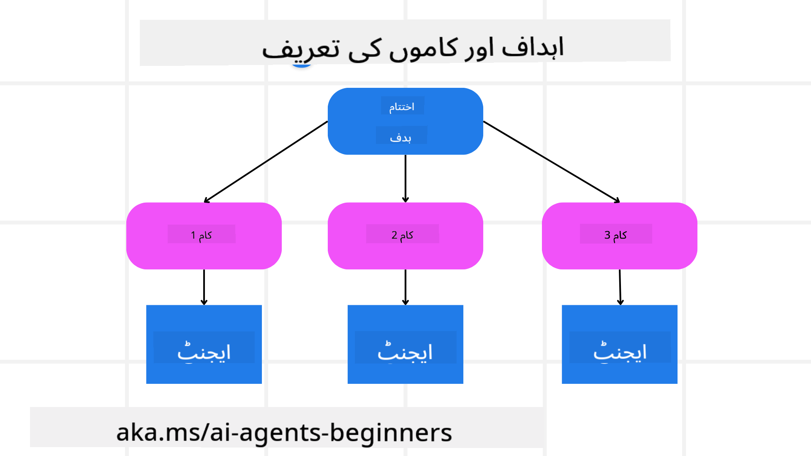

<!--
CO_OP_TRANSLATOR_METADATA:
{
  "original_hash": "a28d30590704ea13b6a08d4793cf9c2b",
  "translation_date": "2025-08-29T09:37:10+00:00",
  "source_file": "07-planning-design/README.md",
  "language_code": "ur"
}
-->

> _(اوپر دی گئی تصویر پر کلک کریں تاکہ اس سبق کی ویڈیو دیکھ سکیں)_

# پلاننگ ڈیزائن

## تعارف

اس سبق میں ہم درج ذیل موضوعات کا احاطہ کریں گے:

* ایک واضح مجموعی مقصد کی وضاحت اور پیچیدہ کام کو قابل انتظام حصوں میں تقسیم کرنا۔
* مشین کے قابل اور زیادہ قابل اعتماد جوابات کے لیے ساختی آؤٹ پٹ کا استعمال۔
* متحرک کاموں اور غیر متوقع ان پٹ کو سنبھالنے کے لیے ایونٹ ڈرائیون اپروچ کا اطلاق۔

## سیکھنے کے مقاصد

اس سبق کو مکمل کرنے کے بعد، آپ درج ذیل باتوں کو سمجھ سکیں گے:

* AI ایجنٹ کے لیے ایک مجموعی مقصد کی وضاحت کریں تاکہ وہ واضح طور پر جان سکے کہ کیا حاصل کرنا ہے۔
* پیچیدہ کام کو قابل انتظام ذیلی کاموں میں تقسیم کریں اور انہیں منطقی ترتیب میں منظم کریں۔
* ایجنٹس کو صحیح ٹولز (جیسے سرچ ٹولز یا ڈیٹا اینالیٹکس ٹولز) سے لیس کریں، فیصلہ کریں کہ انہیں کب اور کیسے استعمال کرنا ہے، اور غیر متوقع حالات کو سنبھالیں۔
* ذیلی کاموں کے نتائج کا جائزہ لیں، کارکردگی کو ماپیں، اور حتمی آؤٹ پٹ کو بہتر بنانے کے لیے اقدامات پر نظر ثانی کریں۔

## مجموعی مقصد کی وضاحت اور کام کو تقسیم کرنا

زیادہ تر حقیقی دنیا کے کام اتنے پیچیدہ ہوتے ہیں کہ انہیں ایک ہی قدم میں مکمل نہیں کیا جا سکتا۔ ایک AI ایجنٹ کو اپنے منصوبہ بندی اور اقدامات کی رہنمائی کے لیے ایک مختصر مقصد کی ضرورت ہوتی ہے۔ مثال کے طور پر، یہ مقصد دیکھیں:

    "ایک 3 دن کا سفر کا منصوبہ تیار کریں۔"

اگرچہ یہ بیان کرنا آسان ہے، لیکن اسے مزید بہتر بنانے کی ضرورت ہے۔ جتنا واضح مقصد ہوگا، اتنا ہی بہتر ایجنٹ (اور کوئی انسانی ساتھی) صحیح نتیجہ حاصل کرنے پر توجہ مرکوز کر سکیں گے، جیسے کہ ایک جامع سفر کا منصوبہ بنانا جس میں فلائٹ آپشنز، ہوٹل کی تجاویز، اور سرگرمیوں کی سفارشات شامل ہوں۔

### کام کی تقسیم

بڑے یا پیچیدہ کام چھوٹے، مقصد پر مبنی ذیلی کاموں میں تقسیم کرنے سے زیادہ قابل انتظام ہو جاتے ہیں۔
سفر کے منصوبے کی مثال کے لیے، آپ مقصد کو درج ذیل میں تقسیم کر سکتے ہیں:

* فلائٹ بکنگ
* ہوٹل بکنگ
* کار کرایہ پر لینا
* ذاتی نوعیت کا منصوبہ

ہر ذیلی کام کو مخصوص ایجنٹس یا پروسیسز کے ذریعے انجام دیا جا سکتا ہے۔ ایک ایجنٹ بہترین فلائٹ ڈیلز تلاش کرنے میں مہارت رکھ سکتا ہے، دوسرا ہوٹل بکنگ پر توجہ مرکوز کر سکتا ہے، وغیرہ۔ ایک کوآرڈینیٹنگ یا "ڈاؤن اسٹریم" ایجنٹ ان نتائج کو ایک مربوط منصوبے میں مرتب کر کے صارف کو پیش کر سکتا ہے۔

یہ ماڈیولر اپروچ اضافی بہتری کی بھی اجازت دیتا ہے۔ مثال کے طور پر، آپ فوڈ کی سفارشات یا مقامی سرگرمیوں کی تجاویز کے لیے مخصوص ایجنٹس شامل کر سکتے ہیں اور وقت کے ساتھ منصوبے کو بہتر بنا سکتے ہیں۔

### ساختی آؤٹ پٹ

بڑے لینگویج ماڈلز (LLMs) ساختی آؤٹ پٹ (جیسے JSON) تیار کر سکتے ہیں جو ڈاؤن اسٹریم ایجنٹس یا سروسز کے لیے پارس اور پروسیس کرنا آسان ہوتا ہے۔ یہ خاص طور پر ایک ملٹی ایجنٹ سیاق و سباق میں مفید ہے، جہاں ہم منصوبہ بندی کے آؤٹ پٹ کے بعد ان کاموں کو انجام دے سکتے ہیں۔ مزید معلومات کے لیے

---

**ڈسکلیمر**:  
یہ دستاویز AI ترجمہ سروس [Co-op Translator](https://github.com/Azure/co-op-translator) کا استعمال کرتے ہوئے ترجمہ کی گئی ہے۔ ہم درستگی کے لیے کوشش کرتے ہیں، لیکن براہ کرم آگاہ رہیں کہ خودکار ترجمے میں غلطیاں یا غیر درستیاں ہو سکتی ہیں۔ اصل دستاویز کو اس کی اصل زبان میں مستند ذریعہ سمجھا جانا چاہیے۔ اہم معلومات کے لیے، پیشہ ور انسانی ترجمہ کی سفارش کی جاتی ہے۔ ہم اس ترجمے کے استعمال سے پیدا ہونے والی کسی بھی غلط فہمی یا غلط تشریح کے ذمہ دار نہیں ہیں۔