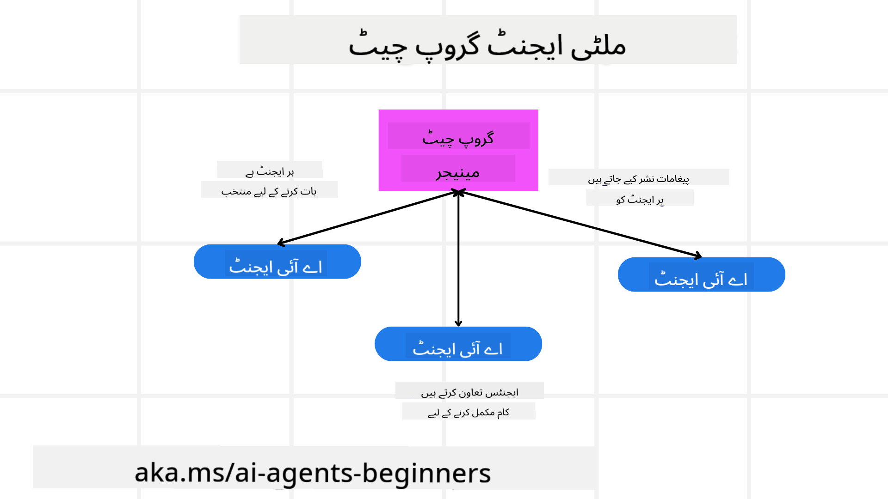
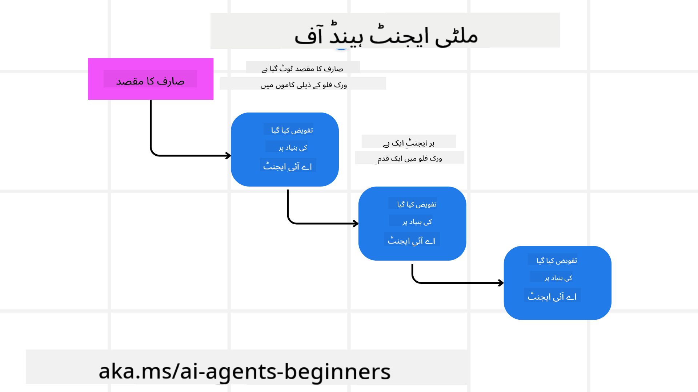
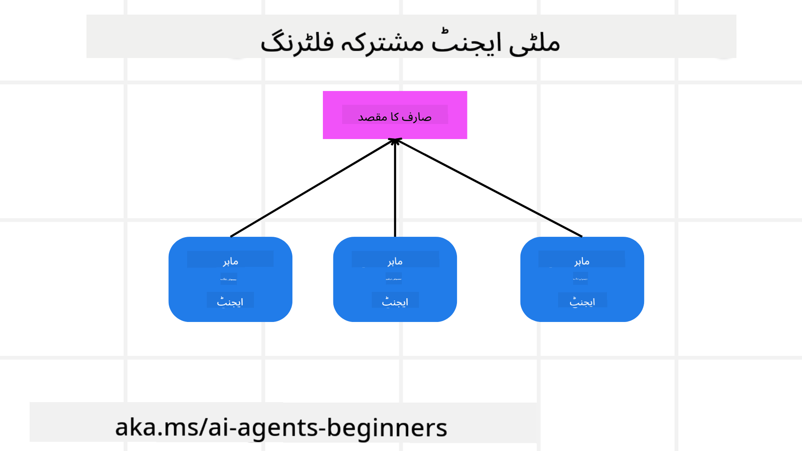

<!--
CO_OP_TRANSLATOR_METADATA:
{
  "original_hash": "c692a8975d7d5b99575a553de1c5e8a7",
  "translation_date": "2025-07-12T10:54:51+00:00",
  "source_file": "08-multi-agent/README.md",
  "language_code": "ur"
}
-->

> _(اس سبق کی ویڈیو دیکھنے کے لیے اوپر تصویر پر کلک کریں)_

# ملٹی ایجنٹ ڈیزائن پیٹرنز

جیسے ہی آپ کسی ایسے پروجیکٹ پر کام شروع کرتے ہیں جس میں متعدد ایجنٹس شامل ہوں، آپ کو ملٹی ایجنٹ ڈیزائن پیٹرن پر غور کرنا ہوگا۔ تاہم، یہ فوراً واضح نہیں ہوتا کہ کب ملٹی ایجنٹس پر سوئچ کرنا چاہیے اور اس کے کیا فوائد ہیں۔

## تعارف

اس سبق میں، ہم درج ذیل سوالات کے جواب تلاش کریں گے:

- وہ کون سے حالات ہیں جہاں ملٹی ایجنٹس کا اطلاق ہوتا ہے؟
- ایک واحد ایجنٹ کے مقابلے میں ملٹی ایجنٹس استعمال کرنے کے کیا فوائد ہیں جو متعدد کام انجام دیتا ہے؟
- ملٹی ایجنٹ ڈیزائن پیٹرن کو نافذ کرنے کے بنیادی اجزاء کیا ہیں؟
- ہم کیسے دیکھ سکتے ہیں کہ متعدد ایجنٹس ایک دوسرے کے ساتھ کیسے تعامل کر رہے ہیں؟

## سیکھنے کے مقاصد

اس سبق کے بعد، آپ قابل ہوں گے کہ:

- ایسے حالات کی نشاندہی کریں جہاں ملٹی ایجنٹس کا اطلاق ہوتا ہے
- ایک واحد ایجنٹ کے مقابلے میں ملٹی ایجنٹس کے فوائد کو پہچانیں
- ملٹی ایجنٹ ڈیزائن پیٹرن کے بنیادی اجزاء کو سمجھیں

بڑی تصویر کیا ہے؟

*ملٹی ایجنٹس ایک ایسا ڈیزائن پیٹرن ہے جو متعدد ایجنٹس کو ایک مشترکہ مقصد حاصل کرنے کے لیے مل کر کام کرنے کی اجازت دیتا ہے*۔

یہ پیٹرن مختلف شعبوں میں وسیع پیمانے پر استعمال ہوتا ہے، جن میں روبوٹکس، خود مختار نظام، اور تقسیم شدہ کمپیوٹنگ شامل ہیں۔

## وہ حالات جہاں ملٹی ایجنٹس کا اطلاق ہوتا ہے

تو وہ کون سے حالات ہیں جہاں ملٹی ایجنٹس کا استعمال فائدہ مند ہوتا ہے؟ جواب یہ ہے کہ بہت سے حالات میں متعدد ایجنٹس کا استعمال مفید ہوتا ہے، خاص طور پر درج ذیل صورتوں میں:

- **بڑے کام کے بوجھ**: بڑے کاموں کو چھوٹے حصوں میں تقسیم کیا جا سکتا ہے اور مختلف ایجنٹس کو تفویض کیا جا سکتا ہے، جس سے متوازی عملدرآمد اور تیز تر تکمیل ممکن ہوتی ہے۔ اس کی مثال بڑے ڈیٹا پروسیسنگ کے کام میں دی جا سکتی ہے۔
- **پیچیدہ کام**: پیچیدہ کام، جیسے بڑے کام کے بوجھ، چھوٹے ذیلی کاموں میں تقسیم کیے جا سکتے ہیں اور مختلف ایجنٹس کو تفویض کیے جا سکتے ہیں، جو ہر ایک کام کے مخصوص پہلو میں مہارت رکھتے ہوں۔ ایک اچھی مثال خود مختار گاڑیوں کی ہے جہاں مختلف ایجنٹس نیویگیشن، رکاوٹ کی شناخت، اور دیگر گاڑیوں سے رابطہ سنبھالتے ہیں۔
- **متنوع مہارت**: مختلف ایجنٹس کے پاس مختلف مہارتیں ہو سکتی ہیں، جو انہیں ایک ہی ایجنٹ کے مقابلے میں کام کے مختلف پہلوؤں کو زیادہ مؤثر طریقے سے سنبھالنے کی اجازت دیتی ہیں۔ اس کا ایک اچھا مثال صحت کی دیکھ بھال کا شعبہ ہے جہاں ایجنٹس تشخیص، علاج کے منصوبے، اور مریض کی نگرانی سنبھالتے ہیں۔

## ایک واحد ایجنٹ کے مقابلے میں ملٹی ایجنٹس کے استعمال کے فوائد

ایک واحد ایجنٹ کا نظام آسان کاموں کے لیے اچھا کام کر سکتا ہے، لیکن زیادہ پیچیدہ کاموں کے لیے متعدد ایجنٹس کا استعمال کئی فوائد فراہم کر سکتا ہے:

- **مہارت کی تخصیص**: ہر ایجنٹ کسی مخصوص کام میں مہارت رکھ سکتا ہے۔ ایک واحد ایجنٹ میں مہارت کی کمی کا مطلب ہے کہ وہ ہر کام کر سکتا ہے لیکن پیچیدہ کاموں کے سامنے الجھ سکتا ہے۔ مثال کے طور پر، وہ ایسا کام کر سکتا ہے جس کے لیے وہ بہترین موزوں نہیں ہے۔
- **پیمائش پذیری**: نظام کو بڑھانا آسان ہوتا ہے کیونکہ آپ مزید ایجنٹس شامل کر سکتے ہیں بجائے اس کے کہ ایک ایجنٹ پر زیادہ بوجھ ڈالیں۔
- **خرابی برداشت کرنے کی صلاحیت**: اگر ایک ایجنٹ ناکام ہو جائے تو دوسرے ایجنٹس کام جاری رکھ سکتے ہیں، جس سے نظام کی قابل اعتمادیت یقینی بنتی ہے۔

آئیے ایک مثال لیتے ہیں، فرض کریں ہم ایک صارف کے لیے سفر کی بکنگ کر رہے ہیں۔ ایک واحد ایجنٹ کا نظام سفر کی بکنگ کے تمام پہلوؤں کو سنبھالے گا، جیسے پروازیں تلاش کرنا، ہوٹل بک کرنا، اور کرایہ کی گاڑیاں بک کرنا۔ ایک ایجنٹ کے لیے یہ تمام کام سنبھالنا ایک پیچیدہ اور یکجا نظام بن سکتا ہے جسے برقرار رکھنا اور بڑھانا مشکل ہو۔ دوسری طرف، ایک ملٹی ایجنٹ نظام میں مختلف ایجنٹس ہو سکتے ہیں جو پروازیں تلاش کرنے، ہوٹل بک کرنے، اور کرایہ کی گاڑیاں بک کرنے میں مہارت رکھتے ہوں۔ اس سے نظام زیادہ ماڈیولر، آسانی سے برقرار رکھنے والا، اور قابل پیمائش بن جاتا ہے۔

اس کا موازنہ ایک چھوٹے سفر کے دفتر سے کریں جو ایک خاندان کے ذریعے چلایا جاتا ہے بمقابلہ ایک فرنچائز کے طور پر چلنے والے سفر کے دفتر کے۔ چھوٹے دفتر میں ایک ہی ایجنٹ تمام کام سنبھالے گا، جبکہ فرنچائز میں مختلف ایجنٹس مختلف کاموں کو سنبھالیں گے۔

## ملٹی ایجنٹ ڈیزائن پیٹرن کو نافذ کرنے کے بنیادی اجزاء

ملٹی ایجنٹ ڈیزائن پیٹرن کو نافذ کرنے سے پہلے، آپ کو ان بنیادی اجزاء کو سمجھنا ہوگا جو اس پیٹرن کو تشکیل دیتے ہیں۔

آئیے اسے ایک بار پھر صارف کے لیے سفر کی بکنگ کی مثال سے واضح کرتے ہیں۔ اس صورت میں، بنیادی اجزاء میں شامل ہوں گے:

- **ایجنٹ کمیونیکیشن**: پروازیں تلاش کرنے، ہوٹل بک کرنے، اور کرایہ کی گاڑیاں بک کرنے والے ایجنٹس کو صارف کی ترجیحات اور پابندیوں کے بارے میں معلومات کا تبادلہ کرنا ہوگا۔ آپ کو اس بات کا فیصلہ کرنا ہوگا کہ یہ کمیونیکیشن کس پروٹوکول اور طریقے سے ہوگی۔ اس کا مطلب یہ ہے کہ پرواز تلاش کرنے والا ایجنٹ ہوٹل بک کرنے والے ایجنٹ سے بات کرے تاکہ ہوٹل اسی تاریخوں کے لیے بک ہو جیسی پرواز کی ہے۔ اس کا مطلب ہے کہ ایجنٹس کو صارف کی سفر کی تاریخوں کے بارے میں معلومات شیئر کرنی ہوں گی، یعنی آپ کو فیصلہ کرنا ہوگا *کہ کون سے ایجنٹس معلومات شیئر کر رہے ہیں اور کیسے شیئر کر رہے ہیں*۔
- **ہم آہنگی کے طریقے**: ایجنٹس کو اپنے اقدامات کو ہم آہنگ کرنا ہوگا تاکہ صارف کی ترجیحات اور پابندیاں پوری ہوں۔ مثال کے طور پر، صارف کی ترجیح ہو سکتی ہے کہ ہوٹل ہوائی اڈے کے قریب ہو جبکہ پابندی یہ ہو سکتی ہے کہ کرایہ کی گاڑیاں صرف ہوائی اڈے پر دستیاب ہوں۔ اس کا مطلب ہے کہ ہوٹل بک کرنے والا ایجنٹ کرایہ کی گاڑیاں بک کرنے والے ایجنٹ کے ساتھ ہم آہنگی کرے تاکہ صارف کی ترجیحات اور پابندیاں پوری ہوں۔ اس کا مطلب ہے کہ آپ کو فیصلہ کرنا ہوگا *کہ ایجنٹس اپنے اقدامات کو کیسے ہم آہنگ کر رہے ہیں*۔
- **ایجنٹ آرکیٹیکچر**: ایجنٹس کو اندرونی ساخت ہونی چاہیے تاکہ وہ فیصلے کر سکیں اور صارف کے ساتھ اپنے تعاملات سے سیکھ سکیں۔ اس کا مطلب ہے کہ پرواز تلاش کرنے والا ایجنٹ یہ فیصلہ کر سکے کہ صارف کو کون سی پروازیں تجویز کرنی ہیں۔ اس کا مطلب ہے کہ آپ کو فیصلہ کرنا ہوگا *کہ ایجنٹس کیسے فیصلے کر رہے ہیں اور صارف کے ساتھ اپنے تعاملات سے کیسے سیکھ رہے ہیں*۔ مثال کے طور پر، پرواز تلاش کرنے والا ایجنٹ مشین لرننگ ماڈل استعمال کر سکتا ہے تاکہ صارف کی سابقہ ترجیحات کی بنیاد پر پروازیں تجویز کرے۔
- **ملٹی ایجنٹ تعاملات کی نگرانی**: آپ کو یہ دیکھنے کی ضرورت ہے کہ متعدد ایجنٹس ایک دوسرے کے ساتھ کیسے تعامل کر رہے ہیں۔ اس کے لیے آپ کو ایجنٹ کی سرگرمیوں اور تعاملات کو ٹریک کرنے کے لیے اوزار اور تکنیکیں درکار ہوں گی۔ یہ لاگنگ اور مانیٹرنگ کے اوزار، بصری نمائندگی کے اوزار، اور کارکردگی کے میٹرکس کی صورت میں ہو سکتا ہے۔
- **ملٹی ایجنٹ پیٹرنز**: ملٹی ایجنٹ سسٹمز کو نافذ کرنے کے مختلف پیٹرنز ہوتے ہیں، جیسے مرکزی، غیر مرکزی، اور ہائبرڈ آرکیٹیکچر۔ آپ کو اپنے استعمال کے کیس کے لیے بہترین پیٹرن کا انتخاب کرنا ہوگا۔
- **انسان کا شامل ہونا**: زیادہ تر صورتوں میں، آپ کے نظام میں انسان بھی شامل ہوتا ہے اور آپ کو ایجنٹس کو یہ ہدایت دینی ہوتی ہے کہ کب انسانی مداخلت طلب کی جائے۔ یہ اس صورت میں ہو سکتا ہے جب صارف کسی خاص ہوٹل یا پرواز کی درخواست کرے جو ایجنٹس نے تجویز نہیں کی یا بکنگ سے پہلے تصدیق طلب کرے۔

## ملٹی ایجنٹ تعاملات کی نگرانی

یہ ضروری ہے کہ آپ کو معلوم ہو کہ متعدد ایجنٹس ایک دوسرے کے ساتھ کیسے تعامل کر رہے ہیں۔ یہ نگرانی ڈیبگنگ، بہتر بنانے، اور مجموعی نظام کی کارکردگی کو یقینی بنانے کے لیے بہت اہم ہے۔ اس مقصد کے لیے، آپ کو ایجنٹ کی سرگرمیوں اور تعاملات کو ٹریک کرنے کے لیے اوزار اور تکنیکیں درکار ہوں گی۔ یہ لاگنگ اور مانیٹرنگ کے اوزار، بصری نمائندگی کے اوزار، اور کارکردگی کے میٹرکس کی صورت میں ہو سکتا ہے۔

مثال کے طور پر، صارف کے لیے سفر کی بکنگ کے معاملے میں، آپ کے پاس ایک ڈیش بورڈ ہو سکتا ہے جو ہر ایجنٹ کی حالت، صارف کی ترجیحات اور پابندیوں، اور ایجنٹس کے درمیان تعاملات کو دکھاتا ہو۔ یہ ڈیش بورڈ صارف کی سفر کی تاریخیں، پرواز ایجنٹ کی جانب سے تجویز کردہ پروازیں، ہوٹل ایجنٹ کی جانب سے تجویز کردہ ہوٹل، اور کرایہ کی گاڑی ایجنٹ کی جانب سے تجویز کردہ گاڑیاں دکھا سکتا ہے۔ اس سے آپ کو واضح اندازہ ہوگا کہ ایجنٹس ایک دوسرے کے ساتھ کیسے تعامل کر رہے ہیں اور آیا صارف کی ترجیحات اور پابندیاں پوری ہو رہی ہیں یا نہیں۔

آئیے ان پہلوؤں کو مزید تفصیل سے دیکھتے ہیں۔

- **لاگنگ اور مانیٹرنگ کے اوزار**: آپ چاہتے ہیں کہ ہر ایجنٹ کے کیے گئے عمل کی لاگنگ ہو۔ لاگ انٹری میں اس ایجنٹ کی معلومات ہو سکتی ہے جس نے عمل کیا، کیا عمل کیا گیا، عمل کا وقت، اور عمل کا نتیجہ۔ یہ معلومات بعد میں ڈیبگنگ، بہتر بنانے، اور دیگر مقاصد کے لیے استعمال کی جا سکتی ہے۔
- **بصری نمائندگی کے اوزار**: بصری نمائندگی کے اوزار آپ کو ایجنٹس کے درمیان تعاملات کو زیادہ واضح انداز میں دیکھنے میں مدد دیتے ہیں۔ مثال کے طور پر، آپ کے پاس ایک گراف ہو سکتا ہے جو ایجنٹس کے درمیان معلومات کے بہاؤ کو دکھاتا ہو۔ یہ آپ کو نظام میں رکاوٹوں، غیر مؤثر طریقوں، اور دیگر مسائل کی نشاندہی کرنے میں مدد دے سکتا ہے۔
- **کارکردگی کے میٹرکس**: کارکردگی کے میٹرکس آپ کو ملٹی ایجنٹ نظام کی مؤثریت کو ٹریک کرنے میں مدد دیتے ہیں۔ مثال کے طور پر، آپ ٹاسک مکمل کرنے میں لگنے والا وقت، فی وقت مکمل ہونے والے کاموں کی تعداد، اور ایجنٹس کی جانب سے دی گئی سفارشات کی درستگی کو ٹریک کر سکتے ہیں۔ یہ معلومات آپ کو بہتری کے لیے جگہیں تلاش کرنے اور نظام کو بہتر بنانے میں مدد دیتی ہیں۔

## ملٹی ایجنٹ پیٹرنز

آئیے کچھ مخصوص پیٹرنز پر نظر ڈالتے ہیں جنہیں ہم ملٹی ایجنٹ ایپس بنانے کے لیے استعمال کر سکتے ہیں۔ یہاں کچھ دلچسپ پیٹرنز ہیں جن پر غور کرنا چاہیے:

### گروپ چیٹ

یہ پیٹرن اس وقت مفید ہوتا ہے جب آپ ایک گروپ چیٹ ایپلیکیشن بنانا چاہتے ہیں جہاں متعدد ایجنٹس ایک دوسرے سے بات چیت کر سکیں۔ اس پیٹرن کے عام استعمال میں ٹیم تعاون، کسٹمر سپورٹ، اور سوشل نیٹ ورکنگ شامل ہیں۔

اس پیٹرن میں، ہر ایجنٹ گروپ چیٹ میں ایک صارف کی نمائندگی کرتا ہے، اور پیغامات ایجنٹس کے درمیان میسجنگ پروٹوکول کے ذریعے بھیجے اور وصول کیے جاتے ہیں۔ ایجنٹس گروپ چیٹ میں پیغامات بھیج سکتے ہیں، وصول کر سکتے ہیں، اور دوسرے ایجنٹس کے پیغامات کا جواب دے سکتے ہیں۔

یہ پیٹرن مرکزی آرکیٹیکچر کے تحت نافذ کیا جا سکتا ہے جہاں تمام پیغامات ایک مرکزی سرور کے ذریعے گزرتے ہیں، یا غیر مرکزی آرکیٹیکچر کے تحت جہاں پیغامات براہ راست تبادلہ کیے جاتے ہیں۔

### ہینڈ آف

یہ پیٹرن اس وقت مفید ہوتا ہے جب آپ ایسی ایپلیکیشن بنانا چاہتے ہیں جہاں متعدد ایجنٹس ایک دوسرے کو کام سونپ سکیں۔

اس پیٹرن کے عام استعمال میں کسٹمر سپورٹ، کام کا انتظام، اور ورک فلو آٹومیشن شامل ہیں۔

اس پیٹرن میں، ہر ایجنٹ کسی کام یا ورک فلو کے مرحلے کی نمائندگی کرتا ہے، اور ایجنٹس پہلے سے طے شدہ قواعد کی بنیاد پر کام ایک دوسرے کو سونپ سکتے ہیں۔

### مشترکہ فلٹرنگ

یہ پیٹرن اس وقت مفید ہوتا ہے جب آپ ایسی ایپلیکیشن بنانا چاہتے ہیں جہاں متعدد ایجنٹس مل کر صارفین کو سفارشات فراہم کریں۔

مل کر کام کرنے کی وجہ یہ ہے کہ ہر ایجنٹ کی مختلف مہارت ہو سکتی ہے اور وہ سفارشات کے عمل میں مختلف طریقوں سے حصہ لے سکتا ہے۔

آئیے ایک مثال لیتے ہیں جہاں صارف کو اسٹاک مارکیٹ میں بہترین اسٹاک خریدنے کی سفارش چاہیے۔

- **صنعتی ماہر**: ایک ایجنٹ کسی مخصوص صنعت کا ماہر ہو سکتا ہے۔
- **تکنیکی تجزیہ**: دوسرا ایجنٹ تکنیکی تجزیہ کا ماہر ہو سکتا ہے۔
- **بنیادی تجزیہ**: اور ایک اور ایجنٹ بنیادی تجزیہ کا ماہر ہو سکتا ہے۔ مل کر، یہ ایجنٹس صارف کو زیادہ جامع سفارش فراہم کر سکتے ہیں۔

## منظر نامہ: ریفنڈ کا عمل

ایک منظر نامہ پر غور کریں جہاں ایک صارف کسی پروڈکٹ کے لیے ریفنڈ حاصل کرنے کی کوشش کر رہا ہے، اس عمل میں کئی ایجنٹس شامل ہو سکتے ہیں لیکن آئیے انہیں دو حصوں میں تقسیم کریں: ریفنڈ کے مخصوص ایجنٹس اور عمومی ایجنٹس جو دیگر عملوں میں بھی استعمال ہو سکتے ہیں۔

**ریفنڈ کے مخصوص ایجنٹس**:

ریفنڈ کے عمل میں شامل کچھ ایجنٹس درج ذیل ہیں:

- **کسٹمر ایجنٹ**: یہ ایجنٹ صارف کی نمائندگی کرتا ہے اور ریفنڈ کے عمل کا آغاز کرتا ہے۔
- **سیلر ایجنٹ**: یہ ایجنٹ بیچنے والے کی نمائندگی کرتا ہے اور ریفنڈ کی کارروائی کرتا ہے۔
- **پیمنٹ ایجنٹ**: یہ ایجنٹ ادائیگی کے عمل کی نمائندگی کرتا ہے اور صارف کی ادائیگی واپس کرتا ہے۔
- **ریزولوشن ایجنٹ**: یہ ایجنٹ مسائل کے حل کے عمل کی نمائندگی کرتا ہے اور ریفنڈ کے دوران پیدا ہونے والے مسائل کو حل کرتا ہے۔
- **کمپلائنس ایجنٹ**: یہ ایجنٹ قواعد و ضوابط کی پابندی کو یقینی بناتا ہے کہ ریفنڈ کا عمل قوانین اور پالیسیوں کے مطابق ہو۔

**عمومی ایجنٹس**:

یہ ایجنٹس آپ کے کاروبار کے دیگر حصوں میں بھی استعمال ہو سکتے ہیں۔

- **شپنگ ایجنٹ**: یہ ایجنٹ شپنگ کے عمل کی نمائندگی کرتا ہے اور پروڈکٹ کو بیچنے والے کو واپس بھیجنے کا ذمہ دار ہوتا ہے۔ یہ ایجنٹ ریفنڈ کے عمل اور عام شپنگ دونوں کے لیے استعمال ہو سکتا ہے۔
- **فیڈبیک ایجنٹ**: یہ ایجنٹ صارف سے فیڈبیک جمع کرنے کا ذمہ دار ہوتا ہے۔ فیڈبیک کسی بھی وقت لیا جا سکتا ہے، صرف ریفنڈ کے دوران نہیں۔
- **ایسکلیشن ایجنٹ**: یہ ایجنٹ مسائل کو اعلیٰ سطح کی سپورٹ تک پہنچانے کا ذمہ دار ہوتا ہے۔ آپ اس قسم کے ایجنٹ کو کسی بھی عمل میں استعمال کر سکتے ہیں جہاں مسئلہ بڑھانا ضروری ہو۔
- **نوٹیفیکیشن ایجنٹ**: یہ ایجنٹ ریفنڈ کے مختلف مراحل میں صارف کو نوٹیفیکیشن بھیجنے کا ذمہ دار ہوتا ہے۔
- **اینالٹکس ایجنٹ**: یہ ایجنٹ ریفنڈ کے عمل سے متعلق ڈیٹا کا تجزیہ کرتا ہے۔
- **آڈٹ ایجنٹ**: یہ ایجنٹ ریفنڈ کے عمل کی جانچ پڑتال کرتا ہے تاکہ یہ یقینی بنایا جا سکے کہ عمل درست طریقے سے ہو رہا ہے۔
- **رپورٹنگ ایجنٹ**: یہ ایجنٹ ریفنڈ کے عمل پر رپورٹس تیار کرتا ہے۔
- **نالج ایجنٹ**: یہ ایجنٹ معلومات کے ذخیرے کو برقرار رکھتا ہے جو ریفنڈ کے عمل سے متعلق ہو۔ یہ ایجنٹ ریفنڈز اور آپ کے کاروبار کے دیگر حصوں دونوں میں ماہر ہو سکتا ہے۔
- **سیکیورٹی ایجنٹ**: یہ ایجنٹ ریفنڈ کے عمل کی سیکیورٹی کو یقینی بناتا ہے۔
- **کوالٹی ایجنٹ**: یہ ایجنٹ ریفنڈ کے عمل کے معیار کو یقینی بناتا ہے۔

پچھلے حصے میں بہت سے ایجنٹس کی فہرست دی
## سبق پچھلا

[Planning Design](../07-planning-design/README.md)

## اگلا سبق

[Metacognition in AI Agents](../09-metacognition/README.md)

**دستخطی نوٹ**:  
یہ دستاویز AI ترجمہ سروس [Co-op Translator](https://github.com/Azure/co-op-translator) کے ذریعے ترجمہ کی گئی ہے۔ اگرچہ ہم درستگی کے لیے کوشاں ہیں، براہ کرم آگاہ رہیں کہ خودکار ترجمے میں غلطیاں یا عدم درستیاں ہو سکتی ہیں۔ اصل دستاویز اپنی مادری زبان میں ہی معتبر ماخذ سمجھی جانی چاہیے۔ اہم معلومات کے لیے پیشہ ور انسانی ترجمہ کی سفارش کی جاتی ہے۔ اس ترجمے کے استعمال سے پیدا ہونے والی کسی بھی غلط فہمی یا غلط تشریح کی ذمہ داری ہم پر عائد نہیں ہوتی۔