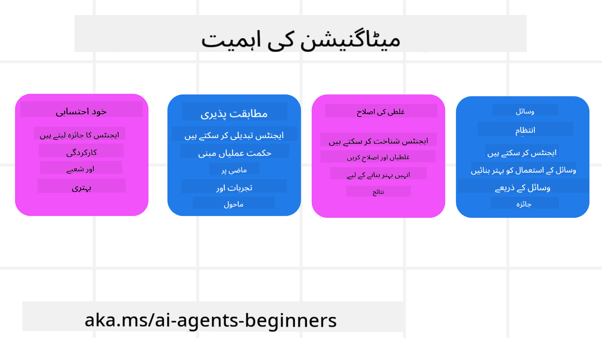
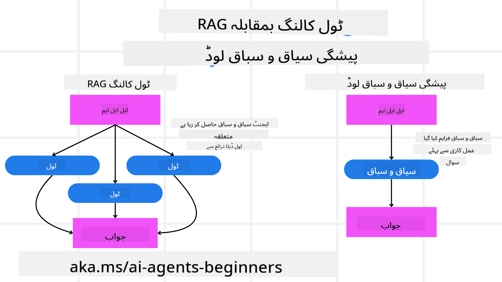

<!--
CO_OP_TRANSLATOR_METADATA:
{
  "original_hash": "8cbf460468c802c7994aa62e0e0779c9",
  "translation_date": "2025-07-12T11:57:32+00:00",
  "source_file": "09-metacognition/README.md",
  "language_code": "ur"
}
-->
[](https://youtu.be/His9R6gw6Ec?si=3_RMb8VprNvdLRhX)

> _(اس سبق کی ویڈیو دیکھنے کے لیے اوپر تصویر پر کلک کریں)_
# AI ایجنٹس میں میٹا کگنیشن

## تعارف

AI ایجنٹس میں میٹا کگنیشن کے سبق میں خوش آمدید! یہ باب ان ابتدائی افراد کے لیے تیار کیا گیا ہے جو جاننا چاہتے ہیں کہ AI ایجنٹس اپنے سوچنے کے عمل کے بارے میں کیسے سوچ سکتے ہیں۔ اس سبق کے آخر تک، آپ اہم تصورات کو سمجھ جائیں گے اور عملی مثالوں کے ذریعے AI ایجنٹ ڈیزائن میں میٹا کگنیشن کو لاگو کرنے کے قابل ہو جائیں گے۔

## سیکھنے کے مقاصد

اس سبق کو مکمل کرنے کے بعد، آپ کر سکیں گے:

1. ایجنٹ کی تعریف میں استدلال کے حلقوں کے اثرات کو سمجھنا۔
2. خود اصلاح کرنے والے ایجنٹس کی مدد کے لیے منصوبہ بندی اور جائزہ تکنیکوں کا استعمال۔
3. اپنے خود کے ایسے ایجنٹس بنانا جو کوڈ کو قابو پانے کے قابل ہوں تاکہ کام مکمل کر سکیں۔

## میٹا کگنیشن کا تعارف

میٹا کگنیشن سے مراد وہ اعلیٰ سطحی ذہنی عمل ہے جس میں اپنی سوچ کے بارے میں سوچنا شامل ہے۔ AI ایجنٹس کے لیے، اس کا مطلب ہے کہ وہ اپنی کارروائیوں کا جائزہ لے سکیں اور خود آگاہی اور ماضی کے تجربات کی بنیاد پر انہیں ایڈجسٹ کر سکیں۔ میٹا کگنیشن، یا "سوچ کے بارے میں سوچنا"، ایجنٹک AI سسٹمز کی ترقی میں ایک اہم تصور ہے۔ اس میں AI سسٹمز کی اپنی داخلی عمل کی آگاہی شامل ہے اور وہ اپنے رویے کی نگرانی، ضابطہ بندی، اور موافقت کر سکتے ہیں۔ بالکل ویسے ہی جیسے ہم ماحول کو سمجھ کر یا مسئلہ دیکھ کر کرتے ہیں۔ یہ خود آگاہی AI سسٹمز کو بہتر فیصلے کرنے، غلطیوں کی نشاندہی کرنے، اور وقت کے ساتھ اپنی کارکردگی بہتر بنانے میں مدد دیتی ہے — جو کہ ٹورنگ ٹیسٹ اور AI کے مستقبل پر بحث سے بھی جڑی ہوئی ہے۔

ایجنٹک AI سسٹمز کے سیاق و سباق میں، میٹا کگنیشن کئی چیلنجز کو حل کرنے میں مدد دے سکتی ہے، جیسے کہ:
- شفافیت: یہ یقینی بنانا کہ AI سسٹمز اپنے استدلال اور فیصلوں کی وضاحت کر سکیں۔
- استدلال: AI سسٹمز کی معلومات کو یکجا کرنے اور معقول فیصلے کرنے کی صلاحیت کو بڑھانا۔
- موافقت: AI سسٹمز کو نئے ماحول اور بدلتے ہوئے حالات کے مطابق ڈھالنے کی اجازت دینا۔
- ادراک: AI سسٹمز کی اپنے ماحول سے ڈیٹا کو پہچاننے اور سمجھنے کی درستگی کو بہتر بنانا۔

### میٹا کگنیشن کیا ہے؟

میٹا کگنیشن، یا "سوچ کے بارے میں سوچنا"، ایک اعلیٰ سطحی ذہنی عمل ہے جس میں اپنی ذہنی عمل کی خود آگاہی اور خود ضابطہ کاری شامل ہے۔ AI کے دائرے میں، میٹا کگنیشن ایجنٹس کو اپنی حکمت عملیوں اور کارروائیوں کا جائزہ لینے اور انہیں ایڈجسٹ کرنے کا اختیار دیتی ہے، جس سے مسئلہ حل کرنے اور فیصلہ سازی کی صلاحیتوں میں بہتری آتی ہے۔ میٹا کگنیشن کو سمجھ کر، آپ ایسے AI ایجنٹس ڈیزائن کر سکتے ہیں جو نہ صرف زیادہ ذہین ہوں بلکہ زیادہ لچکدار اور مؤثر بھی ہوں۔ حقیقی میٹا کگنیشن میں، آپ AI کو اپنے استدلال کے بارے میں واضح طور پر سوچتے ہوئے دیکھیں گے۔

مثال: "میں نے سستی پروازوں کو ترجیح دی کیونکہ... ممکن ہے میں براہ راست پروازوں سے محروم ہوں، لہٰذا مجھے دوبارہ چیک کرنا چاہیے۔"  
یہ ٹریک رکھنا کہ اس نے کسی مخصوص راستے کا انتخاب کیوں کیا۔  
- یہ نوٹ کرنا کہ اس نے غلطیاں کیں کیونکہ اس نے پچھلی بار صارف کی ترجیحات پر زیادہ انحصار کیا، اس لیے وہ اپنی فیصلہ سازی کی حکمت عملی کو تبدیل کرتا ہے نہ کہ صرف آخری سفارش کو۔  
- ایسے پیٹرنز کی تشخیص کرنا جیسے، "جب بھی میں صارف کو 'بہت بھیڑ' کہتے ہوئے دیکھوں، مجھے نہ صرف کچھ مقامات کو ہٹانا چاہیے بلکہ یہ بھی سوچنا چاہیے کہ اگر میں ہمیشہ مقبولیت کی بنیاد پر 'ٹاپ مقامات' چنتا ہوں تو میری انتخاب کی طریقہ کار میں خامی ہے۔"

### AI ایجنٹس میں میٹا کگنیشن کی اہمیت

میٹا کگنیشن AI ایجنٹ ڈیزائن میں کئی وجوہات کی بنا پر اہم کردار ادا کرتی ہے:



- خود عکاسی: ایجنٹس اپنی کارکردگی کا جائزہ لے سکتے ہیں اور بہتری کے مواقع تلاش کر سکتے ہیں۔  
- موافقت پذیری: ایجنٹس ماضی کے تجربات اور بدلتے ہوئے ماحول کی بنیاد پر اپنی حکمت عملیوں کو تبدیل کر سکتے ہیں۔  
- غلطی کی اصلاح: ایجنٹس خودکار طور پر غلطیوں کا پتہ لگا کر انہیں درست کر سکتے ہیں، جس سے نتائج زیادہ درست ہوتے ہیں۔  
- وسائل کا انتظام: ایجنٹس اپنے اعمال کی منصوبہ بندی اور جائزہ لے کر وقت اور کمپیوٹیشنل طاقت جیسے وسائل کا بہتر استعمال کر سکتے ہیں۔

## AI ایجنٹ کے اجزاء

میٹا کگنیشن کے عمل میں غوطہ لگانے سے پہلے، AI ایجنٹ کے بنیادی اجزاء کو سمجھنا ضروری ہے۔ ایک AI ایجنٹ عام طور پر درج ذیل پر مشتمل ہوتا ہے:

- شخصیت: ایجنٹ کی شخصیت اور خصوصیات جو صارفین کے ساتھ اس کے تعامل کو متعین کرتی ہیں۔  
- اوزار: وہ صلاحیتیں اور افعال جو ایجنٹ انجام دے سکتا ہے۔  
- مہارتیں: وہ علم اور مہارت جو ایجنٹ کے پاس ہوتی ہے۔

یہ اجزاء مل کر ایک "مہارت یونٹ" بناتے ہیں جو مخصوص کام انجام دے سکتا ہے۔

**مثال**:  
ایک ٹریول ایجنٹ کو تصور کریں، جو نہ صرف آپ کی چھٹی کی منصوبہ بندی کرتا ہے بلکہ حقیقی وقت کے ڈیٹا اور ماضی کے صارف کے سفر کے تجربات کی بنیاد پر اپنے راستے کو بھی ایڈجسٹ کرتا ہے۔

### مثال: ٹریول ایجنٹ سروس میں میٹا کگنیشن

فرض کریں آپ ایک AI سے چلنے والی ٹریول ایجنٹ سروس ڈیزائن کر رہے ہیں۔ یہ ایجنٹ، "Travel Agent"، صارفین کی تعطیلات کی منصوبہ بندی میں مدد دیتا ہے۔ میٹا کگنیشن کو شامل کرنے کے لیے، Travel Agent کو اپنی کارروائیوں کا جائزہ لینا اور خود آگاہی اور ماضی کے تجربات کی بنیاد پر انہیں ایڈجسٹ کرنا ہوگا۔ میٹا کگنیشن کا کردار کچھ یوں ہو سکتا ہے:

#### موجودہ کام

صارف کی پیرس کے سفر کی منصوبہ بندی میں مدد کرنا۔

#### کام مکمل کرنے کے مراحل

1. **صارف کی ترجیحات جمع کرنا**: صارف سے ان کی سفر کی تاریخیں، بجٹ، دلچسپیاں (جیسے میوزیم، کھانا، خریداری) اور کوئی خاص ضروریات پوچھیں۔  
2. **معلومات حاصل کرنا**: پروازوں، رہائش، سیاحتی مقامات، اور ریستورانوں کی تلاش کریں جو صارف کی ترجیحات سے میل کھاتے ہوں۔  
3. **سفارشات تیار کرنا**: پرواز کی تفصیلات، ہوٹل کی بکنگ، اور تجویز کردہ سرگرمیوں کے ساتھ ذاتی نوعیت کا سفرنامہ فراہم کریں۔  
4. **رائے کی بنیاد پر ایڈجسٹ کرنا**: صارف سے سفارشات پر رائے لیں اور ضروری تبدیلیاں کریں۔

#### مطلوبہ وسائل

- پرواز اور ہوٹل کی بکنگ کے ڈیٹا بیس تک رسائی۔  
- پیرس کے سیاحتی مقامات اور ریستورانوں کی معلومات۔  
- پچھلے تعاملات سے صارف کی رائے کا ڈیٹا۔

#### تجربہ اور خود عکاسی

Travel Agent میٹا کگنیشن کا استعمال کرتے ہوئے اپنی کارکردگی کا جائزہ لیتا ہے اور ماضی کے تجربات سے سیکھتا ہے۔ مثال کے طور پر:

1. **صارف کی رائے کا تجزیہ**: Travel Agent صارف کی رائے کا جائزہ لیتا ہے تاکہ معلوم کرے کون سی سفارشات پسند کی گئیں اور کون سی نہیں۔ وہ اپنی آئندہ تجاویز کو اسی کے مطابق ایڈجسٹ کرتا ہے۔  
2. **موافقت پذیری**: اگر صارف نے پہلے بھیڑ والے مقامات سے ناپسندیدگی ظاہر کی ہے، تو Travel Agent مستقبل میں مصروف اوقات میں مشہور سیاحتی مقامات کی سفارش سے گریز کرے گا۔  
3. **غلطی کی اصلاح**: اگر Travel Agent نے پچھلی بکنگ میں کوئی غلطی کی، جیسے مکمل بک ہو چکا ہوٹل تجویز کرنا، تو وہ سفارشات دینے سے پہلے دستیابی کو زیادہ سختی سے چیک کرنا سیکھتا ہے۔

#### عملی ڈویلپر کی مثال

یہاں ایک سادہ مثال ہے کہ Travel Agent کا کوڈ میٹا کگنیشن کو کیسے شامل کر سکتا ہے:

```python
class Travel_Agent:
    def __init__(self):
        self.user_preferences = {}
        self.experience_data = []

    def gather_preferences(self, preferences):
        self.user_preferences = preferences

    def retrieve_information(self):
        # Search for flights, hotels, and attractions based on preferences
        flights = search_flights(self.user_preferences)
        hotels = search_hotels(self.user_preferences)
        attractions = search_attractions(self.user_preferences)
        return flights, hotels, attractions

    def generate_recommendations(self):
        flights, hotels, attractions = self.retrieve_information()
        itinerary = create_itinerary(flights, hotels, attractions)
        return itinerary

    def adjust_based_on_feedback(self, feedback):
        self.experience_data.append(feedback)
        # Analyze feedback and adjust future recommendations
        self.user_preferences = adjust_preferences(self.user_preferences, feedback)

# Example usage
travel_agent = Travel_Agent()
preferences = {
    "destination": "Paris",
    "dates": "2025-04-01 to 2025-04-10",
    "budget": "moderate",
    "interests": ["museums", "cuisine"]
}
travel_agent.gather_preferences(preferences)
itinerary = travel_agent.generate_recommendations()
print("Suggested Itinerary:", itinerary)
feedback = {"liked": ["Louvre Museum"], "disliked": ["Eiffel Tower (too crowded)"]}
travel_agent.adjust_based_on_feedback(feedback)
```

#### میٹا کگنیشن کی اہمیت کیوں ہے

- **خود عکاسی**: ایجنٹس اپنی کارکردگی کا تجزیہ کر کے بہتری کے مواقع تلاش کر سکتے ہیں۔  
- **موافقت پذیری**: ایجنٹس رائے اور بدلتے حالات کی بنیاد پر حکمت عملیوں میں تبدیلی کر سکتے ہیں۔  
- **غلطی کی اصلاح**: ایجنٹس خودکار طور پر غلطیوں کا پتہ لگا کر انہیں درست کر سکتے ہیں۔  
- **وسائل کا انتظام**: ایجنٹس وقت اور کمپیوٹیشنل طاقت جیسے وسائل کا بہتر استعمال کر سکتے ہیں۔

میٹا کگنیشن کو شامل کر کے، Travel Agent زیادہ ذاتی نوعیت کی اور درست سفری سفارشات فراہم کر سکتا ہے، جس سے صارف کا مجموعی تجربہ بہتر ہوتا ہے۔

---

## 2. ایجنٹس میں منصوبہ بندی

منصوبہ بندی AI ایجنٹ کے رویے کا ایک اہم جزو ہے۔ اس میں مقصد حاصل کرنے کے لیے درکار مراحل کی وضاحت شامل ہوتی ہے، موجودہ حالت، وسائل، اور ممکنہ رکاوٹوں کو مدنظر رکھتے ہوئے۔

### منصوبہ بندی کے عناصر

- **موجودہ کام**: کام کو واضح طور پر متعین کریں۔  
- **کام مکمل کرنے کے مراحل**: کام کو قابلِ انتظام مراحل میں تقسیم کریں۔  
- **مطلوبہ وسائل**: ضروری وسائل کی نشاندہی کریں۔  
- **تجربہ**: منصوبہ بندی کے لیے ماضی کے تجربات کا استعمال کریں۔

**مثال**:  
یہ وہ مراحل ہیں جو Travel Agent کو صارف کی مدد کے لیے اپنی سفر کی منصوبہ بندی میں لینے ہوں گے:

### Travel Agent کے لیے مراحل

1. **صارف کی ترجیحات جمع کرنا**  
   - صارف سے ان کی سفر کی تاریخیں، بجٹ، دلچسپیاں، اور کوئی خاص ضروریات پوچھیں۔  
   - مثالیں: "آپ کب سفر کرنے کا ارادہ رکھتے ہیں؟" "آپ کا بجٹ کیا ہے؟" "آپ تعطیلات میں کون سی سرگرمیاں پسند کرتے ہیں؟"

2. **معلومات حاصل کرنا**  
   - صارف کی ترجیحات کی بنیاد پر متعلقہ سفر کے اختیارات تلاش کریں۔  
   - **پروازیں**: صارف کے بجٹ اور پسندیدہ تاریخوں کے اندر دستیاب پروازیں تلاش کریں۔  
   - **رہائش**: ہوٹل یا کرائے کی جائیدادیں تلاش کریں جو صارف کی ترجیحات کے مطابق ہوں۔  
   - **سیاحتی مقامات اور ریستوران**: صارف کی دلچسپیوں کے مطابق مشہور مقامات، سرگرمیاں، اور کھانے کے مقامات شناخت کریں۔

3. **سفارشات تیار کرنا**  
   - حاصل کردہ معلومات کو ذاتی نوعیت کے سفرنامے میں مرتب کریں۔  
   - پرواز کی تفصیلات، ہوٹل کی بکنگ، اور تجویز کردہ سرگرمیوں کو شامل کریں، اور سفارشات کو صارف کی ترجیحات کے مطابق بنائیں۔

4. **سفرنامہ صارف کو پیش کرنا**  
   - تجویز کردہ سفرنامہ صارف کے جائزے کے لیے شیئر کریں۔  
   - مثال: "یہ آپ کے پیرس کے سفر کے لیے تجویز کردہ سفرنامہ ہے۔ اس میں پرواز کی تفصیلات، ہوٹل کی بکنگ، اور سرگرمیوں کی فہرست شامل ہے۔ اپنی رائے ضرور دیں!"

5. **رائے جمع کرنا**  
   - تجویز کردہ سفرنامے پر صارف کی رائے لیں۔  
   - مثالیں: "کیا آپ کو پرواز کے اختیارات پسند آئے؟" "کیا ہوٹل آپ کی ضروریات کے مطابق ہے؟" "کیا آپ کوئی سرگرمیاں شامل یا حذف کرنا چاہتے ہیں؟"

6. **رائے کی بنیاد پر ایڈجسٹ کرنا**  
   - صارف کی رائے کی بنیاد پر سفرنامے میں تبدیلی کریں۔  
   - پرواز، رہائش، اور سرگرمیوں کی سفارشات کو صارف کی ترجیحات کے مطابق بہتر بنائیں۔

7. **حتمی تصدیق**  
   - اپ ڈیٹ شدہ سفرنامہ صارف کو حتمی تصدیق کے لیے پیش کریں۔  
   - مثال: "میں نے آپ کی رائے کی بنیاد پر تبدیلیاں کی ہیں۔ یہ نیا سفرنامہ ہے۔ کیا سب کچھ ٹھیک لگتا ہے؟"

8. **بکنگ اور تصدیق**  
   - جب صارف سفرنامے کی منظوری دے دے، تو پرواز، رہائش، اور دیگر سرگرمیوں کی بکنگ کریں۔  
   - تصدیقی تفصیلات صارف کو بھیجیں۔

9. **مسلسل مدد فراہم کرنا**  
   - سفر کے دوران اور اس سے پہلے کسی بھی تبدیلی یا اضافی درخواست میں صارف کی مدد کے لیے دستیاب رہیں۔  
   - مثال: "اگر آپ کو سفر کے دوران مزید مدد کی ضرورت ہو تو بلا جھجھک مجھ سے رابطہ کریں!"

### مثال کا تعامل

```python
class Travel_Agent:
    def __init__(self):
        self.user_preferences = {}
        self.experience_data = []

    def gather_preferences(self, preferences):
        self.user_preferences = preferences

    def retrieve_information(self):
        flights = search_flights(self.user_preferences)
        hotels = search_hotels(self.user_preferences)
        attractions = search_attractions(self.user_preferences)
        return flights, hotels, attractions

    def generate_recommendations(self):
        flights, hotels, attractions = self.retrieve_information()
        itinerary = create_itinerary(flights, hotels, attractions)
        return itinerary

    def adjust_based_on_feedback(self, feedback):
        self.experience_data.append(feedback)
        self.user_preferences = adjust_preferences(self.user_preferences, feedback)

# Example usage within a booing request
travel_agent = Travel_Agent()
preferences = {
    "destination": "Paris",
    "dates": "2025-04-01 to 2025-04-10",
    "budget": "moderate",
    "interests": ["museums", "cuisine"]
}
travel_agent.gather_preferences(preferences)
itinerary = travel_agent.generate_recommendations()
print("Suggested Itinerary:", itinerary)
feedback = {"liked": ["Louvre Museum"], "disliked": ["Eiffel Tower (too crowded)"]}
travel_agent.adjust_based_on_feedback(feedback)
```

## 3. اصلاحی RAG سسٹم

سب سے پہلے، RAG ٹول اور Pre-emptive Context Load کے درمیان فرق کو سمجھتے ہیں۔



### Retrieval-Augmented Generation (RAG)

RAG ایک retrieval سسٹم کو generative ماڈل کے ساتھ جوڑتا ہے۔ جب کوئی سوال کیا جاتا ہے، تو retrieval سسٹم بیرونی ماخذ سے متعلقہ دستاویزات یا ڈیٹا حاصل کرتا ہے، اور یہ معلومات generative ماڈل کے ان پٹ کو بڑھانے کے لیے استعمال ہوتی ہے۔ اس سے ماڈل کو زیادہ درست اور سیاق و سباق کے مطابق جوابات پیدا کرنے میں مدد ملتی ہے۔

RAG سسٹم میں، ایجنٹ متعلقہ معلومات knowledge base سے حاصل کرتا ہے اور مناسب جوابات یا کارروائیاں پیدا کرنے کے لیے استعمال کرتا ہے۔

### اصلاحی RAG طریقہ کار

اصلاحی RAG طریقہ کار RAG تکنیکوں کو غلطیوں کی اصلاح اور AI ایجنٹس کی درستگی بہتر بنانے کے لیے استعمال کرتا ہے۔ اس میں شامل ہیں:

1. **Prompting Technique**: ایجنٹ کو متعلقہ معلومات حاصل کرنے کے لیے مخصوص پرامپٹس کا استعمال۔  
2. **Tool**: ایسے الگورتھمز اور میکانزمز کا نفاذ جو ایجنٹ کو حاصل کردہ معلومات کی مطابقت کا جائزہ لینے اور درست جوابات پیدا کرنے کے قابل بنائیں۔  
3. **Evaluation**: ایجنٹ کی کارکردگی کا مسلسل جائزہ لینا اور اس کی درستگی اور مؤثریت کو بہتر بنانے کے لیے ایڈجسٹمنٹ کرنا۔

#### مثال: سرچ ایجنٹ میں اصلاحی RAG

ایک سرچ ایجنٹ کو تصور کریں جو صارف کے سوالات کے جواب کے لیے ویب سے معلومات حاصل کرتا ہے۔ اصلاحی RAG طریقہ کار میں شامل ہو سکتا ہے:

1. **Prompting Technique**: صارف کے ان پٹ کی بنیاد پر سرچ سوالات تیار کرنا۔  
2. **Tool**: قدرتی زبان کی پروسیسنگ اور مشین لرننگ الگورتھمز کا استعمال کر کے سرچ نتائج کو درجہ بندی اور فلٹر کرنا۔  
3. **Evaluation**: صارف کی رائے کا تجزیہ کر کے حاصل کردہ معلومات میں غلطیوں کی نشاندہی اور اصلاح کرنا۔

### ٹریول ایجنٹ میں اصلاحی RAG

اصلاحی RAG (Retrieval-Augmented Generation) AI کی معلومات حاصل کرنے اور پیدا کرنے کی صلاحیت کو بہتر بناتا ہے جبکہ کسی بھی غلطی کو درست کرتا ہے۔ آئیے دیکھتے ہیں کہ Travel Agent کس طرح اصلاحی RAG طریقہ کار استعمال کر کے زیادہ درست اور متعلقہ سفری سفارشات فراہم کر سکتا ہے۔

اس میں شامل ہیں:

- **Prompting Technique:** ایجنٹ کو متعلقہ معلومات حاصل کرنے کے لیے مخصوص پرامپٹس کا استعمال۔  
- **Tool:** ایسے الگورتھمز اور میکانزمز کا نفاذ جو ایجنٹ کو حاصل کردہ معلومات کی مطابقت کا جائزہ لینے اور درست جوابات پیدا کرنے کے قابل بنائیں۔  
- **Evaluation:** ایجنٹ کی کارکردگی کا مسلسل جائزہ لینا اور اس کی درستگی اور مؤثریت کو بہتر بنانے کے لیے ایڈجسٹمنٹ کرنا۔

#### ٹریول ایجنٹ میں اصلاحی RAG کے نفاذ کے مراحل

1. **ابتدائی صارف تعامل**  
   - Travel Agent صارف سے ابتدائی ترجیحات جمع کرتا ہے، جیسے منزل، سفر کی تاریخیں، بجٹ، اور دلچسپیاں۔  
   - مثال:

     ```python
     preferences = {
         "destination": "Paris",
         "dates": "2025-04-01 to 2025-04-10",
         "budget": "moderate",
         "interests": ["museums", "cuisine"]
     }
     ```

2. **معلومات کی بازیافت**  
   - Travel Agent صارف کی ترجیحات کی بنیاد پر پروازوں، رہائش، سیاحتی مقامات، اور ریستورانوں کی معلومات حاصل کرتا ہے۔  
   - مثال:

     ```python
     flights = search_flights(preferences)
     hotels = search_hotels(preferences)
     attractions = search_attractions(preferences)
     ```

3. **ابتدائی سفارشات تیار کرنا**  
   - Travel Agent حاصل کردہ معلومات کی بنیاد پر ذاتی نوعیت کا سفرنامہ تیار کرتا ہے۔  
   - مثال:

     ```python
     itinerary = create_itinerary(flights, hotels, attractions)
     print("Suggested Itinerary:", itinerary)
     ```

4. **صارف کی رائے جمع کرنا**  
   - Travel Agent ابتدائی سفارشات پر صارف کی رائے لیتا ہے۔  
   - مثال:

     @@CODE_BLOCK_
### پری ایمپٹیو کانٹیکسٹ لوڈ

پری ایمپٹیو کانٹیکسٹ لوڈ کا مطلب ہے کہ ماڈل کو کسی سوال کو پروسیس کرنے سے پہلے متعلقہ سیاق و سباق یا پس منظر کی معلومات فراہم کرنا۔ اس کا مطلب ہے کہ ماڈل کو شروع سے ہی یہ معلومات دستیاب ہوتی ہیں، جو اسے مزید معلوماتی جوابات دینے میں مدد دیتی ہے بغیر اس کے کہ اسے عمل کے دوران اضافی ڈیٹا حاصل کرنا پڑے۔

یہاں ایک سادہ مثال دی گئی ہے کہ پری ایمپٹیو کانٹیکسٹ لوڈ ایک ٹریول ایجنٹ ایپلیکیشن میں Python میں کیسے نظر آ سکتا ہے:

```python
class TravelAgent:
    def __init__(self):
        # Pre-load popular destinations and their information
        self.context = {
            "Paris": {"country": "France", "currency": "Euro", "language": "French", "attractions": ["Eiffel Tower", "Louvre Museum"]},
            "Tokyo": {"country": "Japan", "currency": "Yen", "language": "Japanese", "attractions": ["Tokyo Tower", "Shibuya Crossing"]},
            "New York": {"country": "USA", "currency": "Dollar", "language": "English", "attractions": ["Statue of Liberty", "Times Square"]},
            "Sydney": {"country": "Australia", "currency": "Dollar", "language": "English", "attractions": ["Sydney Opera House", "Bondi Beach"]}
        }

    def get_destination_info(self, destination):
        # Fetch destination information from pre-loaded context
        info = self.context.get(destination)
        if info:
            return f"{destination}:\nCountry: {info['country']}\nCurrency: {info['currency']}\nLanguage: {info['language']}\nAttractions: {', '.join(info['attractions'])}"
        else:
            return f"Sorry, we don't have information on {destination}."

# Example usage
travel_agent = TravelAgent()
print(travel_agent.get_destination_info("Paris"))
print(travel_agent.get_destination_info("Tokyo"))
```

#### وضاحت

1. **ابتدائیہ (`__init__` میتھڈ)**: `TravelAgent` کلاس ایک ڈکشنری کو پری لوڈ کرتی ہے جس میں مشہور مقامات جیسے پیرس، ٹوکیو، نیو یارک، اور سڈنی کی معلومات شامل ہوتی ہیں۔ اس ڈکشنری میں ہر مقام کے ملک، کرنسی، زبان، اور اہم سیاحتی مقامات کی تفصیلات شامل ہیں۔

2. **معلومات حاصل کرنا (`get_destination_info` میتھڈ)**: جب صارف کسی خاص مقام کے بارے میں سوال کرتا ہے، تو `get_destination_info` میتھڈ پری لوڈ شدہ کانٹیکسٹ ڈکشنری سے متعلقہ معلومات حاصل کرتا ہے۔

کانٹیکسٹ کو پری لوڈ کرنے سے، ٹریول ایجنٹ ایپلیکیشن صارف کے سوالات کا فوری جواب دے سکتی ہے بغیر اس کے کہ اسے حقیقی وقت میں بیرونی ذریعہ سے معلومات حاصل کرنی پڑے۔ اس سے ایپلیکیشن زیادہ مؤثر اور تیز رفتار ہو جاتی ہے۔

### مقصد کے ساتھ پلان کو بوٹ اسٹریپ کرنا اور پھر تکرار کرنا

مقصد کے ساتھ پلان کو بوٹ اسٹریپ کرنے کا مطلب ہے کہ آپ شروع میں ہی ایک واضح ہدف یا نتیجہ طے کر لیں۔ اس ہدف کو پہلے سے متعین کرنے سے ماڈل اسے رہنما اصول کے طور پر استعمال کر سکتا ہے پورے تکراری عمل کے دوران۔ اس سے یہ یقینی بنتا ہے کہ ہر تکرار مطلوبہ نتیجے کے قریب تر ہو، جس سے عمل زیادہ مؤثر اور مرکوز ہو جاتا ہے۔

یہاں ایک مثال ہے کہ آپ Python میں ایک ٹریول ایجنٹ کے لیے مقصد کے ساتھ پلان کو بوٹ اسٹریپ کر کے پھر تکرار کیسے کر سکتے ہیں:

### منظر نامہ

ایک ٹریول ایجنٹ اپنے کلائنٹ کے لیے ایک حسبِ منشا تعطیلات کا منصوبہ بنانا چاہتا ہے۔ مقصد یہ ہے کہ کلائنٹ کی ترجیحات اور بجٹ کی بنیاد پر ایک ایسا سفرنامہ تیار کیا جائے جو اس کی زیادہ سے زیادہ تسکین فراہم کرے۔

### مراحل

1. کلائنٹ کی ترجیحات اور بجٹ کی وضاحت کریں۔
2. ان ترجیحات کی بنیاد پر ابتدائی پلان تیار کریں۔
3. پلان کو بہتر بنانے کے لیے تکرار کریں، تاکہ کلائنٹ کی تسکین کو زیادہ سے زیادہ کیا جا سکے۔

#### Python کوڈ

```python
class TravelAgent:
    def __init__(self, destinations):
        self.destinations = destinations

    def bootstrap_plan(self, preferences, budget):
        plan = []
        total_cost = 0

        for destination in self.destinations:
            if total_cost + destination['cost'] <= budget and self.match_preferences(destination, preferences):
                plan.append(destination)
                total_cost += destination['cost']

        return plan

    def match_preferences(self, destination, preferences):
        for key, value in preferences.items():
            if destination.get(key) != value:
                return False
        return True

    def iterate_plan(self, plan, preferences, budget):
        for i in range(len(plan)):
            for destination in self.destinations:
                if destination not in plan and self.match_preferences(destination, preferences) and self.calculate_cost(plan, destination) <= budget:
                    plan[i] = destination
                    break
        return plan

    def calculate_cost(self, plan, new_destination):
        return sum(destination['cost'] for destination in plan) + new_destination['cost']

# Example usage
destinations = [
    {"name": "Paris", "cost": 1000, "activity": "sightseeing"},
    {"name": "Tokyo", "cost": 1200, "activity": "shopping"},
    {"name": "New York", "cost": 900, "activity": "sightseeing"},
    {"name": "Sydney", "cost": 1100, "activity": "beach"},
]

preferences = {"activity": "sightseeing"}
budget = 2000

travel_agent = TravelAgent(destinations)
initial_plan = travel_agent.bootstrap_plan(preferences, budget)
print("Initial Plan:", initial_plan)

refined_plan = travel_agent.iterate_plan(initial_plan, preferences, budget)
print("Refined Plan:", refined_plan)
```

#### کوڈ کی وضاحت

1. **ابتدائیہ (`__init__` میتھڈ)**: `TravelAgent` کلاس ممکنہ مقامات کی ایک فہرست کے ساتھ شروع ہوتی ہے، جن میں ہر مقام کے نام، لاگت، اور سرگرمی کی قسم جیسی خصوصیات شامل ہوتی ہیں۔

2. **پلان کو بوٹ اسٹریپ کرنا (`bootstrap_plan` میتھڈ)**: یہ میتھڈ کلائنٹ کی ترجیحات اور بجٹ کی بنیاد پر ابتدائی سفرنامہ تیار کرتا ہے۔ یہ مقامات کی فہرست میں سے ان مقامات کو پلان میں شامل کرتا ہے جو کلائنٹ کی ترجیحات سے میل کھاتے ہوں اور بجٹ میں فٹ ہوں۔

3. **ترجیحات سے میل کھانا (`match_preferences` میتھڈ)**: یہ میتھڈ چیک کرتا ہے کہ آیا کوئی مقام کلائنٹ کی ترجیحات سے میل کھاتا ہے یا نہیں۔

4. **پلان کو تکرار کرنا (`iterate_plan` میتھڈ)**: یہ میتھڈ ابتدائی پلان کو بہتر بناتا ہے، ہر مقام کو بہتر متبادل سے بدلنے کی کوشش کرتا ہے، کلائنٹ کی ترجیحات اور بجٹ کو مدنظر رکھتے ہوئے۔

5. **لاگت کا حساب لگانا (`calculate_cost` میتھڈ)**: یہ میتھڈ موجودہ پلان کی کل لاگت کا حساب لگاتا ہے، جس میں ممکنہ نیا مقام بھی شامل ہو سکتا ہے۔

#### مثال کے طور پر استعمال

- **ابتدائی پلان**: ٹریول ایجنٹ کلائنٹ کی ترجیحات (مثلاً سیاحت) اور $2000 کے بجٹ کی بنیاد پر ابتدائی پلان تیار کرتا ہے۔
- **بہتر شدہ پلان**: ٹریول ایجنٹ پلان کو تکرار کرتا ہے، کلائنٹ کی ترجیحات اور بجٹ کے مطابق اسے بہتر بناتا ہے۔

مقصد کے ساتھ پلان کو بوٹ اسٹریپ کر کے اور پھر تکرار کر کے، ٹریول ایجنٹ کلائنٹ کے لیے ایک حسبِ منشا اور بہتر سفرنامہ تیار کر سکتا ہے۔ یہ طریقہ کار اس بات کو یقینی بناتا ہے کہ سفر کا منصوبہ شروع سے ہی کلائنٹ کی ترجیحات اور بجٹ کے مطابق ہو اور ہر تکرار کے ساتھ بہتر ہوتا جائے۔

### LLM کا فائدہ اٹھانا: ری-رینکنگ اور اسکورنگ

بڑے زبان کے ماڈلز (LLMs) کو ری-رینکنگ اور اسکورنگ کے لیے استعمال کیا جا سکتا ہے تاکہ حاصل شدہ دستاویزات یا جوابات کی مطابقت اور معیار کا جائزہ لیا جا سکے۔ طریقہ کار کچھ یوں ہے:

**حاصل کرنا:** ابتدائی مرحلہ میں سوال کی بنیاد پر ممکنہ دستاویزات یا جوابات حاصل کیے جاتے ہیں۔

**ری-رینکنگ:** LLM ان امیدواروں کا جائزہ لے کر انہیں ان کی مطابقت اور معیار کی بنیاد پر دوبارہ ترتیب دیتا ہے۔ اس سے سب سے زیادہ متعلقہ اور معیاری معلومات پہلے پیش کی جاتی ہیں۔

**اسکورنگ:** LLM ہر امیدوار کو اسکور دیتا ہے جو اس کی مطابقت اور معیار کی عکاسی کرتا ہے۔ اس سے بہترین جواب یا دستاویز منتخب کرنے میں مدد ملتی ہے۔

LLM کی مدد سے ری-رینکنگ اور اسکورنگ کرنے سے نظام زیادہ درست اور سیاق و سباق کے مطابق معلومات فراہم کر سکتا ہے، جس سے صارف کا تجربہ بہتر ہوتا ہے۔

یہاں ایک مثال ہے کہ ایک ٹریول ایجنٹ کس طرح LLM کو استعمال کر کے صارف کی ترجیحات کی بنیاد پر سفر کے مقامات کو ری-رینک اور اسکور کر سکتا ہے، Python میں:

#### منظر نامہ - ترجیحات کی بنیاد پر سفر

ایک ٹریول ایجنٹ کلائنٹ کی ترجیحات کی بنیاد پر بہترین سفر کے مقامات تجویز کرنا چاہتا ہے۔ LLM ان مقامات کو ری-رینک اور اسکور کرے گا تاکہ سب سے متعلقہ اختیارات پیش کیے جا سکیں۔

#### مراحل:

1. صارف کی ترجیحات جمع کریں۔
2. ممکنہ سفر کے مقامات کی فہرست حاصل کریں۔
3. LLM کا استعمال کرتے ہوئے ان مقامات کو صارف کی ترجیحات کی بنیاد پر ری-رینک اور اسکور کریں۔

Azure OpenAI Services استعمال کرنے کے لیے پچھلی مثال کو اس طرح اپ ڈیٹ کریں:

#### ضروریات

1. آپ کے پاس Azure سبسکرپشن ہونا چاہیے۔
2. Azure OpenAI ریسورس بنائیں اور اپنی API کی حاصل کریں۔

#### Python کوڈ کی مثال

```python
import requests
import json

class TravelAgent:
    def __init__(self, destinations):
        self.destinations = destinations

    def get_recommendations(self, preferences, api_key, endpoint):
        # Generate a prompt for the Azure OpenAI
        prompt = self.generate_prompt(preferences)
        
        # Define headers and payload for the request
        headers = {
            'Content-Type': 'application/json',
            'Authorization': f'Bearer {api_key}'
        }
        payload = {
            "prompt": prompt,
            "max_tokens": 150,
            "temperature": 0.7
        }
        
        # Call the Azure OpenAI API to get the re-ranked and scored destinations
        response = requests.post(endpoint, headers=headers, json=payload)
        response_data = response.json()
        
        # Extract and return the recommendations
        recommendations = response_data['choices'][0]['text'].strip().split('\n')
        return recommendations

    def generate_prompt(self, preferences):
        prompt = "Here are the travel destinations ranked and scored based on the following user preferences:\n"
        for key, value in preferences.items():
            prompt += f"{key}: {value}\n"
        prompt += "\nDestinations:\n"
        for destination in self.destinations:
            prompt += f"- {destination['name']}: {destination['description']}\n"
        return prompt

# Example usage
destinations = [
    {"name": "Paris", "description": "City of lights, known for its art, fashion, and culture."},
    {"name": "Tokyo", "description": "Vibrant city, famous for its modernity and traditional temples."},
    {"name": "New York", "description": "The city that never sleeps, with iconic landmarks and diverse culture."},
    {"name": "Sydney", "description": "Beautiful harbour city, known for its opera house and stunning beaches."},
]

preferences = {"activity": "sightseeing", "culture": "diverse"}
api_key = 'your_azure_openai_api_key'
endpoint = 'https://your-endpoint.com/openai/deployments/your-deployment-name/completions?api-version=2022-12-01'

travel_agent = TravelAgent(destinations)
recommendations = travel_agent.get_recommendations(preferences, api_key, endpoint)
print("Recommended Destinations:")
for rec in recommendations:
    print(rec)
```

#### کوڈ کی وضاحت - Preference Booker

1. **ابتدائیہ**: `TravelAgent` کلاس ممکنہ سفر کے مقامات کی فہرست کے ساتھ شروع ہوتی ہے، جن میں ہر مقام کے نام اور تفصیل شامل ہوتی ہے۔

2. **تجویزات حاصل کرنا (`get_recommendations` میتھڈ)**: یہ میتھڈ صارف کی ترجیحات کی بنیاد پر Azure OpenAI سروس کے لیے پرامپٹ تیار کرتا ہے اور Azure OpenAI API کو HTTP POST درخواست بھیج کر ری-رینک اور اسکور شدہ مقامات حاصل کرتا ہے۔

3. **پرامپٹ تیار کرنا (`generate_prompt` میتھڈ)**: یہ میتھڈ Azure OpenAI کے لیے پرامپٹ بناتا ہے، جس میں صارف کی ترجیحات اور مقامات کی فہرست شامل ہوتی ہے۔ پرامپٹ ماڈل کو رہنمائی دیتا ہے کہ وہ دی گئی ترجیحات کی بنیاد پر مقامات کو ری-رینک اور اسکور کرے۔

4. **API کال**: `requests` لائبریری کا استعمال کرتے ہوئے Azure OpenAI API کو HTTP POST درخواست بھیجی جاتی ہے۔ جواب میں ری-رینک اور اسکور شدہ مقامات آتے ہیں۔

5. **مثال کے طور پر استعمال**: ٹریول ایجنٹ صارف کی ترجیحات (مثلاً سیاحت اور متنوع ثقافت میں دلچسپی) جمع کرتا ہے اور Azure OpenAI سروس کا استعمال کرتے ہوئے ری-رینک اور اسکور شدہ تجاویز حاصل کرتا ہے۔

یقینی بنائیں کہ `your_azure_openai_api_key` کو اپنی حقیقی Azure OpenAI API کی سے اور `https://your-endpoint.com/...` کو اپنے Azure OpenAI ڈپلائمنٹ کے اصل اینڈپوائنٹ URL سے تبدیل کریں۔

LLM کی مدد سے ری-رینکنگ اور اسکورنگ کر کے، ٹریول ایجنٹ کلائنٹس کو زیادہ ذاتی نوعیت اور متعلقہ سفر کی تجاویز دے سکتا ہے، جس سے ان کا مجموعی تجربہ بہتر ہوتا ہے۔

### RAG: پرامپٹنگ تکنیک بمقابلہ ٹول

Retrieval-Augmented Generation (RAG) دونوں طرح سے استعمال ہو سکتا ہے: ایک پرامپٹنگ تکنیک کے طور پر اور ایک ٹول کے طور پر AI ایجنٹس کی ترقی میں۔ ان دونوں کے فرق کو سمجھنا آپ کو RAG کو اپنے پروجیکٹس میں بہتر طریقے سے استعمال کرنے میں مدد دے گا۔

#### RAG بطور پرامپٹنگ تکنیک

**یہ کیا ہے؟**

- ایک پرامپٹنگ تکنیک کے طور پر، RAG مخصوص سوالات یا پرامپٹس تیار کرنے پر مشتمل ہے تاکہ بڑے ڈیٹا بیس یا ذخیرے سے متعلقہ معلومات حاصل کی جا سکیں۔ پھر یہ معلومات جوابات یا کارروائیوں کی تخلیق کے لیے استعمال ہوتی ہیں۔

**یہ کیسے کام کرتا ہے:**

1. **پرامپٹس تیار کریں**: کام یا صارف کی ان پٹ کی بنیاد پر اچھی طرح سے ساختہ پرامپٹس یا سوالات بنائیں۔
2. **معلومات حاصل کریں**: پرامپٹس کا استعمال کرتے ہوئے پہلے سے موجود علم یا ڈیٹا بیس سے متعلقہ معلومات تلاش کریں۔
3. **جواب تیار کریں**: حاصل شدہ معلومات کو جنریٹو AI ماڈلز کے ساتھ ملا کر جامع اور مربوط جواب تیار کریں۔

**ٹریول ایجنٹ میں مثال**:

- صارف کا ان پٹ: "میں پیرس کے میوزیم دیکھنا چاہتا ہوں۔"
- پرامپٹ: "پیرس کے بہترین میوزیم تلاش کریں۔"
- حاصل شدہ معلومات: لوور میوزیم، میوزے ڈورسی، وغیرہ کی تفصیلات۔
- تیار کردہ جواب: "یہاں پیرس کے چند بہترین میوزیم ہیں: لوور میوزیم، میوزے ڈورسی، اور سینٹر پومپیڈو۔"

#### RAG بطور ٹول

**یہ کیا ہے؟**

- ایک ٹول کے طور پر، RAG ایک مربوط نظام ہے جو خودکار طریقے سے معلومات حاصل کرنے اور جوابات تیار کرنے کے عمل کو سنبھالتا ہے، جس سے ڈویلپرز کے لیے پیچیدہ AI فنکشنز کو آسانی سے نافذ کرنا ممکن ہوتا ہے بغیر ہر سوال کے لیے پرامپٹ خود بنانے کے۔

**یہ کیسے کام کرتا ہے:**

1. **انضمام**: RAG کو AI ایجنٹ کی ساخت میں شامل کریں تاکہ یہ خودکار طور پر معلومات حاصل کرنے اور جوابات تیار کرنے کے عمل کو سنبھال سکے۔
2. **خودکاری**: یہ ٹول پورے عمل کو خودکار بناتا ہے، صارف کی ان پٹ وصول کرنے سے لے کر حتمی جواب تیار کرنے تک، بغیر ہر مرحلے کے لیے واضح پرامپٹ کی ضرورت کے۔
3. **موثریت**: ایجنٹ کی کارکردگی کو بہتر بناتا ہے، معلومات حاصل کرنے اور جوابات تیار کرنے کے عمل کو تیز اور درست بناتا ہے۔

**ٹریول ایجنٹ میں مثال**:

- صارف کا ان پٹ: "میں پیرس کے میوزیم دیکھنا چاہتا ہوں۔"
- RAG ٹول: خودکار طور پر میوزیم کی معلومات حاصل کرتا ہے اور جواب تیار کرتا ہے۔
- تیار کردہ جواب: "یہاں پیرس کے چند بہترین میوزیم ہیں: لوور میوزیم، میوزے ڈورسی، اور سینٹر پومپیڈو۔"

### موازنہ

| پہلو                   | پرامپٹنگ تکنیک                                         | ٹول                                                    |
|------------------------|---------------------------------------------------------|--------------------------------------------------------|
| **دستی بمقابلہ خودکار**| ہر سوال کے لیے پرامپٹ دستی طور پر تیار کرنا۔            | معلومات حاصل کرنے اور جوابات تیار کرنے کا خودکار عمل۔  |
| **کنٹرول**             | معلومات حاصل کرنے کے عمل پر زیادہ کنٹرول فراہم کرتا ہے۔ | معلومات حاصل کرنے اور جوابات تیار کرنے کو خودکار بناتا ہے۔|
| **لچک**                | مخصوص ضروریات کے مطابق پرامپٹس کو حسبِ ضرورت ڈھالنا ممکن۔| بڑے پیمانے پر نفاذ کے لیے زیادہ مؤثر۔                   |
| **پیچیدگی**            | پرامپٹس کی تیاری اور ایڈجسٹمنٹ کی ضرورت ہوتی ہے۔         | AI ایجنٹ کی ساخت میں آسانی سے شامل کیا جا سکتا ہے۔       |

### عملی مثالیں

**پرامپٹنگ تکنیک کی مثال:**

```python
def search_museums_in_paris():
    prompt = "Find top museums in Paris"
    search_results = search_web(prompt)
    return search_results

museums = search_museums_in_paris()
print("Top Museums in Paris:", museums)
```

**ٹول کی مثال:**

```python
class Travel_Agent:
    def __init__(self):
        self.rag_tool = RAGTool()

    def get_museums_in_paris(self):
        user_input = "I want to visit museums in Paris."
        response = self.rag_tool.retrieve_and_generate(user_input)
        return response

travel_agent = Travel_Agent()
museums = travel_agent.get_museums_in_paris()
print("Top Museums in Paris:", museums)
```

### مطابقت کا جائزہ لینا

مطابقت کا جائزہ لینا AI ایجنٹ کی کارکردگی کا ایک اہم پہلو ہے۔ یہ یقینی بناتا ہے کہ ایجنٹ کی طرف سے حاصل کی گئی اور تیار کی گئی معلومات صارف کے لیے مناسب، درست، اور مفید ہوں۔ آئیے دیکھتے ہیں کہ AI ایجنٹس میں مطابقت کا جائزہ کیسے لیا جاتا ہے، عملی مثالوں اور تکنیکوں کے ساتھ۔

#### مطابقت کے جائزے کے کلیدی تصورات

1. **سیاق و سباق کی آگاہی**:
   - ایجنٹ کو صارف کے سوال کے سیاق و سباق کو سمجھنا چاہیے تاکہ متعلقہ معلومات حاصل اور تیار کی جا سکیں۔
   - مثال: اگر صارف پوچھے "پیرس کے بہترین ریستوران کون سے ہیں؟"، تو ایجنٹ کو صارف کی ترجیحات جیسے کھانے کی قسم اور بجٹ کو مدنظر رکھنا چاہیے۔

2. **درستگی**:
   - ایجنٹ کی فراہم کردہ معلومات حقائق پر مبنی اور تازہ ترین ہونی چاہیے۔
   - مثال: ایسے ریستوران تجویز کرنا جو فی الحال کھلے ہوں اور اچھے جائزے رکھتے ہوں، نہ کہ بند یا پرانے۔

3. **صارف کا ارادہ**:
   - ایجنٹ کو صارف کے سوال کے پیچھے موجود ارادے کا اندازہ لگانا چاہیے تاکہ سب سے متعلقہ معلومات فراہم کی جا سکیں۔
   - مثال: اگر صارف "بجٹ فرینڈلی ہوٹلز" پوچھے، تو ایجنٹ کو سستی جگہوں کو ترجیح دینی چاہیے۔

4. **فیڈبیک لوپ**:
   - صارف کی رائے مسلسل جمع کرنا اور تجزیہ کرنا ایجنٹ کو مطابقت کے جائزے کے عمل کو بہتر بنانے میں مدد دیتا ہے۔
   - مثال: پچھلی تجاویز پر صارف کی درجہ بندی اور فیڈبیک کو شامل کرنا تاکہ آئندہ جوابات بہتر ہوں۔

#### مطابقت کے جائزے کی عملی تکنیکیں

1. **مطابقت اسکورنگ**:
   - ہر حاصل شدہ آئٹم کو صارف کے سوال اور ترجیحات سے میل کھانے کی بنیاد پر ایک اسکور دیا جاتا ہے۔
   - مثال:

     ```python
     def relevance_score(item, query):
         score = 0
         if item['category'] in query['interests']:
             score += 1
         if item['price'] <= query['budget']:
             score += 1
         if item['location'] == query['destination']:
             score += 1
         return score
     ```

2. **فلٹرنگ اور رینکنگ**:
   - غیر متعلقہ آئٹمز کو فلٹر کریں اور باقی کو ان کے مطابقت اسکور کی بنیاد پر ترتیب دیں۔
   - مثال:

     ```python
     def filter_and_rank(items, query):
         ranked_items = sorted(items, key=lambda item: relevance_score(item, query), reverse=True)
         return ranked_items[:10]  # Return top 10 relevant items
     ```

3. **نیچرل لینگویج پروسیسنگ (NLP)**:
   - صارف کے سوال کو سمجھنے اور متعلقہ معلومات حاصل کرنے کے لیے NLP تکنیکوں کا استعمال کریں۔
   - مثال:

     ```python
     def process_query(query):
         # Use NLP to extract key information from the user's query
         processed_query = nlp(query)
         return processed_query
     ```

4. **صارف کی رائے کا انضمام**:
   - فراہم کردہ تجاویز پر صارف کی رائے جمع کریں اور اسے مستقبل کی مطابقت کی تشخیص میں شامل کریں۔
   - مثال:

     ```python
     def adjust_based_on_feedback(feedback, items):
         for item in items:
             if item['name'] in feedback['liked']:
                 item['relevance'] += 1
             if item['name'] in feedback['disliked']:
                 item['relevance'] -= 1
         return items
     ```

#### مثال: ٹریول ایجنٹ میں مطابقت کا جائزہ لینا

یہاں ایک عملی مثال ہے کہ ٹریول ایجنٹ کس طرح سفر کی تجاویز کی مطابقت کا جائزہ لے سکتا ہے:

```python
class Travel_Agent:
    def __init__(self):
        self.user_preferences = {}
        self.experience_data = []

    def gather_preferences(self, preferences):
        self.user_preferences = preferences

    def retrieve_information(self):
        flights = search_flights(self.user_preferences)
        hotels = search_hotels(self.user_preferences)
        attractions = search_attractions(self.user_preferences)
        return flights, hotels, attractions

    def generate_recommendations(self):
        flights, hotels, attractions = self.retrieve_information()
        ranked_hotels = self.filter_and_rank(hotels, self.user_preferences)
        itinerary = create_itinerary(flights, ranked_hotels, attractions)
        return itinerary

    def filter_and_rank(self, items, query):
        ranked_items = sorted(items, key=lambda item: self.relevance_score(item, query), reverse=True)
        return ranked_items[:10]  # Return top 10 relevant items

    def relevance_score(self, item, query):
        score = 0
        if item['category'] in query['interests']:
            score += 1
        if item['price'] <= query['budget']:
            score += 1
        if item['location'] == query['destination']:
            score += 1
        return score

    def adjust_based_on_feedback(self, feedback, items):
        for item in items:
            if item['name'] in feedback['liked']:
                item['relevance'] += 1
            if item['name'] in feedback['disliked']:
                item['relevance'] -= 1
        return items

# Example usage
travel_agent = Travel_Agent()
preferences = {
    "destination": "Paris",
    "dates": "2025-04-01 to 2025-04-10",
    "budget": "moderate",
    "interests": ["museums", "cuisine"]
}
travel_agent.gather_preferences(preferences)
itinerary = travel_agent.generate_recommendations()
print("Suggested Itinerary:", itinerary)
feedback = {"liked": ["Louvre Museum"], "disliked": ["Eiffel Tower (too crowded)"]}
updated_items = travel_agent.adjust_based_on_feedback(feedback, itinerary['hotels'])
print("Updated Itinerary with Feedback:", updated_items)
```

### ارادے کے ساتھ تلاش

ارادے کے ساتھ تلاش کا مطلب ہے صارف کے سوال کے پیچھے موجود مقصد یا ہدف کو سمجھنا اور اس کی تشریح کرنا تاکہ سب سے متعلقہ اور مفید معلومات حاصل اور تیار کی جا سکیں۔ یہ طریقہ صرف کلیدی الفاظ سے میل کھانے سے آگے بڑھ کر صارف کی اصل ضروریات اور سیاق و سباق کو سمجھنے پر مرکوز ہوتا ہے۔

#### ارادے کے ساتھ تلاش کے کلیدی تصورات

1. **صارف کے ارادے کو سمجھنا**:
   - صارف کے ارادے کو تین بنیادی اقسام میں تقسیم کیا جا سکتا ہے: معلوماتی، نیویگیشنل، اور لین دین سے متعلق۔
     - **معلوماتی ارادہ**: صارف کسی موضوع کے بارے میں معلومات حاصل کرنا چاہتا ہے (مثلاً "پیرس کے بہترین میوزیم کون سے ہیں؟")۔
     - **نیویگیشنل ارادہ**: صارف کسی مخصوص ویب سائٹ یا صفحے پر جانا چاہتا ہے (مثلاً "لوور میوزیم کی آفیشل ویب سائٹ")۔
     - **لین دین کا ارادہ**: صارف کوئی لین دین کرنا چاہتا ہے، جیسے فلائٹ بک کرنا یا خریداری کرنا (مثلاً "پیرس کے لیے
#### عملی مثال: سفر کے ایجنٹ میں ارادے کے ساتھ تلاش

آئیے سفر کے ایجنٹ کی مثال لیتے ہیں تاکہ دیکھیں کہ ارادے کے ساتھ تلاش کیسے نافذ کی جا سکتی ہے۔

1. **صارف کی ترجیحات جمع کرنا**

   ```python
   class Travel_Agent:
       def __init__(self):
           self.user_preferences = {}

       def gather_preferences(self, preferences):
           self.user_preferences = preferences
   ```

2. **صارف کے ارادے کو سمجھنا**

   ```python
   def identify_intent(query):
       if "book" in query or "purchase" in query:
           return "transactional"
       elif "website" in query or "official" in query:
           return "navigational"
       else:
           return "informational"
   ```

3. **سیاق و سباق کی آگاہی**

   ```python
   def analyze_context(query, user_history):
       # Combine current query with user history to understand context
       context = {
           "current_query": query,
           "user_history": user_history
       }
       return context
   ```

4. **تلاش اور نتائج کو ذاتی بنانا**

   ```python
   def search_with_intent(query, preferences, user_history):
       intent = identify_intent(query)
       context = analyze_context(query, user_history)
       if intent == "informational":
           search_results = search_information(query, preferences)
       elif intent == "navigational":
           search_results = search_navigation(query)
       elif intent == "transactional":
           search_results = search_transaction(query, preferences)
       personalized_results = personalize_results(search_results, user_history)
       return personalized_results

   def search_information(query, preferences):
       # Example search logic for informational intent
       results = search_web(f"best {preferences['interests']} in {preferences['destination']}")
       return results

   def search_navigation(query):
       # Example search logic for navigational intent
       results = search_web(query)
       return results

   def search_transaction(query, preferences):
       # Example search logic for transactional intent
       results = search_web(f"book {query} to {preferences['destination']}")
       return results

   def personalize_results(results, user_history):
       # Example personalization logic
       personalized = [result for result in results if result not in user_history]
       return personalized[:10]  # Return top 10 personalized results
   ```

5. **مثال کا استعمال**

   ```python
   travel_agent = Travel_Agent()
   preferences = {
       "destination": "Paris",
       "interests": ["museums", "cuisine"]
   }
   travel_agent.gather_preferences(preferences)
   user_history = ["Louvre Museum website", "Book flight to Paris"]
   query = "best museums in Paris"
   results = search_with_intent(query, preferences, user_history)
   print("Search Results:", results)
   ```

---

## 4. ایک ٹول کے طور پر کوڈ تیار کرنا

کوڈ تیار کرنے والے ایجنٹس AI ماڈلز کا استعمال کرتے ہوئے کوڈ لکھتے اور چلاتے ہیں، پیچیدہ مسائل حل کرتے ہیں اور کاموں کو خودکار بناتے ہیں۔

### کوڈ تیار کرنے والے ایجنٹس

کوڈ تیار کرنے والے ایجنٹس جنریٹو AI ماڈلز کا استعمال کرتے ہوئے کوڈ لکھتے اور چلانے کا کام کرتے ہیں۔ یہ ایجنٹس مختلف پروگرامنگ زبانوں میں کوڈ تیار کر کے اور چلا کر پیچیدہ مسائل حل کر سکتے ہیں، کاموں کو خودکار بنا سکتے ہیں، اور قیمتی بصیرت فراہم کر سکتے ہیں۔

#### عملی استعمالات

1. **خودکار کوڈ جنریشن**: مخصوص کاموں کے لیے کوڈ کے ٹکڑے تیار کرنا، جیسے ڈیٹا تجزیہ، ویب اسکریپنگ، یا مشین لرننگ۔
2. **SQL بطور RAG**: ڈیٹا بیس سے ڈیٹا حاصل کرنے اور اس میں ترمیم کرنے کے لیے SQL سوالات کا استعمال۔
3. **مسئلہ حل کرنا**: مخصوص مسائل کو حل کرنے کے لیے کوڈ تیار کرنا اور چلانا، جیسے الگورتھمز کو بہتر بنانا یا ڈیٹا کا تجزیہ کرنا۔

#### مثال: ڈیٹا تجزیہ کے لیے کوڈ تیار کرنے والا ایجنٹ

فرض کریں آپ ایک کوڈ تیار کرنے والا ایجنٹ ڈیزائن کر رہے ہیں۔ یہ اس طرح کام کر سکتا ہے:

1. **کام**: ڈیٹا سیٹ کا تجزیہ کر کے رجحانات اور پیٹرنز کی شناخت کرنا۔
2. **اقدامات**:
   - ڈیٹا سیٹ کو ڈیٹا تجزیہ کے ٹول میں لوڈ کرنا۔
   - ڈیٹا کو فلٹر اور جمع کرنے کے لیے SQL سوالات تیار کرنا۔
   - سوالات چلانا اور نتائج حاصل کرنا۔
   - نتائج کی بنیاد پر بصری نمائندگی اور بصیرت تیار کرنا۔
3. **ضروری وسائل**: ڈیٹا سیٹ تک رسائی، ڈیٹا تجزیہ کے ٹولز، اور SQL کی صلاحیتیں۔
4. **تجربہ**: ماضی کے تجزیاتی نتائج کو استعمال کر کے مستقبل کے تجزیات کی درستگی اور مطابقت بہتر بنانا۔

### مثال: سفر کے ایجنٹ کے لیے کوڈ تیار کرنے والا ایجنٹ

اس مثال میں، ہم ایک کوڈ تیار کرنے والا ایجنٹ، یعنی سفر کے ایجنٹ، ڈیزائن کریں گے جو صارفین کی مدد کرے گا کہ وہ اپنے سفر کی منصوبہ بندی کوڈ تیار کر کے اور چلا کر کر سکیں۔ یہ ایجنٹ سفر کے اختیارات حاصل کرنے، نتائج کو فلٹر کرنے، اور جنریٹو AI کا استعمال کرتے ہوئے سفر کا منصوبہ مرتب کرنے جیسے کام انجام دے سکتا ہے۔

#### کوڈ تیار کرنے والے ایجنٹ کا جائزہ

1. **صارف کی ترجیحات جمع کرنا**: صارف کی ان پٹ جمع کرتا ہے جیسے منزل، سفر کی تاریخیں، بجٹ، اور دلچسپیاں۔
2. **ڈیٹا حاصل کرنے کے لیے کوڈ تیار کرنا**: پروازوں، ہوٹلوں، اور سیاحتی مقامات کے بارے میں ڈیٹا حاصل کرنے کے لیے کوڈ کے ٹکڑے تیار کرتا ہے۔
3. **تیار کردہ کوڈ چلانا**: حقیقی وقت کی معلومات حاصل کرنے کے لیے تیار کردہ کوڈ چلاتا ہے۔
4. **سفر کا منصوبہ تیار کرنا**: حاصل کردہ ڈیٹا کو ذاتی نوعیت کے سفر کے منصوبے میں مرتب کرتا ہے۔
5. **رائے کی بنیاد پر ایڈجسٹمنٹ**: صارف کی رائے وصول کرتا ہے اور اگر ضروری ہو تو نتائج کو بہتر بنانے کے لیے کوڈ دوبارہ تیار کرتا ہے۔

#### مرحلہ وار نفاذ

1. **صارف کی ترجیحات جمع کرنا**

   ```python
   class Travel_Agent:
       def __init__(self):
           self.user_preferences = {}

       def gather_preferences(self, preferences):
           self.user_preferences = preferences
   ```

2. **ڈیٹا حاصل کرنے کے لیے کوڈ تیار کرنا**

   ```python
   def generate_code_to_fetch_data(preferences):
       # Example: Generate code to search for flights based on user preferences
       code = f"""
       def search_flights():
           import requests
           response = requests.get('https://api.example.com/flights', params={preferences})
           return response.json()
       """
       return code

   def generate_code_to_fetch_hotels(preferences):
       # Example: Generate code to search for hotels
       code = f"""
       def search_hotels():
           import requests
           response = requests.get('https://api.example.com/hotels', params={preferences})
           return response.json()
       """
       return code
   ```

3. **تیار کردہ کوڈ چلانا**

   ```python
   def execute_code(code):
       # Execute the generated code using exec
       exec(code)
       result = locals()
       return result

   travel_agent = Travel_Agent()
   preferences = {
       "destination": "Paris",
       "dates": "2025-04-01 to 2025-04-10",
       "budget": "moderate",
       "interests": ["museums", "cuisine"]
   }
   travel_agent.gather_preferences(preferences)
   
   flight_code = generate_code_to_fetch_data(preferences)
   hotel_code = generate_code_to_fetch_hotels(preferences)
   
   flights = execute_code(flight_code)
   hotels = execute_code(hotel_code)

   print("Flight Options:", flights)
   print("Hotel Options:", hotels)
   ```

4. **سفر کا منصوبہ تیار کرنا**

   ```python
   def generate_itinerary(flights, hotels, attractions):
       itinerary = {
           "flights": flights,
           "hotels": hotels,
           "attractions": attractions
       }
       return itinerary

   attractions = search_attractions(preferences)
   itinerary = generate_itinerary(flights, hotels, attractions)
   print("Suggested Itinerary:", itinerary)
   ```

5. **رائے کی بنیاد پر ایڈجسٹمنٹ**

   ```python
   def adjust_based_on_feedback(feedback, preferences):
       # Adjust preferences based on user feedback
       if "liked" in feedback:
           preferences["favorites"] = feedback["liked"]
       if "disliked" in feedback:
           preferences["avoid"] = feedback["disliked"]
       return preferences

   feedback = {"liked": ["Louvre Museum"], "disliked": ["Eiffel Tower (too crowded)"]}
   updated_preferences = adjust_based_on_feedback(feedback, preferences)
   
   # Regenerate and execute code with updated preferences
   updated_flight_code = generate_code_to_fetch_data(updated_preferences)
   updated_hotel_code = generate_code_to_fetch_hotels(updated_preferences)
   
   updated_flights = execute_code(updated_flight_code)
   updated_hotels = execute_code(updated_hotel_code)
   
   updated_itinerary = generate_itinerary(updated_flights, updated_hotels, attractions)
   print("Updated Itinerary:", updated_itinerary)
   ```

### ماحولیاتی آگاہی اور استدلال کا فائدہ اٹھانا

ٹیبل کے اسکیمہ کی بنیاد پر واقعی استفسار تیار کرنے کے عمل کو ماحولیاتی آگاہی اور استدلال کے ذریعے بہتر بنایا جا سکتا ہے۔

یہاں ایک مثال ہے کہ یہ کیسے کیا جا سکتا ہے:

1. **اسکیمہ کو سمجھنا**: نظام ٹیبل کے اسکیمہ کو سمجھے گا اور اس معلومات کو استفسار تیار کرنے کے لیے بنیاد کے طور پر استعمال کرے گا۔
2. **رائے کی بنیاد پر ایڈجسٹمنٹ**: نظام صارف کی ترجیحات کو رائے کی بنیاد پر ایڈجسٹ کرے گا اور استدلال کرے گا کہ اسکیمہ کے کون سے فیلڈز کو اپ ڈیٹ کرنے کی ضرورت ہے۔
3. **استفسار تیار کرنا اور چلانا**: نظام نئے ترجیحات کی بنیاد پر اپ ڈیٹ شدہ پرواز اور ہوٹل کے ڈیٹا کو حاصل کرنے کے لیے استفسار تیار کرے گا اور انہیں چلائے گا۔

یہاں ایک اپ ڈیٹ شدہ Python کوڈ کی مثال ہے جو ان تصورات کو شامل کرتی ہے:

```python
def adjust_based_on_feedback(feedback, preferences, schema):
    # Adjust preferences based on user feedback
    if "liked" in feedback:
        preferences["favorites"] = feedback["liked"]
    if "disliked" in feedback:
        preferences["avoid"] = feedback["disliked"]
    # Reasoning based on schema to adjust other related preferences
    for field in schema:
        if field in preferences:
            preferences[field] = adjust_based_on_environment(feedback, field, schema)
    return preferences

def adjust_based_on_environment(feedback, field, schema):
    # Custom logic to adjust preferences based on schema and feedback
    if field in feedback["liked"]:
        return schema[field]["positive_adjustment"]
    elif field in feedback["disliked"]:
        return schema[field]["negative_adjustment"]
    return schema[field]["default"]

def generate_code_to_fetch_data(preferences):
    # Generate code to fetch flight data based on updated preferences
    return f"fetch_flights(preferences={preferences})"

def generate_code_to_fetch_hotels(preferences):
    # Generate code to fetch hotel data based on updated preferences
    return f"fetch_hotels(preferences={preferences})"

def execute_code(code):
    # Simulate execution of code and return mock data
    return {"data": f"Executed: {code}"}

def generate_itinerary(flights, hotels, attractions):
    # Generate itinerary based on flights, hotels, and attractions
    return {"flights": flights, "hotels": hotels, "attractions": attractions}

# Example schema
schema = {
    "favorites": {"positive_adjustment": "increase", "negative_adjustment": "decrease", "default": "neutral"},
    "avoid": {"positive_adjustment": "decrease", "negative_adjustment": "increase", "default": "neutral"}
}

# Example usage
preferences = {"favorites": "sightseeing", "avoid": "crowded places"}
feedback = {"liked": ["Louvre Museum"], "disliked": ["Eiffel Tower (too crowded)"]}
updated_preferences = adjust_based_on_feedback(feedback, preferences, schema)

# Regenerate and execute code with updated preferences
updated_flight_code = generate_code_to_fetch_data(updated_preferences)
updated_hotel_code = generate_code_to_fetch_hotels(updated_preferences)

updated_flights = execute_code(updated_flight_code)
updated_hotels = execute_code(updated_hotel_code)

updated_itinerary = generate_itinerary(updated_flights, updated_hotels, feedback["liked"])
print("Updated Itinerary:", updated_itinerary)
```

#### وضاحت - رائے کی بنیاد پر بکنگ

1. **اسکیمہ آگاہی**: `schema` ڈکشنری بتاتی ہے کہ رائے کی بنیاد پر ترجیحات کو کیسے ایڈجسٹ کیا جائے۔ اس میں `favorites` اور `avoid` جیسے فیلڈز شامل ہیں جن کے مطابق ایڈجسٹمنٹ کی جاتی ہے۔
2. **ترجیحات کو ایڈجسٹ کرنا (`adjust_based_on_feedback` طریقہ)**: یہ طریقہ صارف کی رائے اور اسکیمہ کی بنیاد پر ترجیحات کو ایڈجسٹ کرتا ہے۔
3. **ماحولیاتی بنیاد پر ایڈجسٹمنٹ (`adjust_based_on_environment` طریقہ)**: یہ طریقہ اسکیمہ اور رائے کی بنیاد پر ایڈجسٹمنٹ کو حسب ضرورت بناتا ہے۔
4. **استفسار تیار کرنا اور چلانا**: نظام ایڈجسٹ شدہ ترجیحات کی بنیاد پر اپ ڈیٹ شدہ پرواز اور ہوٹل کے ڈیٹا کو حاصل کرنے کے لیے کوڈ تیار کرتا ہے اور ان استفسارات کی تقلیدی عمل درآمد کرتا ہے۔
5. **سفر کا منصوبہ تیار کرنا**: نظام نئے پرواز، ہوٹل، اور سیاحتی مقامات کے ڈیٹا کی بنیاد پر اپ ڈیٹ شدہ سفر کا منصوبہ بناتا ہے۔

نظام کو ماحولیاتی آگاہ اور اسکیمہ کی بنیاد پر استدلال کرنے کے قابل بنا کر، یہ زیادہ درست اور متعلقہ استفسارات تیار کر سکتا ہے، جس سے بہتر سفر کی سفارشات اور زیادہ ذاتی نوعیت کا صارف تجربہ ممکن ہوتا ہے۔

### SQL کو Retrieval-Augmented Generation (RAG) تکنیک کے طور پر استعمال کرنا

SQL (Structured Query Language) ڈیٹا بیس کے ساتھ تعامل کے لیے ایک طاقتور ٹول ہے۔ جب اسے Retrieval-Augmented Generation (RAG) کے حصے کے طور پر استعمال کیا جائے، تو SQL ڈیٹا بیس سے متعلقہ ڈیٹا حاصل کر کے AI ایجنٹس میں جوابات یا کارروائیاں تیار کرنے کے لیے استعمال کیا جا سکتا ہے۔ آئیے دیکھتے ہیں کہ SQL کو RAG تکنیک کے طور پر سفر کے ایجنٹ کے سیاق و سباق میں کیسے استعمال کیا جا سکتا ہے۔

#### کلیدی تصورات

1. **ڈیٹا بیس کے ساتھ تعامل**:
   - SQL ڈیٹا بیس سے معلومات حاصل کرنے، متعلقہ ڈیٹا نکالنے، اور اس میں ترمیم کرنے کے لیے استعمال ہوتا ہے۔
   - مثال: پرواز کی تفصیلات، ہوٹل کی معلومات، اور سیاحتی مقامات کا حصول۔

2. **RAG کے ساتھ انضمام**:
   - SQL سوالات صارف کی ان پٹ اور ترجیحات کی بنیاد پر تیار کیے جاتے ہیں۔
   - حاصل کردہ ڈیٹا کو ذاتی نوعیت کی سفارشات یا کارروائیوں کی تیاری کے لیے استعمال کیا جاتا ہے۔

3. **متحرک سوالات کی تیاری**:
   - AI ایجنٹ سیاق و سباق اور صارف کی ضروریات کی بنیاد پر متحرک SQL سوالات تیار کرتا ہے۔
   - مثال: بجٹ، تاریخوں، اور دلچسپیوں کی بنیاد پر نتائج کو فلٹر کرنے کے لیے SQL سوالات کو حسب ضرورت بنانا۔

#### استعمالات

- **خودکار کوڈ جنریشن**: مخصوص کاموں کے لیے کوڈ کے ٹکڑے تیار کرنا۔
- **SQL بطور RAG**: ڈیٹا میں ترمیم کے لیے SQL سوالات کا استعمال۔
- **مسئلہ حل کرنا**: مسائل کو حل کرنے کے لیے کوڈ تیار کرنا اور چلانا۔

**مثال**:  
ایک ڈیٹا تجزیہ ایجنٹ:

1. **کام**: رجحانات تلاش کرنے کے لیے ڈیٹا سیٹ کا تجزیہ کرنا۔  
2. **اقدامات**:  
   - ڈیٹا سیٹ لوڈ کرنا۔  
   - ڈیٹا کو فلٹر کرنے کے لیے SQL سوالات تیار کرنا۔  
   - سوالات چلانا اور نتائج حاصل کرنا۔  
   - بصری نمائندگی اور بصیرت تیار کرنا۔  
3. **وسائل**: ڈیٹا سیٹ تک رسائی، SQL کی صلاحیتیں۔  
4. **تجربہ**: ماضی کے نتائج کو استعمال کر کے مستقبل کے تجزیات کو بہتر بنانا۔

#### عملی مثال: سفر کے ایجنٹ میں SQL کا استعمال

1. **صارف کی ترجیحات جمع کرنا**

   ```python
   class Travel_Agent:
       def __init__(self):
           self.user_preferences = {}

       def gather_preferences(self, preferences):
           self.user_preferences = preferences
   ```

2. **SQL سوالات تیار کرنا**

   ```python
   def generate_sql_query(table, preferences):
       query = f"SELECT * FROM {table} WHERE "
       conditions = []
       for key, value in preferences.items():
           conditions.append(f"{key}='{value}'")
       query += " AND ".join(conditions)
       return query
   ```

3. **SQL سوالات چلانا**

   ```python
   import sqlite3

   def execute_sql_query(query, database="travel.db"):
       connection = sqlite3.connect(database)
       cursor = connection.cursor()
       cursor.execute(query)
       results = cursor.fetchall()
       connection.close()
       return results
   ```

4. **سفارشات تیار کرنا**

   ```python
   def generate_recommendations(preferences):
       flight_query = generate_sql_query("flights", preferences)
       hotel_query = generate_sql_query("hotels", preferences)
       attraction_query = generate_sql_query("attractions", preferences)
       
       flights = execute_sql_query(flight_query)
       hotels = execute_sql_query(hotel_query)
       attractions = execute_sql_query(attraction_query)
       
       itinerary = {
           "flights": flights,
           "hotels": hotels,
           "attractions": attractions
       }
       return itinerary

   travel_agent = Travel_Agent()
   preferences = {
       "destination": "Paris",
       "dates": "2025-04-01 to 2025-04-10",
       "budget": "moderate",
       "interests": ["museums", "cuisine"]
   }
   travel_agent.gather_preferences(preferences)
   itinerary = generate_recommendations(preferences)
   print("Suggested Itinerary:", itinerary)
   ```

#### SQL سوالات کی مثالیں

1. **پرواز کا سوال**

   ```sql
   SELECT * FROM flights WHERE destination='Paris' AND dates='2025-04-01 to 2025-04-10' AND budget='moderate';
   ```

2. **ہوٹل کا سوال**

   ```sql
   SELECT * FROM hotels WHERE destination='Paris' AND budget='moderate';
   ```

3. **سیاحتی مقام کا سوال**

   ```sql
   SELECT * FROM attractions WHERE destination='Paris' AND interests='museums, cuisine';
   ```

Retrieval-Augmented Generation (RAG) تکنیک کے حصے کے طور پر SQL کا استعمال کرتے ہوئے، AI ایجنٹس جیسے کہ سفر کے ایجنٹ، متعلقہ ڈیٹا کو متحرک طور پر حاصل کر سکتے ہیں اور درست اور ذاتی نوعیت کی سفارشات فراہم کر سکتے ہیں۔

### میٹا کگنیشن کی مثال

تو میٹا کگنیشن کے نفاذ کی مثال دینے کے لیے، آئیے ایک سادہ ایجنٹ بنائیں جو مسئلہ حل کرتے ہوئے *اپنے فیصلے کے عمل پر غور کرتا ہے*۔ اس مثال میں، ہم ایک ایسا نظام بنائیں گے جہاں ایجنٹ ہوٹل کے انتخاب کو بہتر بنانے کی کوشش کرتا ہے، لیکن پھر اپنی سوچ کا جائزہ لیتا ہے اور جب وہ غلط یا غیر مثالی انتخاب کرتا ہے تو اپنی حکمت عملی کو ایڈجسٹ کرتا ہے۔

ہم اسے ایک بنیادی مثال کے ذریعے ظاہر کریں گے جہاں ایجنٹ قیمت اور معیار کے امتزاج کی بنیاد پر ہوٹل منتخب کرتا ہے، لیکن وہ اپنے فیصلوں پر "غور" کرتا ہے اور اسی کے مطابق ایڈجسٹمنٹ کرتا ہے۔

#### یہ میٹا کگنیشن کو کیسے ظاہر کرتا ہے:

1. **ابتدائی فیصلہ**: ایجنٹ سب سے سستا ہوٹل منتخب کرے گا، بغیر معیار کے اثر کو سمجھے۔  
2. **غور و فکر اور جائزہ**: ابتدائی انتخاب کے بعد، ایجنٹ صارف کی رائے کی بنیاد پر چیک کرے گا کہ کیا ہوٹل "برا" انتخاب تھا۔ اگر ہوٹل کا معیار بہت کم پایا گیا تو وہ اپنی سوچ پر غور کرے گا۔  
3. **حکمت عملی میں تبدیلی**: ایجنٹ اپنی حکمت عملی کو اپنی غور و فکر کی بنیاد پر ایڈجسٹ کرے گا، "سب سے سستا" سے "اعلیٰ معیار" کی طرف منتقل ہو جائے گا، اس طرح مستقبل میں اپنے فیصلے کے عمل کو بہتر بنائے گا۔

یہاں ایک مثال ہے:

```python
class HotelRecommendationAgent:
    def __init__(self):
        self.previous_choices = []  # Stores the hotels chosen previously
        self.corrected_choices = []  # Stores the corrected choices
        self.recommendation_strategies = ['cheapest', 'highest_quality']  # Available strategies

    def recommend_hotel(self, hotels, strategy):
        """
        Recommend a hotel based on the chosen strategy.
        The strategy can either be 'cheapest' or 'highest_quality'.
        """
        if strategy == 'cheapest':
            recommended = min(hotels, key=lambda x: x['price'])
        elif strategy == 'highest_quality':
            recommended = max(hotels, key=lambda x: x['quality'])
        else:
            recommended = None
        self.previous_choices.append((strategy, recommended))
        return recommended

    def reflect_on_choice(self):
        """
        Reflect on the last choice made and decide if the agent should adjust its strategy.
        The agent considers if the previous choice led to a poor outcome.
        """
        if not self.previous_choices:
            return "No choices made yet."

        last_choice_strategy, last_choice = self.previous_choices[-1]
        # Let's assume we have some user feedback that tells us whether the last choice was good or not
        user_feedback = self.get_user_feedback(last_choice)

        if user_feedback == "bad":
            # Adjust strategy if the previous choice was unsatisfactory
            new_strategy = 'highest_quality' if last_choice_strategy == 'cheapest' else 'cheapest'
            self.corrected_choices.append((new_strategy, last_choice))
            return f"Reflecting on choice. Adjusting strategy to {new_strategy}."
        else:
            return "The choice was good. No need to adjust."

    def get_user_feedback(self, hotel):
        """
        Simulate user feedback based on hotel attributes.
        For simplicity, assume if the hotel is too cheap, the feedback is "bad".
        If the hotel has quality less than 7, feedback is "bad".
        """
        if hotel['price'] < 100 or hotel['quality'] < 7:
            return "bad"
        return "good"

# Simulate a list of hotels (price and quality)
hotels = [
    {'name': 'Budget Inn', 'price': 80, 'quality': 6},
    {'name': 'Comfort Suites', 'price': 120, 'quality': 8},
    {'name': 'Luxury Stay', 'price': 200, 'quality': 9}
]

# Create an agent
agent = HotelRecommendationAgent()

# Step 1: The agent recommends a hotel using the "cheapest" strategy
recommended_hotel = agent.recommend_hotel(hotels, 'cheapest')
print(f"Recommended hotel (cheapest): {recommended_hotel['name']}")

# Step 2: The agent reflects on the choice and adjusts strategy if necessary
reflection_result = agent.reflect_on_choice()
print(reflection_result)

# Step 3: The agent recommends again, this time using the adjusted strategy
adjusted_recommendation = agent.recommend_hotel(hotels, 'highest_quality')
print(f"Adjusted hotel recommendation (highest_quality): {adjusted_recommendation['name']}")
```

#### ایجنٹس کی میٹا کگنیشن کی صلاحیتیں

اہم بات یہ ہے کہ ایجنٹ کی صلاحیت ہے کہ وہ:  
- اپنے پچھلے انتخاب اور فیصلہ سازی کے عمل کا جائزہ لے۔  
- اس غور و فکر کی بنیاد پر اپنی حکمت عملی کو ایڈجسٹ کرے، یعنی میٹا کگنیشن کا عملی مظاہرہ۔

یہ میٹا کگنیشن کی ایک سادہ شکل ہے جہاں نظام اندرونی رائے کی بنیاد پر اپنی سوچ کے عمل کو ایڈجسٹ کرنے کے قابل ہوتا ہے۔

### نتیجہ

میٹا کگنیشن ایک طاقتور آلہ ہے جو AI ایجنٹس کی صلاحیتوں کو نمایاں طور پر بڑھا سکتا ہے۔ میٹا کگنیشن کے عمل کو شامل کر کے، آپ ایسے ایجنٹس ڈیزائن کر سکتے ہیں جو زیادہ ذہین، لچکدار، اور مؤثر ہوں۔ مزید جاننے کے لیے اضافی وسائل کا استعمال کریں اور AI ایجنٹس میں میٹا کگنیشن کی دلچسپ دنیا کو دریافت کریں۔

## پچھلا سبق

[Multi-Agent Design Pattern](../08-multi-agent/README.md)

## اگلا سبق

[AI Agents in Production](../10-ai-agents-production/README.md)

**دستخطی دستبرداری**:  
یہ دستاویز AI ترجمہ سروس [Co-op Translator](https://github.com/Azure/co-op-translator) کے ذریعے ترجمہ کی گئی ہے۔ اگرچہ ہم درستگی کے لیے کوشاں ہیں، براہ کرم آگاہ رہیں کہ خودکار ترجمے میں غلطیاں یا عدم درستیاں ہو سکتی ہیں۔ اصل دستاویز اپنی مادری زبان میں ہی معتبر ماخذ سمجھی جانی چاہیے۔ اہم معلومات کے لیے پیشہ ور انسانی ترجمہ کی سفارش کی جاتی ہے۔ اس ترجمے کے استعمال سے پیدا ہونے والی کسی بھی غلط فہمی یا غلط تشریح کی ذمہ داری ہم پر عائد نہیں ہوتی۔