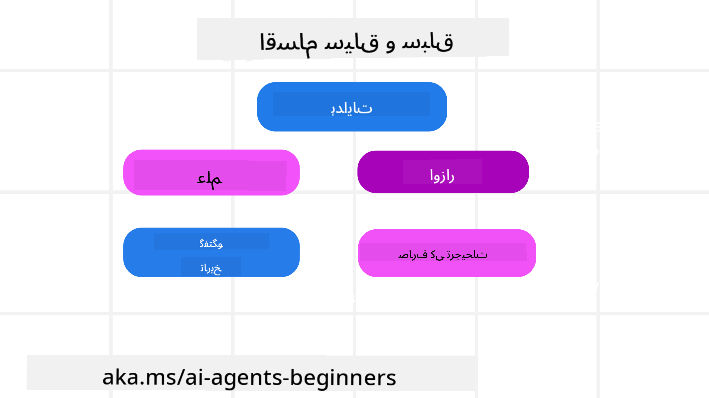
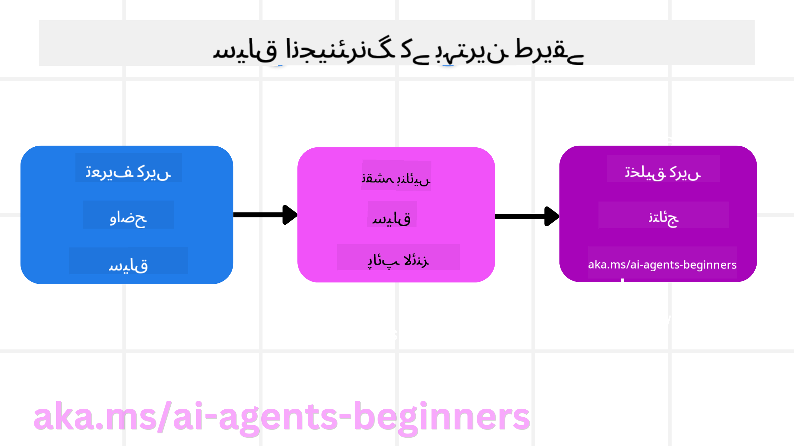

<!--
CO_OP_TRANSLATOR_METADATA:
{
  "original_hash": "cb7e50f471905ce6fdb92a30269a7a98",
  "translation_date": "2025-09-04T09:46:42+00:00",
  "source_file": "12-context-engineering/README.md",
  "language_code": "ur"
}
-->
# اے آئی ایجنٹس کے لیے کانٹیکسٹ انجینئرنگ

> _(اوپر دی گئی تصویر پر کلک کریں تاکہ اس سبق کی ویڈیو دیکھ سکیں)_

جس ایپلیکیشن کے لیے آپ اے آئی ایجنٹ بنا رہے ہیں، اس کی پیچیدگی کو سمجھنا ایک قابل اعتماد ایجنٹ بنانے کے لیے ضروری ہے۔ ہمیں ایسے اے آئی ایجنٹس بنانے کی ضرورت ہے جو معلومات کو مؤثر طریقے سے منظم کریں تاکہ پیچیدہ ضروریات کو پورا کیا جا سکے، صرف پرامپٹ انجینئرنگ سے آگے بڑھ کر۔

اس سبق میں، ہم دیکھیں گے کہ کانٹیکسٹ انجینئرنگ کیا ہے اور اے آئی ایجنٹس بنانے میں اس کا کیا کردار ہے۔

## تعارف

یہ سبق درج ذیل موضوعات کا احاطہ کرے گا:

• **کانٹیکسٹ انجینئرنگ کیا ہے** اور یہ پرامپٹ انجینئرنگ سے کیسے مختلف ہے۔

• **کانٹیکسٹ انجینئرنگ کے مؤثر طریقے**، جن میں معلومات کو لکھنے، منتخب کرنے، کمپریس کرنے اور الگ کرنے کے طریقے شامل ہیں۔

• **عام کانٹیکسٹ کی ناکامیاں** جو آپ کے اے آئی ایجنٹ کو متاثر کر سکتی ہیں اور ان کو کیسے ٹھیک کیا جائے۔

## سیکھنے کے مقاصد

اس سبق کو مکمل کرنے کے بعد، آپ یہ سمجھ سکیں گے کہ:

• **کانٹیکسٹ انجینئرنگ کی تعریف کریں** اور اسے پرامپٹ انجینئرنگ سے الگ کریں۔

• **بڑے لینگویج ماڈلز (LLM) ایپلیکیشنز میں کانٹیکسٹ کے اہم اجزاء کی شناخت کریں۔**

• **کانٹیکسٹ کو لکھنے، منتخب کرنے، کمپریس کرنے اور الگ کرنے کی حکمت عملیوں کا اطلاق کریں** تاکہ ایجنٹ کی کارکردگی بہتر ہو۔

• **عام کانٹیکسٹ کی ناکامیوں کو پہچانیں** جیسے کہ زہر آلودگی، توجہ کی کمی، الجھن، اور تضاد، اور ان کے حل کے لیے تکنیکوں کا نفاذ کریں۔

## کانٹیکسٹ انجینئرنگ کیا ہے؟

اے آئی ایجنٹس کے لیے، کانٹیکسٹ وہ چیز ہے جو ایجنٹ کو مخصوص اقدامات کرنے کے لیے منصوبہ بندی کرنے پر مجبور کرتی ہے۔ کانٹیکسٹ انجینئرنگ اس بات کو یقینی بنانے کا عمل ہے کہ اے آئی ایجنٹ کے پاس اگلے کام کو مکمل کرنے کے لیے صحیح معلومات موجود ہوں۔ کانٹیکسٹ ونڈو محدود سائز کی ہوتی ہے، اس لیے ایجنٹ بنانے والوں کے طور پر ہمیں ایسے نظام اور عمل بنانے کی ضرورت ہے جو کانٹیکسٹ ونڈو میں معلومات کو شامل کرنے، ہٹانے، اور مختصر کرنے کا انتظام کریں۔

### پرامپٹ انجینئرنگ بمقابلہ کانٹیکسٹ انجینئرنگ

پرامپٹ انجینئرنگ ایک جامد ہدایات کے سیٹ پر مرکوز ہوتی ہے تاکہ اے آئی ایجنٹس کو مؤثر طریقے سے قواعد کے ایک سیٹ کے ساتھ رہنمائی کی جا سکے۔ کانٹیکسٹ انجینئرنگ ایک متحرک معلومات کے سیٹ کو منظم کرنے کا عمل ہے، جس میں ابتدائی پرامپٹ بھی شامل ہے، تاکہ یہ یقینی بنایا جا سکے کہ وقت کے ساتھ ساتھ اے آئی ایجنٹ کے پاس وہ سب کچھ موجود ہو جو اسے چاہیے۔ کانٹیکسٹ انجینئرنگ کا بنیادی خیال یہ ہے کہ اس عمل کو قابل تکرار اور قابل اعتماد بنایا جائے۔

### کانٹیکسٹ کی اقسام

یہ یاد رکھنا ضروری ہے کہ کانٹیکسٹ صرف ایک چیز نہیں ہے۔ وہ معلومات جو اے آئی ایجنٹ کو درکار ہوتی ہیں مختلف ذرائع سے آ سکتی ہیں، اور یہ ہماری ذمہ داری ہے کہ ایجنٹ کو ان ذرائع تک رسائی حاصل ہو:

اے آئی ایجنٹ کو جن کانٹیکسٹ کی اقسام کو منظم کرنے کی ضرورت ہو سکتی ہے، ان میں شامل ہیں:

• **ہدایات:** یہ ایجنٹ کے "قواعد" کی طرح ہیں – پرامپٹس، سسٹم میسجز، فیو شاٹ مثالیں (ایجنٹ کو کچھ کرنے کا طریقہ دکھانے کے لیے)، اور ان ٹولز کی وضاحتیں جو وہ استعمال کر سکتا ہے۔ یہ وہ جگہ ہے جہاں پرامپٹ انجینئرنگ کانٹیکسٹ انجینئرنگ کے ساتھ ملتی ہے۔

• **علم:** اس میں حقائق، ڈیٹا بیس سے حاصل کردہ معلومات، یا ایجنٹ کی جمع کردہ طویل مدتی یادداشتیں شامل ہیں۔ اگر ایجنٹ کو مختلف علم کے ذخائر اور ڈیٹا بیس تک رسائی کی ضرورت ہو تو اس میں ریٹریول آگمینٹڈ جنریشن (RAG) سسٹم کو شامل کرنا شامل ہے۔

• **ٹولز:** یہ بیرونی فنکشنز، APIs، اور MCP سرورز کی تعریفیں ہیں جنہیں ایجنٹ کال کر سکتا ہے، اور ان کے استعمال سے حاصل ہونے والے نتائج۔

• **گفتگو کی تاریخ:** صارف کے ساتھ جاری مکالمہ۔ وقت گزرنے کے ساتھ، یہ گفتگو طویل اور پیچیدہ ہو جاتی ہے، جس کا مطلب ہے کہ یہ کانٹیکسٹ ونڈو میں جگہ لیتی ہے۔

• **صارف کی ترجیحات:** وقت کے ساتھ صارف کی پسند یا ناپسند کے بارے میں سیکھی گئی معلومات۔ یہ اہم فیصلے کرتے وقت صارف کی مدد کے لیے محفوظ کی جا سکتی ہیں اور استعمال کی جا سکتی ہیں۔

## مؤثر کانٹیکسٹ انجینئرنگ کے لیے حکمت عملیاں

### منصوبہ بندی کی حکمت عملیاں

اچھی کانٹیکسٹ انجینئرنگ اچھی منصوبہ بندی سے شروع ہوتی ہے۔ یہاں ایک طریقہ کار ہے جو آپ کو کانٹیکسٹ انجینئرنگ کے تصور کو لاگو کرنے کے بارے میں سوچنے میں مدد دے گا:

1. **واضح نتائج کی وضاحت کریں** - ان کاموں کے نتائج جو اے آئی ایجنٹس کو تفویض کیے جائیں گے، واضح طور پر بیان کیے جانے چاہئیں۔ سوال کا جواب دیں - "جب اے آئی ایجنٹ اپنا کام مکمل کر لے گا تو دنیا کیسی نظر آئے گی؟" دوسرے الفاظ میں، صارف کو ایجنٹ کے ساتھ بات چیت کے بعد کیا تبدیلی، معلومات، یا جواب ملنا چاہیے۔

2. **کانٹیکسٹ کا نقشہ بنائیں** - ایک بار جب آپ نے اے آئی ایجنٹ کے نتائج کی وضاحت کر لی، تو آپ کو اس سوال کا جواب دینا ہوگا کہ "اے آئی ایجنٹ کو یہ کام مکمل کرنے کے لیے کون سی معلومات کی ضرورت ہے؟" اس طرح آپ یہ نقشہ بنانا شروع کر سکتے ہیں کہ وہ معلومات کہاں واقع ہو سکتی ہیں۔

3. **کانٹیکسٹ پائپ لائنز بنائیں** - اب جب کہ آپ جانتے ہیں کہ معلومات کہاں ہیں، آپ کو اس سوال کا جواب دینا ہوگا کہ "ایجنٹ یہ معلومات کیسے حاصل کرے گا؟" یہ مختلف طریقوں سے کیا جا سکتا ہے، جن میں RAG، MCP سرورز اور دیگر ٹولز کا استعمال شامل ہے۔

### عملی حکمت عملیاں

منصوبہ بندی اہم ہے، لیکن ایک بار جب معلومات ہمارے ایجنٹ کی کانٹیکسٹ ونڈو میں آنا شروع ہو جائیں، تو ہمیں اسے منظم کرنے کے لیے عملی حکمت عملیوں کی ضرورت ہوتی ہے:

#### کانٹیکسٹ کا انتظام

جبکہ کچھ معلومات کانٹیکسٹ ونڈو میں خود بخود شامل ہو جائیں گی، کانٹیکسٹ انجینئرنگ اس معلومات کے زیادہ فعال کردار کو اپنانے کے بارے میں ہے، جو درج ذیل حکمت عملیوں کے ذریعے کیا جا سکتا ہے:

1. **ایجنٹ اسکریچ پیڈ**  
یہ اے آئی ایجنٹ کو ایک سیشن کے دوران موجودہ کاموں اور صارف کی بات چیت کے بارے میں متعلقہ معلومات نوٹ کرنے کی اجازت دیتا ہے۔ یہ کانٹیکسٹ ونڈو کے باہر ایک فائل یا رن ٹائم آبجیکٹ میں موجود ہونا چاہیے، جسے ایجنٹ بعد میں اس سیشن کے دوران ضرورت پڑنے پر بازیافت کر سکے۔

2. **یادداشتیں**  
اسکریچ پیڈز ایک سیشن کی کانٹیکسٹ ونڈو کے باہر معلومات کا انتظام کرنے کے لیے اچھے ہیں۔ یادداشتیں ایجنٹس کو متعدد سیشنز میں متعلقہ معلومات کو ذخیرہ کرنے اور بازیافت کرنے کے قابل بناتی ہیں۔ اس میں خلاصے، صارف کی ترجیحات، اور مستقبل میں بہتری کے لیے تاثرات شامل ہو سکتے ہیں۔

3. **کانٹیکسٹ کو کمپریس کرنا**  
جب کانٹیکسٹ ونڈو بڑھتی ہے اور اپنی حد کے قریب پہنچ جاتی ہے، تو خلاصہ سازی اور تراشنے جیسی تکنیکوں کا استعمال کیا جا سکتا ہے۔ اس میں یا تو صرف سب سے زیادہ متعلقہ معلومات رکھنا یا پرانے پیغامات کو ہٹانا شامل ہے۔

4. **ملٹی ایجنٹ سسٹمز**  
ملٹی ایجنٹ سسٹم تیار کرنا کانٹیکسٹ انجینئرنگ کی ایک شکل ہے کیونکہ ہر ایجنٹ کی اپنی کانٹیکسٹ ونڈو ہوتی ہے۔ جب ان سسٹمز کو بنایا جا رہا ہو تو اس بات کی منصوبہ بندی کرنا ضروری ہے کہ یہ کانٹیکسٹ کیسے شیئر اور منتقل کیا جائے۔

5. **سینڈ باکس ماحول**  
اگر کسی ایجنٹ کو کچھ کوڈ چلانے یا کسی دستاویز میں بڑی مقدار میں معلومات پر عمل کرنے کی ضرورت ہو، تو اس کے نتائج پر عمل کرنے کے لیے بڑی تعداد میں ٹوکنز کی ضرورت ہو سکتی ہے۔ اس کے بجائے کہ یہ سب کانٹیکسٹ ونڈو میں محفوظ ہو، ایجنٹ ایک سینڈ باکس ماحول استعمال کر سکتا ہے جو اس کوڈ کو چلا سکے اور صرف نتائج اور دیگر متعلقہ معلومات کو پڑھ سکے۔

6. **رن ٹائم اسٹیٹ آبجیکٹس**  
یہ مخصوص معلومات تک رسائی کی ضرورت کے حالات کو منظم کرنے کے لیے معلومات کے کنٹینرز بنانے کے ذریعے کیا جاتا ہے۔ ایک پیچیدہ کام کے لیے، یہ ایجنٹ کو ہر ذیلی کام کے نتائج کو مرحلہ وار ذخیرہ کرنے کے قابل بنائے گا، جس سے کانٹیکسٹ صرف اس مخصوص ذیلی کام سے جڑا رہے۔

### کانٹیکسٹ انجینئرنگ کی مثال

فرض کریں ہم چاہتے ہیں کہ ایک اے آئی ایجنٹ **"میرے لیے پیرس کا سفر بک کروائے۔"**

• ایک سادہ ایجنٹ جو صرف پرامپٹ انجینئرنگ استعمال کرتا ہے، شاید صرف جواب دے: **"ٹھیک ہے، آپ کب پیرس جانا چاہتے ہیں؟"**۔ یہ صرف اس وقت صارف کے سوال پر عمل کرتا ہے۔

• ایک ایجنٹ جو کانٹیکسٹ انجینئرنگ کی حکمت عملیوں کا استعمال کرتا ہے، اس سے کہیں زیادہ کرے گا۔ جواب دینے سے پہلے، اس کا نظام شاید:

  ◦ **آپ کے کیلنڈر کو چیک کرے** تاکہ دستیاب تاریخیں معلوم کی جا سکیں (حقیقی وقت کا ڈیٹا بازیافت کرنا)۔

  ◦ **ماضی کی سفری ترجیحات یاد کرے** (طویل مدتی یادداشت سے) جیسے آپ کی پسندیدہ ایئر لائن، بجٹ، یا آپ کو براہ راست پروازیں پسند ہیں یا نہیں۔

  ◦ **دستیاب ٹولز کی شناخت کرے** جیسے فلائٹ اور ہوٹل بکنگ۔

- پھر، ایک مثال کے طور پر جواب ہو سکتا ہے: "ہیلو [آپ کا نام]! میں دیکھ رہا ہوں کہ آپ اکتوبر کے پہلے ہفتے میں فارغ ہیں۔ کیا میں [پسندیدہ ایئر لائن] پر پیرس کے لیے براہ راست پروازیں آپ کے معمول کے بجٹ [بجٹ] کے اندر تلاش کروں؟"۔ یہ زیادہ بھرپور، کانٹیکسٹ سے آگاہ جواب کانٹیکسٹ انجینئرنگ کی طاقت کو ظاہر کرتا ہے۔

## عام کانٹیکسٹ کی ناکامیاں

### کانٹیکسٹ زہر آلودگی

**یہ کیا ہے:** جب ایک ہیلوسینیشن (LLM کے ذریعے پیدا کردہ غلط معلومات) یا کوئی غلطی کانٹیکسٹ میں داخل ہو جاتی ہے اور بار بار حوالہ دی جاتی ہے، جس کی وجہ سے ایجنٹ ناممکن اہداف کا تعاقب کرتا ہے یا بے معنی حکمت عملی تیار کرتا ہے۔

**کیا کریں:** **کانٹیکسٹ کی توثیق** اور **قرنطینہ** نافذ کریں۔ معلومات کو طویل مدتی یادداشت میں شامل کرنے سے پہلے اس کی توثیق کریں۔ اگر ممکنہ زہر آلودگی کا پتہ چلتا ہے، تو خراب معلومات کے پھیلاؤ کو روکنے کے لیے نئے کانٹیکسٹ تھریڈز شروع کریں۔

**سفر بکنگ کی مثال:** آپ کا ایجنٹ ایک **چھوٹے مقامی ہوائی اڈے سے ایک دور دراز بین الاقوامی شہر کے لیے براہ راست پرواز** ہیلوسینیٹ کرتا ہے جو درحقیقت بین الاقوامی پروازیں پیش نہیں کرتا۔ یہ غیر موجود پرواز کی تفصیل کانٹیکسٹ میں محفوظ ہو جاتی ہے۔ بعد میں، جب آپ ایجنٹ سے بکنگ کے لیے کہتے ہیں، تو یہ بار بار اس ناممکن راستے کے لیے ٹکٹ تلاش کرنے کی کوشش کرتا ہے، جس کی وجہ سے بار بار غلطیاں ہوتی ہیں۔

**حل:** ایک ایسا مرحلہ نافذ کریں جو **حقیقی وقت کے API کے ساتھ پرواز کی موجودگی اور راستوں کی توثیق کرے** _اس سے پہلے_ کہ پرواز کی تفصیل کو ایجنٹ کے ورکنگ کانٹیکسٹ میں شامل کیا جائے۔ اگر توثیق ناکام ہو جاتی ہے، تو غلط معلومات کو "قرنطینہ" کر دیا جاتا ہے اور مزید استعمال نہیں کیا جاتا۔

### کانٹیکسٹ کی توجہ کی کمی

**یہ کیا ہے:** جب کانٹیکسٹ اتنا بڑا ہو جاتا ہے کہ ماڈل جمع شدہ تاریخ پر بہت زیادہ توجہ مرکوز کرتا ہے بجائے اس کے کہ وہ اپنی تربیت کے دوران سیکھی گئی معلومات کا استعمال کرے، جس کی وجہ سے بار بار یا غیر مددگار اقدامات ہوتے ہیں۔ ماڈلز کانٹیکسٹ ونڈو بھرنے سے پہلے ہی غلطیاں کرنا شروع کر سکتے ہیں۔

**کیا کریں:** **کانٹیکسٹ کا خلاصہ** استعمال کریں۔ وقتاً فوقتاً جمع شدہ معلومات کو مختصر خلاصوں میں کمپریس کریں، اہم تفصیلات کو برقرار رکھتے ہوئے غیر ضروری تاریخ کو ہٹا دیں۔ یہ "توجہ کو دوبارہ ترتیب دینے" میں مدد کرتا ہے۔

**سفر بکنگ کی مثال:** آپ نے طویل عرصے تک مختلف خوابوں کے سفری مقامات پر بات کی، جس میں دو سال پہلے کے آپ کے بیک پیکنگ سفر کی تفصیلی کہانی بھی شامل ہے۔ جب آپ آخر کار کہتے ہیں **"اگلے مہینے کے لیے سستی پرواز تلاش کریں"**، تو ایجنٹ پرانی، غیر متعلقہ تفصیلات میں الجھ جاتا ہے اور آپ کے بیک پیکنگ گیئر یا ماضی کے سفرناموں کے بارے میں پوچھتا رہتا ہے، آپ کی موجودہ درخواست کو نظر انداز کرتے ہوئے۔

**حل:** ایک خاص تعداد کے تبادلے کے بعد یا جب کانٹیکسٹ بہت بڑا ہو جائے، ایجنٹ کو **گفتگو کے سب سے حالیہ اور متعلقہ حصوں کا خلاصہ کرنا چاہیے** – آپ کی موجودہ سفری تاریخوں اور منزل پر توجہ مرکوز کرتے ہوئے – اور اگلے LLM کال کے لیے اس مختصر خلاصے کا استعمال کرنا چاہیے، کم متعلقہ تاریخی چیٹ کو چھوڑ دینا چاہیے۔

### کانٹیکسٹ کی الجھن

**یہ کیا ہے:** جب غیر ضروری کانٹیکسٹ، اکثر بہت زیادہ دستیاب ٹولز کی شکل میں، ماڈل کو خراب جوابات پیدا کرنے یا غیر متعلقہ ٹولز استعمال کرنے کا سبب بنتا ہے۔ چھوٹے ماڈلز خاص طور پر اس کے شکار ہوتے ہیں۔

**کیا کریں:** RAG تکنیکوں کا استعمال کرتے ہوئے **ٹول لوڈ آؤٹ مینجمنٹ** نافذ کریں۔ ٹول کی وضاحتوں کو ایک ویکٹر ڈیٹا بیس میں اسٹور کریں اور ہر مخصوص کام کے لیے صرف سب سے زیادہ متعلقہ ٹولز منتخب کریں۔ تحقیق سے پتہ چلتا ہے کہ ٹول کے انتخاب کو 30 سے کم تک محدود رکھنا بہتر ہے۔

**سفر بکنگ کی مثال:** آپ کے ایجنٹ کے پاس درجنوں ٹولز تک رسائی ہے: `book_flight`، `book_hotel`، `rent_car`، `find_tours`، `currency_converter`، `weather_forecast`، `restaurant_reservations`، وغیرہ۔ آپ پوچھتے ہیں، **"پیرس میں گھومنے پھرنے کا بہترین طریقہ کیا ہے؟"**۔ ٹولز کی بڑی تعداد کی وجہ سے، ایجنٹ الجھن میں پڑ جاتا ہے اور پیرس کے اندر `book_flight` کال کرنے کی کوشش کرتا ہے، یا `rent_car` تجویز کرتا ہے حالانکہ آپ کو پبلک ٹرانسپورٹ پسند ہے، کیونکہ ٹول کی وضاحتیں اوورلیپ ہو سکتی ہیں یا یہ بہترین ٹول کا تعین نہیں کر سکتا۔

**حل:** **ٹول کی وضاحتوں پر RAG کا استعمال کریں۔** جب آپ پیرس میں گھومنے پھرنے کے بارے میں پوچھتے ہیں، تو سسٹم آپ کی درخواست کی بنیاد پر متحرک طور پر صرف سب سے زیادہ متعلقہ ٹولز جیسے `rent_car` یا `public_transport_info` بازیافت کرتا ہے، اور LLM کو ایک مرکوز "لوڈ آؤٹ" پیش کرتا ہے۔

### کانٹیکسٹ کا تضاد

**یہ کیا ہے:** جب کانٹیکسٹ میں متضاد معلومات موجود ہوں، جس کی وجہ سے غیر مستقل استدلال یا خراب حتمی جوابات پیدا ہوتے ہیں۔ یہ اکثر اس وقت ہوتا ہے جب معلومات مراحل میں آتی ہیں، اور ابتدائی، غلط مفروضے کانٹیکسٹ میں رہ جاتے ہیں۔

**کیا کریں:** **کانٹیکسٹ کی تراش خراش** اور **آف لوڈنگ** کا استعمال کریں۔ تراش خراش کا مطلب ہے کہ جیسے ہی نئی تفصیلات آتی ہیں، پرانی یا متضاد معلومات کو ہٹا دیا جائے۔ آف لوڈنگ ماڈل کو معلومات پر عمل کرنے کے لیے ایک علیحدہ "اسکریچ پیڈ" ورک اسپیس دیتی ہے بغیر مرکزی کانٹیکسٹ کو بے ترتیبی

---

**ڈسکلیمر**:  
یہ دستاویز AI ترجمہ سروس [Co-op Translator](https://github.com/Azure/co-op-translator) کا استعمال کرتے ہوئے ترجمہ کی گئی ہے۔ ہم درستگی کے لیے کوشش کرتے ہیں، لیکن براہ کرم آگاہ رہیں کہ خودکار ترجمے میں غلطیاں یا غیر درستیاں ہو سکتی ہیں۔ اصل دستاویز کو اس کی اصل زبان میں مستند ذریعہ سمجھا جانا چاہیے۔ اہم معلومات کے لیے، پیشہ ور انسانی ترجمہ کی سفارش کی جاتی ہے۔ ہم اس ترجمے کے استعمال سے پیدا ہونے والی کسی بھی غلط فہمی یا غلط تشریح کے ذمہ دار نہیں ہیں۔