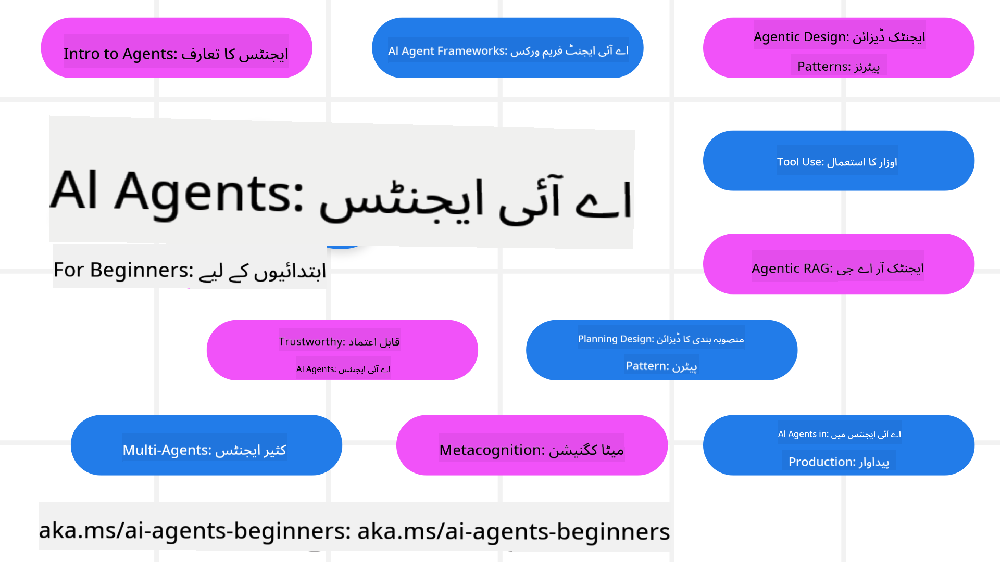

<!--
CO_OP_TRANSLATOR_METADATA:
{
  "original_hash": "6b07046397366e6f6f4524c9ddeba1e1",
  "translation_date": "2025-07-12T14:42:38+00:00",
  "source_file": "README.md",
  "language_code": "ur"
}
-->
# AI Agents for Beginners - ایک کورس

## 11 اسباق جو آپ کو AI Agents بنانے کے لیے ضروری تمام معلومات سکھاتے ہیں

  
  
  
  

### 🌐 کثیراللسانی سپورٹ

#### GitHub Action کے ذریعے سپورٹ (خودکار اور ہمیشہ تازہ ترین)

[French](../fr/README.md) | [Spanish](../es/README.md) | [German](../de/README.md) | [Russian](../ru/README.md) | [Arabic](../ar/README.md) | [Persian (Farsi)](../fa/README.md) | [Urdu](./README.md) | [Chinese (Simplified)](../zh/README.md) | [Chinese (Traditional, Macau)](../mo/README.md) | [Chinese (Traditional, Hong Kong)](../hk/README.md) | [Chinese (Traditional, Taiwan)](../tw/README.md) | [Japanese](../ja/README.md) | [Korean](../ko/README.md) | [Hindi](../hi/README.md) | [Bengali](../bn/README.md) | [Marathi](../mr/README.md) | [Nepali](../ne/README.md) | [Punjabi (Gurmukhi)](../pa/README.md) | [Portuguese (Portugal)](../pt/README.md) | [Portuguese (Brazil)](../br/README.md) | [Italian](../it/README.md) | [Polish](../pl/README.md) | [Turkish](../tr/README.md) | [Greek](../el/README.md) | [Thai](../th/README.md) | [Swedish](../sv/README.md) | [Danish](../da/README.md) | [Norwegian](../no/README.md) | [Finnish](../fi/README.md) | [Dutch](../nl/README.md) | [Hebrew](../he/README.md) | [Vietnamese](../vi/README.md) | [Indonesian](../id/README.md) | [Malay](../ms/README.md) | [Tagalog (Filipino)](../tl/README.md) | [Swahili](../sw/README.md) | [Hungarian](../hu/README.md) | [Czech](../cs/README.md) | [Slovak](../sk/README.md) | [Romanian](../ro/README.md) | [Bulgarian](../bg/README.md) | [Serbian (Cyrillic)](../sr/README.md) | [Croatian](../hr/README.md) | [Slovenian](../sl/README.md) | [Ukrainian](../uk/README.md) | [Burmese (Myanmar)](../my/README.md)

**اگر آپ مزید زبانوں کی ترجمہ کی حمایت چاہتے ہیں تو وہ یہاں [دیکھیے](https://github.com/Azure/co-op-translator/blob/main/getting_started/supported-languages.md) موجود ہیں**

  
  

## 🌱 شروعات کیسے کریں

یہ کورس 11 اسباق پر مشتمل ہے جو AI Agents بنانے کے بنیادی اصولوں کو کور کرتے ہیں۔ ہر سبق اپنا موضوع رکھتا ہے، لہٰذا جہاں چاہیں وہاں سے شروع کریں!

اس کورس کے لیے کثیراللسانی سپورٹ موجود ہے۔ ہماری [دستیاب زبانیں یہاں دیکھیں](../..)۔

اگر آپ پہلی بار Generative AI ماڈلز کے ساتھ کام کر رہے ہیں تو ہمارا [Generative AI For Beginners](https://aka.ms/genai-beginners) کورس دیکھیں، جس میں GenAI کے ساتھ کام کرنے کے 21 اسباق شامل ہیں۔

اس ریپوزیٹری کو [ستارہ (🌟) دینا](https://docs.github.com/en/get-started/exploring-projects-on-github/saving-repositories-with-stars?WT.mc_id=academic-105485-koreyst) اور [فورک کرنا](https://github.com/microsoft/ai-agents-for-beginners/fork) نہ بھولیں تاکہ آپ کوڈ چلا سکیں۔

### آپ کو کیا چاہیے

اس کورس کے ہر سبق میں کوڈ کی مثالیں شامل ہیں، جو code_samples فولڈر میں مل سکتی ہیں۔ آپ [اس ریپو کو فورک](https://github.com/microsoft/ai-agents-for-beginners/fork) کر کے اپنی کاپی بنا سکتے ہیں۔

ان مشقوں میں کوڈ کی مثالیں Azure AI Foundry اور GitHub Model Catalogs کا استعمال کرتی ہیں تاکہ Language Models کے ساتھ تعامل کیا جا سکے:

- [Github Models](https://aka.ms/ai-agents-beginners/github-models) - مفت / محدود  
- [Azure AI Foundry](https://aka.ms/ai-agents-beginners/ai-foundry) - Azure اکاؤنٹ ضروری

یہ کورس Microsoft کے درج ذیل AI Agent فریم ورکس اور سروسز بھی استعمال کرتا ہے:

- [Azure AI Agent Service](https://aka.ms/ai-agents-beginners/ai-agent-service)  
- [Semantic Kernel](https://aka.ms/ai-agents-beginners/semantic-kernel)  
- [AutoGen](https://aka.ms/ai-agents/autogen)

اس کورس کے کوڈ کو چلانے کے بارے میں مزید معلومات کے لیے [Course Setup](./00-course-setup/README.md) دیکھیں۔

## 🙏 مدد کرنا چاہتے ہیں؟

کیا آپ کے پاس تجاویز ہیں یا آپ نے املا یا کوڈ میں غلطیاں دیکھی ہیں؟ [مسئلہ اٹھائیں](https://github.com/microsoft/ai-agents-for-beginners/issues?WT.mc_id=academic-105485-koreyst) یا [پُل ریکویسٹ بنائیں](https://github.com/microsoft/ai-agents-for-beginners/pulls?WT.mc_id=academic-105485-koreyst)

اگر آپ پھنس جائیں یا AI Agents بنانے کے بارے میں کوئی سوال ہو تو ہمارے [Azure AI Foundry Community Discord](https://discord.gg/kzRShWzttr) میں شامل ہوں۔

اگر آپ کے پاس پروڈکٹ فیڈبیک یا تعمیر کے دوران کوئی غلطی ہو تو ہمارے [Azure AI Foundry Developer Forum](https://aka.ms/azureaifoundry/forum) پر جائیں۔

## 📂 ہر سبق میں شامل ہے

- README میں تحریری سبق اور ایک مختصر ویڈیو  
- Python کوڈ کی مثالیں جو Azure AI Foundry اور Github Models (مفت) کی حمایت کرتی ہیں  
- اضافی وسائل کے لنکس تاکہ آپ اپنی تعلیم جاری رکھ سکیں

## 🗃️ اسباق

| **سبق**                                | **متن اور کوڈ**                                    | **ویڈیو**                                                  | **اضافی تعلیم**                                                                       |
|----------------------------------------|----------------------------------------------------|------------------------------------------------------------|----------------------------------------------------------------------------------------|
| AI Agents اور Agent کے استعمال کے تعارف | [لنک](./01-intro-to-ai-agents/README.md)           | [ویڈیو](https://youtu.be/3zgm60bXmQk?si=z8QygFvYQv-9WtO1)  | [لنک](https://aka.ms/ai-agents-beginners/collection?WT.mc_id=academic-105485-koreyst) |
| AI Agentic Frameworks کی تلاش          | [لنک](./02-explore-agentic-frameworks/README.md)   | [ویڈیو](https://youtu.be/ODwF-EZo_O8?si=Vawth4hzVaHv-u0H)  | [لنک](https://aka.ms/ai-agents-beginners/collection?WT.mc_id=academic-105485-koreyst) |
| AI Agentic Design Patterns کی سمجھ     | [لنک](./03-agentic-design-patterns/README.md)      | [ویڈیو](https://youtu.be/m9lM8qqoOEA?si=BIzHwzstTPL8o9GF)  | [لنک](https://aka.ms/ai-agents-beginners/collection?WT.mc_id=academic-105485-koreyst) |
| Tool Use Design Pattern                 | [لنک](./04-tool-use/README.md)                      | [ویڈیو](https://youtu.be/vieRiPRx-gI?si=2z6O2Xu2cu_Jz46N)  | [لنک](https://aka.ms/ai-agents-beginners/collection?WT.mc_id=academic-105485-koreyst) |
| Agentic RAG                            | [لنک](./05-agentic-rag/README.md)                   | [ویڈیو](https://youtu.be/WcjAARvdL7I?si=gKPWsQpKiIlDH9A3)  | [لنک](https://aka.ms/ai-agents-beginners/collection?WT.mc_id=academic-105485-koreyst) |
| قابل اعتماد AI Agents کی تعمیر         | [لنک](./06-building-trustworthy-agents/README.md)   | [ویڈیو](https://youtu.be/iZKkMEGBCUQ?si=jZjpiMnGFOE9L8OK ) | [لنک](https://aka.ms/ai-agents-beginners/collection?WT.mc_id=academic-105485-koreyst) |
| Planning Design Pattern                 | [لنک](./07-planning-design/README.md)               | [ویڈیو](https://youtu.be/kPfJ2BrBCMY?si=6SC_iv_E5-mzucnC)  | [لنک](https://aka.ms/ai-agents-beginners/collection?WT.mc_id=academic-105485-koreyst) |
| Multi-Agent Design Pattern              | [لنک](./08-multi-agent/README.md)                   | [ویڈیو](https://youtu.be/V6HpE9hZEx0?si=rMgDhEu7wXo2uo6g)  | [لنک](https://aka.ms/ai-agents-beginners/collection?WT.mc_id=academic-105485-koreyst) |
| Metacognition Design Pattern            | [لنک](./09-metacognition/README.md)                 | [ویڈیو](https://youtu.be/His9R6gw6Ec?si=8gck6vvdSNCt6OcF)  | [لنک](https://aka.ms/ai-agents-beginners/collection?WT.mc_id=academic-105485-koreyst) |
| AI Agents کی پروڈکشن میں تعیناتی       | [لنک](./10-ai-agents-production/README.md)          | [ویڈیو](https://youtu.be/l4TP6IyJxmQ?si=31dnhexRo6yLRJDl)  | [لنک](https://aka.ms/ai-agents-beginners/collection?WT.mc_id=academic-105485-koreyst) |
| AI Agents with MCP                     | [لنک](./11-mcp/README.md)                           |                                                            | [لنک](https://aka.ms/mcp-for-beginners)                                               |

## 🎒 دیگر کورسز

ہماری ٹیم دیگر کورسز بھی تیار کرتی ہے! دیکھیں:
- [**نیا** ماڈل کانٹیکسٹ پروٹوکول (MCP) برائے مبتدیان](https://github.com/microsoft/mcp-for-beginners?WT.mc_id=academic-105485-koreyst)
- [.NET استعمال کرتے ہوئے مبتدیان کے لیے جنریٹو AI](https://github.com/microsoft/Generative-AI-for-beginners-dotnet?WT.mc_id=academic-105485-koreyst)
- [مبتدیان کے لیے جنریٹو AI](https://github.com/microsoft/generative-ai-for-beginners?WT.mc_id=academic-105485-koreyst)
- [مبتدیان کے لیے مشین لرننگ](https://aka.ms/ml-beginners?WT.mc_id=academic-105485-koreyst)
- [مبتدیان کے لیے ڈیٹا سائنس](https://aka.ms/datascience-beginners?WT.mc_id=academic-105485-koreyst)
- [مبتدیان کے لیے AI](https://aka.ms/ai-beginners?WT.mc_id=academic-105485-koreyst)
- [مبتدیان کے لیے سائبر سیکیورٹی](https://github.com/microsoft/Security-101??WT.mc_id=academic-96948-sayoung)
- [مبتدیان کے لیے ویب ڈیولپمنٹ](https://aka.ms/webdev-beginners?WT.mc_id=academic-105485-koreyst)
- [مبتدیان کے لیے IoT](https://aka.ms/iot-beginners?WT.mc_id=academic-105485-koreyst)
- [مبتدیان کے لیے XR ڈیولپمنٹ](https://github.com/microsoft/xr-development-for-beginners?WT.mc_id=academic-105485-koreyst)
- [AI کے لیے جوڑے ہوئے پروگرامنگ میں GitHub Copilot میں مہارت حاصل کریں](https://aka.ms/GitHubCopilotAI?WT.mc_id=academic-105485-koreyst)
- [C#/.NET ڈویلپرز کے لیے GitHub Copilot میں مہارت حاصل کریں](https://github.com/microsoft/mastering-github-copilot-for-dotnet-csharp-developers?WT.mc_id=academic-105485-koreyst)
- [اپنی پسند کی Copilot ایڈونچر منتخب کریں](https://github.com/microsoft/CopilotAdventures?WT.mc_id=academic-105485-koreyst)

## 🌟 کمیونٹی کا شکریہ

[Shivam Goyal](https://www.linkedin.com/in/shivam2003/) کا شکریہ کہ انہوں نے Agentic RAG کی وضاحت کرنے والے اہم کوڈ نمونے فراہم کیے۔

## تعاون

یہ پروجیکٹ تعاون اور تجاویز کا خیرمقدم کرتا ہے۔ زیادہ تر تعاون کے لیے آپ کو ایک
Contributor License Agreement (CLA) سے اتفاق کرنا ہوگا جس میں آپ یہ اعلان کرتے ہیں کہ آپ کے پاس
اپنے تعاون کے استعمال کے حقوق دینے کا حق ہے اور آپ واقعی یہ حقوق دیتے ہیں۔ تفصیلات کے لیے ملاحظہ کریں
<https://cla.opensource.microsoft.com>۔

جب آپ کوئی pull request جمع کرواتے ہیں، تو ایک CLA بوٹ خود بخود یہ تعین کرے گا کہ آیا آپ کو CLA فراہم کرنا ضروری ہے اور PR کو مناسب طریقے سے نشان زد کرے گا (مثلاً، status check، comment)۔ بس بوٹ کی ہدایات پر عمل کریں۔ آپ کو یہ عمل تمام ریپوز میں صرف ایک بار کرنا ہوگا جو ہمارے CLA استعمال کرتے ہیں۔

اس پروجیکٹ نے [Microsoft Open Source Code of Conduct](https://opensource.microsoft.com/codeofconduct/) کو اپنایا ہے۔
مزید معلومات کے لیے [Code of Conduct FAQ](https://opensource.microsoft.com/codeofconduct/faq/) دیکھیں یا
کسی بھی اضافی سوالات یا تبصروں کے لیے [opencode@microsoft.com](mailto:opencode@microsoft.com) سے رابطہ کریں۔

## ٹریڈ مارکس

یہ پروجیکٹ پروجیکٹس، مصنوعات، یا خدمات کے ٹریڈ مارکس یا لوگوز پر مشتمل ہو سکتا ہے۔ Microsoft کے
ٹریڈ مارکس یا لوگوز کے مجاز استعمال کے لیے [Microsoft's Trademark & Brand Guidelines](https://www.microsoft.com/legal/intellectualproperty/trademarks/usage/general) کی پابندی ضروری ہے۔
اس پروجیکٹ کے ترمیم شدہ ورژنز میں Microsoft کے ٹریڈ مارکس یا لوگوز کا استعمال الجھن پیدا نہیں کرے گا اور نہ ہی Microsoft کی سرپرستی کا تاثر دے گا۔
تیسری پارٹی کے ٹریڈ مارکس یا لوگوز کا استعمال ان تیسری پارٹیوں کی پالیسیوں کے تابع ہے۔

**دستخطی نوٹ**:  
یہ دستاویز AI ترجمہ سروس [Co-op Translator](https://github.com/Azure/co-op-translator) کے ذریعے ترجمہ کی گئی ہے۔ اگرچہ ہم درستگی کے لیے کوشاں ہیں، براہ کرم آگاہ رہیں کہ خودکار ترجمے میں غلطیاں یا عدم درستیاں ہو سکتی ہیں۔ اصل دستاویز اپنی مادری زبان میں معتبر ماخذ سمجھی جانی چاہیے۔ اہم معلومات کے لیے پیشہ ور انسانی ترجمہ کی سفارش کی جاتی ہے۔ اس ترجمے کے استعمال سے پیدا ہونے والی کسی بھی غلط فہمی یا غلط تشریح کی ذمہ داری ہم پر عائد نہیں ہوتی۔