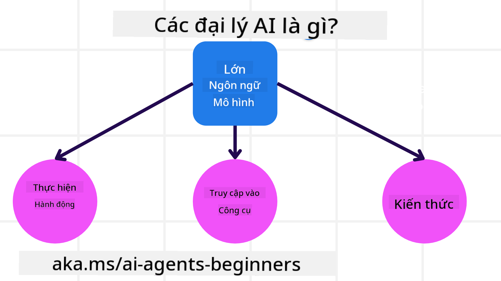
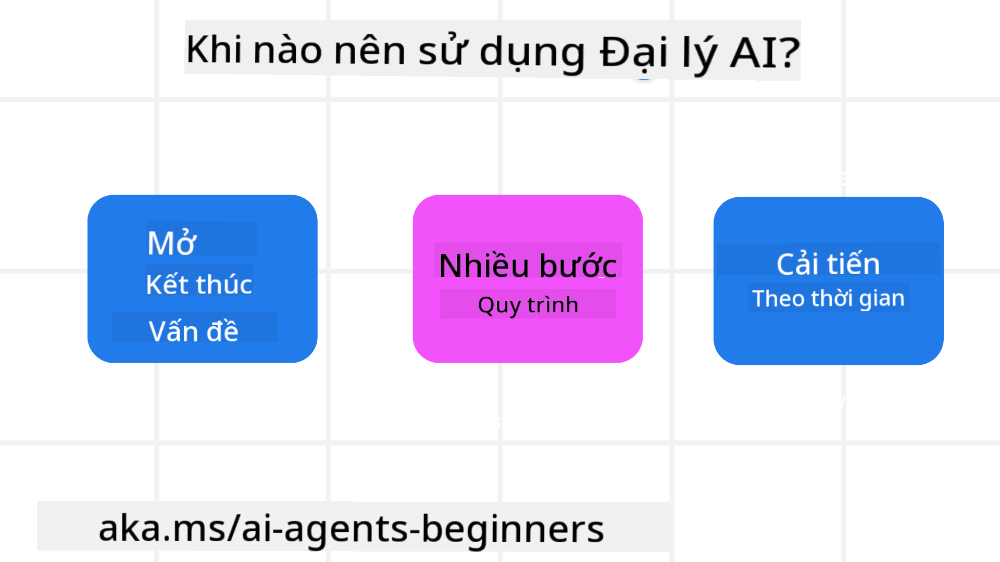

<!--
CO_OP_TRANSLATOR_METADATA:
{
  "original_hash": "d84943abc8f001ad4670418d32c2d899",
  "translation_date": "2025-07-12T08:09:30+00:00",
  "source_file": "01-intro-to-ai-agents/README.md",
  "language_code": "vi"
}
-->
để gặp gỡ những người học khác và những Nhà phát triển AI Agent, cũng như đặt bất kỳ câu hỏi nào bạn có về khóa học này.

Để bắt đầu khóa học, chúng ta sẽ tìm hiểu kỹ hơn về AI Agents là gì và cách chúng ta có thể sử dụng chúng trong các ứng dụng và quy trình làm việc mà chúng ta xây dựng.

## Giới thiệu

Bài học này bao gồm:

- AI Agents là gì và có những loại agent nào khác nhau?
- Những trường hợp sử dụng nào phù hợp nhất với AI Agents và chúng có thể giúp gì cho chúng ta?
- Một số thành phần cơ bản khi thiết kế các Giải pháp Agentic là gì?

## Mục tiêu học tập
Sau khi hoàn thành bài học này, bạn sẽ có thể:

- Hiểu các khái niệm về AI Agent và cách chúng khác biệt so với các giải pháp AI khác.
- Áp dụng AI Agents một cách hiệu quả nhất.
- Thiết kế các giải pháp Agentic một cách hiệu quả cho cả người dùng và khách hàng.

## Định nghĩa AI Agents và các loại AI Agents

### AI Agents là gì?

AI Agents là **hệ thống** cho phép **Mô hình Ngôn ngữ Lớn (LLMs)** **thực hiện các hành động** bằng cách mở rộng khả năng của chúng thông qua việc cung cấp cho LLMs **quyền truy cập vào các công cụ** và **kiến thức**.

Hãy phân tích định nghĩa này thành các phần nhỏ hơn:

- **Hệ thống** - Quan trọng là phải nghĩ về agent không chỉ là một thành phần đơn lẻ mà là một hệ thống gồm nhiều thành phần. Ở mức cơ bản, các thành phần của một AI Agent bao gồm:
  - **Môi trường** - Không gian được xác định nơi AI Agent hoạt động. Ví dụ, nếu chúng ta có một AI Agent đặt vé du lịch, môi trường có thể là hệ thống đặt vé du lịch mà AI Agent sử dụng để hoàn thành các nhiệm vụ.
  - **Cảm biến** - Môi trường có thông tin và cung cấp phản hồi. AI Agents sử dụng cảm biến để thu thập và giải thích thông tin về trạng thái hiện tại của môi trường. Trong ví dụ về AI Agent đặt vé du lịch, hệ thống đặt vé có thể cung cấp thông tin như tình trạng phòng khách sạn hoặc giá vé máy bay.
  - **Bộ truyền động** - Khi AI Agent nhận được trạng thái hiện tại của môi trường, đối với nhiệm vụ hiện tại, agent sẽ xác định hành động cần thực hiện để thay đổi môi trường. Với agent đặt vé du lịch, hành động có thể là đặt một phòng còn trống cho người dùng.

**Mô hình Ngôn ngữ Lớn** - Khái niệm về agent đã tồn tại trước khi có LLMs. Ưu điểm của việc xây dựng AI Agents với LLMs là khả năng hiểu ngôn ngữ con người và dữ liệu. Khả năng này cho phép LLMs giải thích thông tin môi trường và xác định kế hoạch để thay đổi môi trường.

**Thực hiện hành động** - Ngoài hệ thống AI Agent, LLMs chỉ giới hạn trong việc tạo nội dung hoặc thông tin dựa trên yêu cầu của người dùng. Trong hệ thống AI Agent, LLMs có thể hoàn thành nhiệm vụ bằng cách giải thích yêu cầu của người dùng và sử dụng các công cụ có sẵn trong môi trường của chúng.

**Quyền truy cập công cụ** - Các công cụ mà LLM có thể truy cập được xác định bởi 1) môi trường mà nó hoạt động và 2) nhà phát triển AI Agent. Trong ví dụ về agent du lịch, công cụ của agent bị giới hạn bởi các thao tác có trong hệ thống đặt vé, và/hoặc nhà phát triển có thể giới hạn quyền truy cập công cụ của agent chỉ với các chuyến bay.

**Bộ nhớ + Kiến thức** - Bộ nhớ có thể là ngắn hạn trong bối cảnh cuộc trò chuyện giữa người dùng và agent. Về lâu dài, ngoài thông tin do môi trường cung cấp, AI Agents cũng có thể truy xuất kiến thức từ các hệ thống, dịch vụ, công cụ khác, thậm chí từ các agent khác. Trong ví dụ về agent du lịch, kiến thức này có thể là thông tin về sở thích du lịch của người dùng được lưu trong cơ sở dữ liệu khách hàng.

### Các loại agent khác nhau

Bây giờ chúng ta đã có định nghĩa chung về AI Agents, hãy xem một số loại agent cụ thể và cách chúng được áp dụng cho AI Agent đặt vé du lịch.

| **Loại Agent**                | **Mô tả**                                                                                                                       | **Ví dụ**                                                                                                                                                                                                                   |
| ----------------------------- | ------------------------------------------------------------------------------------------------------------------------------------- | ----------------------------------------------------------------------------------------------------------------------------------------------------------------------------------------------------------------------------- |
| **Simple Reflex Agents**      | Thực hiện hành động ngay lập tức dựa trên các quy tắc đã định trước.                                                                                  | Agent du lịch hiểu ngữ cảnh email và chuyển các khiếu nại về du lịch đến bộ phận chăm sóc khách hàng.                                                                                                                          |
| **Model-Based Reflex Agents** | Thực hiện hành động dựa trên mô hình thế giới và các thay đổi của mô hình đó.                                                              | Agent du lịch ưu tiên các tuyến đường có sự thay đổi giá đáng kể dựa trên dữ liệu giá lịch sử.                                                                                                             |
| **Goal-Based Agents**         | Tạo kế hoạch để đạt được mục tiêu cụ thể bằng cách giải thích mục tiêu và xác định các hành động để đạt được nó.                                  | Agent du lịch đặt chuyến đi bằng cách xác định các sắp xếp cần thiết (xe hơi, phương tiện công cộng, chuyến bay) từ vị trí hiện tại đến điểm đến.                                                                                |
| **Utility-Based Agents**      | Xem xét sở thích và cân nhắc các đánh đổi bằng số để xác định cách đạt được mục tiêu.                                               | Agent du lịch tối đa hóa tiện ích bằng cách cân nhắc giữa sự tiện lợi và chi phí khi đặt chuyến đi.                                                                                                                                          |
| **Learning Agents**           | Cải thiện theo thời gian bằng cách phản hồi lại phản hồi và điều chỉnh hành động tương ứng.                                                        | Agent du lịch cải thiện bằng cách sử dụng phản hồi của khách hàng từ các khảo sát sau chuyến đi để điều chỉnh các đặt chỗ trong tương lai.                                                                                                               |
| **Hierarchical Agents**       | Bao gồm nhiều agent trong một hệ thống phân cấp, với các agent cấp cao hơn chia nhỏ nhiệm vụ thành các nhiệm vụ con cho các agent cấp thấp hoàn thành. | Agent du lịch hủy chuyến đi bằng cách chia nhiệm vụ thành các nhiệm vụ con (ví dụ, hủy các đặt chỗ cụ thể) và các agent cấp thấp hoàn thành, báo cáo lại cho agent cấp cao hơn.                                     |
| **Multi-Agent Systems (MAS)** | Các agent hoàn thành nhiệm vụ một cách độc lập, có thể hợp tác hoặc cạnh tranh.                                                           | Hợp tác: Nhiều agent đặt các dịch vụ du lịch cụ thể như khách sạn, chuyến bay và giải trí. Cạnh tranh: Nhiều agent quản lý và cạnh tranh trên lịch đặt phòng khách sạn chung để đặt khách hàng vào khách sạn. |

## Khi nào nên sử dụng AI Agents

Trong phần trước, chúng ta đã sử dụng ví dụ về Agent du lịch để giải thích cách các loại agent khác nhau có thể được sử dụng trong các kịch bản đặt vé du lịch khác nhau. Chúng ta sẽ tiếp tục sử dụng ứng dụng này trong suốt khóa học.

Hãy xem các loại trường hợp sử dụng mà AI Agents phù hợp nhất:

- **Vấn đề mở** - cho phép LLM xác định các bước cần thiết để hoàn thành nhiệm vụ vì không phải lúc nào cũng có thể mã hóa cứng vào quy trình làm việc.
- **Quy trình nhiều bước** - các nhiệm vụ đòi hỏi mức độ phức tạp mà AI Agent cần sử dụng công cụ hoặc thông tin qua nhiều lượt thay vì chỉ truy xuất một lần.
- **Cải thiện theo thời gian** - các nhiệm vụ mà agent có thể cải thiện theo thời gian bằng cách nhận phản hồi từ môi trường hoặc người dùng để cung cấp tiện ích tốt hơn.

Chúng ta sẽ đề cập thêm các cân nhắc khi sử dụng AI Agents trong bài học Xây dựng AI Agents Đáng tin cậy.

## Những điều cơ bản về Giải pháp Agentic

### Phát triển Agent

Bước đầu tiên trong việc thiết kế hệ thống AI Agent là xác định các công cụ, hành động và hành vi. Trong khóa học này, chúng ta tập trung vào việc sử dụng **Dịch vụ Azure AI Agent** để định nghĩa các Agent. Dịch vụ này cung cấp các tính năng như:

- Lựa chọn các Mô hình Mở như OpenAI, Mistral và Llama
- Sử dụng dữ liệu có bản quyền thông qua các nhà cung cấp như Tripadvisor
- Sử dụng các công cụ chuẩn hóa OpenAPI 3.0

### Mẫu Agentic

Giao tiếp với LLM thông qua các prompt. Do tính chất bán tự động của AI Agents, không phải lúc nào cũng có thể hoặc cần thiết để gửi prompt lại cho LLM sau khi môi trường thay đổi. Chúng ta sử dụng **Mẫu Agentic** cho phép gửi prompt cho LLM qua nhiều bước một cách mở rộng hơn.

Khóa học này được chia thành một số mẫu Agentic phổ biến hiện nay.

### Khung Agentic

Khung Agentic cho phép nhà phát triển triển khai các mẫu agentic thông qua mã nguồn. Các khung này cung cấp các mẫu, plugin và công cụ để cải thiện sự hợp tác của AI Agent. Những lợi ích này giúp tăng khả năng quan sát và xử lý sự cố của hệ thống AI Agent.

Trong khóa học này, chúng ta sẽ khám phá khung AutoGen dựa trên nghiên cứu và khung Agent sẵn sàng sản xuất từ Semantic Kernel.

## Bài học trước

[Course Setup](../00-course-setup/README.md)

## Bài học tiếp theo

[Exploring Agentic Frameworks](../02-explore-agentic-frameworks/README.md)

**Tuyên bố từ chối trách nhiệm**:  
Tài liệu này đã được dịch bằng dịch vụ dịch thuật AI [Co-op Translator](https://github.com/Azure/co-op-translator). Mặc dù chúng tôi cố gắng đảm bảo độ chính xác, xin lưu ý rằng các bản dịch tự động có thể chứa lỗi hoặc không chính xác. Tài liệu gốc bằng ngôn ngữ gốc của nó nên được coi là nguồn chính xác và đáng tin cậy. Đối với các thông tin quan trọng, nên sử dụng dịch vụ dịch thuật chuyên nghiệp do con người thực hiện. Chúng tôi không chịu trách nhiệm về bất kỳ sự hiểu lầm hoặc giải thích sai nào phát sinh từ việc sử dụng bản dịch này.