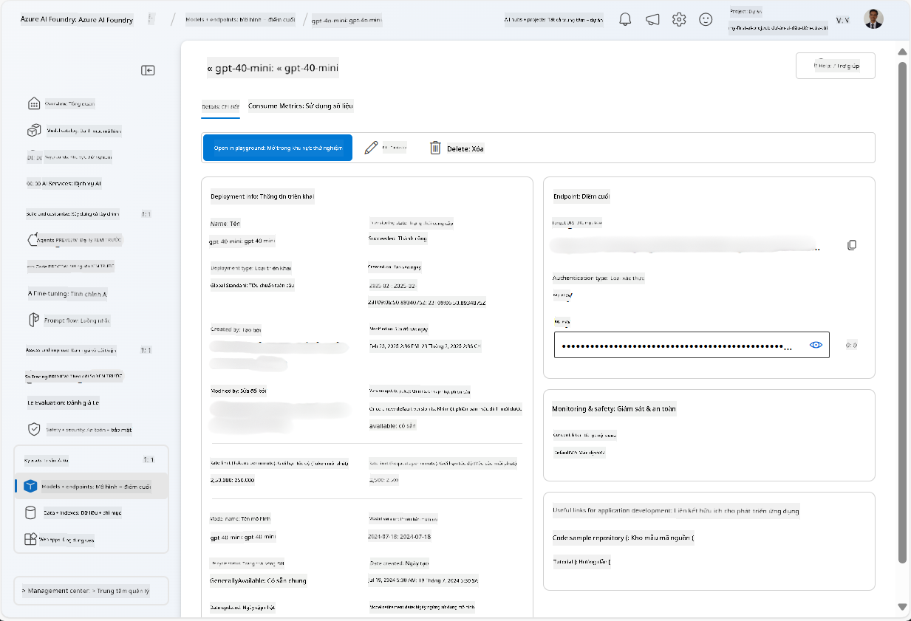
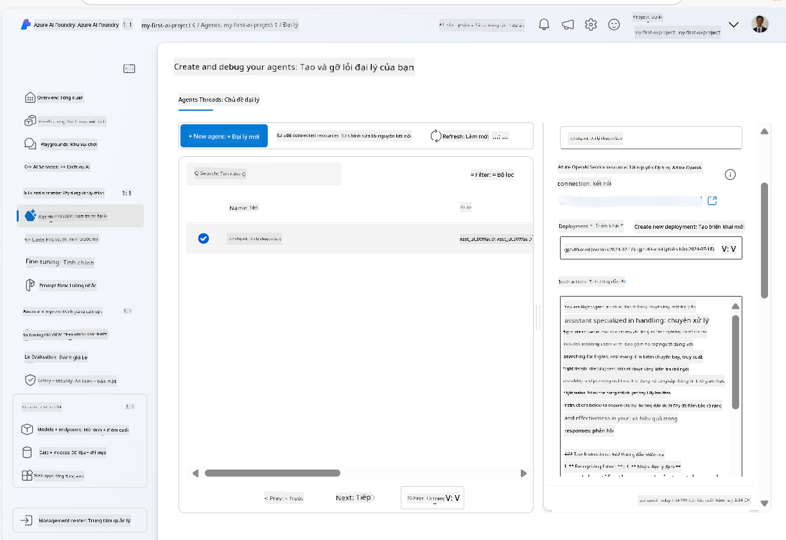
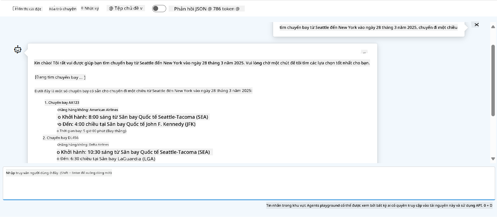

<!--
CO_OP_TRANSLATOR_METADATA:
{
  "original_hash": "7e92870dc0843e13d4dabc620c09d2d9",
  "translation_date": "2025-07-12T08:20:48+00:00",
  "source_file": "02-explore-agentic-frameworks/azure-ai-foundry-agent-creation.md",
  "language_code": "vi"
}
-->
# Phát triển Dịch vụ Azure AI Agent

Trong bài tập này, bạn sẽ sử dụng các công cụ dịch vụ Azure AI Agent trong [cổng Azure AI Foundry](https://ai.azure.com/?WT.mc_id=academic-105485-koreyst) để tạo một agent cho Đặt vé máy bay. Agent này sẽ có khả năng tương tác với người dùng và cung cấp thông tin về các chuyến bay.

## Yêu cầu trước

Để hoàn thành bài tập này, bạn cần:
1. Một tài khoản Azure với đăng ký đang hoạt động. [Tạo tài khoản miễn phí](https://azure.microsoft.com/free/?WT.mc_id=academic-105485-koreyst).
2. Bạn cần có quyền tạo một Azure AI Foundry hub hoặc có người tạo giúp bạn.
    - Nếu vai trò của bạn là Contributor hoặc Owner, bạn có thể làm theo các bước trong hướng dẫn này.

## Tạo một Azure AI Foundry hub

> **Note:** Azure AI Foundry trước đây được gọi là Azure AI Studio.

1. Làm theo hướng dẫn từ bài viết trên blog [Azure AI Foundry](https://learn.microsoft.com/en-us/azure/ai-studio/?WT.mc_id=academic-105485-koreyst) để tạo một Azure AI Foundry hub.
2. Khi dự án của bạn được tạo, đóng các mẹo hiển thị và xem lại trang dự án trong cổng Azure AI Foundry, trang này sẽ trông giống như hình dưới đây:

    

## Triển khai một mô hình

1. Trong bảng điều khiển bên trái của dự án, trong phần **My assets**, chọn trang **Models + endpoints**.
2. Trong trang **Models + endpoints**, ở tab **Model deployments**, trong menu **+ Deploy model**, chọn **Deploy base model**.
3. Tìm kiếm mô hình `gpt-4o-mini` trong danh sách, sau đó chọn và xác nhận.

    > **Note**: Giảm TPM giúp tránh sử dụng quá mức hạn ngạch có trong đăng ký bạn đang dùng.

    

## Tạo một agent

Bây giờ bạn đã triển khai mô hình, bạn có thể tạo một agent. Agent là một mô hình AI hội thoại có thể dùng để tương tác với người dùng.

1. Trong bảng điều khiển bên trái của dự án, trong phần **Build & Customize**, chọn trang **Agents**.
2. Nhấn **+ Create agent** để tạo một agent mới. Trong hộp thoại **Agent Setup**:
    - Nhập tên cho agent, ví dụ `FlightAgent`.
    - Đảm bảo mô hình `gpt-4o-mini` mà bạn đã triển khai trước đó được chọn.
    - Đặt **Instructions** theo lời nhắc mà bạn muốn agent tuân theo. Đây là một ví dụ:
    ```
    You are FlightAgent, a virtual assistant specialized in handling flight-related queries. Your role includes assisting users with searching for flights, retrieving flight details, checking seat availability, and providing real-time flight status. Follow the instructions below to ensure clarity and effectiveness in your responses:

    ### Task Instructions:
    1. **Recognizing Intent**:
       - Identify the user's intent based on their request, focusing on one of the following categories:
         - Searching for flights
         - Retrieving flight details using a flight ID
         - Checking seat availability for a specified flight
         - Providing real-time flight status using a flight number
       - If the intent is unclear, politely ask users to clarify or provide more details.
        
    2. **Processing Requests**:
        - Depending on the identified intent, perform the required task:
        - For flight searches: Request details such as origin, destination, departure date, and optionally return date.
        - For flight details: Request a valid flight ID.
        - For seat availability: Request the flight ID and date and validate inputs.
        - For flight status: Request a valid flight number.
        - Perform validations on provided data (e.g., formats of dates, flight numbers, or IDs). If the information is incomplete or invalid, return a friendly request for clarification.

    3. **Generating Responses**:
    - Use a tone that is friendly, concise, and supportive.
    - Provide clear and actionable suggestions based on the output of each task.
    - If no data is found or an error occurs, explain it to the user gently and offer alternative actions (e.g., refine search, try another query).
    
    ```
> [!NOTE]
> Để có lời nhắc chi tiết hơn, bạn có thể tham khảo [kho lưu trữ này](https://github.com/ShivamGoyal03/RoamMind) để biết thêm thông tin.
    
> Hơn nữa, bạn có thể thêm **Knowledge Base** và **Actions** để nâng cao khả năng của agent trong việc cung cấp thông tin và thực hiện các tác vụ tự động dựa trên yêu cầu của người dùng. Trong bài tập này, bạn có thể bỏ qua các bước đó.
    


3. Để tạo một agent đa AI mới, chỉ cần nhấn **New Agent**. Agent mới tạo sẽ được hiển thị trên trang Agents.

## Kiểm tra agent

Sau khi tạo agent, bạn có thể kiểm tra để xem nó phản hồi các truy vấn của người dùng như thế nào trong khu vực thử nghiệm của cổng Azure AI Foundry.

1. Ở đầu bảng **Setup** cho agent của bạn, chọn **Try in playground**.
2. Trong bảng **Playground**, bạn có thể tương tác với agent bằng cách nhập các truy vấn trong cửa sổ chat. Ví dụ, bạn có thể yêu cầu agent tìm chuyến bay từ Seattle đến New York vào ngày 28.

    > **Note**: Agent có thể không cung cấp câu trả lời chính xác vì không sử dụng dữ liệu thời gian thực trong bài tập này. Mục đích là để kiểm tra khả năng hiểu và phản hồi các truy vấn của người dùng dựa trên hướng dẫn đã cho.

    

3. Sau khi kiểm tra agent, bạn có thể tùy chỉnh thêm bằng cách thêm nhiều intent, dữ liệu huấn luyện và hành động để nâng cao khả năng của nó.

## Dọn dẹp tài nguyên

Khi bạn đã hoàn thành việc kiểm tra agent, bạn có thể xóa nó để tránh phát sinh chi phí không cần thiết.
1. Mở [Azure portal](https://portal.azure.com) và xem nội dung của nhóm tài nguyên nơi bạn đã triển khai các tài nguyên hub dùng trong bài tập này.
2. Trên thanh công cụ, chọn **Delete resource group**.
3. Nhập tên nhóm tài nguyên và xác nhận bạn muốn xóa nó.

## Tài nguyên

- [Tài liệu Azure AI Foundry](https://learn.microsoft.com/en-us/azure/ai-studio/?WT.mc_id=academic-105485-koreyst)
- [Cổng Azure AI Foundry](https://ai.azure.com/?WT.mc_id=academic-105485-koreyst)
- [Bắt đầu với Azure AI Studio](https://techcommunity.microsoft.com/blog/educatordeveloperblog/getting-started-with-azure-ai-studio/4095602?WT.mc_id=academic-105485-koreyst)
- [Kiến thức cơ bản về AI agents trên Azure](https://learn.microsoft.com/en-us/training/modules/ai-agent-fundamentals/?WT.mc_id=academic-105485-koreyst)
- [Azure AI Discord](https://aka.ms/AzureAI/Discord)

**Tuyên bố từ chối trách nhiệm**:  
Tài liệu này đã được dịch bằng dịch vụ dịch thuật AI [Co-op Translator](https://github.com/Azure/co-op-translator). Mặc dù chúng tôi cố gắng đảm bảo độ chính xác, xin lưu ý rằng các bản dịch tự động có thể chứa lỗi hoặc không chính xác. Tài liệu gốc bằng ngôn ngữ gốc của nó nên được coi là nguồn chính xác và đáng tin cậy. Đối với các thông tin quan trọng, nên sử dụng dịch vụ dịch thuật chuyên nghiệp do con người thực hiện. Chúng tôi không chịu trách nhiệm về bất kỳ sự hiểu lầm hoặc giải thích sai nào phát sinh từ việc sử dụng bản dịch này.