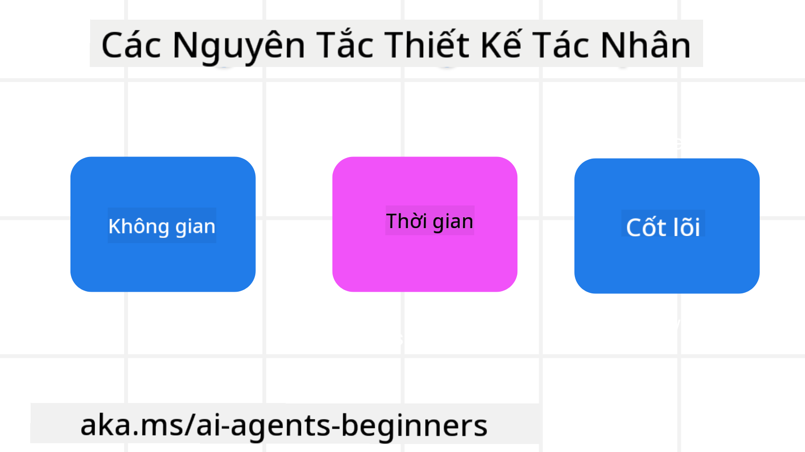

<!--
CO_OP_TRANSLATOR_METADATA:
{
  "original_hash": "4c46e4ff9e349c521e2b0b17f51afa64",
  "translation_date": "2025-08-29T17:57:55+00:00",
  "source_file": "03-agentic-design-patterns/README.md",
  "language_code": "vi"
}
-->

> _(Nhấp vào hình ảnh trên để xem video của bài học này)_
# Nguyên Tắc Thiết Kế Tác Nhân AI

## Giới Thiệu

Có nhiều cách để suy nghĩ về việc xây dựng Hệ Thống Tác Nhân AI. Vì sự mơ hồ là một đặc điểm chứ không phải lỗi trong thiết kế AI Tạo Sinh, đôi khi các kỹ sư gặp khó khăn trong việc xác định điểm bắt đầu. Chúng tôi đã tạo ra một bộ Nguyên Tắc Thiết Kế UX tập trung vào con người để giúp các nhà phát triển xây dựng các hệ thống tác nhân tập trung vào khách hàng nhằm giải quyết nhu cầu kinh doanh của họ. Những nguyên tắc thiết kế này không phải là một kiến trúc bắt buộc mà là một điểm khởi đầu cho các nhóm đang định nghĩa và xây dựng trải nghiệm tác nhân.

Nhìn chung, các tác nhân nên:

- Mở rộng và tăng cường khả năng của con người (tư duy sáng tạo, giải quyết vấn đề, tự động hóa, v.v.)
- Lấp đầy các khoảng trống kiến thức (giúp tôi nắm bắt nhanh các lĩnh vực kiến thức, dịch thuật, v.v.)
- Tạo điều kiện và hỗ trợ sự hợp tác theo cách mà chúng ta, với tư cách cá nhân, thích làm việc với người khác
- Giúp chúng ta trở thành phiên bản tốt hơn của chính mình (ví dụ: huấn luyện viên cuộc sống/người quản lý nhiệm vụ, giúp chúng ta học kỹ năng điều chỉnh cảm xúc và chánh niệm, xây dựng sự kiên cường, v.v.)

## Bài Học Này Sẽ Bao Gồm

- Nguyên Tắc Thiết Kế Tác Nhân là gì
- Một số hướng dẫn cần tuân theo khi triển khai các nguyên tắc thiết kế này
- Một số ví dụ về việc sử dụng các nguyên tắc thiết kế

## Mục Tiêu Học Tập

Sau khi hoàn thành bài học này, bạn sẽ có thể:

1. Giải thích Nguyên Tắc Thiết Kế Tác Nhân là gì
2. Giải thích các hướng dẫn sử dụng Nguyên Tắc Thiết Kế Tác Nhân
3. Hiểu cách xây dựng một tác nhân sử dụng Nguyên Tắc Thiết Kế Tác Nhân

## Nguyên Tắc Thiết Kế Tác Nhân

### Tác Nhân (Không Gian)

Đây là môi trường mà tác nhân hoạt động. Những nguyên tắc này định hướng cách chúng ta thiết kế các tác nhân để tham gia vào thế giới vật lý và kỹ thuật số.

- **Kết nối, không làm suy giảm** – giúp kết nối mọi người với những người khác, sự kiện và kiến thức có thể hành động để tạo điều kiện hợp tác và kết nối.
- Các tác nhân giúp kết nối sự kiện, kiến thức và con người.
- Các tác nhân đưa mọi người lại gần nhau hơn. Chúng không được thiết kế để thay thế hoặc làm giảm giá trị của con người.
- **Dễ dàng truy cập nhưng đôi khi vô hình** – tác nhân chủ yếu hoạt động ở chế độ nền và chỉ nhắc nhở chúng ta khi điều đó phù hợp và cần thiết.
  - Tác nhân dễ dàng được tìm thấy và truy cập bởi người dùng được ủy quyền trên bất kỳ thiết bị hoặc nền tảng nào.
  - Tác nhân hỗ trợ đầu vào và đầu ra đa phương thức (âm thanh, giọng nói, văn bản, v.v.).
  - Tác nhân có thể chuyển đổi liền mạch giữa chế độ nền và chế độ chính; giữa chủ động và phản ứng, tùy thuộc vào việc cảm nhận nhu cầu của người dùng.
  - Tác nhân có thể hoạt động ở dạng vô hình, nhưng quá trình hoạt động nền và sự hợp tác với các Tác Nhân khác đều minh bạch và có thể kiểm soát bởi người dùng.

### Tác Nhân (Thời Gian)

Đây là cách tác nhân hoạt động theo thời gian. Những nguyên tắc này định hướng cách chúng ta thiết kế các tác nhân tương tác qua quá khứ, hiện tại và tương lai.

- **Quá khứ**: Phản ánh lịch sử bao gồm cả trạng thái và ngữ cảnh.
  - Tác nhân cung cấp kết quả phù hợp hơn dựa trên phân tích dữ liệu lịch sử phong phú hơn, không chỉ sự kiện, con người hoặc trạng thái.
  - Tác nhân tạo kết nối từ các sự kiện trong quá khứ và chủ động phản ánh trí nhớ để tham gia vào các tình huống hiện tại.
- **Hiện tại**: Nhắc nhở hơn là thông báo.
  - Tác nhân thể hiện một cách tiếp cận toàn diện để tương tác với con người. Khi một sự kiện xảy ra, Tác Nhân vượt qua thông báo tĩnh hoặc các hình thức tĩnh khác. Tác Nhân có thể đơn giản hóa các luồng hoặc tạo ra các gợi ý động để hướng sự chú ý của người dùng vào đúng thời điểm.
  - Tác nhân cung cấp thông tin dựa trên môi trường ngữ cảnh, thay đổi xã hội và văn hóa, và được điều chỉnh theo ý định của người dùng.
  - Tương tác với Tác Nhân có thể dần dần, phát triển/tăng độ phức tạp để trao quyền cho người dùng trong dài hạn.
- **Tương lai**: Thích nghi và phát triển.
  - Tác nhân thích nghi với các thiết bị, nền tảng và phương thức khác nhau.
  - Tác nhân thích nghi với hành vi của người dùng, nhu cầu tiếp cận và có thể tùy chỉnh tự do.
  - Tác nhân được định hình và phát triển thông qua sự tương tác liên tục của người dùng.

### Tác Nhân (Cốt Lõi)

Đây là các yếu tố chính trong cốt lõi của thiết kế tác nhân.

- **Chấp nhận sự không chắc chắn nhưng thiết lập niềm tin**.
  - Một mức độ không chắc chắn của Tác Nhân là điều được mong đợi. Sự không chắc chắn là một yếu tố quan trọng trong thiết kế tác nhân.
  - Niềm tin và sự minh bạch là các lớp nền tảng của thiết kế Tác Nhân.
  - Con người kiểm soát khi nào Tác Nhân bật/tắt và trạng thái của Tác Nhân luôn được hiển thị rõ ràng.

## Các Hướng Dẫn Để Triển Khai Các Nguyên Tắc Này

Khi bạn sử dụng các nguyên tắc thiết kế trước đó, hãy tuân theo các hướng dẫn sau:

1. **Minh bạch**: Thông báo cho người dùng rằng AI đang được sử dụng, cách nó hoạt động (bao gồm các hành động trong quá khứ), và cách đưa ra phản hồi và chỉnh sửa hệ thống.
2. **Kiểm soát**: Cho phép người dùng tùy chỉnh, chỉ định sở thích và cá nhân hóa, và kiểm soát hệ thống và các thuộc tính của nó (bao gồm khả năng quên).
3. **Nhất quán**: Hướng tới trải nghiệm nhất quán, đa phương thức trên các thiết bị và điểm cuối. Sử dụng các yếu tố UI/UX quen thuộc khi có thể (ví dụ: biểu tượng micro cho tương tác bằng giọng nói) và giảm tải nhận thức của khách hàng càng nhiều càng tốt (ví dụ: hướng tới các phản hồi ngắn gọn, hỗ trợ hình ảnh và nội dung 'Tìm Hiểu Thêm').

## Cách Thiết Kế Một Tác Nhân Du Lịch Sử Dụng Các Nguyên Tắc Và Hướng Dẫn Này

Hãy tưởng tượng bạn đang thiết kế một Tác Nhân Du Lịch, đây là cách bạn có thể nghĩ về việc sử dụng các Nguyên Tắc Thiết Kế và Hướng Dẫn:

1. **Minh bạch** – Cho người dùng biết rằng Tác Nhân Du Lịch là một Tác Nhân được hỗ trợ bởi AI. Cung cấp một số hướng dẫn cơ bản về cách bắt đầu (ví dụ: một tin nhắn “Xin chào”, các gợi ý mẫu). Rõ ràng ghi chú điều này trên trang sản phẩm. Hiển thị danh sách các gợi ý mà người dùng đã hỏi trong quá khứ. Làm rõ cách đưa ra phản hồi (nút Thích và Không Thích, nút Gửi Phản Hồi, v.v.). Rõ ràng giải thích nếu Tác Nhân có các hạn chế về sử dụng hoặc chủ đề.
2. **Kiểm soát** – Đảm bảo rõ ràng cách người dùng có thể chỉnh sửa Tác Nhân sau khi nó được tạo ra với các yếu tố như Lời Nhắc Hệ Thống. Cho phép người dùng chọn mức độ chi tiết của Tác Nhân, phong cách viết của nó, và bất kỳ lưu ý nào về những gì Tác Nhân không nên nói đến. Cho phép người dùng xem và xóa bất kỳ tệp hoặc dữ liệu, gợi ý, và các cuộc trò chuyện trước đó liên quan.
3. **Nhất quán** – Đảm bảo các biểu tượng cho Chia Sẻ Lời Nhắc, thêm tệp hoặc ảnh và gắn thẻ ai đó hoặc điều gì đó là tiêu chuẩn và dễ nhận biết. Sử dụng biểu tượng kẹp giấy để chỉ việc tải lên/chia sẻ tệp với Tác Nhân, và biểu tượng hình ảnh để chỉ việc tải lên đồ họa.

### Có Thêm Câu Hỏi Về Mẫu Thiết Kế Tác Nhân AI?

Tham gia [Azure AI Foundry Discord](https://aka.ms/ai-agents/discord) để gặp gỡ các học viên khác, tham dự giờ làm việc và nhận câu trả lời cho các câu hỏi về Tác Nhân AI của bạn.

## Tài Nguyên Bổ Sung

## Bài Học Trước

[Khám Phá Các Khung Tác Nhân](../02-explore-agentic-frameworks/README.md)

## Bài Học Tiếp Theo

[Mẫu Thiết Kế Sử Dụng Công Cụ](../04-tool-use/README.md)

---

**Tuyên bố miễn trừ trách nhiệm**:  
Tài liệu này đã được dịch bằng dịch vụ dịch thuật AI [Co-op Translator](https://github.com/Azure/co-op-translator). Mặc dù chúng tôi cố gắng đảm bảo độ chính xác, xin lưu ý rằng các bản dịch tự động có thể chứa lỗi hoặc không chính xác. Tài liệu gốc bằng ngôn ngữ bản địa nên được coi là nguồn thông tin chính thức. Đối với các thông tin quan trọng, khuyến nghị sử dụng dịch vụ dịch thuật chuyên nghiệp bởi con người. Chúng tôi không chịu trách nhiệm cho bất kỳ sự hiểu lầm hoặc diễn giải sai nào phát sinh từ việc sử dụng bản dịch này.