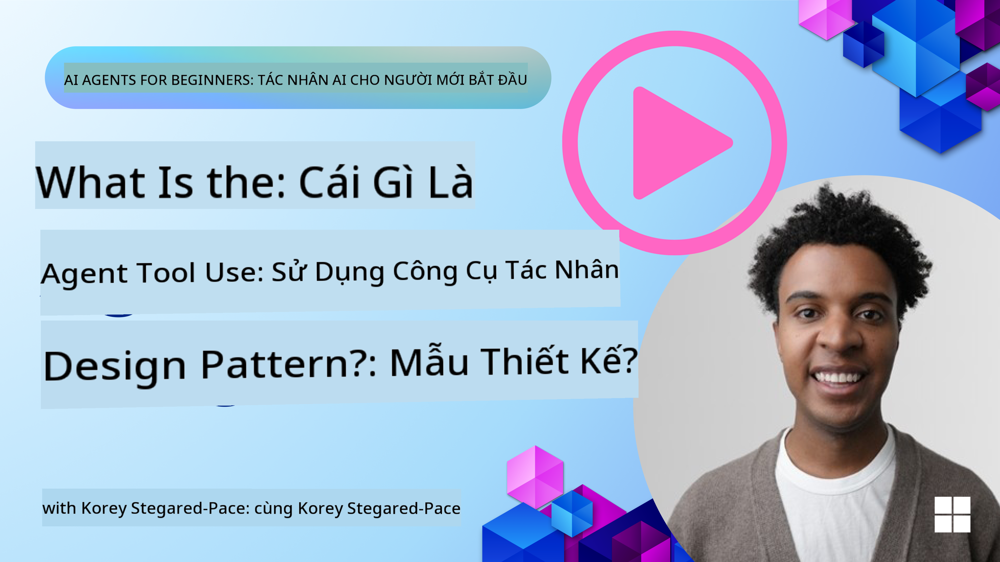
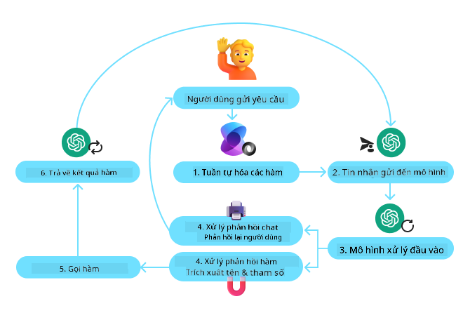
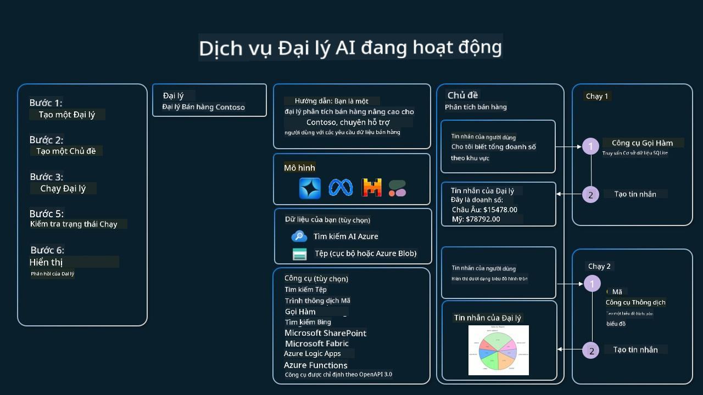

<!--
CO_OP_TRANSLATOR_METADATA:
{
  "original_hash": "88258b03f2893aa2e69eb8fb24baabbc",
  "translation_date": "2025-07-12T09:39:03+00:00",
  "source_file": "04-tool-use/README.md",
  "language_code": "vi"
}
-->
[](https://youtu.be/vieRiPRx-gI?si=cEZ8ApnT6Sus9rhn)

> _(Nhấp vào hình ảnh trên để xem video bài học này)_

# Mẫu Thiết Kế Sử Dụng Công Cụ

Công cụ rất thú vị vì chúng cho phép các đại lý AI có khả năng rộng hơn. Thay vì đại lý chỉ có một tập hợp hành động giới hạn, bằng cách thêm một công cụ, đại lý có thể thực hiện nhiều hành động đa dạng hơn. Trong chương này, chúng ta sẽ tìm hiểu về Mẫu Thiết Kế Sử Dụng Công Cụ, mô tả cách các đại lý AI có thể sử dụng các công cụ cụ thể để đạt được mục tiêu của mình.

## Giới thiệu

Trong bài học này, chúng ta sẽ trả lời các câu hỏi sau:

- Mẫu thiết kế sử dụng công cụ là gì?
- Những trường hợp sử dụng nào có thể áp dụng mẫu này?
- Những thành phần/cấu phần cần thiết để triển khai mẫu thiết kế này là gì?
- Những lưu ý đặc biệt khi sử dụng Mẫu Thiết Kế Sử Dụng Công Cụ để xây dựng các đại lý AI đáng tin cậy là gì?

## Mục tiêu học tập

Sau khi hoàn thành bài học này, bạn sẽ có thể:

- Định nghĩa Mẫu Thiết Kế Sử Dụng Công Cụ và mục đích của nó.
- Nhận biết các trường hợp sử dụng phù hợp với Mẫu Thiết Kế Sử Dụng Công Cụ.
- Hiểu các thành phần chính cần thiết để triển khai mẫu thiết kế.
- Nhận diện các lưu ý để đảm bảo độ tin cậy cho các đại lý AI sử dụng mẫu thiết kế này.

## Mẫu Thiết Kế Sử Dụng Công Cụ là gì?

**Mẫu Thiết Kế Sử Dụng Công Cụ** tập trung vào việc cung cấp cho các mô hình ngôn ngữ lớn (LLM) khả năng tương tác với các công cụ bên ngoài để đạt được các mục tiêu cụ thể. Công cụ là mã có thể được đại lý thực thi để thực hiện các hành động. Một công cụ có thể là một hàm đơn giản như máy tính, hoặc một cuộc gọi API đến dịch vụ bên thứ ba như tra cứu giá cổ phiếu hoặc dự báo thời tiết. Trong bối cảnh các đại lý AI, các công cụ được thiết kế để được thực thi bởi đại lý dựa trên **các cuộc gọi hàm do mô hình tạo ra**.

## Những trường hợp sử dụng có thể áp dụng mẫu này?

Các đại lý AI có thể tận dụng công cụ để hoàn thành các nhiệm vụ phức tạp, truy xuất thông tin hoặc đưa ra quyết định. Mẫu thiết kế sử dụng công cụ thường được dùng trong các tình huống yêu cầu tương tác động với các hệ thống bên ngoài, như cơ sở dữ liệu, dịch vụ web hoặc trình thông dịch mã. Khả năng này hữu ích cho nhiều trường hợp khác nhau bao gồm:

- **Truy xuất thông tin động:** Đại lý có thể truy vấn API hoặc cơ sở dữ liệu bên ngoài để lấy dữ liệu cập nhật (ví dụ: truy vấn cơ sở dữ liệu SQLite để phân tích dữ liệu, lấy giá cổ phiếu hoặc thông tin thời tiết).
- **Thực thi và thông dịch mã:** Đại lý có thể chạy mã hoặc script để giải các bài toán toán học, tạo báo cáo hoặc thực hiện mô phỏng.
- **Tự động hóa quy trình làm việc:** Tự động hóa các quy trình lặp đi lặp lại hoặc nhiều bước bằng cách tích hợp các công cụ như bộ lập lịch tác vụ, dịch vụ email hoặc pipeline dữ liệu.
- **Hỗ trợ khách hàng:** Đại lý có thể tương tác với hệ thống CRM, nền tảng quản lý vé hoặc cơ sở tri thức để giải quyết các câu hỏi của người dùng.
- **Tạo và chỉnh sửa nội dung:** Đại lý có thể sử dụng các công cụ như kiểm tra ngữ pháp, tóm tắt văn bản hoặc đánh giá an toàn nội dung để hỗ trợ công việc tạo nội dung.

## Những thành phần/cấu phần cần thiết để triển khai mẫu thiết kế sử dụng công cụ?

Những cấu phần này cho phép đại lý AI thực hiện nhiều loại nhiệm vụ khác nhau. Hãy cùng xem các thành phần chính cần thiết để triển khai Mẫu Thiết Kế Sử Dụng Công Cụ:

- **Schema Hàm/Công Cụ**: Định nghĩa chi tiết các công cụ có sẵn, bao gồm tên hàm, mục đích, tham số yêu cầu và kết quả mong đợi. Các schema này giúp LLM hiểu được công cụ nào có thể dùng và cách xây dựng các yêu cầu hợp lệ.

- **Logic Thực Thi Hàm**: Quy định cách và thời điểm các công cụ được gọi dựa trên ý định người dùng và ngữ cảnh cuộc trò chuyện. Điều này có thể bao gồm các module lập kế hoạch, cơ chế định tuyến hoặc luồng điều kiện để xác định việc sử dụng công cụ một cách linh hoạt.

- **Hệ Thống Xử Lý Tin Nhắn**: Các thành phần quản lý luồng hội thoại giữa đầu vào người dùng, phản hồi của LLM, các cuộc gọi công cụ và kết quả trả về từ công cụ.

- **Khung Tích Hợp Công Cụ**: Cơ sở hạ tầng kết nối đại lý với các công cụ khác nhau, dù là các hàm đơn giản hay dịch vụ bên ngoài phức tạp.

- **Xử Lý Lỗi & Xác Thực**: Cơ chế xử lý lỗi khi thực thi công cụ, xác thực tham số và quản lý các phản hồi không mong đợi.

- **Quản Lý Trạng Thái**: Theo dõi ngữ cảnh cuộc trò chuyện, các tương tác công cụ trước đó và dữ liệu lưu trữ để đảm bảo tính nhất quán trong các tương tác nhiều lượt.

Tiếp theo, chúng ta sẽ xem chi tiết hơn về Gọi Hàm/Công Cụ.

### Gọi Hàm/Công Cụ

Gọi hàm là cách chính để cho phép các mô hình ngôn ngữ lớn (LLM) tương tác với công cụ. Bạn sẽ thường thấy 'Hàm' và 'Công cụ' được dùng thay thế cho nhau vì 'hàm' (khối mã có thể tái sử dụng) chính là 'công cụ' mà đại lý dùng để thực hiện nhiệm vụ. Để mã của một hàm được gọi, LLM phải so sánh yêu cầu của người dùng với mô tả của các hàm. Để làm điều này, một schema chứa mô tả tất cả các hàm có sẵn được gửi đến LLM. LLM sau đó chọn hàm phù hợp nhất cho nhiệm vụ và trả về tên hàm cùng các đối số. Hàm được chọn sẽ được gọi, phản hồi của nó được gửi lại cho LLM, và LLM sử dụng thông tin này để trả lời yêu cầu của người dùng.

Để các nhà phát triển triển khai gọi hàm cho đại lý, bạn cần:

1. Một mô hình LLM hỗ trợ gọi hàm
2. Một schema chứa mô tả các hàm
3. Mã cho từng hàm được mô tả

Hãy dùng ví dụ lấy thời gian hiện tại ở một thành phố để minh họa:

1. **Khởi tạo một LLM hỗ trợ gọi hàm:**

    Không phải mô hình nào cũng hỗ trợ gọi hàm, vì vậy bạn cần kiểm tra xem LLM bạn dùng có hỗ trợ không. <a href="https://learn.microsoft.com/azure/ai-services/openai/how-to/function-calling" target="_blank">Azure OpenAI</a> hỗ trợ gọi hàm. Chúng ta có thể bắt đầu bằng cách khởi tạo client Azure OpenAI.

    ```python
    # Initialize the Azure OpenAI client
    client = AzureOpenAI(
        azure_endpoint = os.getenv("AZURE_OPENAI_ENDPOINT"), 
        api_key=os.getenv("AZURE_OPENAI_API_KEY"),  
        api_version="2024-05-01-preview"
    )
    ```

1. **Tạo Schema Hàm:**

    Tiếp theo, chúng ta sẽ định nghĩa một schema JSON chứa tên hàm, mô tả chức năng của hàm, và tên cùng mô tả các tham số của hàm.
    Sau đó, schema này sẽ được truyền cho client đã tạo trước đó, cùng với yêu cầu của người dùng để tìm thời gian ở San Francisco. Điều quan trọng cần lưu ý là **cuộc gọi công cụ** là thứ được trả về, **không phải** câu trả lời cuối cùng cho câu hỏi. Như đã đề cập, LLM trả về tên hàm được chọn cho nhiệm vụ và các đối số sẽ được truyền vào.

    ```python
    # Function description for the model to read
    tools = [
        {
            "type": "function",
            "function": {
                "name": "get_current_time",
                "description": "Get the current time in a given location",
                "parameters": {
                    "type": "object",
                    "properties": {
                        "location": {
                            "type": "string",
                            "description": "The city name, e.g. San Francisco",
                        },
                    },
                    "required": ["location"],
                },
            }
        }
    ]
    ```
   
    ```python
  
    # Initial user message
    messages = [{"role": "user", "content": "What's the current time in San Francisco"}] 
  
    # First API call: Ask the model to use the function
      response = client.chat.completions.create(
          model=deployment_name,
          messages=messages,
          tools=tools,
          tool_choice="auto",
      )
  
      # Process the model's response
      response_message = response.choices[0].message
      messages.append(response_message)
  
      print("Model's response:")  

      print(response_message)
  
    ```

    ```bash
    Model's response:
    ChatCompletionMessage(content=None, role='assistant', function_call=None, tool_calls=[ChatCompletionMessageToolCall(id='call_pOsKdUlqvdyttYB67MOj434b', function=Function(arguments='{"location":"San Francisco"}', name='get_current_time'), type='function')])
    ```
  
1. **Mã hàm cần thiết để thực hiện nhiệm vụ:**

    Khi LLM đã chọn hàm cần chạy, mã thực thi nhiệm vụ cần được triển khai và chạy.
    Chúng ta có thể viết mã lấy thời gian hiện tại bằng Python. Cũng cần viết mã để trích xuất tên và đối số từ response_message để lấy kết quả cuối cùng.

    ```python
      def get_current_time(location):
        """Get the current time for a given location"""
        print(f"get_current_time called with location: {location}")  
        location_lower = location.lower()
        
        for key, timezone in TIMEZONE_DATA.items():
            if key in location_lower:
                print(f"Timezone found for {key}")  
                current_time = datetime.now(ZoneInfo(timezone)).strftime("%I:%M %p")
                return json.dumps({
                    "location": location,
                    "current_time": current_time
                })
      
        print(f"No timezone data found for {location_lower}")  
        return json.dumps({"location": location, "current_time": "unknown"})
    ```

    ```python
     # Handle function calls
      if response_message.tool_calls:
          for tool_call in response_message.tool_calls:
              if tool_call.function.name == "get_current_time":
     
                  function_args = json.loads(tool_call.function.arguments)
     
                  time_response = get_current_time(
                      location=function_args.get("location")
                  )
     
                  messages.append({
                      "tool_call_id": tool_call.id,
                      "role": "tool",
                      "name": "get_current_time",
                      "content": time_response,
                  })
      else:
          print("No tool calls were made by the model.")  
  
      # Second API call: Get the final response from the model
      final_response = client.chat.completions.create(
          model=deployment_name,
          messages=messages,
      )
  
      return final_response.choices[0].message.content
     ```

    ```bash
      get_current_time called with location: San Francisco
      Timezone found for san francisco
      The current time in San Francisco is 09:24 AM.
     ```

Gọi Hàm là trung tâm của hầu hết, nếu không muốn nói là tất cả, thiết kế sử dụng công cụ cho đại lý, tuy nhiên việc triển khai từ đầu đôi khi có thể khó khăn.
Như chúng ta đã học trong [Bài 2](../../../02-explore-agentic-frameworks), các framework agentic cung cấp các cấu phần dựng sẵn để triển khai sử dụng công cụ.

## Ví dụ sử dụng công cụ với các Framework Agentic

Dưới đây là một số ví dụ về cách bạn có thể triển khai Mẫu Thiết Kế Sử Dụng Công Cụ bằng các framework agentic khác nhau:

### Semantic Kernel

<a href="https://learn.microsoft.com/azure/ai-services/agents/overview" target="_blank">Semantic Kernel</a> là một framework AI mã nguồn mở dành cho các nhà phát triển .NET, Python và Java làm việc với các mô hình ngôn ngữ lớn (LLM). Nó đơn giản hóa quá trình gọi hàm bằng cách tự động mô tả các hàm và tham số của bạn cho mô hình thông qua một quá trình gọi là <a href="https://learn.microsoft.com/semantic-kernel/concepts/ai-services/chat-completion/function-calling/?pivots=programming-language-python#1-serializing-the-functions" target="_blank">chuẩn hóa</a>. Nó cũng xử lý việc giao tiếp qua lại giữa mô hình và mã của bạn. Một lợi thế khác khi dùng framework agentic như Semantic Kernel là bạn có thể truy cập các công cụ dựng sẵn như <a href="https://github.com/microsoft/semantic-kernel/blob/main/python/samples/getting_started_with_agents/openai_assistant/step4_assistant_tool_file_search.py" target="_blank">Tìm kiếm Tệp</a> và <a href="https://github.com/microsoft/semantic-kernel/blob/main/python/samples/getting_started_with_agents/openai_assistant/step3_assistant_tool_code_interpreter.py" target="_blank">Trình Thông Dịch Mã</a>.

Sơ đồ dưới đây minh họa quá trình gọi hàm với Semantic Kernel:



Trong Semantic Kernel, các hàm/công cụ được gọi là <a href="https://learn.microsoft.com/semantic-kernel/concepts/plugins/?pivots=programming-language-python" target="_blank">Plugin</a>. Chúng ta có thể chuyển hàm `get_current_time` đã thấy trước đó thành một plugin bằng cách biến nó thành một lớp chứa hàm đó. Chúng ta cũng có thể nhập decorator `kernel_function`, nhận mô tả của hàm. Khi bạn tạo kernel với GetCurrentTimePlugin, kernel sẽ tự động chuẩn hóa hàm và tham số, tạo schema để gửi đến LLM trong quá trình này.

```python
from semantic_kernel.functions import kernel_function

class GetCurrentTimePlugin:
    async def __init__(self, location):
        self.location = location

    @kernel_function(
        description="Get the current time for a given location"
    )
    def get_current_time(location: str = ""):
        ...

```

```python 
from semantic_kernel import Kernel

# Create the kernel
kernel = Kernel()

# Create the plugin
get_current_time_plugin = GetCurrentTimePlugin(location)

# Add the plugin to the kernel
kernel.add_plugin(get_current_time_plugin)
```
  
### Azure AI Agent Service

<a href="https://learn.microsoft.com/azure/ai-services/agents/overview" target="_blank">Azure AI Agent Service</a> là một framework agentic mới được thiết kế để giúp các nhà phát triển xây dựng, triển khai và mở rộng các đại lý AI chất lượng cao, có thể mở rộng một cách an toàn mà không cần quản lý tài nguyên tính toán và lưu trữ bên dưới. Nó đặc biệt hữu ích cho các ứng dụng doanh nghiệp vì là dịch vụ được quản lý hoàn toàn với bảo mật cấp doanh nghiệp.

So với việc phát triển trực tiếp với API LLM, Azure AI Agent Service có một số ưu điểm, bao gồm:

- Gọi công cụ tự động – không cần phải phân tích cuộc gọi công cụ, gọi công cụ và xử lý phản hồi; tất cả đều được thực hiện phía máy chủ
- Quản lý dữ liệu an toàn – thay vì tự quản lý trạng thái cuộc trò chuyện, bạn có thể dựa vào các `threads` để lưu trữ tất cả thông tin cần thiết
- Công cụ có sẵn – Các công cụ bạn có thể dùng để tương tác với nguồn dữ liệu, như Bing, Azure AI Search và Azure Functions.

Các công cụ có trong Azure AI Agent Service được chia thành hai loại:

1. Công cụ Kiến thức:
    - <a href="https://learn.microsoft.com/azure/ai-services/agents/how-to/tools/bing-grounding?tabs=python&pivots=overview" target="_blank">Tích hợp với Bing Search</a>
    - <a href="https://learn.microsoft.com/azure/ai-services/agents/how-to/tools/file-search?tabs=python&pivots=overview" target="_blank">Tìm kiếm Tệp</a>
    - <a href="https://learn.microsoft.com/azure/ai-services/agents/how-to/tools/azure-ai-search?tabs=azurecli%2Cpython&pivots=overview-azure-ai-search" target="_blank">Azure AI Search</a>

2. Công cụ Hành động:
    - <a href="https://learn.microsoft.com/azure/ai-services/agents/how-to/tools/function-calling?tabs=python&pivots=overview" target="_blank">Gọi Hàm</a>
    - <a href="https://learn.microsoft.com/azure/ai-services/agents/how-to/tools/code-interpreter?tabs=python&pivots=overview" target="_blank">Trình Thông Dịch Mã</a>
    - <a href="https://learn.microsoft.com/azure/ai-services/agents/how-to/tools/openapi-spec?tabs=python&pivots=overview" target="_blank">Công cụ định nghĩa bởi OpenAI</a>
    - <a href="https://learn.microsoft.com/azure/ai-services/agents/how-to/tools/azure-functions?pivots=overview" target="_blank">Azure Functions</a>

Agent Service cho phép chúng ta sử dụng các công cụ này cùng nhau như một `toolset`. Nó cũng sử dụng `threads` để theo dõi lịch sử tin nhắn của một cuộc trò chuyện cụ thể.

Hãy tưởng tượng bạn là một đại lý bán hàng tại công ty Contoso. Bạn muốn phát triển một đại lý hội thoại có thể trả lời các câu hỏi về dữ liệu bán hàng của bạn.

Hình ảnh dưới đây minh họa cách bạn có thể dùng Azure AI Agent Service để phân tích dữ liệu bán hàng:



Để sử dụng bất kỳ công cụ nào với dịch vụ này, chúng ta có thể tạo một client và định nghĩa một công cụ hoặc bộ công cụ. Để triển khai thực tế, ta có thể dùng đoạn mã Python sau. LLM sẽ xem xét bộ công cụ và quyết định sử dụng hàm do người dùng tạo `fetch_sales_data_using_sqlite_query` hay Trình Thông Dịch Mã dựng sẵn tùy theo yêu cầu của người dùng.

```python 
import os
from azure.ai.projects import AIProjectClient
from azure.identity import DefaultAzureCredential
from fecth_sales_data_functions import fetch_sales_data_using_sqlite_query # fetch_sales_data_using_sqlite_query function which can be found in a fetch_sales_data_functions.py file.
from azure.ai.projects.models import ToolSet, FunctionTool, CodeInterpreterTool

project_client = AIProjectClient.from_connection_string(
    credential=DefaultAzureCredential(),
    conn_str=os.environ["PROJECT_CONNECTION_STRING"],
)

# Initialize function calling agent with the fetch_sales_data_using_sqlite_query function and adding it to the toolset
fetch_data_function = FunctionTool(fetch_sales_data_using_sqlite_query)
toolset = ToolSet()
toolset.add(fetch_data_function)

# Initialize Code Interpreter tool and adding it to the toolset. 
code_interpreter = code_interpreter = CodeInterpreterTool()
toolset = ToolSet()
toolset.add(code_interpreter)

agent = project_client.agents.create_agent(
    model="gpt-4o-mini", name="my-agent", instructions="You are helpful agent", 
    toolset=toolset
)
```

## Những lưu ý đặc biệt khi sử dụng Mẫu Thiết Kế Sử Dụng Công Cụ để xây dựng các đại lý AI đáng tin cậy?

Một mối quan tâm phổ biến với SQL được tạo động bởi LLM là vấn đề bảo mật, đặc biệt là nguy cơ tấn công SQL injection hoặc các hành động độc hại như xóa hoặc làm hỏng cơ sở dữ liệu. Mặc dù những lo ngại này là hợp lý, chúng có thể được giảm thiểu hiệu quả bằng cách cấu hình quyền truy cập cơ sở dữ liệu đúng cách. Với hầu hết các cơ sở dữ liệu, điều này bao gồm việc cấu hình cơ sở dữ liệu ở chế độ chỉ đọc. Với các dịch vụ cơ sở dữ liệu như PostgreSQL hoặc Azure SQL, ứng dụng nên được gán vai trò chỉ đọc (SELECT).

Chạy ứng dụng trong môi trường an toàn càng tăng cường bảo vệ. Trong các kịch bản doanh nghiệp, dữ liệu thường được trích xuất và chuyển đổi từ các hệ thống vận hành sang cơ sở dữ liệu hoặc kho dữ liệu chỉ đọc với schema thân thiện với người dùng. Cách tiếp cận này đảm bảo dữ liệu được bảo mật, tối ưu về hiệu năng và khả năng truy cập, đồng thời ứng dụng chỉ có quyền truy cập giới hạn, chỉ đọc.

## Tài nguyên bổ sung

-

Azure AI Agents Service Workshop</a>
- <a href="https://github.com/Azure-Samples/contoso-creative-writer/tree/main/docs/workshop" target="_blank">Hội thảo Đa Tác nhân Contoso Creative Writer</a>
- <a href="https://learn.microsoft.com/semantic-kernel/concepts/ai-services/chat-completion/function-calling/?pivots=programming-language-python#1-serializing-the-functions" target="_blank">Hướng dẫn Gọi Hàm Semantic Kernel</a>
- <a href="https://github.com/microsoft/semantic-kernel/blob/main/python/samples/getting_started_with_agents/openai_assistant/step3_assistant_tool_code_interpreter.py" target="_blank">Trình thông dịch mã Semantic Kernel</a>
- <a href="https://microsoft.github.io/autogen/dev/user-guide/core-user-guide/components/tools.html" target="_blank">Công cụ Autogen</a>

## Bài học trước

[Hiểu về Mẫu Thiết kế Agentic](../03-agentic-design-patterns/README.md)

## Bài học tiếp theo

[Agentic RAG](../05-agentic-rag/README.md)

**Tuyên bố từ chối trách nhiệm**:  
Tài liệu này đã được dịch bằng dịch vụ dịch thuật AI [Co-op Translator](https://github.com/Azure/co-op-translator). Mặc dù chúng tôi cố gắng đảm bảo độ chính xác, xin lưu ý rằng bản dịch tự động có thể chứa lỗi hoặc không chính xác. Tài liệu gốc bằng ngôn ngữ gốc của nó nên được coi là nguồn chính xác và đáng tin cậy. Đối với các thông tin quan trọng, nên sử dụng dịch vụ dịch thuật chuyên nghiệp do con người thực hiện. Chúng tôi không chịu trách nhiệm về bất kỳ sự hiểu lầm hoặc giải thích sai nào phát sinh từ việc sử dụng bản dịch này.