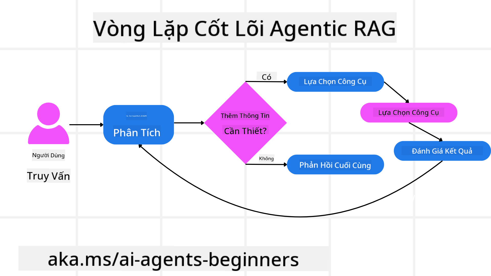
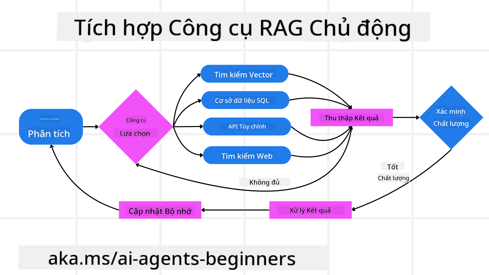
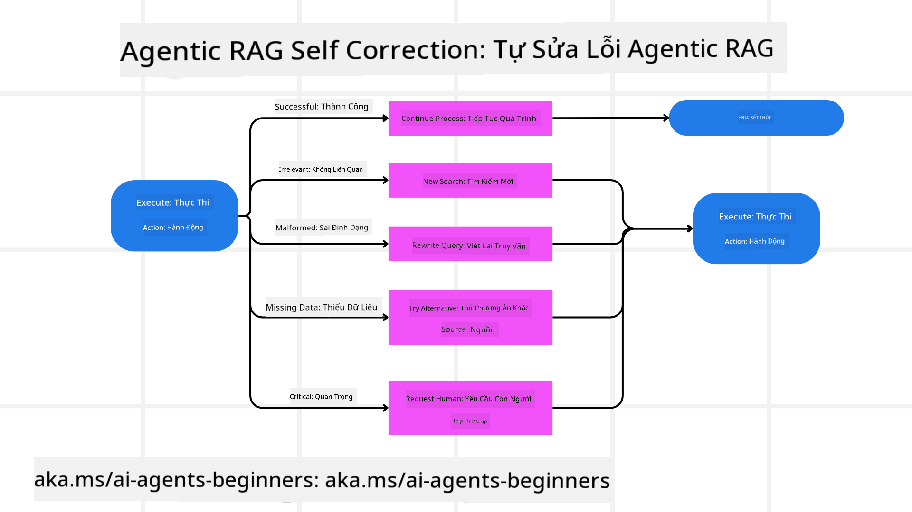
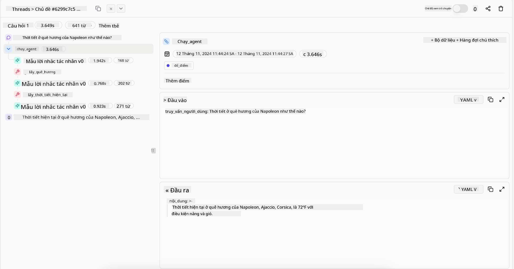
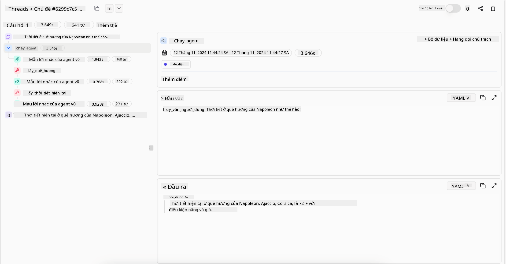

<!--
CO_OP_TRANSLATOR_METADATA:
{
  "original_hash": "7622aa72f9e676e593339f5f694ecd7d",
  "translation_date": "2025-07-12T10:07:36+00:00",
  "source_file": "05-agentic-rag/README.md",
  "language_code": "vi"
}
-->

> _(Nhấp vào hình ảnh trên để xem video bài học này)_

# Agentic RAG

Bài học này cung cấp cái nhìn tổng quan toàn diện về Agentic Retrieval-Augmented Generation (Agentic RAG), một mô hình AI mới nổi, trong đó các mô hình ngôn ngữ lớn (LLMs) tự động lập kế hoạch các bước tiếp theo trong khi truy xuất thông tin từ các nguồn bên ngoài. Khác với mô hình truy xuất rồi đọc tĩnh, Agentic RAG bao gồm các lần gọi lặp đi lặp lại tới LLM, xen kẽ với các cuộc gọi công cụ hoặc hàm và các đầu ra có cấu trúc. Hệ thống đánh giá kết quả, tinh chỉnh truy vấn, gọi thêm công cụ nếu cần và tiếp tục chu trình này cho đến khi đạt được giải pháp thỏa đáng.

## Giới thiệu

Bài học này sẽ bao gồm

- **Hiểu về Agentic RAG:** Tìm hiểu về mô hình AI mới nổi, nơi các mô hình ngôn ngữ lớn (LLMs) tự động lập kế hoạch các bước tiếp theo trong khi truy xuất thông tin từ các nguồn dữ liệu bên ngoài.
- **Nắm bắt phong cách Maker-Checker lặp đi lặp lại:** Hiểu vòng lặp các lần gọi lặp lại tới LLM, xen kẽ với các cuộc gọi công cụ hoặc hàm và các đầu ra có cấu trúc, nhằm cải thiện độ chính xác và xử lý các truy vấn bị lỗi.
- **Khám phá các ứng dụng thực tiễn:** Xác định các tình huống mà Agentic RAG phát huy hiệu quả, như môi trường ưu tiên độ chính xác, tương tác cơ sở dữ liệu phức tạp và quy trình làm việc kéo dài.

## Mục tiêu học tập

Sau khi hoàn thành bài học này, bạn sẽ biết cách/hiểu được:

- **Hiểu về Agentic RAG:** Tìm hiểu về mô hình AI mới nổi, nơi các mô hình ngôn ngữ lớn (LLMs) tự động lập kế hoạch các bước tiếp theo trong khi truy xuất thông tin từ các nguồn dữ liệu bên ngoài.
- **Phong cách Maker-Checker lặp đi lặp lại:** Nắm bắt khái niệm vòng lặp các lần gọi lặp lại tới LLM, xen kẽ với các cuộc gọi công cụ hoặc hàm và các đầu ra có cấu trúc, nhằm cải thiện độ chính xác và xử lý các truy vấn bị lỗi.
- **Làm chủ quá trình suy luận:** Hiểu khả năng của hệ thống trong việc làm chủ quá trình suy luận, tự quyết định cách tiếp cận vấn đề mà không dựa vào các đường dẫn được định sẵn.
- **Quy trình làm việc:** Hiểu cách một mô hình agentic tự quyết định truy xuất báo cáo xu hướng thị trường, xác định dữ liệu đối thủ, kết hợp các chỉ số bán hàng nội bộ, tổng hợp kết quả và đánh giá chiến lược.
- **Vòng lặp lặp lại, tích hợp công cụ và bộ nhớ:** Tìm hiểu về mô hình tương tác vòng lặp của hệ thống, duy trì trạng thái và bộ nhớ qua các bước để tránh lặp lại và đưa ra quyết định thông minh hơn.
- **Xử lý lỗi và tự sửa lỗi:** Khám phá cơ chế tự sửa lỗi mạnh mẽ của hệ thống, bao gồm lặp lại và truy vấn lại, sử dụng công cụ chẩn đoán và dựa vào giám sát của con người khi cần.
- **Giới hạn của tính chủ động:** Hiểu các giới hạn của Agentic RAG, tập trung vào tính tự chủ trong phạm vi chuyên môn, phụ thuộc vào hạ tầng và tuân thủ các giới hạn an toàn.
- **Các trường hợp sử dụng thực tế và giá trị:** Xác định các tình huống mà Agentic RAG phát huy hiệu quả, như môi trường ưu tiên độ chính xác, tương tác cơ sở dữ liệu phức tạp và quy trình làm việc kéo dài.
- **Quản trị, minh bạch và tin cậy:** Tìm hiểu tầm quan trọng của quản trị và minh bạch, bao gồm lý giải được quá trình suy luận, kiểm soát thiên lệch và giám sát của con người.

## Agentic RAG là gì?

Agentic Retrieval-Augmented Generation (Agentic RAG) là một mô hình AI mới nổi, trong đó các mô hình ngôn ngữ lớn (LLMs) tự động lập kế hoạch các bước tiếp theo trong khi truy xuất thông tin từ các nguồn bên ngoài. Khác với mô hình truy xuất rồi đọc tĩnh, Agentic RAG bao gồm các lần gọi lặp đi lặp lại tới LLM, xen kẽ với các cuộc gọi công cụ hoặc hàm và các đầu ra có cấu trúc. Hệ thống đánh giá kết quả, tinh chỉnh truy vấn, gọi thêm công cụ nếu cần và tiếp tục chu trình này cho đến khi đạt được giải pháp thỏa đáng. Phong cách “maker-checker” lặp đi lặp lại này giúp cải thiện độ chính xác, xử lý các truy vấn bị lỗi và đảm bảo kết quả chất lượng cao.

Hệ thống chủ động làm chủ quá trình suy luận của mình, viết lại các truy vấn thất bại, chọn phương pháp truy xuất khác nhau và tích hợp nhiều công cụ—như tìm kiếm vector trong Azure AI Search, cơ sở dữ liệu SQL hoặc API tùy chỉnh—trước khi hoàn thiện câu trả lời. Điểm khác biệt của một hệ thống agentic là khả năng làm chủ quá trình suy luận của chính nó. Các triển khai RAG truyền thống dựa vào các đường dẫn được định sẵn, nhưng hệ thống agentic tự quyết định chuỗi các bước dựa trên chất lượng thông tin tìm được.

## Định nghĩa Agentic Retrieval-Augmented Generation (Agentic RAG)

Agentic Retrieval-Augmented Generation (Agentic RAG) là một mô hình mới trong phát triển AI, nơi các LLM không chỉ truy xuất thông tin từ các nguồn dữ liệu bên ngoài mà còn tự động lập kế hoạch các bước tiếp theo. Khác với mô hình truy xuất rồi đọc tĩnh hoặc các chuỗi prompt được lập trình cẩn thận, Agentic RAG bao gồm một vòng lặp các lần gọi lặp lại tới LLM, xen kẽ với các cuộc gọi công cụ hoặc hàm và các đầu ra có cấu trúc. Ở mỗi bước, hệ thống đánh giá kết quả thu được, quyết định có cần tinh chỉnh truy vấn, gọi thêm công cụ nếu cần và tiếp tục chu trình này cho đến khi đạt được giải pháp thỏa đáng.

Phong cách “maker-checker” lặp đi lặp lại này được thiết kế để cải thiện độ chính xác, xử lý các truy vấn bị lỗi với cơ sở dữ liệu có cấu trúc (ví dụ NL2SQL) và đảm bảo kết quả cân bằng, chất lượng cao. Thay vì chỉ dựa vào chuỗi prompt được thiết kế kỹ lưỡng, hệ thống chủ động làm chủ quá trình suy luận của mình. Nó có thể viết lại các truy vấn thất bại, chọn phương pháp truy xuất khác nhau và tích hợp nhiều công cụ—như tìm kiếm vector trong Azure AI Search, cơ sở dữ liệu SQL hoặc API tùy chỉnh—trước khi hoàn thiện câu trả lời. Điều này loại bỏ nhu cầu về các khung điều phối phức tạp. Thay vào đó, một vòng lặp đơn giản “gọi LLM → sử dụng công cụ → gọi LLM → …” có thể tạo ra các đầu ra tinh vi và có cơ sở vững chắc.

## Làm chủ quá trình suy luận

Điểm đặc biệt làm cho một hệ thống trở nên “agentic” là khả năng làm chủ quá trình suy luận của chính nó. Các triển khai RAG truyền thống thường phụ thuộc vào con người định sẵn một đường dẫn cho mô hình: một chuỗi suy nghĩ xác định phải truy xuất gì và khi nào.
Nhưng khi một hệ thống thực sự agentic, nó tự quyết định cách tiếp cận vấn đề. Nó không chỉ thực thi một kịch bản; nó tự động xác định chuỗi các bước dựa trên chất lượng thông tin tìm được.
Ví dụ, nếu được yêu cầu tạo chiến lược ra mắt sản phẩm, nó không chỉ dựa vào một prompt mô tả toàn bộ quy trình nghiên cứu và ra quyết định. Thay vào đó, mô hình agentic tự quyết định:

1. Truy xuất báo cáo xu hướng thị trường hiện tại bằng Bing Web Grounding
2. Xác định dữ liệu đối thủ liên quan bằng Azure AI Search.
3. Kết hợp các chỉ số bán hàng nội bộ lịch sử bằng Azure SQL Database.
4. Tổng hợp các phát hiện thành một chiến lược thống nhất được điều phối qua Azure OpenAI Service.
5. Đánh giá chiến lược để phát hiện các khoảng trống hoặc mâu thuẫn, nếu cần sẽ thực hiện thêm một vòng truy xuất nữa.
Tất cả các bước này—tinh chỉnh truy vấn, chọn nguồn, lặp lại cho đến khi “hài lòng” với câu trả lời—đều do mô hình quyết định, không phải do con người lập trình sẵn.

## Vòng lặp lặp lại, tích hợp công cụ và bộ nhớ

Một hệ thống agentic dựa vào mô hình tương tác vòng lặp:

- **Lần gọi ban đầu:** Mục tiêu của người dùng (hay prompt người dùng) được trình bày cho LLM.
- **Gọi công cụ:** Nếu mô hình nhận thấy thiếu thông tin hoặc hướng dẫn không rõ ràng, nó chọn một công cụ hoặc phương pháp truy xuất—như truy vấn cơ sở dữ liệu vector (ví dụ Azure AI Search Hybrid search trên dữ liệu riêng tư) hoặc gọi SQL có cấu trúc—để thu thập thêm ngữ cảnh.
- **Đánh giá & Tinh chỉnh:** Sau khi xem xét dữ liệu trả về, mô hình quyết định liệu thông tin có đủ hay không. Nếu chưa, nó sẽ tinh chỉnh truy vấn, thử công cụ khác hoặc điều chỉnh cách tiếp cận.
- **Lặp lại cho đến khi hài lòng:** Chu trình này tiếp tục cho đến khi mô hình xác định đã có đủ sự rõ ràng và bằng chứng để đưa ra câu trả lời cuối cùng, có lập luận chặt chẽ.
- **Bộ nhớ & Trạng thái:** Vì hệ thống duy trì trạng thái và bộ nhớ qua các bước, nó có thể nhớ các lần thử trước và kết quả của chúng, tránh lặp lại vòng lặp và đưa ra quyết định thông minh hơn khi tiến hành.

Theo thời gian, điều này tạo ra cảm giác hiểu biết ngày càng sâu sắc, giúp mô hình xử lý các tác vụ phức tạp, nhiều bước mà không cần con người can thiệp liên tục hoặc chỉnh sửa prompt.

## Xử lý lỗi và tự sửa lỗi

Tính tự chủ của Agentic RAG cũng bao gồm các cơ chế tự sửa lỗi mạnh mẽ. Khi hệ thống gặp bế tắc—như truy xuất tài liệu không liên quan hoặc gặp truy vấn bị lỗi—nó có thể:

- **Lặp lại và truy vấn lại:** Thay vì trả về câu trả lời giá trị thấp, mô hình thử các chiến lược tìm kiếm mới, viết lại truy vấn cơ sở dữ liệu hoặc xem xét các bộ dữ liệu thay thế.
- **Sử dụng công cụ chẩn đoán:** Hệ thống có thể gọi thêm các hàm được thiết kế để giúp nó gỡ lỗi các bước suy luận hoặc xác nhận độ chính xác của dữ liệu truy xuất. Các công cụ như Azure AI Tracing sẽ rất quan trọng để đảm bảo khả năng quan sát và giám sát mạnh mẽ.
- **Dựa vào giám sát của con người:** Với các tình huống quan trọng hoặc lặp lại thất bại, mô hình có thể báo hiệu sự không chắc chắn và yêu cầu sự hướng dẫn của con người. Khi con người cung cấp phản hồi sửa lỗi, mô hình có thể học hỏi và áp dụng trong các lần sau.

Cách tiếp cận lặp đi lặp lại và linh hoạt này cho phép mô hình cải thiện liên tục, đảm bảo nó không chỉ là hệ thống một lần mà là hệ thống học hỏi từ sai sót trong suốt phiên làm việc.

## Giới hạn của tính chủ động

Dù có tính tự chủ trong một nhiệm vụ, Agentic RAG không tương đương với Trí tuệ Nhân tạo Tổng quát (AGI). Khả năng “agentic” của nó bị giới hạn trong các công cụ, nguồn dữ liệu và chính sách do con người phát triển cung cấp. Nó không thể tự tạo ra công cụ riêng hoặc vượt ra ngoài phạm vi chuyên môn đã được thiết lập. Thay vào đó, nó xuất sắc trong việc điều phối linh hoạt các nguồn lực hiện có.
Các điểm khác biệt chính so với các dạng AI tiên tiến hơn bao gồm:

1. **Tự chủ theo lĩnh vực chuyên môn:** Hệ thống Agentic RAG tập trung vào việc đạt được mục tiêu do người dùng định nghĩa trong một lĩnh vực đã biết, sử dụng các chiến lược như viết lại truy vấn hoặc chọn công cụ để cải thiện kết quả.
2. **Phụ thuộc vào hạ tầng:** Khả năng của hệ thống phụ thuộc vào các công cụ và dữ liệu được tích hợp bởi nhà phát triển. Nó không thể vượt qua các giới hạn này nếu không có sự can thiệp của con người.
3. **Tuân thủ các giới hạn an toàn:** Các hướng dẫn đạo đức, quy tắc tuân thủ và chính sách kinh doanh vẫn rất quan trọng. Tự do của agent luôn bị giới hạn bởi các biện pháp an toàn và cơ chế giám sát (hy vọng là như vậy).

## Các trường hợp sử dụng thực tế và giá trị

Agentic RAG phát huy hiệu quả trong các tình huống cần tinh chỉnh lặp đi lặp lại và độ chính xác cao:

1. **Môi trường ưu tiên độ chính xác:** Trong kiểm tra tuân thủ, phân tích quy định hoặc nghiên cứu pháp lý, mô hình agentic có thể liên tục xác minh sự thật, tham khảo nhiều nguồn và viết lại truy vấn cho đến khi tạo ra câu trả lời được kiểm chứng kỹ lưỡng.
2. **Tương tác cơ sở dữ liệu phức tạp:** Khi làm việc với dữ liệu có cấu trúc mà truy vấn thường thất bại hoặc cần điều chỉnh, hệ thống có thể tự động tinh chỉnh truy vấn bằng Azure SQL hoặc Microsoft Fabric OneLake, đảm bảo kết quả truy xuất cuối cùng phù hợp với ý định người dùng.
3. **Quy trình làm việc kéo dài:** Các phiên làm việc dài có thể phát triển khi có thông tin mới xuất hiện. Agentic RAG có thể liên tục cập nhật dữ liệu mới, thay đổi chiến lược khi hiểu biết về vấn đề sâu hơn.

## Quản trị, minh bạch và tin cậy

Khi các hệ thống này ngày càng tự chủ trong suy luận, quản trị và minh bạch trở nên rất quan trọng:

- **Lý giải được quá trình suy luận:** Mô hình có thể cung cấp bản ghi các truy vấn đã thực hiện, các nguồn đã tham khảo và các bước suy luận đã đi qua để đạt đến kết luận. Các công cụ như Azure AI Content Safety và Azure AI Tracing / GenAIOps giúp duy trì minh bạch và giảm thiểu rủi ro.
- **Kiểm soát thiên lệch và truy xuất cân bằng:** Nhà phát triển có thể điều chỉnh chiến lược truy xuất để đảm bảo các nguồn dữ liệu cân bằng, đại diện và thường xuyên kiểm tra đầu ra để phát hiện thiên lệch hoặc mẫu lệch bằng các mô hình tùy chỉnh dành cho các tổ chức khoa học dữ liệu nâng cao sử dụng Azure Machine Learning.
- **Giám sát của con người và tuân thủ:** Với các nhiệm vụ nhạy cảm, việc xem xét của con người vẫn rất cần thiết. Agentic RAG không thay thế phán đoán của con người trong các quyết định quan trọng—nó hỗ trợ bằng cách cung cấp các lựa chọn được kiểm chứng kỹ lưỡng hơn.

Có các công cụ cung cấp bản ghi rõ ràng về các hành động là điều thiết yếu. Nếu không có chúng, việc gỡ lỗi một quy trình nhiều bước có thể rất khó khăn. Xem ví dụ sau từ Literal AI (công ty đứng sau Chainlit) về một phiên chạy Agent:

## Kết luận

Agentic RAG đại diện cho bước tiến tự nhiên trong cách các hệ thống AI xử lý các tác vụ phức tạp, đòi hỏi nhiều dữ liệu. Bằng cách áp dụng mô hình tương tác vòng lặp, tự động chọn công cụ và tinh chỉnh truy vấn cho đến khi đạt kết quả chất lượng cao, hệ thống vượt ra ngoài việc chỉ theo dõi prompt tĩnh để trở thành một nhà ra quyết định thích ứng, hiểu ngữ cảnh. Mặc dù vẫn bị giới hạn bởi hạ tầng và các quy tắc đạo đức do con người định nghĩa, các khả năng agentic này cho phép tương tác AI phong phú, linh hoạt và hữu ích hơn cho cả doanh nghiệp và người dùng cuối.

## Tài nguyên bổ sung

- <a href="https://learn.microsoft.com/training/modules/use-own-data-azure-openai" target="_blank">Triển khai Retrieval Augmented Generation (RAG) với Azure OpenAI Service: Tìm hiểu cách sử dụng dữ liệu riêng của bạn với Azure OpenAI Service. Module Microsoft Learn này cung cấp hướng dẫn toàn diện về triển khai RAG</a>

- <a href="https://learn.microsoft.com/azure/ai-studio/concepts/evaluation-approach-gen-ai" target="_blank">Đánh giá các ứng dụng AI tạo sinh với Azure AI Foundry: Bài viết này đề cập đến việc đánh giá và so sánh các mô hình trên các bộ dữ liệu công khai, bao gồm các ứng dụng Agentic AI và kiến trúc RAG</a>
- <a href="https://weaviate.io/blog/what-is-agentic-rag" target="_blank">Agentic RAG là gì | Weaviate</a>
- <a href="https://ragaboutit.com/agentic-rag-a-complete-guide-to-agent-based-retrieval-augmented-generation/" target="_blank">Agentic RAG: Hướng dẫn toàn diện về tạo sinh tăng cường truy xuất dựa trên tác nhân – Tin tức từ generation RAG</a>
- <a href="https://huggingface.co/learn/cookbook/agent_rag" target="_blank">Agentic RAG: tăng tốc RAG của bạn với việc cải tiến truy vấn và tự truy vấn! Hugging Face Open-Source AI Cookbook</a>
- <a href="https://youtu.be/aQ4yQXeB1Ss?si=2HUqBzHoeB5tR04U" target="_blank">Thêm các lớp Agentic vào RAG</a>
- <a href="https://www.youtube.com/watch?v=zeAyuLc_f3Q&t=244s" target="_blank">Tương lai của trợ lý kiến thức: Jerry Liu</a>
- <a href="https://www.youtube.com/watch?v=AOSjiXP1jmQ" target="_blank">Cách xây dựng hệ thống Agentic RAG</a>
- <a href="https://ignite.microsoft.com/sessions/BRK102?source=sessions" target="_blank">Sử dụng Azure AI Foundry Agent Service để mở rộng quy mô các tác nhân AI của bạn</a>

### Bài báo học thuật

- <a href="https://arxiv.org/abs/2303.17651" target="_blank">2303.17651 Self-Refine: Tinh chỉnh lặp với phản hồi tự động</a>
- <a href="https://arxiv.org/abs/2303.11366" target="_blank">2303.11366 Reflexion: Các tác nhân ngôn ngữ với học tăng cường bằng lời nói</a>
- <a href="https://arxiv.org/abs/2305.11738" target="_blank">2305.11738 CRITIC: Mô hình ngôn ngữ lớn có thể tự sửa lỗi với phản biện tương tác công cụ</a>
- <a href="https://arxiv.org/abs/2501.09136" target="_blank">2501.09136 Agentic Retrieval-Augmented Generation: Tổng quan về Agentic RAG</a>

## Bài học trước

[Tool Use Design Pattern](../04-tool-use/README.md)

## Bài học tiếp theo

[Building Trustworthy AI Agents](../06-building-trustworthy-agents/README.md)

**Tuyên bố từ chối trách nhiệm**:  
Tài liệu này đã được dịch bằng dịch vụ dịch thuật AI [Co-op Translator](https://github.com/Azure/co-op-translator). Mặc dù chúng tôi cố gắng đảm bảo độ chính xác, xin lưu ý rằng các bản dịch tự động có thể chứa lỗi hoặc không chính xác. Tài liệu gốc bằng ngôn ngữ gốc của nó nên được coi là nguồn chính xác và đáng tin cậy. Đối với các thông tin quan trọng, nên sử dụng dịch vụ dịch thuật chuyên nghiệp do con người thực hiện. Chúng tôi không chịu trách nhiệm về bất kỳ sự hiểu lầm hoặc giải thích sai nào phát sinh từ việc sử dụng bản dịch này.