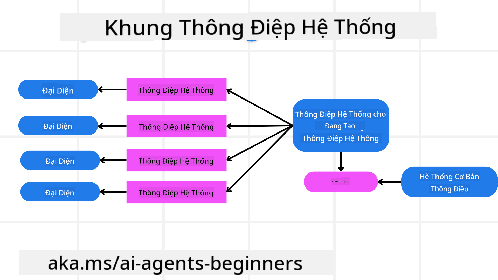
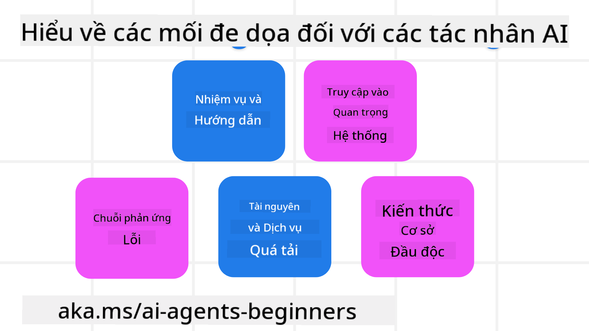
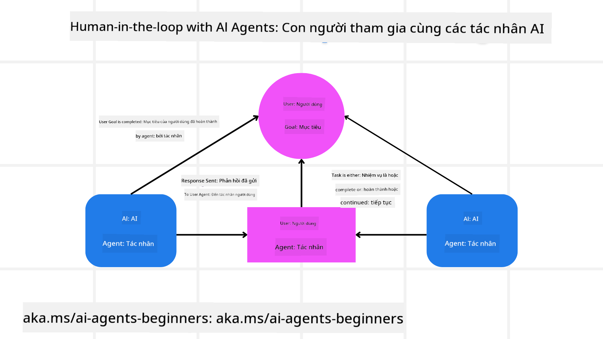

<!--
CO_OP_TRANSLATOR_METADATA:
{
  "original_hash": "f57852cac3a86c4a5ef47f793cc12178",
  "translation_date": "2025-07-12T10:29:44+00:00",
  "source_file": "06-building-trustworthy-agents/README.md",
  "language_code": "vi"
}
-->
[](https://youtu.be/iZKkMEGBCUQ?si=Q-kEbcyHUMPoHp8L)

> _(Nhấp vào hình ảnh trên để xem video bài học này)_

# Xây dựng các AI Agents đáng tin cậy

## Giới thiệu

Bài học này sẽ bao gồm:

- Cách xây dựng và triển khai các AI Agents an toàn và hiệu quả
- Những lưu ý quan trọng về bảo mật khi phát triển AI Agents
- Cách duy trì quyền riêng tư dữ liệu và người dùng khi phát triển AI Agents

## Mục tiêu học tập

Sau khi hoàn thành bài học này, bạn sẽ biết cách:

- Nhận diện và giảm thiểu rủi ro khi tạo AI Agents
- Thực hiện các biện pháp bảo mật để đảm bảo dữ liệu và quyền truy cập được quản lý đúng cách
- Tạo AI Agents giữ được quyền riêng tư dữ liệu và mang lại trải nghiệm người dùng chất lượng

## An toàn

Trước tiên, hãy cùng xem cách xây dựng các ứng dụng agentic an toàn. An toàn có nghĩa là AI agent hoạt động đúng như thiết kế. Là người xây dựng các ứng dụng agentic, chúng ta có các phương pháp và công cụ để tối đa hóa sự an toàn:

### Xây dựng khung hệ thống tin nhắn

Nếu bạn từng xây dựng ứng dụng AI sử dụng Large Language Models (LLMs), bạn sẽ hiểu tầm quan trọng của việc thiết kế một hệ thống prompt hoặc tin nhắn hệ thống vững chắc. Những prompt này thiết lập các quy tắc meta, hướng dẫn và chỉ dẫn về cách LLM tương tác với người dùng và dữ liệu.

Đối với AI Agents, prompt hệ thống còn quan trọng hơn vì AI Agents cần các chỉ dẫn rất cụ thể để hoàn thành các nhiệm vụ mà chúng ta thiết kế.

Để tạo các prompt hệ thống có thể mở rộng, chúng ta có thể sử dụng một khung hệ thống tin nhắn để xây dựng một hoặc nhiều agent trong ứng dụng của mình:



#### Bước 1: Tạo Meta System Message

Meta prompt sẽ được LLM sử dụng để tạo các prompt hệ thống cho các agent mà chúng ta tạo ra. Chúng ta thiết kế nó như một mẫu để có thể tạo nhiều agent một cách hiệu quả khi cần.

Dưới đây là ví dụ về một meta system message mà chúng ta sẽ cung cấp cho LLM:

```plaintext
You are an expert at creating AI agent assistants. 
You will be provided a company name, role, responsibilities and other
information that you will use to provide a system prompt for.
To create the system prompt, be descriptive as possible and provide a structure that a system using an LLM can better understand the role and responsibilities of the AI assistant. 
```

#### Bước 2: Tạo prompt cơ bản

Bước tiếp theo là tạo một prompt cơ bản để mô tả AI Agent. Bạn nên bao gồm vai trò của agent, các nhiệm vụ agent sẽ thực hiện, và bất kỳ trách nhiệm nào khác của agent.

Ví dụ như sau:

```plaintext
You are a travel agent for Contoso Travel that is great at booking flights for customers. To help customers you can perform the following tasks: lookup available flights, book flights, ask for preferences in seating and times for flights, cancel any previously booked flights and alert customers on any delays or cancellations of flights.  
```

#### Bước 3: Cung cấp Basic System Message cho LLM

Bây giờ chúng ta có thể tối ưu tin nhắn hệ thống này bằng cách cung cấp meta system message làm tin nhắn hệ thống và tin nhắn hệ thống cơ bản của chúng ta.

Điều này sẽ tạo ra một tin nhắn hệ thống được thiết kế tốt hơn để hướng dẫn các AI agents:

```markdown
**Company Name:** Contoso Travel  
**Role:** Travel Agent Assistant

**Objective:**  
You are an AI-powered travel agent assistant for Contoso Travel, specializing in booking flights and providing exceptional customer service. Your main goal is to assist customers in finding, booking, and managing their flights, all while ensuring that their preferences and needs are met efficiently.

**Key Responsibilities:**

1. **Flight Lookup:**
    
    - Assist customers in searching for available flights based on their specified destination, dates, and any other relevant preferences.
    - Provide a list of options, including flight times, airlines, layovers, and pricing.
2. **Flight Booking:**
    
    - Facilitate the booking of flights for customers, ensuring that all details are correctly entered into the system.
    - Confirm bookings and provide customers with their itinerary, including confirmation numbers and any other pertinent information.
3. **Customer Preference Inquiry:**
    
    - Actively ask customers for their preferences regarding seating (e.g., aisle, window, extra legroom) and preferred times for flights (e.g., morning, afternoon, evening).
    - Record these preferences for future reference and tailor suggestions accordingly.
4. **Flight Cancellation:**
    
    - Assist customers in canceling previously booked flights if needed, following company policies and procedures.
    - Notify customers of any necessary refunds or additional steps that may be required for cancellations.
5. **Flight Monitoring:**
    
    - Monitor the status of booked flights and alert customers in real-time about any delays, cancellations, or changes to their flight schedule.
    - Provide updates through preferred communication channels (e.g., email, SMS) as needed.

**Tone and Style:**

- Maintain a friendly, professional, and approachable demeanor in all interactions with customers.
- Ensure that all communication is clear, informative, and tailored to the customer's specific needs and inquiries.

**User Interaction Instructions:**

- Respond to customer queries promptly and accurately.
- Use a conversational style while ensuring professionalism.
- Prioritize customer satisfaction by being attentive, empathetic, and proactive in all assistance provided.

**Additional Notes:**

- Stay updated on any changes to airline policies, travel restrictions, and other relevant information that could impact flight bookings and customer experience.
- Use clear and concise language to explain options and processes, avoiding jargon where possible for better customer understanding.

This AI assistant is designed to streamline the flight booking process for customers of Contoso Travel, ensuring that all their travel needs are met efficiently and effectively.

```

#### Bước 4: Lặp lại và cải tiến

Giá trị của khung hệ thống tin nhắn này là giúp việc tạo tin nhắn hệ thống cho nhiều agent trở nên dễ dàng hơn cũng như cải thiện các tin nhắn hệ thống theo thời gian. Rất hiếm khi bạn có một tin nhắn hệ thống hoàn hảo ngay lần đầu cho toàn bộ trường hợp sử dụng. Việc có thể điều chỉnh nhỏ và cải tiến bằng cách thay đổi tin nhắn hệ thống cơ bản và chạy lại qua hệ thống sẽ giúp bạn so sánh và đánh giá kết quả.

## Hiểu về các mối đe dọa

Để xây dựng các AI agents đáng tin cậy, điều quan trọng là phải hiểu và giảm thiểu các rủi ro và mối đe dọa đối với AI agent của bạn. Hãy cùng xem một số mối đe dọa khác nhau đối với AI agents và cách bạn có thể lên kế hoạch và chuẩn bị tốt hơn cho chúng.



### Nhiệm vụ và chỉ dẫn

**Mô tả:** Kẻ tấn công cố gắng thay đổi chỉ dẫn hoặc mục tiêu của AI agent thông qua việc prompt hoặc thao túng đầu vào.

**Giải pháp:** Thực hiện kiểm tra xác thực và bộ lọc đầu vào để phát hiện các prompt có thể gây nguy hiểm trước khi chúng được AI Agent xử lý. Vì các cuộc tấn công này thường yêu cầu tương tác liên tục với Agent, giới hạn số lượt trò chuyện cũng là một cách để ngăn chặn các loại tấn công này.

### Truy cập hệ thống quan trọng

**Mô tả:** Nếu AI agent có quyền truy cập vào các hệ thống và dịch vụ lưu trữ dữ liệu nhạy cảm, kẻ tấn công có thể xâm phạm giao tiếp giữa agent và các dịch vụ này. Đây có thể là các cuộc tấn công trực tiếp hoặc cố gắng gián tiếp để lấy thông tin về các hệ thống thông qua agent.

**Giải pháp:** AI agents chỉ nên được cấp quyền truy cập hệ thống khi thực sự cần thiết để ngăn chặn các loại tấn công này. Giao tiếp giữa agent và hệ thống cũng cần được bảo mật. Thực hiện xác thực và kiểm soát truy cập là cách khác để bảo vệ thông tin này.

### Quá tải tài nguyên và dịch vụ

**Mô tả:** AI agents có thể truy cập các công cụ và dịch vụ khác nhau để hoàn thành nhiệm vụ. Kẻ tấn công có thể lợi dụng khả năng này để tấn công các dịch vụ bằng cách gửi lượng lớn yêu cầu qua AI Agent, dẫn đến sự cố hệ thống hoặc chi phí cao.

**Giải pháp:** Áp dụng chính sách giới hạn số lượng yêu cầu mà AI agent có thể gửi đến một dịch vụ. Giới hạn số lượt trò chuyện và yêu cầu gửi đến AI agent cũng là cách để ngăn chặn các loại tấn công này.

### Đầu độc cơ sở tri thức

**Mô tả:** Loại tấn công này không nhắm trực tiếp vào AI agent mà nhắm vào cơ sở tri thức và các dịch vụ mà AI agent sử dụng. Điều này có thể bao gồm việc làm hỏng dữ liệu hoặc thông tin mà AI agent dùng để hoàn thành nhiệm vụ, dẫn đến phản hồi sai lệch hoặc không mong muốn với người dùng.

**Giải pháp:** Thường xuyên kiểm tra dữ liệu mà AI agent sử dụng trong quy trình làm việc. Đảm bảo quyền truy cập dữ liệu được bảo mật và chỉ được thay đổi bởi những người đáng tin cậy để tránh loại tấn công này.

### Lỗi lan truyền

**Mô tả:** AI agents truy cập nhiều công cụ và dịch vụ để hoàn thành nhiệm vụ. Các lỗi do kẻ tấn công gây ra có thể dẫn đến sự cố ở các hệ thống khác mà AI agent kết nối, khiến cuộc tấn công lan rộng và khó khắc phục hơn.

**Giải pháp:** Một cách để tránh điều này là cho AI Agent hoạt động trong môi trường giới hạn, ví dụ như thực hiện nhiệm vụ trong Docker container, nhằm ngăn chặn các cuộc tấn công trực tiếp vào hệ thống. Tạo các cơ chế dự phòng và logic thử lại khi một số hệ thống phản hồi lỗi cũng là cách để ngăn ngừa sự cố hệ thống lớn hơn.

## Human-in-the-Loop

Một cách hiệu quả khác để xây dựng hệ thống AI Agent đáng tin cậy là sử dụng Human-in-the-loop. Điều này tạo ra một luồng mà người dùng có thể cung cấp phản hồi cho các Agents trong quá trình chạy. Người dùng về cơ bản đóng vai trò như các agent trong hệ thống đa agent và có thể phê duyệt hoặc dừng quá trình đang chạy.



Dưới đây là đoạn mã sử dụng AutoGen để minh họa cách triển khai khái niệm này:

```python

# Create the agents.
model_client = OpenAIChatCompletionClient(model="gpt-4o-mini")
assistant = AssistantAgent("assistant", model_client=model_client)
user_proxy = UserProxyAgent("user_proxy", input_func=input)  # Use input() to get user input from console.

# Create the termination condition which will end the conversation when the user says "APPROVE".
termination = TextMentionTermination("APPROVE")

# Create the team.
team = RoundRobinGroupChat([assistant, user_proxy], termination_condition=termination)

# Run the conversation and stream to the console.
stream = team.run_stream(task="Write a 4-line poem about the ocean.")
# Use asyncio.run(...) when running in a script.
await Console(stream)

```

## Kết luận

Xây dựng các AI agents đáng tin cậy đòi hỏi thiết kế cẩn thận, các biện pháp bảo mật vững chắc và sự lặp lại liên tục. Bằng cách triển khai các hệ thống meta prompting có cấu trúc, hiểu rõ các mối đe dọa tiềm ẩn và áp dụng các chiến lược giảm thiểu, các nhà phát triển có thể tạo ra AI agents vừa an toàn vừa hiệu quả. Thêm vào đó, việc kết hợp phương pháp human-in-the-loop giúp đảm bảo AI agents luôn phù hợp với nhu cầu người dùng đồng thời giảm thiểu rủi ro. Khi AI tiếp tục phát triển, duy trì thái độ chủ động về bảo mật, quyền riêng tư và các cân nhắc đạo đức sẽ là chìa khóa để xây dựng niềm tin và độ tin cậy trong các hệ thống AI.

## Tài nguyên bổ sung

- <a href="https://learn.microsoft.com/azure/ai-studio/responsible-use-of-ai-overview" target="_blank">Tổng quan về Responsible AI</a>
- <a href="https://learn.microsoft.com/azure/ai-studio/concepts/evaluation-approach-gen-ai" target="_blank">Đánh giá các mô hình AI tạo sinh và ứng dụng AI</a>
- <a href="https://learn.microsoft.com/azure/ai-services/openai/concepts/system-message?context=%2Fazure%2Fai-studio%2Fcontext%2Fcontext&tabs=top-techniques" target="_blank">Tin nhắn hệ thống an toàn</a>
- <a href="https://blogs.microsoft.com/wp-content/uploads/prod/sites/5/2022/06/Microsoft-RAI-Impact-Assessment-Template.pdf?culture=en-us&country=us" target="_blank">Mẫu đánh giá rủi ro</a>

## Bài học trước

[Agentic RAG](../05-agentic-rag/README.md)

## Bài học tiếp theo

[Planning Design Pattern](../07-planning-design/README.md)

**Tuyên bố từ chối trách nhiệm**:  
Tài liệu này đã được dịch bằng dịch vụ dịch thuật AI [Co-op Translator](https://github.com/Azure/co-op-translator). Mặc dù chúng tôi cố gắng đảm bảo độ chính xác, xin lưu ý rằng các bản dịch tự động có thể chứa lỗi hoặc không chính xác. Tài liệu gốc bằng ngôn ngữ gốc của nó nên được coi là nguồn chính xác và đáng tin cậy. Đối với các thông tin quan trọng, nên sử dụng dịch vụ dịch thuật chuyên nghiệp do con người thực hiện. Chúng tôi không chịu trách nhiệm về bất kỳ sự hiểu lầm hoặc giải thích sai nào phát sinh từ việc sử dụng bản dịch này.