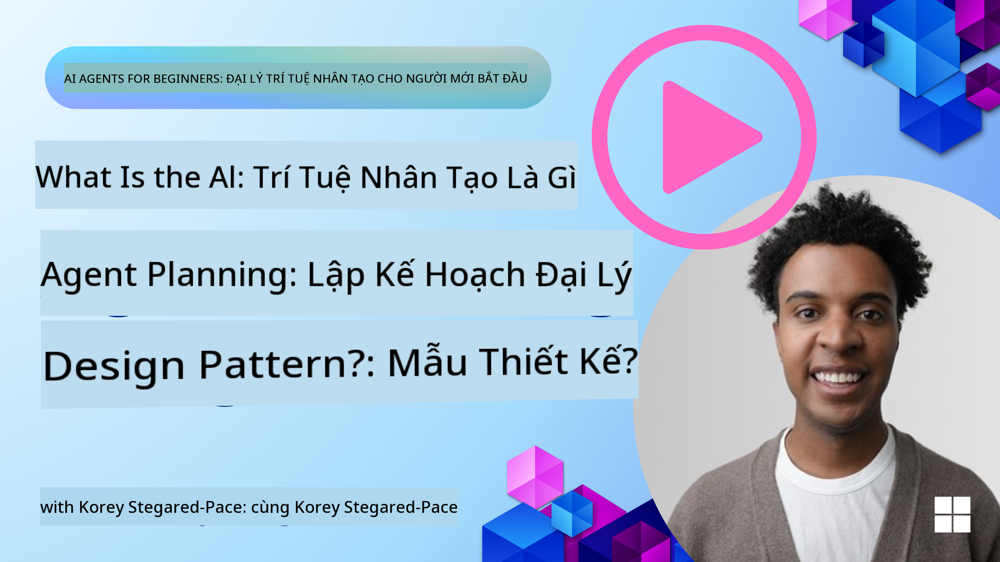
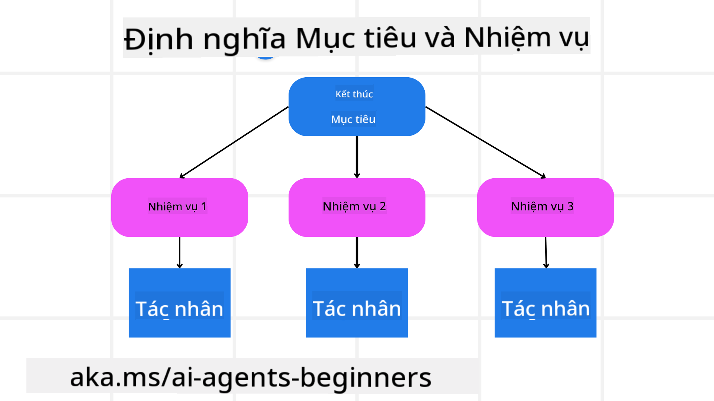

<!--
CO_OP_TRANSLATOR_METADATA:
{
  "original_hash": "a28d30590704ea13b6a08d4793cf9c2b",
  "translation_date": "2025-08-29T17:57:31+00:00",
  "source_file": "07-planning-design/README.md",
  "language_code": "vi"
}
-->
[](https://youtu.be/kPfJ2BrBCMY?si=9pYpPXp0sSbK91Dr)

> _(Nhấp vào hình ảnh trên để xem video của bài học này)_

# Lập Kế Hoạch Thiết Kế

## Giới Thiệu

Bài học này sẽ đề cập đến:

* Xác định mục tiêu tổng thể rõ ràng và chia một nhiệm vụ phức tạp thành các nhiệm vụ dễ quản lý hơn.
* Tận dụng đầu ra có cấu trúc để có các phản hồi đáng tin cậy và dễ đọc bởi máy móc hơn.
* Áp dụng cách tiếp cận dựa trên sự kiện để xử lý các nhiệm vụ động và đầu vào không mong đợi.

## Mục Tiêu Học Tập

Sau khi hoàn thành bài học này, bạn sẽ hiểu về:

* Xác định và đặt mục tiêu tổng thể cho một tác nhân AI, đảm bảo nó biết rõ cần đạt được điều gì.
* Phân chia một nhiệm vụ phức tạp thành các nhiệm vụ nhỏ hơn và sắp xếp chúng theo trình tự logic.
* Trang bị cho các tác nhân các công cụ phù hợp (ví dụ: công cụ tìm kiếm hoặc công cụ phân tích dữ liệu), quyết định khi nào và cách sử dụng chúng, và xử lý các tình huống không mong đợi phát sinh.
* Đánh giá kết quả của các nhiệm vụ nhỏ, đo lường hiệu suất, và lặp lại các hành động để cải thiện đầu ra cuối cùng.

## Xác Định Mục Tiêu Tổng Thể và Phân Chia Nhiệm Vụ



Hầu hết các nhiệm vụ trong thực tế đều quá phức tạp để giải quyết trong một bước duy nhất. Một tác nhân AI cần một mục tiêu ngắn gọn để hướng dẫn việc lập kế hoạch và hành động của nó. Ví dụ, hãy xem xét mục tiêu:

    "Tạo lịch trình du lịch 3 ngày."

Mặc dù mục tiêu này đơn giản để nêu ra, nhưng vẫn cần được tinh chỉnh. Mục tiêu càng rõ ràng, tác nhân (và bất kỳ cộng tác viên con người nào) càng có thể tập trung vào việc đạt được kết quả đúng, chẳng hạn như tạo một lịch trình toàn diện với các tùy chọn chuyến bay, gợi ý khách sạn, và các hoạt động.

### Phân Chia Nhiệm Vụ

Các nhiệm vụ lớn hoặc phức tạp trở nên dễ quản lý hơn khi được chia thành các nhiệm vụ nhỏ hơn, tập trung vào mục tiêu.
Đối với ví dụ về lịch trình du lịch, bạn có thể phân chia mục tiêu thành:

* Đặt vé máy bay
* Đặt khách sạn
* Thuê xe
* Cá nhân hóa

Mỗi nhiệm vụ nhỏ sau đó có thể được xử lý bởi các tác nhân hoặc quy trình chuyên biệt. Một tác nhân có thể chuyên tìm kiếm các ưu đãi vé máy bay tốt nhất, một tác nhân khác tập trung vào việc đặt khách sạn, v.v. Một tác nhân điều phối hoặc “xuôi dòng” sau đó có thể tổng hợp các kết quả này thành một lịch trình thống nhất cho người dùng cuối.

Cách tiếp cận theo mô-đun này cũng cho phép cải tiến từng bước. Ví dụ, bạn có thể thêm các tác nhân chuyên biệt cho Gợi Ý Đồ Ăn hoặc Gợi Ý Hoạt Động Địa Phương và tinh chỉnh lịch trình theo thời gian.

### Đầu Ra Có Cấu Trúc

Các Mô Hình Ngôn Ngữ Lớn (LLMs) có thể tạo ra đầu ra có cấu trúc (ví dụ: JSON) dễ dàng hơn cho các tác nhân hoặc dịch vụ xuôi dòng để phân tích và xử lý. Điều này đặc biệt hữu ích trong bối cảnh đa tác nhân, nơi chúng ta có thể thực hiện các nhiệm vụ này sau khi nhận được đầu ra từ việc lập kế hoạch. Xem tiếp để có cái nhìn tổng quan nhanh.

Đoạn mã Python sau đây minh họa một tác nhân lập kế hoạch đơn giản phân chia mục tiêu thành các nhiệm vụ nhỏ và tạo ra một kế hoạch có cấu trúc:

```python
from pydantic import BaseModel
from enum import Enum
from typing import List, Optional, Union
import json
import os
from typing import Optional
from pprint import pprint
from autogen_core.models import UserMessage, SystemMessage, AssistantMessage
from autogen_ext.models.azure import AzureAIChatCompletionClient
from azure.core.credentials import AzureKeyCredential

class AgentEnum(str, Enum):
    FlightBooking = "flight_booking"
    HotelBooking = "hotel_booking"
    CarRental = "car_rental"
    ActivitiesBooking = "activities_booking"
    DestinationInfo = "destination_info"
    DefaultAgent = "default_agent"
    GroupChatManager = "group_chat_manager"

# Travel SubTask Model
class TravelSubTask(BaseModel):
    task_details: str
    assigned_agent: AgentEnum  # we want to assign the task to the agent

class TravelPlan(BaseModel):
    main_task: str
    subtasks: List[TravelSubTask]
    is_greeting: bool

client = AzureAIChatCompletionClient(
    model="gpt-4o-mini",
    endpoint="https://models.inference.ai.azure.com",
    # To authenticate with the model you will need to generate a personal access token (PAT) in your GitHub settings.
    # Create your PAT token by following instructions here: https://docs.github.com/en/authentication/keeping-your-account-and-data-secure/managing-your-personal-access-tokens
    credential=AzureKeyCredential(os.environ["GITHUB_TOKEN"]),
    model_info={
        "json_output": False,
        "function_calling": True,
        "vision": True,
        "family": "unknown",
    },
)

# Define the user message
messages = [
    SystemMessage(content="""You are an planner agent.
    Your job is to decide which agents to run based on the user's request.
                      Provide your response in JSON format with the following structure:
{'main_task': 'Plan a family trip from Singapore to Melbourne.',
 'subtasks': [{'assigned_agent': 'flight_booking',
               'task_details': 'Book round-trip flights from Singapore to '
                               'Melbourne.'}
    Below are the available agents specialised in different tasks:
    - FlightBooking: For booking flights and providing flight information
    - HotelBooking: For booking hotels and providing hotel information
    - CarRental: For booking cars and providing car rental information
    - ActivitiesBooking: For booking activities and providing activity information
    - DestinationInfo: For providing information about destinations
    - DefaultAgent: For handling general requests""", source="system"),
    UserMessage(
        content="Create a travel plan for a family of 2 kids from Singapore to Melboune", source="user"),
]

response = await client.create(messages=messages, extra_create_args={"response_format": 'json_object'})

response_content: Optional[str] = response.content if isinstance(
    response.content, str) else None
if response_content is None:
    raise ValueError("Response content is not a valid JSON string" )

pprint(json.loads(response_content))

# # Ensure the response content is a valid JSON string before loading it
# response_content: Optional[str] = response.content if isinstance(
#     response.content, str) else None
# if response_content is None:
#     raise ValueError("Response content is not a valid JSON string")

# # Print the response content after loading it as JSON
# pprint(json.loads(response_content))

# Validate the response content with the MathReasoning model
# TravelPlan.model_validate(json.loads(response_content))
```

### Tác Nhân Lập Kế Hoạch với Điều Phối Đa Tác Nhân

Trong ví dụ này, một Tác Nhân Bộ Định Tuyến Ngữ Nghĩa nhận yêu cầu từ người dùng (ví dụ: "Tôi cần kế hoạch khách sạn cho chuyến đi của mình.").

Tác nhân lập kế hoạch sau đó:

* Nhận Kế Hoạch Khách Sạn: Tác nhân lập kế hoạch nhận thông điệp của người dùng và, dựa trên một hệ thống nhắc nhở (bao gồm chi tiết về các tác nhân có sẵn), tạo ra một kế hoạch du lịch có cấu trúc.
* Liệt Kê Các Tác Nhân và Công Cụ Của Họ: Sổ đăng ký tác nhân giữ danh sách các tác nhân (ví dụ: cho chuyến bay, khách sạn, thuê xe, và hoạt động) cùng với các chức năng hoặc công cụ mà họ cung cấp.
* Định Tuyến Kế Hoạch Đến Các Tác Nhân Tương Ứng: Tùy thuộc vào số lượng nhiệm vụ nhỏ, tác nhân lập kế hoạch hoặc gửi thông điệp trực tiếp đến một tác nhân chuyên biệt (trong các tình huống nhiệm vụ đơn lẻ) hoặc điều phối thông qua một trình quản lý trò chuyện nhóm cho sự hợp tác đa tác nhân.
* Tóm Tắt Kết Quả: Cuối cùng, tác nhân lập kế hoạch tóm tắt kế hoạch đã tạo để rõ ràng hơn.
Đoạn mã Python sau đây minh họa các bước này:

```python

from pydantic import BaseModel

from enum import Enum
from typing import List, Optional, Union

class AgentEnum(str, Enum):
    FlightBooking = "flight_booking"
    HotelBooking = "hotel_booking"
    CarRental = "car_rental"
    ActivitiesBooking = "activities_booking"
    DestinationInfo = "destination_info"
    DefaultAgent = "default_agent"
    GroupChatManager = "group_chat_manager"

# Travel SubTask Model

class TravelSubTask(BaseModel):
    task_details: str
    assigned_agent: AgentEnum # we want to assign the task to the agent

class TravelPlan(BaseModel):
    main_task: str
    subtasks: List[TravelSubTask]
    is_greeting: bool
import json
import os
from typing import Optional

from autogen_core.models import UserMessage, SystemMessage, AssistantMessage
from autogen_ext.models.openai import AzureOpenAIChatCompletionClient

# Create the client with type-checked environment variables

client = AzureOpenAIChatCompletionClient(
    azure_deployment=os.getenv("AZURE_OPENAI_DEPLOYMENT_NAME"),
    model=os.getenv("AZURE_OPENAI_DEPLOYMENT_NAME"),
    api_version=os.getenv("AZURE_OPENAI_API_VERSION"),
    azure_endpoint=os.getenv("AZURE_OPENAI_ENDPOINT"),
    api_key=os.getenv("AZURE_OPENAI_API_KEY"),
)

from pprint import pprint

# Define the user message

messages = [
    SystemMessage(content="""You are an planner agent.
    Your job is to decide which agents to run based on the user's request.
    Below are the available agents specialized in different tasks:
    - FlightBooking: For booking flights and providing flight information
    - HotelBooking: For booking hotels and providing hotel information
    - CarRental: For booking cars and providing car rental information
    - ActivitiesBooking: For booking activities and providing activity information
    - DestinationInfo: For providing information about destinations
    - DefaultAgent: For handling general requests""", source="system"),
    UserMessage(content="Create a travel plan for a family of 2 kids from Singapore to Melbourne", source="user"),
]

response = await client.create(messages=messages, extra_create_args={"response_format": TravelPlan})

# Ensure the response content is a valid JSON string before loading it

response_content: Optional[str] = response.content if isinstance(response.content, str) else None
if response_content is None:
    raise ValueError("Response content is not a valid JSON string")

# Print the response content after loading it as JSON

pprint(json.loads(response_content))
```

Kết quả từ đoạn mã trước đó sẽ được sử dụng để định tuyến đến `assigned_agent` và tóm tắt kế hoạch du lịch cho người dùng cuối.

```json
{
    "is_greeting": "False",
    "main_task": "Plan a family trip from Singapore to Melbourne.",
    "subtasks": [
        {
            "assigned_agent": "flight_booking",
            "task_details": "Book round-trip flights from Singapore to Melbourne."
        },
        {
            "assigned_agent": "hotel_booking",
            "task_details": "Find family-friendly hotels in Melbourne."
        },
        {
            "assigned_agent": "car_rental",
            "task_details": "Arrange a car rental suitable for a family of four in Melbourne."
        },
        {
            "assigned_agent": "activities_booking",
            "task_details": "List family-friendly activities in Melbourne."
        },
        {
            "assigned_agent": "destination_info",
            "task_details": "Provide information about Melbourne as a travel destination."
        }
    ]
}
```

Một notebook ví dụ với đoạn mã trên có sẵn [tại đây](07-autogen.ipynb).

### Lập Kế Hoạch Lặp

Một số nhiệm vụ yêu cầu sự trao đổi qua lại hoặc lập kế hoạch lại, nơi kết quả của một nhiệm vụ nhỏ ảnh hưởng đến nhiệm vụ tiếp theo. Ví dụ, nếu tác nhân phát hiện một định dạng dữ liệu không mong đợi khi đặt vé máy bay, nó có thể cần điều chỉnh chiến lược của mình trước khi chuyển sang đặt khách sạn.

Ngoài ra, phản hồi từ người dùng (ví dụ: một người quyết định họ thích chuyến bay sớm hơn) có thể kích hoạt việc lập kế hoạch lại một phần. Cách tiếp cận động, lặp lại này đảm bảo rằng giải pháp cuối cùng phù hợp với các ràng buộc thực tế và sở thích người dùng đang thay đổi.

Ví dụ mã:

```python
from autogen_core.models import UserMessage, SystemMessage, AssistantMessage
#.. same as previous code and pass on the user history, current plan
messages = [
    SystemMessage(content="""You are a planner agent to optimize the
    Your job is to decide which agents to run based on the user's request.
    Below are the available agents specialized in different tasks:
    - FlightBooking: For booking flights and providing flight information
    - HotelBooking: For booking hotels and providing hotel information
    - CarRental: For booking cars and providing car rental information
    - ActivitiesBooking: For booking activities and providing activity information
    - DestinationInfo: For providing information about destinations
    - DefaultAgent: For handling general requests""", source="system"),
    UserMessage(content="Create a travel plan for a family of 2 kids from Singapore to Melbourne", source="user"),
    AssistantMessage(content=f"Previous travel plan - {TravelPlan}", source="assistant")
]
# .. re-plan and send the tasks to respective agents
```

Để lập kế hoạch toàn diện hơn, hãy xem Magnetic One để giải quyết các nhiệm vụ phức tạp.

## Tóm Tắt

Trong bài viết này, chúng ta đã xem xét một ví dụ về cách tạo một tác nhân lập kế hoạch có thể chọn động các tác nhân có sẵn được định nghĩa. Đầu ra của Tác Nhân Lập Kế Hoạch phân chia các nhiệm vụ và gán các tác nhân để chúng có thể được thực hiện. Giả định rằng các tác nhân có quyền truy cập vào các chức năng/công cụ cần thiết để thực hiện nhiệm vụ. Ngoài các tác nhân, bạn có thể bao gồm các mẫu khác như phản ánh, tóm tắt, và trò chuyện vòng tròn để tùy chỉnh thêm.

## Tài Nguyên Bổ Sung

* AutoGen Magnetic One - Một hệ thống đa tác nhân tổng quát để giải quyết các nhiệm vụ phức tạp và đã đạt được kết quả ấn tượng trên nhiều tiêu chuẩn đánh giá tác nhân đầy thách thức. Tham khảo:

. Trong triển khai này, bộ điều phối tạo kế hoạch cụ thể cho từng nhiệm vụ và phân công các nhiệm vụ này cho các tác nhân có sẵn. Ngoài việc lập kế hoạch, bộ điều phối cũng sử dụng một cơ chế theo dõi để giám sát tiến độ của nhiệm vụ và lập kế hoạch lại khi cần thiết.

### Có Thắc Mắc Về Mẫu Thiết Kế Lập Kế Hoạch?

Tham gia [Azure AI Foundry Discord](https://aka.ms/ai-agents/discord) để gặp gỡ các học viên khác, tham dự giờ làm việc và nhận giải đáp cho các câu hỏi về Tác Nhân AI của bạn.

## Bài Học Trước

[Xây Dựng Tác Nhân AI Đáng Tin Cậy](../06-building-trustworthy-agents/README.md)

## Bài Học Tiếp Theo

[Mẫu Thiết Kế Đa Tác Nhân](../08-multi-agent/README.md)

---

**Tuyên bố miễn trừ trách nhiệm**:  
Tài liệu này đã được dịch bằng dịch vụ dịch thuật AI [Co-op Translator](https://github.com/Azure/co-op-translator). Mặc dù chúng tôi cố gắng đảm bảo độ chính xác, xin lưu ý rằng các bản dịch tự động có thể chứa lỗi hoặc không chính xác. Tài liệu gốc bằng ngôn ngữ bản địa nên được coi là nguồn thông tin chính thức. Đối với các thông tin quan trọng, khuyến nghị sử dụng dịch vụ dịch thuật chuyên nghiệp bởi con người. Chúng tôi không chịu trách nhiệm cho bất kỳ sự hiểu lầm hoặc diễn giải sai nào phát sinh từ việc sử dụng bản dịch này.