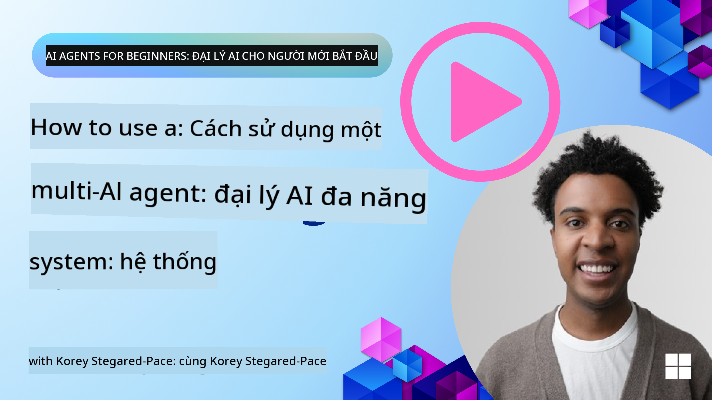
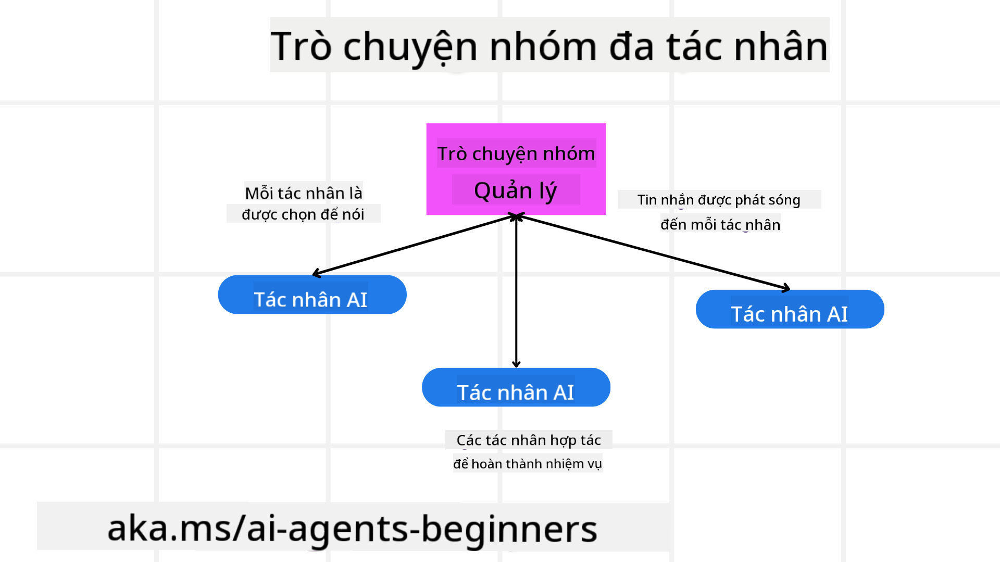
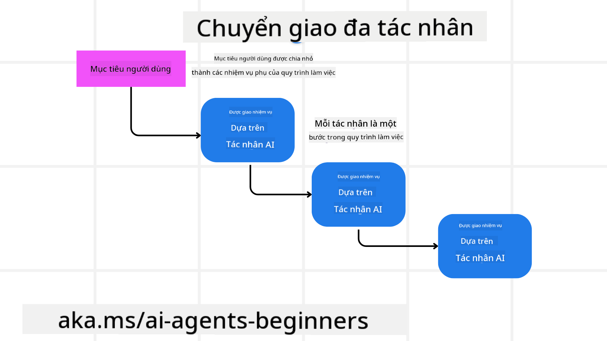
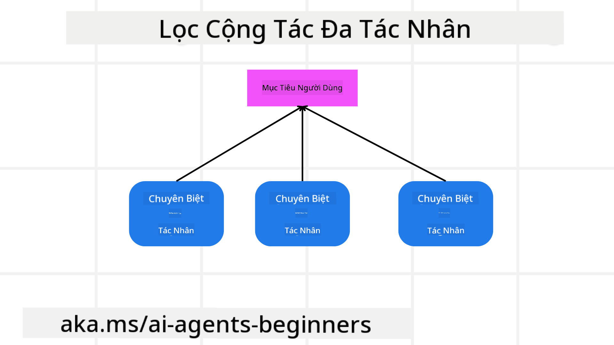

<!--
CO_OP_TRANSLATOR_METADATA:
{
  "original_hash": "c692a8975d7d5b99575a553de1c5e8a7",
  "translation_date": "2025-07-12T11:18:30+00:00",
  "source_file": "08-multi-agent/README.md",
  "language_code": "vi"
}
-->

> _(Nhấp vào hình ảnh trên để xem video bài học này)_

# Các mẫu thiết kế đa tác nhân

Ngay khi bạn bắt đầu làm việc trên một dự án liên quan đến nhiều tác nhân, bạn sẽ cần xem xét mẫu thiết kế đa tác nhân. Tuy nhiên, có thể bạn chưa rõ khi nào nên chuyển sang dùng đa tác nhân và những lợi ích của nó là gì.

## Giới thiệu

Trong bài học này, chúng ta sẽ tìm câu trả lời cho các câu hỏi sau:

- Những tình huống nào phù hợp để áp dụng đa tác nhân?
- Lợi ích của việc sử dụng đa tác nhân so với chỉ một tác nhân đơn thực hiện nhiều nhiệm vụ là gì?
- Các thành phần cơ bản để triển khai mẫu thiết kế đa tác nhân gồm những gì?
- Làm thế nào để chúng ta có thể quan sát được cách các tác nhân tương tác với nhau?

## Mục tiêu học tập

Sau bài học này, bạn sẽ có thể:

- Xác định các tình huống phù hợp để áp dụng đa tác nhân
- Nhận biết lợi ích của việc sử dụng đa tác nhân so với một tác nhân đơn.
- Hiểu được các thành phần cơ bản trong việc triển khai mẫu thiết kế đa tác nhân.

Bức tranh tổng thể là gì?

*Đa tác nhân là một mẫu thiết kế cho phép nhiều tác nhân cùng làm việc để đạt được một mục tiêu chung*.

Mẫu này được sử dụng rộng rãi trong nhiều lĩnh vực, bao gồm robot, hệ thống tự động và điện toán phân tán.

## Các tình huống phù hợp để áp dụng đa tác nhân

Vậy những tình huống nào là ví dụ điển hình cho việc sử dụng đa tác nhân? Câu trả lời là có nhiều trường hợp mà việc sử dụng nhiều tác nhân mang lại lợi ích, đặc biệt trong các trường hợp sau:

- **Khối lượng công việc lớn**: Khối lượng công việc lớn có thể được chia nhỏ thành các nhiệm vụ nhỏ hơn và giao cho các tác nhân khác nhau, cho phép xử lý song song và hoàn thành nhanh hơn. Ví dụ điển hình là xử lý dữ liệu lớn.
- **Nhiệm vụ phức tạp**: Tương tự như khối lượng công việc lớn, các nhiệm vụ phức tạp có thể được chia thành các phần nhỏ hơn và giao cho các tác nhân chuyên môn hóa từng phần. Ví dụ trong xe tự hành, các tác nhân khác nhau quản lý điều hướng, phát hiện chướng ngại vật và giao tiếp với các xe khác.
- **Chuyên môn đa dạng**: Các tác nhân có thể có chuyên môn khác nhau, giúp xử lý các khía cạnh khác nhau của nhiệm vụ hiệu quả hơn so với một tác nhân đơn. Ví dụ trong lĩnh vực y tế, các tác nhân có thể quản lý chẩn đoán, kế hoạch điều trị và theo dõi bệnh nhân.

## Lợi ích của việc sử dụng đa tác nhân so với một tác nhân đơn

Hệ thống một tác nhân có thể hoạt động tốt với các nhiệm vụ đơn giản, nhưng với các nhiệm vụ phức tạp hơn, việc sử dụng nhiều tác nhân mang lại nhiều lợi ích:

- **Chuyên môn hóa**: Mỗi tác nhân có thể chuyên môn hóa cho một nhiệm vụ cụ thể. Thiếu chuyên môn hóa trong một tác nhân đơn nghĩa là tác nhân đó có thể làm mọi việc nhưng dễ bị nhầm lẫn khi gặp nhiệm vụ phức tạp. Ví dụ, nó có thể làm một nhiệm vụ mà nó không phù hợp nhất.
- **Khả năng mở rộng**: Dễ dàng mở rộng hệ thống bằng cách thêm nhiều tác nhân hơn thay vì làm quá tải một tác nhân duy nhất.
- **Khả năng chịu lỗi**: Nếu một tác nhân gặp sự cố, các tác nhân khác vẫn có thể tiếp tục hoạt động, đảm bảo độ tin cậy của hệ thống.

Hãy lấy ví dụ, đặt một chuyến đi cho người dùng. Hệ thống một tác nhân sẽ phải xử lý tất cả các khía cạnh của quá trình đặt chuyến đi, từ tìm chuyến bay đến đặt khách sạn và thuê xe. Để làm được điều này với một tác nhân duy nhất, tác nhân đó cần có công cụ để xử lý tất cả các nhiệm vụ này. Điều này có thể dẫn đến một hệ thống phức tạp và cồng kềnh, khó bảo trì và mở rộng. Trong khi đó, hệ thống đa tác nhân có thể có các tác nhân chuyên môn hóa riêng biệt cho việc tìm chuyến bay, đặt khách sạn và thuê xe. Điều này làm cho hệ thống trở nên mô-đun hơn, dễ bảo trì và có khả năng mở rộng.

So sánh điều này với một đại lý du lịch nhỏ lẻ so với một đại lý du lịch theo mô hình nhượng quyền. Đại lý nhỏ lẻ sẽ có một tác nhân duy nhất xử lý tất cả các khía cạnh của quá trình đặt chuyến đi, trong khi đại lý nhượng quyền sẽ có các tác nhân khác nhau xử lý từng phần riêng biệt của quá trình đặt chuyến đi.

## Các thành phần cơ bản để triển khai mẫu thiết kế đa tác nhân

Trước khi bạn có thể triển khai mẫu thiết kế đa tác nhân, bạn cần hiểu các thành phần cấu thành mẫu này.

Hãy làm điều này cụ thể hơn bằng cách quay lại ví dụ đặt chuyến đi cho người dùng. Trong trường hợp này, các thành phần cơ bản bao gồm:

- **Giao tiếp giữa các tác nhân**: Các tác nhân tìm chuyến bay, đặt khách sạn và thuê xe cần giao tiếp và chia sẻ thông tin về sở thích và giới hạn của người dùng. Bạn cần quyết định các giao thức và phương pháp cho việc giao tiếp này. Cụ thể, tác nhân tìm chuyến bay cần giao tiếp với tác nhân đặt khách sạn để đảm bảo khách sạn được đặt cùng ngày với chuyến bay. Điều này có nghĩa là các tác nhân cần chia sẻ thông tin về ngày đi lại của người dùng, tức là bạn cần quyết định *tác nhân nào chia sẻ thông tin và cách thức chia sẻ*.
- **Cơ chế phối hợp**: Các tác nhân cần phối hợp hành động để đảm bảo các sở thích và giới hạn của người dùng được đáp ứng. Ví dụ, người dùng muốn khách sạn gần sân bay trong khi giới hạn là xe thuê chỉ có tại sân bay. Điều này có nghĩa tác nhân đặt khách sạn cần phối hợp với tác nhân thuê xe để đảm bảo các yêu cầu của người dùng được thỏa mãn. Bạn cần quyết định *cách các tác nhân phối hợp hành động*.
- **Kiến trúc tác nhân**: Các tác nhân cần có cấu trúc nội bộ để đưa ra quyết định và học hỏi từ tương tác với người dùng. Ví dụ, tác nhân tìm chuyến bay cần có cấu trúc để quyết định chuyến bay nào nên đề xuất cho người dùng. Bạn cần quyết định *cách các tác nhân đưa ra quyết định và học hỏi từ tương tác với người dùng*. Ví dụ, tác nhân tìm chuyến bay có thể sử dụng mô hình học máy để đề xuất chuyến bay dựa trên sở thích trước đây của người dùng.
- **Khả năng quan sát tương tác đa tác nhân**: Bạn cần có khả năng quan sát cách các tác nhân tương tác với nhau. Điều này có nghĩa bạn cần có công cụ và kỹ thuật để theo dõi hoạt động và tương tác của các tác nhân. Có thể là các công cụ ghi nhật ký và giám sát, công cụ trực quan hóa và các chỉ số hiệu suất.
- **Mẫu đa tác nhân**: Có nhiều mẫu khác nhau để triển khai hệ thống đa tác nhân, như kiến trúc tập trung, phi tập trung và kiến trúc lai. Bạn cần chọn mẫu phù hợp nhất với trường hợp sử dụng của mình.
- **Con người trong vòng lặp**: Trong hầu hết các trường hợp, sẽ có con người tham gia và bạn cần hướng dẫn các tác nhân khi nào nên yêu cầu sự can thiệp của con người. Ví dụ, người dùng yêu cầu một khách sạn hoặc chuyến bay cụ thể mà các tác nhân chưa đề xuất, hoặc yêu cầu xác nhận trước khi đặt chuyến bay hoặc khách sạn.

## Khả năng quan sát tương tác đa tác nhân

Việc có khả năng quan sát cách các tác nhân tương tác với nhau là rất quan trọng. Khả năng này cần thiết cho việc gỡ lỗi, tối ưu hóa và đảm bảo hiệu quả tổng thể của hệ thống. Để làm được điều này, bạn cần có công cụ và kỹ thuật để theo dõi hoạt động và tương tác của các tác nhân. Có thể là các công cụ ghi nhật ký và giám sát, công cụ trực quan hóa và các chỉ số hiệu suất.

Ví dụ, trong trường hợp đặt chuyến đi cho người dùng, bạn có thể có một bảng điều khiển hiển thị trạng thái của từng tác nhân, sở thích và giới hạn của người dùng, cũng như các tương tác giữa các tác nhân. Bảng điều khiển này có thể hiển thị ngày đi lại của người dùng, các chuyến bay được tác nhân chuyến bay đề xuất, các khách sạn được tác nhân khách sạn đề xuất và các xe thuê được tác nhân thuê xe đề xuất. Điều này giúp bạn có cái nhìn rõ ràng về cách các tác nhân tương tác với nhau và liệu các sở thích, giới hạn của người dùng có được đáp ứng hay không.

Hãy xem xét kỹ hơn từng khía cạnh này.

- **Công cụ ghi nhật ký và giám sát**: Bạn muốn ghi lại nhật ký cho mỗi hành động mà tác nhân thực hiện. Một mục nhật ký có thể lưu thông tin về tác nhân thực hiện hành động, hành động đó là gì, thời gian thực hiện và kết quả của hành động. Thông tin này sau đó có thể dùng để gỡ lỗi, tối ưu hóa và nhiều mục đích khác.
- **Công cụ trực quan hóa**: Công cụ trực quan hóa giúp bạn nhìn thấy các tương tác giữa các tác nhân một cách trực quan hơn. Ví dụ, bạn có thể có một biểu đồ thể hiện luồng thông tin giữa các tác nhân. Điều này giúp bạn nhận diện các điểm nghẽn, sự kém hiệu quả và các vấn đề khác trong hệ thống.
- **Chỉ số hiệu suất**: Các chỉ số hiệu suất giúp bạn theo dõi hiệu quả của hệ thống đa tác nhân. Ví dụ, bạn có thể theo dõi thời gian hoàn thành một nhiệm vụ, số lượng nhiệm vụ hoàn thành trên một đơn vị thời gian, và độ chính xác của các đề xuất do các tác nhân đưa ra. Thông tin này giúp bạn xác định các điểm cần cải thiện và tối ưu hóa hệ thống.

## Các mẫu đa tác nhân

Hãy cùng tìm hiểu một số mẫu cụ thể có thể dùng để tạo ứng dụng đa tác nhân. Dưới đây là một số mẫu thú vị đáng xem xét:

### Trò chuyện nhóm

Mẫu này hữu ích khi bạn muốn tạo ứng dụng trò chuyện nhóm, nơi nhiều tác nhân có thể giao tiếp với nhau. Các trường hợp sử dụng điển hình bao gồm hợp tác nhóm, hỗ trợ khách hàng và mạng xã hội.

Trong mẫu này, mỗi tác nhân đại diện cho một người dùng trong nhóm trò chuyện, và các tin nhắn được trao đổi giữa các tác nhân qua một giao thức nhắn tin. Các tác nhân có thể gửi tin nhắn đến nhóm, nhận tin nhắn từ nhóm và phản hồi tin nhắn từ các tác nhân khác.

Mẫu này có thể được triển khai bằng kiến trúc tập trung, nơi tất cả tin nhắn được chuyển qua một máy chủ trung tâm, hoặc kiến trúc phi tập trung, nơi tin nhắn được trao đổi trực tiếp.

### Chuyển giao nhiệm vụ

Mẫu này hữu ích khi bạn muốn tạo ứng dụng mà nhiều tác nhân có thể chuyển giao nhiệm vụ cho nhau.

Các trường hợp sử dụng điển hình bao gồm hỗ trợ khách hàng, quản lý nhiệm vụ và tự động hóa quy trình làm việc.

Trong mẫu này, mỗi tác nhân đại diện cho một nhiệm vụ hoặc một bước trong quy trình làm việc, và các tác nhân có thể chuyển giao nhiệm vụ cho nhau dựa trên các quy tắc đã định trước.

### Lọc cộng tác

Mẫu này hữu ích khi bạn muốn tạo ứng dụng mà nhiều tác nhân có thể hợp tác để đưa ra đề xuất cho người dùng.

Lý do bạn muốn nhiều tác nhân hợp tác là vì mỗi tác nhân có thể có chuyên môn khác nhau và đóng góp vào quá trình đề xuất theo nhiều cách khác nhau.

Hãy lấy ví dụ một người dùng muốn được đề xuất cổ phiếu tốt nhất để mua trên thị trường chứng khoán.

- **Chuyên gia ngành**: Một tác nhân có thể là chuyên gia trong một ngành cụ thể.
- **Phân tích kỹ thuật**: Một tác nhân khác có thể là chuyên gia phân tích kỹ thuật.
- **Phân tích cơ bản**: Một tác nhân khác nữa có thể là chuyên gia phân tích cơ bản. Bằng cách hợp tác, các tác nhân này có thể cung cấp đề xuất toàn diện hơn cho người dùng.

## Tình huống: Quy trình hoàn tiền

Hãy xem xét tình huống một khách hàng muốn được hoàn tiền cho một sản phẩm, có thể có khá nhiều tác nhân tham gia vào quy trình này, nhưng chúng ta sẽ chia thành các tác nhân chuyên biệt cho quy trình hoàn tiền và các tác nhân chung có thể dùng cho các quy trình khác.

**Các tác nhân chuyên biệt cho quy trình hoàn tiền**:

Dưới đây là một số tác nhân có thể tham gia vào quy trình hoàn tiền:

- **Tác nhân khách hàng**: Đại diện cho khách hàng và chịu trách nhiệm khởi tạo quy trình hoàn tiền.
- **Tác nhân người bán**: Đại diện cho người bán và chịu trách nhiệm xử lý việc hoàn tiền.
- **Tác nhân thanh toán**: Đại diện cho quy trình thanh toán và chịu trách nhiệm hoàn tiền cho khách hàng.
- **Tác nhân giải quyết**: Đại diện cho quy trình giải quyết và chịu trách nhiệm xử lý các vấn đề phát sinh trong quá trình hoàn tiền.
- **Tác nhân tuân thủ**: Đại diện cho quy trình tuân thủ và chịu trách nhiệm đảm bảo quy trình hoàn tiền tuân thủ các quy định và chính sách.

**Các tác nhân chung**:

Những tác nhân này có thể được sử dụng trong các phần khác của doanh nghiệp bạn.

- **Tác nhân vận chuyển**: Đại diện cho quy trình vận chuyển và chịu trách nhiệm gửi sản phẩm trả lại cho người bán. Tác nhân này có thể dùng cho cả quy trình hoàn tiền và vận chuyển sản phẩm thông thường khi mua hàng.
- **Tác nhân phản hồi**: Đại diện cho quy trình thu thập phản hồi từ khách hàng. Phản hồi có thể được thu thập bất cứ lúc nào, không chỉ trong quy trình hoàn tiền.
- **Tác nhân nâng cao**: Đại diện cho quy trình nâng cao và chịu trách nhiệm chuyển các vấn đề lên cấp hỗ trợ cao hơn. Bạn có thể dùng loại tác nhân này cho bất kỳ quy trình nào cần nâng cao vấn đề.
- **Tác nhân thông báo**: Đại diện cho quy trình gửi thông báo và chịu trách nhiệm gửi thông báo cho khách hàng ở các giai đoạn khác nhau của quy trình hoàn tiền.
- **Tác nhân phân tích**: Đại diện cho quy trình phân tích dữ liệu liên quan đến quy trình hoàn tiền.
- **Tác nhân kiểm toán**: Đại diện cho quy trình kiểm toán và chịu trách nhiệm kiểm tra quy trình hoàn tiền để đảm bảo nó được thực hiện đúng.
- **Tác nhân báo cáo**: Đại diện cho quy trình báo cáo và chịu trách nhiệm tạo báo cáo về quy trình hoàn tiền.
- **Tác nhân kiến thức**: Đại diện cho quy trình quản lý kiến thức và chịu trách nhiệm duy trì cơ sở tri thức liên quan đến quy trình hoàn tiền. Tác nhân này có thể có kiến thức về cả hoàn tiền và các phần khác của doanh nghiệp bạn.
- **Tác nhân bảo mật**: Đại diện cho quy trình bảo mật và chịu trách nhiệm đảm bảo an toàn cho quy trình hoàn tiền.
- **Tác nhân chất lượng**: Đại diện cho quy trình đảm bảo chất lượng và chịu trách nhiệm đảm bảo chất lượng của quy trình hoàn tiền.

Có khá nhiều tác nhân được liệt kê ở trên, cả cho quy trình hoàn tiền chuyên biệt lẫn các tác nhân chung có thể dùng trong các phần khác của doanh nghiệp bạn. Hy vọng điều này giúp bạn hình dung cách quyết định sử dụng những tác nhân nào trong hệ thống đa tác nhân của mình.

## Bài tập
## Bài học trước

[Thiết kế kế hoạch](../07-planning-design/README.md)

## Bài học tiếp theo

[Siêu nhận thức trong các tác nhân AI](../09-metacognition/README.md)

**Tuyên bố từ chối trách nhiệm**:  
Tài liệu này đã được dịch bằng dịch vụ dịch thuật AI [Co-op Translator](https://github.com/Azure/co-op-translator). Mặc dù chúng tôi cố gắng đảm bảo độ chính xác, xin lưu ý rằng bản dịch tự động có thể chứa lỗi hoặc không chính xác. Tài liệu gốc bằng ngôn ngữ gốc của nó nên được coi là nguồn chính xác và đáng tin cậy. Đối với các thông tin quan trọng, nên sử dụng dịch vụ dịch thuật chuyên nghiệp do con người thực hiện. Chúng tôi không chịu trách nhiệm về bất kỳ sự hiểu lầm hoặc giải thích sai nào phát sinh từ việc sử dụng bản dịch này.