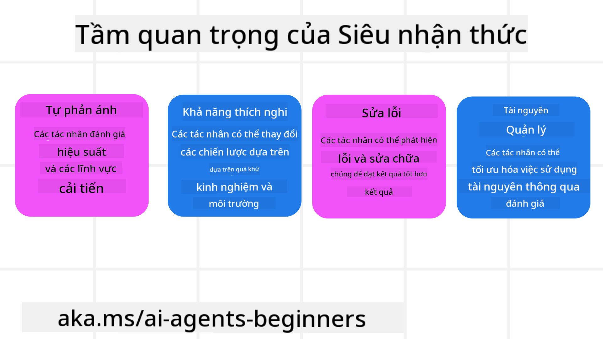
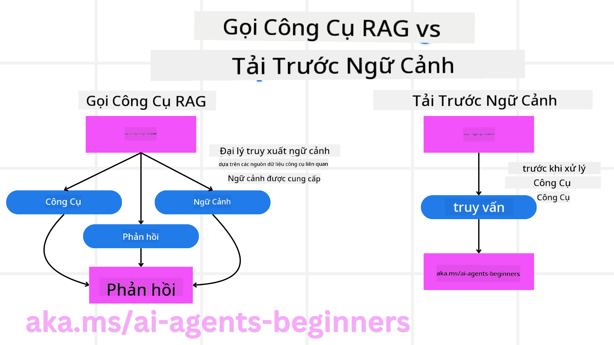

<!--
CO_OP_TRANSLATOR_METADATA:
{
  "original_hash": "8cbf460468c802c7994aa62e0e0779c9",
  "translation_date": "2025-07-12T12:57:18+00:00",
  "source_file": "09-metacognition/README.md",
  "language_code": "vi"
}
-->
[](https://youtu.be/His9R6gw6Ec?si=3_RMb8VprNvdLRhX)

> _(Nhấp vào hình ảnh trên để xem video bài học này)_
# Siêu nhận thức trong các tác nhân AI

## Giới thiệu

Chào mừng bạn đến với bài học về siêu nhận thức trong các tác nhân AI! Chương này được thiết kế dành cho người mới bắt đầu, những người tò mò về cách các tác nhân AI có thể suy nghĩ về chính quá trình suy nghĩ của mình. Sau khi hoàn thành bài học này, bạn sẽ hiểu các khái niệm chính và có thể áp dụng các ví dụ thực tiễn để thiết kế tác nhân AI với siêu nhận thức.

## Mục tiêu học tập

Sau khi hoàn thành bài học này, bạn sẽ có khả năng:

1. Hiểu được tác động của các vòng lặp suy luận trong định nghĩa tác nhân.
2. Sử dụng các kỹ thuật lập kế hoạch và đánh giá để hỗ trợ các tác nhân tự điều chỉnh.
3. Tạo ra các tác nhân của riêng bạn có khả năng thao tác mã để hoàn thành nhiệm vụ.

## Giới thiệu về Siêu nhận thức

Siêu nhận thức đề cập đến các quá trình nhận thức bậc cao liên quan đến việc suy nghĩ về chính quá trình suy nghĩ của bản thân. Đối với các tác nhân AI, điều này có nghĩa là có khả năng đánh giá và điều chỉnh hành động dựa trên sự tự nhận thức và kinh nghiệm trong quá khứ. Siêu nhận thức, hay "suy nghĩ về suy nghĩ," là một khái niệm quan trọng trong phát triển các hệ thống AI có tính tác nhân. Nó bao gồm việc các hệ thống AI nhận thức được các quá trình nội tại của chính mình và có thể giám sát, điều chỉnh, và thích nghi hành vi tương ứng. Giống như khi chúng ta quan sát không khí xung quanh hay nhìn nhận một vấn đề. Sự tự nhận thức này giúp các hệ thống AI đưa ra quyết định tốt hơn, phát hiện lỗi và cải thiện hiệu suất theo thời gian — một lần nữa liên quan đến bài kiểm tra Turing và cuộc tranh luận về việc AI có thể chiếm lĩnh thế giới hay không.

Trong bối cảnh các hệ thống AI có tính tác nhân, siêu nhận thức có thể giúp giải quyết một số thách thức như:
- Minh bạch: Đảm bảo các hệ thống AI có thể giải thích được lý luận và quyết định của mình.
- Suy luận: Nâng cao khả năng tổng hợp thông tin và đưa ra quyết định hợp lý của hệ thống AI.
- Thích nghi: Cho phép hệ thống AI điều chỉnh theo môi trường mới và điều kiện thay đổi.
- Nhận thức: Cải thiện độ chính xác trong việc nhận dạng và giải thích dữ liệu từ môi trường.

### Siêu nhận thức là gì?

Siêu nhận thức, hay "suy nghĩ về suy nghĩ," là một quá trình nhận thức bậc cao bao gồm sự tự nhận thức và tự điều chỉnh các quá trình nhận thức của bản thân. Trong lĩnh vực AI, siêu nhận thức giúp các tác nhân đánh giá và điều chỉnh chiến lược cũng như hành động của mình, từ đó nâng cao khả năng giải quyết vấn đề và ra quyết định. Bằng cách hiểu siêu nhận thức, bạn có thể thiết kế các tác nhân AI không chỉ thông minh hơn mà còn linh hoạt và hiệu quả hơn. Trong siêu nhận thức thực sự, bạn sẽ thấy AI suy luận rõ ràng về chính quá trình suy luận của nó.

Ví dụ: “Tôi ưu tiên các chuyến bay giá rẻ vì… có thể tôi đang bỏ lỡ các chuyến bay thẳng, vậy để tôi kiểm tra lại.”  
Theo dõi cách hoặc lý do nó chọn một tuyến đường nhất định.  
- Ghi nhận rằng nó đã mắc lỗi vì quá phụ thuộc vào sở thích người dùng lần trước, nên nó điều chỉnh chiến lược ra quyết định chứ không chỉ thay đổi đề xuất cuối cùng.  
- Chẩn đoán các mẫu như, “Mỗi khi tôi thấy người dùng nhắc đến ‘quá đông,’ tôi không chỉ loại bỏ một số điểm tham quan mà còn nhận ra phương pháp chọn ‘điểm tham quan hàng đầu’ của tôi có vấn đề nếu tôi luôn xếp hạng theo độ phổ biến.”

### Tầm quan trọng của Siêu nhận thức trong các tác nhân AI

Siêu nhận thức đóng vai trò then chốt trong thiết kế tác nhân AI vì nhiều lý do:



- Tự phản ánh: Tác nhân có thể đánh giá hiệu suất của chính mình và xác định các điểm cần cải thiện.
- Khả năng thích nghi: Tác nhân có thể điều chỉnh chiến lược dựa trên kinh nghiệm trước đây và môi trường thay đổi.
- Sửa lỗi: Tác nhân có thể phát hiện và sửa lỗi một cách tự động, dẫn đến kết quả chính xác hơn.
- Quản lý tài nguyên: Tác nhân có thể tối ưu hóa việc sử dụng tài nguyên như thời gian và sức mạnh tính toán bằng cách lập kế hoạch và đánh giá hành động.

## Các thành phần của một tác nhân AI

Trước khi đi sâu vào các quá trình siêu nhận thức, cần hiểu các thành phần cơ bản của một tác nhân AI. Một tác nhân AI thường bao gồm:

- Persona: Tính cách và đặc điểm của tác nhân, xác định cách nó tương tác với người dùng.
- Tools: Các khả năng và chức năng mà tác nhân có thể thực hiện.
- Skills: Kiến thức và chuyên môn mà tác nhân sở hữu.

Các thành phần này phối hợp với nhau để tạo thành một "đơn vị chuyên môn" có thể thực hiện các nhiệm vụ cụ thể.

**Ví dụ**:  
Hãy xem xét một đại lý du lịch, dịch vụ tác nhân không chỉ lên kế hoạch cho kỳ nghỉ của bạn mà còn điều chỉnh lộ trình dựa trên dữ liệu thời gian thực và kinh nghiệm hành trình khách hàng trước đó.

### Ví dụ: Siêu nhận thức trong dịch vụ đại lý du lịch

Hãy tưởng tượng bạn đang thiết kế một dịch vụ đại lý du lịch được hỗ trợ bởi AI. Tác nhân này, "Travel Agent," giúp người dùng lên kế hoạch cho kỳ nghỉ của họ. Để tích hợp siêu nhận thức, Travel Agent cần đánh giá và điều chỉnh hành động dựa trên sự tự nhận thức và kinh nghiệm trong quá khứ. Dưới đây là cách siêu nhận thức có thể đóng vai trò:

#### Nhiệm vụ hiện tại

Nhiệm vụ hiện tại là giúp người dùng lên kế hoạch cho chuyến đi đến Paris.

#### Các bước hoàn thành nhiệm vụ

1. **Thu thập sở thích người dùng**: Hỏi người dùng về ngày đi, ngân sách, sở thích (ví dụ: bảo tàng, ẩm thực, mua sắm) và các yêu cầu cụ thể.
2. **Tìm kiếm thông tin**: Tìm các lựa chọn chuyến bay, chỗ ở, điểm tham quan và nhà hàng phù hợp với sở thích người dùng.
3. **Tạo đề xuất**: Cung cấp lịch trình cá nhân hóa với chi tiết chuyến bay, đặt phòng khách sạn và các hoạt động gợi ý.
4. **Điều chỉnh dựa trên phản hồi**: Hỏi người dùng về phản hồi đối với đề xuất và thực hiện các điều chỉnh cần thiết.

#### Tài nguyên cần thiết

- Truy cập cơ sở dữ liệu đặt vé máy bay và khách sạn.
- Thông tin về các điểm tham quan và nhà hàng ở Paris.
- Dữ liệu phản hồi người dùng từ các tương tác trước.

#### Kinh nghiệm và tự phản ánh

Travel Agent sử dụng siêu nhận thức để đánh giá hiệu suất và học hỏi từ kinh nghiệm trước. Ví dụ:

1. **Phân tích phản hồi người dùng**: Travel Agent xem xét phản hồi để xác định đề xuất nào được đánh giá cao và đề xuất nào không, từ đó điều chỉnh các đề xuất trong tương lai.
2. **Khả năng thích nghi**: Nếu người dùng từng nói không thích nơi đông đúc, Travel Agent sẽ tránh đề xuất các điểm du lịch nổi tiếng vào giờ cao điểm trong tương lai.
3. **Sửa lỗi**: Nếu Travel Agent từng mắc lỗi trong việc đặt phòng, như đề xuất khách sạn đã hết phòng, nó sẽ học cách kiểm tra kỹ hơn trước khi đưa ra đề xuất.

#### Ví dụ thực tế cho nhà phát triển

Dưới đây là ví dụ đơn giản về mã của Travel Agent khi tích hợp siêu nhận thức:

```python
class Travel_Agent:
    def __init__(self):
        self.user_preferences = {}
        self.experience_data = []

    def gather_preferences(self, preferences):
        self.user_preferences = preferences

    def retrieve_information(self):
        # Search for flights, hotels, and attractions based on preferences
        flights = search_flights(self.user_preferences)
        hotels = search_hotels(self.user_preferences)
        attractions = search_attractions(self.user_preferences)
        return flights, hotels, attractions

    def generate_recommendations(self):
        flights, hotels, attractions = self.retrieve_information()
        itinerary = create_itinerary(flights, hotels, attractions)
        return itinerary

    def adjust_based_on_feedback(self, feedback):
        self.experience_data.append(feedback)
        # Analyze feedback and adjust future recommendations
        self.user_preferences = adjust_preferences(self.user_preferences, feedback)

# Example usage
travel_agent = Travel_Agent()
preferences = {
    "destination": "Paris",
    "dates": "2025-04-01 to 2025-04-10",
    "budget": "moderate",
    "interests": ["museums", "cuisine"]
}
travel_agent.gather_preferences(preferences)
itinerary = travel_agent.generate_recommendations()
print("Suggested Itinerary:", itinerary)
feedback = {"liked": ["Louvre Museum"], "disliked": ["Eiffel Tower (too crowded)"]}
travel_agent.adjust_based_on_feedback(feedback)
```

#### Tại sao siêu nhận thức quan trọng

- **Tự phản ánh**: Tác nhân có thể phân tích hiệu suất và xác định điểm cần cải thiện.
- **Khả năng thích nghi**: Tác nhân có thể điều chỉnh chiến lược dựa trên phản hồi và điều kiện thay đổi.
- **Sửa lỗi**: Tác nhân có thể tự động phát hiện và sửa lỗi.
- **Quản lý tài nguyên**: Tác nhân có thể tối ưu hóa việc sử dụng tài nguyên như thời gian và sức mạnh tính toán.

Bằng cách tích hợp siêu nhận thức, Travel Agent có thể cung cấp các đề xuất du lịch cá nhân hóa và chính xác hơn, nâng cao trải nghiệm người dùng tổng thể.

---

## 2. Lập kế hoạch trong các tác nhân

Lập kế hoạch là thành phần quan trọng trong hành vi của tác nhân AI. Nó bao gồm việc phác thảo các bước cần thiết để đạt được mục tiêu, xem xét trạng thái hiện tại, tài nguyên và các trở ngại có thể gặp phải.

### Các yếu tố của lập kế hoạch

- **Nhiệm vụ hiện tại**: Xác định rõ nhiệm vụ.
- **Các bước hoàn thành nhiệm vụ**: Phân chia nhiệm vụ thành các bước dễ quản lý.
- **Tài nguyên cần thiết**: Xác định các tài nguyên cần dùng.
- **Kinh nghiệm**: Sử dụng kinh nghiệm trước để hỗ trợ lập kế hoạch.

**Ví dụ**:  
Dưới đây là các bước Travel Agent cần thực hiện để hỗ trợ người dùng lên kế hoạch chuyến đi hiệu quả:

### Các bước cho Travel Agent

1. **Thu thập sở thích người dùng**  
   - Hỏi người dùng về ngày đi, ngân sách, sở thích và các yêu cầu cụ thể.  
   - Ví dụ: "Bạn dự định đi vào ngày nào?" "Ngân sách của bạn là bao nhiêu?" "Bạn thích hoạt động gì trong kỳ nghỉ?"

2. **Tìm kiếm thông tin**  
   - Tìm các lựa chọn du lịch phù hợp với sở thích người dùng.  
   - **Chuyến bay**: Tìm các chuyến bay trong ngân sách và ngày đi mong muốn.  
   - **Chỗ ở**: Tìm khách sạn hoặc nhà cho thuê phù hợp về vị trí, giá cả và tiện nghi.  
   - **Điểm tham quan và nhà hàng**: Xác định các điểm đến, hoạt động và nhà hàng phù hợp với sở thích.

3. **Tạo đề xuất**  
   - Tổng hợp thông tin thành lịch trình cá nhân hóa.  
   - Cung cấp chi tiết chuyến bay, đặt phòng khách sạn và các hoạt động gợi ý, đảm bảo phù hợp với sở thích người dùng.

4. **Trình bày lịch trình cho người dùng**  
   - Chia sẻ lịch trình đề xuất để người dùng xem xét.  
   - Ví dụ: "Đây là lịch trình gợi ý cho chuyến đi Paris của bạn, bao gồm chi tiết chuyến bay, đặt phòng khách sạn và danh sách các hoạt động, nhà hàng được đề xuất. Bạn thấy sao?"

5. **Thu thập phản hồi**  
   - Hỏi người dùng về phản hồi đối với lịch trình đề xuất.  
   - Ví dụ: "Bạn có thích các lựa chọn chuyến bay không?" "Khách sạn có phù hợp với bạn không?" "Bạn muốn thêm hoặc bớt hoạt động nào không?"

6. **Điều chỉnh dựa trên phản hồi**  
   - Thay đổi lịch trình dựa trên phản hồi của người dùng.  
   - Thực hiện các điều chỉnh cần thiết về chuyến bay, chỗ ở và hoạt động để phù hợp hơn với sở thích.

7. **Xác nhận cuối cùng**  
   - Trình bày lịch trình đã cập nhật để người dùng xác nhận lần cuối.  
   - Ví dụ: "Tôi đã điều chỉnh theo phản hồi của bạn. Đây là lịch trình mới. Bạn thấy ổn chứ?"

8. **Đặt và xác nhận đặt chỗ**  
   - Khi người dùng đồng ý, tiến hành đặt vé máy bay, chỗ ở và các hoạt động đã lên kế hoạch.  
   - Gửi thông tin xác nhận cho người dùng.

9. **Hỗ trợ liên tục**  
   - Luôn sẵn sàng hỗ trợ người dùng với các thay đổi hoặc yêu cầu bổ sung trước và trong chuyến đi.  
   - Ví dụ: "Nếu bạn cần hỗ trợ thêm trong chuyến đi, hãy liên hệ với tôi bất cứ lúc nào!"

### Ví dụ tương tác

```python
class Travel_Agent:
    def __init__(self):
        self.user_preferences = {}
        self.experience_data = []

    def gather_preferences(self, preferences):
        self.user_preferences = preferences

    def retrieve_information(self):
        flights = search_flights(self.user_preferences)
        hotels = search_hotels(self.user_preferences)
        attractions = search_attractions(self.user_preferences)
        return flights, hotels, attractions

    def generate_recommendations(self):
        flights, hotels, attractions = self.retrieve_information()
        itinerary = create_itinerary(flights, hotels, attractions)
        return itinerary

    def adjust_based_on_feedback(self, feedback):
        self.experience_data.append(feedback)
        self.user_preferences = adjust_preferences(self.user_preferences, feedback)

# Example usage within a booing request
travel_agent = Travel_Agent()
preferences = {
    "destination": "Paris",
    "dates": "2025-04-01 to 2025-04-10",
    "budget": "moderate",
    "interests": ["museums", "cuisine"]
}
travel_agent.gather_preferences(preferences)
itinerary = travel_agent.generate_recommendations()
print("Suggested Itinerary:", itinerary)
feedback = {"liked": ["Louvre Museum"], "disliked": ["Eiffel Tower (too crowded)"]}
travel_agent.adjust_based_on_feedback(feedback)
```

## 3. Hệ thống RAG sửa lỗi

Trước tiên, hãy cùng hiểu sự khác biệt giữa RAG Tool và Pre-emptive Context Load



### Retrieval-Augmented Generation (RAG)

RAG kết hợp hệ thống truy xuất với mô hình sinh. Khi có truy vấn, hệ thống truy xuất lấy các tài liệu hoặc dữ liệu liên quan từ nguồn bên ngoài, và thông tin này được dùng để bổ sung đầu vào cho mô hình sinh. Điều này giúp mô hình tạo ra các phản hồi chính xác và phù hợp ngữ cảnh hơn.

Trong hệ thống RAG, tác nhân truy xuất thông tin liên quan từ cơ sở tri thức và sử dụng nó để tạo ra phản hồi hoặc hành động phù hợp.

### Phương pháp RAG sửa lỗi

Phương pháp RAG sửa lỗi tập trung vào việc sử dụng kỹ thuật RAG để sửa lỗi và nâng cao độ chính xác của các tác nhân AI. Điều này bao gồm:

1. **Kỹ thuật gợi ý**: Sử dụng các gợi ý cụ thể để hướng dẫn tác nhân truy xuất thông tin liên quan.
2. **Công cụ**: Triển khai các thuật toán và cơ chế giúp tác nhân đánh giá mức độ liên quan của thông tin truy xuất và tạo ra phản hồi chính xác.
3. **Đánh giá**: Liên tục đánh giá hiệu suất của tác nhân và điều chỉnh để cải thiện độ chính xác và hiệu quả.

#### Ví dụ: RAG sửa lỗi trong tác nhân tìm kiếm

Xem xét một tác nhân tìm kiếm lấy thông tin từ web để trả lời câu hỏi người dùng. Phương pháp RAG sửa lỗi có thể bao gồm:

1. **Kỹ thuật gợi ý**: Tạo các truy vấn tìm kiếm dựa trên đầu vào của người dùng.
2. **Công cụ**: Sử dụng xử lý ngôn ngữ tự nhiên và thuật toán học máy để xếp hạng và lọc kết quả tìm kiếm.
3. **Đánh giá**: Phân tích phản hồi người dùng để phát hiện và sửa các thông tin không chính xác trong kết quả truy xuất.

### RAG sửa lỗi trong Travel Agent

RAG sửa lỗi (Retrieval-Augmented Generation) nâng cao khả năng truy xuất và tạo thông tin của AI đồng thời sửa các sai sót. Hãy xem Travel Agent có thể sử dụng phương pháp RAG sửa lỗi như thế nào để cung cấp các đề xuất du lịch chính xác và phù hợp hơn.

Điều này bao gồm:

- **Kỹ thuật gợi ý:** Sử dụng các gợi ý cụ thể để hướng dẫn tác nhân truy xuất thông tin liên quan.
- **Công cụ:** Triển khai các thuật toán và cơ chế giúp tác nhân đánh giá mức độ liên quan của thông tin truy xuất và tạo ra phản hồi chính xác.
- **Đánh giá:** Liên tục đánh giá hiệu suất của tác nhân và điều chỉnh để cải thiện độ chính xác và hiệu quả.

#### Các bước triển khai RAG sửa lỗi trong Travel Agent

1. **Tương tác ban đầu với người dùng**  
   - Travel Agent thu thập sở thích ban đầu của người dùng như điểm đến, ngày đi, ngân sách và sở thích.  
   - Ví dụ:

     ```python
     preferences = {
         "destination": "Paris",
         "dates": "2025-04-01 to 2025-04-10",
         "budget": "moderate",
         "interests": ["museums", "cuisine"]
     }
     ```

2. **Truy xuất thông tin**  
   - Travel Agent truy xuất thông tin về chuyến bay, chỗ ở, điểm tham quan và nhà hàng dựa trên sở thích người dùng.  
   - Ví dụ:

     ```python
     flights = search_flights(preferences)
     hotels = search_hotels(preferences)
     attractions = search_attractions(preferences)
     ```

3. **Tạo đề xuất ban đầu**  
   - Travel Agent sử dụng thông tin truy xuất để tạo lịch trình cá nhân hóa.  
   - Ví dụ:

     ```python
     itinerary = create_itinerary(flights, hotels, attractions)
     print("Suggested Itinerary:", itinerary)
     ```

4. **Thu thập phản hồi người dùng**  
   - Travel Agent hỏi người dùng về phản hồi đối với đề xuất ban đầu.  
   - Ví dụ:

     ```python
     feedback = {
         "liked": ["Louvre Museum"],
         "disliked": ["Eiffel Tower (too crowded)"]
     }
     ```

5. **Quy trình RAG sửa lỗi**  
   - **Kỹ thuật gợi ý**: Travel Agent tạo các truy vấn tìm kiếm mới dựa trên phản hồi của người dùng.  
     - Ví dụ:

       ```python
       if "disliked" in feedback:
           preferences["avoid"] = feedback["disliked"]
       ```

   - **Công cụ**: Travel Agent sử dụng thuật toán để xếp hạng và lọc kết quả tìm kiếm mới, nhấn mạnh mức độ liên quan dựa trên phản hồi.  
     - Ví dụ:

       ```python
       new_attractions = search_attractions(preferences)
       new_itinerary = create_itinerary(flights, hotels, new_attractions)
       print("Updated Itinerary:", new_itinerary)
       ```

   - **Đánh giá**: Travel Agent liên tục đánh giá mức độ liên quan và chính xác của đề xuất bằng cách phân tích phản hồi người dùng và thực hiện điều chỉnh cần thiết.  
     - Ví dụ:

       ```python
       def adjust_preferences(preferences, feedback):
           if "liked" in feedback:
               preferences["favorites"] = feedback["liked"]
           if "disliked" in feedback:
               preferences["avoid"] = feedback["disliked"]
           return preferences

       preferences = adjust_preferences(preferences, feedback)
       ```

#### Ví dụ thực tế

Dưới đây là ví dụ mã Python đơn giản tích hợp phương pháp RAG sửa lỗi trong Travel Agent:
### Tải Trước Ngữ Cảnh

Tải Trước Ngữ Cảnh là việc nạp trước các thông tin liên quan hoặc bối cảnh vào mô hình trước khi xử lý một truy vấn. Điều này giúp mô hình có sẵn thông tin ngay từ đầu, từ đó tạo ra các phản hồi chính xác và đầy đủ hơn mà không cần phải truy xuất thêm dữ liệu trong quá trình xử lý.

Dưới đây là ví dụ đơn giản về cách tải trước ngữ cảnh cho ứng dụng đại lý du lịch bằng Python:

#### Giải thích

1. **Khởi tạo (`__init__` method)**: Lớp `TravelAgent` tải trước một từ điển chứa thông tin về các điểm đến phổ biến như Paris, Tokyo, New York và Sydney. Từ điển này bao gồm các chi tiết như quốc gia, tiền tệ, ngôn ngữ và các điểm tham quan chính của từng địa điểm.

2. **Lấy Thông Tin (`get_destination_info` method)**: Khi người dùng hỏi về một điểm đến cụ thể, phương thức `get_destination_info` sẽ truy xuất thông tin liên quan từ từ điển ngữ cảnh đã được tải trước.

Bằng cách tải trước ngữ cảnh, ứng dụng đại lý du lịch có thể phản hồi nhanh các truy vấn của người dùng mà không cần phải truy xuất thông tin từ nguồn bên ngoài trong thời gian thực. Điều này giúp ứng dụng hoạt động hiệu quả và phản hồi nhanh hơn.

### Khởi Tạo Kế Hoạch Với Mục Tiêu Trước Khi Lặp

Khởi tạo kế hoạch với một mục tiêu là bắt đầu với một mục đích rõ ràng hoặc kết quả mong muốn. Bằng cách xác định mục tiêu ngay từ đầu, mô hình có thể sử dụng nó làm nguyên tắc hướng dẫn trong suốt quá trình lặp. Điều này giúp đảm bảo mỗi vòng lặp đều tiến gần hơn đến việc đạt được kết quả mong muốn, làm cho quá trình trở nên hiệu quả và tập trung hơn.

Dưới đây là ví dụ về cách khởi tạo kế hoạch du lịch với mục tiêu trước khi lặp cho đại lý du lịch bằng Python:

### Kịch Bản

Một đại lý du lịch muốn lên kế hoạch kỳ nghỉ tùy chỉnh cho khách hàng. Mục tiêu là tạo ra một hành trình du lịch tối ưu hóa sự hài lòng của khách dựa trên sở thích và ngân sách của họ.

### Các Bước

1. Xác định sở thích và ngân sách của khách hàng.
2. Khởi tạo kế hoạch ban đầu dựa trên các sở thích này.
3. Lặp để tinh chỉnh kế hoạch, tối ưu hóa sự hài lòng của khách hàng.

#### Mã Python

#### Giải thích Mã

1. **Khởi tạo (`__init__` method)**: Lớp `TravelAgent` được khởi tạo với danh sách các điểm đến tiềm năng, mỗi điểm có các thuộc tính như tên, chi phí và loại hoạt động.

2. **Khởi tạo Kế hoạch (`bootstrap_plan` method)**: Phương thức này tạo kế hoạch du lịch ban đầu dựa trên sở thích và ngân sách của khách hàng. Nó duyệt qua danh sách điểm đến và thêm những điểm phù hợp với sở thích và nằm trong ngân sách vào kế hoạch.

3. **So khớp Sở thích (`match_preferences` method)**: Phương thức này kiểm tra xem điểm đến có phù hợp với sở thích của khách hàng hay không.

4. **Lặp Kế hoạch (`iterate_plan` method)**: Phương thức này tinh chỉnh kế hoạch ban đầu bằng cách thử thay thế từng điểm đến trong kế hoạch bằng một điểm phù hợp hơn, dựa trên sở thích và giới hạn ngân sách của khách.

5. **Tính Toán Chi Phí (`calculate_cost` method)**: Phương thức này tính tổng chi phí của kế hoạch hiện tại, bao gồm cả điểm đến mới tiềm năng.

#### Ví dụ Sử Dụng

- **Kế hoạch ban đầu**: Đại lý du lịch tạo kế hoạch ban đầu dựa trên sở thích tham quan và ngân sách 2000 đô la của khách.
- **Kế hoạch tinh chỉnh**: Đại lý lặp lại kế hoạch, tối ưu hóa theo sở thích và ngân sách của khách.

Bằng cách khởi tạo kế hoạch với mục tiêu rõ ràng (ví dụ: tối đa hóa sự hài lòng của khách) và lặp để tinh chỉnh kế hoạch, đại lý du lịch có thể tạo ra hành trình tùy chỉnh và tối ưu cho khách hàng. Cách tiếp cận này đảm bảo kế hoạch phù hợp với sở thích và ngân sách của khách ngay từ đầu và ngày càng hoàn thiện qua mỗi vòng lặp.

### Tận Dụng LLM để Xếp Hạng Lại và Chấm Điểm

Các Mô Hình Ngôn Ngữ Lớn (LLM) có thể được sử dụng để xếp hạng lại và chấm điểm bằng cách đánh giá mức độ liên quan và chất lượng của các tài liệu được truy xuất hoặc các phản hồi được tạo ra. Cách hoạt động như sau:

**Truy xuất:** Bước truy xuất ban đầu lấy một tập hợp các tài liệu hoặc phản hồi ứng viên dựa trên truy vấn.

**Xếp hạng lại:** LLM đánh giá các ứng viên này và xếp hạng lại dựa trên mức độ liên quan và chất lượng. Bước này đảm bảo thông tin phù hợp và chất lượng nhất được trình bày đầu tiên.

**Chấm điểm:** LLM gán điểm cho từng ứng viên, phản ánh mức độ liên quan và chất lượng của chúng. Điều này giúp chọn ra phản hồi hoặc tài liệu tốt nhất cho người dùng.

Bằng cách tận dụng LLM để xếp hạng lại và chấm điểm, hệ thống có thể cung cấp thông tin chính xác và phù hợp hơn với ngữ cảnh, cải thiện trải nghiệm người dùng tổng thể.

Dưới đây là ví dụ về cách một đại lý du lịch có thể sử dụng LLM để xếp hạng lại và chấm điểm các điểm đến dựa trên sở thích của người dùng bằng Python:

#### Kịch Bản - Du Lịch Theo Sở Thích

Một đại lý du lịch muốn đề xuất các điểm đến tốt nhất cho khách dựa trên sở thích của họ. LLM sẽ giúp xếp hạng lại và chấm điểm các điểm đến để đảm bảo các lựa chọn phù hợp nhất được trình bày.

#### Các Bước:

1. Thu thập sở thích của người dùng.
2. Truy xuất danh sách các điểm đến tiềm năng.
3. Sử dụng LLM để xếp hạng lại và chấm điểm các điểm đến dựa trên sở thích của người dùng.

Dưới đây là cách bạn có thể cập nhật ví dụ trước để sử dụng Azure OpenAI Services:

#### Yêu Cầu

1. Bạn cần có một tài khoản Azure.
2. Tạo một tài nguyên Azure OpenAI và lấy khóa API.

#### Mã Python Ví Dụ

#### Giải thích Mã - Preference Booker

1. **Khởi tạo**: Lớp `TravelAgent` được khởi tạo với danh sách các điểm đến tiềm năng, mỗi điểm có các thuộc tính như tên và mô tả.

2. **Lấy Đề Xuất (`get_recommendations` method)**: Phương thức này tạo một prompt cho dịch vụ Azure OpenAI dựa trên sở thích của người dùng và thực hiện yêu cầu HTTP POST tới API Azure OpenAI để nhận các điểm đến được xếp hạng lại và chấm điểm.

3. **Tạo Prompt (`generate_prompt` method)**: Phương thức này xây dựng prompt cho Azure OpenAI, bao gồm sở thích của người dùng và danh sách các điểm đến. Prompt hướng dẫn mô hình xếp hạng lại và chấm điểm các điểm đến dựa trên sở thích được cung cấp.

4. **Gọi API**: Thư viện `requests` được sử dụng để thực hiện yêu cầu HTTP POST tới endpoint API Azure OpenAI. Phản hồi chứa các điểm đến được xếp hạng lại và chấm điểm.

5. **Ví dụ Sử Dụng**: Đại lý du lịch thu thập sở thích của người dùng (ví dụ: quan tâm đến tham quan và văn hóa đa dạng) và sử dụng dịch vụ Azure OpenAI để nhận các đề xuất điểm đến được xếp hạng lại và chấm điểm.

Hãy chắc chắn thay thế `your_azure_openai_api_key` bằng khóa API Azure OpenAI thực tế của bạn và `https://your-endpoint.com/...` bằng URL endpoint thực tế của triển khai Azure OpenAI.

Bằng cách tận dụng LLM để xếp hạng lại và chấm điểm, đại lý du lịch có thể cung cấp các đề xuất du lịch cá nhân hóa và phù hợp hơn cho khách hàng, nâng cao trải nghiệm tổng thể của họ.

### RAG: Kỹ Thuật Prompting và Công Cụ

Retrieval-Augmented Generation (RAG) có thể vừa là một kỹ thuật prompting, vừa là một công cụ trong phát triển các tác nhân AI. Hiểu rõ sự khác biệt giữa hai khía cạnh này sẽ giúp bạn tận dụng RAG hiệu quả hơn trong dự án của mình.

#### RAG như một Kỹ Thuật Prompting

**Là gì?**

- Là một kỹ thuật prompting, RAG liên quan đến việc tạo ra các truy vấn hoặc prompt cụ thể để hướng dẫn việc truy xuất thông tin liên quan từ một kho dữ liệu lớn hoặc cơ sở dữ liệu. Thông tin này sau đó được dùng để tạo ra phản hồi hoặc hành động.

**Cách hoạt động:**

1. **Tạo Prompt**: Tạo các prompt hoặc truy vấn có cấu trúc tốt dựa trên nhiệm vụ hoặc đầu vào của người dùng.
2. **Truy xuất Thông tin**: Sử dụng prompt để tìm kiếm dữ liệu liên quan từ cơ sở tri thức hoặc tập dữ liệu có sẵn.
3. **Tạo Phản hồi**: Kết hợp thông tin truy xuất được với các mô hình AI sinh để tạo ra phản hồi toàn diện và mạch lạc.

**Ví dụ trong Đại lý Du lịch**:

- Đầu vào người dùng: "Tôi muốn tham quan các bảo tàng ở Paris."
- Prompt: "Tìm các bảo tàng hàng đầu ở Paris."
- Thông tin truy xuất: Chi tiết về Bảo tàng Louvre, Musée d'Orsay, v.v.
- Phản hồi tạo ra: "Dưới đây là một số bảo tàng hàng đầu ở Paris: Bảo tàng Louvre, Musée d'Orsay và Centre Pompidou."

#### RAG như một Công Cụ

**Là gì?**

- Là một công cụ, RAG là một hệ thống tích hợp tự động hóa quá trình truy xuất và tạo phản hồi, giúp các nhà phát triển dễ dàng triển khai các chức năng AI phức tạp mà không cần phải tự tay tạo prompt cho từng truy vấn.

**Cách hoạt động:**

1. **Tích hợp**: Nhúng RAG vào kiến trúc của tác nhân AI, cho phép nó tự động xử lý các nhiệm vụ truy xuất và tạo phản hồi.
2. **Tự động hóa**: Công cụ quản lý toàn bộ quy trình, từ nhận đầu vào người dùng đến tạo phản hồi cuối cùng, không cần prompt rõ ràng cho từng bước.
3. **Hiệu quả**: Nâng cao hiệu suất của tác nhân bằng cách đơn giản hóa quy trình truy xuất và tạo phản hồi, giúp phản hồi nhanh và chính xác hơn.

**Ví dụ trong Đại lý Du lịch**:

- Đầu vào người dùng: "Tôi muốn tham quan các bảo tàng ở Paris."
- Công cụ RAG: Tự động truy xuất thông tin về các bảo tàng và tạo phản hồi.
- Phản hồi tạo ra: "Dưới đây là một số bảo tàng hàng đầu ở Paris: Bảo tàng Louvre, Musée d'Orsay và Centre Pompidou."

### So Sánh

| Khía Cạnh               | Kỹ Thuật Prompting                                         | Công Cụ                                               |
|------------------------|-------------------------------------------------------------|-------------------------------------------------------|
| **Thủ công hay Tự động**| Tạo prompt thủ công cho từng truy vấn.                      | Tự động hóa quy trình truy xuất và tạo phản hồi.      |
| **Kiểm soát**           | Kiểm soát nhiều hơn đối với quá trình truy xuất.            | Đơn giản hóa và tự động hóa truy xuất và tạo phản hồi.|
| **Linh hoạt**           | Cho phép tùy chỉnh prompt theo nhu cầu cụ thể.              | Hiệu quả hơn cho các triển khai quy mô lớn.           |
| **Độ phức tạp**         | Cần tạo và điều chỉnh prompt.                               | Dễ dàng tích hợp vào kiến trúc tác nhân AI.           |

### Ví dụ Thực Tiễn

**Ví dụ Kỹ Thuật Prompting:**

**Ví dụ Công Cụ:**

### Đánh Giá Mức Độ Liên Quan

Đánh giá mức độ liên quan là một khía cạnh quan trọng trong hiệu suất của tác nhân AI. Nó đảm bảo rằng thông tin được truy xuất và tạo ra phù hợp, chính xác và hữu ích cho người dùng. Hãy cùng tìm hiểu cách đánh giá mức độ liên quan trong các tác nhân AI, bao gồm các ví dụ và kỹ thuật thực tế.

#### Các Khái Niệm Chính trong Đánh Giá Mức Độ Liên Quan

1. **Nhận Thức Ngữ Cảnh**:
   - Tác nhân phải hiểu được ngữ cảnh của truy vấn người dùng để truy xuất và tạo ra thông tin phù hợp.
   - Ví dụ: Nếu người dùng hỏi về "nhà hàng tốt nhất ở Paris," tác nhân nên xem xét sở thích của người dùng như loại ẩm thực và ngân sách.

2. **Độ Chính Xác**:
   - Thông tin do tác nhân cung cấp phải chính xác và cập nhật.
   - Ví dụ: Đề xuất các nhà hàng đang mở cửa và có đánh giá tốt thay vì các địa điểm đã đóng cửa hoặc lỗi thời.

3. **Ý Định Người Dùng**:
   - Tác nhân cần suy luận ý định đằng sau truy vấn để cung cấp thông tin phù hợp nhất.
   - Ví dụ: Nếu người dùng hỏi về "khách sạn giá rẻ," tác nhân nên ưu tiên các lựa chọn hợp túi tiền.

4. **Vòng Phản Hồi**:
   - Liên tục thu thập và phân tích phản hồi của người dùng giúp tác nhân cải thiện quá trình đánh giá mức độ liên quan.
   - Ví dụ: Kết hợp đánh giá và phản hồi của người dùng về các đề xuất trước để nâng cao chất lượng phản hồi trong tương lai.

#### Kỹ Thuật Thực Tiễn Đánh Giá Mức Độ Liên Quan

1. **Chấm Điểm Mức Độ Liên Quan**:
   - Gán điểm mức độ liên quan cho từng mục được truy xuất dựa trên mức độ phù hợp với truy vấn và sở thích của người dùng.
   - Ví dụ:

2. **Lọc và Xếp Hạng**:
   - Lọc bỏ các mục không liên quan và xếp hạng các mục còn lại dựa trên điểm mức độ liên quan.
   - Ví dụ:

3. **Xử Lý Ngôn Ngữ Tự Nhiên (NLP)**:
   - Sử dụng kỹ thuật NLP để hiểu truy vấn của người dùng và truy xuất thông tin phù hợp.
   - Ví dụ:

4. **Tích Hợp Phản Hồi Người Dùng**:
   - Thu thập phản hồi của người dùng về các đề xuất và sử dụng nó để điều chỉnh đánh giá mức độ liên quan trong tương lai.
   - Ví dụ:

#### Ví dụ: Đánh Giá Mức Độ Liên Quan trong Đại lý Du lịch

Dưới đây là ví dụ thực tế về cách đại lý du lịch đánh giá mức độ liên quan của các đề xuất du lịch:

### Tìm Kiếm Theo Ý Định

Tìm kiếm theo ý định là việc hiểu và giải thích mục đích hoặc mục tiêu đằng sau truy vấn của người dùng để truy xuất và tạo ra thông tin phù hợp và hữu ích nhất. Cách tiếp cận này không chỉ đơn thuần là khớp từ khóa mà còn tập trung vào việc nắm bắt nhu cầu và ngữ cảnh thực sự của người dùng.

#### Các Khái Niệm Chính trong Tìm Kiếm Theo Ý Định

1. **Hiểu Ý Định Người Dùng**:
   - Ý định người dùng có thể được phân thành ba loại chính: thông tin, điều hướng và giao dịch.
     - **Ý Định Thông Tin**: Người dùng tìm kiếm thông tin về một chủ đề (ví dụ: "Những bảo tàng tốt nhất ở Paris?").
     - **Ý Định Điều Hướng**: Người dùng muốn truy cập một trang web hoặc trang cụ thể (ví dụ: "Trang web chính thức của Bảo tàng Louvre").
     - **Ý Định Giao Dịch**: Người dùng muốn thực hiện một giao dịch, như đặt vé máy bay hoặc mua hàng (ví dụ: "Đặt vé bay đến Paris").

2. **Nhận Thức Ngữ Cảnh**:
   - Phân tích ngữ cảnh của truy vấn người dùng giúp xác định chính xác ý định của họ. Điều này bao gồm xem xét các tương tác trước đó, sở thích người dùng và các chi tiết cụ thể của truy vấn hiện tại.

3. **Xử Lý Ngôn Ngữ Tự Nhiên (NLP)**:
   - Sử dụng các kỹ thuật NLP để hiểu và giải thích các truy vấn ngôn ngữ tự nhiên do người dùng cung cấp. Bao gồm các nhiệm vụ như nhận dạng thực thể, phân tích cảm xúc và phân tích truy vấn.

4. **Cá Nhân Hóa**:
   - Cá nhân hóa kết quả tìm kiếm dựa trên lịch sử, sở thích và phản hồi của người dùng giúp nâng cao mức độ liên quan của thông tin được truy xuất.
#### Ví dụ Thực tế: Tìm kiếm theo Ý định trong Travel Agent

Hãy lấy Travel Agent làm ví dụ để xem cách tìm kiếm theo ý định có thể được triển khai như thế nào.

1. **Thu thập Sở thích Người dùng**

   ```python
   class Travel_Agent:
       def __init__(self):
           self.user_preferences = {}

       def gather_preferences(self, preferences):
           self.user_preferences = preferences
   ```

2. **Hiểu Ý định Người dùng**

   ```python
   def identify_intent(query):
       if "book" in query or "purchase" in query:
           return "transactional"
       elif "website" in query or "official" in query:
           return "navigational"
       else:
           return "informational"
   ```

3. **Nhận thức về Ngữ cảnh**

   ```python
   def analyze_context(query, user_history):
       # Combine current query with user history to understand context
       context = {
           "current_query": query,
           "user_history": user_history
       }
       return context
   ```

4. **Tìm kiếm và Cá nhân hóa Kết quả**

   ```python
   def search_with_intent(query, preferences, user_history):
       intent = identify_intent(query)
       context = analyze_context(query, user_history)
       if intent == "informational":
           search_results = search_information(query, preferences)
       elif intent == "navigational":
           search_results = search_navigation(query)
       elif intent == "transactional":
           search_results = search_transaction(query, preferences)
       personalized_results = personalize_results(search_results, user_history)
       return personalized_results

   def search_information(query, preferences):
       # Example search logic for informational intent
       results = search_web(f"best {preferences['interests']} in {preferences['destination']}")
       return results

   def search_navigation(query):
       # Example search logic for navigational intent
       results = search_web(query)
       return results

   def search_transaction(query, preferences):
       # Example search logic for transactional intent
       results = search_web(f"book {query} to {preferences['destination']}")
       return results

   def personalize_results(results, user_history):
       # Example personalization logic
       personalized = [result for result in results if result not in user_history]
       return personalized[:10]  # Return top 10 personalized results
   ```

5. **Ví dụ Sử dụng**

   ```python
   travel_agent = Travel_Agent()
   preferences = {
       "destination": "Paris",
       "interests": ["museums", "cuisine"]
   }
   travel_agent.gather_preferences(preferences)
   user_history = ["Louvre Museum website", "Book flight to Paris"]
   query = "best museums in Paris"
   results = search_with_intent(query, preferences, user_history)
   print("Search Results:", results)
   ```

---

## 4. Tạo Mã như một Công cụ

Các tác nhân tạo mã sử dụng mô hình AI để viết và thực thi mã, giải quyết các vấn đề phức tạp và tự động hóa các tác vụ.

### Các tác nhân tạo mã

Các tác nhân tạo mã sử dụng mô hình AI sinh tạo để viết và thực thi mã. Những tác nhân này có thể giải quyết các vấn đề phức tạp, tự động hóa công việc và cung cấp những hiểu biết giá trị bằng cách tạo và chạy mã trong nhiều ngôn ngữ lập trình khác nhau.

#### Ứng dụng Thực tế

1. **Tạo Mã Tự động**: Tạo các đoạn mã cho các tác vụ cụ thể, như phân tích dữ liệu, thu thập dữ liệu web, hoặc học máy.
2. **SQL như một RAG**: Sử dụng các truy vấn SQL để truy xuất và xử lý dữ liệu từ cơ sở dữ liệu.
3. **Giải quyết Vấn đề**: Tạo và thực thi mã để giải quyết các vấn đề cụ thể, như tối ưu thuật toán hoặc phân tích dữ liệu.

#### Ví dụ: Tác nhân tạo mã cho Phân tích Dữ liệu

Giả sử bạn đang thiết kế một tác nhân tạo mã. Đây là cách nó có thể hoạt động:

1. **Nhiệm vụ**: Phân tích một bộ dữ liệu để xác định xu hướng và mẫu.
2. **Các bước**:
   - Tải bộ dữ liệu vào công cụ phân tích dữ liệu.
   - Tạo các truy vấn SQL để lọc và tổng hợp dữ liệu.
   - Thực thi các truy vấn và lấy kết quả.
   - Sử dụng kết quả để tạo biểu đồ và đưa ra nhận định.
3. **Tài nguyên cần thiết**: Truy cập bộ dữ liệu, công cụ phân tích dữ liệu và khả năng sử dụng SQL.
4. **Kinh nghiệm**: Sử dụng kết quả phân tích trước để cải thiện độ chính xác và tính liên quan của các phân tích trong tương lai.

### Ví dụ: Tác nhân tạo mã cho Travel Agent

Trong ví dụ này, chúng ta sẽ thiết kế một tác nhân tạo mã, Travel Agent, để hỗ trợ người dùng lên kế hoạch du lịch bằng cách tạo và thực thi mã. Tác nhân này có thể xử lý các tác vụ như lấy các lựa chọn du lịch, lọc kết quả và tổng hợp lịch trình sử dụng AI sinh tạo.

#### Tổng quan về Tác nhân tạo mã

1. **Thu thập Sở thích Người dùng**: Thu thập thông tin người dùng như điểm đến, ngày đi, ngân sách và sở thích.
2. **Tạo Mã để Lấy Dữ liệu**: Tạo các đoạn mã để truy xuất dữ liệu về chuyến bay, khách sạn và điểm tham quan.
3. **Thực thi Mã đã Tạo**: Chạy mã đã tạo để lấy thông tin thời gian thực.
4. **Tạo Lịch trình**: Tổng hợp dữ liệu lấy được thành kế hoạch du lịch cá nhân hóa.
5. **Điều chỉnh Dựa trên Phản hồi**: Nhận phản hồi từ người dùng và tạo lại mã nếu cần để tinh chỉnh kết quả.

#### Triển khai Từng bước

1. **Thu thập Sở thích Người dùng**

   ```python
   class Travel_Agent:
       def __init__(self):
           self.user_preferences = {}

       def gather_preferences(self, preferences):
           self.user_preferences = preferences
   ```

2. **Tạo Mã để Lấy Dữ liệu**

   ```python
   def generate_code_to_fetch_data(preferences):
       # Example: Generate code to search for flights based on user preferences
       code = f"""
       def search_flights():
           import requests
           response = requests.get('https://api.example.com/flights', params={preferences})
           return response.json()
       """
       return code

   def generate_code_to_fetch_hotels(preferences):
       # Example: Generate code to search for hotels
       code = f"""
       def search_hotels():
           import requests
           response = requests.get('https://api.example.com/hotels', params={preferences})
           return response.json()
       """
       return code
   ```

3. **Thực thi Mã đã Tạo**

   ```python
   def execute_code(code):
       # Execute the generated code using exec
       exec(code)
       result = locals()
       return result

   travel_agent = Travel_Agent()
   preferences = {
       "destination": "Paris",
       "dates": "2025-04-01 to 2025-04-10",
       "budget": "moderate",
       "interests": ["museums", "cuisine"]
   }
   travel_agent.gather_preferences(preferences)
   
   flight_code = generate_code_to_fetch_data(preferences)
   hotel_code = generate_code_to_fetch_hotels(preferences)
   
   flights = execute_code(flight_code)
   hotels = execute_code(hotel_code)

   print("Flight Options:", flights)
   print("Hotel Options:", hotels)
   ```

4. **Tạo Lịch trình**

   ```python
   def generate_itinerary(flights, hotels, attractions):
       itinerary = {
           "flights": flights,
           "hotels": hotels,
           "attractions": attractions
       }
       return itinerary

   attractions = search_attractions(preferences)
   itinerary = generate_itinerary(flights, hotels, attractions)
   print("Suggested Itinerary:", itinerary)
   ```

5. **Điều chỉnh Dựa trên Phản hồi**

   ```python
   def adjust_based_on_feedback(feedback, preferences):
       # Adjust preferences based on user feedback
       if "liked" in feedback:
           preferences["favorites"] = feedback["liked"]
       if "disliked" in feedback:
           preferences["avoid"] = feedback["disliked"]
       return preferences

   feedback = {"liked": ["Louvre Museum"], "disliked": ["Eiffel Tower (too crowded)"]}
   updated_preferences = adjust_based_on_feedback(feedback, preferences)
   
   # Regenerate and execute code with updated preferences
   updated_flight_code = generate_code_to_fetch_data(updated_preferences)
   updated_hotel_code = generate_code_to_fetch_hotels(updated_preferences)
   
   updated_flights = execute_code(updated_flight_code)
   updated_hotels = execute_code(updated_hotel_code)
   
   updated_itinerary = generate_itinerary(updated_flights, updated_hotels, attractions)
   print("Updated Itinerary:", updated_itinerary)
   ```

### Tận dụng nhận thức môi trường và suy luận

Dựa trên cấu trúc của bảng có thể cải thiện quá trình tạo truy vấn bằng cách tận dụng nhận thức môi trường và suy luận.

Dưới đây là ví dụ về cách thực hiện điều này:

1. **Hiểu Cấu trúc**: Hệ thống sẽ hiểu cấu trúc của bảng và sử dụng thông tin này để làm cơ sở cho việc tạo truy vấn.
2. **Điều chỉnh Dựa trên Phản hồi**: Hệ thống sẽ điều chỉnh sở thích người dùng dựa trên phản hồi và suy luận về những trường trong cấu trúc cần được cập nhật.
3. **Tạo và Thực thi Truy vấn**: Hệ thống sẽ tạo và thực thi các truy vấn để lấy dữ liệu chuyến bay và khách sạn cập nhật dựa trên sở thích mới.

Dưới đây là ví dụ mã Python cập nhật tích hợp các khái niệm này:

```python
def adjust_based_on_feedback(feedback, preferences, schema):
    # Adjust preferences based on user feedback
    if "liked" in feedback:
        preferences["favorites"] = feedback["liked"]
    if "disliked" in feedback:
        preferences["avoid"] = feedback["disliked"]
    # Reasoning based on schema to adjust other related preferences
    for field in schema:
        if field in preferences:
            preferences[field] = adjust_based_on_environment(feedback, field, schema)
    return preferences

def adjust_based_on_environment(feedback, field, schema):
    # Custom logic to adjust preferences based on schema and feedback
    if field in feedback["liked"]:
        return schema[field]["positive_adjustment"]
    elif field in feedback["disliked"]:
        return schema[field]["negative_adjustment"]
    return schema[field]["default"]

def generate_code_to_fetch_data(preferences):
    # Generate code to fetch flight data based on updated preferences
    return f"fetch_flights(preferences={preferences})"

def generate_code_to_fetch_hotels(preferences):
    # Generate code to fetch hotel data based on updated preferences
    return f"fetch_hotels(preferences={preferences})"

def execute_code(code):
    # Simulate execution of code and return mock data
    return {"data": f"Executed: {code}"}

def generate_itinerary(flights, hotels, attractions):
    # Generate itinerary based on flights, hotels, and attractions
    return {"flights": flights, "hotels": hotels, "attractions": attractions}

# Example schema
schema = {
    "favorites": {"positive_adjustment": "increase", "negative_adjustment": "decrease", "default": "neutral"},
    "avoid": {"positive_adjustment": "decrease", "negative_adjustment": "increase", "default": "neutral"}
}

# Example usage
preferences = {"favorites": "sightseeing", "avoid": "crowded places"}
feedback = {"liked": ["Louvre Museum"], "disliked": ["Eiffel Tower (too crowded)"]}
updated_preferences = adjust_based_on_feedback(feedback, preferences, schema)

# Regenerate and execute code with updated preferences
updated_flight_code = generate_code_to_fetch_data(updated_preferences)
updated_hotel_code = generate_code_to_fetch_hotels(updated_preferences)

updated_flights = execute_code(updated_flight_code)
updated_hotels = execute_code(updated_hotel_code)

updated_itinerary = generate_itinerary(updated_flights, updated_hotels, feedback["liked"])
print("Updated Itinerary:", updated_itinerary)
```

#### Giải thích - Đặt chỗ Dựa trên Phản hồi

1. **Nhận thức về Cấu trúc**: Từ điển `schema` định nghĩa cách điều chỉnh sở thích dựa trên phản hồi. Nó bao gồm các trường như `favorites` và `avoid`, với các điều chỉnh tương ứng.
2. **Điều chỉnh Sở thích (`adjust_based_on_feedback` method)**: Phương thức này điều chỉnh sở thích dựa trên phản hồi của người dùng và cấu trúc.
3. **Điều chỉnh Dựa trên Môi trường (`adjust_based_on_environment` method)**: Phương thức này tùy chỉnh các điều chỉnh dựa trên cấu trúc và phản hồi.
4. **Tạo và Thực thi Truy vấn**: Hệ thống tạo mã để lấy dữ liệu chuyến bay và khách sạn cập nhật dựa trên sở thích đã điều chỉnh và mô phỏng việc thực thi các truy vấn này.
5. **Tạo Lịch trình**: Hệ thống tạo lịch trình cập nhật dựa trên dữ liệu chuyến bay, khách sạn và điểm tham quan mới.

Bằng cách làm cho hệ thống nhận thức môi trường và suy luận dựa trên cấu trúc, nó có thể tạo ra các truy vấn chính xác và phù hợp hơn, dẫn đến các đề xuất du lịch tốt hơn và trải nghiệm người dùng cá nhân hóa hơn.

### Sử dụng SQL như một kỹ thuật Retrieval-Augmented Generation (RAG)

SQL (Structured Query Language) là công cụ mạnh mẽ để tương tác với cơ sở dữ liệu. Khi được sử dụng như một phần của phương pháp Retrieval-Augmented Generation (RAG), SQL có thể truy xuất dữ liệu liên quan từ cơ sở dữ liệu để hỗ trợ tạo phản hồi hoặc hành động trong các tác nhân AI. Hãy cùng khám phá cách SQL có thể được dùng như một kỹ thuật RAG trong bối cảnh Travel Agent.

#### Các Khái niệm Chính

1. **Tương tác với Cơ sở dữ liệu**:
   - SQL được dùng để truy vấn cơ sở dữ liệu, lấy thông tin liên quan và xử lý dữ liệu.
   - Ví dụ: Lấy thông tin chuyến bay, khách sạn và điểm tham quan từ cơ sở dữ liệu du lịch.

2. **Tích hợp với RAG**:
   - Các truy vấn SQL được tạo dựa trên đầu vào và sở thích của người dùng.
   - Dữ liệu lấy được sau đó được dùng để tạo các đề xuất hoặc hành động cá nhân hóa.

3. **Tạo Truy vấn Động**:
   - Tác nhân AI tạo các truy vấn SQL động dựa trên ngữ cảnh và nhu cầu người dùng.
   - Ví dụ: Tùy chỉnh truy vấn SQL để lọc kết quả dựa trên ngân sách, ngày tháng và sở thích.

#### Ứng dụng

- **Tạo Mã Tự động**: Tạo các đoạn mã cho các tác vụ cụ thể.
- **SQL như một RAG**: Sử dụng truy vấn SQL để xử lý dữ liệu.
- **Giải quyết Vấn đề**: Tạo và thực thi mã để giải quyết vấn đề.

**Ví dụ**: Một tác nhân phân tích dữ liệu:

1. **Nhiệm vụ**: Phân tích bộ dữ liệu để tìm xu hướng.
2. **Các bước**:
   - Tải bộ dữ liệu.
   - Tạo truy vấn SQL để lọc dữ liệu.
   - Thực thi truy vấn và lấy kết quả.
   - Tạo biểu đồ và nhận định.
3. **Tài nguyên**: Truy cập bộ dữ liệu, khả năng sử dụng SQL.
4. **Kinh nghiệm**: Sử dụng kết quả trước để cải thiện phân tích sau.

#### Ví dụ Thực tế: Sử dụng SQL trong Travel Agent

1. **Thu thập Sở thích Người dùng**

   ```python
   class Travel_Agent:
       def __init__(self):
           self.user_preferences = {}

       def gather_preferences(self, preferences):
           self.user_preferences = preferences
   ```

2. **Tạo Truy vấn SQL**

   ```python
   def generate_sql_query(table, preferences):
       query = f"SELECT * FROM {table} WHERE "
       conditions = []
       for key, value in preferences.items():
           conditions.append(f"{key}='{value}'")
       query += " AND ".join(conditions)
       return query
   ```

3. **Thực thi Truy vấn SQL**

   ```python
   import sqlite3

   def execute_sql_query(query, database="travel.db"):
       connection = sqlite3.connect(database)
       cursor = connection.cursor()
       cursor.execute(query)
       results = cursor.fetchall()
       connection.close()
       return results
   ```

4. **Tạo Đề xuất**

   ```python
   def generate_recommendations(preferences):
       flight_query = generate_sql_query("flights", preferences)
       hotel_query = generate_sql_query("hotels", preferences)
       attraction_query = generate_sql_query("attractions", preferences)
       
       flights = execute_sql_query(flight_query)
       hotels = execute_sql_query(hotel_query)
       attractions = execute_sql_query(attraction_query)
       
       itinerary = {
           "flights": flights,
           "hotels": hotels,
           "attractions": attractions
       }
       return itinerary

   travel_agent = Travel_Agent()
   preferences = {
       "destination": "Paris",
       "dates": "2025-04-01 to 2025-04-10",
       "budget": "moderate",
       "interests": ["museums", "cuisine"]
   }
   travel_agent.gather_preferences(preferences)
   itinerary = generate_recommendations(preferences)
   print("Suggested Itinerary:", itinerary)
   ```

#### Ví dụ Truy vấn SQL

1. **Truy vấn Chuyến bay**

   ```sql
   SELECT * FROM flights WHERE destination='Paris' AND dates='2025-04-01 to 2025-04-10' AND budget='moderate';
   ```

2. **Truy vấn Khách sạn**

   ```sql
   SELECT * FROM hotels WHERE destination='Paris' AND budget='moderate';
   ```

3. **Truy vấn Điểm tham quan**

   ```sql
   SELECT * FROM attractions WHERE destination='Paris' AND interests='museums, cuisine';
   ```

Bằng cách tận dụng SQL như một phần của kỹ thuật Retrieval-Augmented Generation (RAG), các tác nhân AI như Travel Agent có thể truy xuất và sử dụng dữ liệu liên quan một cách linh hoạt để cung cấp các đề xuất chính xác và cá nhân hóa.

### Ví dụ về Metacognition

Để minh họa việc triển khai metacognition, hãy tạo một tác nhân đơn giản *phản ánh quá trình ra quyết định của chính nó* trong khi giải quyết một vấn đề. Trong ví dụ này, chúng ta sẽ xây dựng một hệ thống mà tác nhân cố gắng tối ưu lựa chọn khách sạn, sau đó đánh giá lại quá trình suy luận và điều chỉnh chiến lược khi gặp lỗi hoặc lựa chọn chưa tối ưu.

Chúng ta sẽ mô phỏng điều này bằng ví dụ cơ bản, nơi tác nhân chọn khách sạn dựa trên sự kết hợp giữa giá cả và chất lượng, nhưng sẽ "phản ánh" các quyết định của mình và điều chỉnh phù hợp.

#### Cách minh họa metacognition:

1. **Quyết định ban đầu**: Tác nhân sẽ chọn khách sạn rẻ nhất, mà không hiểu tác động của chất lượng.
2. **Phản ánh và Đánh giá**: Sau lựa chọn ban đầu, tác nhân sẽ kiểm tra xem khách sạn có phải là lựa chọn "tồi" dựa trên phản hồi người dùng. Nếu phát hiện chất lượng khách sạn quá thấp, nó sẽ phản ánh lại suy luận của mình.
3. **Điều chỉnh Chiến lược**: Tác nhân điều chỉnh chiến lược dựa trên sự phản ánh, chuyển từ "rẻ nhất" sang "chất lượng cao nhất", từ đó cải thiện quá trình ra quyết định trong các lần tiếp theo.

Dưới đây là ví dụ:

```python
class HotelRecommendationAgent:
    def __init__(self):
        self.previous_choices = []  # Stores the hotels chosen previously
        self.corrected_choices = []  # Stores the corrected choices
        self.recommendation_strategies = ['cheapest', 'highest_quality']  # Available strategies

    def recommend_hotel(self, hotels, strategy):
        """
        Recommend a hotel based on the chosen strategy.
        The strategy can either be 'cheapest' or 'highest_quality'.
        """
        if strategy == 'cheapest':
            recommended = min(hotels, key=lambda x: x['price'])
        elif strategy == 'highest_quality':
            recommended = max(hotels, key=lambda x: x['quality'])
        else:
            recommended = None
        self.previous_choices.append((strategy, recommended))
        return recommended

    def reflect_on_choice(self):
        """
        Reflect on the last choice made and decide if the agent should adjust its strategy.
        The agent considers if the previous choice led to a poor outcome.
        """
        if not self.previous_choices:
            return "No choices made yet."

        last_choice_strategy, last_choice = self.previous_choices[-1]
        # Let's assume we have some user feedback that tells us whether the last choice was good or not
        user_feedback = self.get_user_feedback(last_choice)

        if user_feedback == "bad":
            # Adjust strategy if the previous choice was unsatisfactory
            new_strategy = 'highest_quality' if last_choice_strategy == 'cheapest' else 'cheapest'
            self.corrected_choices.append((new_strategy, last_choice))
            return f"Reflecting on choice. Adjusting strategy to {new_strategy}."
        else:
            return "The choice was good. No need to adjust."

    def get_user_feedback(self, hotel):
        """
        Simulate user feedback based on hotel attributes.
        For simplicity, assume if the hotel is too cheap, the feedback is "bad".
        If the hotel has quality less than 7, feedback is "bad".
        """
        if hotel['price'] < 100 or hotel['quality'] < 7:
            return "bad"
        return "good"

# Simulate a list of hotels (price and quality)
hotels = [
    {'name': 'Budget Inn', 'price': 80, 'quality': 6},
    {'name': 'Comfort Suites', 'price': 120, 'quality': 8},
    {'name': 'Luxury Stay', 'price': 200, 'quality': 9}
]

# Create an agent
agent = HotelRecommendationAgent()

# Step 1: The agent recommends a hotel using the "cheapest" strategy
recommended_hotel = agent.recommend_hotel(hotels, 'cheapest')
print(f"Recommended hotel (cheapest): {recommended_hotel['name']}")

# Step 2: The agent reflects on the choice and adjusts strategy if necessary
reflection_result = agent.reflect_on_choice()
print(reflection_result)

# Step 3: The agent recommends again, this time using the adjusted strategy
adjusted_recommendation = agent.recommend_hotel(hotels, 'highest_quality')
print(f"Adjusted hotel recommendation (highest_quality): {adjusted_recommendation['name']}")
```

#### Khả năng Metacognition của Tác nhân

Điểm mấu chốt ở đây là khả năng của tác nhân để:
- Đánh giá các lựa chọn và quá trình ra quyết định trước đó.
- Điều chỉnh chiến lược dựa trên sự phản ánh đó, tức là metacognition trong hành động.

Đây là một dạng metacognition đơn giản, nơi hệ thống có thể điều chỉnh quá trình suy luận dựa trên phản hồi nội bộ.

### Kết luận

Metacognition là công cụ mạnh mẽ có thể nâng cao đáng kể khả năng của các tác nhân AI. Bằng cách tích hợp các quá trình metacognitive, bạn có thể thiết kế các tác nhân thông minh hơn, linh hoạt hơn và hiệu quả hơn. Hãy sử dụng các tài nguyên bổ sung để khám phá sâu hơn thế giới thú vị của metacognition trong các tác nhân AI.

## Bài học trước

[Multi-Agent Design Pattern](../08-multi-agent/README.md)

## Bài học tiếp theo

[AI Agents in Production](../10-ai-agents-production/README.md)

**Tuyên bố từ chối trách nhiệm**:  
Tài liệu này đã được dịch bằng dịch vụ dịch thuật AI [Co-op Translator](https://github.com/Azure/co-op-translator). Mặc dù chúng tôi cố gắng đảm bảo độ chính xác, xin lưu ý rằng các bản dịch tự động có thể chứa lỗi hoặc không chính xác. Tài liệu gốc bằng ngôn ngữ gốc của nó nên được coi là nguồn chính xác và đáng tin cậy. Đối với các thông tin quan trọng, nên sử dụng dịch vụ dịch thuật chuyên nghiệp do con người thực hiện. Chúng tôi không chịu trách nhiệm về bất kỳ sự hiểu lầm hoặc giải thích sai nào phát sinh từ việc sử dụng bản dịch này.