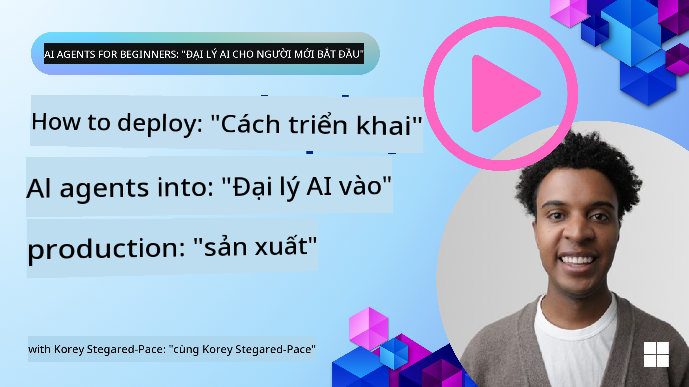

<!--
CO_OP_TRANSLATOR_METADATA:
{
  "original_hash": "1ad5de6a6388d02c145a92dd04358bab",
  "translation_date": "2025-07-12T13:40:26+00:00",
  "source_file": "10-ai-agents-production/README.md",
  "language_code": "vi"
}
-->

> _(Nhấp vào hình ảnh trên để xem video bài học này)_
# AI Agents trong Môi trường Thực tế

## Giới thiệu

Bài học này sẽ bao gồm:

- Cách lên kế hoạch triển khai AI Agent của bạn vào môi trường thực tế một cách hiệu quả.
- Những lỗi phổ biến và vấn đề bạn có thể gặp phải khi triển khai AI Agent vào môi trường thực tế.
- Cách quản lý chi phí trong khi vẫn duy trì hiệu suất của AI Agent.

## Mục tiêu học tập

Sau khi hoàn thành bài học này, bạn sẽ biết cách/hiểu được:

- Các kỹ thuật để cải thiện hiệu suất, chi phí và hiệu quả của hệ thống AI Agent trong môi trường thực tế.
- Cách đánh giá AI Agents của bạn và những gì cần đánh giá.
- Cách kiểm soát chi phí khi triển khai AI Agents vào môi trường thực tế.

Việc triển khai AI Agents đáng tin cậy là rất quan trọng. Hãy tham khảo thêm bài học "Building Trustworthy AI Agents".

## Đánh giá AI Agents

Trước, trong và sau khi triển khai AI Agents, việc có một hệ thống đánh giá phù hợp là rất quan trọng. Điều này sẽ đảm bảo hệ thống của bạn phù hợp với mục tiêu của bạn và người dùng.

Để đánh giá một AI Agent, bạn cần có khả năng đánh giá không chỉ kết quả đầu ra của agent mà còn toàn bộ hệ thống mà AI Agent đang hoạt động trong đó. Điều này bao gồm nhưng không giới hạn ở:

- Yêu cầu mô hình ban đầu.
- Khả năng của agent trong việc xác định ý định của người dùng.
- Khả năng của agent trong việc chọn công cụ phù hợp để thực hiện nhiệm vụ.
- Phản hồi của công cụ đối với yêu cầu của agent.
- Khả năng của agent trong việc giải thích phản hồi từ công cụ.
- Phản hồi của người dùng đối với câu trả lời của agent.

Điều này giúp bạn xác định các điểm cần cải thiện một cách có cấu trúc hơn. Bạn có thể theo dõi hiệu quả của các thay đổi đối với mô hình, prompt, công cụ và các thành phần khác một cách hiệu quả hơn.

## Các vấn đề phổ biến và giải pháp tiềm năng với AI Agents

| **Vấn đề**                                      | **Giải pháp tiềm năng**                                                                                                                                                                                                     |
| ---------------------------------------------- | -------------------------------------------------------------------------------------------------------------------------------------------------------------------------------------------------------------------------- |
| AI Agent không thực hiện nhiệm vụ một cách nhất quán | - Tinh chỉnh prompt đưa cho AI Agent; làm rõ mục tiêu. - Xác định xem việc chia nhỏ nhiệm vụ thành các phần nhỏ hơn và xử lý bởi nhiều agent có thể giúp ích không.                                                      |
| AI Agent bị lặp vô hạn                           | - Đảm bảo có các điều kiện dừng rõ ràng để Agent biết khi nào cần kết thúc quá trình. - Với các nhiệm vụ phức tạp đòi hỏi suy luận và lập kế hoạch, sử dụng mô hình lớn hơn chuyên về các nhiệm vụ suy luận.             |
| Các cuộc gọi công cụ của AI Agent không hoạt động tốt | - Kiểm tra và xác thực đầu ra của công cụ bên ngoài hệ thống agent. - Tinh chỉnh các tham số, prompt và tên gọi của công cụ.                                                                                            |
| Hệ thống Multi-Agent không hoạt động ổn định   | - Tinh chỉnh prompt cho từng agent để đảm bảo chúng cụ thể và khác biệt rõ ràng. - Xây dựng hệ thống phân cấp sử dụng một agent "điều phối" hoặc controller để xác định agent phù hợp nhất.                            |

## Quản lý chi phí

Dưới đây là một số chiến lược để quản lý chi phí khi triển khai AI Agents vào môi trường thực tế:

- **Lưu trữ kết quả trả lời (Caching Responses)** - Xác định các yêu cầu và nhiệm vụ phổ biến và cung cấp câu trả lời trước khi chúng đi qua hệ thống agent của bạn là cách tốt để giảm số lượng yêu cầu tương tự. Bạn thậm chí có thể triển khai một luồng để xác định mức độ tương đồng của yêu cầu với các yêu cầu đã lưu trữ bằng cách sử dụng các mô hình AI cơ bản hơn.

- **Sử dụng Mô hình Nhỏ hơn** - Các Small Language Models (SLMs) có thể hoạt động tốt trong một số trường hợp sử dụng agent và sẽ giảm đáng kể chi phí. Như đã đề cập trước đó, xây dựng hệ thống đánh giá để xác định và so sánh hiệu suất so với các mô hình lớn hơn là cách tốt nhất để hiểu SLM sẽ hoạt động thế nào trong trường hợp của bạn.

- **Sử dụng Mô hình Điều phối (Router Model)** - Một chiến lược tương tự là sử dụng đa dạng các mô hình và kích thước. Bạn có thể dùng LLM/SLM hoặc hàm serverless để điều phối các yêu cầu dựa trên độ phức tạp đến các mô hình phù hợp nhất. Điều này cũng giúp giảm chi phí đồng thời đảm bảo hiệu suất cho các nhiệm vụ phù hợp.

## Chúc mừng

Đây hiện là bài học cuối cùng của "AI Agents for Beginners".

Chúng tôi dự định tiếp tục bổ sung các bài học dựa trên phản hồi và những thay đổi trong ngành công nghiệp ngày càng phát triển này, vì vậy hãy quay lại trong tương lai gần.

Nếu bạn muốn tiếp tục học tập và xây dựng với AI Agents, hãy tham gia <a href="https://discord.gg/kzRShWzttr" target="_blank">Azure AI Community Discord</a>.

Chúng tôi tổ chức các workshop, bàn tròn cộng đồng và các phiên "hỏi tôi bất cứ điều gì" tại đó.

Chúng tôi cũng có một bộ sưu tập Learn với các tài liệu bổ sung giúp bạn bắt đầu xây dựng AI Agents trong môi trường thực tế.

## Bài học trước

[Metacognition Design Pattern](../09-metacognition/README.md)

**Tuyên bố từ chối trách nhiệm**:  
Tài liệu này đã được dịch bằng dịch vụ dịch thuật AI [Co-op Translator](https://github.com/Azure/co-op-translator). Mặc dù chúng tôi cố gắng đảm bảo độ chính xác, xin lưu ý rằng bản dịch tự động có thể chứa lỗi hoặc không chính xác. Tài liệu gốc bằng ngôn ngữ gốc của nó nên được coi là nguồn chính xác và đáng tin cậy. Đối với các thông tin quan trọng, nên sử dụng dịch vụ dịch thuật chuyên nghiệp do con người thực hiện. Chúng tôi không chịu trách nhiệm về bất kỳ sự hiểu lầm hoặc giải thích sai nào phát sinh từ việc sử dụng bản dịch này.