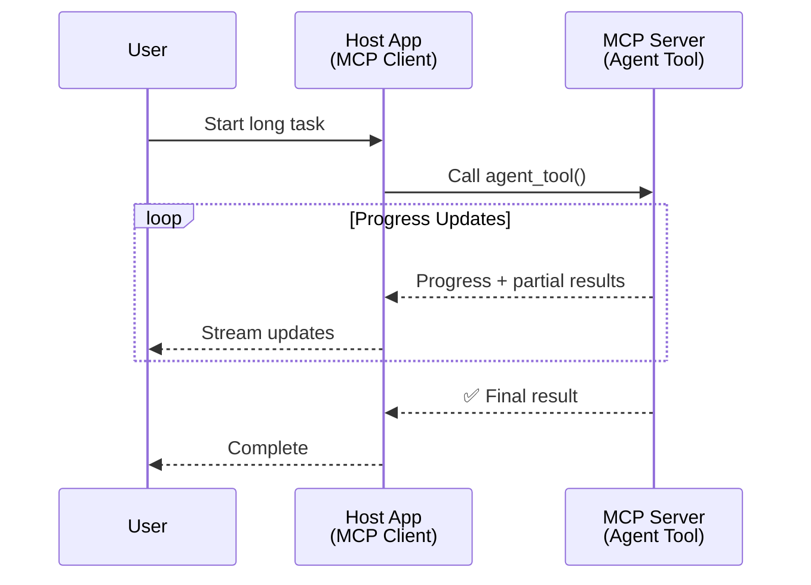
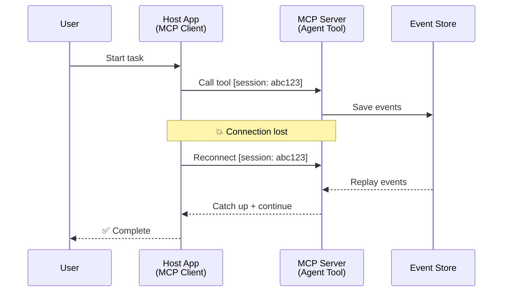
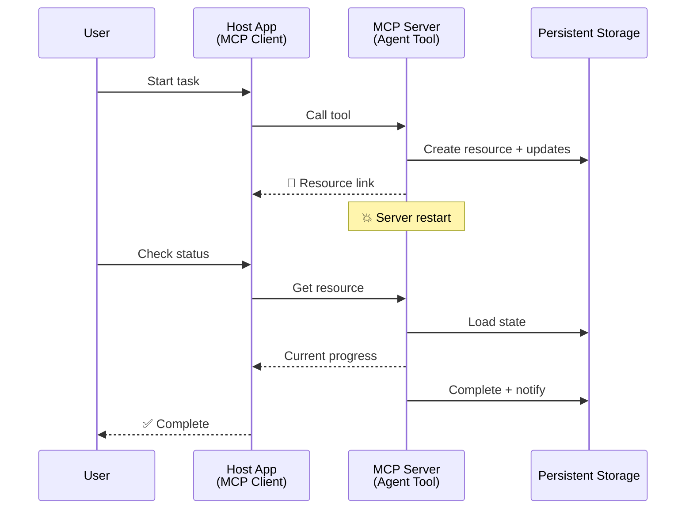
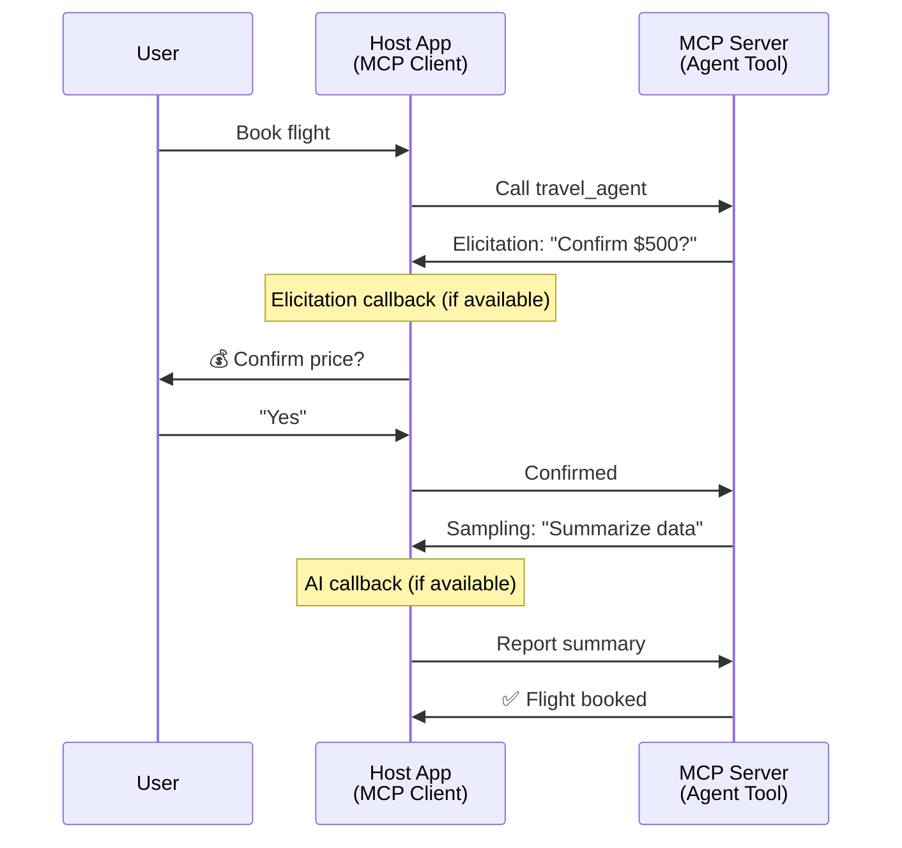
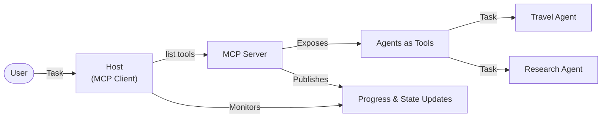

<!--
CO_OP_TRANSLATOR_METADATA:
{
  "original_hash": "5cc6836626047aa055e8960c8484a7d0",
  "translation_date": "2025-08-29T18:30:57+00:00",
  "source_file": "11-agentic-protocols/code_samples/mcp-agents/README.md",
  "language_code": "vi"
}
-->
# Xây dựng Hệ thống Giao tiếp Giữa Các Tác nhân với MCP

> Tóm tắt - Có thể xây dựng giao tiếp giữa các tác nhân trên MCP không? Có thể!

MCP đã phát triển vượt xa mục tiêu ban đầu là "cung cấp ngữ cảnh cho LLMs". Với các cải tiến gần đây bao gồm [luồng có thể tiếp tục](https://modelcontextprotocol.io/docs/concepts/transports#resumability-and-redelivery), [khai thác thông tin](https://modelcontextprotocol.io/specification/2025-06-18/client/elicitation), [lấy mẫu](https://modelcontextprotocol.io/specification/2025-06-18/client/sampling), và thông báo ([tiến độ](https://modelcontextprotocol.io/specification/2025-06-18/basic/utilities/progress) và [tài nguyên](https://modelcontextprotocol.io/specification/2025-06-18/schema#resourceupdatednotification)), MCP hiện cung cấp nền tảng mạnh mẽ để xây dựng các hệ thống giao tiếp phức tạp giữa các tác nhân.

## Hiểu lầm về Tác nhân/Công cụ

Khi ngày càng nhiều nhà phát triển khám phá các công cụ với hành vi tác nhân (chạy trong thời gian dài, có thể yêu cầu thêm đầu vào trong quá trình thực thi, v.v.), một hiểu lầm phổ biến là MCP không phù hợp, chủ yếu vì các ví dụ ban đầu về công cụ của nó tập trung vào các mẫu yêu cầu-phản hồi đơn giản.

Quan điểm này đã lỗi thời. Đặc tả MCP đã được cải tiến đáng kể trong vài tháng qua với các khả năng thu hẹp khoảng cách để xây dựng hành vi tác nhân chạy lâu dài:

- **Luồng & Kết quả Từng phần**: Cập nhật tiến độ theo thời gian thực trong quá trình thực thi
- **Khả năng tiếp tục**: Khách hàng có thể kết nối lại và tiếp tục sau khi bị ngắt kết nối
- **Độ bền**: Kết quả tồn tại sau khi máy chủ khởi động lại (ví dụ: thông qua liên kết tài nguyên)
- **Nhiều lượt**: Đầu vào tương tác trong quá trình thực thi thông qua khai thác thông tin và lấy mẫu

Các tính năng này có thể được kết hợp để cho phép các ứng dụng tác nhân phức tạp và đa tác nhân, tất cả đều được triển khai trên giao thức MCP.

Để tham khảo, chúng ta sẽ gọi một tác nhân là "công cụ" có sẵn trên máy chủ MCP. Điều này ngụ ý sự tồn tại của một ứng dụng chủ thực hiện một khách hàng MCP, thiết lập phiên với máy chủ MCP và có thể gọi tác nhân.

## Điều gì làm cho một Công cụ MCP trở thành "Tác nhân"?

Trước khi đi vào triển khai, hãy xác định các khả năng hạ tầng cần thiết để hỗ trợ các tác nhân chạy lâu dài.

> Chúng ta sẽ định nghĩa một tác nhân là một thực thể có thể hoạt động tự động trong thời gian dài, có khả năng xử lý các nhiệm vụ phức tạp có thể yêu cầu nhiều tương tác hoặc điều chỉnh dựa trên phản hồi theo thời gian thực.

### 1. Luồng & Kết quả Từng phần

Các mẫu yêu cầu-phản hồi truyền thống không phù hợp với các nhiệm vụ chạy lâu dài. Các tác nhân cần cung cấp:

- Cập nhật tiến độ theo thời gian thực
- Kết quả trung gian

**Hỗ trợ MCP**: Thông báo cập nhật tài nguyên cho phép luồng kết quả từng phần, mặc dù điều này yêu cầu thiết kế cẩn thận để tránh xung đột với mô hình yêu cầu/phản hồi 1:1 của JSON-RPC.

| Tính năng                  | Trường hợp sử dụng                                                                                                                                                                       | Hỗ trợ MCP                                                                                  |
| -------------------------- | --------------------------------------------------------------------------------------------------------------------------------------------------------------------------------------- | ------------------------------------------------------------------------------------------ |
| Cập nhật Tiến độ Theo Thời gian thực | Người dùng yêu cầu nhiệm vụ di chuyển mã. Tác nhân truyền tiến độ: "10% - Đang phân tích phụ thuộc... 25% - Đang chuyển đổi tệp TypeScript... 50% - Đang cập nhật các nhập khẩu..."          | ✅ Thông báo tiến độ                                                                       |
| Kết quả Từng phần          | Nhiệm vụ "Tạo một cuốn sách" truyền kết quả từng phần, ví dụ: 1) Dàn ý cốt truyện, 2) Danh sách chương, 3) Mỗi chương khi hoàn thành. Ứng dụng chủ có thể kiểm tra, hủy hoặc chuyển hướng ở bất kỳ giai đoạn nào. | ✅ Thông báo có thể được "mở rộng" để bao gồm kết quả từng phần, xem các đề xuất trên PR 383, 776 |

<div align="center" style="font-style: italic; font-size: 0.95em; margin-bottom: 0.5em;">
<strong>Hình 1:</strong> Sơ đồ này minh họa cách một tác nhân MCP truyền cập nhật tiến độ theo thời gian thực và kết quả từng phần cho ứng dụng chủ trong quá trình thực hiện nhiệm vụ lâu dài, cho phép người dùng theo dõi tiến trình trong thời gian thực.
</div>



### 2. Khả năng tiếp tục

Các tác nhân phải xử lý gián đoạn mạng một cách linh hoạt:

- Kết nối lại sau khi (khách hàng) bị ngắt kết nối
- Tiếp tục từ nơi đã dừng lại (gửi lại tin nhắn)

**Hỗ trợ MCP**: Giao thức StreamableHTTP của MCP hiện hỗ trợ tiếp tục phiên và gửi lại tin nhắn với ID phiên và ID sự kiện cuối cùng. Lưu ý quan trọng ở đây là máy chủ phải triển khai một EventStore cho phép phát lại sự kiện khi khách hàng kết nối lại.  
Lưu ý rằng có một đề xuất cộng đồng (PR #975) khám phá luồng có thể tiếp tục không phụ thuộc vào giao thức.

| Tính năng      | Trường hợp sử dụng                                                                                                                                                   | Hỗ trợ MCP                                                                |
| -------------- | -------------------------------------------------------------------------------------------------------------------------------------------------------------------- | -------------------------------------------------------------------------- |
| Khả năng tiếp tục | Khách hàng bị ngắt kết nối trong nhiệm vụ lâu dài. Khi kết nối lại, phiên tiếp tục với các sự kiện bị bỏ lỡ được phát lại, tiếp tục liền mạch từ nơi đã dừng lại. | ✅ Giao thức StreamableHTTP với ID phiên, phát lại sự kiện, và EventStore |

<div align="center" style="font-style: italic; font-size: 0.95em; margin-bottom: 0.5em;">
<strong>Hình 2:</strong> Sơ đồ này cho thấy cách giao thức StreamableHTTP của MCP và kho sự kiện cho phép tiếp tục phiên liền mạch: nếu khách hàng bị ngắt kết nối, họ có thể kết nối lại và phát lại các sự kiện bị bỏ lỡ, tiếp tục nhiệm vụ mà không mất tiến độ.
</div>



### 3. Độ bền

Các tác nhân chạy lâu dài cần trạng thái bền vững:

- Kết quả tồn tại sau khi máy chủ khởi động lại
- Trạng thái có thể được truy xuất ngoài băng
- Theo dõi tiến độ qua các phiên

**Hỗ trợ MCP**: MCP hiện hỗ trợ kiểu trả về liên kết tài nguyên cho các cuộc gọi công cụ. Hiện tại, một mẫu khả thi là thiết kế một công cụ tạo tài nguyên và ngay lập tức trả về liên kết tài nguyên. Công cụ có thể tiếp tục xử lý nhiệm vụ trong nền và cập nhật tài nguyên. Ngược lại, khách hàng có thể chọn kiểm tra trạng thái của tài nguyên này để nhận kết quả từng phần hoặc đầy đủ (dựa trên các cập nhật tài nguyên mà máy chủ cung cấp) hoặc đăng ký tài nguyên để nhận thông báo cập nhật.

Một hạn chế ở đây là việc kiểm tra tài nguyên hoặc đăng ký nhận cập nhật có thể tiêu tốn tài nguyên với các tác động ở quy mô lớn. Có một đề xuất cộng đồng mở (bao gồm #992) khám phá khả năng bao gồm webhook hoặc trình kích hoạt mà máy chủ có thể gọi để thông báo cho ứng dụng khách/chủ về các cập nhật.

| Tính năng    | Trường hợp sử dụng                                                                                                                                        | Hỗ trợ MCP                                                        |
| ------------ | --------------------------------------------------------------------------------------------------------------------------------------------------------- | ------------------------------------------------------------------ |
| Độ bền       | Máy chủ gặp sự cố trong nhiệm vụ di chuyển dữ liệu. Kết quả và tiến độ tồn tại sau khi khởi động lại, khách hàng có thể kiểm tra trạng thái và tiếp tục từ tài nguyên bền vững. | ✅ Liên kết tài nguyên với lưu trữ bền vững và thông báo trạng thái |

Hiện tại, một mẫu phổ biến là thiết kế một công cụ tạo tài nguyên và ngay lập tức trả về liên kết tài nguyên. Công cụ có thể xử lý nhiệm vụ trong nền, phát hành thông báo tài nguyên như các cập nhật tiến độ hoặc bao gồm kết quả từng phần, và cập nhật nội dung trong tài nguyên khi cần.

<div align="center" style="font-style: italic; font-size: 0.95em; margin-bottom: 0.5em;">
<strong>Hình 3:</strong> Sơ đồ này minh họa cách các tác nhân MCP sử dụng tài nguyên bền vững và thông báo trạng thái để đảm bảo rằng các nhiệm vụ lâu dài tồn tại sau khi máy chủ khởi động lại, cho phép khách hàng kiểm tra tiến độ và truy xuất kết quả ngay cả sau khi gặp sự cố.
</div>



### 4. Tương tác Nhiều lượt

Các tác nhân thường cần thêm đầu vào trong quá trình thực thi:

- Làm rõ hoặc phê duyệt từ con người
- Hỗ trợ AI cho các quyết định phức tạp
- Điều chỉnh tham số động

**Hỗ trợ MCP**: Được hỗ trợ đầy đủ thông qua lấy mẫu (cho đầu vào AI) và khai thác thông tin (cho đầu vào con người).

| Tính năng                 | Trường hợp sử dụng                                                                                                                                     | Hỗ trợ MCP                                           |
| ------------------------- | ------------------------------------------------------------------------------------------------------------------------------------------------------ | ----------------------------------------------------- |
| Tương tác Nhiều lượt      | Tác nhân đặt vé du lịch yêu cầu xác nhận giá từ người dùng, sau đó yêu cầu AI tóm tắt dữ liệu du lịch trước khi hoàn tất giao dịch đặt vé.             | ✅ Khai thác thông tin cho đầu vào con người, lấy mẫu cho đầu vào AI |

<div align="center" style="font-style: italic; font-size: 0.95em; margin-bottom: 0.5em;">
<strong>Hình 4:</strong> Sơ đồ này mô tả cách các tác nhân MCP có thể tương tác để khai thác đầu vào từ con người hoặc yêu cầu hỗ trợ AI trong quá trình thực thi, hỗ trợ các quy trình làm việc phức tạp, nhiều lượt như xác nhận và ra quyết định động.
</div>



## Triển khai Tác nhân Chạy lâu dài trên MCP - Tổng quan về Mã

Trong bài viết này, chúng tôi cung cấp một [kho mã](https://github.com/victordibia/ai-tutorials/tree/main/MCP%20Agents) chứa triển khai đầy đủ các tác nhân chạy lâu dài sử dụng MCP Python SDK với giao thức StreamableHTTP để tiếp tục phiên và gửi lại tin nhắn. Triển khai này minh họa cách các khả năng của MCP có thể được kết hợp để cho phép các hành vi giống như tác nhân tinh vi.

Cụ thể, chúng tôi triển khai một máy chủ với hai công cụ tác nhân chính:

- **Tác nhân Du lịch** - Mô phỏng dịch vụ đặt vé du lịch với xác nhận giá thông qua khai thác thông tin
- **Tác nhân Nghiên cứu** - Thực hiện các nhiệm vụ nghiên cứu với tóm tắt hỗ trợ AI thông qua lấy mẫu

Cả hai tác nhân đều minh họa cập nhật tiến độ theo thời gian thực, xác nhận tương tác, và khả năng tiếp tục phiên đầy đủ.

### Các Khái niệm Triển khai Chính

Các phần sau đây hiển thị triển khai tác nhân phía máy chủ và xử lý ứng dụng chủ phía khách hàng cho từng khả năng:

#### Luồng & Cập nhật Tiến độ - Trạng thái Nhiệm vụ Theo thời gian thực

Luồng cho phép các tác nhân cung cấp cập nhật tiến độ theo thời gian thực trong các nhiệm vụ lâu dài, giữ cho người dùng được thông báo về trạng thái nhiệm vụ và kết quả trung gian.

**Triển khai Máy chủ (tác nhân gửi thông báo tiến độ):**

```python
# From server/server.py - Travel agent sending progress updates
for i, step in enumerate(steps):
    await ctx.session.send_progress_notification(
        progress_token=ctx.request_id,
        progress=i * 25,
        total=100,
        message=step,
        related_request_id=str(ctx.request_id)
    )
    await anyio.sleep(2)  # Simulate work

# Alternative: Log messages for detailed step-by-step updates
await ctx.session.send_log_message(
    level="info",
    data=f"Processing step {current_step}/{steps} ({progress_percent}%)",
    logger="long_running_agent",
    related_request_id=ctx.request_id,
)
```

**Triển khai Khách hàng (ứng dụng chủ nhận cập nhật tiến độ):**

```python
# From client/client.py - Client handling real-time notifications
async def message_handler(message) -> None:
    if isinstance(message, types.ServerNotification):
        if isinstance(message.root, types.LoggingMessageNotification):
            console.print(f"📡 [dim]{message.root.params.data}[/dim]")
        elif isinstance(message.root, types.ProgressNotification):
            progress = message.root.params
            console.print(f"🔄 [yellow]{progress.message} ({progress.progress}/{progress.total})[/yellow]")

# Register message handler when creating session
async with ClientSession(
    read_stream, write_stream,
    message_handler=message_handler
) as session:
```

#### Khai thác thông tin - Yêu cầu Đầu vào Người dùng

Khai thác thông tin cho phép các tác nhân yêu cầu đầu vào từ người dùng trong quá trình thực thi. Điều này rất cần thiết cho các xác nhận, làm rõ, hoặc phê duyệt trong các nhiệm vụ lâu dài.

**Triển khai Máy chủ (tác nhân yêu cầu xác nhận):**

```python
# From server/server.py - Travel agent requesting price confirmation
elicit_result = await ctx.session.elicit(
    message=f"Please confirm the estimated price of $1200 for your trip to {destination}",
    requestedSchema=PriceConfirmationSchema.model_json_schema(),
    related_request_id=ctx.request_id,
)

if elicit_result and elicit_result.action == "accept":
    # Continue with booking
    logger.info(f"User confirmed price: {elicit_result.content}")
elif elicit_result and elicit_result.action == "decline":
    # Cancel the booking
    booking_cancelled = True
```

**Triển khai Khách hàng (ứng dụng chủ cung cấp callback khai thác thông tin):**

```python
# From client/client.py - Client handling elicitation requests
async def elicitation_callback(context, params):
    console.print(f"💬 Server is asking for confirmation:")
    console.print(f"   {params.message}")

    response = console.input("Do you accept? (y/n): ").strip().lower()

    if response in ['y', 'yes']:
        return types.ElicitResult(
            action="accept",
            content={"confirm": True, "notes": "Confirmed by user"}
        )
    else:
        return types.ElicitResult(
            action="decline",
            content={"confirm": False, "notes": "Declined by user"}
        )

# Register the callback when creating the session
async with ClientSession(
    read_stream, write_stream,
    elicitation_callback=elicitation_callback
) as session:
```

#### Lấy mẫu - Yêu cầu Hỗ trợ AI

Lấy mẫu cho phép các tác nhân yêu cầu hỗ trợ LLM cho các quyết định phức tạp hoặc tạo nội dung trong quá trình thực thi. Điều này cho phép các quy trình làm việc kết hợp giữa con người và AI.

**Triển khai Máy chủ (tác nhân yêu cầu hỗ trợ AI):**

```python
# From server/server.py - Research agent requesting AI summary
sampling_result = await ctx.session.create_message(
    messages=[
        SamplingMessage(
            role="user",
            content=TextContent(type="text", text=f"Please summarize the key findings for research on: {topic}")
        )
    ],
    max_tokens=100,
    related_request_id=ctx.request_id,
)

if sampling_result and sampling_result.content:
    if sampling_result.content.type == "text":
        sampling_summary = sampling_result.content.text
        logger.info(f"Received sampling summary: {sampling_summary}")
```

**Triển khai Khách hàng (ứng dụng chủ cung cấp callback lấy mẫu):**

```python
# From client/client.py - Client handling sampling requests
async def sampling_callback(context, params):
    message_text = params.messages[0].content.text if params.messages else 'No message'
    console.print(f"🧠 Server requested sampling: {message_text}")

    # In a real application, this could call an LLM API
    # For demo purposes, we provide a mock response
    mock_response = "Based on current research, MCP has evolved significantly..."

    return types.CreateMessageResult(
        role="assistant",
        content=types.TextContent(type="text", text=mock_response),
        model="interactive-client",
        stopReason="endTurn"
    )

# Register the callback when creating the session
async with ClientSession(
    read_stream, write_stream,
    sampling_callback=sampling_callback,
    elicitation_callback=elicitation_callback
) as session:
```

#### Khả năng tiếp tục - Liên tục Phiên Qua Các Gián đoạn

Khả năng tiếp tục đảm bảo rằng các nhiệm vụ tác nhân lâu dài có thể tồn tại qua các gián đoạn kết nối khách hàng và tiếp tục liền mạch khi kết nối lại. Điều này được triển khai thông qua kho sự kiện và token tiếp tục.

**Triển khai Kho Sự kiện (máy chủ giữ trạng thái phiên):**

```python
# From server/event_store.py - Simple in-memory event store
class SimpleEventStore(EventStore):
    def __init__(self):
        self._events: list[tuple[StreamId, EventId, JSONRPCMessage]] = []
        self._event_id_counter = 0

    async def store_event(self, stream_id: StreamId, message: JSONRPCMessage) -> EventId:
        """Store an event and return its ID."""
        self._event_id_counter += 1
        event_id = str(self._event_id_counter)
        self._events.append((stream_id, event_id, message))
        return event_id

    async def replay_events_after(self, last_event_id: EventId, send_callback: EventCallback) -> StreamId | None:
        """Replay events after the specified ID for resumption."""
        # Find events after the last known event and replay them
        for _, event_id, message in self._events[start_index:]:
            await send_callback(EventMessage(message, event_id))

# From server/server.py - Passing event store to session manager
def create_server_app(event_store: Optional[EventStore] = None) -> Starlette:
    server = ResumableServer()

    # Create session manager with event store for resumption
    session_manager = StreamableHTTPSessionManager(
        app=server,
        event_store=event_store,  # Event store enables session resumption
        json_response=False,
        security_settings=security_settings,
    )

    return Starlette(routes=[Mount("/mcp", app=session_manager.handle_request)])

# Usage: Initialize with event store
event_store = SimpleEventStore()
app = create_server_app(event_store)
```

**Metadata Khách hàng với Token Tiếp tục (khách hàng kết nối lại sử dụng trạng thái đã lưu):**

```python
# From client/client.py - Client resumption with metadata
if existing_tokens and existing_tokens.get("resumption_token"):
    # Use existing resumption token to continue where we left off
    metadata = ClientMessageMetadata(
        resumption_token=existing_tokens["resumption_token"],
    )
else:
    # Create callback to save resumption token when received
    def enhanced_callback(token: str):
        protocol_version = getattr(session, 'protocol_version', None)
        token_manager.save_tokens(session_id, token, protocol_version, command, args)

    metadata = ClientMessageMetadata(
        on_resumption_token_update=enhanced_callback,
    )

# Send request with resumption metadata
result = await session.send_request(
    types.ClientRequest(
        types.CallToolRequest(
            method="tools/call",
            params=types.CallToolRequestParams(name=command, arguments=args)
        )
    ),
    types.CallToolResult,
    metadata=metadata,
)
```

Ứng dụng chủ duy trì ID phiên và token tiếp tục cục bộ, cho phép nó kết nối lại với các phiên hiện có mà không mất tiến độ hoặc trạng thái.

### Tổ chức Mã

<div align="center" style="font-style: italic; font-size: 0.95em; margin-bottom: 0.5em;">
<strong>Hình 5:</strong> Kiến trúc hệ thống tác nhân dựa trên MCP
</div>



**Các Tệp Chính:**

- **`server/server.py`** - Máy chủ MCP có thể tiếp tục với các tác nhân du lịch và nghiên cứu minh họa khai thác thông tin, lấy mẫu, và cập nhật tiến độ
- **`client/client.py`** - Ứng dụng chủ tương tác với hỗ trợ tiếp tục, trình xử lý callback, và quản lý token
- **`server/event_store.py`** - Triển khai kho sự kiện cho phép tiếp tục phiên và gửi lại tin nhắn

## Mở rộng sang Giao tiếp Đa Tác nhân trên MCP

Triển khai trên có thể được mở rộng sang các hệ thống đa tác nhân bằng cách nâng cao trí thông minh và phạm vi của ứng dụng chủ:

- **Phân tích Nhiệm vụ Thông minh**: Ứng dụng chủ phân tích các yêu cầu phức tạp của người dùng và chia chúng thành các nhiệm vụ con cho các tác nhân chuyên biệt khác nhau
- **Phối hợp Đa Máy chủ**: Ứng dụng chủ duy trì kết nối với nhiều máy chủ MCP, mỗi máy chủ cung cấp các khả năng tác nhân khác nhau
- **Quản lý Trạng thái Nhiệm vụ**: Ứng dụng chủ theo dõi tiến độ qua nhiều nhiệm vụ tác nhân đồng thời, xử lý các phụ thuộc và trình tự
- **Khả năng phục hồi & Thử lại**: Ứng dụng chủ quản lý các lỗi, triển khai logic thử lại, và chuyển hướng nhiệm vụ khi các tác nhân không khả dụng
- **Tổng hợp Kết quả**: Ứng dụng chủ kết hợp các đầu ra từ nhiều tác nhân thành kết quả cuối cùng mạch lạc

Ứng dụng chủ phát triển từ một khách hàng đơn giản thành một nhà điều phối thông minh, phối hợp các khả năng tác nhân phân tán trong khi duy trì nền tảng giao thức MCP.

## Kết luận

Các khả năng nâng cao của MCP - thông báo tài nguyên, khai thác thông tin/lấy mẫu, luồng có thể tiếp tục, và tài nguyên bền vững - cho phép các tương tác phức tạp giữa các tác nhân trong khi vẫn duy trì sự đơn giản của giao thức.

## Bắt đầu

Sẵn sàng xây dựng hệ thống giao tiếp giữa các tác nhân của riêng bạn? Thực hiện các bước sau:

### 1. Chạy Demo

```bash
# Start the server with event store for resumption
python -m server.server --port 8006

# In another terminal, run the interactive client
python -m client.client --url http://127.0.0.1:8006/mcp
```

**Các lệnh có sẵn trong chế độ tương tác:**

- `travel_agent` - Đặt vé du lịch với xác nhận giá thông qua khai thác thông tin
- `research_agent` - Nghiên cứu chủ đề với tóm tắt hỗ trợ AI thông qua lấy mẫu
- `list` - Hiển thị tất cả các công cụ có sẵn
- `clean-tokens` - Xóa token tiếp tục
- `help` - Hiển thị trợ giúp chi tiết lệnh
- `quit` - Thoát ứng dụng khách

### 2. Kiểm tra Khả năng Tiếp tục

- Bắt đầu một tác nhân chạy lâu dài (ví dụ: `travel_agent`)
- Ngắt ứng dụng khách trong quá trình thực thi (Ctrl+C)
- Khởi động lại ứng dụng khách - nó sẽ tự động tiếp tục từ nơi đã dừng lại

### 3. Khám phá và Mở rộng

- **Khám phá các ví dụ**: Xem [mcp-agents](https://github.com/victordibia/ai-tutorials/tree/main/MCP%20Agents)
- **Tham gia cộng đồng**: Tham gia thảo luận MCP trên GitHub
- **Thử nghiệm**: Bắt đầu với một nhiệm vụ chạy lâu dài đơn giản và dần dần thêm luồng, khả năng tiếp tục, và phối hợp đa tác nhân

Điều này minh họa cách MCP cho phép các hành vi tác nhân thông minh trong khi vẫn duy trì sự đơn giản dựa trên công cụ.

Nhìn chung, đặc tả giao thức MCP đang phát triển nhanh chóng; người đọc được khuyến khích xem trang web tài liệu chính thức để cập nhật mới nhất -

---

**Tuyên bố miễn trừ trách nhiệm**:  
Tài liệu này đã được dịch bằng dịch vụ dịch thuật AI [Co-op Translator](https://github.com/Azure/co-op-translator). Mặc dù chúng tôi cố gắng đảm bảo độ chính xác, xin lưu ý rằng các bản dịch tự động có thể chứa lỗi hoặc không chính xác. Tài liệu gốc bằng ngôn ngữ bản địa nên được coi là nguồn thông tin chính thức. Đối với các thông tin quan trọng, khuyến nghị sử dụng dịch vụ dịch thuật chuyên nghiệp bởi con người. Chúng tôi không chịu trách nhiệm cho bất kỳ sự hiểu lầm hoặc diễn giải sai nào phát sinh từ việc sử dụng bản dịch này.