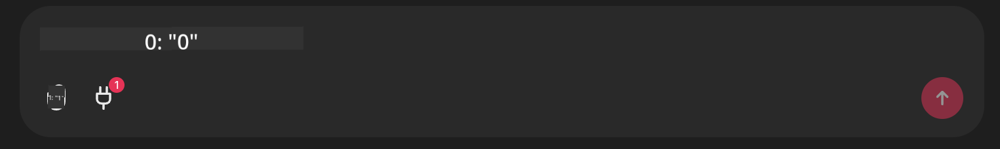

<!--
CO_OP_TRANSLATOR_METADATA:
{
  "original_hash": "9bf0395cbc541ce8db2a9699c8678dfc",
  "translation_date": "2025-07-12T14:23:35+00:00",
  "source_file": "11-mcp/code_samples/github-mcp/README.md",
  "language_code": "vi"
}
-->
# Ví dụ về Máy chủ Github MCP

## Mô tả

Đây là một bản demo được tạo ra cho cuộc thi AI Agents Hackathon do Microsoft Reactor tổ chức.

Công cụ này được sử dụng để đề xuất các dự án hackathon dựa trên các kho lưu trữ Github của người dùng.  
Quá trình này được thực hiện bằng cách:

1. **Github Agent** - Sử dụng Máy chủ Github MCP để truy xuất các kho lưu trữ và thông tin liên quan.  
2. **Hackathon Agent** - Lấy dữ liệu từ Github Agent và đưa ra các ý tưởng dự án hackathon sáng tạo dựa trên các dự án, ngôn ngữ mà người dùng sử dụng và các chủ đề dự án của AI Agents hackathon.  
3. **Events Agent** - Dựa trên đề xuất của hackathon agent, events agent sẽ gợi ý các sự kiện phù hợp trong chuỗi sự kiện AI Agent Hackathon.  

## Chạy mã nguồn

### Biến môi trường

Bản demo này sử dụng Azure Open AI Service, Semantic Kernel, Máy chủ Github MCP và Azure AI Search.

Hãy đảm bảo bạn đã thiết lập đúng các biến môi trường để sử dụng các công cụ này:

```python
AZURE_OPENAI_CHAT_DEPLOYMENT_NAME=""
AZURE_OPENAI_EMBEDDING_DEPLOYMENT_NAME=""
AZURE_OPENAI_ENDPOINT=""
AZURE_OPENAI_API_KEY=""
AZURE_OPENAI_API_VERSION=""
AZURE_SEARCH_SERVICE_ENDPOINT=""
AZURE_SEARCH_API_KEY=""
```

## Chạy Máy chủ Chainlit

Để kết nối với máy chủ MCP, bản demo này sử dụng Chainlit làm giao diện chat.

Để chạy máy chủ, sử dụng lệnh sau trong terminal của bạn:

```bash
chainlit run app.py -w
```

Lệnh này sẽ khởi động máy chủ Chainlit trên `localhost:8000` đồng thời điền nội dung của `event-descriptions.md` vào Azure AI Search Index của bạn.

## Kết nối với Máy chủ MCP

Để kết nối với Máy chủ Github MCP, chọn biểu tượng "phích cắm" bên dưới ô chat "Type your message here..":



Từ đó, bạn có thể nhấn vào "Connect an MCP" để thêm lệnh kết nối tới Máy chủ Github MCP:

```bash
npx -y @modelcontextprotocol/server-github --env GITHUB_PERSONAL_ACCESS_TOKEN=[YOUR PERSONAL ACCESS TOKEN]
```

Thay thế "[YOUR PERSONAL ACCESS TOKEN]" bằng Personal Access Token thực tế của bạn.

Sau khi kết nối, bạn sẽ thấy số (1) bên cạnh biểu tượng phích cắm để xác nhận đã kết nối thành công. Nếu không, hãy thử khởi động lại máy chủ chainlit với lệnh `chainlit run app.py -w`.

## Sử dụng Demo

Để bắt đầu quy trình agent đề xuất dự án hackathon, bạn có thể nhập một tin nhắn như:

"Recommend hackathon projects for the Github user koreyspace"

Router Agent sẽ phân tích yêu cầu của bạn và xác định sự kết hợp các agent (GitHub, Hackathon và Events) phù hợp nhất để xử lý truy vấn. Các agent phối hợp cùng nhau để cung cấp đề xuất toàn diện dựa trên phân tích kho lưu trữ GitHub, ý tưởng dự án và các sự kiện công nghệ liên quan.

**Tuyên bố từ chối trách nhiệm**:  
Tài liệu này đã được dịch bằng dịch vụ dịch thuật AI [Co-op Translator](https://github.com/Azure/co-op-translator). Mặc dù chúng tôi cố gắng đảm bảo độ chính xác, xin lưu ý rằng các bản dịch tự động có thể chứa lỗi hoặc không chính xác. Tài liệu gốc bằng ngôn ngữ gốc của nó nên được coi là nguồn chính xác và đáng tin cậy. Đối với các thông tin quan trọng, nên sử dụng dịch vụ dịch thuật chuyên nghiệp do con người thực hiện. Chúng tôi không chịu trách nhiệm về bất kỳ sự hiểu lầm hoặc giải thích sai nào phát sinh từ việc sử dụng bản dịch này.