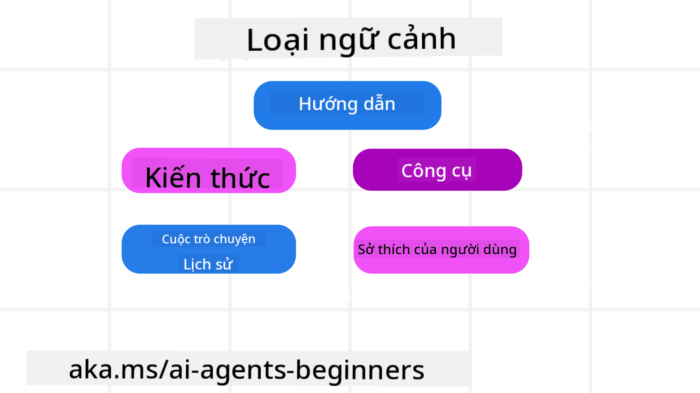
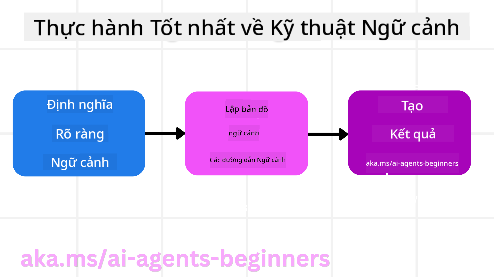

<!--
CO_OP_TRANSLATOR_METADATA:
{
  "original_hash": "cb7e50f471905ce6fdb92a30269a7a98",
  "translation_date": "2025-09-04T10:17:07+00:00",
  "source_file": "12-context-engineering/README.md",
  "language_code": "vi"
}
-->
# Kỹ thuật Ngữ cảnh cho Các Tác nhân AI

> _(Nhấp vào hình ảnh trên để xem video của bài học này)_

Hiểu được sự phức tạp của ứng dụng mà bạn đang xây dựng tác nhân AI là rất quan trọng để tạo ra một tác nhân đáng tin cậy. Chúng ta cần xây dựng các tác nhân AI có khả năng quản lý thông tin hiệu quả để đáp ứng các nhu cầu phức tạp vượt ra ngoài kỹ thuật nhắc lệnh.

Trong bài học này, chúng ta sẽ tìm hiểu kỹ thuật ngữ cảnh là gì và vai trò của nó trong việc xây dựng các tác nhân AI.

## Giới thiệu

Bài học này sẽ bao gồm:

• **Kỹ thuật Ngữ cảnh là gì** và tại sao nó khác với kỹ thuật nhắc lệnh.

• **Các chiến lược để thực hiện Kỹ thuật Ngữ cảnh hiệu quả**, bao gồm cách viết, chọn lọc, nén và cô lập thông tin.

• **Các lỗi ngữ cảnh phổ biến** có thể làm gián đoạn tác nhân AI và cách khắc phục chúng.

## Mục tiêu học tập

Sau khi hoàn thành bài học này, bạn sẽ hiểu cách:

• **Định nghĩa kỹ thuật ngữ cảnh** và phân biệt nó với kỹ thuật nhắc lệnh.

• **Xác định các thành phần chính của ngữ cảnh** trong các ứng dụng Mô hình Ngôn ngữ Lớn (LLM).

• **Áp dụng các chiến lược để viết, chọn lọc, nén và cô lập ngữ cảnh** nhằm cải thiện hiệu suất của tác nhân.

• **Nhận biết các lỗi ngữ cảnh phổ biến** như nhiễm độc, phân tâm, nhầm lẫn và xung đột, và triển khai các kỹ thuật giảm thiểu.

## Kỹ thuật Ngữ cảnh là gì?

Đối với các tác nhân AI, ngữ cảnh là yếu tố thúc đẩy việc lập kế hoạch để tác nhân AI thực hiện các hành động nhất định. Kỹ thuật Ngữ cảnh là việc đảm bảo rằng tác nhân AI có thông tin phù hợp để hoàn thành bước tiếp theo của nhiệm vụ. Cửa sổ ngữ cảnh có kích thước giới hạn, vì vậy với tư cách là người xây dựng tác nhân, chúng ta cần tạo ra các hệ thống và quy trình để quản lý việc thêm, loại bỏ và cô đọng thông tin trong cửa sổ ngữ cảnh.

### Kỹ thuật Nhắc lệnh vs Kỹ thuật Ngữ cảnh

Kỹ thuật nhắc lệnh tập trung vào một tập hợp các hướng dẫn tĩnh để hướng dẫn tác nhân AI một cách hiệu quả với một bộ quy tắc. Kỹ thuật ngữ cảnh là cách quản lý một tập hợp thông tin động, bao gồm cả nhắc lệnh ban đầu, để đảm bảo rằng tác nhân AI có những gì cần thiết theo thời gian. Ý tưởng chính của kỹ thuật ngữ cảnh là làm cho quy trình này có thể lặp lại và đáng tin cậy.

### Các loại Ngữ cảnh

Điều quan trọng cần nhớ là ngữ cảnh không chỉ là một thứ duy nhất. Thông tin mà tác nhân AI cần có thể đến từ nhiều nguồn khác nhau và chúng ta phải đảm bảo rằng tác nhân có quyền truy cập vào các nguồn này:

Các loại ngữ cảnh mà một tác nhân AI có thể cần quản lý bao gồm:

• **Hướng dẫn:** Đây giống như "quy tắc" của tác nhân – nhắc lệnh, thông điệp hệ thống, ví dụ few-shot (cho AI thấy cách thực hiện một việc gì đó), và mô tả các công cụ mà nó có thể sử dụng. Đây là nơi kỹ thuật nhắc lệnh kết hợp với kỹ thuật ngữ cảnh.

• **Kiến thức:** Bao gồm các sự kiện, thông tin được truy xuất từ cơ sở dữ liệu, hoặc ký ức dài hạn mà tác nhân đã tích lũy. Điều này bao gồm việc tích hợp hệ thống Tạo Nội dung Tăng cường Truy xuất (RAG) nếu tác nhân cần truy cập vào các kho kiến thức và cơ sở dữ liệu khác nhau.

• **Công cụ:** Đây là các định nghĩa về các chức năng bên ngoài, API và máy chủ MCP mà tác nhân có thể gọi, cùng với phản hồi (kết quả) mà nó nhận được từ việc sử dụng chúng.

• **Lịch sử hội thoại:** Cuộc đối thoại đang diễn ra với người dùng. Theo thời gian, các cuộc hội thoại này trở nên dài hơn và phức tạp hơn, điều này có nghĩa là chúng chiếm không gian trong cửa sổ ngữ cảnh.

• **Sở thích của người dùng:** Thông tin được học về sở thích hoặc không thích của người dùng theo thời gian. Những thông tin này có thể được lưu trữ và gọi lại khi đưa ra các quyết định quan trọng để hỗ trợ người dùng.

## Chiến lược để Thực hiện Kỹ thuật Ngữ cảnh Hiệu quả

### Chiến lược Lập kế hoạch

Kỹ thuật ngữ cảnh tốt bắt đầu với việc lập kế hoạch tốt. Đây là một cách tiếp cận giúp bạn bắt đầu suy nghĩ về cách áp dụng khái niệm kỹ thuật ngữ cảnh:

1. **Xác định Kết quả Rõ ràng** - Kết quả của các nhiệm vụ mà tác nhân AI sẽ được giao phải được xác định rõ ràng. Trả lời câu hỏi - "Thế giới sẽ trông như thế nào khi tác nhân AI hoàn thành nhiệm vụ của nó?" Nói cách khác, người dùng sẽ có sự thay đổi, thông tin hoặc phản hồi nào sau khi tương tác với tác nhân AI.

2. **Lập bản đồ Ngữ cảnh** - Sau khi bạn đã xác định kết quả của tác nhân AI, bạn cần trả lời câu hỏi "Tác nhân AI cần thông tin gì để hoàn thành nhiệm vụ này?". Bằng cách này, bạn có thể bắt đầu lập bản đồ ngữ cảnh về nơi thông tin đó có thể được tìm thấy.

3. **Tạo các Đường dẫn Ngữ cảnh** - Bây giờ bạn đã biết thông tin ở đâu, bạn cần trả lời câu hỏi "Làm thế nào để tác nhân lấy được thông tin này?". Điều này có thể được thực hiện bằng nhiều cách bao gồm RAG, sử dụng máy chủ MCP và các công cụ khác.

### Chiến lược Thực tiễn

Lập kế hoạch là quan trọng nhưng một khi thông tin bắt đầu chảy vào cửa sổ ngữ cảnh của tác nhân, chúng ta cần có các chiến lược thực tiễn để quản lý nó:

#### Quản lý Ngữ cảnh

Mặc dù một số thông tin sẽ được thêm vào cửa sổ ngữ cảnh tự động, kỹ thuật ngữ cảnh là việc chủ động quản lý thông tin này, điều này có thể được thực hiện bằng một số chiến lược:

1. **Sổ tay của Tác nhân**  
Cho phép tác nhân AI ghi chú về thông tin liên quan đến nhiệm vụ hiện tại và tương tác với người dùng trong một phiên duy nhất. Điều này nên tồn tại bên ngoài cửa sổ ngữ cảnh trong một tệp hoặc đối tượng runtime mà tác nhân có thể truy xuất sau này trong phiên nếu cần.

2. **Ký ức**  
Sổ tay tốt để quản lý thông tin bên ngoài cửa sổ ngữ cảnh của một phiên duy nhất. Ký ức cho phép tác nhân lưu trữ và truy xuất thông tin liên quan qua nhiều phiên. Điều này có thể bao gồm các bản tóm tắt, sở thích của người dùng và phản hồi để cải thiện trong tương lai.

3. **Nén Ngữ cảnh**  
Khi cửa sổ ngữ cảnh phát triển và gần đạt giới hạn, các kỹ thuật như tóm tắt và cắt bớt có thể được sử dụng. Điều này bao gồm việc chỉ giữ lại thông tin quan trọng nhất hoặc loại bỏ các thông điệp cũ hơn.

4. **Hệ thống Đa Tác nhân**  
Phát triển hệ thống đa tác nhân là một hình thức kỹ thuật ngữ cảnh vì mỗi tác nhân có cửa sổ ngữ cảnh riêng. Cách ngữ cảnh được chia sẻ và truyền cho các tác nhân khác là một điều cần lên kế hoạch khi xây dựng các hệ thống này.

5. **Môi trường Sandbox**  
Nếu một tác nhân cần chạy một số mã hoặc xử lý lượng lớn thông tin trong một tài liệu, điều này có thể chiếm một lượng lớn token để xử lý kết quả. Thay vì lưu trữ tất cả trong cửa sổ ngữ cảnh, tác nhân có thể sử dụng môi trường sandbox để chạy mã này và chỉ đọc kết quả và thông tin liên quan khác.

6. **Đối tượng Trạng thái Runtime**  
Điều này được thực hiện bằng cách tạo các container thông tin để quản lý các tình huống khi tác nhân cần truy cập vào thông tin nhất định. Đối với một nhiệm vụ phức tạp, điều này sẽ cho phép tác nhân lưu trữ kết quả của từng bước nhiệm vụ phụ, giữ cho ngữ cảnh chỉ kết nối với nhiệm vụ phụ cụ thể đó.

### Ví dụ về Kỹ thuật Ngữ cảnh

Giả sử chúng ta muốn một tác nhân AI **"Đặt cho tôi một chuyến đi đến Paris."**

• Một tác nhân đơn giản chỉ sử dụng kỹ thuật nhắc lệnh có thể chỉ phản hồi: **"Được rồi, bạn muốn đi Paris vào lúc nào?"**. Nó chỉ xử lý câu hỏi trực tiếp của bạn tại thời điểm bạn hỏi.

• Một tác nhân sử dụng các chiến lược kỹ thuật ngữ cảnh được đề cập sẽ làm được nhiều hơn thế. Trước khi phản hồi, hệ thống của nó có thể:

  ◦ **Kiểm tra lịch của bạn** để tìm ngày trống (truy xuất dữ liệu thời gian thực).

 ◦ **Nhớ lại sở thích du lịch trước đây** (từ ký ức dài hạn) như hãng hàng không yêu thích, ngân sách, hoặc liệu bạn thích các chuyến bay trực tiếp.

 ◦ **Xác định các công cụ có sẵn** để đặt vé máy bay và khách sạn.

- Sau đó, một phản hồi ví dụ có thể là: "Chào [Tên của bạn]! Tôi thấy bạn rảnh vào tuần đầu tiên của tháng 10. Tôi có nên tìm các chuyến bay trực tiếp đến Paris trên [Hãng hàng không yêu thích] trong ngân sách thông thường của bạn là [Ngân sách] không?". Phản hồi phong phú, nhận thức ngữ cảnh này thể hiện sức mạnh của kỹ thuật ngữ cảnh.

## Các Lỗi Ngữ cảnh Phổ biến

### Nhiễm độc Ngữ cảnh

**Là gì:** Khi một sự ảo tưởng (thông tin sai được tạo bởi LLM) hoặc một lỗi xâm nhập vào ngữ cảnh và được tham chiếu lặp lại, khiến tác nhân theo đuổi các mục tiêu không thể hoặc phát triển các chiến lược vô nghĩa.

**Cách xử lý:** Triển khai **xác thực ngữ cảnh** và **cách ly**. Xác thực thông tin trước khi nó được thêm vào ký ức dài hạn. Nếu phát hiện nhiễm độc tiềm năng, bắt đầu các luồng ngữ cảnh mới để ngăn thông tin xấu lan rộng.

**Ví dụ Đặt Chuyến đi:** Tác nhân của bạn ảo tưởng về một **chuyến bay trực tiếp từ một sân bay địa phương nhỏ đến một thành phố quốc tế xa xôi** mà không thực sự cung cấp các chuyến bay quốc tế. Chi tiết chuyến bay không tồn tại này được lưu vào ngữ cảnh. Sau đó, khi bạn yêu cầu tác nhân đặt vé, nó tiếp tục cố gắng tìm vé cho tuyến đường không thể này, dẫn đến các lỗi lặp lại.

**Giải pháp:** Triển khai một bước để **xác thực sự tồn tại của chuyến bay và tuyến đường với API thời gian thực** _trước khi_ thêm chi tiết chuyến bay vào ngữ cảnh làm việc của tác nhân. Nếu xác thực thất bại, thông tin sai lệch được "cách ly" và không được sử dụng thêm.

### Phân tâm Ngữ cảnh

**Là gì:** Khi ngữ cảnh trở nên quá lớn, mô hình tập trung quá nhiều vào lịch sử tích lũy thay vì sử dụng những gì nó đã học trong quá trình huấn luyện, dẫn đến các hành động lặp lại hoặc không hữu ích. Các mô hình có thể bắt đầu mắc lỗi ngay cả trước khi cửa sổ ngữ cảnh đầy.

**Cách xử lý:** Sử dụng **tóm tắt ngữ cảnh**. Định kỳ nén thông tin tích lũy thành các bản tóm tắt ngắn hơn, giữ lại các chi tiết quan trọng trong khi loại bỏ lịch sử dư thừa. Điều này giúp "đặt lại" sự tập trung.

**Ví dụ Đặt Chuyến đi:** Bạn đã thảo luận về các điểm đến du lịch mơ ước khác nhau trong một thời gian dài, bao gồm cả việc kể chi tiết về chuyến đi ba lô của bạn từ hai năm trước. Khi bạn cuối cùng yêu cầu **"tìm cho tôi một chuyến bay giá rẻ cho tháng tới"**, tác nhân bị sa lầy trong các chi tiết cũ, không liên quan và tiếp tục hỏi về thiết bị ba lô hoặc hành trình trước đây của bạn, bỏ qua yêu cầu hiện tại của bạn.

**Giải pháp:** Sau một số lượt hoặc khi ngữ cảnh trở nên quá lớn, tác nhân nên **tóm tắt các phần gần đây và liên quan nhất của cuộc trò chuyện** – tập trung vào ngày và điểm đến du lịch hiện tại của bạn – và sử dụng bản tóm tắt cô đọng đó cho lần gọi LLM tiếp theo, loại bỏ cuộc trò chuyện lịch sử ít liên quan hơn.

### Nhầm lẫn Ngữ cảnh

**Là gì:** Khi ngữ cảnh không cần thiết, thường ở dạng quá nhiều công cụ có sẵn, khiến mô hình tạo ra các phản hồi xấu hoặc gọi các công cụ không liên quan. Các mô hình nhỏ đặc biệt dễ bị điều này.

**Cách xử lý:** Triển khai **quản lý công cụ tải** bằng cách sử dụng các kỹ thuật RAG. Lưu trữ mô tả công cụ trong cơ sở dữ liệu vector và chỉ chọn _các công cụ liên quan nhất_ cho từng nhiệm vụ cụ thể. Nghiên cứu cho thấy việc giới hạn lựa chọn công cụ dưới 30 là hiệu quả.

**Ví dụ Đặt Chuyến đi:** Tác nhân của bạn có quyền truy cập vào hàng chục công cụ: `book_flight`, `book_hotel`, `rent_car`, `find_tours`, `currency_converter`, `weather_forecast`, `restaurant_reservations`, v.v. Bạn hỏi, **"Cách tốt nhất để di chuyển quanh Paris là gì?"** Do số lượng công cụ quá lớn, tác nhân bị nhầm lẫn và cố gắng gọi `book_flight` _trong_ Paris, hoặc `rent_car` mặc dù bạn thích phương tiện công cộng, vì mô tả công cụ có thể trùng lặp hoặc nó đơn giản không thể phân biệt công cụ tốt nhất.

**Giải pháp:** Sử dụng **RAG trên mô tả công cụ**. Khi bạn hỏi về việc di chuyển quanh Paris, hệ thống sẽ truy xuất _chỉ_ các công cụ liên quan nhất như `rent_car` hoặc `public_transport_info` dựa trên câu hỏi của bạn, trình bày một "tải công cụ" tập trung cho LLM.

### Xung đột Ngữ cảnh

**Là gì:** Khi thông tin mâu thuẫn tồn tại trong ngữ cảnh, dẫn đến lý luận không nhất quán hoặc phản hồi cuối cùng không tốt. Điều này thường xảy ra khi thông tin đến theo từng giai đoạn, và các giả định sai ban đầu vẫn tồn tại trong ngữ cảnh.

**Cách xử lý:** Sử dụng **cắt tỉa ngữ cảnh** và **chuyển tải**. Cắt tỉa nghĩa là loại bỏ thông tin lỗi thời hoặc mâu thuẫn khi các chi tiết mới xuất hiện. Chuyển tải cho phép mô hình có một không gian làm việc "sổ tay" riêng để xử lý thông tin mà không làm lộn xộn ngữ cảnh chính.

**Ví dụ Đặt Chuyến đi:** Ban đầu bạn nói với tác nhân, **"Tôi muốn bay hạng phổ thông."** Sau đó trong cuộc trò chuyện, bạn thay đổi ý định và nói, **"Thực ra, cho chuyến đi này, hãy chọn hạng thương gia."** Nếu cả hai hướng dẫn vẫn tồn tại trong ngữ cảnh, tác nhân có thể nhận được kết quả tìm kiếm mâu thuẫn hoặc bị nhầm lẫn về sở thích nào cần ưu tiên.

**Giải pháp:** Triển khai **cắt tỉa ngữ cảnh**. Khi một hướng dẫn mới mâu thuẫn với hướng dẫn cũ, hướng dẫn cũ sẽ bị loại bỏ hoặc rõ ràng bị ghi đè trong ngữ cảnh. Ngoài ra, tác nhân có thể sử dụng một **sổ tay** để hòa giải các sở thích mâu thuẫn trước khi quyết định, đảm bảo chỉ hướng dẫn cuối cùng, nhất quán hướng dẫn hành động của nó.

## Có thêm câu hỏi về Kỹ thuật Ngữ cảnh?

Tham gia [Azure AI Foundry Discord](https://aka.ms/ai-agents/discord) để gặp gỡ các học viên khác, tham dự giờ làm việc và nhận câu trả lời cho các câu hỏi về tác nhân AI của bạn.

---

**Tuyên bố miễn trừ trách nhiệm**:  
Tài liệu này đã được dịch bằng dịch vụ dịch thuật AI [Co-op Translator](https://github.com/Azure/co-op-translator). Mặc dù chúng tôi cố gắng đảm bảo độ chính xác, xin lưu ý rằng các bản dịch tự động có thể chứa lỗi hoặc không chính xác. Tài liệu gốc bằng ngôn ngữ bản địa nên được coi là nguồn tham khảo chính thức. Đối với các thông tin quan trọng, chúng tôi khuyến nghị sử dụng dịch vụ dịch thuật chuyên nghiệp từ con người. Chúng tôi không chịu trách nhiệm cho bất kỳ sự hiểu lầm hoặc diễn giải sai nào phát sinh từ việc sử dụng bản dịch này.