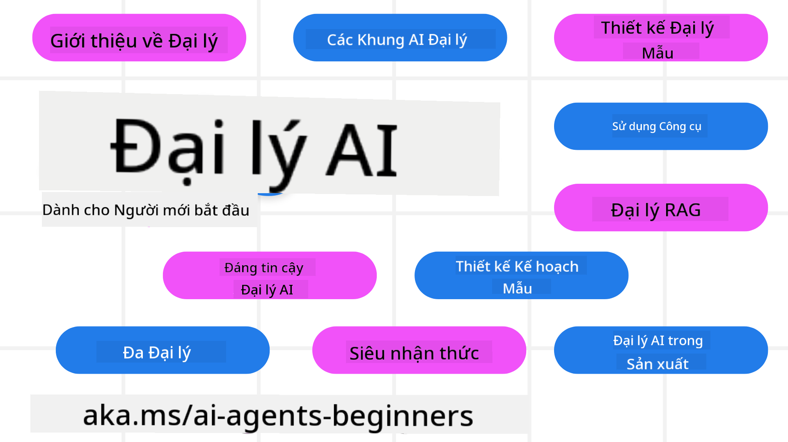

<!--
CO_OP_TRANSLATOR_METADATA:
{
  "original_hash": "6b07046397366e6f6f4524c9ddeba1e1",
  "translation_date": "2025-07-12T14:55:45+00:00",
  "source_file": "README.md",
  "language_code": "vi"
}
-->
# AI Agents cho Người Mới Bắt Đầu - Một Khóa Học

## 11 Bài Học dạy tất cả những gì bạn cần biết để bắt đầu xây dựng AI Agents

  
  
  
  

### 🌐 Hỗ Trợ Đa Ngôn Ngữ

#### Hỗ trợ qua GitHub Action (Tự động & Luôn Cập Nhật)

[French](../fr/README.md) | [Spanish](../es/README.md) | [German](../de/README.md) | [Russian](../ru/README.md) | [Arabic](../ar/README.md) | [Persian (Farsi)](../fa/README.md) | [Urdu](../ur/README.md) | [Chinese (Simplified)](../zh/README.md) | [Chinese (Traditional, Macau)](../mo/README.md) | [Chinese (Traditional, Hong Kong)](../hk/README.md) | [Chinese (Traditional, Taiwan)](../tw/README.md) | [Japanese](../ja/README.md) | [Korean](../ko/README.md) | [Hindi](../hi/README.md) | [Bengali](../bn/README.md) | [Marathi](../mr/README.md) | [Nepali](../ne/README.md) | [Punjabi (Gurmukhi)](../pa/README.md) | [Portuguese (Portugal)](../pt/README.md) | [Portuguese (Brazil)](../br/README.md) | [Italian](../it/README.md) | [Polish](../pl/README.md) | [Turkish](../tr/README.md) | [Greek](../el/README.md) | [Thai](../th/README.md) | [Swedish](../sv/README.md) | [Danish](../da/README.md) | [Norwegian](../no/README.md) | [Finnish](../fi/README.md) | [Dutch](../nl/README.md) | [Hebrew](../he/README.md) | [Vietnamese](./README.md) | [Indonesian](../id/README.md) | [Malay](../ms/README.md) | [Tagalog (Filipino)](../tl/README.md) | [Swahili](../sw/README.md) | [Hungarian](../hu/README.md) | [Czech](../cs/README.md) | [Slovak](../sk/README.md) | [Romanian](../ro/README.md) | [Bulgarian](../bg/README.md) | [Serbian (Cyrillic)](../sr/README.md) | [Croatian](../hr/README.md) | [Slovenian](../sl/README.md) | [Ukrainian](../uk/README.md) | [Burmese (Myanmar)](../my/README.md)

**Nếu bạn muốn có thêm các ngôn ngữ dịch khác, danh sách hỗ trợ có tại [đây](https://github.com/Azure/co-op-translator/blob/main/getting_started/supported-languages.md)**

  
  

## 🌱 Bắt Đầu

Khóa học này gồm 11 bài học bao quát các kiến thức cơ bản để xây dựng AI Agents. Mỗi bài học tập trung vào một chủ đề riêng, bạn có thể bắt đầu từ bất cứ bài nào bạn muốn!

Khóa học hỗ trợ đa ngôn ngữ. Xem các [ngôn ngữ có sẵn tại đây](../..).

Nếu đây là lần đầu bạn xây dựng với các mô hình Generative AI, hãy tham khảo khóa học [Generative AI For Beginners](https://aka.ms/genai-beginners), gồm 21 bài học về cách xây dựng với GenAI.

Đừng quên [thả sao (🌟) cho repo này](https://docs.github.com/en/get-started/exploring-projects-on-github/saving-repositories-with-stars?WT.mc_id=academic-105485-koreyst) và [fork repo này](https://github.com/microsoft/ai-agents-for-beginners/fork) để chạy mã.

### Những gì bạn cần

Mỗi bài học trong khóa học đều có ví dụ mã, bạn có thể tìm thấy trong thư mục code_samples. Bạn có thể [fork repo này](https://github.com/microsoft/ai-agents-for-beginners/fork) để tạo bản sao của riêng mình.

Ví dụ mã trong các bài tập này sử dụng Azure AI Foundry và GitHub Model Catalogs để tương tác với các Language Models:

- [Github Models](https://aka.ms/ai-agents-beginners/github-models) - Miễn phí / Giới hạn  
- [Azure AI Foundry](https://aka.ms/ai-agents-beginners/ai-foundry) - Cần tài khoản Azure

Khóa học cũng sử dụng các framework và dịch vụ AI Agent sau từ Microsoft:

- [Azure AI Agent Service](https://aka.ms/ai-agents-beginners/ai-agent-service)  
- [Semantic Kernel](https://aka.ms/ai-agents-beginners/semantic-kernel)  
- [AutoGen](https://aka.ms/ai-agents/autogen)

Để biết thêm thông tin về cách chạy mã cho khóa học này, xem phần [Course Setup](./00-course-setup/README.md).

## 🙏 Muốn giúp đỡ?

Bạn có góp ý hoặc phát hiện lỗi chính tả hay lỗi mã? [Tạo issue](https://github.com/microsoft/ai-agents-for-beginners/issues?WT.mc_id=academic-105485-koreyst) hoặc [Gửi pull request](https://github.com/microsoft/ai-agents-for-beginners/pulls?WT.mc_id=academic-105485-koreyst)

Nếu bạn gặp khó khăn hoặc có câu hỏi về việc xây dựng AI Agents, hãy tham gia [Azure AI Foundry Community Discord](https://discord.gg/kzRShWzttr)

Nếu bạn có phản hồi về sản phẩm hoặc lỗi trong quá trình xây dựng, hãy truy cập [Azure AI Foundry Developer Forum](https://aka.ms/azureaifoundry/forum)

## 📂 Mỗi bài học bao gồm

- Bài học viết trong README và video ngắn  
- Ví dụ mã Python hỗ trợ Azure AI Foundry và Github Models (Miễn phí)  
- Liên kết đến tài nguyên bổ sung để tiếp tục học tập

## 🗃️ Các bài học

| **Bài học**                              | **Văn bản & Mã**                                   | **Video**                                                  | **Tài nguyên học thêm**                                                               |
|------------------------------------------|----------------------------------------------------|------------------------------------------------------------|----------------------------------------------------------------------------------------|
| Giới thiệu về AI Agents và các trường hợp sử dụng | [Link](./01-intro-to-ai-agents/README.md)          | [Video](https://youtu.be/3zgm60bXmQk?si=z8QygFvYQv-9WtO1)  | [Link](https://aka.ms/ai-agents-beginners/collection?WT.mc_id=academic-105485-koreyst) |
| Khám phá các framework AI Agentic         | [Link](./02-explore-agentic-frameworks/README.md)  | [Video](https://youtu.be/ODwF-EZo_O8?si=Vawth4hzVaHv-u0H)  | [Link](https://aka.ms/ai-agents-beginners/collection?WT.mc_id=academic-105485-koreyst) |
| Hiểu về các mẫu thiết kế AI Agentic       | [Link](./03-agentic-design-patterns/README.md)     | [Video](https://youtu.be/m9lM8qqoOEA?si=BIzHwzstTPL8o9GF)  | [Link](https://aka.ms/ai-agents-beginners/collection?WT.mc_id=academic-105485-koreyst) |
| Mẫu thiết kế sử dụng công cụ              | [Link](./04-tool-use/README.md)                    | [Video](https://youtu.be/vieRiPRx-gI?si=2z6O2Xu2cu_Jz46N)  | [Link](https://aka.ms/ai-agents-beginners/collection?WT.mc_id=academic-105485-koreyst) |
| Agentic RAG                              | [Link](./05-agentic-rag/README.md)                 | [Video](https://youtu.be/WcjAARvdL7I?si=gKPWsQpKiIlDH9A3)  | [Link](https://aka.ms/ai-agents-beginners/collection?WT.mc_id=academic-105485-koreyst) |
| Xây dựng AI Agents đáng tin cậy           | [Link](./06-building-trustworthy-agents/README.md) | [Video](https://youtu.be/iZKkMEGBCUQ?si=jZjpiMnGFOE9L8OK ) | [Link](https://aka.ms/ai-agents-beginners/collection?WT.mc_id=academic-105485-koreyst) |
| Mẫu thiết kế lập kế hoạch                  | [Link](./07-planning-design/README.md)             | [Video](https://youtu.be/kPfJ2BrBCMY?si=6SC_iv_E5-mzucnC)  | [Link](https://aka.ms/ai-agents-beginners/collection?WT.mc_id=academic-105485-koreyst) |
| Mẫu thiết kế đa tác nhân                   | [Link](./08-multi-agent/README.md)                 | [Video](https://youtu.be/V6HpE9hZEx0?si=rMgDhEu7wXo2uo6g)  | [Link](https://aka.ms/ai-agents-beginners/collection?WT.mc_id=academic-105485-koreyst) |
| Mẫu thiết kế siêu nhận thức (Metacognition) | [Link](./09-metacognition/README.md)               | [Video](https://youtu.be/His9R6gw6Ec?si=8gck6vvdSNCt6OcF)  | [Link](https://aka.ms/ai-agents-beginners/collection?WT.mc_id=academic-105485-koreyst) |
| AI Agents trong môi trường sản xuất        | [Link](./10-ai-agents-production/README.md)        | [Video](https://youtu.be/l4TP6IyJxmQ?si=31dnhexRo6yLRJDl)  | [Link](https://aka.ms/ai-agents-beginners/collection?WT.mc_id=academic-105485-koreyst) |
| AI Agents với MCP                         | [Link](./11-mcp/README.md)                         |                                                            | [Link](https://aka.ms/mcp-for-beginners)                                               |

## 🎒 Các Khóa Học Khác

Nhóm của chúng tôi còn sản xuất các khóa học khác! Hãy xem:
- [**MỚI** Giao thức Ngữ cảnh Mô hình (MCP) dành cho Người mới bắt đầu](https://github.com/microsoft/mcp-for-beginners?WT.mc_id=academic-105485-koreyst)
- [AI Tạo sinh cho Người mới bắt đầu sử dụng .NET](https://github.com/microsoft/Generative-AI-for-beginners-dotnet?WT.mc_id=academic-105485-koreyst)
- [AI Tạo sinh cho Người mới bắt đầu](https://github.com/microsoft/generative-ai-for-beginners?WT.mc_id=academic-105485-koreyst)
- [ML cho Người mới bắt đầu](https://aka.ms/ml-beginners?WT.mc_id=academic-105485-koreyst)
- [Khoa học Dữ liệu cho Người mới bắt đầu](https://aka.ms/datascience-beginners?WT.mc_id=academic-105485-koreyst)
- [AI cho Người mới bắt đầu](https://aka.ms/ai-beginners?WT.mc_id=academic-105485-koreyst)
- [An ninh mạng cho Người mới bắt đầu](https://github.com/microsoft/Security-101??WT.mc_id=academic-96948-sayoung)
- [Phát triển Web cho Người mới bắt đầu](https://aka.ms/webdev-beginners?WT.mc_id=academic-105485-koreyst)
- [IoT cho Người mới bắt đầu](https://aka.ms/iot-beginners?WT.mc_id=academic-105485-koreyst)
- [Phát triển XR cho Người mới bắt đầu](https://github.com/microsoft/xr-development-for-beginners?WT.mc_id=academic-105485-koreyst)
- [Làm chủ GitHub Copilot cho Lập trình AI Đôi](https://aka.ms/GitHubCopilotAI?WT.mc_id=academic-105485-koreyst)
- [Làm chủ GitHub Copilot cho Nhà phát triển C#/.NET](https://github.com/microsoft/mastering-github-copilot-for-dotnet-csharp-developers?WT.mc_id=academic-105485-koreyst)
- [Chọn Cuộc phiêu lưu Copilot của riêng bạn](https://github.com/microsoft/CopilotAdventures?WT.mc_id=academic-105485-koreyst)

## 🌟 Lời cảm ơn từ Cộng đồng

Cảm ơn [Shivam Goyal](https://www.linkedin.com/in/shivam2003/) đã đóng góp các mẫu mã quan trọng minh họa cho Agentic RAG.

## Đóng góp

Dự án này hoan nghênh các đóng góp và đề xuất. Hầu hết các đóng góp yêu cầu bạn đồng ý với
Thỏa thuận Cấp phép Đóng góp (CLA) xác nhận rằng bạn có quyền và thực sự cấp cho chúng tôi
quyền sử dụng đóng góp của bạn. Chi tiết xem tại
<https://cla.opensource.microsoft.com>.

Khi bạn gửi pull request, một bot CLA sẽ tự động xác định xem bạn có cần cung cấp
CLA hay không và đánh dấu PR phù hợp (ví dụ: kiểm tra trạng thái, bình luận). Chỉ cần làm theo hướng dẫn
do bot cung cấp. Bạn chỉ cần làm việc này một lần cho tất cả các kho lưu trữ sử dụng CLA của chúng tôi.

Dự án này đã áp dụng [Bộ Quy tắc Ứng xử Mã nguồn Mở của Microsoft](https://opensource.microsoft.com/codeofconduct/).
Để biết thêm thông tin, xem [Câu hỏi thường gặp về Bộ Quy tắc Ứng xử](https://opensource.microsoft.com/codeofconduct/faq/) hoặc
liên hệ [opencode@microsoft.com](mailto:opencode@microsoft.com) nếu có câu hỏi hoặc góp ý thêm.

## Nhãn hiệu

Dự án này có thể chứa nhãn hiệu hoặc logo của các dự án, sản phẩm hoặc dịch vụ. Việc sử dụng nhãn hiệu hoặc logo Microsoft được ủy quyền phải tuân theo
[Hướng dẫn Nhãn hiệu & Thương hiệu của Microsoft](https://www.microsoft.com/legal/intellectualproperty/trademarks/usage/general).
Việc sử dụng nhãn hiệu hoặc logo Microsoft trong các phiên bản sửa đổi của dự án này không được gây nhầm lẫn hoặc ngụ ý Microsoft tài trợ.
Việc sử dụng nhãn hiệu hoặc logo của bên thứ ba phải tuân theo chính sách của các bên đó.

**Tuyên bố từ chối trách nhiệm**:  
Tài liệu này đã được dịch bằng dịch vụ dịch thuật AI [Co-op Translator](https://github.com/Azure/co-op-translator). Mặc dù chúng tôi cố gắng đảm bảo độ chính xác, xin lưu ý rằng các bản dịch tự động có thể chứa lỗi hoặc không chính xác. Tài liệu gốc bằng ngôn ngữ gốc của nó nên được coi là nguồn chính xác và đáng tin cậy. Đối với các thông tin quan trọng, nên sử dụng dịch vụ dịch thuật chuyên nghiệp do con người thực hiện. Chúng tôi không chịu trách nhiệm về bất kỳ sự hiểu lầm hoặc giải thích sai nào phát sinh từ việc sử dụng bản dịch này.