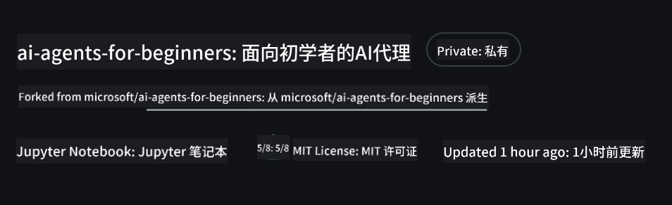
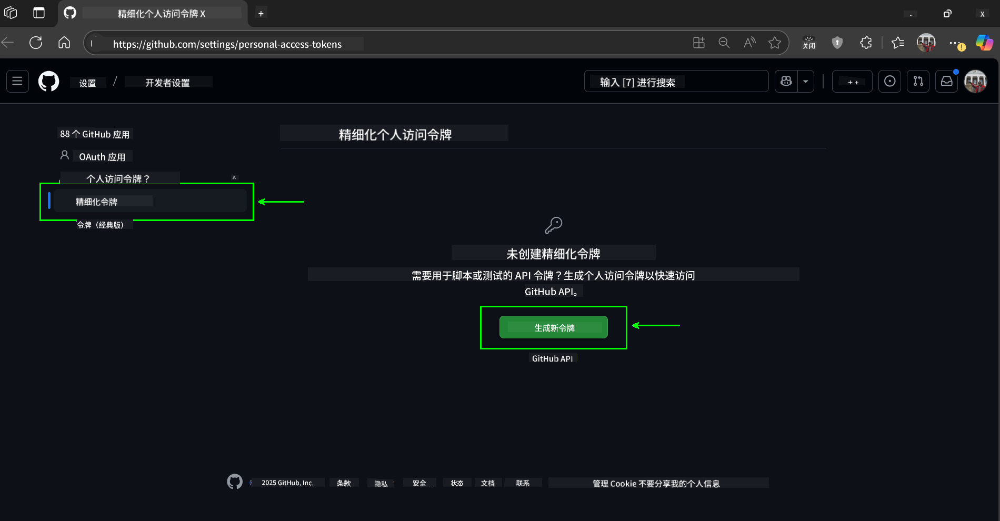
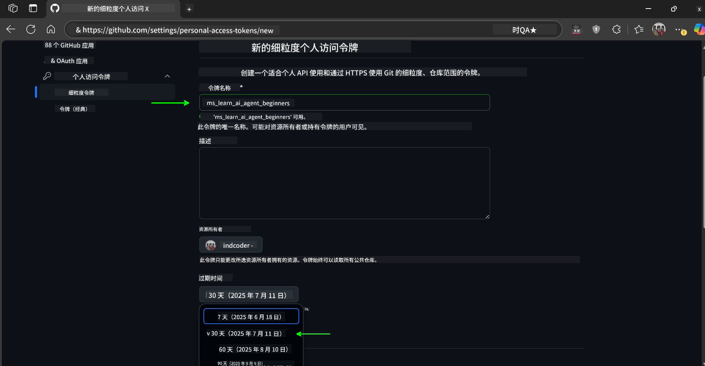
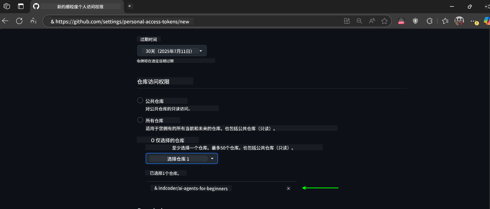
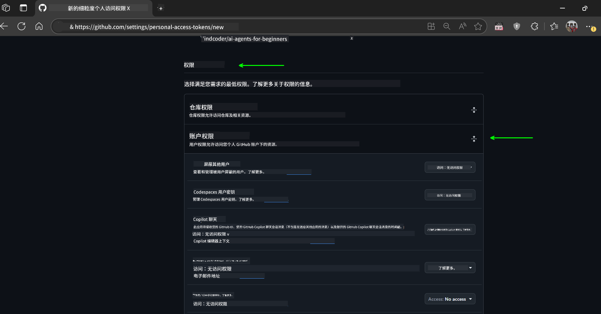
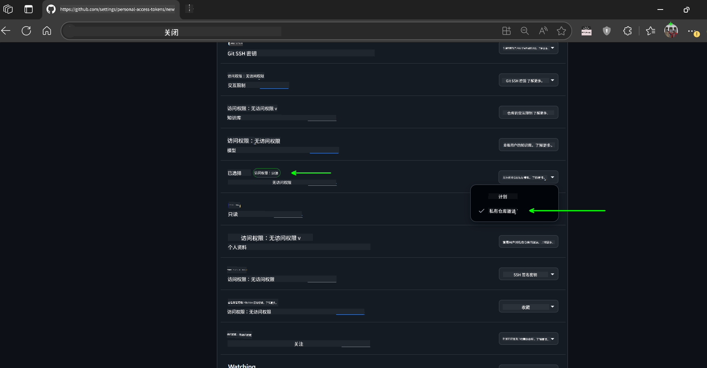
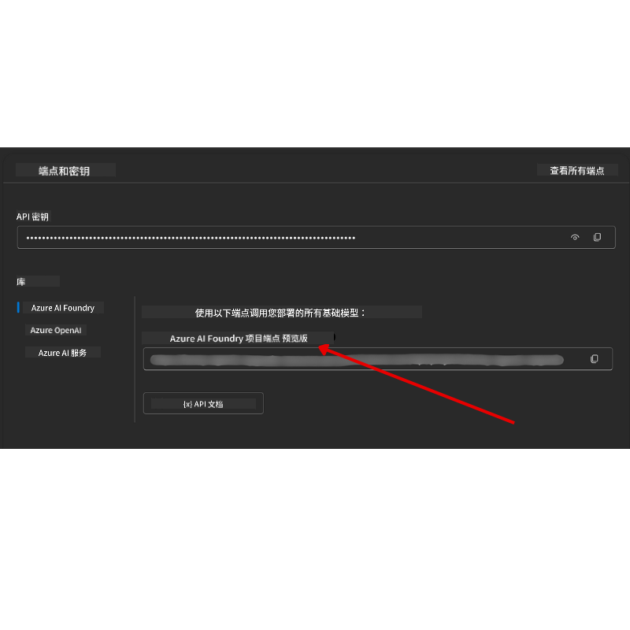

<!--
CO_OP_TRANSLATOR_METADATA:
{
  "original_hash": "c6a79c8f2b56a80370ff7e447765524f",
  "translation_date": "2025-07-23T08:16:14+00:00",
  "source_file": "00-course-setup/README.md",
  "language_code": "zh"
}
-->
# 课程设置

## 介绍

本课将讲解如何运行本课程的代码示例。

## 克隆或派生此仓库

首先，请克隆或派生 GitHub 仓库。这将创建您自己的课程材料副本，以便您可以运行、测试和调整代码！

您可以通过点击链接来完成此操作：



## 运行代码

本课程提供了一系列 Jupyter Notebooks，您可以通过它们亲身体验构建 AI Agent 的过程。

代码示例使用以下工具：

**需要 GitHub 账户（免费）**：

1. Semantic Kernel Agent Framework + GitHub Models Marketplace，标记为 (semantic-kernel.ipynb)
2. AutoGen Framework + GitHub Models Marketplace，标记为 (autogen.ipynb)

**需要 Azure 订阅**：
3. Azure AI Foundry + Azure AI Agent Service，标记为 (azureaiagent.ipynb)

我们鼓励您尝试所有三种示例，看看哪种最适合您。

无论您选择哪种选项，都将决定您需要遵循以下哪些设置步骤：

## 要求

- Python 3.12+
  - **注意**：如果您尚未安装 Python 3.12，请确保安装它。然后使用 python3.12 创建虚拟环境，以确保从 requirements.txt 文件中安装正确的版本。
- GitHub 账户 - 用于访问 GitHub Models Marketplace
- Azure 订阅 - 用于访问 Azure AI Foundry
- Azure AI Foundry 账户 - 用于访问 Azure AI Agent Service

我们在此仓库的根目录中包含了一个 `requirements.txt` 文件，其中列出了运行代码示例所需的所有 Python 包。

您可以在终端中运行以下命令来安装它们：

```bash
pip install -r requirements.txt
```

我们建议创建一个 Python 虚拟环境以避免任何冲突和问题。

## 设置 VSCode

确保您在 VSCode 中使用正确版本的 Python。


## 使用 GitHub 模型的示例设置

### 第一步：获取您的 GitHub 个人访问令牌（PAT）

本课程利用 GitHub Models Marketplace，提供免费访问大型语言模型（LLMs）的权限，您将使用这些模型来构建 AI Agent。

要使用 GitHub 模型，您需要创建一个 [GitHub 个人访问令牌](https://docs.github.com/en/authentication/keeping-your-account-and-data-secure/managing-your-personal-access-tokens)。

您可以通过访问您的 GitHub 账户来完成此操作。

请在创建令牌时遵循 [最小权限原则](https://docs.github.com/en/get-started/learning-to-code/storing-your-secrets-safely)。这意味着您应该仅为令牌分配运行本课程代码示例所需的权限。

1. 在屏幕左侧选择 `Fine-grained tokens` 选项。

    然后选择 `Generate new token`。

    

1. 为您的令牌输入一个描述性名称，反映其用途，以便日后容易识别。设置一个过期日期（推荐：30 天；如果您希望更安全，可以选择更短的期限，例如 7 天）。

    

1. 将令牌的作用域限制为您派生的此仓库。

    

1. 限制令牌的权限：在 **Permissions** 下，切换到 **Account Permissions**，找到 **Models**，并仅启用 GitHub 模型所需的读取权限。

    

    

复制您刚刚创建的新令牌。接下来，您需要将其添加到本课程包含的 `.env` 文件中。

### 第二步：创建您的 `.env` 文件

在终端中运行以下命令以创建 `.env` 文件：

```bash
cp .env.example .env
```

这将复制示例文件并在您的目录中创建一个 `.env` 文件，您需要在其中填写环境变量的值。

复制令牌后，使用您喜欢的文本编辑器打开 `.env` 文件，并将令牌粘贴到 `GITHUB_TOKEN` 字段中。

现在，您应该能够运行本课程的代码示例了。

## 使用 Azure AI Foundry 和 Azure AI Agent Service 的示例设置

### 第一步：获取您的 Azure 项目端点

按照以下步骤在 Azure AI Foundry 中创建一个 Hub 和项目：[Hub 资源概述](https://learn.microsoft.com/en-us/azure/ai-foundry/concepts/ai-resources)

创建项目后，您需要获取项目的连接字符串。

您可以通过访问 Azure AI Foundry 门户中项目的 **概览** 页面来完成此操作。



### 第二步：创建您的 `.env` 文件

在终端中运行以下命令以创建 `.env` 文件：

```bash
cp .env.example .env
```

这将复制示例文件并在您的目录中创建一个 `.env` 文件，您需要在其中填写环境变量的值。

复制令牌后，使用您喜欢的文本编辑器打开 `.env` 文件，并将令牌粘贴到 `PROJECT_ENDPOINT` 字段中。

### 第三步：登录 Azure

作为安全最佳实践，我们将使用 [无密钥认证](https://learn.microsoft.com/azure/developer/ai/keyless-connections?tabs=csharp%2Cazure-cli?WT.mc_id=academic-105485-koreyst) 来通过 Microsoft Entra ID 认证到 Azure OpenAI。

接下来，打开终端并运行 `az login --use-device-code` 以登录到您的 Azure 账户。

登录后，在终端中选择您的订阅。

## 其他环境变量 - Azure Search 和 Azure OpenAI

对于 Agentic RAG 课程 - 第 5 课，有一些示例使用了 Azure Search 和 Azure OpenAI。

如果您想运行这些示例，您需要将以下环境变量添加到 `.env` 文件中：

### 概览页面（项目）

- `AZURE_SUBSCRIPTION_ID` - 在项目的 **概览** 页面下查看 **项目详情**。
- `AZURE_AI_PROJECT_NAME` - 查看项目 **概览** 页顶部的项目名称。
- `AZURE_OPENAI_SERVICE` - 在 **概览** 页的 **包含的功能** 选项卡中找到 **Azure OpenAI Service**。

### 管理中心

- `AZURE_OPENAI_RESOURCE_GROUP` - 在 **管理中心** 的 **概览** 页中，转到 **项目属性**。
- `GLOBAL_LLM_SERVICE` - 在 **连接的资源** 下，找到 **Azure AI Services** 的连接名称。如果未列出，请检查 **Azure 门户** 中资源组下的 AI 服务资源名称。

### 模型 + 端点页面

- `AZURE_OPENAI_EMBEDDING_DEPLOYMENT_NAME` - 选择您的嵌入模型（例如 `text-embedding-ada-002`），并记录模型详情中的 **部署名称**。
- `AZURE_OPENAI_CHAT_DEPLOYMENT_NAME` - 选择您的聊天模型（例如 `gpt-4o-mini`），并记录模型详情中的 **部署名称**。

### Azure 门户

- `AZURE_OPENAI_ENDPOINT` - 查找 **Azure AI 服务**，点击它，然后转到 **资源管理**，选择 **密钥和端点**，向下滚动到 "Azure OpenAI endpoints"，复制标注为 "Language APIs" 的端点。
- `AZURE_OPENAI_API_KEY` - 在同一页面，复制 KEY 1 或 KEY 2。
- `AZURE_SEARCH_SERVICE_ENDPOINT` - 找到您的 **Azure AI Search** 资源，点击它，然后查看 **概览**。
- `AZURE_SEARCH_API_KEY` - 然后转到 **设置**，选择 **密钥**，复制主密钥或次密钥。

### 外部网页

- `AZURE_OPENAI_API_VERSION` - 访问 [API 版本生命周期](https://learn.microsoft.com/en-us/azure/ai-services/openai/api-version-deprecation#latest-ga-api-release) 页面，查看 **最新 GA API 发布**。

### 设置无密钥认证

为了避免硬编码您的凭据，我们将使用 Azure OpenAI 的无密钥连接。为此，我们将导入 `DefaultAzureCredential`，稍后调用 `DefaultAzureCredential` 函数获取凭据。

```python
from azure.identity import DefaultAzureCredential, InteractiveBrowserCredential
```

## 遇到问题？

如果您在运行设置时遇到任何问题，请加入我们的

## 下一课

现在，您已经准备好运行本课程的代码了。祝您在探索 AI Agent 世界的学习旅程中收获满满！

[AI Agent 和 Agent 用例简介](../01-intro-to-ai-agents/README.md)

**免责声明**：  
本文档使用AI翻译服务 [Co-op Translator](https://github.com/Azure/co-op-translator) 进行翻译。尽管我们努力确保翻译的准确性，但请注意，自动翻译可能包含错误或不准确之处。原始语言的文档应被视为权威来源。对于重要信息，建议使用专业人工翻译。我们不对因使用此翻译而产生的任何误解或误读承担责任。