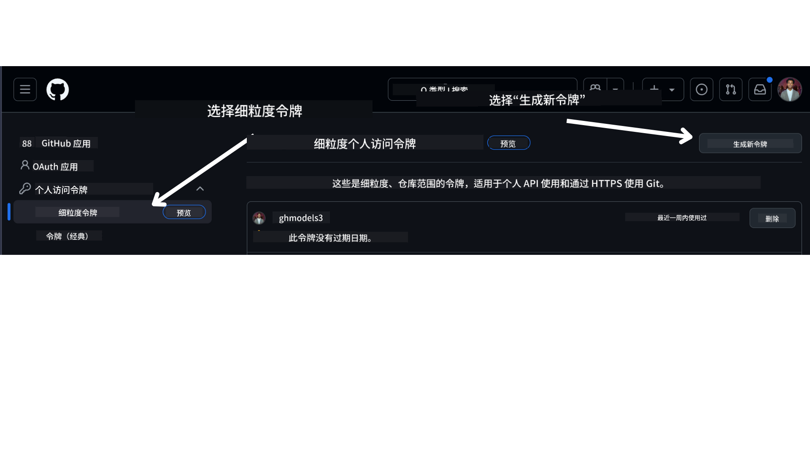

<!--
CO_OP_TRANSLATOR_METADATA:
{
  "original_hash": "76945069b52a49cd0432ae3e0b0ba22e",
  "translation_date": "2025-07-12T07:44:47+00:00",
  "source_file": "00-course-setup/README.md",
  "language_code": "zh"
}
-->
在你的 GitHub 账户中。

在屏幕左侧选择 `Fine-grained tokens` 选项。

然后选择 `Generate new token`。



系统会提示你输入令牌名称，选择过期时间（推荐：30 天），并选择令牌的权限范围（Public Repositories）。

还需要编辑此令牌的权限：Permissions -> Models -> 允许访问 GitHub Models

复制你刚刚创建的新令牌。接下来你需要将其添加到本课程包含的 `.env` 文件中。

### 第 2 步：创建你的 `.env` 文件

在终端中运行以下命令来创建 `.env` 文件。

```bash
cp .env.example .env
```

这会复制示例文件并在你的目录中创建一个 `.env` 文件，你可以在其中填写环境变量的值。

复制令牌后，使用你喜欢的文本编辑器打开 `.env` 文件，将令牌粘贴到 `GITHUB_TOKEN` 字段中。

现在你应该可以运行本课程的代码示例了。

## 使用 Azure AI Foundry 和 Azure AI Agent Service 的示例设置

### 第 1 步：获取你的 Azure 项目端点

按照这里的步骤创建 Azure AI Foundry 中的 hub 和项目：[Hub resources overview](https://learn.microsoft.com/en-us/azure/ai-foundry/concepts/ai-resources)

创建项目后，你需要获取项目的连接字符串。

可以在 Azure AI Foundry 门户中项目的 **Overview** 页面找到。


### 第 2 步：创建你的 `.env` 文件

在终端中运行以下命令来创建 `.env` 文件。

```bash
cp .env.example .env
```

这会复制示例文件并在你的目录中创建一个 `.env` 文件，你可以在其中填写环境变量的值。

复制连接字符串后，使用你喜欢的文本编辑器打开 `.env` 文件，将其粘贴到 `PROJECT_ENDPOINT` 字段中。

### 第 3 步：登录 Azure

作为安全最佳实践，我们将使用 [无密钥认证](https://learn.microsoft.com/azure/developer/ai/keyless-connections?tabs=csharp%2Cazure-cli?WT.mc_id=academic-105485-koreyst) 通过 Microsoft Entra ID 认证 Azure OpenAI。在此之前，你需要根据你的操作系统按照[安装说明](https://learn.microsoft.com/cli/azure/install-azure-cli?WT.mc_id=academic-105485-koreyst)安装 **Azure CLI**。

然后打开终端，运行 `az login --use-device-code` 登录你的 Azure 账户。

登录后，在终端中选择你的订阅。

## 额外环境变量 - Azure Search 和 Azure OpenAI

在 Agentic RAG 课程 - 第 5 课中，有使用 Azure Search 和 Azure OpenAI 的示例。

如果你想运行这些示例，需要将以下环境变量添加到你的 `.env` 文件中：

### 概览页面（项目）

- `AZURE_SUBSCRIPTION_ID` - 在项目的 **Overview** 页面的 **Project details** 中查看。

- `AZURE_AI_PROJECT_NAME` - 在项目 **Overview** 页面的顶部查看。

- `AZURE_OPENAI_SERVICE` - 在 **Overview** 页面的 **Included capabilities** 标签下找到 **Azure OpenAI Service**。

### 管理中心

- `AZURE_OPENAI_RESOURCE_GROUP` - 在 **Management Center** 的 **Overview** 页面的 **Project properties** 中查看。

- `GLOBAL_LLM_SERVICE` - 在 **Connected resources** 下找到 **Azure AI Services** 的连接名称。如果未列出，请在 Azure 门户中你的资源组下查找 AI Services 资源名称。

### 模型 + 端点页面

- `AZURE_OPENAI_EMBEDDING_DEPLOYMENT_NAME` - 选择你的嵌入模型（例如 `text-embedding-ada-002`），并记下模型详情中的 **Deployment name**。

- `AZURE_OPENAI_CHAT_DEPLOYMENT_NAME` - 选择你的聊天模型（例如 `gpt-4o-mini`），并记下模型详情中的 **Deployment name**。

### Azure 门户

- `AZURE_OPENAI_ENDPOINT` - 找到 **Azure AI services**，点击进入，然后进入 **Resource Management** -> **Keys and Endpoint**，向下滚动到 “Azure OpenAI endpoints”，复制标注为 “Language APIs” 的地址。

- `AZURE_OPENAI_API_KEY` - 在同一页面复制 KEY 1 或 KEY 2。

- `AZURE_SEARCH_SERVICE_ENDPOINT` - 找到你的 **Azure AI Search** 资源，点击进入，查看 **Overview**。

- `AZURE_SEARCH_API_KEY` - 进入 **Settings**，然后 **Keys**，复制主密钥或备用管理员密钥。

### 外部网页

- `AZURE_OPENAI_API_VERSION` - 访问 [API 版本生命周期](https://learn.microsoft.com/en-us/azure/ai-services/openai/api-version-deprecation#latest-ga-api-release) 页面中的 **Latest GA API release**。

### 设置无密钥认证

我们不会将凭据硬编码，而是使用 Azure OpenAI 的无密钥连接。为此，我们将导入 `DefaultAzureCredential`，并在后续调用 `DefaultAzureCredential` 函数获取凭据。

```python
from azure.identity import DefaultAzureCredential, InteractiveBrowserCredential
```

## 遇到问题？

如果你在运行此设置时遇到任何问题，可以加入我们的

或

。

## 下一课

你现在已经准备好运行本课程的代码了。祝你在 AI 代理的世界中学习愉快！

[AI 代理及其应用介绍](../01-intro-to-ai-agents/README.md)

**免责声明**：  
本文件使用 AI 翻译服务 [Co-op Translator](https://github.com/Azure/co-op-translator) 进行翻译。虽然我们力求准确，但请注意，自动翻译可能包含错误或不准确之处。原始语言的原文应被视为权威来源。对于重要信息，建议采用专业人工翻译。对于因使用本翻译而产生的任何误解或误释，我们不承担任何责任。