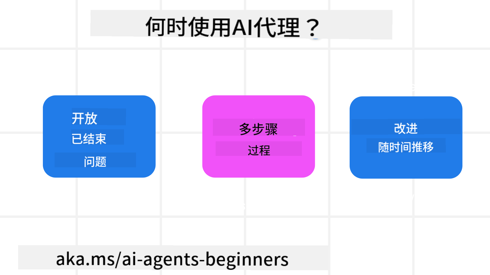

<!--
CO_OP_TRANSLATOR_METADATA:
{
  "original_hash": "1e40fe956ff79462a02a17080b125041",
  "translation_date": "2025-08-28T09:03:01+00:00",
  "source_file": "01-intro-to-ai-agents/README.md",
  "language_code": "zh"
}
-->

> _(点击上方图片观看本课视频)_

# AI代理及其应用场景简介

欢迎来到“AI代理入门”课程！本课程提供构建AI代理的基础知识和应用示例。

加入[Azure AI Foundry Discord](https://aka.ms/ai-agents/discord)，与其他学习者和AI代理开发者交流，并提出您对本课程的任何问题。

开始本课程之前，我们将首先了解什么是AI代理，以及如何在我们构建的应用程序和工作流程中使用它们。

## 简介

本课内容包括：

- 什么是AI代理？有哪些不同类型的代理？
- 哪些应用场景最适合AI代理？它们如何帮助我们？
- 设计代理解决方案时的一些基本构建模块是什么？

## 学习目标

完成本课后，您应该能够：

- 理解AI代理的概念及其与其他AI解决方案的区别。
- 高效应用AI代理。
- 为用户和客户设计高效的代理解决方案。

## 定义AI代理及其类型

### 什么是AI代理？

AI代理是**系统**，通过为**大型语言模型（LLMs）**提供**工具**和**知识**的访问权限，使其能够**执行操作**并扩展其能力。

让我们将这个定义拆分为几个部分：

- **系统** - 重要的是将代理视为由多个组件组成的系统，而不是单一组件。AI代理的基本组件包括：
  - **环境** - AI代理运行的定义空间。例如，如果我们有一个旅行预订AI代理，环境可能是代理用来完成任务的旅行预订系统。
  - **传感器** - 环境提供信息和反馈。AI代理使用传感器收集并解释环境当前状态的信息。在旅行预订代理的例子中，旅行预订系统可以提供酒店可用性或航班价格等信息。
  - **执行器** - 一旦AI代理接收到环境的当前状态，代理会根据当前任务决定执行哪些操作来改变环境。对于旅行预订代理来说，这可能是为用户预订一个可用的房间。

**大型语言模型** - 代理的概念在LLMs出现之前就已经存在。使用LLMs构建AI代理的优势在于它们能够解释人类语言和数据。这种能力使LLMs能够解释环境信息并制定改变环境的计划。

**执行操作** - 在AI代理系统之外，LLMs的操作通常局限于根据用户的提示生成内容或信息。在AI代理系统内，LLMs可以通过解释用户请求并使用环境中可用的工具来完成任务。

**工具访问权限** - LLM可以访问的工具由以下两点决定：1）它运行的环境，2）AI代理开发者。例如，在我们的旅行代理案例中，代理的工具可能仅限于预订系统中的操作，或者开发者可以限制代理的工具访问权限，例如仅限于航班预订。

**记忆+知识** - 记忆可以是短期的，例如用户与代理之间的对话内容。长期来看，除了环境提供的信息外，AI代理还可以从其他系统、服务、工具甚至其他代理中检索知识。在旅行代理的例子中，这些知识可能是客户数据库中关于用户旅行偏好的信息。

### 不同类型的代理

现在我们已经了解了AI代理的一般定义，接下来我们看看一些具体的代理类型，以及它们如何应用于旅行预订AI代理。

| **代理类型**                  | **描述**                                                                                                                       | **示例**                                                                                                                                                                                                                   |
| ----------------------------- | ----------------------------------------------------------------------------------------------------------------------------- | ----------------------------------------------------------------------------------------------------------------------------------------------------------------------------------------------------------------------------- |
| **简单反射代理**              | 根据预定义规则执行即时操作。                                                                                                   | 旅行代理解释电子邮件内容，将旅行投诉转发给客户服务部门。                                                                                                                          |
| **基于模型的反射代理**        | 根据世界模型及其变化执行操作。                                                                                                 | 旅行代理根据访问的历史价格数据，优先处理价格显著变化的路线。                                                                                                             |
| **基于目标的代理**            | 通过解释目标并确定实现目标的行动来制定计划。                                                                                   | 旅行代理通过确定从当前位置到目的地所需的旅行安排（汽车、公共交通、航班）来预订行程。                                                                                |
| **基于效用的代理**            | 考虑偏好并通过数值权衡来确定如何实现目标。                                                                                     | 旅行代理在预订旅行时通过权衡便利性与成本来最大化效用。                                                                                                                                          |
| **学习型代理**                | 通过响应反馈并相应调整操作来不断改进。                                                                                         | 旅行代理通过使用客户在旅行后调查中的反馈来调整未来的预订，从而不断改进。                                                                                                               |
| **层级代理**                  | 包含多个代理的分层系统，高级代理将任务分解为子任务，由低级代理完成。                                                             | 旅行代理通过将取消行程的任务分解为子任务（例如取消具体预订），由低级代理完成并向高级代理报告。                                     |
| **多代理系统（MAS）**         | 代理独立完成任务，可以是合作的或竞争的。                                                                                       | 合作：多个代理预订具体的旅行服务，如酒店、航班和娱乐活动。竞争：多个代理管理并竞争共享的酒店预订日历，为客户预订酒店房间。 |

## 何时使用AI代理

在前面的部分中，我们使用旅行代理的应用场景来解释不同类型的代理如何在旅行预订的不同场景中使用。我们将在整个课程中继续使用这个应用场景。

让我们看看AI代理最适合的应用场景类型：

- **开放性问题** - 允许LLM确定完成任务所需的步骤，因为这些步骤无法总是硬编码到工作流程中。
- **多步骤流程** - 需要一定复杂度的任务，AI代理需要在多个回合中使用工具或信息，而不是单次检索。
- **持续改进** - 代理可以通过接收环境或用户的反馈不断改进，以提供更好的效用。

我们将在“构建可信赖的AI代理”课程中进一步探讨使用AI代理的更多考虑因素。

## 代理解决方案基础

### 代理开发

设计AI代理系统的第一步是定义工具、操作和行为。在本课程中，我们重点使用**Azure AI Agent Service**来定义我们的代理。它提供以下功能：

- 选择开放模型，如OpenAI、Mistral和Llama
- 使用Tripadvisor等提供商的授权数据
- 使用标准化的OpenAPI 3.0工具

### 代理模式

与LLM的通信是通过提示完成的。鉴于AI代理的半自主性质，在环境发生变化后并不总是可能或需要手动重新提示LLM。我们使用**代理模式**，允许我们以更可扩展的方式在多个步骤中提示LLM。

本课程分为一些当前流行的代理模式。

### 代理框架

代理框架允许开发者通过代码实现代理模式。这些框架提供模板、插件和工具，以便更好地协作AI代理。这些优势为AI代理系统提供了更好的可观察性和故障排除能力。

在本课程中，我们将探索以研究为驱动的AutoGen框架以及Semantic Kernel的生产级代理框架。

### 对AI代理有更多问题？

加入[Azure AI Foundry Discord](https://aka.ms/ai-agents/discord)，与其他学习者交流，参加办公时间，并解答您的AI代理相关问题。

## 上一课

[课程设置](../00-course-setup/README.md)

## 下一课

[探索代理框架](../02-explore-agentic-frameworks/README.md)

---

**免责声明**：  
本文档使用AI翻译服务[Co-op Translator](https://github.com/Azure/co-op-translator)进行翻译。尽管我们努力确保翻译的准确性，但请注意，自动翻译可能包含错误或不准确之处。原始语言的文档应被视为权威来源。对于关键信息，建议使用专业人工翻译。我们不对因使用此翻译而产生的任何误解或误读承担责任。