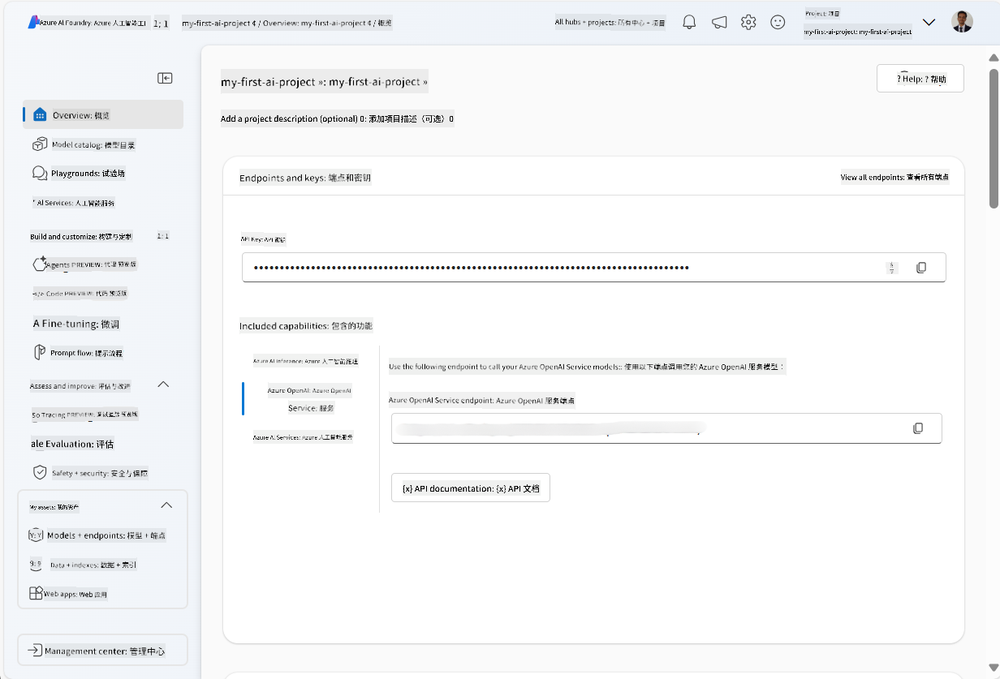
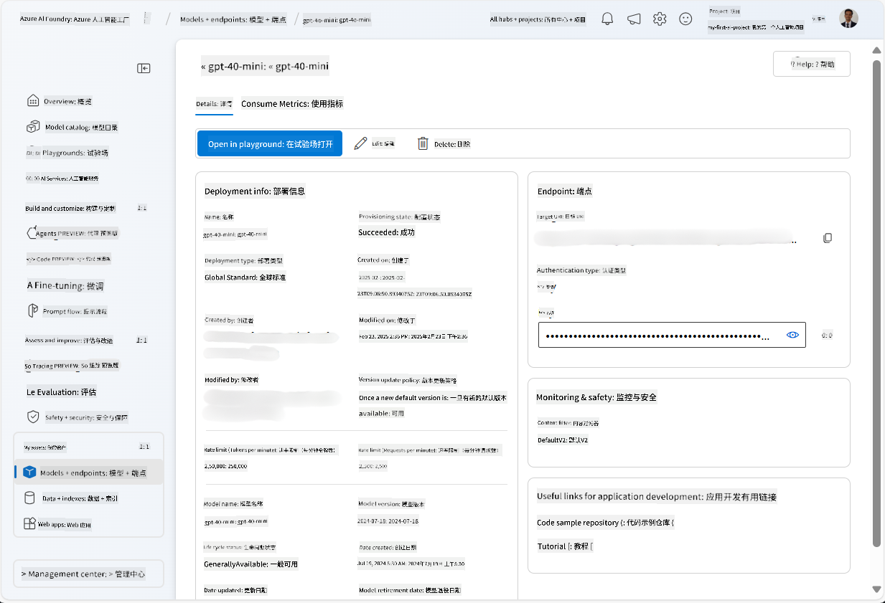
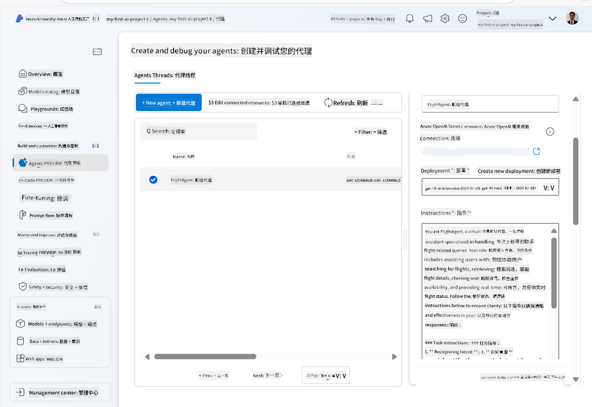
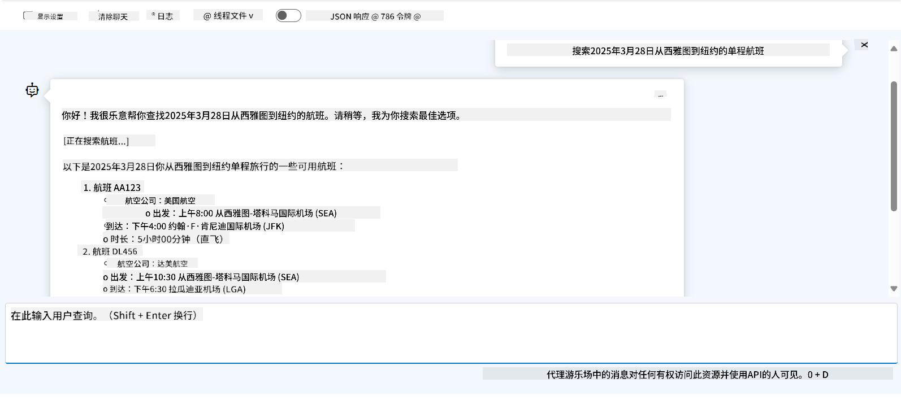

<!--
CO_OP_TRANSLATOR_METADATA:
{
  "original_hash": "7e92870dc0843e13d4dabc620c09d2d9",
  "translation_date": "2025-07-12T08:15:59+00:00",
  "source_file": "02-explore-agentic-frameworks/azure-ai-foundry-agent-creation.md",
  "language_code": "zh"
}
-->
# Azure AI Agent 服务开发

在本练习中，您将使用 [Azure AI Foundry 门户](https://ai.azure.com/?WT.mc_id=academic-105485-koreyst) 中的 Azure AI Agent 服务工具，创建一个用于航班预订的 agent。该 agent 能够与用户互动并提供航班相关信息。

## 前提条件

完成本练习，您需要具备以下条件：
1. 拥有一个带有有效订阅的 Azure 账户。[免费创建账户](https://azure.microsoft.com/free/?WT.mc_id=academic-105485-koreyst)。
2. 您需要有权限创建 Azure AI Foundry hub，或者已有人帮您创建好。
    - 如果您的角色是 Contributor 或 Owner，可以按照本教程中的步骤操作。

## 创建 Azure AI Foundry hub

> **Note:** Azure AI Foundry 之前称为 Azure AI Studio。

1. 按照 [Azure AI Foundry](https://learn.microsoft.com/en-us/azure/ai-studio/?WT.mc_id=academic-105485-koreyst) 博客文章中的指南创建 Azure AI Foundry hub。
2. 项目创建完成后，关闭任何弹出的提示，查看 Azure AI Foundry 门户中的项目页面，页面应类似下图：

    

## 部署模型

1. 在项目左侧面板的 **My assets** 部分，选择 **Models + endpoints** 页面。
2. 在 **Models + endpoints** 页面中，切换到 **Model deployments** 选项卡，点击 **+ Deploy model** 菜单，选择 **Deploy base model**。
3. 在列表中搜索 `gpt-4o-mini` 模型，选择并确认部署。

    > **Note**: 降低 TPM 有助于避免超出您订阅中可用的配额。

    

## 创建 agent

模型部署完成后，您可以创建 agent。agent 是一种对话式 AI 模型，可用于与用户交互。

1. 在项目左侧面板的 **Build & Customize** 部分，选择 **Agents** 页面。
2. 点击 **+ Create agent** 创建新 agent。在 **Agent Setup** 对话框中：
    - 输入 agent 名称，例如 `FlightAgent`。
    - 确认选择了之前创建的 `gpt-4o-mini` 模型部署。
    - 根据您希望 agent 遵循的提示设置 **Instructions**。示例如下：
    ```
    You are FlightAgent, a virtual assistant specialized in handling flight-related queries. Your role includes assisting users with searching for flights, retrieving flight details, checking seat availability, and providing real-time flight status. Follow the instructions below to ensure clarity and effectiveness in your responses:

    ### Task Instructions:
    1. **Recognizing Intent**:
       - Identify the user's intent based on their request, focusing on one of the following categories:
         - Searching for flights
         - Retrieving flight details using a flight ID
         - Checking seat availability for a specified flight
         - Providing real-time flight status using a flight number
       - If the intent is unclear, politely ask users to clarify or provide more details.
        
    2. **Processing Requests**:
        - Depending on the identified intent, perform the required task:
        - For flight searches: Request details such as origin, destination, departure date, and optionally return date.
        - For flight details: Request a valid flight ID.
        - For seat availability: Request the flight ID and date and validate inputs.
        - For flight status: Request a valid flight number.
        - Perform validations on provided data (e.g., formats of dates, flight numbers, or IDs). If the information is incomplete or invalid, return a friendly request for clarification.

    3. **Generating Responses**:
    - Use a tone that is friendly, concise, and supportive.
    - Provide clear and actionable suggestions based on the output of each task.
    - If no data is found or an error occurs, explain it to the user gently and offer alternative actions (e.g., refine search, try another query).
    
    ```
> [!NOTE]
> 如需详细提示，可查看 [此仓库](https://github.com/ShivamGoyal03/RoamMind) 获取更多信息。
    
> 此外，您可以添加 **Knowledge Base** 和 **Actions**，以增强 agent 的能力，提供更多信息并根据用户请求执行自动化任务。本练习中可跳过这些步骤。
    


3. 若要创建新的多 AI agent，只需点击 **New Agent**。新创建的 agent 会显示在 Agents 页面中。

## 测试 agent

创建 agent 后，您可以在 Azure AI Foundry 门户的 playground 中测试其对用户查询的响应。

1. 在 agent 的 **Setup** 面板顶部，选择 **Try in playground**。
2. 在 **Playground** 面板中，您可以通过聊天窗口输入查询与 agent 互动。例如，您可以让 agent 查询 28 号从西雅图到纽约的航班。

    > **Note**: 由于本练习未使用实时数据，agent 可能无法提供准确答案。目的是测试 agent 根据指令理解并响应用户查询的能力。

    

3. 测试完成后，您可以通过添加更多意图、训练数据和操作，进一步定制 agent，提升其功能。

## 清理资源

测试完成后，您可以删除 agent 以避免产生额外费用。
1. 打开 [Azure 门户](https://portal.azure.com)，查看您用于本练习的 hub 资源所在的资源组内容。
2. 在工具栏选择 **Delete resource group**。
3. 输入资源组名称并确认删除。

## 资源

- [Azure AI Foundry 文档](https://learn.microsoft.com/en-us/azure/ai-studio/?WT.mc_id=academic-105485-koreyst)
- [Azure AI Foundry 门户](https://ai.azure.com/?WT.mc_id=academic-105485-koreyst)
- [Azure AI Studio 入门](https://techcommunity.microsoft.com/blog/educatordeveloperblog/getting-started-with-azure-ai-studio/4095602?WT.mc_id=academic-105485-koreyst)
- [Azure 上 AI agent 基础](https://learn.microsoft.com/en-us/training/modules/ai-agent-fundamentals/?WT.mc_id=academic-105485-koreyst)
- [Azure AI Discord](https://aka.ms/AzureAI/Discord)

**免责声明**：  
本文件使用 AI 翻译服务 [Co-op Translator](https://github.com/Azure/co-op-translator) 进行翻译。虽然我们力求准确，但请注意，自动翻译可能包含错误或不准确之处。原始文件的母语版本应被视为权威来源。对于重要信息，建议使用专业人工翻译。对于因使用本翻译而产生的任何误解或误释，我们概不负责。