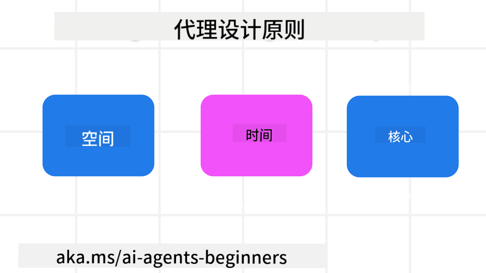

<!--
CO_OP_TRANSLATOR_METADATA:
{
  "original_hash": "4c46e4ff9e349c521e2b0b17f51afa64",
  "translation_date": "2025-08-28T09:12:23+00:00",
  "source_file": "03-agentic-design-patterns/README.md",
  "language_code": "zh"
}
-->

> _(点击上方图片观看本课视频)_
# AI代理设计原则

## 介绍

构建AI代理系统有很多种思路。鉴于在生成式AI设计中，模糊性是一种特性而非缺陷，工程师有时很难确定从哪里开始。我们创建了一套以人为中心的用户体验设计原则，帮助开发者构建以客户为中心的代理系统，以满足其业务需求。这些设计原则并不是一种规定性的架构，而是为定义和构建代理体验的团队提供的起点。

一般来说，代理应该：

- 扩展和增强人类能力（如头脑风暴、解决问题、自动化等）
- 填补知识空白（如帮助快速掌握知识领域、翻译等）
- 促进并支持我们个人偏好的协作方式
- 让我们成为更好的自己（如生活教练/任务管理者，帮助我们学习情绪调节和正念技能，增强韧性等）

## 本课内容

- 什么是代理设计原则
- 实施这些设计原则时需要遵循的指导方针
- 使用设计原则的一些示例

## 学习目标

完成本课后，您将能够：

1. 解释什么是代理设计原则
2. 说明使用代理设计原则的指导方针
3. 理解如何使用代理设计原则构建代理

## 代理设计原则

### 代理（空间）

这是代理运行的环境。这些原则指导我们如何设计在物理和数字世界中运行的代理。

- **连接而非取代** – 帮助人们与其他人、事件和可操作的知识建立联系，以促进协作和连接。
  - 代理帮助连接事件、知识和人。
  - 代理拉近人与人之间的距离，而不是取代或贬低人类。
- **易于访问但偶尔隐形** – 代理主要在后台运行，仅在相关和适当时提醒我们。
  - 代理在任何设备或平台上都易于被授权用户发现和访问。
  - 代理支持多模态输入和输出（如声音、语音、文本等）。
  - 代理可以在前台和后台之间无缝切换；根据用户需求的感知，在主动和被动之间切换。
  - 代理可能以隐形形式运行，但其后台处理路径和与其他代理的协作对用户是透明且可控的。

### 代理（时间）

这是代理随时间运行的方式。这些原则指导我们如何设计跨越过去、现在和未来的代理交互。

- **过去**：反思包括状态和上下文的历史。
  - 代理基于对更丰富历史数据的分析（不仅限于事件、人物或状态）提供更相关的结果。
  - 代理从过去的事件中创建联系，并积极反思记忆以应对当前情况。
- **现在**：推动而非通知。
  - 代理采用全面的方法与人互动。当事件发生时，代理不仅仅是静态通知或其他形式的静态交互。代理可以简化流程或动态生成提示，在适当的时刻引导用户的注意力。
  - 代理根据上下文环境、社会和文化变化以及用户意图提供信息。
  - 代理的交互可以是渐进的，随着时间的推移逐步演变/增长，以增强用户的能力。
- **未来**：适应和进化。
  - 代理适应各种设备、平台和模式。
  - 代理适应用户行为、无障碍需求，并可自由定制。
  - 代理通过持续的用户交互塑造和进化。

### 代理（核心）

这些是代理设计核心的关键要素。

- **接受不确定性但建立信任**。
  - 代理的不确定性是可以预期的。不确定性是代理设计的关键要素。
  - 信任和透明是代理设计的基础层。
  - 用户可以控制代理的开启/关闭状态，并且代理的状态始终清晰可见。

## 实施这些原则的指导方针

在使用上述设计原则时，请遵循以下指导方针：

1. **透明性**：告知用户AI的参与方式、其功能（包括过去的操作），以及如何提供反馈和修改系统。
2. **控制权**：允许用户自定义、指定偏好和个性化，并控制系统及其属性（包括忘记的能力）。
3. **一致性**：在设备和端点之间提供一致的多模态体验。尽可能使用熟悉的UI/UX元素（如语音交互的麦克风图标），并尽量减少用户的认知负担（如提供简洁的响应、视觉辅助和“了解更多”内容）。

## 如何使用这些原则和指导方针设计一个旅行代理

假设您正在设计一个旅行代理，可以这样考虑使用设计原则和指导方针：

1. **透明性** – 告知用户旅行代理是一个AI驱动的代理。提供一些基本的入门说明（如“你好”消息、示例提示）。在产品页面上清楚地记录这些内容。显示用户过去提出的提示列表。明确说明如何提供反馈（如点赞或点踩、发送反馈按钮等）。清楚说明代理是否有使用或主题限制。
2. **控制权** – 确保用户清楚如何在代理创建后修改代理，例如通过系统提示。允许用户选择代理的详细程度、写作风格，以及代理不应讨论的内容。允许用户查看和删除任何相关文件或数据、提示和过去的对话。
3. **一致性** – 确保“共享提示”、“添加文件或照片”和“标记某人或某物”的图标是标准且易于识别的。使用回形针图标表示文件上传/共享，使用图片图标表示图形上传。

### 对AI代理设计模式有更多疑问？

加入 [Azure AI Foundry Discord](https://aka.ms/ai-agents/discord)，与其他学习者交流，参加办公时间并解答您的AI代理问题。

## 其他资源

## 上一课

[探索代理框架](../02-explore-agentic-frameworks/README.md)

## 下一课

[工具使用设计模式](../04-tool-use/README.md)

---

**免责声明**：  
本文档使用AI翻译服务 [Co-op Translator](https://github.com/Azure/co-op-translator) 进行翻译。尽管我们努力确保翻译的准确性，但请注意，自动翻译可能包含错误或不准确之处。应以原始语言的文档作为权威来源。对于关键信息，建议使用专业人工翻译。我们不对因使用此翻译而产生的任何误解或误读承担责任。