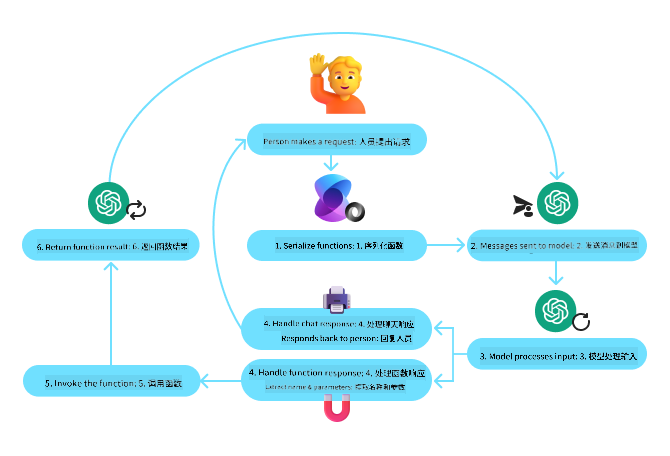
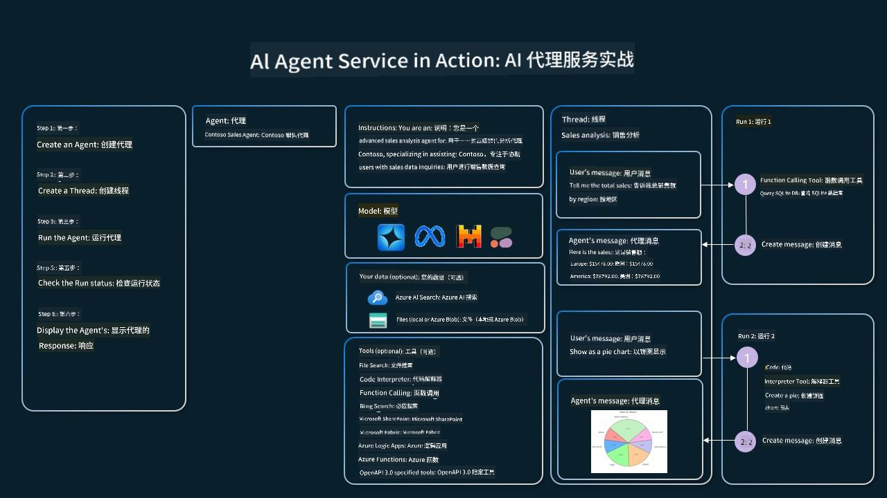

<!--
CO_OP_TRANSLATOR_METADATA:
{
  "original_hash": "88258b03f2893aa2e69eb8fb24baabbc",
  "translation_date": "2025-07-12T09:25:35+00:00",
  "source_file": "04-tool-use/README.md",
  "language_code": "zh"
}
-->
[](https://youtu.be/vieRiPRx-gI?si=cEZ8ApnT6Sus9rhn)

> _(点击上方图片观看本课视频)_

# 工具使用设计模式

工具很有趣，因为它们让 AI 代理具备更广泛的能力。代理不再局限于执行有限的动作，通过添加工具，代理现在可以执行各种各样的操作。本章将介绍工具使用设计模式，讲述 AI 代理如何利用特定工具来实现目标。

## 介绍

本课将回答以下问题：

- 什么是工具使用设计模式？
- 它适用于哪些使用场景？
- 实现该设计模式需要哪些元素/构建模块？
- 使用工具使用设计模式构建可信 AI 代理时有哪些特别注意事项？

## 学习目标

完成本课后，你将能够：

- 定义工具使用设计模式及其目的。
- 识别适用工具使用设计模式的使用场景。
- 理解实现该设计模式所需的关键元素。
- 认识使用该设计模式构建可信 AI 代理时的注意事项。

## 什么是工具使用设计模式？

**工具使用设计模式** 侧重于赋予大型语言模型（LLM）与外部工具交互的能力，以实现特定目标。工具是代理可以执行的代码，用于完成操作。工具可以是简单的函数，比如计算器，也可以是调用第三方服务的 API，如股票价格查询或天气预报。在 AI 代理的上下文中，工具设计为由代理响应**模型生成的函数调用**来执行。

## 它适用于哪些使用场景？

AI 代理可以利用工具完成复杂任务、检索信息或做出决策。工具使用设计模式常用于需要动态与外部系统交互的场景，如数据库、网络服务或代码解释器。该能力适用于多种使用场景，包括：

- **动态信息检索：** 代理可以查询外部 API 或数据库以获取最新数据（例如，查询 SQLite 数据库进行数据分析，获取股票价格或天气信息）。
- **代码执行与解释：** 代理可以执行代码或脚本来解决数学问题、生成报告或进行模拟。
- **工作流自动化：** 通过集成任务调度器、邮件服务或数据管道等工具，实现重复或多步骤工作流的自动化。
- **客户支持：** 代理可以与 CRM 系统、工单平台或知识库交互，解决用户问题。
- **内容生成与编辑：** 代理可以利用语法检查器、文本摘要器或内容安全评估工具，辅助内容创作。

## 实现工具使用设计模式需要哪些元素/构建模块？

这些构建模块使 AI 代理能够执行各种任务。下面是实现工具使用设计模式所需的关键元素：

- **函数/工具模式（Schemas）：** 对可用工具的详细定义，包括函数名、用途、必需参数和预期输出。这些模式帮助 LLM 理解可用工具及如何构造有效请求。

- **函数执行逻辑：** 决定何时以及如何根据用户意图和对话上下文调用工具。可能包括规划模块、路由机制或条件流程，动态决定工具的使用。

- **消息处理系统：** 管理用户输入、LLM 响应、工具调用及工具输出之间的对话流程。

- **工具集成框架：** 连接代理与各种工具的基础设施，无论是简单函数还是复杂的外部服务。

- **错误处理与验证：** 处理工具执行失败、参数验证及异常响应的机制。

- **状态管理：** 跟踪对话上下文、之前的工具交互和持久数据，确保多轮交互的一致性。

接下来，我们详细了解函数/工具调用。

### 函数/工具调用

函数调用是让大型语言模型（LLM）与工具交互的主要方式。你会发现“函数”和“工具”常被交替使用，因为“函数”（可重用代码块）就是代理用来完成任务的“工具”。为了调用函数代码，LLM 必须将用户请求与函数描述进行匹配。为此，会将包含所有可用函数描述的模式发送给 LLM。LLM 然后选择最合适的函数，返回其名称和参数。选定的函数被调用，其响应返回给 LLM，LLM 利用这些信息回复用户请求。

开发者实现函数调用需要：

1. 支持函数调用的 LLM 模型
2. 包含函数描述的模式
3. 每个函数对应的代码

以获取某城市当前时间为例说明：

1. **初始化支持函数调用的 LLM：**

    并非所有模型都支持函数调用，需确认所用 LLM 是否支持。<a href="https://learn.microsoft.com/azure/ai-services/openai/how-to/function-calling" target="_blank">Azure OpenAI</a> 支持函数调用。我们可以先初始化 Azure OpenAI 客户端。

    ```python
    # Initialize the Azure OpenAI client
    client = AzureOpenAI(
        azure_endpoint = os.getenv("AZURE_OPENAI_ENDPOINT"), 
        api_key=os.getenv("AZURE_OPENAI_API_KEY"),  
        api_version="2024-05-01-preview"
    )
    ```

1. **创建函数模式：**

    接下来定义一个 JSON 模式，包含函数名、函数功能描述及参数名称和描述。然后将该模式与用户请求（如查询旧金山时间）一起传给之前创建的客户端。需要注意的是，返回的是**工具调用**，而非问题的最终答案。正如前面提到的，LLM 返回它为任务选择的函数名及传递给函数的参数。

    ```python
    # Function description for the model to read
    tools = [
        {
            "type": "function",
            "function": {
                "name": "get_current_time",
                "description": "Get the current time in a given location",
                "parameters": {
                    "type": "object",
                    "properties": {
                        "location": {
                            "type": "string",
                            "description": "The city name, e.g. San Francisco",
                        },
                    },
                    "required": ["location"],
                },
            }
        }
    ]
    ```
   
    ```python
  
    # Initial user message
    messages = [{"role": "user", "content": "What's the current time in San Francisco"}] 
  
    # First API call: Ask the model to use the function
      response = client.chat.completions.create(
          model=deployment_name,
          messages=messages,
          tools=tools,
          tool_choice="auto",
      )
  
      # Process the model's response
      response_message = response.choices[0].message
      messages.append(response_message)
  
      print("Model's response:")  

      print(response_message)
  
    ```

    ```bash
    Model's response:
    ChatCompletionMessage(content=None, role='assistant', function_call=None, tool_calls=[ChatCompletionMessageToolCall(id='call_pOsKdUlqvdyttYB67MOj434b', function=Function(arguments='{"location":"San Francisco"}', name='get_current_time'), type='function')])
    ```
  
1. **执行任务所需的函数代码：**

    LLM 选定函数后，需要实现并执行该函数代码。我们可以用 Python 实现获取当前时间的代码。同时需要编写代码从 response_message 中提取函数名和参数，得到最终结果。

    ```python
      def get_current_time(location):
        """Get the current time for a given location"""
        print(f"get_current_time called with location: {location}")  
        location_lower = location.lower()
        
        for key, timezone in TIMEZONE_DATA.items():
            if key in location_lower:
                print(f"Timezone found for {key}")  
                current_time = datetime.now(ZoneInfo(timezone)).strftime("%I:%M %p")
                return json.dumps({
                    "location": location,
                    "current_time": current_time
                })
      
        print(f"No timezone data found for {location_lower}")  
        return json.dumps({"location": location, "current_time": "unknown"})
    ```

    ```python
     # Handle function calls
      if response_message.tool_calls:
          for tool_call in response_message.tool_calls:
              if tool_call.function.name == "get_current_time":
     
                  function_args = json.loads(tool_call.function.arguments)
     
                  time_response = get_current_time(
                      location=function_args.get("location")
                  )
     
                  messages.append({
                      "tool_call_id": tool_call.id,
                      "role": "tool",
                      "name": "get_current_time",
                      "content": time_response,
                  })
      else:
          print("No tool calls were made by the model.")  
  
      # Second API call: Get the final response from the model
      final_response = client.chat.completions.create(
          model=deployment_name,
          messages=messages,
      )
  
      return final_response.choices[0].message.content
     ```

    ```bash
      get_current_time called with location: San Francisco
      Timezone found for san francisco
      The current time in San Francisco is 09:24 AM.
     ```

函数调用是大多数（如果不是全部）代理工具使用设计的核心，但从零实现有时较为复杂。正如我们在[第2课](../../../02-explore-agentic-frameworks)中学到的，agentic 框架为我们提供了预构建的模块来实现工具使用。

## 使用 Agentic 框架的工具使用示例

以下是使用不同 agentic 框架实现工具使用设计模式的示例：

### Semantic Kernel

<a href="https://learn.microsoft.com/azure/ai-services/agents/overview" target="_blank">Semantic Kernel</a> 是一个面向 .NET、Python 和 Java 开发者的开源 AI 框架，专注于大型语言模型（LLM）。它通过一种称为<a href="https://learn.microsoft.com/semantic-kernel/concepts/ai-services/chat-completion/function-calling/?pivots=programming-language-python#1-serializing-the-functions" target="_blank">序列化</a>的过程，自动向模型描述你的函数及其参数，从而简化函数调用的使用。它还处理模型与代码之间的双向通信。使用像 Semantic Kernel 这样的 agentic 框架的另一个优势是，可以访问预构建的工具，如<a href="https://github.com/microsoft/semantic-kernel/blob/main/python/samples/getting_started_with_agents/openai_assistant/step4_assistant_tool_file_search.py" target="_blank">文件搜索</a>和<a href="https://github.com/microsoft/semantic-kernel/blob/main/python/samples/getting_started_with_agents/openai_assistant/step3_assistant_tool_code_interpreter.py" target="_blank">代码解释器</a>。

下图展示了 Semantic Kernel 中函数调用的流程：



在 Semantic Kernel 中，函数/工具被称为<a href="https://learn.microsoft.com/semantic-kernel/concepts/plugins/?pivots=programming-language-python" target="_blank">插件</a>。我们可以将之前的 `get_current_time` 函数转换为插件，即将其封装为包含该函数的类。还可以导入 `kernel_function` 装饰器，传入函数描述。创建包含 GetCurrentTimePlugin 的 kernel 时，kernel 会自动序列化函数及其参数，生成发送给 LLM 的模式。

```python
from semantic_kernel.functions import kernel_function

class GetCurrentTimePlugin:
    async def __init__(self, location):
        self.location = location

    @kernel_function(
        description="Get the current time for a given location"
    )
    def get_current_time(location: str = ""):
        ...

```

```python 
from semantic_kernel import Kernel

# Create the kernel
kernel = Kernel()

# Create the plugin
get_current_time_plugin = GetCurrentTimePlugin(location)

# Add the plugin to the kernel
kernel.add_plugin(get_current_time_plugin)
```
  
### Azure AI Agent Service

<a href="https://learn.microsoft.com/azure/ai-services/agents/overview" target="_blank">Azure AI Agent Service</a> 是一个较新的 agentic 框架，旨在帮助开发者安全地构建、部署和扩展高质量且可扩展的 AI 代理，无需管理底层计算和存储资源。它特别适合企业应用，因为它是一个完全托管的服务，具备企业级安全性。

与直接使用 LLM API 开发相比，Azure AI Agent Service 具有以下优势：

- 自动工具调用——无需解析工具调用、调用工具及处理响应，这些均由服务器端完成
- 安全管理数据——无需自行管理对话状态，可依赖线程存储所有所需信息
- 开箱即用的工具——可用于与数据源交互的工具，如 Bing、Azure AI Search 和 Azure Functions

Azure AI Agent Service 中的工具可分为两类：

1. 知识工具：
    - <a href="https://learn.microsoft.com/azure/ai-services/agents/how-to/tools/bing-grounding?tabs=python&pivots=overview" target="_blank">基于 Bing 搜索的知识支持</a>
    - <a href="https://learn.microsoft.com/azure/ai-services/agents/how-to/tools/file-search?tabs=python&pivots=overview" target="_blank">文件搜索</a>
    - <a href="https://learn.microsoft.com/azure/ai-services/agents/how-to/tools/azure-ai-search?tabs=azurecli%2Cpython&pivots=overview-azure-ai-search" target="_blank">Azure AI 搜索</a>

2. 操作工具：
    - <a href="https://learn.microsoft.com/azure/ai-services/agents/how-to/tools/function-calling?tabs=python&pivots=overview" target="_blank">函数调用</a>
    - <a href="https://learn.microsoft.com/azure/ai-services/agents/how-to/tools/code-interpreter?tabs=python&pivots=overview" target="_blank">代码解释器</a>
    - <a href="https://learn.microsoft.com/azure/ai-services/agents/how-to/tools/openapi-spec?tabs=python&pivots=overview" target="_blank">OpenAI 定义的工具</a>
    - <a href="https://learn.microsoft.com/azure/ai-services/agents/how-to/tools/azure-functions?pivots=overview" target="_blank">Azure Functions</a>

Agent Service 允许我们将这些工具组合成一个 `toolset`。它还利用 `threads` 跟踪特定对话的消息历史。

假设你是 Contoso 公司的销售代理，想开发一个能回答销售数据问题的对话代理。

下图展示了如何使用 Azure AI Agent Service 分析销售数据：



要使用服务中的任一工具，我们可以创建客户端并定义工具或工具集。以下 Python 代码展示了如何实现。LLM 会查看工具集，根据用户请求决定使用用户自定义函数 `fetch_sales_data_using_sqlite_query` 还是预构建的代码解释器。

```python 
import os
from azure.ai.projects import AIProjectClient
from azure.identity import DefaultAzureCredential
from fecth_sales_data_functions import fetch_sales_data_using_sqlite_query # fetch_sales_data_using_sqlite_query function which can be found in a fetch_sales_data_functions.py file.
from azure.ai.projects.models import ToolSet, FunctionTool, CodeInterpreterTool

project_client = AIProjectClient.from_connection_string(
    credential=DefaultAzureCredential(),
    conn_str=os.environ["PROJECT_CONNECTION_STRING"],
)

# Initialize function calling agent with the fetch_sales_data_using_sqlite_query function and adding it to the toolset
fetch_data_function = FunctionTool(fetch_sales_data_using_sqlite_query)
toolset = ToolSet()
toolset.add(fetch_data_function)

# Initialize Code Interpreter tool and adding it to the toolset. 
code_interpreter = code_interpreter = CodeInterpreterTool()
toolset = ToolSet()
toolset.add(code_interpreter)

agent = project_client.agents.create_agent(
    model="gpt-4o-mini", name="my-agent", instructions="You are helpful agent", 
    toolset=toolset
)
```

## 使用工具使用设计模式构建可信 AI 代理的特别注意事项

LLM 动态生成的 SQL 常见的安全顾虑是 SQL 注入或恶意操作风险，如删除或篡改数据库。虽然这些担忧合理，但通过正确配置数据库访问权限可以有效防范。大多数数据库可配置为只读。对于 PostgreSQL 或 Azure SQL 等数据库服务，应用应被赋予只读（SELECT）角色。

在安全环境中运行应用进一步增强保护。在企业场景中，数据通常从运营系统提取并转换到只读数据库或数据仓库，且采用用户友好的模式。此方法确保数据安全、性能和可访问性优化，同时应用仅具有限制的只读访问权限。

## 其他资源

-
<a href="https://microsoft.github.io/build-your-first-agent-with-azure-ai-agent-service-workshop/" target="_blank">
Azure AI Agents Service 研讨会</a>
- <a href="https://github.com/Azure-Samples/contoso-creative-writer/tree/main/docs/workshop" target="_blank">Contoso 创意写作多代理研讨会</a>
- <a href="https://learn.microsoft.com/semantic-kernel/concepts/ai-services/chat-completion/function-calling/?pivots=programming-language-python#1-serializing-the-functions" target="_blank">Semantic Kernel 函数调用教程</a>
- <a href="https://github.com/microsoft/semantic-kernel/blob/main/python/samples/getting_started_with_agents/openai_assistant/step3_assistant_tool_code_interpreter.py" target="_blank">Semantic Kernel 代码解释器</a>
- <a href="https://microsoft.github.io/autogen/dev/user-guide/core-user-guide/components/tools.html" target="_blank">Autogen 工具</a>

## 上一课

[理解 Agentic 设计模式](../03-agentic-design-patterns/README.md)

## 下一课

[Agentic RAG](../05-agentic-rag/README.md)

**免责声明**：  
本文件使用 AI 翻译服务 [Co-op Translator](https://github.com/Azure/co-op-translator) 进行翻译。虽然我们力求准确，但请注意，自动翻译可能包含错误或不准确之处。原始文件的母语版本应被视为权威来源。对于重要信息，建议采用专业人工翻译。我们不对因使用本翻译而产生的任何误解或误释承担责任。