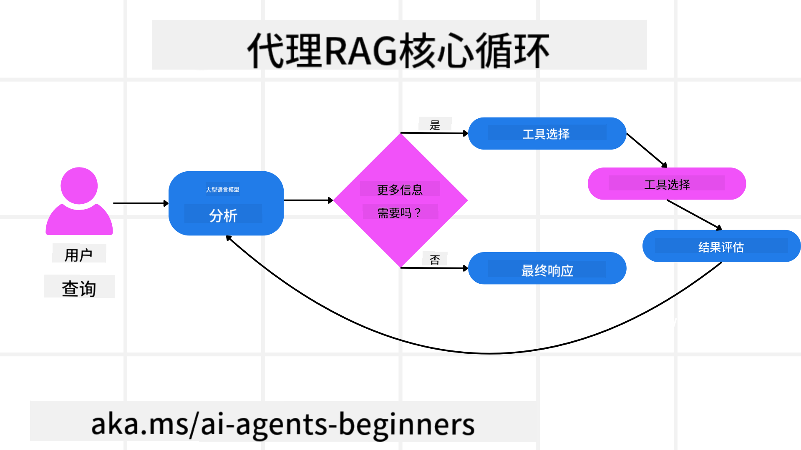
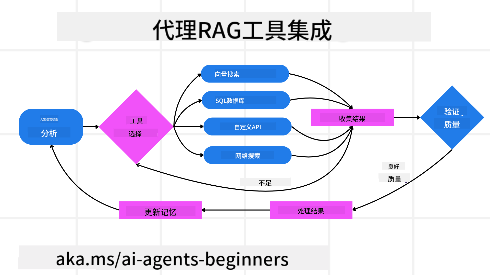
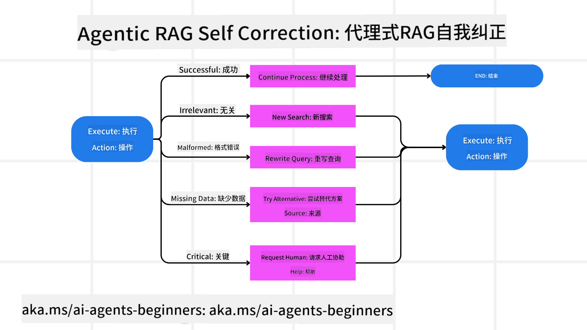
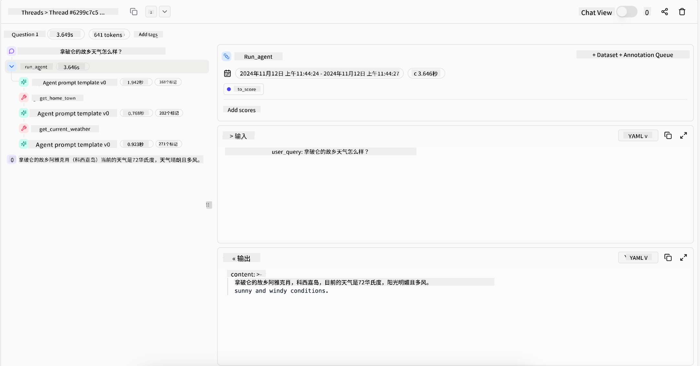
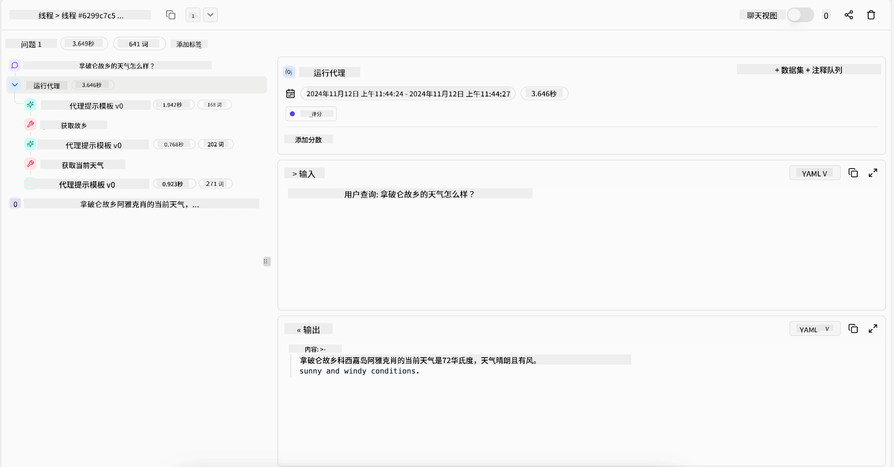

<!--
CO_OP_TRANSLATOR_METADATA:
{
  "original_hash": "d2f04b783b9e1253100329afd698f8ff",
  "translation_date": "2025-08-28T09:09:32+00:00",
  "source_file": "05-agentic-rag/README.md",
  "language_code": "zh"
}
-->

> _(点击上方图片观看本课视频)_

# Agentic RAG

本课全面介绍了Agentic Retrieval-Augmented Generation（Agentic RAG），这是一种新兴的人工智能范式，其中大型语言模型（LLMs）能够自主规划下一步行动，同时从外部数据源获取信息。与静态的“检索-阅读”模式不同，Agentic RAG涉及对LLM的多次迭代调用，期间穿插工具或函数调用以及结构化输出。系统会评估结果、优化查询、在必要时调用额外工具，并持续循环，直到找到满意的解决方案。

## 简介

本课将涵盖以下内容：

- **理解Agentic RAG：** 了解一种新兴的人工智能范式，其中大型语言模型（LLMs）能够自主规划下一步行动，同时从外部数据源获取信息。
- **掌握迭代式“制造者-检查者”风格：** 理解对LLM的迭代调用循环，期间穿插工具或函数调用以及结构化输出，旨在提高准确性并处理不规范的查询。
- **探索实际应用：** 识别Agentic RAG的优势场景，例如以准确性为优先的环境、复杂的数据库交互以及扩展的工作流程。

## 学习目标

完成本课后，您将能够了解以下内容：

- **理解Agentic RAG：** 了解一种新兴的人工智能范式，其中大型语言模型（LLMs）能够自主规划下一步行动，同时从外部数据源获取信息。
- **迭代式“制造者-检查者”风格：** 掌握对LLM的迭代调用循环，期间穿插工具或函数调用以及结构化输出，旨在提高准确性并处理不规范的查询。
- **掌控推理过程：** 理解系统如何掌控其推理过程，决定解决问题的方式，而不是依赖预定义路径。
- **工作流程：** 了解一个Agentic模型如何自主决定检索市场趋势报告、识别竞争对手数据、关联内部销售指标、综合分析结果并评估策略。
- **迭代循环、工具集成和记忆：** 学习系统如何依赖循环交互模式，在步骤间保持状态和记忆，避免重复循环并做出更明智的决策。
- **处理失败模式和自我纠正：** 探索系统的强大自我纠正机制，包括迭代和重新查询、使用诊断工具以及依赖人工监督。
- **自主性的边界：** 了解Agentic RAG的局限性，重点关注领域特定的自主性、基础设施依赖以及对安全措施的尊重。
- **实际应用场景及价值：** 识别Agentic RAG的优势场景，例如以准确性为优先的环境、复杂的数据库交互以及扩展的工作流程。
- **治理、透明性和信任：** 学习治理和透明性的重要性，包括可解释的推理、偏差控制以及人工监督。

## 什么是Agentic RAG？

Agentic Retrieval-Augmented Generation（Agentic RAG）是一种新兴的人工智能范式，其中大型语言模型（LLMs）能够自主规划下一步行动，同时从外部数据源获取信息。与静态的“检索-阅读”模式不同，Agentic RAG涉及对LLM的多次迭代调用，期间穿插工具或函数调用以及结构化输出。系统会评估结果、优化查询、在必要时调用额外工具，并持续循环，直到找到满意的解决方案。这种迭代式“制造者-检查者”风格旨在提高准确性、处理不规范的查询，并确保高质量的结果。

系统主动掌控其推理过程，重写失败的查询、选择不同的检索方法并集成多种工具，例如Azure AI Search中的向量搜索、SQL数据库或自定义API，然后最终确定答案。Agentic系统的显著特点是能够掌控其推理过程。传统的RAG实现依赖预定义路径，而Agentic系统则根据所获取信息的质量自主决定步骤顺序。

## 定义Agentic Retrieval-Augmented Generation（Agentic RAG）

Agentic Retrieval-Augmented Generation（Agentic RAG）是一种新兴的人工智能开发范式，其中LLMs不仅从外部数据源获取信息，还能自主规划下一步行动。与静态的“检索-阅读”模式或精心设计的提示序列不同，Agentic RAG涉及对LLM的迭代调用循环，期间穿插工具或函数调用以及结构化输出。每一步，系统都会评估已获得的结果，决定是否优化查询、调用额外工具，并持续循环，直到找到满意的解决方案。

这种迭代式“制造者-检查者”操作风格旨在提高准确性、处理不规范的查询（例如NL2SQL）并确保平衡且高质量的结果。系统不仅依赖精心设计的提示链，还能主动掌控其推理过程。它可以重写失败的查询、选择不同的检索方法并集成多种工具，例如Azure AI Search中的向量搜索、SQL数据库或自定义API，然后最终确定答案。这消除了对过于复杂的编排框架的需求。相反，一个相对简单的循环“LLM调用 → 工具使用 → LLM调用 → …”即可生成复杂且有依据的输出。

## 掌控推理过程

使系统“Agentic”的显著特点是其掌控推理过程的能力。传统的RAG实现通常依赖人类预定义模型的路径：一个思维链，概述了检索内容及时间。
但真正的Agentic系统会内部决定如何解决问题。它不仅仅是执行脚本，而是根据所获取信息的质量自主决定步骤顺序。
例如，如果被要求制定产品发布策略，它不会仅仅依赖一个提示来详细说明整个研究和决策工作流程。相反，Agentic模型会自主决定：

1. 使用Bing Web Grounding检索当前市场趋势报告。
2. 使用Azure AI Search识别相关竞争对手数据。
3. 使用Azure SQL Database关联历史内部销售指标。
4. 通过Azure OpenAI Service将发现综合成一个连贯的策略。
5. 评估策略是否存在漏洞或不一致，并在必要时进行新一轮检索。
所有这些步骤——优化查询、选择数据源、迭代直到对答案满意——都是由模型决定，而不是由人类预先编写脚本。

## 迭代循环、工具集成和记忆

Agentic系统依赖循环交互模式：

- **初始调用：** 用户目标（即用户提示）被传递给LLM。
- **工具调用：** 如果模型发现信息缺失或指令模糊，它会选择工具或检索方法，例如向量数据库查询（例如Azure AI Search Hybrid搜索私有数据）或结构化SQL调用，以获取更多上下文。
- **评估与优化：** 在审查返回的数据后，模型决定信息是否足够。如果不足，它会优化查询、尝试不同工具或调整方法。
- **重复直到满意：** 此循环持续进行，直到模型认为已获得足够的清晰度和证据来提供最终的、经过深思熟虑的响应。
- **记忆与状态：** 由于系统在步骤间保持状态和记忆，它可以回忆之前的尝试及其结果，避免重复循环并在过程中做出更明智的决策。

随着时间推移，这种模式会形成一种逐步发展的理解，使模型能够处理复杂的多步骤任务，而无需人类不断干预或重新调整提示。

## 处理失败模式和自我纠正

Agentic RAG的自主性还包括强大的自我纠正机制。当系统遇到瓶颈，例如检索到无关文档或遇到不规范查询时，它可以：

- **迭代和重新查询：** 模型不会返回低价值的响应，而是尝试新的搜索策略、重写数据库查询或查看替代数据集。
- **使用诊断工具：** 系统可能调用额外的功能来帮助调试其推理步骤或确认检索数据的正确性。像Azure AI Tracing这样的工具将对实现强大的可观察性和监控非常重要。
- **依赖人工监督：** 对于高风险或反复失败的场景，模型可能会标记不确定性并请求人工指导。一旦人类提供纠正反馈，模型可以在后续过程中吸收这一经验。

这种迭代和动态的方法使模型能够不断改进，确保它不仅仅是一个“一次性”系统，而是一个能够在给定会话中从错误中学习的系统。

## 自主性的边界

尽管在任务中具有一定的自主性，Agentic RAG并不等同于人工通用智能。其“Agentic”能力仅限于人类开发者提供的工具、数据源和政策。它无法自行创造工具或超越设定的领域边界。相反，它擅长动态编排现有资源。
与更高级的人工智能形式相比，其关键区别包括：

1. **领域特定的自主性：** Agentic RAG系统专注于在已知领域内实现用户定义的目标，采用查询重写或工具选择等策略来优化结果。
2. **依赖基础设施：** 系统的能力取决于开发者集成的工具和数据。没有人类干预，它无法超越这些边界。
3. **尊重安全措施：** 道德准则、合规规则和业务政策仍然非常重要。Agent的自由始终受到安全措施和监督机制的约束（希望如此？）。

## 实际应用场景及价值

Agentic RAG在需要迭代优化和精确性的场景中表现出色：

1. **以准确性为优先的环境：** 在合规检查、法规分析或法律研究中，Agentic模型可以反复验证事实、咨询多个来源并重写查询，直到生成经过彻底审查的答案。
2. **复杂的数据库交互：** 在处理结构化数据时，查询可能经常失败或需要调整，系统可以使用Azure SQL或Microsoft Fabric OneLake自主优化查询，确保最终检索符合用户意图。
3. **扩展的工作流程：** 随着新信息的出现，较长的会话可能会不断演变。Agentic RAG可以持续整合新数据，并随着对问题空间的了解加深而调整策略。

## 治理、透明性和信任

随着这些系统在推理中变得更加自主，治理和透明性至关重要：

- **可解释的推理：** 模型可以提供查询记录、咨询的来源以及其推理步骤的审计轨迹。像Azure AI Content Safety和Azure AI Tracing / GenAIOps这样的工具可以帮助保持透明性并降低风险。
- **偏差控制和平衡检索：** 开发者可以调整检索策略，确保考虑平衡、具有代表性的数据源，并定期审查输出以检测偏差或倾斜模式，使用Azure Machine Learning为高级数据科学组织定制模型。
- **人工监督和合规：** 对于敏感任务，人工审查仍然至关重要。Agentic RAG不会取代高风险决策中的人类判断，而是通过提供经过更彻底审查的选项来增强人类判断。

拥有能够提供清晰操作记录的工具至关重要。没有这些工具，调试多步骤过程可能会非常困难。以下是Literal AI（Chainlit背后的公司）提供的Agent运行示例：

## 结论

Agentic RAG代表了人工智能系统处理复杂、数据密集型任务的自然演进。通过采用循环交互模式、自主选择工具并优化查询直到获得高质量结果，系统超越了静态的提示跟随，成为更具适应性和上下文感知的决策者。尽管仍受人类定义的基础设施和道德准则的约束，这些Agentic能力使企业和终端用户能够享受更丰富、更动态且更有价值的人工智能交互。

### 对Agentic RAG还有疑问？

加入[Azure AI Foundry Discord](https://aka.ms/ai-agents/discord)，与其他学习者交流，参加办公时间并解答您的AI Agents相关问题。

## 其他资源

-
<a href="https://learn.microsoft.com/training/modules/use-own-data-azure-openai" target="_blank">
使用 Azure OpenAI 服务实现检索增强生成 (RAG)：学习如何使用您自己的数据与 Azure OpenAI 服务集成。本 Microsoft Learn 模块提供了关于实现 RAG 的全面指南  
- <a href="https://learn.microsoft.com/azure/ai-studio/concepts/evaluation-approach-gen-ai" target="_blank">使用 Azure AI Foundry 评估生成式 AI 应用：本文涵盖了在公开数据集上对模型进行评估和比较的内容，包括 Agentic AI 应用和 RAG 架构</a>  
- <a href="https://weaviate.io/blog/what-is-agentic-rag" target="_blank">什么是 Agentic RAG | Weaviate</a>  
- <a href="https://ragaboutit.com/agentic-rag-a-complete-guide-to-agent-based-retrieval-augmented-generation/" target="_blank">Agentic RAG：基于代理的检索增强生成完整指南 – 来自 RAG 的最新动态</a>  
- <a href="https://huggingface.co/learn/cookbook/agent_rag" target="_blank">Agentic RAG：通过查询重构和自查询为您的 RAG 提速！Hugging Face 开源 AI 手册</a>  
- <a href="https://youtu.be/aQ4yQXeB1Ss?si=2HUqBzHoeB5tR04U" target="_blank">为 RAG 添加 Agentic 层</a>  
- <a href="https://www.youtube.com/watch?v=zeAyuLc_f3Q&t=244s" target="_blank">知识助手的未来：Jerry Liu</a>  
- <a href="https://www.youtube.com/watch?v=AOSjiXP1jmQ" target="_blank">如何构建 Agentic RAG 系统</a>  
- <a href="https://ignite.microsoft.com/sessions/BRK102?source=sessions" target="_blank">使用 Azure AI Foundry Agent 服务扩展您的 AI 代理</a>  

### 学术论文

- <a href="https://arxiv.org/abs/2303.17651" target="_blank">2303.17651 Self-Refine: 通过自反馈进行迭代优化</a>  
- <a href="https://arxiv.org/abs/2303.11366" target="_blank">2303.11366 Reflexion: 具有语言强化学习的语言代理</a>  
- <a href="https://arxiv.org/abs/2305.11738" target="_blank">2305.11738 CRITIC: 大型语言模型通过工具交互批判实现自我纠正</a>  
- <a href="https://arxiv.org/abs/2501.09136" target="_blank">2501.09136 Agentic Retrieval-Augmented Generation: 关于 Agentic RAG 的综述</a>  

## 上一课

[工具使用设计模式](../04-tool-use/README.md)  

## 下一课

[构建可信的 AI 代理](../06-building-trustworthy-agents/README.md)  

---

**免责声明**：  
本文档使用AI翻译服务[Co-op Translator](https://github.com/Azure/co-op-translator)进行翻译。尽管我们努力确保准确性，但请注意，自动翻译可能包含错误或不准确之处。应以原始语言的文档作为权威来源。对于关键信息，建议使用专业人工翻译。对于因使用本翻译而引起的任何误解或误读，我们概不负责。