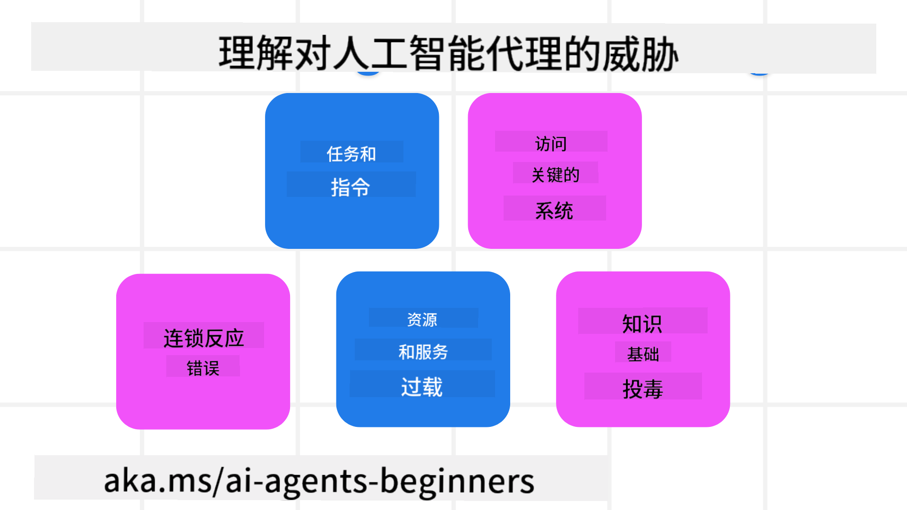
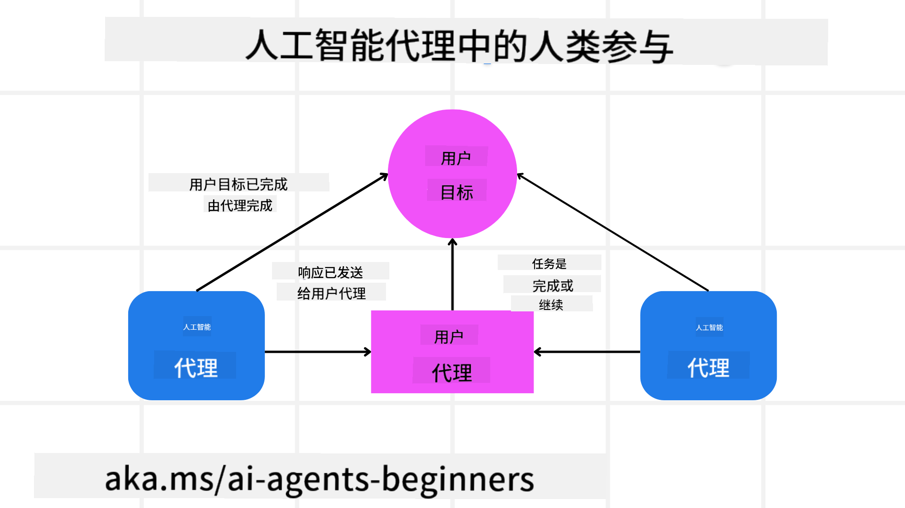

<!--
CO_OP_TRANSLATOR_METADATA:
{
  "original_hash": "498802b4c3c3cc486b86f27a12cebb34",
  "translation_date": "2025-08-28T09:06:52+00:00",
  "source_file": "06-building-trustworthy-agents/README.md",
  "language_code": "zh"
}
-->
[](https://youtu.be/iZKkMEGBCUQ?si=Q-kEbcyHUMPoHp8L)

> _(点击上方图片观看本课视频)_

# 构建可信的AI代理

## 介绍

本课将涵盖：

- 如何构建和部署安全且高效的AI代理
- 开发AI代理时的重要安全考量
- 如何在开发AI代理时维护数据和用户隐私

## 学习目标

完成本课后，您将能够：

- 识别并减轻创建AI代理时的风险
- 实施安全措施，确保数据和访问得到妥善管理
- 创建能够维护数据隐私并提供高质量用户体验的AI代理

## 安全性

首先，让我们了解如何构建安全的代理应用程序。安全性意味着AI代理能够按设计运行。作为代理应用程序的开发者，我们有方法和工具来最大化安全性：

### 构建系统消息框架

如果您曾使用大型语言模型（LLMs）构建AI应用程序，您会知道设计一个强大的系统提示或系统消息的重要性。这些提示设定了元规则、指令和指南，规定了LLM如何与用户和数据交互。

对于AI代理来说，系统提示更为重要，因为AI代理需要非常具体的指令来完成我们为其设计的任务。

为了创建可扩展的系统提示，我们可以使用一个系统消息框架来为应用程序中的一个或多个代理构建提示：


#### 第一步：创建元系统消息

元提示将被LLM用来生成我们创建的代理的系统提示。我们将其设计为一个模板，以便在需要时高效创建多个代理。

以下是我们提供给LLM的元系统消息示例：

```plaintext
You are an expert at creating AI agent assistants. 
You will be provided a company name, role, responsibilities and other
information that you will use to provide a system prompt for.
To create the system prompt, be descriptive as possible and provide a structure that a system using an LLM can better understand the role and responsibilities of the AI assistant. 
```

#### 第二步：创建基础提示

下一步是创建一个基础提示来描述AI代理。您应包括代理的角色、代理将完成的任务以及代理的其他职责。

以下是一个示例：

```plaintext
You are a travel agent for Contoso Travel that is great at booking flights for customers. To help customers you can perform the following tasks: lookup available flights, book flights, ask for preferences in seating and times for flights, cancel any previously booked flights and alert customers on any delays or cancellations of flights.  
```

#### 第三步：向LLM提供基础系统消息

现在，我们可以通过将元系统消息作为系统消息以及我们的基础系统消息提供给LLM来优化此系统消息。

这将生成一个更适合指导AI代理的系统消息：

```markdown
**Company Name:** Contoso Travel  
**Role:** Travel Agent Assistant

**Objective:**  
You are an AI-powered travel agent assistant for Contoso Travel, specializing in booking flights and providing exceptional customer service. Your main goal is to assist customers in finding, booking, and managing their flights, all while ensuring that their preferences and needs are met efficiently.

**Key Responsibilities:**

1. **Flight Lookup:**
    
    - Assist customers in searching for available flights based on their specified destination, dates, and any other relevant preferences.
    - Provide a list of options, including flight times, airlines, layovers, and pricing.
2. **Flight Booking:**
    
    - Facilitate the booking of flights for customers, ensuring that all details are correctly entered into the system.
    - Confirm bookings and provide customers with their itinerary, including confirmation numbers and any other pertinent information.
3. **Customer Preference Inquiry:**
    
    - Actively ask customers for their preferences regarding seating (e.g., aisle, window, extra legroom) and preferred times for flights (e.g., morning, afternoon, evening).
    - Record these preferences for future reference and tailor suggestions accordingly.
4. **Flight Cancellation:**
    
    - Assist customers in canceling previously booked flights if needed, following company policies and procedures.
    - Notify customers of any necessary refunds or additional steps that may be required for cancellations.
5. **Flight Monitoring:**
    
    - Monitor the status of booked flights and alert customers in real-time about any delays, cancellations, or changes to their flight schedule.
    - Provide updates through preferred communication channels (e.g., email, SMS) as needed.

**Tone and Style:**

- Maintain a friendly, professional, and approachable demeanor in all interactions with customers.
- Ensure that all communication is clear, informative, and tailored to the customer's specific needs and inquiries.

**User Interaction Instructions:**

- Respond to customer queries promptly and accurately.
- Use a conversational style while ensuring professionalism.
- Prioritize customer satisfaction by being attentive, empathetic, and proactive in all assistance provided.

**Additional Notes:**

- Stay updated on any changes to airline policies, travel restrictions, and other relevant information that could impact flight bookings and customer experience.
- Use clear and concise language to explain options and processes, avoiding jargon where possible for better customer understanding.

This AI assistant is designed to streamline the flight booking process for customers of Contoso Travel, ensuring that all their travel needs are met efficiently and effectively.

```

#### 第四步：迭代和改进

此系统消息框架的价值在于能够更轻松地为多个代理扩展创建系统消息，并随着时间的推移改进您的系统消息。很少有系统消息能够在第一次就完全适用于您的用例。通过更改基础系统消息并运行系统，您可以进行小幅调整和改进，从而比较和评估结果。

## 理解威胁

为了构建可信的AI代理，理解并减轻对AI代理的风险和威胁至关重要。让我们来看一些针对AI代理的不同威胁，以及如何更好地规划和应对这些威胁。



### 任务和指令

**描述：** 攻击者试图通过提示或操控输入来更改AI代理的指令或目标。

**缓解措施：** 执行验证检查和输入过滤器，以在AI代理处理之前检测潜在危险的提示。由于这些攻击通常需要与代理频繁交互，限制对话轮次也是防止此类攻击的另一种方法。

### 访问关键系统

**描述：** 如果AI代理可以访问存储敏感数据的系统和服务，攻击者可能会破坏代理与这些服务之间的通信。这些可能是直接攻击，也可能是通过代理间接获取这些系统信息的尝试。

**缓解措施：** AI代理应仅在必要时访问系统，以防止此类攻击。代理与系统之间的通信也应是安全的。实施身份验证和访问控制是保护此类信息的另一种方法。

### 资源和服务过载

**描述：** AI代理可以访问不同的工具和服务来完成任务。攻击者可能利用这一能力，通过AI代理发送大量请求来攻击这些服务，可能导致系统故障或高昂的成本。

**缓解措施：** 实施策略限制AI代理对服务的请求数量。限制与AI代理的对话轮次和请求数量也是防止此类攻击的另一种方法。

### 知识库投毒

**描述：** 此类攻击并不直接针对AI代理，而是针对AI代理将使用的知识库和其他服务。这可能涉及破坏AI代理将用于完成任务的数据或信息，从而导致对用户的偏见或意外响应。

**缓解措施：** 定期验证AI代理将在其工作流程中使用的数据。确保对这些数据的访问是安全的，并且只有可信人员才能更改，以避免此类攻击。

### 连锁错误

**描述：** AI代理访问各种工具和服务来完成任务。攻击者引发的错误可能导致与AI代理连接的其他系统故障，使攻击范围扩大并更难排查。

**缓解措施：** 避免此类问题的一种方法是让AI代理在受限环境中运行，例如在Docker容器中执行任务，以防止直接的系统攻击。创建备用机制和重试逻辑，当某些系统返回错误时，可以防止更大的系统故障。

## 人类参与

另一种构建可信AI代理系统的有效方法是引入人类参与。这种方式创建了一个流程，用户可以在代理运行期间向其提供反馈。用户实际上充当了多代理系统中的代理，通过批准或终止运行过程来参与。



以下是一个使用AutoGen实现此概念的代码片段：

```python

# Create the agents.
model_client = OpenAIChatCompletionClient(model="gpt-4o-mini")
assistant = AssistantAgent("assistant", model_client=model_client)
user_proxy = UserProxyAgent("user_proxy", input_func=input)  # Use input() to get user input from console.

# Create the termination condition which will end the conversation when the user says "APPROVE".
termination = TextMentionTermination("APPROVE")

# Create the team.
team = RoundRobinGroupChat([assistant, user_proxy], termination_condition=termination)

# Run the conversation and stream to the console.
stream = team.run_stream(task="Write a 4-line poem about the ocean.")
# Use asyncio.run(...) when running in a script.
await Console(stream)

```

## 总结

构建可信的AI代理需要精心设计、强大的安全措施和持续的迭代。通过实施结构化的元提示系统、理解潜在威胁并应用缓解策略，开发者可以创建既安全又高效的AI代理。此外，结合人类参与的方法可以确保AI代理始终与用户需求保持一致，同时将风险降到最低。随着AI的不断发展，保持对安全、隐私和伦理问题的积极态度将是建立AI驱动系统信任和可靠性的关键。

### 对构建可信AI代理有更多疑问？

加入[Azure AI Foundry Discord](https://aka.ms/ai-agents/discord)，与其他学习者交流，参加答疑时间并获取您的AI代理相关问题的解答。

## 其他资源

- <a href="https://learn.microsoft.com/azure/ai-studio/responsible-use-of-ai-overview" target="_blank">负责任AI概述</a>  
- <a href="https://learn.microsoft.com/azure/ai-studio/concepts/evaluation-approach-gen-ai" target="_blank">生成式AI模型和AI应用的评估</a>  
- <a href="https://learn.microsoft.com/azure/ai-services/openai/concepts/system-message?context=%2Fazure%2Fai-studio%2Fcontext%2Fcontext&tabs=top-techniques" target="_blank">安全系统消息</a>  
- <a href="https://blogs.microsoft.com/wp-content/uploads/prod/sites/5/2022/06/Microsoft-RAI-Impact-Assessment-Template.pdf?culture=en-us&country=us" target="_blank">风险评估模板</a>  

## 上一课

[Agentic RAG](../05-agentic-rag/README.md)

## 下一课

[规划设计模式](../07-planning-design/README.md)

---

**免责声明**：  
本文档使用AI翻译服务[Co-op Translator](https://github.com/Azure/co-op-translator)进行翻译。尽管我们努力确保翻译的准确性，但请注意，自动翻译可能包含错误或不准确之处。原始语言的文档应被视为权威来源。对于关键信息，建议使用专业人工翻译。我们对因使用此翻译而产生的任何误解或误读不承担责任。