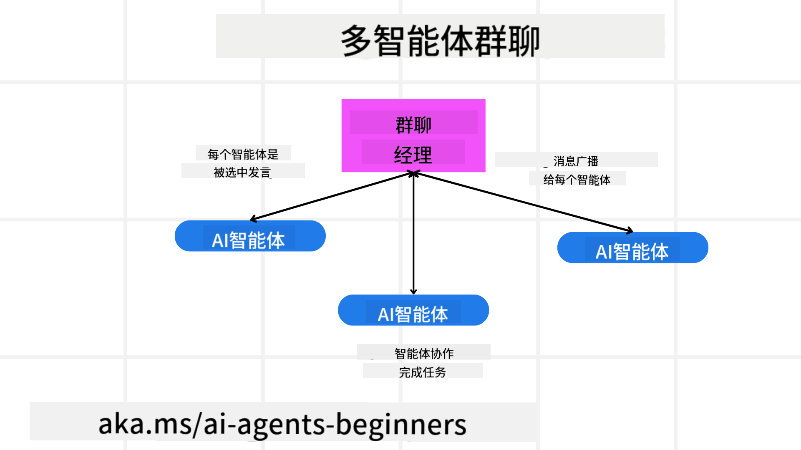
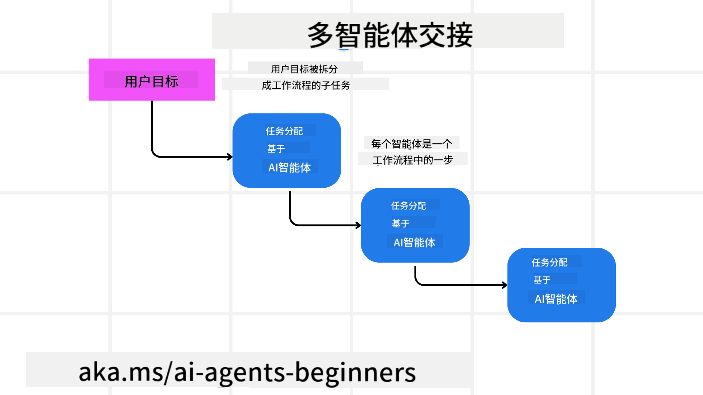
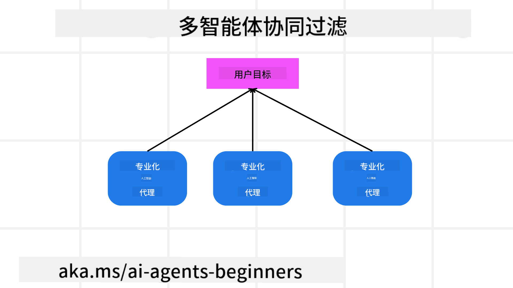

<!--
CO_OP_TRANSLATOR_METADATA:
{
  "original_hash": "1a008c204051cba8d0e253b75f261c41",
  "translation_date": "2025-08-28T09:06:14+00:00",
  "source_file": "08-multi-agent/README.md",
  "language_code": "zh"
}
-->

> _(点击上方图片观看本课视频)_

# 多代理设计模式

当你开始从事涉及多个代理的项目时，就需要考虑多代理设计模式。然而，什么时候切换到多代理模式以及它的优势可能并不那么显而易见。

## 介绍

在本课中，我们将回答以下问题：

- 多代理适用于哪些场景？
- 使用多代理相比单一代理执行多任务有哪些优势？
- 实现多代理设计模式的构建模块是什么？
- 如何了解多个代理之间的交互方式？

## 学习目标

完成本课后，你应该能够：

- 识别多代理适用的场景
- 认识使用多代理相比单一代理的优势
- 理解实现多代理设计模式的构建模块

更大的图景是什么？

*多代理是一种设计模式，允许多个代理协同工作以实现共同目标*。

这种模式广泛应用于多个领域，包括机器人技术、自动化系统和分布式计算。

## 多代理适用的场景

那么，哪些场景适合使用多代理呢？答案是有很多场景可以从多个代理中受益，尤其是在以下情况下：

- **大工作量**：大工作量可以分解为较小的任务并分配给不同的代理，从而实现并行处理并加快完成速度。例如，大规模数据处理任务就是一个案例。
- **复杂任务**：复杂任务可以像大工作量一样分解为较小的子任务，并分配给不同的代理，每个代理专注于任务的特定方面。例如，自动驾驶汽车中，不同代理分别负责导航、障碍物检测和与其他车辆的通信。
- **多样化的专业知识**：不同代理可以拥有多样化的专业知识，使其能够比单一代理更有效地处理任务的不同方面。例如，在医疗领域，代理可以分别负责诊断、治疗计划和患者监测。

## 使用多代理相比单一代理的优势

单一代理系统可能适合简单任务，但对于更复杂的任务，使用多个代理可以带来以下优势：

- **专业化**：每个代理可以专注于特定任务。单一代理缺乏专业化，可能会在面对复杂任务时感到困惑。例如，它可能最终执行了一个并不适合它的任务。
- **可扩展性**：通过添加更多代理来扩展系统比让单一代理超负荷工作更容易。
- **容错性**：如果一个代理失败，其他代理可以继续工作，从而确保系统的可靠性。

举个例子，假设为用户预订一次旅行。单一代理系统需要处理旅行预订过程的所有方面，从寻找航班到预订酒店和租车。为了实现这一点，单一代理需要具备处理所有这些任务的工具。这可能导致一个复杂且难以维护和扩展的单体系统。而多代理系统可以有不同的代理分别专注于寻找航班、预订酒店和租车。这使得系统更加模块化、更易维护且更具可扩展性。

这可以类比为一个夫妻店经营的旅行社与一个连锁经营的旅行社。夫妻店的旅行社会有一个代理处理旅行预订过程的所有方面，而连锁经营的旅行社会有不同的代理分别处理旅行预订过程的不同方面。

## 实现多代理设计模式的构建模块

在实现多代理设计模式之前，你需要了解构成该模式的构建模块。

让我们通过预订用户旅行的例子来具体说明。在这种情况下，构建模块包括：

- **代理通信**：负责寻找航班、预订酒店和租车的代理需要进行通信并共享用户的偏好和约束。你需要决定通信的协议和方法。具体来说，寻找航班的代理需要与预订酒店的代理沟通，以确保酒店的预订日期与航班日期一致。这意味着代理需要共享用户的旅行日期，因此你需要决定*哪些代理共享信息以及如何共享信息*。
- **协调机制**：代理需要协调其行动以确保满足用户的偏好和约束。例如，用户可能希望酒店靠近机场，而约束可能是租车只能在机场提供。这意味着预订酒店的代理需要与租车代理协调，以确保满足用户的偏好和约束。这意味着你需要决定*代理如何协调其行动*。
- **代理架构**：代理需要具备内部结构以做出决策并从与用户的交互中学习。例如，寻找航班的代理需要具备内部结构以决定向用户推荐哪些航班。这意味着你需要决定*代理如何做出决策并从与用户的交互中学习*。例如，寻找航班的代理可以使用机器学习模型根据用户的过去偏好推荐航班。
- **多代理交互的可见性**：你需要了解多个代理之间的交互方式。这意味着你需要有工具和技术来跟踪代理的活动和交互。这可以通过日志记录和监控工具、可视化工具以及性能指标来实现。
- **多代理模式**：实现多代理系统有不同的模式，例如集中式、分散式和混合架构。你需要决定最适合你的用例的模式。
- **人工干预**：在大多数情况下，你会有人工干预，你需要指示代理何时寻求人工介入。例如，用户可能要求推荐的酒店或航班之外的特定选项，或者在预订航班或酒店之前要求确认。

## 多代理交互的可见性

了解多个代理之间的交互方式非常重要。这种可见性对于调试、优化以及确保整个系统的有效性至关重要。为了实现这一点，你需要有工具和技术来跟踪代理的活动和交互。这可以通过日志记录和监控工具、可视化工具以及性能指标来实现。

例如，在为用户预订旅行的情况下，你可以有一个仪表板显示每个代理的状态、用户的偏好和约束以及代理之间的交互。这个仪表板可以显示用户的旅行日期、航班代理推荐的航班、酒店代理推荐的酒店以及租车代理推荐的租车。这可以让你清楚地了解代理之间的交互方式以及是否满足了用户的偏好和约束。

让我们更详细地看一下这些方面。

- **日志记录和监控工具**：你需要为代理采取的每个行动记录日志。日志条目可以存储关于采取行动的代理、采取的行动、行动的时间以及行动结果的信息。这些信息可以用于调试、优化等。
- **可视化工具**：可视化工具可以帮助你以更直观的方式查看代理之间的交互。例如，你可以有一个图表显示代理之间的信息流。这可以帮助你识别系统中的瓶颈、低效以及其他问题。
- **性能指标**：性能指标可以帮助你跟踪多代理系统的有效性。例如，你可以跟踪完成任务所需的时间、每单位时间完成的任务数量以及代理推荐的准确性。这些信息可以帮助你识别改进的领域并优化系统。

## 多代理模式

让我们深入探讨一些可以用来创建多代理应用的具体模式。以下是一些值得考虑的有趣模式：

### 群聊

当你想创建一个群聊应用程序，让多个代理可以相互通信时，这种模式非常有用。典型的用例包括团队协作、客户支持和社交网络。

在这种模式中，每个代理代表群聊中的一个用户，消息通过消息协议在代理之间交换。代理可以向群聊发送消息、从群聊接收消息以及响应其他代理的消息。

这种模式可以通过集中式架构实现，所有消息通过中央服务器路由，或者通过分散式架构直接交换消息。

### 任务交接

当你想创建一个应用程序，让多个代理可以相互交接任务时，这种模式非常有用。

典型的用例包括客户支持、任务管理和工作流自动化。

在这种模式中，每个代理代表工作流中的一个任务或步骤，代理可以根据预定义规则将任务交接给其他代理。

### 协同过滤

当你想创建一个应用程序，让多个代理可以协作为用户提供推荐时，这种模式非常有用。

为什么需要多个代理协作？因为每个代理可以拥有不同的专业知识，并以不同的方式为推荐过程做出贡献。

举个例子，假设用户想要推荐购买股票的建议。

- **行业专家**：一个代理可以是某个行业的专家。
- **技术分析**：另一个代理可以是技术分析的专家。
- **基本面分析**：还有一个代理可以是基本面分析的专家。通过协作，这些代理可以为用户提供更全面的推荐。

## 场景：退款流程

考虑一个场景，客户试图为某产品申请退款，可能会涉及多个代理，但我们可以将其分为专用于退款流程的代理和可用于其他流程的通用代理。

**专用于退款流程的代理**：

以下是一些可能参与退款流程的代理：

- **客户代理**：代表客户，负责启动退款流程。
- **卖家代理**：代表卖家，负责处理退款。
- **支付代理**：代表支付流程，负责退还客户的付款。
- **解决代理**：代表解决流程，负责解决退款过程中出现的任何问题。
- **合规代理**：代表合规流程，负责确保退款流程符合法规和政策。

**通用代理**：

这些代理可以用于业务的其他部分。

- **物流代理**：代表物流流程，负责将产品寄回卖家。此代理既可用于退款流程，也可用于购买产品的物流。
- **反馈代理**：代表反馈流程，负责收集客户反馈。反馈可以在任何时间进行，而不仅限于退款流程。
- **升级代理**：代表升级流程，负责将问题升级到更高级别的支持。此类代理可用于任何需要问题升级的流程。
- **通知代理**：代表通知流程，负责在退款流程的各个阶段向客户发送通知。
- **分析代理**：代表分析流程，负责分析与退款流程相关的数据。
- **审计代理**：代表审计流程，负责审计退款流程以确保其正确执行。
- **报告代理**：代表报告流程，负责生成关于退款流程的报告。
- **知识代理**：代表知识流程，负责维护与退款流程相关的信息知识库。此代理既可以了解退款，也可以了解业务的其他部分。
- **安全代理**：代表安全流程，负责确保退款流程的安全性。
- **质量代理**：代表质量流程，负责确保退款流程的质量。

以上列出了许多代理，包括专用于退款流程的代理以及可用于业务其他部分的通用代理。希望这能为你如何决定在多代理系统中使用哪些代理提供一些思路。

## 作业
设计一个多代理系统用于客户支持流程。识别流程中涉及的代理、它们的角色和职责，以及它们如何相互交互。考虑既包括客户支持流程中特定的代理，也包括可以用于业务其他部分的通用代理。

> 在阅读以下解决方案之前，请仔细思考，你可能需要比想象中更多的代理。

> TIP: 想想客户支持流程的不同阶段，同时考虑任何系统中需要的代理。

## 解决方案

[解决方案](./solution/solution.md)

## 知识检查

问题：什么时候应该考虑使用多代理？

- [ ] A1: 当工作量小且任务简单时。
- [ ] A2: 当工作量大时。
- [ ] A3: 当任务简单时。

[解决方案测验](./solution/solution-quiz.md)

## 总结

在本课中，我们探讨了多代理设计模式，包括多代理适用的场景、使用多代理相较于单一代理的优势、实现多代理设计模式的构建模块，以及如何了解多个代理之间的交互情况。

### 对多代理设计模式还有疑问？

加入 [Azure AI Foundry Discord](https://aka.ms/ai-agents/discord)，与其他学习者交流，参加办公时间并解答你的AI代理相关问题。

## 其他资源

- ## 上一课

[规划设计](../07-planning-design/README.md)

## 下一课

[AI代理中的元认知](../09-metacognition/README.md)

---

**免责声明**：  
本文档使用AI翻译服务[Co-op Translator](https://github.com/Azure/co-op-translator)进行翻译。尽管我们努力确保翻译的准确性，但请注意，自动翻译可能包含错误或不准确之处。原始语言的文档应被视为权威来源。对于关键信息，建议使用专业人工翻译。我们不对因使用此翻译而产生的任何误解或误读承担责任。