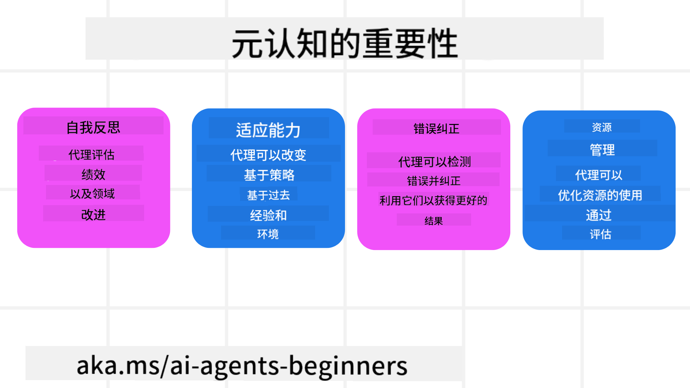
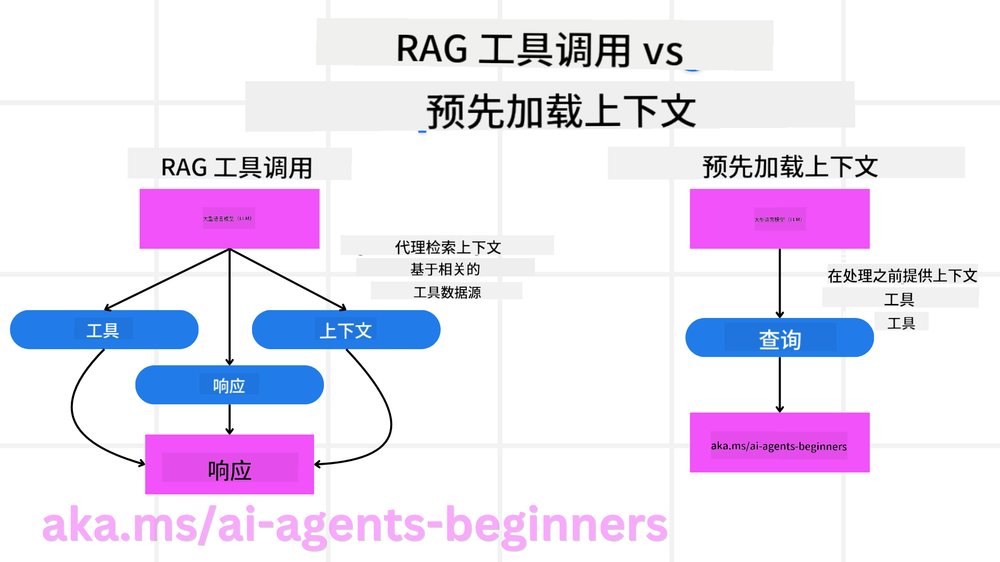

<!--
CO_OP_TRANSLATOR_METADATA:
{
  "original_hash": "5f0deef171fc3a68d5d3d770a8bfb03d",
  "translation_date": "2025-08-28T09:03:26+00:00",
  "source_file": "09-metacognition/README.md",
  "language_code": "zh"
}
-->
[](https://youtu.be/His9R6gw6Ec?si=3_RMb8VprNvdLRhX)

> _(点击上方图片观看本课视频)_
# AI智能体中的元认知

## 介绍

欢迎学习AI智能体中的元认知！本章面向对AI智能体如何思考自身思维过程感兴趣的初学者。通过本课学习，您将理解关键概念，并掌握一些实际案例，能够将元认知应用于AI智能体的设计中。

## 学习目标

完成本课后，您将能够：

1. 理解智能体定义中的推理循环及其影响。
2. 使用规划和评估技术帮助智能体进行自我纠正。
3. 创建能够操控代码完成任务的智能体。

## 元认知简介

元认知是指涉及思考自身思维的高阶认知过程。对于AI智能体来说，这意味着它们能够基于自我意识和过去的经验评估并调整自己的行为。元认知，即“关于思维的思考”，是开发具有智能行为的AI系统的重要概念。它要求AI系统能够意识到自身的内部过程，并能够监控、调节和适应其行为。就像我们在观察环境或解决问题时所做的那样。这种自我意识可以帮助AI系统做出更好的决策、识别错误并随着时间推移提升性能——这也与图灵测试以及关于AI是否会接管的争论息息相关。

在智能AI系统的背景下，元认知可以帮助解决以下挑战：
- **透明性**：确保AI系统能够解释其推理过程和决策。
- **推理能力**：增强AI系统综合信息并做出合理决策的能力。
- **适应性**：使AI系统能够适应新环境和变化的条件。
- **感知能力**：提高AI系统识别和解释环境数据的准确性。

### 什么是元认知？

元认知，即“关于思维的思考”，是一种高阶认知过程，涉及对自身认知过程的自我意识和自我调节。在AI领域，元认知使智能体能够评估并调整其策略和行为，从而提升问题解决和决策能力。通过理解元认知，您可以设计出更智能、更具适应性和效率的AI智能体。在真正的元认知中，AI会明确地对自身的推理进行推理。

例如：“我优先选择了便宜的航班，因为……可能错过了直飞航班，所以让我重新检查一下。”
记录它为何选择某条路线或方式：
- 注意到它犯了错误，因为过于依赖上次用户的偏好，因此它不仅修改最终推荐，还调整了决策策略。
- 诊断模式，例如：“每当用户提到‘太拥挤’，我不仅应该移除某些景点，还应反思如果我总是按受欢迎程度排序，选择‘热门景点’的方法可能存在问题。”

### 元认知在AI智能体中的重要性

元认知在AI智能体设计中起着至关重要的作用，原因如下：



- **自我反思**：智能体可以评估自身表现并找出需要改进的地方。
- **适应性**：智能体可以根据过去的经验和变化的环境调整策略。
- **错误纠正**：智能体可以自主检测并纠正错误，从而提高结果的准确性。
- **资源管理**：智能体可以通过规划和评估行为优化资源使用，例如时间和计算能力。

## AI智能体的组成部分

在深入了解元认知过程之前，首先需要理解AI智能体的基本组成部分。一个AI智能体通常包括：

- **角色**：智能体的个性和特征，定义了它与用户的交互方式。
- **工具**：智能体能够执行的功能和能力。
- **技能**：智能体拥有的知识和专业能力。

这些组成部分共同构成了一个“专业单元”，能够执行特定任务。

**示例**：
想象一个旅行助手智能体，它不仅能为您规划假期，还能根据实时数据和过去的客户体验调整计划。

### 示例：旅行助手服务中的元认知

假设您正在设计一个由AI驱动的旅行助手服务。这个智能体“旅行助手”帮助用户规划假期。为了融入元认知，旅行助手需要根据自我意识和过去的经验评估并调整其行为。以下是元认知可能发挥作用的方式：

#### 当前任务

帮助用户规划一次巴黎之旅。

#### 完成任务的步骤

1. **收集用户偏好**：询问用户的旅行日期、预算、兴趣（如博物馆、美食、购物）以及任何具体需求。
2. **检索信息**：搜索符合用户偏好的航班、住宿、景点和餐厅。
3. **生成推荐**：提供个性化行程，包括航班详情、酒店预订和建议活动。
4. **根据反馈调整**：询问用户对推荐的反馈并进行必要调整。

#### 所需资源

- 航班和酒店预订数据库的访问权限。
- 关于巴黎景点和餐厅的信息。
- 以往交互中的用户反馈数据。

#### 经验与自我反思

旅行助手利用元认知评估其表现并从过去的经验中学习。例如：

1. **分析用户反馈**：旅行助手审查用户反馈，确定哪些推荐受到好评，哪些不受欢迎，并据此调整未来建议。
2. **适应性**：如果用户之前提到不喜欢拥挤的地方，旅行助手未来会避免在高峰时段推荐热门景点。
3. **错误纠正**：如果旅行助手在过去的预订中出现错误，例如推荐了一家已满房的酒店，它会学习在推荐前更严格地检查可用性。

#### 开发者的实际示例

以下是旅行助手代码如何融入元认知的简化示例：

```python
class Travel_Agent:
    def __init__(self):
        self.user_preferences = {}
        self.experience_data = []

    def gather_preferences(self, preferences):
        self.user_preferences = preferences

    def retrieve_information(self):
        # Search for flights, hotels, and attractions based on preferences
        flights = search_flights(self.user_preferences)
        hotels = search_hotels(self.user_preferences)
        attractions = search_attractions(self.user_preferences)
        return flights, hotels, attractions

    def generate_recommendations(self):
        flights, hotels, attractions = self.retrieve_information()
        itinerary = create_itinerary(flights, hotels, attractions)
        return itinerary

    def adjust_based_on_feedback(self, feedback):
        self.experience_data.append(feedback)
        # Analyze feedback and adjust future recommendations
        self.user_preferences = adjust_preferences(self.user_preferences, feedback)

# Example usage
travel_agent = Travel_Agent()
preferences = {
    "destination": "Paris",
    "dates": "2025-04-01 to 2025-04-10",
    "budget": "moderate",
    "interests": ["museums", "cuisine"]
}
travel_agent.gather_preferences(preferences)
itinerary = travel_agent.generate_recommendations()
print("Suggested Itinerary:", itinerary)
feedback = {"liked": ["Louvre Museum"], "disliked": ["Eiffel Tower (too crowded)"]}
travel_agent.adjust_based_on_feedback(feedback)
```

#### 为什么元认知很重要

- **自我反思**：智能体可以分析其表现并找出需要改进的地方。
- **适应性**：智能体可以根据反馈和变化的条件调整策略。
- **错误纠正**：智能体可以自主检测并纠正错误。
- **资源管理**：智能体可以优化资源使用，例如时间和计算能力。

通过融入元认知，旅行助手能够提供更个性化和准确的旅行建议，从而提升整体用户体验。

---

## 2. 智能体中的规划

规划是AI智能体行为的关键组成部分。它涉及明确目标所需的步骤，同时考虑当前状态、资源和可能的障碍。

### 规划的要素

- **当前任务**：清晰定义任务。
- **完成任务的步骤**：将任务分解为可管理的步骤。
- **所需资源**：识别必要的资源。
- **经验**：利用过去的经验指导规划。

**示例**：
以下是旅行助手需要采取的步骤，以有效帮助用户规划旅行：

### 旅行助手的步骤

1. **收集用户偏好**
   - 询问用户有关旅行日期、预算、兴趣以及任何具体需求的详细信息。
   - 示例：“您计划何时出行？”“您的预算范围是多少？”“您在假期中喜欢哪些活动？”

2. **检索信息**
   - 根据用户偏好搜索相关旅行选项。
   - **航班**：查找符合用户预算和偏好日期的航班。
   - **住宿**：寻找符合用户位置、价格和设施偏好的酒店或租赁房源。
   - **景点和餐厅**：识别符合用户兴趣的热门景点、活动和餐饮选择。

3. **生成推荐**
   - 将检索到的信息整理成个性化行程。
   - 提供航班选项、酒店预订和建议活动的详细信息，确保推荐符合用户偏好。

4. **向用户展示行程**
   - 与用户分享拟议行程供其审阅。
   - 示例：“这是您巴黎之旅的建议行程，包括航班详情、酒店预订以及推荐的活动和餐厅。请告诉我您的想法！”

5. **收集反馈**
   - 询问用户对拟议行程的反馈。
   - 示例：“您喜欢这些航班选项吗？”“这家酒店是否符合您的需求？”“是否有任何活动需要添加或移除？”

6. **根据反馈调整**
   - 根据用户反馈修改行程。
   - 对航班、住宿和活动推荐进行必要更改，以更好地匹配用户偏好。

7. **最终确认**
   - 将更新后的行程呈现给用户进行最终确认。
   - 示例：“我根据您的反馈进行了调整。这是更新后的行程。您觉得一切都合适吗？”

8. **预订并确认**
   - 用户批准行程后，进行航班、住宿和任何预先计划活动的预订。
   - 将确认详情发送给用户。

9. **提供持续支持**
   - 在用户旅行前和旅行期间随时提供帮助。
   - 示例：“如果您在旅行期间需要任何进一步的帮助，请随时联系我！”

### 示例交互

```python
class Travel_Agent:
    def __init__(self):
        self.user_preferences = {}
        self.experience_data = []

    def gather_preferences(self, preferences):
        self.user_preferences = preferences

    def retrieve_information(self):
        flights = search_flights(self.user_preferences)
        hotels = search_hotels(self.user_preferences)
        attractions = search_attractions(self.user_preferences)
        return flights, hotels, attractions

    def generate_recommendations(self):
        flights, hotels, attractions = self.retrieve_information()
        itinerary = create_itinerary(flights, hotels, attractions)
        return itinerary

    def adjust_based_on_feedback(self, feedback):
        self.experience_data.append(feedback)
        self.user_preferences = adjust_preferences(self.user_preferences, feedback)

# Example usage within a booing request
travel_agent = Travel_Agent()
preferences = {
    "destination": "Paris",
    "dates": "2025-04-01 to 2025-04-10",
    "budget": "moderate",
    "interests": ["museums", "cuisine"]
}
travel_agent.gather_preferences(preferences)
itinerary = travel_agent.generate_recommendations()
print("Suggested Itinerary:", itinerary)
feedback = {"liked": ["Louvre Museum"], "disliked": ["Eiffel Tower (too crowded)"]}
travel_agent.adjust_based_on_feedback(feedback)
```

## 3. 修正型RAG系统

首先，让我们了解RAG工具与预加载上下文的区别。



### 检索增强生成（RAG）

RAG将检索系统与生成模型结合。当提出查询时，检索系统从外部来源获取相关文档或数据，这些检索到的信息用于增强生成模型的输入，从而帮助模型生成更准确且上下文相关的响应。

在RAG系统中，智能体从知识库中检索相关信息，并利用这些信息生成适当的响应或行动。

### 修正型RAG方法

修正型RAG方法专注于利用RAG技术纠正错误并提高AI智能体的准确性。这包括：

1. **提示技术**：使用特定提示引导智能体检索相关信息。
2. **工具**：实施算法和机制，使智能体能够评估检索信息的相关性并生成准确的响应。
3. **评估**：持续评估智能体的表现，并进行调整以提高其准确性和效率。

#### 示例：搜索智能体中的修正型RAG

考虑一个从网络中检索信息以回答用户查询的搜索智能体。修正型RAG方法可能包括：

1. **提示技术**：根据用户输入制定搜索查询。
2. **工具**：使用自然语言处理和机器学习算法对搜索结果进行排序和过滤。
3. **评估**：分析用户反馈以识别并纠正检索信息中的不准确之处。

### 修正型RAG在旅行助手中的应用

修正型RAG（检索增强生成）增强了AI在检索和生成信息时纠正不准确性的能力。以下是旅行助手如何利用修正型RAG方法提供更准确和相关的旅行建议。

这包括：

- **提示技术**：使用特定提示引导智能体检索相关信息。
- **工具**：实施算法和机制，使智能体能够评估检索信息的相关性并生成准确的响应。
- **评估**：持续评估智能体的表现，并进行调整以提高其准确性和效率。

#### 在旅行助手中实施修正型RAG的步骤

1. **初始用户交互**
   - 旅行助手收集用户的初始偏好，例如目的地、旅行日期、预算和兴趣。
   - 示例：

     ```python
     preferences = {
         "destination": "Paris",
         "dates": "2025-04-01 to 2025-04-10",
         "budget": "moderate",
         "interests": ["museums", "cuisine"]
     }
     ```

2. **信息检索**
   - 旅行助手根据用户偏好检索有关航班、住宿、景点和餐厅的信息。
   - 示例：

     ```python
     flights = search_flights(preferences)
     hotels = search_hotels(preferences)
     attractions = search_attractions(preferences)
     ```

3. **生成初步推荐**
   - 旅行助手利用检索到的信息生成个性化行程。
   - 示例：

     ```python
     itinerary = create_itinerary(flights, hotels, attractions)
     print("Suggested Itinerary:", itinerary)
     ```

4. **收集用户反馈**
   - 旅行助手询问用户对初步推荐的反馈。
   - 示例：

     ```python
     feedback = {
         "liked": ["Louvre Museum"],
         "disliked": ["Eiffel Tower (too crowded)"]
     }
     ```

5. **修正型RAG过程**
   - **提示技术**：旅行助手根据用户反馈制定新的搜索查询。
     - 示例：

       ```python
       if "disliked" in feedback:
           preferences["avoid"] = feedback["disliked"]
       ```

   - **工具**：旅行助手使用算法对新的搜索结果进行排序和过滤，强调基于用户反馈的相关性。
     - 示例：

       ```python
       new_attractions = search_attractions(preferences)
       new_itinerary = create_itinerary(flights, hotels, new_attractions)
       print("Updated Itinerary:", new_itinerary)
       ```

   - **评估**：旅行助手通过分析用户反馈持续评估推荐的相关性和准确性，并进行必要调整。
     - 示例：

       ```python
       def adjust_preferences(preferences, feedback):
           if "liked" in feedback:
               preferences["favorites"] = feedback["liked"]
           if "disliked" in feedback:
               preferences["avoid"] = feedback["disliked"]
           return preferences

       preferences = adjust_preferences(preferences, feedback)
       ```

#### 实际示例

以下是一个结合修正型RAG方法的旅行助手Python代码简化示例：
```python
class Travel_Agent:
    def __init__(self):
        self.user_preferences = {}
        self.experience_data = []

    def gather_preferences(self, preferences):
        self.user_preferences = preferences

    def retrieve_information(self):
        flights = search_flights(self.user_preferences)
        hotels = search_hotels(self.user_preferences)
        attractions = search_attractions(self.user_preferences)
        return flights, hotels, attractions

    def generate_recommendations(self):
        flights, hotels, attractions = self.retrieve_information()
        itinerary = create_itinerary(flights, hotels, attractions)
        return itinerary

    def adjust_based_on_feedback(self, feedback):
        self.experience_data.append(feedback)
        self.user_preferences = adjust_preferences(self.user_preferences, feedback)
        new_itinerary = self.generate_recommendations()
        return new_itinerary

# Example usage
travel_agent = Travel_Agent()
preferences = {
    "destination": "Paris",
    "dates": "2025-04-01 to 2025-04-10",
    "budget": "moderate",
    "interests": ["museums", "cuisine"]
}
travel_agent.gather_preferences(preferences)
itinerary = travel_agent.generate_recommendations()
print("Suggested Itinerary:", itinerary)
feedback = {"liked": ["Louvre Museum"], "disliked": ["Eiffel Tower (too crowded)"]}
new_itinerary = travel_agent.adjust_based_on_feedback(feedback)
print("Updated Itinerary:", new_itinerary)
```

### 预加载上下文

预加载上下文是指在处理查询之前，将相关的背景信息或上下文加载到模型中。这意味着模型从一开始就可以访问这些信息，从而帮助它生成更有依据的响应，而无需在过程中额外检索数据。

以下是一个关于旅行代理应用程序的 Python 示例，展示了预加载上下文的简单实现：

```python
class TravelAgent:
    def __init__(self):
        # Pre-load popular destinations and their information
        self.context = {
            "Paris": {"country": "France", "currency": "Euro", "language": "French", "attractions": ["Eiffel Tower", "Louvre Museum"]},
            "Tokyo": {"country": "Japan", "currency": "Yen", "language": "Japanese", "attractions": ["Tokyo Tower", "Shibuya Crossing"]},
            "New York": {"country": "USA", "currency": "Dollar", "language": "English", "attractions": ["Statue of Liberty", "Times Square"]},
            "Sydney": {"country": "Australia", "currency": "Dollar", "language": "English", "attractions": ["Sydney Opera House", "Bondi Beach"]}
        }

    def get_destination_info(self, destination):
        # Fetch destination information from pre-loaded context
        info = self.context.get(destination)
        if info:
            return f"{destination}:\nCountry: {info['country']}\nCurrency: {info['currency']}\nLanguage: {info['language']}\nAttractions: {', '.join(info['attractions'])}"
        else:
            return f"Sorry, we don't have information on {destination}."

# Example usage
travel_agent = TravelAgent()
print(travel_agent.get_destination_info("Paris"))
print(travel_agent.get_destination_info("Tokyo"))
```

#### 解释

1. **初始化 (`__init__` 方法)**：`TravelAgent` 类预加载了一个字典，其中包含关于热门目的地（如巴黎、东京、纽约和悉尼）的信息。这个字典包括每个目的地的国家、货币、语言以及主要景点等详细信息。

2. **检索信息 (`get_destination_info` 方法)**：当用户查询某个特定目的地时，`get_destination_info` 方法会从预加载的上下文字典中获取相关信息。

通过预加载上下文，旅行代理应用程序可以快速响应用户查询，而无需实时从外部来源检索信息。这使得应用程序更加高效和响应迅速。

### 在迭代前以目标启动计划

以目标启动计划是指在开始时明确一个清晰的目标或预期结果。通过提前定义这个目标，模型可以将其作为指导原则贯穿整个迭代过程。这有助于确保每次迭代都更接近实现预期结果，从而使过程更加高效和专注。

以下是一个关于如何在迭代前以目标启动旅行计划的 Python 示例：

### 场景

旅行代理希望为客户制定一个定制化的度假计划。目标是根据客户的偏好和预算创建一个能够最大化客户满意度的旅行行程。

### 步骤

1. 定义客户的偏好和预算。
2. 根据这些偏好启动初始计划。
3. 迭代优化计划，以提高客户满意度。

#### Python代码

```python
class TravelAgent:
    def __init__(self, destinations):
        self.destinations = destinations

    def bootstrap_plan(self, preferences, budget):
        plan = []
        total_cost = 0

        for destination in self.destinations:
            if total_cost + destination['cost'] <= budget and self.match_preferences(destination, preferences):
                plan.append(destination)
                total_cost += destination['cost']

        return plan

    def match_preferences(self, destination, preferences):
        for key, value in preferences.items():
            if destination.get(key) != value:
                return False
        return True

    def iterate_plan(self, plan, preferences, budget):
        for i in range(len(plan)):
            for destination in self.destinations:
                if destination not in plan and self.match_preferences(destination, preferences) and self.calculate_cost(plan, destination) <= budget:
                    plan[i] = destination
                    break
        return plan

    def calculate_cost(self, plan, new_destination):
        return sum(destination['cost'] for destination in plan) + new_destination['cost']

# Example usage
destinations = [
    {"name": "Paris", "cost": 1000, "activity": "sightseeing"},
    {"name": "Tokyo", "cost": 1200, "activity": "shopping"},
    {"name": "New York", "cost": 900, "activity": "sightseeing"},
    {"name": "Sydney", "cost": 1100, "activity": "beach"},
]

preferences = {"activity": "sightseeing"}
budget = 2000

travel_agent = TravelAgent(destinations)
initial_plan = travel_agent.bootstrap_plan(preferences, budget)
print("Initial Plan:", initial_plan)

refined_plan = travel_agent.iterate_plan(initial_plan, preferences, budget)
print("Refined Plan:", refined_plan)
```

#### 代码解释

1. **初始化 (`__init__` 方法)**：`TravelAgent` 类通过一个潜在目的地列表进行初始化，每个目的地都有名称、费用和活动类型等属性。

2. **启动计划 (`bootstrap_plan` 方法)**：此方法根据客户的偏好和预算创建初始旅行计划。它会遍历目的地列表，并将符合客户偏好且预算范围内的目的地添加到计划中。

3. **匹配偏好 (`match_preferences` 方法)**：此方法检查某个目的地是否符合客户的偏好。

4. **迭代计划 (`iterate_plan` 方法)**：此方法通过尝试用更符合客户偏好和预算的目的地替换计划中的每个目的地来优化初始计划。

5. **计算费用 (`calculate_cost` 方法)**：此方法计算当前计划的总费用，包括潜在的新目的地。

#### 示例用法

- **初始计划**：旅行代理根据客户对观光的偏好和2000美元的预算创建初始计划。
- **优化计划**：旅行代理迭代优化计划，以更好地符合客户的偏好和预算。

通过以明确目标（例如最大化客户满意度）启动计划并迭代优化计划，旅行代理可以为客户创建一个定制化且优化的旅行行程。这种方法确保旅行计划从一开始就符合客户的偏好和预算，并在每次迭代中不断改进。

### 利用LLM进行重新排序和评分

大型语言模型（LLM）可以通过评估检索到的文档或生成的响应的相关性和质量来进行重新排序和评分。以下是其工作原理：

**检索**：初始检索步骤根据查询获取一组候选文档或响应。

**重新排序**：LLM评估这些候选项，并根据其相关性和质量对它们进行重新排序。此步骤确保最相关和高质量的信息优先呈现。

**评分**：LLM为每个候选项分配分数，反映其相关性和质量。这有助于选择最佳的响应或文档提供给用户。

通过利用LLM进行重新排序和评分，系统可以提供更准确和上下文相关的信息，从而改善整体用户体验。

以下是一个旅行代理如何使用大型语言模型（LLM）根据用户偏好对旅行目的地进行重新排序和评分的 Python 示例：

#### 场景 - 基于偏好的旅行

旅行代理希望根据客户的偏好推荐最佳旅行目的地。LLM将帮助重新排序和评分目的地，以确保呈现最相关的选项。

#### 步骤：

1. 收集用户偏好。
2. 检索潜在旅行目的地列表。
3. 使用LLM根据用户偏好对目的地进行重新排序和评分。

以下是如何使用Azure OpenAI服务更新之前的示例：

#### 要求

1. 您需要拥有一个Azure订阅。
2. 创建一个Azure OpenAI资源并获取您的API密钥。

#### 示例Python代码

```python
import requests
import json

class TravelAgent:
    def __init__(self, destinations):
        self.destinations = destinations

    def get_recommendations(self, preferences, api_key, endpoint):
        # Generate a prompt for the Azure OpenAI
        prompt = self.generate_prompt(preferences)
        
        # Define headers and payload for the request
        headers = {
            'Content-Type': 'application/json',
            'Authorization': f'Bearer {api_key}'
        }
        payload = {
            "prompt": prompt,
            "max_tokens": 150,
            "temperature": 0.7
        }
        
        # Call the Azure OpenAI API to get the re-ranked and scored destinations
        response = requests.post(endpoint, headers=headers, json=payload)
        response_data = response.json()
        
        # Extract and return the recommendations
        recommendations = response_data['choices'][0]['text'].strip().split('\n')
        return recommendations

    def generate_prompt(self, preferences):
        prompt = "Here are the travel destinations ranked and scored based on the following user preferences:\n"
        for key, value in preferences.items():
            prompt += f"{key}: {value}\n"
        prompt += "\nDestinations:\n"
        for destination in self.destinations:
            prompt += f"- {destination['name']}: {destination['description']}\n"
        return prompt

# Example usage
destinations = [
    {"name": "Paris", "description": "City of lights, known for its art, fashion, and culture."},
    {"name": "Tokyo", "description": "Vibrant city, famous for its modernity and traditional temples."},
    {"name": "New York", "description": "The city that never sleeps, with iconic landmarks and diverse culture."},
    {"name": "Sydney", "description": "Beautiful harbour city, known for its opera house and stunning beaches."},
]

preferences = {"activity": "sightseeing", "culture": "diverse"}
api_key = 'your_azure_openai_api_key'
endpoint = 'https://your-endpoint.com/openai/deployments/your-deployment-name/completions?api-version=2022-12-01'

travel_agent = TravelAgent(destinations)
recommendations = travel_agent.get_recommendations(preferences, api_key, endpoint)
print("Recommended Destinations:")
for rec in recommendations:
    print(rec)
```

#### 代码解释 - 偏好推荐

1. **初始化**：`TravelAgent` 类通过一个潜在旅行目的地列表进行初始化，每个目的地都有名称和描述等属性。

2. **获取推荐 (`get_recommendations` 方法)**：此方法根据用户偏好生成一个Azure OpenAI服务的提示，并向Azure OpenAI API发送HTTP POST请求以获取重新排序和评分的目的地。

3. **生成提示 (`generate_prompt` 方法)**：此方法构建一个Azure OpenAI的提示，包括用户偏好和目的地列表。提示引导模型根据提供的偏好对目的地进行重新排序和评分。

4. **API调用**：使用`requests`库向Azure OpenAI API端点发送HTTP POST请求。响应包含重新排序和评分的目的地。

5. **示例用法**：旅行代理收集用户偏好（例如对观光和多元文化的兴趣），并使用Azure OpenAI服务获取重新排序和评分的旅行目的地推荐。

请确保将`your_azure_openai_api_key`替换为您的实际Azure OpenAI API密钥，并将`https://your-endpoint.com/...`替换为您的Azure OpenAI部署的实际端点URL。

通过利用LLM进行重新排序和评分，旅行代理可以为客户提供更个性化和相关的旅行推荐，从而提升整体体验。

### RAG：提示技术与工具

检索增强生成（RAG）既可以作为一种提示技术，也可以作为开发AI代理的工具。理解两者之间的区别可以帮助您更有效地在项目中利用RAG。

#### RAG作为提示技术

**是什么？**

- 作为提示技术，RAG涉及制定特定的查询或提示，以指导从大型语料库或数据库中检索相关信息。然后使用这些信息生成响应或执行操作。

**如何工作：**

1. **制定提示**：根据任务或用户输入创建结构良好的提示或查询。
2. **检索信息**：使用提示从预先存在的知识库或数据集中搜索相关数据。
3. **生成响应**：结合检索到的信息与生成式AI模型，生成全面且连贯的响应。

**旅行代理中的示例**：

- 用户输入：“我想参观巴黎的博物馆。”
- 提示：“寻找巴黎的顶级博物馆。”
- 检索信息：关于卢浮宫、奥赛博物馆等的详细信息。
- 生成响应：“以下是巴黎的一些顶级博物馆：卢浮宫、奥赛博物馆和蓬皮杜中心。”

#### RAG作为工具

**是什么？**

- 作为工具，RAG是一个集成系统，可以自动化检索和生成过程，使开发者无需为每个查询手动编写提示即可实现复杂的AI功能。

**如何工作：**

1. **集成**：将RAG嵌入AI代理的架构中，使其能够自动处理检索和生成任务。
2. **自动化**：工具管理整个过程，从接收用户输入到生成最终响应，无需为每一步显式编写提示。
3. **高效**：通过简化检索和生成过程，提高代理的性能，提供更快、更准确的响应。

**旅行代理中的示例**：

- 用户输入：“我想参观巴黎的博物馆。”
- RAG工具：自动检索博物馆信息并生成响应。
- 生成响应：“以下是巴黎的一些顶级博物馆：卢浮宫、奥赛博物馆和蓬皮杜中心。”

### 比较

| 方面                  | 提示技术                                              | 工具                                                  |
|-----------------------|-------------------------------------------------------|-------------------------------------------------------|
| **手动与自动化**      | 每个查询手动制定提示。                                | 检索和生成过程自动化。                               |
| **控制**              | 提供对检索过程的更多控制。                            | 简化并自动化检索和生成。                             |
| **灵活性**            | 可根据具体需求定制提示。                              | 更适合大规模实现。                                   |
| **复杂性**            | 需要编写和调整提示。                                  | 更易于集成到AI代理架构中。                           |

### 实际示例

**提示技术示例：**

```python
def search_museums_in_paris():
    prompt = "Find top museums in Paris"
    search_results = search_web(prompt)
    return search_results

museums = search_museums_in_paris()
print("Top Museums in Paris:", museums)
```

**工具示例：**

```python
class Travel_Agent:
    def __init__(self):
        self.rag_tool = RAGTool()

    def get_museums_in_paris(self):
        user_input = "I want to visit museums in Paris."
        response = self.rag_tool.retrieve_and_generate(user_input)
        return response

travel_agent = Travel_Agent()
museums = travel_agent.get_museums_in_paris()
print("Top Museums in Paris:", museums)
```

### 评估相关性

评估相关性是AI代理性能的关键方面。它确保代理检索和生成的信息对用户来说是适当、准确且有用的。让我们探讨如何评估AI代理的相关性，包括实际示例和技术。

#### 评估相关性的关键概念

1. **上下文意识**：
   - 代理必须理解用户查询的上下文，以检索和生成相关信息。
   - 示例：如果用户询问“巴黎最好的餐厅”，代理应考虑用户的偏好，例如菜系类型和预算。

2. **准确性**：
   - 代理提供的信息应是事实正确且最新的。
   - 示例：推荐当前营业且评价良好的餐厅，而不是过时或已关闭的选项。

3. **用户意图**：
   - 代理应推断用户查询背后的意图，以提供最相关的信息。
   - 示例：如果用户询问“经济型酒店”，代理应优先推荐价格实惠的选项。

4. **反馈循环**：
   - 持续收集和分析用户反馈有助于代理优化其相关性评估过程。
   - 示例：结合用户对之前推荐的评分和反馈，以改进未来的响应。

#### 评估相关性的实际技术

1. **相关性评分**：
   - 根据与用户查询和偏好的匹配程度，为每个检索项分配相关性分数。
   - 示例：

     ```python
     def relevance_score(item, query):
         score = 0
         if item['category'] in query['interests']:
             score += 1
         if item['price'] <= query['budget']:
             score += 1
         if item['location'] == query['destination']:
             score += 1
         return score
     ```

2. **过滤和排序**：
   - 过滤掉不相关的项，并根据相关性分数对剩余项进行排序。
   - 示例：

     ```python
     def filter_and_rank(items, query):
         ranked_items = sorted(items, key=lambda item: relevance_score(item, query), reverse=True)
         return ranked_items[:10]  # Return top 10 relevant items
     ```

3. **自然语言处理 (NLP)**：
   - 使用NLP技术理解用户查询并检索相关信息。
   - 示例：

     ```python
     def process_query(query):
         # Use NLP to extract key information from the user's query
         processed_query = nlp(query)
         return processed_query
     ```

4. **用户反馈集成**：
   - 收集用户对推荐的反馈，并利用这些反馈调整未来的相关性评估。
   - 示例：

     ```python
     def adjust_based_on_feedback(feedback, items):
         for item in items:
             if item['name'] in feedback['liked']:
                 item['relevance'] += 1
             if item['name'] in feedback['disliked']:
                 item['relevance'] -= 1
         return items
     ```

#### 示例：旅行代理中的相关性评估

以下是旅行代理如何评估旅行推荐相关性的实际示例：

```python
class Travel_Agent:
    def __init__(self):
        self.user_preferences = {}
        self.experience_data = []

    def gather_preferences(self, preferences):
        self.user_preferences = preferences

    def retrieve_information(self):
        flights = search_flights(self.user_preferences)
        hotels = search_hotels(self.user_preferences)
        attractions = search_attractions(self.user_preferences)
        return flights, hotels, attractions

    def generate_recommendations(self):
        flights, hotels, attractions = self.retrieve_information()
        ranked_hotels = self.filter_and_rank(hotels, self.user_preferences)
        itinerary = create_itinerary(flights, ranked_hotels, attractions)
        return itinerary

    def filter_and_rank(self, items, query):
        ranked_items = sorted(items, key=lambda item: self.relevance_score(item, query), reverse=True)
        return ranked_items[:10]  # Return top 10 relevant items

    def relevance_score(self, item, query):
        score = 0
        if item['category'] in query['interests']:
            score += 1
        if item['price'] <= query['budget']:
            score += 1
        if item['location'] == query['destination']:
            score += 1
        return score

    def adjust_based_on_feedback(self, feedback, items):
        for item in items:
            if item['name'] in feedback['liked']:
                item['relevance'] += 1
            if item['name'] in feedback['disliked']:
                item['relevance'] -= 1
        return items

# Example usage
travel_agent = Travel_Agent()
preferences = {
    "destination": "Paris",
    "dates": "2025-04-01 to 2025-04-10",
    "budget": "moderate",
    "interests": ["museums", "cuisine"]
}
travel_agent.gather_preferences(preferences)
itinerary = travel_agent.generate_recommendations()
print("Suggested Itinerary:", itinerary)
feedback = {"liked": ["Louvre Museum"], "disliked": ["Eiffel Tower (too crowded)"]}
updated_items = travel_agent.adjust_based_on_feedback(feedback, itinerary['hotels'])
print("Updated Itinerary with Feedback:", updated_items)
```

### 基于意图的搜索

基于意图的搜索是指理解和解释用户查询背后的实际目的或目标，以检索和生成最相关且有用的信息。这种方法超越了简单的关键词匹配，专注于把握用户的实际需求和上下文。

#### 基于意图的搜索关键概念

1. **理解用户意图**：
   - 用户意图可以分为三种主要类型：信息型、导航型和交易型。
     - **信息型意图**：用户寻求关于某个主题的信息（例如：“巴黎最好的博物馆有哪些？”）。
     - **导航型意图**：用户希望导航到特定网站或页面（例如：“卢浮宫官网”）。
     - **交易型意图**：用户希望执行某项交易，例如预订航班或购买商品（例如：“预订飞往巴黎的航班”）。

2. **上下文意识**：
   - 分析用户查询的上下文有助于准确识别其意图。这包括考虑之前的交互、用户偏好以及当前查询的具体细节。

3. **自然语言处理 (NLP)**：
   - 使用NLP技术理解和解释用户提供的自然语言查询。这包括实体识别、情感分析和查询解析等任务。

4. **个性化**：
   - 根据用户的历史记录、偏好和反馈个性化搜索结果，提升检索信息的相关性。
#### 实践示例：在旅行代理中基于意图进行搜索

让我们以旅行代理为例，看看如何实现基于意图的搜索。

1. **收集用户偏好**

   ```python
   class Travel_Agent:
       def __init__(self):
           self.user_preferences = {}

       def gather_preferences(self, preferences):
           self.user_preferences = preferences
   ```

2. **理解用户意图**

   ```python
   def identify_intent(query):
       if "book" in query or "purchase" in query:
           return "transactional"
       elif "website" in query or "official" in query:
           return "navigational"
       else:
           return "informational"
   ```

3. **上下文感知**

   ```python
   def analyze_context(query, user_history):
       # Combine current query with user history to understand context
       context = {
           "current_query": query,
           "user_history": user_history
       }
       return context
   ```

4. **搜索并个性化结果**

   ```python
   def search_with_intent(query, preferences, user_history):
       intent = identify_intent(query)
       context = analyze_context(query, user_history)
       if intent == "informational":
           search_results = search_information(query, preferences)
       elif intent == "navigational":
           search_results = search_navigation(query)
       elif intent == "transactional":
           search_results = search_transaction(query, preferences)
       personalized_results = personalize_results(search_results, user_history)
       return personalized_results

   def search_information(query, preferences):
       # Example search logic for informational intent
       results = search_web(f"best {preferences['interests']} in {preferences['destination']}")
       return results

   def search_navigation(query):
       # Example search logic for navigational intent
       results = search_web(query)
       return results

   def search_transaction(query, preferences):
       # Example search logic for transactional intent
       results = search_web(f"book {query} to {preferences['destination']}")
       return results

   def personalize_results(results, user_history):
       # Example personalization logic
       personalized = [result for result in results if result not in user_history]
       return personalized[:10]  # Return top 10 personalized results
   ```

5. **示例使用**

   ```python
   travel_agent = Travel_Agent()
   preferences = {
       "destination": "Paris",
       "interests": ["museums", "cuisine"]
   }
   travel_agent.gather_preferences(preferences)
   user_history = ["Louvre Museum website", "Book flight to Paris"]
   query = "best museums in Paris"
   results = search_with_intent(query, preferences, user_history)
   print("Search Results:", results)
   ```

---

## 4. 作为工具生成代码

代码生成代理使用AI模型编写和执行代码，解决复杂问题并自动化任务。

### 代码生成代理

代码生成代理使用生成式AI模型编写和执行代码。这些代理可以解决复杂问题、自动化任务，并通过生成和运行各种编程语言的代码提供有价值的洞察。

#### 实际应用

1. **自动代码生成**：为特定任务生成代码片段，例如数据分析、网络爬取或机器学习。
2. **SQL作为RAG**：使用SQL查询从数据库中检索和操作数据。
3. **问题解决**：创建并执行代码以解决特定问题，例如优化算法或分析数据。

#### 示例：用于数据分析的代码生成代理

假设你正在设计一个代码生成代理。以下是它的工作方式：

1. **任务**：分析数据集以识别趋势和模式。
2. **步骤**：
   - 将数据集加载到数据分析工具中。
   - 生成SQL查询以过滤和聚合数据。
   - 执行查询并检索结果。
   - 使用结果生成可视化和洞察。
3. **所需资源**：访问数据集、数据分析工具和SQL功能。
4. **经验**：利用过去的分析结果提高未来分析的准确性和相关性。

### 示例：用于旅行代理的代码生成代理

在此示例中，我们将设计一个代码生成代理“旅行代理”，通过生成和执行代码来协助用户规划旅行。该代理可以处理诸如获取旅行选项、过滤结果以及使用生成式AI编制行程等任务。

#### 代码生成代理概述

1. **收集用户偏好**：收集用户输入，例如目的地、旅行日期、预算和兴趣。
2. **生成代码以获取数据**：生成代码片段以检索有关航班、酒店和景点的数据。
3. **执行生成的代码**：运行生成的代码以获取实时信息。
4. **生成行程**：将获取的数据编制成个性化的旅行计划。
5. **根据反馈调整**：接收用户反馈并重新生成代码以优化结果。

#### 分步实施

1. **收集用户偏好**

   ```python
   class Travel_Agent:
       def __init__(self):
           self.user_preferences = {}

       def gather_preferences(self, preferences):
           self.user_preferences = preferences
   ```

2. **生成代码以获取数据**

   ```python
   def generate_code_to_fetch_data(preferences):
       # Example: Generate code to search for flights based on user preferences
       code = f"""
       def search_flights():
           import requests
           response = requests.get('https://api.example.com/flights', params={preferences})
           return response.json()
       """
       return code

   def generate_code_to_fetch_hotels(preferences):
       # Example: Generate code to search for hotels
       code = f"""
       def search_hotels():
           import requests
           response = requests.get('https://api.example.com/hotels', params={preferences})
           return response.json()
       """
       return code
   ```

3. **执行生成的代码**

   ```python
   def execute_code(code):
       # Execute the generated code using exec
       exec(code)
       result = locals()
       return result

   travel_agent = Travel_Agent()
   preferences = {
       "destination": "Paris",
       "dates": "2025-04-01 to 2025-04-10",
       "budget": "moderate",
       "interests": ["museums", "cuisine"]
   }
   travel_agent.gather_preferences(preferences)
   
   flight_code = generate_code_to_fetch_data(preferences)
   hotel_code = generate_code_to_fetch_hotels(preferences)
   
   flights = execute_code(flight_code)
   hotels = execute_code(hotel_code)

   print("Flight Options:", flights)
   print("Hotel Options:", hotels)
   ```

4. **生成行程**

   ```python
   def generate_itinerary(flights, hotels, attractions):
       itinerary = {
           "flights": flights,
           "hotels": hotels,
           "attractions": attractions
       }
       return itinerary

   attractions = search_attractions(preferences)
   itinerary = generate_itinerary(flights, hotels, attractions)
   print("Suggested Itinerary:", itinerary)
   ```

5. **根据反馈调整**

   ```python
   def adjust_based_on_feedback(feedback, preferences):
       # Adjust preferences based on user feedback
       if "liked" in feedback:
           preferences["favorites"] = feedback["liked"]
       if "disliked" in feedback:
           preferences["avoid"] = feedback["disliked"]
       return preferences

   feedback = {"liked": ["Louvre Museum"], "disliked": ["Eiffel Tower (too crowded)"]}
   updated_preferences = adjust_based_on_feedback(feedback, preferences)
   
   # Regenerate and execute code with updated preferences
   updated_flight_code = generate_code_to_fetch_data(updated_preferences)
   updated_hotel_code = generate_code_to_fetch_hotels(updated_preferences)
   
   updated_flights = execute_code(updated_flight_code)
   updated_hotels = execute_code(updated_hotel_code)
   
   updated_itinerary = generate_itinerary(updated_flights, updated_hotels, attractions)
   print("Updated Itinerary:", updated_itinerary)
   ```

### 利用环境感知和推理

基于表的模式确实可以通过利用环境感知和推理来增强查询生成过程。

以下是如何实现的示例：

1. **理解模式**：系统将理解表的模式，并利用这些信息来指导查询生成。
2. **根据反馈调整**：系统将根据反馈调整用户偏好，并推理需要更新模式中的哪些字段。
3. **生成和执行查询**：系统将生成并执行查询，以根据新的偏好获取更新的航班和酒店数据。

以下是一个包含这些概念的更新版Python代码示例：

```python
def adjust_based_on_feedback(feedback, preferences, schema):
    # Adjust preferences based on user feedback
    if "liked" in feedback:
        preferences["favorites"] = feedback["liked"]
    if "disliked" in feedback:
        preferences["avoid"] = feedback["disliked"]
    # Reasoning based on schema to adjust other related preferences
    for field in schema:
        if field in preferences:
            preferences[field] = adjust_based_on_environment(feedback, field, schema)
    return preferences

def adjust_based_on_environment(feedback, field, schema):
    # Custom logic to adjust preferences based on schema and feedback
    if field in feedback["liked"]:
        return schema[field]["positive_adjustment"]
    elif field in feedback["disliked"]:
        return schema[field]["negative_adjustment"]
    return schema[field]["default"]

def generate_code_to_fetch_data(preferences):
    # Generate code to fetch flight data based on updated preferences
    return f"fetch_flights(preferences={preferences})"

def generate_code_to_fetch_hotels(preferences):
    # Generate code to fetch hotel data based on updated preferences
    return f"fetch_hotels(preferences={preferences})"

def execute_code(code):
    # Simulate execution of code and return mock data
    return {"data": f"Executed: {code}"}

def generate_itinerary(flights, hotels, attractions):
    # Generate itinerary based on flights, hotels, and attractions
    return {"flights": flights, "hotels": hotels, "attractions": attractions}

# Example schema
schema = {
    "favorites": {"positive_adjustment": "increase", "negative_adjustment": "decrease", "default": "neutral"},
    "avoid": {"positive_adjustment": "decrease", "negative_adjustment": "increase", "default": "neutral"}
}

# Example usage
preferences = {"favorites": "sightseeing", "avoid": "crowded places"}
feedback = {"liked": ["Louvre Museum"], "disliked": ["Eiffel Tower (too crowded)"]}
updated_preferences = adjust_based_on_feedback(feedback, preferences, schema)

# Regenerate and execute code with updated preferences
updated_flight_code = generate_code_to_fetch_data(updated_preferences)
updated_hotel_code = generate_code_to_fetch_hotels(updated_preferences)

updated_flights = execute_code(updated_flight_code)
updated_hotels = execute_code(updated_hotel_code)

updated_itinerary = generate_itinerary(updated_flights, updated_hotels, feedback["liked"])
print("Updated Itinerary:", updated_itinerary)
```

#### 解释 - 基于反馈的预订

1. **模式感知**：`schema`字典定义了如何根据反馈调整偏好。它包括诸如`favorites`和`avoid`等字段及相应的调整。
2. **调整偏好（`adjust_based_on_feedback`方法）**：此方法根据用户反馈和模式调整偏好。
3. **基于环境的调整（`adjust_based_on_environment`方法）**：此方法根据模式和反馈定制调整。
4. **生成和执行查询**：系统生成代码以根据调整后的偏好获取更新的航班和酒店数据，并模拟执行这些查询。
5. **生成行程**：系统根据新的航班、酒店和景点数据创建更新的行程。

通过使系统具备环境感知能力并基于模式进行推理，它可以生成更准确和相关的查询，从而提供更好的旅行推荐和更个性化的用户体验。

### 使用SQL作为检索增强生成（RAG）技术

SQL（结构化查询语言）是与数据库交互的强大工具。当作为检索增强生成（RAG）方法的一部分使用时，SQL可以从数据库中检索相关数据，以为AI代理生成响应或采取行动提供信息。让我们探讨如何在旅行代理的背景下使用SQL作为RAG技术。

#### 关键概念

1. **数据库交互**：
   - 使用SQL查询数据库，检索相关信息并操作数据。
   - 示例：从旅行数据库中获取航班详情、酒店信息和景点。

2. **与RAG集成**：
   - 根据用户输入和偏好生成SQL查询。
   - 然后使用检索到的数据生成个性化推荐或行动。

3. **动态查询生成**：
   - AI代理根据上下文和用户需求生成动态SQL查询。
   - 示例：定制SQL查询以根据预算、日期和兴趣过滤结果。

#### 应用

- **自动代码生成**：为特定任务生成代码片段。
- **SQL作为RAG**：使用SQL查询操作数据。
- **问题解决**：创建并执行代码以解决问题。

**示例**：
一个数据分析代理：

1. **任务**：分析数据集以发现趋势。
2. **步骤**：
   - 加载数据集。
   - 生成SQL查询以过滤数据。
   - 执行查询并检索结果。
   - 生成可视化和洞察。
3. **资源**：数据集访问、SQL功能。
4. **经验**：利用过去的结果提高未来分析。

#### 实践示例：在旅行代理中使用SQL

1. **收集用户偏好**

   ```python
   class Travel_Agent:
       def __init__(self):
           self.user_preferences = {}

       def gather_preferences(self, preferences):
           self.user_preferences = preferences
   ```

2. **生成SQL查询**

   ```python
   def generate_sql_query(table, preferences):
       query = f"SELECT * FROM {table} WHERE "
       conditions = []
       for key, value in preferences.items():
           conditions.append(f"{key}='{value}'")
       query += " AND ".join(conditions)
       return query
   ```

3. **执行SQL查询**

   ```python
   import sqlite3

   def execute_sql_query(query, database="travel.db"):
       connection = sqlite3.connect(database)
       cursor = connection.cursor()
       cursor.execute(query)
       results = cursor.fetchall()
       connection.close()
       return results
   ```

4. **生成推荐**

   ```python
   def generate_recommendations(preferences):
       flight_query = generate_sql_query("flights", preferences)
       hotel_query = generate_sql_query("hotels", preferences)
       attraction_query = generate_sql_query("attractions", preferences)
       
       flights = execute_sql_query(flight_query)
       hotels = execute_sql_query(hotel_query)
       attractions = execute_sql_query(attraction_query)
       
       itinerary = {
           "flights": flights,
           "hotels": hotels,
           "attractions": attractions
       }
       return itinerary

   travel_agent = Travel_Agent()
   preferences = {
       "destination": "Paris",
       "dates": "2025-04-01 to 2025-04-10",
       "budget": "moderate",
       "interests": ["museums", "cuisine"]
   }
   travel_agent.gather_preferences(preferences)
   itinerary = generate_recommendations(preferences)
   print("Suggested Itinerary:", itinerary)
   ```

#### 示例SQL查询

1. **航班查询**

   ```sql
   SELECT * FROM flights WHERE destination='Paris' AND dates='2025-04-01 to 2025-04-10' AND budget='moderate';
   ```

2. **酒店查询**

   ```sql
   SELECT * FROM hotels WHERE destination='Paris' AND budget='moderate';
   ```

3. **景点查询**

   ```sql
   SELECT * FROM attractions WHERE destination='Paris' AND interests='museums, cuisine';
   ```

通过将SQL作为检索增强生成（RAG）技术的一部分，像旅行代理这样的AI代理可以动态检索和利用相关数据，提供准确且个性化的推荐。

### 元认知示例

为了展示元认知的实现，让我们创建一个简单的代理，它在解决问题时“反思其决策过程”。在这个示例中，我们将构建一个系统，代理尝试优化酒店选择，但在做出错误或次优选择时评估自己的推理并调整策略。

我们将通过一个基本示例模拟这一过程，代理根据价格和质量的组合选择酒店，但它会“反思”自己的决策并进行调整。

#### 如何体现元认知：

1. **初始决策**：代理会选择最便宜的酒店，而不考虑质量影响。
2. **反思与评估**：在初次选择后，代理会检查酒店是否是一个“糟糕”的选择，利用用户反馈。如果发现酒店质量过低，它会反思自己的推理。
3. **调整策略**：代理根据反思调整策略，从“最便宜”切换到“最高质量”，从而在未来迭代中改进决策过程。

以下是一个示例：

```python
class HotelRecommendationAgent:
    def __init__(self):
        self.previous_choices = []  # Stores the hotels chosen previously
        self.corrected_choices = []  # Stores the corrected choices
        self.recommendation_strategies = ['cheapest', 'highest_quality']  # Available strategies

    def recommend_hotel(self, hotels, strategy):
        """
        Recommend a hotel based on the chosen strategy.
        The strategy can either be 'cheapest' or 'highest_quality'.
        """
        if strategy == 'cheapest':
            recommended = min(hotels, key=lambda x: x['price'])
        elif strategy == 'highest_quality':
            recommended = max(hotels, key=lambda x: x['quality'])
        else:
            recommended = None
        self.previous_choices.append((strategy, recommended))
        return recommended

    def reflect_on_choice(self):
        """
        Reflect on the last choice made and decide if the agent should adjust its strategy.
        The agent considers if the previous choice led to a poor outcome.
        """
        if not self.previous_choices:
            return "No choices made yet."

        last_choice_strategy, last_choice = self.previous_choices[-1]
        # Let's assume we have some user feedback that tells us whether the last choice was good or not
        user_feedback = self.get_user_feedback(last_choice)

        if user_feedback == "bad":
            # Adjust strategy if the previous choice was unsatisfactory
            new_strategy = 'highest_quality' if last_choice_strategy == 'cheapest' else 'cheapest'
            self.corrected_choices.append((new_strategy, last_choice))
            return f"Reflecting on choice. Adjusting strategy to {new_strategy}."
        else:
            return "The choice was good. No need to adjust."

    def get_user_feedback(self, hotel):
        """
        Simulate user feedback based on hotel attributes.
        For simplicity, assume if the hotel is too cheap, the feedback is "bad".
        If the hotel has quality less than 7, feedback is "bad".
        """
        if hotel['price'] < 100 or hotel['quality'] < 7:
            return "bad"
        return "good"

# Simulate a list of hotels (price and quality)
hotels = [
    {'name': 'Budget Inn', 'price': 80, 'quality': 6},
    {'name': 'Comfort Suites', 'price': 120, 'quality': 8},
    {'name': 'Luxury Stay', 'price': 200, 'quality': 9}
]

# Create an agent
agent = HotelRecommendationAgent()

# Step 1: The agent recommends a hotel using the "cheapest" strategy
recommended_hotel = agent.recommend_hotel(hotels, 'cheapest')
print(f"Recommended hotel (cheapest): {recommended_hotel['name']}")

# Step 2: The agent reflects on the choice and adjusts strategy if necessary
reflection_result = agent.reflect_on_choice()
print(reflection_result)

# Step 3: The agent recommends again, this time using the adjusted strategy
adjusted_recommendation = agent.recommend_hotel(hotels, 'highest_quality')
print(f"Adjusted hotel recommendation (highest_quality): {adjusted_recommendation['name']}")
```

#### 代理的元认知能力

关键在于代理能够：
- 评估其之前的选择和决策过程。
- 根据反思调整策略，即元认知的实际应用。

这是元认知的一种简单形式，系统能够根据内部反馈调整其推理过程。

### 结论

元认知是一种强大的工具，可以显著增强AI代理的能力。通过引入元认知过程，你可以设计出更智能、更适应性强、更高效的代理。利用额外资源进一步探索AI代理中元认知的迷人世界。

### 对元认知设计模式有更多问题？

加入 [Azure AI Foundry Discord](https://aka.ms/ai-agents/discord)，与其他学习者交流，参加办公时间并解答你的AI代理问题。

## 上一课

[多代理设计模式](../08-multi-agent/README.md)

## 下一课

[生产中的AI代理](../10-ai-agents-production/README.md)

---

**免责声明**：  
本文档使用AI翻译服务[Co-op Translator](https://github.com/Azure/co-op-translator)进行翻译。尽管我们努力确保翻译的准确性，但请注意，自动翻译可能包含错误或不准确之处。原始语言的文档应被视为权威来源。对于关键信息，建议使用专业人工翻译。我们不对因使用此翻译而产生的任何误解或误读承担责任。