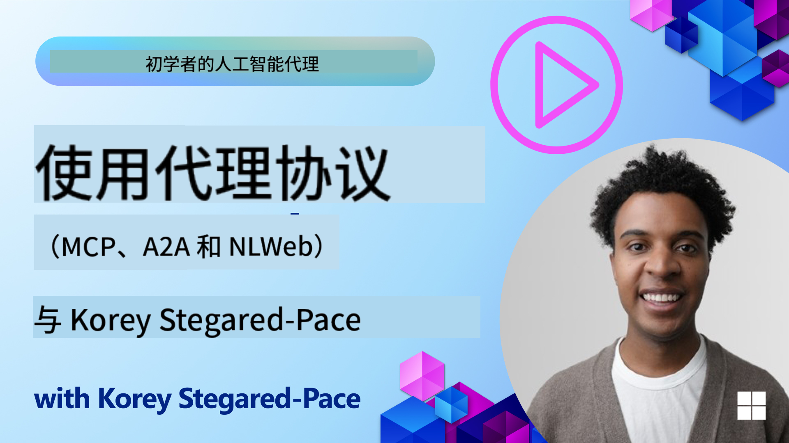
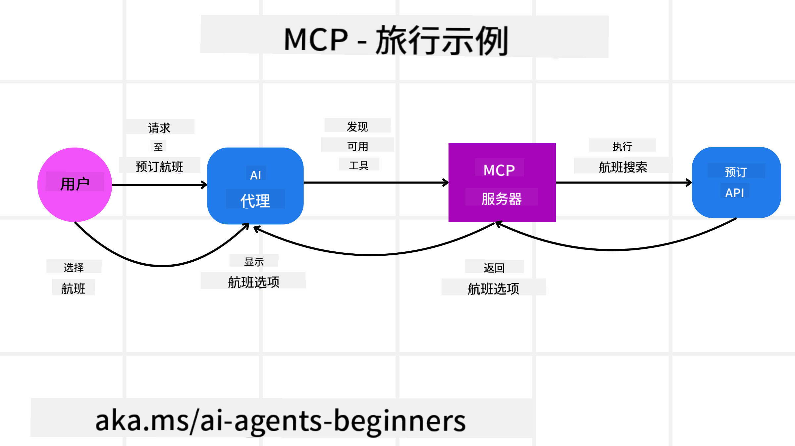
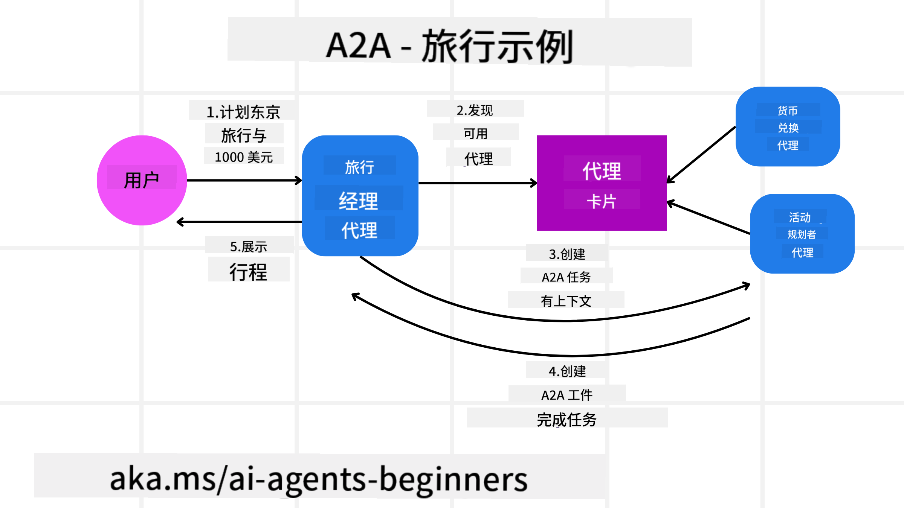
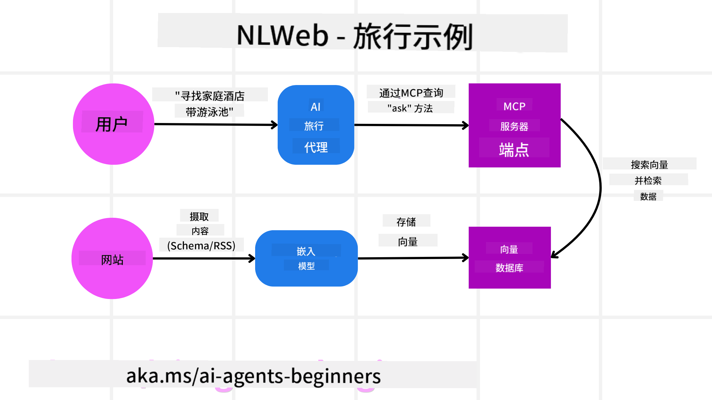

<!--
CO_OP_TRANSLATOR_METADATA:
{
  "original_hash": "5c05bcdfb163dfa2493db39dfb45ad9a",
  "translation_date": "2025-09-04T07:41:00+00:00",
  "source_file": "11-agentic-protocols/README.md",
  "language_code": "zh"
}
-->
# 使用 Agentic 协议 (MCP, A2A 和 NLWeb)

随着 AI 代理的使用不断增长，对确保标准化、安全性以及支持开放创新的协议需求也随之增加。在本课程中，我们将介绍三个旨在满足这些需求的协议——模型上下文协议 (MCP)、代理对代理 (A2A) 和自然语言网络 (NLWeb)。

## 课程简介

在本课程中，我们将讨论：

• **MCP** 如何让 AI 代理访问外部工具和数据以完成用户任务。

• **A2A** 如何实现不同 AI 代理之间的通信与协作。

• **NLWeb** 如何为任何网站带来自然语言界面，使 AI 代理能够发现并与内容互动。

## 学习目标

• **识别** MCP、A2A 和 NLWeb 在 AI 代理中的核心目的和优势。

• **解释** 每种协议如何促进 LLM、工具和其他代理之间的通信与交互。

• **理解** 每种协议在构建复杂代理系统中的独特角色。

## 模型上下文协议

**模型上下文协议 (MCP)** 是一种开放标准，为应用程序提供了一种标准化方式，以向 LLM 提供上下文和工具。这使得 AI 代理能够以一致的方式连接到不同的数据源和工具，充当“通用适配器”。

我们将探讨 MCP 的组成部分、与直接使用 API 的比较优势，以及 AI 代理如何使用 MCP 服务器的示例。

### MCP 核心组件

MCP 基于 **客户端-服务器架构**，其核心组件包括：

• **主机** 是 LLM 应用程序（例如代码编辑器 VSCode），负责启动与 MCP 服务器的连接。

• **客户端** 是主机应用程序中的组件，维护与服务器的一对一连接。

• **服务器** 是轻量级程序，提供特定功能。

协议中包含三个核心原语，即 MCP 服务器的功能：

• **工具**：这些是 AI 代理可以调用以执行操作的离散功能。例如，天气服务可能提供“获取天气”工具，或电商服务器可能提供“购买产品”工具。MCP 服务器会在其功能列表中公布每个工具的名称、描述以及输入/输出模式。

• **资源**：这些是只读数据项或文档，MCP 服务器可以提供，客户端可以按需检索。例如文件内容、数据库记录或日志文件。资源可以是文本（如代码或 JSON）或二进制（如图像或 PDF）。

• **提示**：这些是预定义模板，提供建议的提示，支持更复杂的工作流程。

### MCP 的优势

MCP 为 AI 代理提供了显著优势：

• **动态工具发现**：代理可以动态接收服务器提供的工具列表及其功能描述。这与传统 API 需要静态编码集成形成对比，传统 API 的任何更改都需要更新代码。MCP 提供了一种“一次集成”的方法，具有更高的适应性。

• **跨 LLM 的互操作性**：MCP 可在不同的 LLM 上运行，提供灵活性以切换核心模型以评估更好的性能。

• **标准化安全性**：MCP 包括标准认证方法，简化了添加对其他 MCP 服务器的访问。这比管理不同传统 API 的密钥和认证类型更简单。

### MCP 示例

假设用户希望使用 MCP 驱动的 AI 助手预订航班。

1. **连接**：AI 助手（MCP 客户端）连接到航空公司提供的 MCP 服务器。

2. **工具发现**：客户端询问航空公司的 MCP 服务器，“你有哪些工具可用？”服务器回复提供如“搜索航班”和“预订航班”的工具。

3. **工具调用**：用户向 AI 助手请求，“请搜索从波特兰到檀香山的航班。”AI 助手使用其 LLM 确定需要调用“搜索航班”工具，并将相关参数（出发地、目的地）传递给 MCP 服务器。

4. **执行与响应**：MCP 服务器作为包装器，实际调用航空公司的内部预订 API。然后接收航班信息（例如 JSON 数据），并将其发送回 AI 助手。

5. **进一步交互**：AI 助手展示航班选项。一旦用户选择航班，助手可能调用同一 MCP 服务器上的“预订航班”工具，完成预订。

## 代理对代理协议 (A2A)

虽然 MCP 专注于连接 LLM 和工具，**代理对代理协议 (A2A)** 更进一步，实现不同 AI 代理之间的通信与协作。A2A 连接来自不同组织、环境和技术栈的 AI 代理，以完成共享任务。

我们将探讨 A2A 的组成部分和优势，以及它在旅行应用中的应用示例。

### A2A 核心组件

A2A 专注于实现代理之间的通信，并让它们协作完成用户的子任务。协议的每个组件都为此贡献力量：

#### 代理卡片

类似于 MCP 服务器共享工具列表，代理卡片包含：
- 代理的名称。
- **代理完成的一般任务描述**。
- **具体技能列表**及其描述，帮助其他代理（甚至人类用户）了解何时以及为何调用该代理。
- 代理的**当前端点 URL**。
- 代理的**版本**和**功能**，如流式响应和推送通知。

#### 代理执行器

代理执行器负责**将用户聊天的上下文传递给远程代理**，远程代理需要这些信息来理解需要完成的任务。在 A2A 服务器中，代理使用其自己的大型语言模型 (LLM) 来解析传入请求，并使用其内部工具执行任务。

#### 工件

远程代理完成请求任务后，其工作成果会作为工件创建。工件**包含代理工作的结果**、**完成的任务描述**以及通过协议发送的**文本上下文**。工件发送后，与远程代理的连接会关闭，直到再次需要时重新建立。

#### 事件队列

此组件用于**处理更新和传递消息**。在生产环境中，它特别重要，以防止代理之间的连接在任务完成前关闭，尤其是当任务完成时间较长时。

### A2A 的优势

• **增强协作**：它使来自不同供应商和平台的代理能够交互、共享上下文并协作工作，促进传统上分离系统之间的无缝自动化。

• **模型选择灵活性**：每个 A2A 代理可以决定使用哪个 LLM 来处理请求，允许每个代理优化或微调模型，而不像某些 MCP 场景中只有单一 LLM 连接。

• **内置认证**：认证直接集成到 A2A 协议中，为代理交互提供了强大的安全框架。

### A2A 示例

让我们扩展旅行预订场景，这次使用 A2A。

1. **用户请求多代理**：用户与“旅行代理” A2A 客户端/代理交互，例如说：“请为下周预订去檀香山的整个行程，包括航班、酒店和租车。”

2. **旅行代理编排**：旅行代理收到这个复杂请求。它使用其 LLM 推理任务，并确定需要与其他专业代理交互。

3. **代理间通信**：旅行代理使用 A2A 协议连接到下游代理，例如“航空代理”、“酒店代理”和“租车代理”，这些代理由不同公司创建。

4. **委派任务执行**：旅行代理向这些专业代理发送具体任务（例如“查找檀香山航班”、“预订酒店”、“租车”）。每个专业代理运行自己的 LLM，并使用自己的工具（可能是 MCP 服务器），完成其特定部分的预订。

5. **综合响应**：所有下游代理完成任务后，旅行代理汇总结果（航班详情、酒店确认、租车预订），并以综合聊天式响应发送给用户。

## 自然语言网络 (NLWeb)

网站长期以来一直是用户访问互联网信息和数据的主要方式。

让我们看看 NLWeb 的不同组件、优势，以及通过旅行应用示例了解其工作原理。

### NLWeb 的组件

- **NLWeb 应用程序（核心服务代码）**：处理自然语言问题的系统。它连接平台的不同部分以生成响应。可以将其视为网站自然语言功能的**引擎**。

- **NLWeb 协议**：这是与网站进行自然语言交互的一组**基本规则**。它以 JSON 格式返回响应（通常使用 Schema.org）。其目的是为“AI 网络”创建一个简单的基础，就像 HTML 使在线共享文档成为可能一样。

- **MCP 服务器（模型上下文协议端点）**：每个 NLWeb 设置也充当**MCP 服务器**。这意味着它可以**与其他 AI 系统共享工具（如“ask”方法）和数据**。实际上，这使得网站的内容和功能可供 AI 代理使用，使网站成为更广泛“代理生态系统”的一部分。

- **嵌入模型**：这些模型用于**将网站内容转换为称为向量的数值表示**（嵌入）。这些向量以计算机可以比较和搜索的方式捕捉意义。它们存储在一个特殊的数据库中，用户可以选择使用哪种嵌入模型。

- **向量数据库（检索机制）**：此数据库**存储网站内容的嵌入**。当有人提出问题时，NLWeb 会检查向量数据库以快速找到最相关的信息。它提供一个快速的可能答案列表，并按相似度排序。NLWeb 支持不同的向量存储系统，如 Qdrant、Snowflake、Milvus、Azure AI Search 和 Elasticsearch。

### NLWeb 示例

考虑我们的旅行预订网站，这次由 NLWeb 驱动。

1. **数据摄取**：旅行网站现有的产品目录（例如航班列表、酒店描述、旅游套餐）使用 Schema.org 格式化或通过 RSS 提供。NLWeb 的工具摄取这些结构化数据，创建嵌入，并将其存储在本地或远程向量数据库中。

2. **自然语言查询（用户）**：用户访问网站，不再浏览菜单，而是在聊天界面中输入：“帮我找一个下周在檀香山适合家庭入住并带泳池的酒店。”

3. **NLWeb 处理**：NLWeb 应用程序接收此查询。它将查询发送到 LLM 以理解，同时搜索其向量数据库以找到相关酒店列表。

4. **准确结果**：LLM 帮助解释数据库的搜索结果，根据“适合家庭”、“泳池”和“檀香山”标准识别最佳匹配项，然后格式化自然语言响应。关键是，响应引用网站目录中的实际酒店，避免虚构信息。

5. **AI 代理交互**：由于 NLWeb 充当 MCP 服务器，外部 AI 旅行代理也可以连接到该网站的 NLWeb 实例。AI 代理可以使用 `ask` MCP 方法直接查询网站：`ask("檀香山地区有哪些酒店推荐的素食餐厅？")`。NLWeb 实例会处理此请求，利用其数据库中的餐厅信息（如果已加载），并返回结构化 JSON 响应。

### 关于 MCP/A2A/NLWeb 的更多问题？

加入 [Azure AI Foundry Discord](https://aka.ms/ai-agents/discord)，与其他学习者交流，参加办公时间并解答您的 AI 代理相关问题。

## 资源

- [MCP 初学者指南](https://aka.ms/mcp-for-beginners)  
- [MCP 文档](https://github.com/microsoft/semantic-kernel/tree/main/python/semantic-kernel/semantic_kernel/connectors/mcp)
- [NLWeb 仓库](https://github.com/nlweb-ai/NLWeb)
- [语义内核指南](https://learn.microsoft.com/semantic-kernel/)

---

**免责声明**：  
本文档使用AI翻译服务[Co-op Translator](https://github.com/Azure/co-op-translator)进行翻译。尽管我们努力确保准确性，但请注意，自动翻译可能包含错误或不准确之处。应以原始语言的文档作为权威来源。对于关键信息，建议使用专业人工翻译。因使用本翻译而引起的任何误解或误读，我们概不负责。