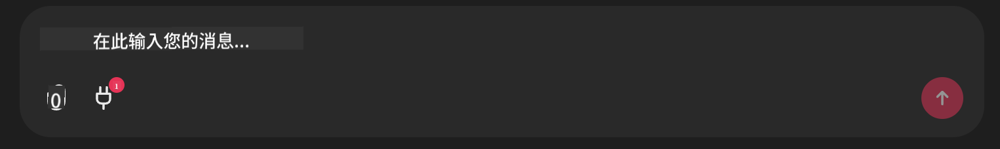

<!--
CO_OP_TRANSLATOR_METADATA:
{
  "original_hash": "9bf0395cbc541ce8db2a9699c8678dfc",
  "translation_date": "2025-08-28T09:55:40+00:00",
  "source_file": "11-agentic-protocols/code_samples/github-mcp/README.md",
  "language_code": "zh"
}
-->
# Github MCP 服务器示例

## 描述

这是为 Microsoft Reactor 举办的 AI Agents 黑客松创建的一个演示。

该工具用于根据用户的 Github 仓库推荐黑客松项目。具体流程如下：

1. **Github Agent** - 使用 Github MCP 服务器检索仓库及其相关信息。
2. **Hackathon Agent** - 根据 Github Agent 提供的数据，结合用户的项目、使用的编程语言以及 AI Agents 黑客松的项目主题，提出有创意的黑客松项目想法。
3. **Events Agent** - 根据 Hackathon Agent 的建议，推荐与 AI Agents 黑客松系列相关的活动。

## 运行代码

### 环境变量

此演示使用了 Azure Open AI Service、Semantic Kernel、Github MCP Server 和 Azure AI Search。

请确保已设置正确的环境变量以使用这些工具：

```python
AZURE_OPENAI_CHAT_DEPLOYMENT_NAME=""
AZURE_OPENAI_EMBEDDING_DEPLOYMENT_NAME=""
AZURE_OPENAI_ENDPOINT=""
AZURE_OPENAI_API_KEY=""
AZURE_OPENAI_API_VERSION=""
AZURE_SEARCH_SERVICE_ENDPOINT=""
AZURE_SEARCH_API_KEY=""
``` 

## 运行 Chainlit 服务器

为了连接 MCP 服务器，此演示使用 Chainlit 作为聊天界面。

在终端中运行以下命令以启动服务器：

```bash
chainlit run app.py -w
```

这将启动位于 `localhost:8000` 的 Chainlit 服务器，并将 `event-descriptions.md` 的内容填充到 Azure AI Search 索引中。

## 连接 MCP 服务器

要连接到 Github MCP 服务器，请点击“在此输入消息...”聊天框下方的“插头”图标：



然后点击“Connect an MCP”以添加连接到 Github MCP 服务器的命令：

```bash
npx -y @modelcontextprotocol/server-github --env GITHUB_PERSONAL_ACCESS_TOKEN=[YOUR PERSONAL ACCESS TOKEN]
```

将 "[YOUR PERSONAL ACCESS TOKEN]" 替换为您的实际个人访问令牌。

连接成功后，您应该会看到插头图标旁边显示一个 (1)，表示已连接。如果未显示，请尝试使用 `chainlit run app.py -w` 重新启动 Chainlit 服务器。

## 使用演示

要启动推荐黑客松项目的代理工作流，您可以输入类似以下的消息：

“为 Github 用户 koreyspace 推荐黑客松项目”

Router Agent 会分析您的请求，并确定最适合处理查询的代理组合（GitHub、Hackathon 和 Events）。这些代理将协同工作，基于 Github 仓库分析、项目创意生成以及相关技术活动，提供全面的推荐。

---

**免责声明**：  
本文档使用AI翻译服务 [Co-op Translator](https://github.com/Azure/co-op-translator) 进行翻译。尽管我们努力确保翻译的准确性，但请注意，自动翻译可能包含错误或不准确之处。原始语言的文档应被视为权威来源。对于重要信息，建议使用专业人工翻译。我们不对因使用此翻译而产生的任何误解或误读承担责任。