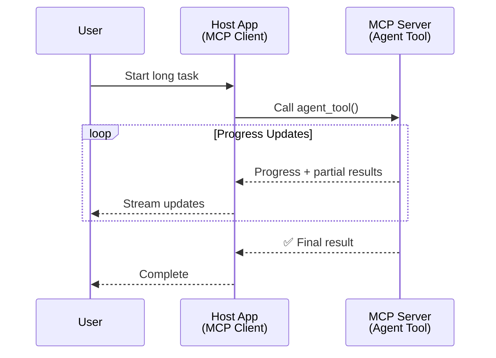
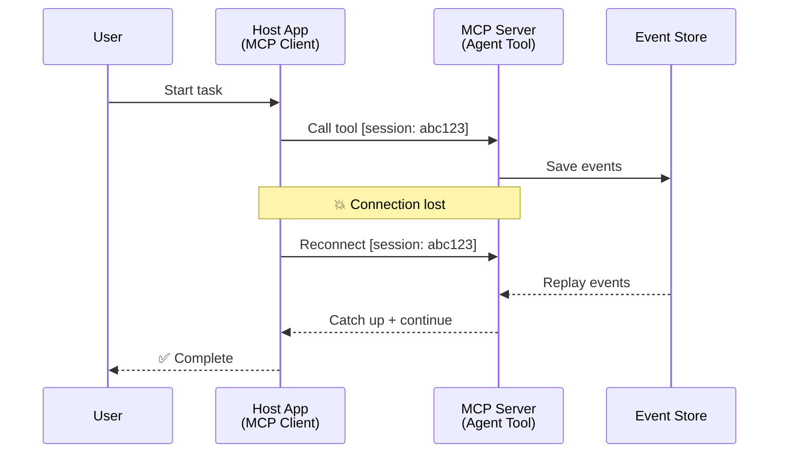
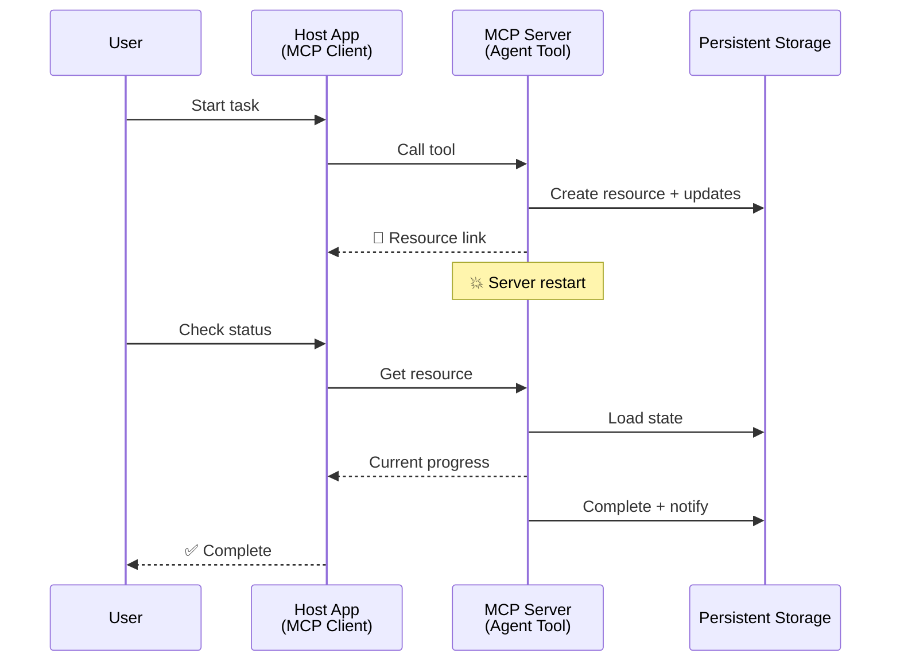
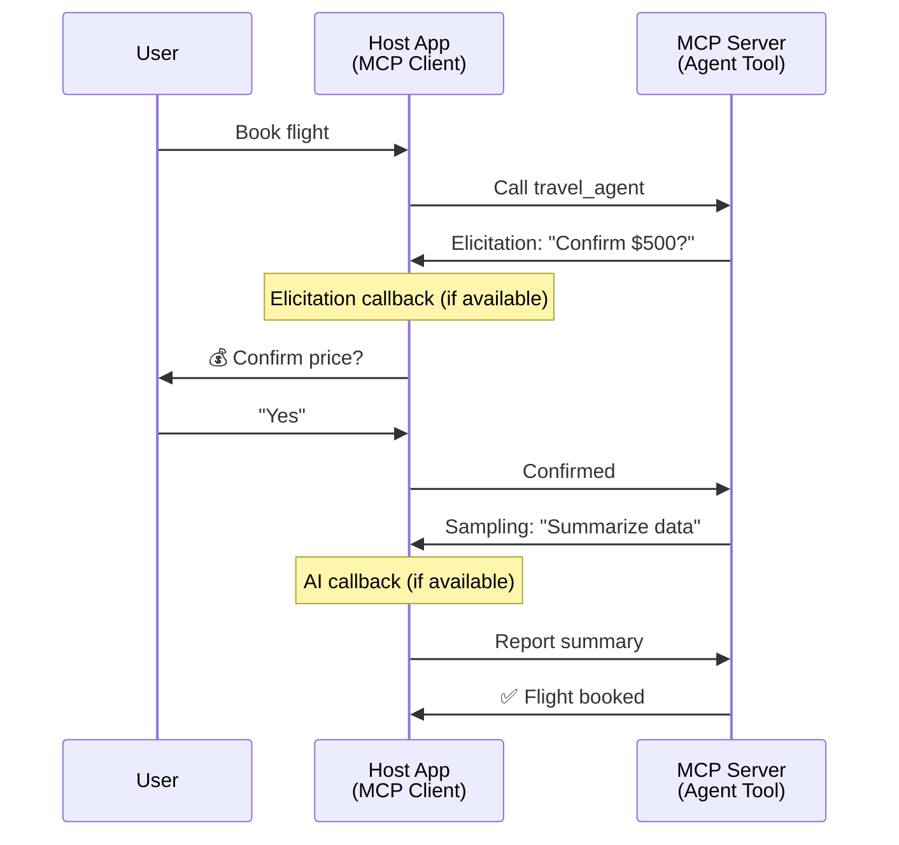
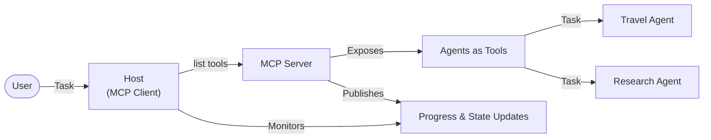

<!--
CO_OP_TRANSLATOR_METADATA:
{
  "original_hash": "5cc6836626047aa055e8960c8484a7d0",
  "translation_date": "2025-08-28T09:51:45+00:00",
  "source_file": "11-agentic-protocols/code_samples/mcp-agents/README.md",
  "language_code": "zh"
}
-->
# 使用 MCP 构建代理间通信系统

> 简而言之 - 能用 MCP 构建代理间通信吗？答案是：可以！

MCP 的功能已经远远超出了其最初“为 LLM 提供上下文”的目标。随着最近的功能增强，包括[可恢复流](https://modelcontextprotocol.io/docs/concepts/transports#resumability-and-redelivery)、[引导输入](https://modelcontextprotocol.io/specification/2025-06-18/client/elicitation)、[采样](https://modelcontextprotocol.io/specification/2025-06-18/client/sampling)以及通知（[进度](https://modelcontextprotocol.io/specification/2025-06-18/basic/utilities/progress)和[资源](https://modelcontextprotocol.io/specification/2025-06-18/schema#resourceupdatednotification)），MCP 现在为构建复杂的代理间通信系统提供了强大的基础。

## 关于代理/工具的误解

随着越来越多的开发者探索具有代理行为的工具（运行时间较长、可能需要在执行过程中额外输入等），一个常见的误解是 MCP 不适合这类场景，主要是因为其早期工具原语的示例集中在简单的请求-响应模式上。

这种看法已经过时了。过去几个月中，MCP 规范得到了显著增强，新增的功能弥补了构建长时间运行的代理行为的不足：

- **流式传输和部分结果**：在执行过程中实时更新进度
- **可恢复性**：客户端断开连接后可以重新连接并继续
- **持久性**：结果在服务器重启后仍然可用（例如，通过资源链接）
- **多轮交互**：通过引导输入和采样在执行过程中进行交互式输入

这些功能可以组合使用，以支持复杂的代理行为和多代理应用程序，所有这些都可以基于 MCP 协议部署。

在本文中，我们将把代理称为 MCP 服务器上可用的“工具”。这意味着存在一个主机应用程序，它实现了一个 MCP 客户端，与 MCP 服务器建立会话并调用代理。

## 什么使 MCP 工具具有“代理性”？

在深入实现之前，我们需要明确支持长时间运行代理所需的基础设施能力。

> 我们将代理定义为一种能够在长时间内自主运行的实体，能够处理可能需要多次交互或根据实时反馈进行调整的复杂任务。

### 1. 流式传输和部分结果

传统的请求-响应模式不适用于长时间运行的任务。代理需要提供：

- 实时进度更新
- 中间结果

**MCP 支持**：资源更新通知支持流式传输部分结果，但这需要仔细设计以避免与 JSON-RPC 的 1:1 请求/响应模型冲突。

| 功能                     | 用例                                                                                                                                         | MCP 支持                                                                                   |
| ------------------------ | -------------------------------------------------------------------------------------------------------------------------------------------- | ----------------------------------------------------------------------------------------- |
| 实时进度更新             | 用户请求代码库迁移任务。代理流式传输进度：“10% - 分析依赖项... 25% - 转换 TypeScript 文件... 50% - 更新导入...”                          | ✅ 进度通知                                                                                |
| 部分结果                 | “生成一本书”任务流式传输部分结果，例如：1）故事大纲，2）章节列表，3）每完成一个章节即发送。主机可以在任何阶段检查、取消或重定向。 | ✅ 通知可以“扩展”以包含部分结果，参见 PR 383 和 776 的提案                                |

<div align="center" style="font-style: italic; font-size: 0.95em; margin-bottom: 0.5em;">
<strong>图 1：</strong> 此图展示了 MCP 代理如何在长时间运行的任务中向主机应用程序流式传输实时进度更新和部分结果，使用户能够实时监控执行情况。
</div>



### 2. 可恢复性

代理必须能够优雅地处理网络中断：

- 在客户端断开连接后重新连接
- 从中断处继续（消息重新传递）

**MCP 支持**：MCP 的 StreamableHTTP 传输目前支持通过会话 ID 和最后事件 ID 实现会话恢复和消息重新传递。这里需要注意的是，服务器必须实现一个 EventStore，以便在客户端重新连接时回放事件。  
需要注意的是，社区提案（PR #975）正在探索与传输无关的可恢复流。

| 功能         | 用例                                                                                                                                       | MCP 支持                                                                 |
| ------------ | ------------------------------------------------------------------------------------------------------------------------------------------ | ----------------------------------------------------------------------- |
| 可恢复性     | 客户端在长时间运行任务期间断开连接。重新连接后，会话恢复，回放丢失的事件，无缝继续任务。                                                 | ✅ StreamableHTTP 传输支持会话 ID、事件回放和 EventStore                |

<div align="center" style="font-style: italic; font-size: 0.95em; margin-bottom: 0.5em;">
<strong>图 2：</strong> 此图展示了 MCP 的 StreamableHTTP 传输和事件存储如何实现无缝会话恢复：如果客户端断开连接，它可以重新连接并回放丢失的事件，从而继续任务而不会丢失进度。
</div>



### 3. 持久性

长时间运行的代理需要持久状态：

- 结果在服务器重启后仍然可用
- 状态可以通过外部方式检索
- 跨会话的进度跟踪

**MCP 支持**：MCP 现在支持工具调用返回资源链接类型。当前，一种可能的模式是设计一个工具，该工具创建一个资源并立即返回资源链接。工具可以在后台继续处理任务并更新资源。客户端可以选择轮询该资源的状态以获取部分或完整结果（取决于服务器提供的资源更新），或者订阅资源以接收更新通知。

这里的一个限制是，轮询资源或订阅更新可能会消耗资源，并在大规模使用时产生影响。社区中有一个开放提案（包括 #992），探索服务器调用客户端/主机应用程序以通知更新的 Webhook 或触发器的可能性。

| 功能         | 用例                                                                                                           | MCP 支持                                                                 |
| ------------ | ------------------------------------------------------------------------------------------------------------ | ----------------------------------------------------------------------- |
| 持久性       | 数据迁移任务期间服务器崩溃。结果和进度在重启后仍然存在，客户端可以检查状态并从持久资源中继续任务。           | ✅ 资源链接支持持久存储和状态通知                                       |

当前，一种常见的模式是设计一个工具，该工具创建一个资源并立即返回资源链接。工具可以在后台处理任务，发布资源通知作为进度更新或包含部分结果，并根据需要更新资源内容。

<div align="center" style="font-style: italic; font-size: 0.95em; margin-bottom: 0.5em;">
<strong>图 3：</strong> 此图展示了 MCP 代理如何使用持久资源和状态通知，确保长时间运行的任务在服务器重启后仍然可用，允许客户端检查进度并检索结果。
</div>



### 4. 多轮交互

代理通常需要在执行过程中额外输入：

- 人类的澄清或批准
- AI 的协助以完成复杂决策
- 动态参数调整

**MCP 支持**：通过采样（用于 AI 输入）和引导输入（用于人类输入）完全支持。

| 功能                 | 用例                                                                                                     | MCP 支持                                           |
| -------------------- | ------------------------------------------------------------------------------------------------------ | ------------------------------------------------ |
| 多轮交互             | 旅行预订代理请求用户确认价格，然后请求 AI 总结旅行数据，最后完成预订交易。                             | ✅ 引导输入支持人类输入，采样支持 AI 输入         |

<div align="center" style="font-style: italic; font-size: 0.95em; margin-bottom: 0.5em;">
<strong>图 4：</strong> 此图展示了 MCP 代理如何在执行过程中交互式地引导人类输入或请求 AI 协助，支持复杂的多轮工作流，例如确认和动态决策。
</div>



## 在 MCP 上实现长时间运行的代理 - 代码概览

作为本文的一部分，我们提供了一个[代码仓库](https://github.com/victordibia/ai-tutorials/tree/main/MCP%20Agents)，其中包含使用 MCP Python SDK 和 StreamableHTTP 传输实现长时间运行代理的完整示例。该实现展示了如何组合 MCP 功能以实现复杂的代理行为。

具体来说，我们实现了一个包含两个主要代理工具的服务器：

- **旅行代理** - 模拟一个通过引导输入确认价格的旅行预订服务
- **研究代理** - 执行研究任务，并通过采样生成 AI 辅助摘要

这两个代理展示了实时进度更新、交互式确认以及完整的会话恢复功能。

### 关键实现概念

以下部分展示了每项功能的服务器端代理实现和客户端主机处理：

#### 流式传输和进度更新 - 实时任务状态

流式传输使代理能够在长时间运行的任务中提供实时进度更新，确保用户了解任务状态和中间结果。

**服务器实现（代理发送进度通知）：**

```python
# From server/server.py - Travel agent sending progress updates
for i, step in enumerate(steps):
    await ctx.session.send_progress_notification(
        progress_token=ctx.request_id,
        progress=i * 25,
        total=100,
        message=step,
        related_request_id=str(ctx.request_id)
    )
    await anyio.sleep(2)  # Simulate work

# Alternative: Log messages for detailed step-by-step updates
await ctx.session.send_log_message(
    level="info",
    data=f"Processing step {current_step}/{steps} ({progress_percent}%)",
    logger="long_running_agent",
    related_request_id=ctx.request_id,
)
```

**客户端实现（主机接收进度更新）：**

```python
# From client/client.py - Client handling real-time notifications
async def message_handler(message) -> None:
    if isinstance(message, types.ServerNotification):
        if isinstance(message.root, types.LoggingMessageNotification):
            console.print(f"📡 [dim]{message.root.params.data}[/dim]")
        elif isinstance(message.root, types.ProgressNotification):
            progress = message.root.params
            console.print(f"🔄 [yellow]{progress.message} ({progress.progress}/{progress.total})[/yellow]")

# Register message handler when creating session
async with ClientSession(
    read_stream, write_stream,
    message_handler=message_handler
) as session:
```

#### 引导输入 - 请求用户输入

引导输入使代理能够在执行过程中请求用户输入。这对于长时间运行任务中的确认、澄清或批准至关重要。

**服务器实现（代理请求确认）：**

```python
# From server/server.py - Travel agent requesting price confirmation
elicit_result = await ctx.session.elicit(
    message=f"Please confirm the estimated price of $1200 for your trip to {destination}",
    requestedSchema=PriceConfirmationSchema.model_json_schema(),
    related_request_id=ctx.request_id,
)

if elicit_result and elicit_result.action == "accept":
    # Continue with booking
    logger.info(f"User confirmed price: {elicit_result.content}")
elif elicit_result and elicit_result.action == "decline":
    # Cancel the booking
    booking_cancelled = True
```

**客户端实现（主机提供引导输入回调）：**

```python
# From client/client.py - Client handling elicitation requests
async def elicitation_callback(context, params):
    console.print(f"💬 Server is asking for confirmation:")
    console.print(f"   {params.message}")

    response = console.input("Do you accept? (y/n): ").strip().lower()

    if response in ['y', 'yes']:
        return types.ElicitResult(
            action="accept",
            content={"confirm": True, "notes": "Confirmed by user"}
        )
    else:
        return types.ElicitResult(
            action="decline",
            content={"confirm": False, "notes": "Declined by user"}
        )

# Register the callback when creating the session
async with ClientSession(
    read_stream, write_stream,
    elicitation_callback=elicitation_callback
) as session:
```

#### 采样 - 请求 AI 协助

采样允许代理在执行过程中请求 LLM 协助以完成复杂决策或内容生成。这支持人类与 AI 的混合工作流。

**服务器实现（代理请求 AI 协助）：**

```python
# From server/server.py - Research agent requesting AI summary
sampling_result = await ctx.session.create_message(
    messages=[
        SamplingMessage(
            role="user",
            content=TextContent(type="text", text=f"Please summarize the key findings for research on: {topic}")
        )
    ],
    max_tokens=100,
    related_request_id=ctx.request_id,
)

if sampling_result and sampling_result.content:
    if sampling_result.content.type == "text":
        sampling_summary = sampling_result.content.text
        logger.info(f"Received sampling summary: {sampling_summary}")
```

**客户端实现（主机提供采样回调）：**

```python
# From client/client.py - Client handling sampling requests
async def sampling_callback(context, params):
    message_text = params.messages[0].content.text if params.messages else 'No message'
    console.print(f"🧠 Server requested sampling: {message_text}")

    # In a real application, this could call an LLM API
    # For demo purposes, we provide a mock response
    mock_response = "Based on current research, MCP has evolved significantly..."

    return types.CreateMessageResult(
        role="assistant",
        content=types.TextContent(type="text", text=mock_response),
        model="interactive-client",
        stopReason="endTurn"
    )

# Register the callback when creating the session
async with ClientSession(
    read_stream, write_stream,
    sampling_callback=sampling_callback,
    elicitation_callback=elicitation_callback
) as session:
```

#### 可恢复性 - 跨断连的会话连续性

可恢复性确保长时间运行的代理任务能够在客户端断开连接后继续无缝运行。这通过事件存储和恢复令牌实现。

**事件存储实现（服务器保存会话状态）：**

```python
# From server/event_store.py - Simple in-memory event store
class SimpleEventStore(EventStore):
    def __init__(self):
        self._events: list[tuple[StreamId, EventId, JSONRPCMessage]] = []
        self._event_id_counter = 0

    async def store_event(self, stream_id: StreamId, message: JSONRPCMessage) -> EventId:
        """Store an event and return its ID."""
        self._event_id_counter += 1
        event_id = str(self._event_id_counter)
        self._events.append((stream_id, event_id, message))
        return event_id

    async def replay_events_after(self, last_event_id: EventId, send_callback: EventCallback) -> StreamId | None:
        """Replay events after the specified ID for resumption."""
        # Find events after the last known event and replay them
        for _, event_id, message in self._events[start_index:]:
            await send_callback(EventMessage(message, event_id))

# From server/server.py - Passing event store to session manager
def create_server_app(event_store: Optional[EventStore] = None) -> Starlette:
    server = ResumableServer()

    # Create session manager with event store for resumption
    session_manager = StreamableHTTPSessionManager(
        app=server,
        event_store=event_store,  # Event store enables session resumption
        json_response=False,
        security_settings=security_settings,
    )

    return Starlette(routes=[Mount("/mcp", app=session_manager.handle_request)])

# Usage: Initialize with event store
event_store = SimpleEventStore()
app = create_server_app(event_store)
```

**客户端元数据与恢复令牌（客户端使用存储的状态重新连接）：**

```python
# From client/client.py - Client resumption with metadata
if existing_tokens and existing_tokens.get("resumption_token"):
    # Use existing resumption token to continue where we left off
    metadata = ClientMessageMetadata(
        resumption_token=existing_tokens["resumption_token"],
    )
else:
    # Create callback to save resumption token when received
    def enhanced_callback(token: str):
        protocol_version = getattr(session, 'protocol_version', None)
        token_manager.save_tokens(session_id, token, protocol_version, command, args)

    metadata = ClientMessageMetadata(
        on_resumption_token_update=enhanced_callback,
    )

# Send request with resumption metadata
result = await session.send_request(
    types.ClientRequest(
        types.CallToolRequest(
            method="tools/call",
            params=types.CallToolRequestParams(name=command, arguments=args)
        )
    ),
    types.CallToolResult,
    metadata=metadata,
)
```

主机应用程序本地维护会话 ID 和恢复令牌，使其能够重新连接到现有会话，而不会丢失进度或状态。

### 代码组织

<div align="center" style="font-style: italic; font-size: 0.95em; margin-bottom: 0.5em;">
<strong>图 5：</strong> 基于 MCP 的代理系统架构
</div>



**关键文件：**

- **`server/server.py`** - 可恢复的 MCP 服务器，包含展示引导输入、采样和进度更新的旅行和研究代理
- **`client/client.py`** - 交互式主机应用程序，支持恢复、回调处理和令牌管理
- **`server/event_store.py`** - 实现事件存储以支持会话恢复和消息重新传递

## 在 MCP 上扩展到多代理通信

上述实现可以通过增强主机应用程序的智能和范围扩展到多代理系统：

- **智能任务分解**：主机分析复杂用户请求并将其分解为不同专用代理的子任务
- **多服务器协调**：主机维护与多个 MCP 服务器的连接，每个服务器提供不同的代理能力
- **任务状态管理**：主机跟踪多个并发代理任务的进度，处理依赖关系和任务顺序
- **弹性与重试**：主机管理故障，实施重试逻辑，并在代理不可用时重新分配任务
- **结果合成**：主机将多个代理的输出组合成连贯的最终结果

主机从一个简单的客户端演变为一个智能的协调器，在保持 MCP 协议基础的同时协调分布式代理能力。

## 结论

MCP 的增强功能——资源通知、引导输入/采样、可恢复流和持久资源——在保持协议简单性的同时，支持复杂的代理间交互。

## 入门

准备好构建自己的代理间通信系统了吗？按照以下步骤操作：

### 1. 运行演示

```bash
# Start the server with event store for resumption
python -m server.server --port 8006

# In another terminal, run the interactive client
python -m client.client --url http://127.0.0.1:8006/mcp
```

**交互模式下可用命令：**

- `travel_agent` - 通过引导输入确认价格的旅行预订
- `research_agent` - 使用 AI 辅助摘要研究主题
- `list` - 显示所有可用工具
- `clean-tokens` - 清除恢复令牌
- `help` - 显示详细命令帮助
- `quit` - 退出客户端

### 2. 测试恢复功能

- 启动一个长时间运行的代理（例如 `travel_agent`）
- 在执行过程中中断客户端（Ctrl+C）
- 重新启动客户端 - 它将自动从中断处恢复

### 3. 探索和扩展

- **探索示例**：查看此 [mcp-agents](https://github.com/victordibia/ai-tutorials/tree/main/MCP%20Agents)
- **加入社区**：参与 GitHub 上的 MCP 讨论
- **尝试实验**：从一个简单的长时间运行任务开始，逐步添加流式传输、可恢复性和多代理协调

这展示了 MCP 如何在保持工具简单性的同时实现智能代理行为。

总体而言，MCP 协议规范正在快速发展；建议读者访问官方文档网站以获取最新更新 - https://modelcontextprotocol.io/introduction

---

**免责声明**：  
本文档使用AI翻译服务 [Co-op Translator](https://github.com/Azure/co-op-translator) 进行翻译。尽管我们努力确保翻译的准确性，但请注意，自动翻译可能包含错误或不准确之处。原始语言的文档应被视为权威来源。对于关键信息，建议使用专业人工翻译。我们不对因使用此翻译而产生的任何误解或误读承担责任。