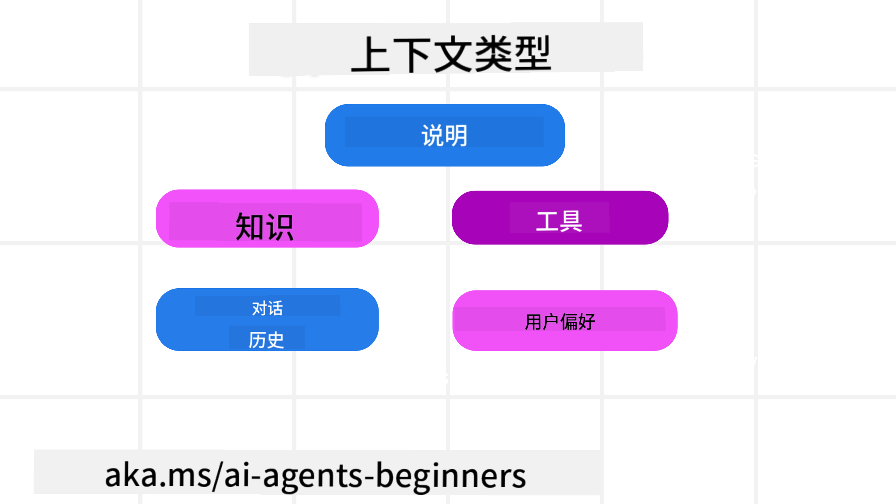
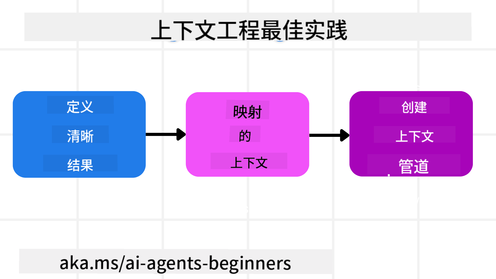

<!--
CO_OP_TRANSLATOR_METADATA:
{
  "original_hash": "cb7e50f471905ce6fdb92a30269a7a98",
  "translation_date": "2025-09-04T09:48:05+00:00",
  "source_file": "12-context-engineering/README.md",
  "language_code": "zh"
}
-->
# 为 AI 代理进行上下文工程

> _(点击上方图片观看本课视频)_

理解您为其构建 AI 代理的应用程序的复杂性，对于创建一个可靠的代理至关重要。我们需要构建能够有效管理信息的 AI 代理，以满足超越提示工程的复杂需求。

在本课中，我们将探讨什么是上下文工程，以及它在构建 AI 代理中的作用。

## 课程简介

本课将涵盖：

• **什么是上下文工程**，以及它与提示工程的不同之处。

• **有效上下文工程的策略**，包括如何编写、选择、压缩和隔离信息。

• **常见的上下文问题**，这些问题可能会使您的 AI 代理偏离轨道，以及如何解决这些问题。

## 学习目标

完成本课后，您将能够：

• **定义上下文工程**，并将其与提示工程区分开来。

• **识别大型语言模型 (LLM) 应用中的关键上下文组成部分**。

• **应用编写、选择、压缩和隔离上下文的策略**，以提升代理性能。

• **识别常见的上下文问题**，如污染、干扰、混淆和冲突，并实施相应的缓解技术。

## 什么是上下文工程？

对于 AI 代理来说，上下文是驱动其规划采取特定行动的核心。上下文工程是确保 AI 代理拥有完成任务下一步所需正确信息的实践。由于上下文窗口的大小有限，作为代理构建者，我们需要设计系统和流程来管理上下文窗口中的信息添加、移除和压缩。

### 提示工程与上下文工程

提示工程专注于一组静态指令，用以通过规则有效引导 AI 代理。而上下文工程则是管理动态信息集（包括初始提示）的过程，以确保 AI 代理在整个过程中拥有所需的信息。上下文工程的核心理念是使这一过程可重复且可靠。

### 上下文的类型

需要记住的是，上下文并非单一的事物。AI 代理所需的信息可能来自多种不同来源，而我们需要确保代理能够访问这些来源：

AI 代理可能需要管理的上下文类型包括：

• **指令：** 这些类似于代理的“规则”——提示、系统消息、少样本示例（向 AI 展示如何完成某项任务）以及其可用工具的描述。这是提示工程与上下文工程结合的地方。

• **知识：** 包括事实、从数据库中检索的信息或代理积累的长期记忆。这可能涉及集成检索增强生成 (RAG) 系统，以便代理访问不同的知识库和数据库。

• **工具：** 包括代理可以调用的外部函数、API 和 MCP 服务器的定义，以及使用这些工具后获得的反馈（结果）。

• **对话历史：** 与用户的持续对话。随着时间推移，这些对话会变得越来越长、越来越复杂，占据更多的上下文窗口空间。

• **用户偏好：** 随时间积累的用户喜好或厌恶信息。这些信息可以在做出关键决策时调用，以更好地帮助用户。

## 有效上下文工程的策略

### 规划策略

良好的上下文工程始于良好的规划。以下是帮助您开始思考如何应用上下文工程概念的方法：

1. **定义清晰的结果** - AI 代理将被分配的任务结果应清晰定义。回答这个问题——“当 AI 代理完成任务时，世界会是什么样子？”换句话说，用户在与 AI 代理交互后应获得什么样的变化、信息或响应。

2. **绘制上下文图** - 一旦定义了 AI 代理的任务结果，您需要回答“AI 代理需要什么信息来完成这项任务？”这样，您可以开始绘制这些信息的来源。

3. **创建上下文管道** - 知道信息来源后，您需要回答“代理将如何获取这些信息？”这可以通过多种方式实现，包括 RAG、使用 MCP 服务器和其他工具。

### 实用策略

规划很重要，但一旦信息开始流入代理的上下文窗口，我们需要有实际的管理策略：

#### 管理上下文

虽然某些信息会自动添加到上下文窗口中，但上下文工程需要对这些信息采取更主动的管理方式，可以通过以下几种策略实现：

1. **代理便笺本**  
   允许 AI 代理在单次会话中记录当前任务和用户交互的相关信息。这些信息应存储在上下文窗口之外，例如文件或运行时对象中，以便代理在需要时检索。

2. **记忆**  
   便笺本适用于管理单次会话上下文窗口之外的信息，而记忆则使代理能够跨多个会话存储和检索相关信息。这可能包括摘要、用户偏好和未来改进的反馈。

3. **压缩上下文**  
   当上下文窗口增长并接近其限制时，可以使用摘要和修剪等技术。这包括仅保留最相关的信息或移除较旧的消息。

4. **多代理系统**  
   开发多代理系统是一种上下文工程形式，因为每个代理都有自己的上下文窗口。在构建这些系统时，需要规划如何共享和传递上下文。

5. **沙盒环境**  
   如果代理需要运行一些代码或处理文档中的大量信息，这可能会占用大量令牌来处理结果。代理可以使用沙盒环境运行代码，仅读取结果和其他相关信息，而不是将所有内容存储在上下文窗口中。

6. **运行时状态对象**  
   通过创建信息容器来管理代理需要访问某些信息的情况。对于复杂任务，这使代理能够逐步存储每个子任务的结果，从而使上下文仅与特定子任务保持关联。

### 上下文工程示例

假设我们希望一个 AI 代理 **“帮我预订去巴黎的旅行。”**

• 一个仅使用提示工程的简单代理可能只会回答：**“好的，您想什么时候去巴黎？”** 它只处理了用户在提问时的直接问题。

• 一个使用本课中提到的上下文工程策略的代理会做得更多。在回答之前，它的系统可能会：

  ◦ **检查您的日历** 以获取可用日期（实时数据检索）。  
  ◦ **回忆过去的旅行偏好**（来自长期记忆），例如您喜欢的航空公司、预算或是否偏好直飞航班。  
  ◦ **识别可用工具** 用于预订航班和酒店。  

- 然后，一个示例响应可能是：  
  “您好 [您的名字]！我看到您在十月的第一周有空。我是否可以帮您查找 [您喜欢的航空公司] 的直飞巴黎航班，预算控制在 [预算] 内？”  
  这种更丰富、更具上下文感知的响应展示了上下文工程的强大之处。

## 常见的上下文问题

### 上下文污染

**问题描述：** 当 LLM 生成的幻觉（虚假信息）或错误进入上下文并被反复引用时，可能导致代理追求不可能的目标或制定无意义的策略。

**解决方法：** 实施 **上下文验证** 和 **隔离**。在将信息添加到长期记忆之前进行验证。如果检测到潜在污染，启动新的上下文线程以防止错误信息传播。

**旅行预订示例：** 您的代理虚构了一个 **从小型地方机场直飞远程国际城市** 的航班，而实际上该机场并不提供国际航班。这一不存在的航班信息被保存到上下文中。之后，当您要求代理预订时，它不断尝试为这一不可能的航线寻找票务，导致重复错误。

**解决方案：** 添加一个步骤，通过实时 API 验证航班的存在和航线 _在_ 将航班信息添加到代理的工作上下文之前。如果验证失败，则将错误信息“隔离”，不再进一步使用。

### 上下文干扰

**问题描述：** 当上下文变得过于庞大时，模型可能过于关注累积的历史，而忽略了训练中学到的内容，导致重复或无用的行为。甚至在上下文窗口填满之前，模型就可能开始犯错。

**解决方法：** 使用 **上下文摘要**。定期将累积信息压缩为更短的摘要，保留重要细节，同时移除冗余历史。这有助于“重置”模型的关注点。

**旅行预订示例：** 您长时间讨论了各种梦想旅行目的地，包括详细回忆两年前的背包旅行。当您最终要求 **“帮我找下个月的便宜航班”** 时，代理因旧的、不相关的细节而分心，不断询问您的背包装备或过去的行程，而忽略了当前的请求。

**解决方案：** 在一定轮次后或上下文过大时，代理应 **总结最近且相关的对话部分**——专注于当前的旅行日期和目的地——并使用该压缩摘要进行下一次 LLM 调用，丢弃不相关的历史聊天。

### 上下文混淆

**问题描述：** 当上下文中存在过多不必要的信息（通常是过多的可用工具）时，模型可能生成错误的响应或调用无关的工具。小型模型尤其容易出现这种问题。

**解决方法：** 使用 **工具加载管理** 和 RAG 技术。将工具描述存储在向量数据库中，并为每个特定任务选择 _仅_ 最相关的工具。研究表明，将工具选择限制在 30 个以下效果更佳。

**旅行预订示例：** 您的代理可以访问几十种工具：`book_flight`、`book_hotel`、`rent_car`、`find_tours`、`currency_converter`、`weather_forecast`、`restaurant_reservations` 等。您询问 **“在巴黎最好的出行方式是什么？”** 由于工具数量过多，代理可能会混淆，尝试在巴黎内部调用 `book_flight`，或者调用 `rent_car`，尽管您更喜欢公共交通，因为工具描述可能存在重叠，或者代理无法分辨最佳选择。

**解决方案：** 使用 **RAG 技术筛选工具描述**。当您询问巴黎的出行方式时，系统动态检索 _仅_ 最相关的工具，如 `rent_car` 或 `public_transport_info`，为 LLM 提供一个精简的“工具加载”。

### 上下文冲突

**问题描述：** 当上下文中存在冲突信息时，可能导致推理不一致或生成错误的最终响应。这通常发生在信息分阶段到达时，早期的错误假设仍保留在上下文中。

**解决方法：** 使用 **上下文修剪** 和 **卸载**。修剪是指在新信息到达时移除过时或冲突的信息。卸载则为模型提供一个单独的“便笺本”工作区，以便处理信息而不干扰主上下文。

**旅行预订示例：** 您最初告诉代理 **“我想坐经济舱。”** 后来在对话中改变主意，说 **“其实这次我想坐商务舱。”** 如果两条指令都保留在上下文中，代理可能会收到冲突的搜索结果，或者在优先处理哪条指令时感到困惑。

**解决方案：** 实施 **上下文修剪**。当新指令与旧指令冲突时，移除旧指令或明确覆盖旧指令。或者，代理可以使用 **便笺本** 来协调冲突的偏好，确保最终只有一致的指令指导其行动。

## 对上下文工程还有疑问？

加入 [Azure AI Foundry Discord](https://aka.ms/ai-agents/discord)，与其他学习者交流，参加答疑时间，并获取您的 AI 代理相关问题的解答。

---

**免责声明**：  
本文档使用AI翻译服务[Co-op Translator](https://github.com/Azure/co-op-translator)进行翻译。尽管我们努力确保翻译的准确性，但请注意，自动翻译可能包含错误或不准确之处。原始语言的文档应被视为权威来源。对于关键信息，建议使用专业人工翻译。我们不对因使用此翻译而产生的任何误解或误读承担责任。