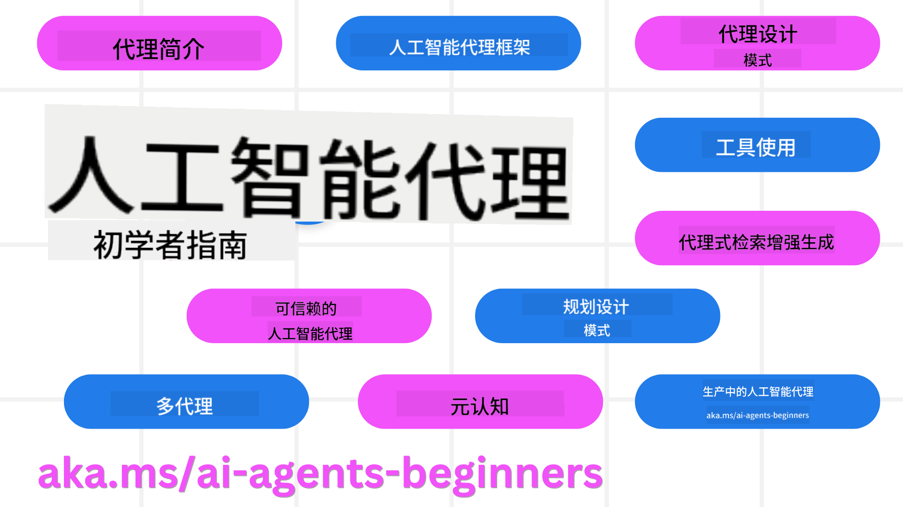

<!--
CO_OP_TRANSLATOR_METADATA:
{
  "original_hash": "6b07046397366e6f6f4524c9ddeba1e1",
  "translation_date": "2025-07-12T14:43:09+00:00",
  "source_file": "README.md",
  "language_code": "zh"
}
-->
# AI 代理入门课程

## 11 节课，教你构建 AI 代理所需的全部知识

### 🌐 多语言支持

#### 通过 GitHub Action 支持（自动且始终保持最新）

[法语](../fr/README.md) | [西班牙语](../es/README.md) | [德语](../de/README.md) | [俄语](../ru/README.md) | [阿拉伯语](../ar/README.md) | [波斯语 (Farsi)](../fa/README.md) | [乌尔都语](../ur/README.md) | [中文（简体）](./README.md) | [中文（繁体，澳门）](../mo/README.md) | [中文（繁体，香港）](../hk/README.md) | [中文（繁体，台湾）](../tw/README.md) | [日语](../ja/README.md) | [韩语](../ko/README.md) | [印地语](../hi/README.md) | [孟加拉语](../bn/README.md) | [马拉地语](../mr/README.md) | [尼泊尔语](../ne/README.md) | [旁遮普语 (Gurmukhi)](../pa/README.md) | [葡萄牙语（葡萄牙）](../pt/README.md) | [葡萄牙语（巴西）](../br/README.md) | [意大利语](../it/README.md) | [波兰语](../pl/README.md) | [土耳其语](../tr/README.md) | [希腊语](../el/README.md) | [泰语](../th/README.md) | [瑞典语](../sv/README.md) | [丹麦语](../da/README.md) | [挪威语](../no/README.md) | [芬兰语](../fi/README.md) | [荷兰语](../nl/README.md) | [希伯来语](../he/README.md) | [越南语](../vi/README.md) | [印尼语](../id/README.md) | [马来语](../ms/README.md) | [他加禄语（菲律宾语）](../tl/README.md) | [斯瓦希里语](../sw/README.md) | [匈牙利语](../hu/README.md) | [捷克语](../cs/README.md) | [斯洛伐克语](../sk/README.md) | [罗马尼亚语](../ro/README.md) | [保加利亚语](../bg/README.md) | [塞尔维亚语（西里尔字母）](../sr/README.md) | [克罗地亚语](../hr/README.md) | [斯洛文尼亚语](../sl/README.md) | [乌克兰语](../uk/README.md) | [缅甸语](../my/README.md)

**如果您希望支持更多翻译语言，列表见[这里](https://github.com/Azure/co-op-translator/blob/main/getting_started/supported-languages.md)**

## 🌱 入门指南

本课程包含 11 节课，涵盖构建 AI 代理的基础知识。每节课都有独立主题，您可以从任何一节开始学习！

本课程支持多语言。请查看我们的[可用语言列表](../..)。

如果您是第一次使用生成式 AI 模型构建项目，推荐先学习我们的[生成式 AI 入门课程](https://aka.ms/genai-beginners)，该课程包含 21 节课，专注于生成式 AI 的构建。

别忘了给本仓库[点星 (🌟)](https://docs.github.com/en/get-started/exploring-projects-on-github/saving-repositories-with-stars?WT.mc_id=academic-105485-koreyst)并[Fork 本仓库](https://github.com/microsoft/ai-agents-for-beginners/fork)来运行代码。

### 你需要准备的东西

本课程每节课都包含代码示例，位于 code_samples 文件夹中。你可以[Fork 本仓库](https://github.com/microsoft/ai-agents-for-beginners/fork)来创建自己的副本。

这些练习中的代码示例使用 Azure AI Foundry 和 GitHub 模型目录与语言模型交互：

- [Github Models](https://aka.ms/ai-agents-beginners/github-models) - 免费 / 有限制
- [Azure AI Foundry](https://aka.ms/ai-agents-beginners/ai-foundry) - 需要 Azure 账号

本课程还使用了微软的以下 AI 代理框架和服务：

- [Azure AI Agent Service](https://aka.ms/ai-agents-beginners/ai-agent-service)
- [Semantic Kernel](https://aka.ms/ai-agents-beginners/semantic-kernel)
- [AutoGen](https://aka.ms/ai-agents/autogen)

关于如何运行本课程代码的更多信息，请参见[课程设置](./00-course-setup/README.md)。

## 🙏 想要帮忙吗？

如果你有建议或发现拼写或代码错误，请[提交 issue](https://github.com/microsoft/ai-agents-for-beginners/issues?WT.mc_id=academic-105485-koreyst)或[创建 pull request](https://github.com/microsoft/ai-agents-for-beginners/pulls?WT.mc_id=academic-105485-koreyst)。

如果你遇到困难或对构建 AI 代理有任何疑问，欢迎加入我们的[Azure AI Foundry 社区 Discord](https://discord.gg/kzRShWzttr)。

如果你在构建过程中有产品反馈或遇到错误，请访问我们的[Azure AI Foundry 开发者论坛](https://aka.ms/azureaifoundry/forum)。

## 📂 每节课包含

- 课程文本（位于 README）和简短视频
- 支持 Azure AI Foundry 和 Github Models（免费）的 Python 代码示例
- 额外学习资源链接，助你持续进步

## 🗃️ 课程列表

| **课程**                               | **文本 & 代码**                                    | **视频**                                                  | **额外学习资源**                                                                     |
|------------------------------------------|----------------------------------------------------|------------------------------------------------------------|----------------------------------------------------------------------------------------|
| AI 代理简介及应用场景                   | [链接](./01-intro-to-ai-agents/README.md)          | [视频](https://youtu.be/3zgm60bXmQk?si=z8QygFvYQv-9WtO1)  | [链接](https://aka.ms/ai-agents-beginners/collection?WT.mc_id=academic-105485-koreyst) |
| 探索 AI 代理框架                       | [链接](./02-explore-agentic-frameworks/README.md)  | [视频](https://youtu.be/ODwF-EZo_O8?si=Vawth4hzVaHv-u0H)  | [链接](https://aka.ms/ai-agents-beginners/collection?WT.mc_id=academic-105485-koreyst) |
| 理解 AI 代理设计模式                   | [链接](./03-agentic-design-patterns/README.md)     | [视频](https://youtu.be/m9lM8qqoOEA?si=BIzHwzstTPL8o9GF)  | [链接](https://aka.ms/ai-agents-beginners/collection?WT.mc_id=academic-105485-koreyst) |
| 工具使用设计模式                       | [链接](./04-tool-use/README.md)                    | [视频](https://youtu.be/vieRiPRx-gI?si=2z6O2Xu2cu_Jz46N)  | [链接](https://aka.ms/ai-agents-beginners/collection?WT.mc_id=academic-105485-koreyst) |
| 代理式 RAG                            | [链接](./05-agentic-rag/README.md)                 | [视频](https://youtu.be/WcjAARvdL7I?si=gKPWsQpKiIlDH9A3)  | [链接](https://aka.ms/ai-agents-beginners/collection?WT.mc_id=academic-105485-koreyst) |
| 构建可信赖的 AI 代理                   | [链接](./06-building-trustworthy-agents/README.md) | [视频](https://youtu.be/iZKkMEGBCUQ?si=jZjpiMnGFOE9L8OK ) | [链接](https://aka.ms/ai-agents-beginners/collection?WT.mc_id=academic-105485-koreyst) |
| 规划设计模式                         | [链接](./07-planning-design/README.md)             | [视频](https://youtu.be/kPfJ2BrBCMY?si=6SC_iv_E5-mzucnC)  | [链接](https://aka.ms/ai-agents-beginners/collection?WT.mc_id=academic-105485-koreyst) |
| 多代理设计模式                       | [链接](./08-multi-agent/README.md)                 | [视频](https://youtu.be/V6HpE9hZEx0?si=rMgDhEu7wXo2uo6g)  | [链接](https://aka.ms/ai-agents-beginners/collection?WT.mc_id=academic-105485-koreyst) |
| 元认知设计模式                       | [链接](./09-metacognition/README.md)               | [视频](https://youtu.be/His9R6gw6Ec?si=8gck6vvdSNCt6OcF)  | [链接](https://aka.ms/ai-agents-beginners/collection?WT.mc_id=academic-105485-koreyst) |
| AI 代理的生产环境应用                 | [链接](./10-ai-agents-production/README.md)        | [视频](https://youtu.be/l4TP6IyJxmQ?si=31dnhexRo6yLRJDl)  | [链接](https://aka.ms/ai-agents-beginners/collection?WT.mc_id=academic-105485-koreyst) |
| 使用 MCP 的 AI 代理                   | [链接](./11-mcp/README.md)                         |                                                            | [链接](https://aka.ms/mcp-for-beginners)                                               |

## 🎒 其他课程

我们的团队还制作了其他课程！敬请关注：
- [**NEW** 面向初学者的 Model Context Protocol (MCP)](https://github.com/microsoft/mcp-for-beginners?WT.mc_id=academic-105485-koreyst)
- [.NET 初学者生成式 AI](https://github.com/microsoft/Generative-AI-for-beginners-dotnet?WT.mc_id=academic-105485-koreyst)
- [生成式 AI 初学者指南](https://github.com/microsoft/generative-ai-for-beginners?WT.mc_id=academic-105485-koreyst)
- [机器学习初学者](https://aka.ms/ml-beginners?WT.mc_id=academic-105485-koreyst)
- [数据科学初学者](https://aka.ms/datascience-beginners?WT.mc_id=academic-105485-koreyst)
- [人工智能初学者](https://aka.ms/ai-beginners?WT.mc_id=academic-105485-koreyst)
- [网络安全初学者](https://github.com/microsoft/Security-101??WT.mc_id=academic-96948-sayoung)
- [网页开发初学者](https://aka.ms/webdev-beginners?WT.mc_id=academic-105485-koreyst)
- [物联网初学者](https://aka.ms/iot-beginners?WT.mc_id=academic-105485-koreyst)
- [XR 开发初学者](https://github.com/microsoft/xr-development-for-beginners?WT.mc_id=academic-105485-koreyst)
- [掌握 GitHub Copilot 进行 AI 配对编程](https://aka.ms/GitHubCopilotAI?WT.mc_id=academic-105485-koreyst)
- [掌握 GitHub Copilot 面向 C#/.NET 开发者](https://github.com/microsoft/mastering-github-copilot-for-dotnet-csharp-developers?WT.mc_id=academic-105485-koreyst)
- [选择你自己的 Copilot 冒险](https://github.com/microsoft/CopilotAdventures?WT.mc_id=academic-105485-koreyst)

## 🌟 社区感谢

感谢 [Shivam Goyal](https://www.linkedin.com/in/shivam2003/) 贡献了展示 Agentic RAG 的重要代码示例。

## 贡献指南

欢迎对本项目进行贡献和提出建议。大多数贡献需要您同意一份
Contributor License Agreement (CLA)，声明您有权利且确实授予我们
使用您贡献内容的权利。详情请访问
<https://cla.opensource.microsoft.com>。

当您提交 pull request 时，CLA 机器人会自动判断您是否需要提供
CLA，并相应地标注 PR（例如状态检查、评论）。只需按照机器人提供的指示操作即可。
您在所有使用我们 CLA 的仓库中只需完成此操作一次。

本项目已采用 [Microsoft Open Source Code of Conduct](https://opensource.microsoft.com/codeofconduct/)。
更多信息请参见 [行为准则常见问题](https://opensource.microsoft.com/codeofconduct/faq/)，
或通过 [opencode@microsoft.com](mailto:opencode@microsoft.com) 联系我们，提出任何额外问题或意见。

## 商标

本项目可能包含项目、产品或服务的商标或标识。微软商标或标识的授权使用须遵守
[Microsoft's Trademark & Brand Guidelines](https://www.microsoft.com/legal/intellectualproperty/trademarks/usage/general)。
在本项目的修改版本中使用微软商标或标识不得引起混淆或暗示微软的赞助。
任何第三方商标或标识的使用均须遵守相应第三方的政策。

**免责声明**：  
本文件使用 AI 翻译服务 [Co-op Translator](https://github.com/Azure/co-op-translator) 进行翻译。虽然我们力求准确，但请注意，自动翻译可能包含错误或不准确之处。原始文件的母语版本应被视为权威来源。对于重要信息，建议使用专业人工翻译。对于因使用本翻译而产生的任何误解或误释，我们概不负责。